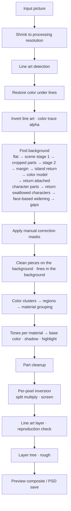

# Illustracy — Illustration Layer Separator

[한국어](README.md) | **English**

A program that takes a single finished illustration and **splits it back into many transparent layers**, the way it was painted, and saves them as a Photoshop file (PSD).

- One file (`index.html`): open it in a browser and it works.
- No installation, no internet connection, no cost.
- Your image never leaves your computer.

---

## Contents

1. [Quick start](#1-quick-start)
2. [Principles](#2-principles)
3. [How it works](#3-how-it-works)
4. [Algorithms and formulas](#4-algorithms-and-formulas)
5. [Correspondence with the physical world](#5-correspondence-with-the-physical-world)
6. [System (program structure)](#6-system-program-structure)
7. [Issues and fixes](#7-issues-and-fixes)
8. [Optimization](#8-optimization)
9. [Strengths](#9-strengths)
10. [Limitations](#10-limitations)
11. [Verification](#11-verification)
12. [Release history](#12-release-history)

---

## 1. Quick start

### What is this?

When you paint on a computer, you usually stack several sheets of transparent paper.
You put the colors on the bottom sheet, the shadows on the sheet above it, the shiny highlights above that, and the lines on top.
But once the finished picture is merged and saved as one image, those sheets are gone and only one sheet remains.

Illustracy looks at the merged picture and splits it back into sheets in the order the picture was painted.
Stacking the split sheets again looks the same as the original picture, so close that the eye cannot tell them apart.

### What does it split into?

The program's screen and the layer names in the PSD are in Korean. The Korean names are given in parentheses.

| Layer | What it holds |
|---|---|
| Rough (`러프 (추정)`) | A sketch made to look like the loose underdrawing. It is not in the original picture, so it is a guess, and it starts hidden |
| Line art (`선화`) | The lines of the picture |
| Color trace (`색 트레이스`) | The parts of the lines whose color differs (lines catching light, colored lines) |
| Base color (`밑색`) | The single flat color painted per part, such as hair, skin, clothes |
| 1st · 2nd shadow (`1차 그림자` · `2차 그림자`) | Darker areas laid over the base color. The 2nd is darker than the 1st |
| Highlight (`하이라이트`) | Areas painted brighter than the base color (hair sheen, etc.) |
| Shading · gradient (`명암` · `그라데이션`) | Areas that darken smoothly |
| Reflected light · rim light (`반사광` · `림라이트`) | Areas that brighten again inside a shadow, light along the edge of the body |
| Light · sparkle (`빛` · `반짝임`) | Glowing effects, sparkles in the eyes, stars |
| Background · background FX (`배경` · `배경 효과`) | The background behind the character, flecks of light floating over the background |
| Outer glow (`외곽 글로우`) | A neon band drawn around the character (only in pictures that have one) |

Each part gets its own folder, and the folder holds that part's base color · shadows · highlights.
If the program finds a face in the picture (also in PNGs with a transparent background), it names folders **eyes · skin · hair** (`눈` · `피부` · `머리카락`) from the colors around the face; the other folders are named by color (blue `파랑`, black `검정` …).

### What do I need?

- The single file `index.html` and a browser (Chrome, Edge, Firefox, Safari)
- That is all. No internet, installation, account, or cost.

### How to use it

1. Open `index.html` in a browser.
2. Drag an image onto the window, click the box at the top left to choose one, or paste a copied image with `Ctrl+V`.
   To try it first, click **Sample image** (`예제 그림`).
3. Wait a few seconds and the layer list appears on the right.
   - Circle button: turn that layer on or off
   - Click a layer name: change the blend mode and opacity, save only that layer as an image file
   - Double-click a layer name: rename it
   - **Eye button** above the list: clicking the open eye turns all layers and folders off at once and the icon changes to a closed eye. Clicking the closed eye restores the state from before.
     After turning everything off, turning one layer on also turns on the folders that contain it, so only that layer shows; turning a folder on shows the layers inside it
4. Click **PSD download** (`PSD 다운로드`) to save a file you can open in Photoshop. Names, opacities, and on/off states you changed in the list are saved as they are.

Zoom the picture in the middle with the mouse wheel and drag to move it.
With the buttons at the top you can switch between **Composite** (`합성`, the split layers stacked) · **Original** (`원본`) · **Selected layer** (`선택 레이어`, only the chosen layer) · **Difference ×8** (`차이 ×8`, places that differ from the original, emphasized 8×).

### Fixing wrongly split areas

Automatic splitting sometimes leaves a background object on the character side, or sends part of the character to the background.

- **Send to background** (`배경으로 보내기`): turn it on, then click or rub the object to move (table, chair, etc.) and it moves to the background. It does not drag neighboring parts across a line.
- **Return to character** (`캐릭터로 되돌리기`): rub a part that wrongly went to the background (a cropped hat, a sleeve, a leg) and it comes back to the character, and the picture is split again (a few seconds).
- For a large area, draw a **loop around** the part to move (end near the starting point) and the inside is handled at once. If the inside of the loop fills faintly, it was recognized as a loop.
- To undo, use the `↶` button or `Ctrl+Z`.
- While these two tools are on, pan the view with the right mouse button.

Your fixes remain when you change settings and split again, and are cleared when you open a new picture. Fixing does not change the stacked result, which stays identical to the original picture.

### Using it offline

1. Download `index.html` (open the file on GitHub and choose *Download raw file*, or download the repository ZIP).
   In the program you already have open, the top-left **⬇ Save program (for offline use)** (`⬇ 프로그램 저장 (오프라인 실행용)`) gives you the same file.
2. Double-click the downloaded file. Every feature works without an internet connection.

### Renaming layers in old PSDs

PSDs saved up to 0.34 have the line-color layer named `색트레스`. Drag such a PSD onto the window like a picture, or choose it with the top-left box (several at once also work),
and a PSD with the layer renamed to `색 트레이스` is saved right away under the same file name. Pixels · layer order · folders · clipping stay as they are, and the file never leaves the browser.
PSB files and files converted to 16 · 32 bits also work. If the file is already fixed, the program tells you there is no layer name to fix.

### Settings

| Setting | Meaning |
|---|---|
| Processing resolution | Shrinks the long side of the picture to this size for processing (default 2048px). Larger is more detailed but slower |
| Split large pictures at a reduced size · method · target size | Off by default (method · size stay disabled while off). When on, pictures whose long side is larger than the target size (default 1200px) are split at a reduced size. Turning it on or changing the method shows that method's explanation and verification results, and confirming splits again right away. **Reduce everything**: all stages at the reduced size (the PSD too). Results are similar to the original size in about half the time. **Find only background · faces at reduced size**: background · faces are found in the reduced picture and the layers are made at the processing resolution. Not recommended, since more pictures lose more of the character (11) |
| Line sensitivity | Higher treats fainter lines as lines too |
| Maximum line width | Dark areas thicker than this are treated as painted surfaces, not lines (0 = measure the line width from the picture automatically; the chosen value and the measured width are shown next to it) |
| Line color | Line art + color trace (default) / original line colors in one layer / a single black |
| Number of color clusters | How many colors to split the picture into at first |
| Base color merge strength | Higher groups more colors that differ only in brightness into the same part |
| Shadow threshold | Higher sends faintly darkened areas to the shadow layer too |
| Maximum sparkle size | Bright dots smaller than this are treated as sparkles (0 = automatic for the resolution) |
| Maximum number of parts | Maximum number of part folders (default 32). Small parts that overflow go into the "small parts" folder |
| Split painting into per-part folders | When off, base color · shadows · highlights become one layer each, without separating parts |
| Clip shadows · highlights to the base color | Keeps shadows and highlights from going outside the base color |
| Automatic flat background separation | Turns background detection on and off |
| Tilted picture (`기울어진 그림`) | Off by default. Turn it on for pictures that are strongly tilted overall (more than 45°) or lying on their side: faces are searched at several angles (0 · ±30 · ±60 · ±90°) and names · character folders · background rules follow the most face-like angle. The chosen tilt appears in the result line as "tilt N°". On upright pictures it finds slightly fewer faces and slightly more fake faces (82 ground-truth pictures: real faces 29/35 → 26/35, fake faces 15 → 17), so it is better left off for pictures that are not tilted. Pictures saved rotated, whose four corners are white · one color · transparent, are recognized without turning it on |
| Generate rough sketch · rough color | Whether to make the rough layer, and in what color to draw it |

### Pictures that work well, pictures that are hard

- **Works well**: anime-style pictures with lines and colors painted as clearly divided flat areas (cel shading)
- **Hard**
  - Pictures without lines, pictures with many brush strokes
  - Backlit · dark scenes, faces hidden by hands · objects, small pictures (long side under 900px)
  - Pictures whose background objects are drawn with lines as strong as the character's (snacks on the floor, props, etc.)
  - Pictures where character and background have almost the same color (black clothes + black background, white clothes · pale hair + white background, etc.)
  - Group pictures with many people, pictures with several panels in one image
  - Pictures strongly tilted (more than 45°) while filling the whole canvas with no corners: turn on the "Tilted picture" setting to improve faces · names · character folders. Around 45° it is often about the same with it on
- When a face is found, the eye · skin · hair parts get those names, and the other parts are named by color (blue, black …). Meanings such as "clothes" or "ribbon" are not known.

### Settings are chosen by measuring the picture

When you open a picture, the program measures the line (pen) width, and raises the **maximum line width** only for pictures whose lines the default value cannot hold.
For example, for a small picture drawn with thick lines it widens the line detection window. Ordinary pictures use the default values as they are.
The chosen value and the measured width appear next to the setting, like "Auto · 8 px (this picture 13 px)", and moving the slider changes it to that value.
The other settings were also tried as measured-from-the-picture values, but results got worse or did not improve, so they use defaults tuned on many pictures (7.5).

---

## 2. Principles

### 2.1 Follow the order in which artists stack layers

A cel-shading work file is usually stacked in this order.

```
Line art          ← top, lines
Light · sparkle   ← effects added brighter
Shading           ← soft shading
Highlight         ← surfaces brighter than the base color
Shadow            ← laid over the base color, darker
Base color        ← one color per part
Background
```

Each layer has a different **blend mode**.

- **Normal**: the upper color covers what is below (base color, highlight, line art).
- **Multiply**: darkens what is below, like stacked colored cellophane (shadow, shading).
- **Screen**: brightens what is below, like switching on another lamp (light, sparkle, rim light, reflected light).

Illustracy splits the picture so that the resulting file follows this structure.

### 2.2 Solve backwards so that the stack gives back the original

Every blend mode is a simple formula. So if you know "the color of the original picture" and "the base color · shadow color",
you can solve backwards, pixel by pixel, **what the remaining layers must contain for the original picture to come out**.

Countless layer structures produce the same picture. Among them, we pick one an artist would plausibly make.

- The base color is one color per part
- The shadow is also one color per part (1st, and a 2nd if needed)
- Only the difference that this one color cannot explain goes into the shading · light layers

Because even the last remaining difference goes into a layer, stacking the split result gives back the original.
The only error is the rounding when the file stores colors as integers 0–255.

### 2.3 A line is "something thin and darker than its surroundings"

Make a picture with the dark thin structures erased (filled with the bright colors around them) and compare it with the original: only the lines remain.
Thick dark surfaces (black clothes) are not erased, so they are not picked up as lines.

### 2.4 Guess the color hidden under a line from its surroundings

The color that would have been painted under a line is guessed by filling inward, one ring at a time, from the color just outside the line.
Knowing the color below, we can compute "at what opacity the line color covered it", so even the soft edge of the line (anti-aliasing) is expressed as transparency.

### 2.5 The background is separated with seven cues

1. **Connected to the border**: the background touches the picture border and continues without crossing the character's outline.
2. **Many or few lines**: characters and props are drawn with lines, while the background is often painted without lines.
3. **Sharpness**: the background is often painted blurred as if out of focus, so dark, crisp lines are rare.
4. **Color difference**: in pictures whose background is also drawn with lines, the background colors and the character colors are learned per picture to tell them apart.
5. **Crisp color edges**: arms · hands · sleeves painted softly without lines are still in-focus objects, so the color around them changes sharply.
   A piece that went into the background because it has few lines is returned to the character if it is cut off by such an edge, attached to the character, and its color is on the character side.
6. **Faces**: an anime-style face has two dark round eyes side by side with bright, even skin below. Finding a face tells roughly where the head and body are.
   Only places outside the head · body zones, clearly on the background side by color, and connected without a line to background already found are added to the background.
   The character is surrounded by its outline, so this does not spill into hair tips or sleeves whose color is close to the background.
   Conversely, if a clear face zone has become background, the character was swallowed whole by the background (pictures where the outline has the same color as the hair · background and cannot be seen),
   so background pieces inside that head · body zone are returned to the character.

7. **Enclosed by lines**: a character is surrounded on all sides by outline · clothing folds · hair strands, so even white clothes · skirts · flat-colored hair with no lines inside soon hit a line in any direction.
   The background is open to the outside of the picture without lines in at least a few directions. A place blocked by lines in almost every direction is not treated as background even if lines are sparse.
   However, on white · flat backgrounds, the background seen between the arm and the body or between strands of hair (gaps) is also surrounded by outlines; such places have exactly the background color
   and only lines and background around them, so they can be told apart from the character's white clothes (which touch shadows · shading around them) and are sent to the background.

The bottom border of the picture often cuts through the character (bust-up pictures), so it is not used as a starting point for finding the background.

### 2.6 Material boundaries have lines; shadow boundaries do not

In cel shading, a line is drawn between hair and skin, but not between the lit side of the hair and its shadow.
So areas that touch without a line and share a color family are treated as shading of the same material, and areas blocked by a line as different materials.

In brush-painted pictures, brush marks · hair strands are sometimes picked up as lines. Such strands are drawn over one color, so the color on both sides of the line is the same.
If most of the picture's lines are such strands, the strands are not treated as material boundaries. In line-art pictures, materials with nearly the same color, such as pale skin and pale hair, are also separated by lines, so lines are treated as boundaries as they are.

### 2.7 The widest color within a material is the base color

When the colors within one material are split again into a few tones, the tone painted over the widest area is the base color.
Tones clearly darker than it are shadows; clearly brighter ones are highlights.
How many times darker the shadow tone is than the base color, per channel, is exactly the **multiply color** of the shadow layer.

### 2.8 Brightened areas are classified by position and shape

Areas that are brighter than the base color · shadow can explain are split like this.

- Small, very bright, isolated dots → **sparkle**
- Light concentrated only along the edge of the character silhouette → **rim light**
- Areas that brighten again inside a shadow → **reflected light**
- The rest, widely spread brightening → **light**

### 2.9 The rough is built backwards from the finished picture

The rough no longer exists in the original picture, so it cannot be restored.
Instead it is made to look like an underdrawing a person loosely sketched in pencil.

- It is drawn with soft thick strokes following the width and darkness of the lines. Eyes · outlines with dark original lines become thick, faint lines thin.
- The strokes are jittered slightly and stacked three times so they look like pencil lines drawn over several times.
- So that faint lines do not break, the center line of each line is laid under the strokes. Small crumbs not connected to lines (sparkles · texture dots) are not drawn.
- It covers the character's lines and silhouette and even the brightness contours of the background, capturing the whole composition.

### 2.10 Adapt to the picture only when the defaults cannot cope

An artist draws lines with the same pen, so counting line widths concentrates on one width. Measuring this "pen width" tells the size of the window that holds the lines, regardless of the picture size.
However, the other stages of this program (such as the line density used by background detection) are tuned to the default window, so the value is changed only when the measurement clearly exceeds the default.

---

## 3. How it works



### 3.1 Preparation

The picture is shrunk to the **processing resolution** (default long side 2048px), and the computation runs in a browser **Web Worker** (a computing thread separate from the screen).
Where workers are unavailable, the computation runs on the screen side as is.

If the maximum line width is automatic (0), the picture is measured first. The pen width is found by counting the distribution of line widths along the center lines of thin structures darker than their surroundings,
and if the default window chosen from the resolution cannot hold these lines, the window is widened (4.3).

### 3.2 Line art detection

Applying a **closing** (a maximum filter followed by a minimum filter) to the brightness image fills dark structures thinner than the line width with the surrounding bright colors.
"Closing − original" (the **black top-hat**) is the depth of the line. Starting from pixels with a large depth, slightly weaker pixels are joined (**hysteresis**), and pieces that are too small are discarded.
Dark blobs wider than the closing window, such as crossings where lines meet, are filled by continuing from the lines, but dark surfaces that continue beyond the line width (black clothes) are not filled.

Lines that are dark and whose depth drops a lot when slightly blurred are marked separately as **crisp lines**. They are used to tell character lines from blurred background marks when separating the background.

### 3.3 Restoring the color under lines

The lines and their 1px edge are set as "unknown pixels" and filled ring by ring from the outside with the average of neighboring known pixels (onion-peel inpainting).

### 3.4 Line art and color trace

The median color of pixels almost fully covered by lines is the **base line color**.
For each pixel, "original = line alpha × line color + (1 − line alpha) × color below" is solved for the alpha,
and where the base line color does not reproduce the original (lines catching light, colored lines), the actual line color at that place is found separately and put into the **color trace** layer.
The color trace is clipped to the line art, so it only changes the line color within the line art's alpha.

### 3.5 Finding the background

Several methods are used in turn, and the backgrounds found are merged.
If a thin border line (a frame) runs around the edge of the picture, background detection cannot start from the border, so while the background is being found, the outside up to the frame's thickness is
filled with the color just inside it (4.5). This solved pictures with a thin border, such as character sheets and cards on white backgrounds, where the background could not be found.
For pictures saved tilted so that the canvas grew and the four corners are filled with one color (white, etc.) or transparency (**rotated canvas**), the fill is recognized,
the fill and 3px around it are filled with the value of the nearest picture content only while the background is being found, and at the end the fill is set as background (4.5, 0.37).
Even when the corners are transparent, the picture is not treated as a transparent-background picture, and the background is searched for. The straight edges of the fill also tell how many degrees the picture is tilted,
so faces are searched for at that tilt (4.5) and the bottom-border · upper-corner rules follow the actual bottom of the picture as determined by the faces.

1. **Flat · gradient background**: starting from the most common color on the border, it spreads to similar colors without crossing lines. It also follows gradients whose color changes gradually along the border.
   It spreads first from the top · left · right borders, and places reached only from the bottom border are set as background only when they are almost one color (white clothes · skirts reaching the bottom edge of the picture have shading even if they are as white as the background).
   The threshold for the color change between neighboring pixels was tuned on pictures with a long side of 1200px, and is reduced in proportion to size for larger pictures (because the color change across the same edge is split over more pixels; the same holds for margin widening in 5).
   If the reduced threshold finds too little background, it is redone with the original threshold.
   If the background found is bright and almost one color (white backgrounds · pale flat backgrounds), narrow gaps are closed and it is filled once more. Within 2px (for a 1200px long side) of lines and edges where the color changes sharply,
   the fill is not allowed through, so it does not get inside white clothes · pale hair through breaks in a pale outline, and after filling it is restored toward the edges by that much (4.5, 0.34).
2. **Scene background stage 1**: places with low line density (line pixels widely blurred) that are connected to the top · left · right borders.
   However, places enclosed by lines (15 or more of 16 directions blocked by a line within 25% of the long side, 4.5) are excluded even if lines are sparse.
   The widely blurred line density drops as low as the background in the middle of lineless white clothes · skirts · flat-colored hair, but the degree of enclosure does not drop.
   Pictures where excluding enclosed places leaves the scene background below the area criterion (5 below) (pictures drawn densely with lines over the whole screen) are redone through 1–5 without excluding enclosed places.
   The scene background does not cross places at the edge of the flat background (1 above) where the color changes sharply (4.5, 0.37). When black stockings · black clothes · dark hair,
   whose outline has the same color as the clothes and so is not picked up as a line, touch a white background, the scene background following places with few lines used to get right inside them.
3. **Picking out cropped character parts**: walking along the border, a piece wedged between background pieces with a crisp outline in between, and clearly different in color from its neighbors on both sides, is taken as a character part cropped by the frame (hat, sleeve) and returned.
4. **Scene background stage 2**: it widens into places with no crisp lines but dense faint marks (blurred shelves, writing, patterns).
5. **Margin**: the margin around the character is widened, without crossing lines, as far as the color continues smoothly. It does not widen into places enclosed by lines.
   Then swallowed characters are returned (8 below), and it is used as scene background only if the remaining area is 2–90% of the picture.
   **Returning islands in the scene background** (4.5, 0.38): in pictures with a flat background (1 above), the program checks whether each lump of the scene background whose color differs from the flat background (an island)
   touches the top · left · right borders. An island that does not touch them is a place the scene background entered only through the flat background — lineless clothes · legs · hair that leaked
   out through weak edges at the flat background's edge. Such an island is returned to the character if it is connected to a large lump on the character side (at least a quarter of the largest lump) or contains a face.
   Text · emblems · sparkles floating apart from the character form small lumps and remain in the background.
6. **Color model**: for pictures whose background is also drawn with lines (fireworks, food stalls, graffiti), the picture is split into small color regions,
   the color distributions of "the background found so far" and "the character core dense with crisp lines" are learned, and regions are separated (graph cut in the GrabCut style).
   It is skipped for pictures whose colors overlap a lot and for pictures whose background was already fully found, and it only adds to the background found so far, never removes. Regions enclosed by lines are not added.
7. **Returning attached character parts**: the background found in 1–5 (before returning in 8 below) is cut at crisp color edges and lines into pieces.
   Pieces that do not touch the top · left · right borders, have 80% or more of their perimeter touching the character, and whose color is closer to the character than to the rest of the background are
   returned to the character (arms · hands · sleeves · wings painted without lines). The color model is computed with the background before returning, and the returned parts are also removed from the background added by the color model.
8. **Returning swallowed characters**: if more than a quarter of the face zone or the crown cell of a high-scoring face (4.5) is background, the background has swallowed whole a character whose outline cannot be seen
   (black hair · clothes whose outline has the same color as the hair, dark outlines on a dark background). The background is cut at crisp color edges and lines, and pieces that
   lie at least half inside that face's head · body zone, do not touch the top · left · right borders, and whose color is rare in the border-side background are returned to the character.
   If a swallowed face still remains (hair almost the same color as the background), it is split once more with fainter color edges, and if it still remains, with even fainter edges and finer color bins (0.34).
   This is done twice: in the scene background stage (after 5) and after the color model (after 7).
   Even if a face is intact, background pieces that lie at least half inside the body zone below it are returned first (white clothes · skirts on a white background connected with the background down to the bottom border).
   Here the color does not need to be rare, but pieces whose color is far more common in the rest of the background than in the character (background seen between a skirt and a sleeve, text boxes) are kept.
9. **Face-based widening**: when anime-style faces are found in the picture (4.5), the places where the head and body should be for each face are set as "probability of being character", and the same region graph cut as the color model is run again.
   Of the regions that end up on the background side, only those whose color is clearly on the background side, that are outside the head · body zones, and that connect to background already found only through lineless boundaries (at least half of the shared length is not a line)
   are added to the background. Parts returned in 7 · 8 and regions enclosed by lines are not taken, and background already found is never removed. It is skipped for pictures where no face was found.
   It is also skipped if the background already found is almost one color (white backgrounds · flat backgrounds, 60% or more of background pixels similar to the median color).
   Such backgrounds were already almost fully found by 1–8, and widening took same-colored character parts (white dresses, black hair) more often (0.27 in 12).
10. **Background seen between character parts (gaps)**: if the background found is almost one color (white backgrounds · flat backgrounds), pieces left on the character side whose color is almost the same as the background (within `ΔE` 5) are examined.
   Pieces surrounded only by lines · background (10% or less of the perimeter touching other paint), outside the head zone of faces, and at most 2% of the picture are the background seen between the arm and body · between strands of hair · between the legs,
   so they are sent to the background. Such places have outlines on every side, so 1–9 cannot reach them, and they were deliberately protected because they are enclosed by lines (0.31).
   White clothes · white hair touch shadows · shading and remain. It is skipped for pictures where qualifying pieces exceed 5% of the character's paint (white-paint monochrome line art, white clothes on a white background)
   and for pictures where 30% or more of the character-side pixels are lines (particles · halftone dots picked up as lines) (4.5).

Faces are also searched for in pictures where the background was not searched (background separation off, transparent-background PNG) or not found, and are used for part names and character splitting.
For transparent-background pictures, transparent places are treated as background and the "face-like position" condition of 4.5 is checked.

When "Find only background · faces at reduced size" of the setting "Split large pictures at a reduced size" is on, 1–9 and face finding run on the picture with the long side reduced, and the background found · returned parts · faces are enlarged back to the original size (4.5).

Then the corrections the user painted (send to background / return to character) are applied with priority over the automatic decisions.
For pictures where no background was found, a background layer appears only once send-to-background is painted.

### 3.6 Cleaning pieces on the background and lines in the background

- Small pieces surrounded by background (particles, fragments of light rays) are not character parts; the background color below is guessed from the surroundings and they are split into **background + background FX (screen)**.
  Character parts returned from the background and parts the user returned to the character are not put here even if small.
- Faint marks absorbed into the background, lines of the background picture far from the character (window frames, clouds), and "lines" of the background color (background gaps seen between light rays) are removed from the line art and left in the background picture.

### 3.7 Region splitting and material grouping

The picture with the color under lines restored is split into a few colors (default 18) with **k-means** in Lab color space, and connected lumps of the same color become **regions**.
Regions that are too small or thin (edge bleeding) are discarded and filled from nearby regions.
Places set as character by background detection that are more than 2.5px away from the background do not take a background label and are filled from nearby character regions
(on textured paper · fine brush strokes, colors broke into small pieces so wide paint was discarded whole and background labels spread in, turning the character into background).
Background sent as gaps (10 in 3.5) lies in the middle of the character, so its label can spread far into the character along lines. Line · crumb pixels whose nearest background is a gap
get a nearby character label instead of the background label if they are more than 2.5px away from the gap (both regions and tones, 4.6).
For each pair of touching regions, the boundary length blocked by lines and the length open are counted to build an **adjacency graph**,
and if the boundary is mostly open and the colors are in a shading relationship of the same material, they are grouped into one material.
In pictures where brush strands are picked up as lines (more than half of the lines have the same color on both sides), line boundaries with the same color on both sides are counted as open boundaries (4.6).

### 3.8 Tones and base color

Each material is split again into tones (up to 6) with k-means. The bright-side average of the widest tone (the brighter one if areas are similar) is the **base color**.
Same materials separated by a line (front hair / back hair) have their base colors matched to each other.

### 3.9 Part cleanup

The number of parts is reduced, like a real work file.

1. Nearly identical base colors become one part
2. A darker surface across a line is merged if it is plausible as the shadow of the brighter part (a pale purple strand next to white hair).
   A shadow cannot be brighter than the lit surface in any channel, and if the lit surface has a hue, the shadow must be near that hue (apricot skin next to gray clothes, pink skin next to cream clothes are not merged)
3. Small pieces go to a neighboring part of similar color
4. If parts exceed the **maximum number of parts**, the smallest are merged into a neighbor of similar color first, and if there is no similar neighbor, into the **small parts** folder
5. **Naming**: for each character face, the face frame finds the parts occupying the bridge of the nose · cheeks (skin), the bangs (hair, above it if the forehead is exposed), and the two eye cells (eyes), and gives them those names (4.8).
   The remaining parts are named by the color name of the base color (black, white, blue …). "Skin" is given only to parts confirmed by a face; other skin-toned parts are called "beige · apricot" even in pictures where no face was found.
6. **Splitting off detached hair pieces**: a part collects the same base color from the whole picture, so skirts · legs · sleeves · props · background pieces with the same color as the hair are also in the "hair" part.
   Only places connected along the same part from the head zone of a face, and pieces close to it (within 2.5 times the distance between the two eyes of the face), stay "hair",
   and the rest are split off into a separate part of the same color (color name). Long hair · twin tails broken by arms · sleeves stay because they are close, while ties · ribbons · legs in the middle of the body are split off even if close.
   Skin is not split, since detached skin pieces are mostly real hands · arms · legs. The layer pixels do not change; only the part layers are divided (4.8).

### 3.10 Shadow levels and highlights

Tones clearly darker than the base color are shadows. The shadow tones are lined up by brightness and split into **1st / 2nd** where the gap opens wide.
One multiply color is chosen per level (the 2nd is a color multiplied once more on top of the 1st).
Tones clearly brighter than the base color are highlights (normal layer), and small tone pieces that are almost white and much brighter are sparkle candidates.

### 3.11 Inversion: splitting shading and light

For each pixel, the color painted up to "base color × 1st × 2nd → highlight" is compared with the restored color under the lines.

- If darker, the remaining **darkening** is split into a widely laid part (**gradient**) and the rest (**shading**). Both are multiply, so multiplying them gives the original darkening.
- If brighter, the remaining **brightening** is peeled off in the order sparkle → rim light → thin sparkle → reflected light → light. It is split so that the screens stacked together equal the original brightening.

Layers with almost no content are not made (for example, the gradient in cel-shaded pictures). Their share is left in shading · light.

### 3.12 Line art layer, check, layer tree, rough

After making the line art · color trace layers, all layers are composited again **with the exact 8-bit values that will be saved** and compared with the original (reproduction PSNR, shown at the top right of the screen).
The layers are grouped into the tree of a work file, and the rough is made and hidden at the very top.

```
Rough (estimated)                 normal 45%, hidden
[Character]
  [Line art]
    Color trace                   normal, ↳clipping
    Line art                      normal
  [Effects]
    Sparkle                       screen
    Light                         screen
  [Painting]
    Rim light                     screen
    Reflected light               screen
    Shading                       multiply
    Gradient                      multiply
    [Skin] [Hair] [Purple] …      part folders (eyes · skin · hair, the rest named by base color)
      Highlight                   normal, ↳clipping
      2nd shadow                  multiply, ↳clipping
      1st shadow                  multiply, ↳clipping
      Base color #7B56B5          normal
    [Small parts (n)]             small parts with no neighbor of similar color
    Silhouette (for selection)    normal, hidden
[Background]
  Background FX                   screen
  Outer glow                      normal (only pictures with a neon band around the character)
  Background                      normal
```

For opaque pictures with no background, [Line art] · [Effects] · [Painting] come at the top without the [Character] · [Background] folders.

**With several characters**, instead of [Character], folders [Character 1] · [Character 2] … are made from the left, each containing the same [Line art] · [Effects] · [Painting] as above.
Characters are determined from the faces found. Faces of similar size and height that lie outside each other's body zone are taken as characters (fake faces found on knees · shoes are left out),
and pixels are divided starting from each face's head · body zone, using outlines as walls (4.8). The composited result of the layers is the same as with one folder.

### 3.13 Preview and PSD saving

The preview stacks the layers with the blend modes of the browser canvas (multiply, screen) and imitates clipping the same way Photoshop does.
The PSD is written directly without external libraries (RGB 8-bit, folders, clipping, blend modes, Korean layer names, merged image).

### 3.14 Manual correction

- **Send to background**: within the part the stroke touched and parts of almost the same color, places where the color continues without crossing a line are chosen
  and moved into the background layer with the original color as is, and erased from the character-side layers. So the composite equals the original without splitting again.
- **Return to character**: places connected in the background without crossing a line are marked "this is character" and the picture is split again.
- Both corrections remain as marks (masks) the size of the picture, and are applied before the automatic decisions even when options are changed and the picture is split again.
- When splitting again after a correction, the automatic background decision (background finding · face finding, usually 2–4 seconds per picture) is not redone; the saved result is used.
  This stage does not depend on the corrections and does not change the lines · restored colors, so the result is byte-for-byte the same as computing from scratch. Changing the picture or the line settings (line width · sensitivity · line color method · background separation) recomputes it.

---

## 4. Algorithms and formulas

### 4.0 Notation

- Pixel values are sRGB values in 0–1 (8-bit value ÷ 255). The original is `O`, the alpha `A`, the restored color under lines `U`, and the channel `c ∈ {R, G, B}`.
- Brightness is `lum(r, g, b) = 0.299r + 0.587g + 0.114b`.
  The brightness used for finding lines is the brightness of the color laid on white, `L = lum(A·O_R + 1 − A, A·O_G + 1 − A, A·O_B + 1 − A)`.
- **Processing resolution**: for the long-side limit `M` (default 2048, 0 means original size), `k = min(1, M / max(w₀, h₀))`, `W = max(1, round(k·w₀))`, `H = max(1, round(k·h₀))`,
  using the browser's high-quality downscaling. `N = W·H`. If the limit is 0 and the original exceeds 16 million pixels, a warning is shown.
- **Transparent picture**: if more than `0.001N` pixels have `A < 0.98`, the picture is treated as transparent. Pixels with `A ≤ 0.02` are empty.
- `s = max(W, H) / 1000` is the scale factor for picture size (multiplied into length reference values).
- `clamp(x) = min(1, max(0, x))`, and `smoothstep(a, b, x)` is `t²(3 − 2t)` for `t = clamp((x − a)/(b − a))` (a descending curve when `a > b`).
- Color difference `ΔE` is CIE76 (Euclidean distance in Lab). Hue angle difference is `Δh = min(d, 360° − d)` for `d = |h₁ − h₂| mod 360°`.
- The percentage sliders in the settings (line sensitivity `η`, base color merge strength `m`, shadow threshold `η_s`) become 0–1 as `value / 100`.
- `round` is the nearest integer (0.5 rounds up); `⌊ ⌋` · `⌈ ⌉` are floor · ceiling.

### 4.1 Color space

sRGB is linearized, then converted to Lab via XYZ (D65).

```math
C_{lin}=\begin{cases}C/12.92 & C\le 0.04045\\ \left(\frac{C+0.055}{1.055}\right)^{2.4} & \text{otherwise}\end{cases}
\qquad
L^*=116f(Y)-16,\; a^*=500\,(f(X/X_n)-f(Y)),\; b^*=200\,(f(Y)-f(Z/Z_n))
```

```math
f(t)=\begin{cases}t^{1/3} & t>0.008856\\ 7.787\,t+16/116 & \text{otherwise}\end{cases}
```

From linear RGB to XYZ the sRGB (D65) matrix is used, with reference white `X_n = 0.95047, Y_n = 1, Z_n = 1.08883`.

```math
\begin{pmatrix}X\\Y\\Z\end{pmatrix}=
\begin{pmatrix}0.4124564&0.3575761&0.1804375\\0.2126729&0.7151522&0.0721750\\0.0193339&0.1191920&0.9503041\end{pmatrix}
\begin{pmatrix}R_{lin}\\G_{lin}\\B_{lin}\end{pmatrix}
```

Linearization is precomputed as a 256-entry table of 8-bit values (`C` into bin `round(255C)`). Chroma `C* = √(a*² + b*²)`, hue angle `h = atan2(b*, a*)` (in degrees).

**Lab → sRGB** (when recovering, from a k-means center, the color of a tone that has no samples):

```math
f_y=\frac{L^*+16}{116},\ f_x=f_y+\frac{a^*}{500},\ f_z=f_y-\frac{b^*}{200},\qquad
f^{-1}(t)=\begin{cases}t^3 & t^3>0.008856\\ (t-16/116)/7.787 & \text{otherwise}\end{cases}
```

```math
\begin{pmatrix}R_{lin}\\G_{lin}\\B_{lin}\end{pmatrix}=
\begin{pmatrix}3.2404542&-1.5371385&-0.4985314\\-0.9692660&1.8760108&0.0415560\\0.0556434&-0.2040259&1.0572252\end{pmatrix}
\begin{pmatrix}X_n f^{-1}(f_x)\\ f^{-1}(f_y)\\ Z_n f^{-1}(f_z)\end{pmatrix},\qquad
C=\begin{cases}12.92\,C_{lin} & C_{lin}\le 0.0031308\\ 1.055\,C_{lin}^{1/2.4}-0.055 & \text{otherwise}\end{cases}
```

(`C_lin` is clipped to 0–1 before applying the gamma.) The color comparison of the manual correction tools (4.17) uses Lab from the same formulas.

### 4.2 Basic operations

- **Dilation / erosion** (square of radius `r`): `dilate_r(f)(x, y) = max_{|i|, |j| ≤ r} f(x + i, y + j)` (erosion is min; outside the picture is dropped from the window).
  The 1-D sliding max / min split into rows and columns is computed with a **monotonic deque**, `O(1)` per pixel. **Closing** is dilation then erosion; **opening** is erosion then dilation.
- **Gaussian blur**: approximated by repeating a box blur of radius `r` (width `2r + 1`, repeating edge values outside the picture) three times horizontally and vertically.
  One box pass has variance `((2r + 1)² − 1)/12 = r(r + 1)/3`, so three passes give `r(r + 1) = σ²`, which solves to
  `r = max(1, round((√(4σ² + 1) − 1)/2))`. If `σ < 0.3`, there is no blur.
- **Inpainting**: unknown pixels are visited in order of distance from known pixels (outer rings first) and filled with the average of the 8-neighbors already settled one ring further in.

  ```math
  U(p)=\frac{1}{|\mathcal N_p|}\sum_{q\in\mathcal N_p}U(q),\qquad \mathcal N_p=\{q\in 8\text{-nbr}(p):\ \text{ring}(q)<\text{ring}(p)\}
  ```

- **Label filling**: unlabeled pixels are visited in order of distance and filled by a majority vote of the settled 8-neighbor labels (4-neighbors get 2 votes, diagonals 1).
- **Connected component**: a lump of equal values connected by 4-neighbors. The **perimeter** is the sum, over the pixels of the component, of the number of 4-neighbor sides that belong to another component (or lie outside the picture).
- **Distance transform** (chamfer): two sweeps (top → bottom, bottom → top) with weight 1 for a horizontal · vertical step and `√2` for a diagonal step approximate the distance to the nearest marked pixel.

  ```math
  d(p)=\min\big(d(p),\ d(q)+w_{pq}\big),\qquad w_{pq}\in\{1,\sqrt2\}
  ```

  Where it says "within so many steps", it means the number of steps of a 4-neighbor breadth-first search (Manhattan distance).
- **k-means** (squared Lab distance): `M = min(n, M_max)` samples are drawn (with replacement if `n > M_max`); with **k-means++** the first center is uniform and each next center is drawn with probability proportional to the squared distance `D(x)²` to the nearest center so far.
  Assignment → mean update runs up to 18 times, stopping from the 4th iteration on when fewer than `0.001M` samples change assignment. An empty cluster is moved to the farthest sample.
  `M_max` is 50000 for region splitting, 40000 for the region graph of the color model, and 6000 for tones per material.
- **Random numbers**: fixed-seed mulberry32 so results are the same every time (main computation 12345, region graph of the color model · face stage 777). With 32-bit integer arithmetic,
  `s ← s + 0x6D2B79F5`, `t = (s ⊕ s≫15)·(s | 1)`, `t ← t ⊕ (t + (t ⊕ t≫7)·(t | 61))`, random number `= (t ⊕ t≫14) / 2³²` (`≫` is the unsigned right shift).
- **Value noise** (jitter of the rough): a random number `g` in `[−1, 1]` at each grid point with spacing `cell`, blended within a grid cell with `sx = smoothstep(0, 1, tx)`, `sy = smoothstep(0, 1, ty)`.

  ```math
  n(x,y)=\big(g_{00}+(g_{10}-g_{00})s_x\big)(1-s_y)+\big(g_{01}+(g_{11}-g_{01})s_x\big)s_y
  ```

- **Bilinear interpolation**: with `x₀ = ⌊x⌋, t_x = x − x₀` (same vertically), `f = f₀₀(1 − t_x)(1 − t_y) + f₁₀t_x(1 − t_y) + f₀₁(1 − t_x)t_y + f₁₁t_x t_y`.
- **Resizing** (for face finding, horizontal · vertical separately): if the ratio `r = n / m` (original cells / new cells) is at least 1, the **area average** of the original interval `[ir, (i + 1)r)` covered by new cell `i`;
  if below 1, **linear interpolation** at `x = (i + 0.5)r − 0.5`.
- **Percentile**: for ascending `s₀ … s_{n−1}`, `x = (n − 1)q / 100`, `k = ⌊x⌋`, value `s_k + (s_{k+1} − s_k)(x − k)` (the median is `q = 50`). The **standard deviation** is the population standard deviation divided by `n`.
- **z-normalization**: `z = (a − mean) / standard deviation` (all 0 if the standard deviation is at most `10⁻⁶`).

### 4.3 Line art detection

The brightness `L` is closed with the line width limit `w` (default `w₀ = max(3, round(4s))`, or the automatic setting below, or the set value).

```math
\mathcal{C}=\mathrm{erode}_w(\mathrm{dilate}_w(L)),\qquad d=\mathcal{C}-L,\qquad
\mathrm{strength}=\min\!\left(\frac{d}{\mathcal{C}},\frac{d}{0.3}\right)\quad(\mathcal{C}>0.02,\ d>0)
```

The hysteresis thresholds come from the line sensitivity `η ∈ [0, 1]` (default 0.5):

```math
t_{high}=0.58-0.34\,\eta,\qquad t_{low}=0.45\,t_{high}
```

Starting from pixels with `strength ≥ t_high`, it grows into 8-neighbors with `strength ≥ t_low`, and pieces smaller than `max(4, round(6s))` pixels are discarded.
`strength` is the smaller of "how dark compared with the surrounding bright paint (`𝒞`)" (`d/𝒞`) and "how dark in absolute terms" (`d/0.3`), so it filters both shallow bumps on dark paint and faint noise on bright paint.

**Filling crossings**: starting from lines, up to `w + 1` steps, it grows into pixels not brighter than the starting line's brightness `L_ref` by 0.05 or more and with `L ≤ 0.5`.
Grown lumps that reach the end of the `w + 1` steps (dark surfaces continuing beyond the line width) are discarded, and the rest are added to the lines.

**Crisp lines**:

```math
d>0.02,\qquad \mathrm{strength}\ge 0.45,\qquad \frac{G_{1.5}(L)-L}{d}\ge 0.25
```

`G_σ` is a Gaussian blur. The third condition means "a thin line that loses 25% or more of its depth when slightly blurred".

The lines and their 1px 8-neighbors are `inMask`, and the remaining pixels with `A > 0.02` are `known`.

**Automatic setting (when the maximum line width is 0)**

**Pen width**: `strength` as above is computed with a generous window `R_b = max(8, round(12s))`, and in the distance transform `D` (chamfer) of structures with `strength ≥ 0.5`,
the width `2D − 1` (≥ 1.8) is counted at each 4-neighbor local maximum (`D(p) ≥` the `D` of its four neighbors, a center line). In the histogram `h` (0–63) of widths rounded into 1px bins,
the width among `w = 2 … 59` with the largest `Σ_{|k − w| ≤ max(1, round(0.2w))} h_k` is the peak `m`,
and the `⌊0.9(n − 1)⌋`-th value (one decimal) of the widths at most 3 times `m`, in ascending order, is the pen width `w₉₀`. It is not measured if there are fewer than 150 center points.

```math
w=\begin{cases}\min\big(16,\ \lceil w_{90}/2\rceil+1\big) & \lceil w_{90}/2\rceil+1\ \ge\ w_0+2\\ w_0 & \text{otherwise}\end{cases}
```

### 4.4 Line alpha and line color

Pixels covered by lines must satisfy the normal compositing formula.

```math
O_c=a\,K_c+(1-a)\,U_c
```

- **Single black** (`K = 0`): `a = clamp(1 − lum(O)/lum(U))` (0 if `lum(U) ≤ 0.01`)
- **Original line colors in one layer**: `a = clamp(max_c(1 − O_c/U_c))` (only channels with `U_c > 0.004`), `K_c = clamp((O_c − (1 − a)U_c)/a)`
- **Line art + color trace** (default):
  1. The base line color `K⁰` = per-channel median of the original colors of line pixels with alpha 0.85 or more (the first bin where the cumulative count reaches half, in the 256-bin 8-bit histogram)
  2. The least-squares alpha given a line color `K` (the `a` minimizing `Σ_c (O_c − (aK_c + (1 − a)U_c))²`; 0 if the denominator is at most `10⁻⁵`)

     ```math
     a(K)=\mathrm{clamp}\!\left(\frac{\sum_c (U_c-O_c)(U_c-K_c)}{\sum_c (U_c-K_c)^2}\right)
     ```

  3. At pixels with `a(K⁰) ≥ 0.5`, the actual line color `K_c = clamp((O_c − (1 − a)U_c)/a)` is computed and inpainted over the whole line area (`inMask`) to get a smooth line color `K̃`.
  4. If `ΔE(K̃, K⁰) ≤ 6` and the residual of compositing with `K⁰` is at most 8/255 per channel, it is line art (base line color); otherwise it is color trace.
  5. The color trace alpha is taken at or above the **minimum alpha** at which the original is reproduced exactly by a line color within 0–1.

     ```math
     a_{min}=\max_c\left\{\,1-\frac{O_c}{U_c}\ (U_c>0.004),\ \ \frac{O_c-U_c}{1-U_c}\ (O_c>U_c,\ U_c<0.996)\right\},\qquad a=\max(a(\tilde K),a_{min})
     ```

     The color trace color of that pixel is `K_c = clamp((O_c − (1 − a)U_c)/a)`. `1 − O_c/U_c` is the minimum alpha that keeps the line color from going below 0, and `(O_c − U_c)/(1 − U_c)` the minimum alpha that keeps it from going above 1.
  6. If the alpha sum of color trace pixels is less than 0.3% of the total line alpha sum, no color trace layer is made, and those pixels also go into the single line art layer with `a(K⁰)` and `K⁰`.

Pixels with alpha at most 0.02 are treated as not lines, and their restored color is reset to the original.

### 4.5 Background

**Find at reduced size (setting, off by default)**: with "Find only background · faces at reduced size" and `max(W, H) > S` (the target size), the background stages below and face finding alone run on a picture with each channel area-averaged down by `k = S / max(W, H)`
(the line width is the user's chosen value times `k`, or measured again on the reduced picture if automatic). The background · returned-part maps are enlarged back to the original size bilinearly and turned on where `≥ 0.5`,
but on the original-size lines (+ 1px edge) only where the enlarged value is 1. Faces have their position · size multiplied by `1/k`.
"Reduce everything" is the same as lowering the processing resolution to `min(processing resolution, S)`.

**Frame**: let `κ(d)` be the share of `known` pixels on the ring around the border (the ring at depth `d` = the perimeter of the rectangle `d`px in from the edge).
If `κ(0) < 0.05` and the long and short sides are larger than 16px, the first `d` in `d = 1 … max(3, round(0.01 · max(W, H)))` with `κ(d) ≥ 0.5` is the frame thickness `f`.
If `f > 0`, only during the background stages (everything below, and face finding), each pixel within `f`px of the edge has its `U`, original, `known`, line, crisp line, and `inMask` replaced by the values of the nearest
inner pixel (`(clamp(x, f, W − 1 − f), clamp(y, f, H − 1 − f))`), restored at the end. Not done for transparent pictures.
3 of the 666 pictures had `κ(0) < 0.05`, and a frame was found in 2 of them (`f` = 2px).

**Rotated canvas** (0.37):
1. If at least three of the four corner pixels are the same fill, it is treated as a fill: at least three transparent (`A ≤ 0.02`), or at least three opaque (`A ≥ 0.98`) with mutual `max_c` difference `≤ 4/255`.
   `F₀` is taken by following pixels equal to the fill from the corners with 4-neighbors.
2. For each row `y`, the first · last `x` not in `F₀` (`x_l(y)`, `x_r(y)`), and for each column `x`, the first · last `y` (`y_t(x)`, `y_b(x)`) are collected.
   For a rotated rectangle, `x_l` is two straight lines bending at its minimum, and `x_r` two straight lines bending at its maximum (likewise `y_t`, `y_b`).
   For each bend candidate (the minimum · maximum and 15 evenly spaced positions), both sides are fitted with least-squares lines, points deviating more than `τ = 1.5 + 0.002 · max(W, H)`px from the line are removed, and it is refitted twice.
   The candidate with the most fitting points (within `τ`) is chosen, and if fewer than 85% of points fit, it is not a rotated canvas (white paint touching the picture edge connects to the fill and becomes deviating points).
3. Content = pixels with `max(l₁(y), l₂(y)) − 0.5 ≤ x ≤ min(r₁(y), r₂(y)) + 0.5` and `max(t₁(x), t₂(x)) − 0.5 ≤ y ≤ min(b₁(x), b₂(x)) + 0.5`; the fill region `F` = the rest.
   It is used only if `F` is 1–70% of the picture and at least 97% of `F` is actually the fill color.
4. Tilt `θ`: the direction angles `α` of the eight lines (for row ends, from the slope `m = dx/dy`, `α = atan2(1, m)`; for column ends, `α = atan2(m, 1)`) are averaged as quadrupled angles, `θ = ¼ · atan2(Σ sin 4α, Σ cos 4α)` (−45°–45°, clockwise positive).
   The rectangle's sides alone cannot distinguish `θ` from `θ ∓ 90°`. If `|θ| < 1°` (untilted margins · letterboxes), it is not used.
5. Only during the background stages (everything below, and the stages after face finding), each pixel of the band `B = F ⊕ 7×7` (`F` widened by 3px: mixed colors · outliers at the boundary created by rotation) has
   its `U`, original, alpha, `known`, line, crisp line, and `inMask` replaced by the values of the nearest pixel outside `B` by 4-neighbor breadth-first search, restored at the end.
   Then `F` is set as background (removed from returned parts). Even with transparent corners, the background is searched for, and "send to background" also works. The background layer's alpha is the original alpha (255 as is for opaque pictures).
6. Faces are searched for in the picture before filling.

**The picture's down direction** (0.37): when there is a tilt hypothesis (rotated canvas or the "Tilted picture" setting), the down directions `f` of the naming faces (mirror-agreed) are averaged with weights `w = max(0, s − 10)²`,
and if `ḡ = Σ w f / Σ w` has `|ḡ| ≥ 0.8` (the faces agree) and is tilted more than 40° from vertical, `g = ḡ / |ḡ|` is used as the down direction.
- For the outward direction `n` of a border pixel (top `(0, −1)` · right `(1, 0)` · bottom `(0, 1)` · left `(−1, 0)`, both at corners), the side with `n · g ≥ 0.5` is the "bottom" border.
  The bottom-border rule of the flat background (1) and the seeds of the scene background (stage 1 starts without the "bottom" border) use this border.
- The "upper corners" excluded when restoring cropped parts are the corners with corner direction `(s_x, s_y) ∈ {±1}²` satisfying `(s_x g_x + s_y g_y) / √2 < −0.4`.
- 40° is larger than the maximum tilt of faces found without a tilt hypothesis (pair filter `|Δy| ≤ 0.8Δx`, 38.7°), so it is never used for upright pictures without a tilt hypothesis.

**Flat · gradient background**

1. The `known` pixel colors on the border are counted in per-channel 16-level bins `q(U) = 256⌊15.99U_R⌋ + 16⌊15.99U_G⌋ + ⌊15.99U_B⌋` (4096 bins), and the average of the fullest bin is the reference color `r`.
   It gives up if there are fewer than 16 `known` border pixels, or if fewer than 45% of them have `max_c|U_c − r_c| < 0.1`.
2. Starting from border pixels with `max_c|U − r| < 0.12`, it spreads into `known` pixels with neighbor-to-neighbor change `< 0.035 · k` and difference from the starting reference color `< 0.3` (each pixel carries its own reference color while spreading).
   `k = min(1, 1200 / max(W, H))` is the size ratio (1 for a long side of 1200px or less). If `k < 1` and the area condition of 4 fails, 1–4 are redone with `k = 1`.
   It spreads first from the top · right · left borders and then from the bottom border; among 4-connected components newly reached only from the bottom border, those with 5% or more pixels having `max_c|U − r| > 0.04` are removed from the background.
   White clothes · skirts reaching the bottom edge of the picture have shading · folds even if as white as the background, while a white floor · margin on the bottom border is almost one color.
3. Walking along the border (the path going once around top → right → bottom → left) twice in both directions, `known` pixels within 64 cells of the last background pixel on the path and with `max_c` difference `< 0.05` from its color
   are added as new seeds (their own color as reference) and it spreads again with tolerance 0.12 (until there are no new seeds, at most 3 times). The walk is broken when it meets a line (a pixel that is not `known`).
4. It is used only if the area is 3–97% of the whole.
5. **Closing narrow gaps** (0.34): if the background found by 1–4 is bright and almost one color (median `L*` of at most about 20,000 background `known` pixels `≥ 70`,
   share within `ΔE < 10` of that median color `≥ 0.6`, the same formula as "almost one color" in face-based widening), 1–4 are redone with the same thresholds,
   but it does not spread into `dilate_g(B)`, the wall `B = ¬known ∨ (change to the right · lower neighbor ≥ 0.035k)` dilated by `g = max(2, round(2 · max(W, H)/1200))`.
   After spreading, `known` pixels up to `g + 1` steps from the background are restored with the original spreading conditions (neighbor change `< 0.035k`, `< 0.3` from the reference color).
   The fill cannot cross outlines broken by `2g` or less (faint lines, anti-aliasing gaps), and the background around the walls is filled again by the restoration.
   If the redone result fails the area condition of 4, the first result is used.
   For scene · patterned backgrounds, single-step color differences become walls here and there and the fill breaks up, and for dark one-color backgrounds (night scenes), background objects beyond the closed gaps return to the character, so it is not done (7.5).

**Scene background**

Line density is the value blurred with `σ = 0.02 · max(W, H)`. If line pixels are fewer than `0.002N`, the scene background is not searched for.

**Degree of enclosure by lines** `ε(p)`: the line map is reduced to `S = 240` cells on the long side (`w = max(2, round(240W / max(W, H)))`, `h` likewise;
pixel `(x, y)` falls in cell `(min(w − 1, ⌊xw/W⌋), min(h − 1, ⌊yh/H⌋))`, and a cell is a wall if it contains even one line pixel).
From each cell, it goes straight in 16 directions `θ_k = 2πk/16` for `t = 1 … 60` cells (25% of the long side) (`(round(x + t cos θ_k), round(y + t sin θ_k))`); if the first thing it meets is a wall, the direction is blocked,
and if it leaves the picture or meets no wall within 60 cells, the direction is open. `ε` is the share of blocked directions, and a pixel's value is that of its cell.
**Enclosed places** are `ε ≥ 0.9` (15 or more of 16 directions). The number of cells does not depend on the picture size, so it takes 0.1–0.3 seconds for any picture (longer with sparser lines).

```math
D_a=G_\sigma(\mathbb{1}_{line}),\quad D_c=G_\sigma(\mathbb{1}_{crisp}),\quad D_s=G_\sigma(\mathbb{1}_{line\wedge\neg crisp}),\qquad
\tau_a=\tfrac14\,\mathrm{median}_{line}D_a,\quad \tau_c=\tfrac14\,\mathrm{median}_{crisp}D_c
```

The median is `i/1000` for the first bin `i` where the cumulative count reaches half in the 1001-bin histogram of `round(1000D)` (`τ_c = 0` if there are no crisp lines).

- **Stage 1 candidates**: `known ∧ D_a < τ_a ∧ ε < 0.9`. The candidates are eroded by `r = max(2, round(3s))`, filled from the top · left · right borders, and restored within the original candidates by the eroded amount (+1). It does not leak through narrow gaps.
- **Blocking the flat background edge** (0.37): the flat · gradient background `B₁` (above), plus pixels connected to it with 4-neighbors within 3 steps and with `max_c|ΔU_c| < 0.06` from the `B₁` pixel they started from,
  form the "background-like pixels" `B̃` (the flat background stops 2px before crisp edges, so this includes the space in between).
  In the stage 1 · 2 fills (both filling from the eroded candidates and restoring), a step `p → q` is blocked when `q ∉ B̃` and either `p ∈ B̃` or the pixel one step back `p' = 2p − q` is in `B̃`,
  and the `max_c|ΔU_c|` between that pixel and `q` is `0.1` or more (up to a 1–2px blended edge). Not done when there is no `B₁`; margin widening · the color model are unchanged.
- **Returning islands in the scene background** (0.38): if `B₁` exists, the finished scene background `S` (after returning swallowed characters and passing the area criterion) is split into 4-neighbor connected components (islands) of `S ∧ ¬B̃`,
  and the islands containing no top · left · right border pixel form `𝓘` (if the picture's down direction is set, the border pixels that are not the bottom border for that direction, 4.5).
  Splitting the character lump `C = ¬(B₁ ∨ S) ∨ ⋃𝓘` into 4-neighbor connected components with largest area `|C_max|`, an island `I ∈ 𝓘` is removed from `S` when the component `C(I)` containing it
  has `|C(I)| / |C_max| ≥ 0.25` or contains the center `(round(c_x), round(c_y))` of a found face (4.5) (it is also removed from the scene background before returning swallowed characters).
  Then `S` is merged into `B₁`. In real pictures, the components of floating text · emblems had `|C(I)| / |C_max| ≤ 0.04`.
- **Stage 2 candidates**: stage 1 candidates ∪ `(D_c < τ_c ∧ D_s ≥ 0.085 ∧ (known ∨ faint line))`. Filled the same way from the stage 1 background and the top · side borders.
- **Margin**: starting from the background, up to `round(0.05 · max(W, H))` steps, it widens into `known` pixels with neighbor change `max_c|ΔU_c| < 0.03 · k` (`k` as for the flat background above), `max_c` difference from the starting color `< 0.1`, and `ε < 0.9`.
  If `k < 1` and the area after widening is below `0.05N`, it is reverted to before widening and widened again with `k = 1`.
- It is used only if, after returning swallowed characters (below), the area is 2–90%. If the scene background with `ε` fails this criterion, it is searched once more without the `ε` condition (removing `ε < 0.9` from the stage 1 candidates and the margin).
  The color model · face-based widening keep using `ε`. Pictures that exceeded 90% because a character with an invisible outline was swallowed whole (a black-haired character on a gradient sky) are used after returning, too.

**Cropped character parts**: for the connected pieces of the stage 1 background, runs are made by walking the border path once. Pieces under 0.3% are treated as gaps.
The widest piece, pieces over 15%, and pieces touching near the two upper corners (within `max(3, round(0.05W))` from the corner along the top border and `max(3, round(0.05H))` along the side borders) are excluded.
If, in every run of a piece, there is a crisp line on the way to the first other piece met on each side across gap runs, and the average colors (Lab of `U`) of the two pieces differ by `ΔE ≥ 25`, the piece is returned to the character.

**Widening with a color model (GrabCut style)**

1. **Regions**: the Lab of the original is split by k-means (24 colors, 40,000 samples) on `known` pixels; 4-connected components of the same color with 40px or more become regions `r`, and the rest are attached by label filling.
   If there are fewer than `0.2N` `known` pixels, this stage and face-based widening are not done.
2. **Region features**: area `A_r`, mean Lab (`known` pixels), crisp-line density ratio `ρ_r = mean_r(D_c)/τ_c` (here `τ_c ≥ 10⁻⁴`), existing background share `β_r`, number `F_r` of top · left · right border pixels that are in `r`,
   and the share of crisp lines on the perimeter `κ_r = (number of boundary pixel pairs on crisp lines) / (number of boundary pixel pairs touching other regions)`.
3. **Contact**: for each horizontally · vertically adjacent pixel pair in different regions, 1 is added to the line contact length `l` if either is `inMask`, otherwise to the lineless contact length `o`,
   and if either is a crisp line, 1 is also added to the crisp line length `k`.
4. **Color distribution**: Lab is counted in `13 × 32 × 32` bins (`⌊L/8⌋`, `⌊(a + 128)/8⌋`, `⌊(b + 128)/8⌋`, out-of-range values go to the end bins), smoothed by summing the neighboring `3 × 3 × 3` bins, and normalized.

   ```math
   p(i)=\frac{\tilde h(i)}{\sum_j \tilde h(j)},\qquad \tilde h(l,a,b)=\sum_{|\delta_l|,|\delta_a|,|\delta_b|\le1}h(l+\delta_l,\,a+\delta_a,\,b+\delta_b)
   ```

5. **Initial values**: background `B⁰ = {β_r > 0.5} ∪ {F_r > 0 ∧ ρ_r < 1}`, character core `F⁰ = {ρ_r > 3 ∧ F_r = 0} \ B⁰`.
   `F⁰` is used only for the overlap check below; the character distribution of the first cut is learned from all regions outside `B⁰`.
6. **Safeguards**:
   - Not done if the overlap of the two distributions is `Σ min(p_F⁰, p_B⁰) ≥ 0.3`.
   - Not done if the existing background covers 90% or more of the top · left · right borders.
7. **Energy**: for labels `x_r` with character = 1 and background = 0,

   ```math
   E(x)=\sum_r \theta_r\,[x_r=0]\;+\;\sum_{(r,q)} w_{rq}\,[x_r\ne x_q]
   ```

   ```math
   \theta_r=\sum_{p\in r,\,known}\mathrm{clip}_{[-3,3]}\ln\frac{p_F(c_p)+10^{-6}}{p_B(c_p)+10^{-6}}
   +A_r\,\mathrm{clip}_{[0,2]}\ln\frac{\max(\rho_r,\,10^{-3})}{2}
   -A_r\,\beta_r-20F_r
   +A_r\,\mathrm{clip}_{[0,2]}\frac{\kappa_r-0.3}{0.15}
   ```

   The first term is color, the second is how far the crisp-line density exceeds `2τ_c` (half the median density on crisp lines) (maximum 2 at `ρ_r = 2e² ≈ 14.8`),
   the third · fourth terms are the existing background and the border, and the fifth is how much the region is surrounded by crisp lines (0 at `κ_r` 30%, 2 at 60%).

   ```math
   w_{rq}=8\,o\,\exp\!\left(-\frac{\Delta E_{rq}^2}{2\cdot 12^2}\right)+0.3\,l
   ```

   `θ_r > 0` is the cost on the character side. Regions with `β_r > 0.5` are fixed as background (`θ = −∞`); regions with mean `L* < 30` and `C* < 12` (near-black achromatic) and
   regions with region mean `ε̄_r ≥ 0.9` (enclosed by lines) are fixed as character (`θ = +∞`).
8. **Minimum cut**: in the graph with capacity `θ_r⁺ = max(θ_r, 0)` from the source (character) to each region, `θ_r⁻ = max(−θ_r, 0)` from each region to the sink (background), and `w_rq` in both directions between region pairs, the **Dinic** maximum flow is found
   (repeat: assign levels by breadth-first search, then push flow along augmenting paths whose level increases by one, depth-first, until blocked; residual capacity `10⁻⁹` or less counts as 0),
   and the regions reachable from the source in the residual graph become character. Maximum flow = minimum cut, so this is the split that minimizes `E(x)`.
9. **Connection condition**: a new background region must be reachable from the reference background (`B⁰`) crossing only boundaries whose non-crisp contact `o + l − k` is at least `max(3, 0.3(o + l))`. If not reachable, it is returned to the character.
10. The two color distributions are relearned from the split and 7–9 are repeated 4 times. The `known` pixels and faint line pixels of regions that became background are added to the background (crisp lines are not added).

The random numbers use a fixed seed (777) for this stage alone, so pictures where this stage does not act are not changed by a single bit. The region graph is built once when first needed and shared with the face stage below.

**Attached character parts**

1. **Crisp edges**: pixels of the Lab of `U` (the picture with the color under lines restored) with `max(ΔE(p−1, p+1), ΔE(p−W, p+W)) ≥ 20`. Blurred, smudged edges have small differences across 2px and are not included.
2. **Pieces**: 4-connected components `k` of (stage 1–5 background) ∧ ¬crisp edge ∧ ¬line. Edge · line pixels are filled with the label of the nearest piece or character, and the contact length is measured by neighbor pairs with different labels.
3. **Color log-likelihood ratio**: Lab is counted in `10 × 16 × 16 = 2560` bins (`⌊L/10⌋`, `⌊(a + 128)/16⌋`, `⌊(b + 128)/16⌋`, out-of-range values go to the end bins), and the character distribution `h_C` (`known` not in background, `n_C` pixels) is compared with
   the background distribution `h_B` (`known`, `n_B` pixels) minus the piece's own `h_k` (Laplace smoothing adding 1 to each bin, `n_B − |k|` at least 1).

   ```math
   \bar\ell_k=\frac1{|k|}\sum_{p\in k,\,known}\mathrm{clip}_{[-4,4]}\ln\frac{(h_C(c_p)+1)/(n_C+2560)}{(h_B(c_p)-h_k(c_p)+1)/(n_B-|k|+2560)}
   ```

4. **Conditions**: area ≥ 0.1% of the whole, not touching the top · left · right borders, contact length with the character ≥ 0.8 × total contact length, `ℓ̄_k ≥ 0.8`.
5. The chosen pieces, the edge · line band on the piece side, and the edge band on the character side (up to 3px) are removed from the background.
   The color model is computed with the background before returning; returned pixels are also removed from the background added by the color model, and from the background-effect candidates below.
6. In pictures where a swallowed character was returned in the scene background stage (below), splitting into pieces and color comparison use the background before returning.
   If the returned character colors enter the character-side distribution, the likelihood ratio of other pieces (hair of the same color family) changes and the decision wavers.

**Face finding**

It finds faces with hand-set rules and averaged patterns, without a trained model. The picture is scaled by `k_f = 800 / max(W, H)` (`w = max(2, round(k_f W))`, `h` likewise)
(area averaging when shrinking, white backing `A·O + 1 − A` for transparent areas), and measured in Lab. Found positions · sizes are multiplied by `1/k_f` to return to the processing resolution.

1. **Eye candidates**: `ℓ = L*/100` is blurred by 3 box blurs (radius `ρ ∈ {1, 2, 3, 4, 5, 7, 9, 12, 15, 20}`, `σ = √(ρ² + ρ)`: the box-blur variance formula of 4.2 solved backwards), and the Hessian is computed with second differences,

   ```math
   L_{xx}=\ell_{x-1,y}-2\ell_{x,y}+\ell_{x+1,y},\quad L_{yy}=\ell_{x,y-1}-2\ell_{x,y}+\ell_{x,y+1},\quad
   L_{xy}=\tfrac14\left(\ell_{x+1,y+1}-\ell_{x-1,y+1}-\ell_{x+1,y-1}+\ell_{x-1,y-1}\right)
   ```

   ```math
   D_\sigma=\sigma^4\left(L_{xx}L_{yy}-L_{xy}^2\right)\quad(L_{xx}+L_{yy}>0)
   ```

   A positive Hessian determinant means a round blob, and only `L_xx + L_yy > 0` (center darker than its surroundings) is considered. `σ⁴` is the scale normalization that makes values comparable across sizes.
   Points that are the largest within the two neighboring scales and 5×5 and have `D > 0.004` become candidates of radius `r = 1.414σ`, up to 3000 in descending order.
2. **Pairs**: two candidates (left `a`, right `b`) with distance `d ≥ 16`, `4 ≤ d / r̄ ≤ 24` (`r̄` the mean of the two radii), `|Δy| ≤ 0.8Δx`, radius ratio `≤ 1.7`.
   **Tilt hypotheses** (0.37): for a rotated canvas (tilt `θ`), it searches separately for each hypothesis `φ ∈ {θ, θ ∓ 90°}`. The pair filter uses `|tan δ| ≤ 0.8` for the difference `δ` (folded into −90°–90°) between the eye-to-eye direction and `φ`,
   the tilt evidence ("not much tilted" in 5) is `t = |tan(∠e − φ)|`, and the position refinement of 6 and the selection of 7 are also done per hypothesis. A face lying on its side does not tell which way is down, so
   pairs whose eye line is steep are also measured in the frame rotated by 180° (both `e` and `f` sign-flipped). The hypothesis with the larger top score of naming faces (mirror-agreed: `−φ` for the flipped picture) is used; on a tie, `θ`.
   With the "Tilted picture" setting on, pictures that are not rotated canvases are also searched the same way with `φ ∈ {0, −30, 30, −60, 60, −90, 90}°` (0° is not favored).
   If neither, there is one `φ = 0`, the same as 0.36.
3. **Face frame**: with the midpoint of the two eyes as the origin, the eye direction as `u`, and the downward direction perpendicular to it as `v`, grid samples (bilinear interpolation, edge values outside the picture) are taken in units of `d`.

   ```math
   \mathbf c=\tfrac12(\mathbf a+\mathbf b),\quad d=|\mathbf b-\mathbf a|,\quad \mathbf e=\frac{\mathbf b-\mathbf a}{d},\quad \mathbf f=\pm(-e_y,\,e_x)\ (f_y\ge0),\qquad
   \mathbf x(u,v)=\mathbf c+d\,(u\,\mathbf e+v\,\mathbf f)
   ```

   Conversely, the frame coordinates of pixel `x` are `u = (x − c)·e / d`, `v = (x − c)·f / d`. The tilt is `t = |b_y − a_y| / max(|b_x − a_x|, 10⁻⁶)`.
   A grid is `n_u × n_v` points evenly dividing the range, including both ends.

   | Cell | Range | Grid |
   |---|---|---|
   | Eye cell (each eye) | `0.28 ≤ \|u\| ≤ 0.72, \|v\| ≤ 0.18` | 8 × 6 |
   | Lash band (each eye) | `0.25 ≤ \|u\| ≤ 0.75, −0.32 ≤ v ≤ −0.14` | 8 × 3 |
   | Nose bridge | `\|u\| ≤ 0.12, 0.05 ≤ v ≤ 0.45` | 4 × 6 |
   | Cheek (each cheek) | `0.3 ≤ \|u\| ≤ 0.7, 0.35 ≤ v ≤ 0.7` | 5 × 5 |
   | Eye sparkle (each eye) | `\|u ∓ 0.5\| ≤ 0.2, \|v\| ≤ 0.2` | 17 × 17 |
   | Cheek below mouth · below nose (adjustment of 9) | `\|u\| ≤ 0.9, 0.4 ≤ v ≤ 0.8` · `\|u\| ≤ 0.25, 0.8 ≤ v ≤ 1.3` | 9 × 5 · 7 × 7 |
   | Upper · lower eyelid band (adjustment of 9) | `\|u\| ≤ 0.7`, `−0.3 ≤ v ≤ −0.12` · `0.12 ≤ v ≤ 0.3` | 15 × 4 |

   The skin brightness `S` is the median `L*` of the 74 nose-bridge · two-cheek samples. The **iris color** of an eye cell is the mean Lab of samples with `L*` at or below the median, the **lash band value** is the mean of the minimum of every 3 rows,
   and the **eye cell minimum** is the mean of the two eye cells' minimums. The **sparkle** `h` is, on the 17 × 17 grid (spacing `0.025d`), the difference between the brightest point and the median of the 8 points 3 grid steps (`±3, 0`, `0, ±3`) and 2 diagonal steps (`±2, ±2`)
   away from it (edge values outside the grid).
4. **Average patterns**: the eye pattern (12×12, `0.2 ≤ |u| ≤ 0.8, |v| ≤ 0.3`, right eye mirrored) and the face pattern (16×16, `|u| ≤ 1.1, −0.9 ≤ v ≤ 1.3`) are
   the brightness measured on 31 faces of the 24 test pictures aligned by eye positions marked by a person, each set to mean 0 · standard deviation 1, then averaged (400 numbers inside the program).
   Candidates also set the same grid to mean 0 · standard deviation 1 and measure the correlation `c = mean(z · T)`. For eyes, the smaller of the two eyes.
5. **Score**: the weighted sum of each cue's value clipped by `clip_[0,1]` (maximum 15).

   | Cue | Value (clipped to 0–1) | Weight |
   |---|---|---|
   | Eyes darker than skin | `(S − eye cell mean L* − 8) / 16` | 1 |
   | Skin is bright | `(S − 60) / 25` | 1 |
   | Nose bridge is even | `(16 − nose bridge L* standard deviation) / 12` | 1 |
   | Nose bridge · both cheeks have the same color | `(32 − maximum ΔE of the three mean colors) / 22` | 1 |
   | Both irises have the same color | `(28 − ΔE of the mean colors of the darker halves of the two eye cells) / 20` | 1 |
   | Lashes are dark | `(S − mean of row minimums of the lash band − 20) / 30` | 1 |
   | Pupils are dark | `(25 − eye cell minimum) / 18` | 1 |
   | Cheeks are even | `(22 − cheek L* standard deviation) / 14` | 1 |
   | Not much tilted | `(0.7 − t) / 0.5`, `t` = vertical difference ÷ horizontal difference of the two eyes (absolute) | 1 |
   | Face pattern | `(c_face − 0.2) / 0.3` | 3 |
   | Eye pattern | `(c_eye − 0.1) / 0.4` | 1 |
   | Sparkle in the eyes | `(h − 2) / 8`, `h` = brightest point in the eye cell (0.4d × 0.4d, 17×17) − median of the 8 surrounding points about 0.07d away (the smaller of the two eyes) | 2 |

6. **Position refinement**: for the top 40 pairs by score, each eye in turn is moved within `±0.12d` (5×5 grid, spacing `0.06d`, `d` the distance before refinement) to where the face pattern correlation is largest,
   repeated twice in the order left eye → right eye (moving only when the correlation becomes larger than now), and measured again.
7. **Selection**: scores of 11 or more are chosen in descending order, but a pair is dropped if its center is less than `max(d, d')` from an already chosen face, or one of its eyes is within `0.5 max(d, d')` of that face's eyes.
8. **A face-like place?**: a real face has the head almost entirely inside the picture, and the face itself is not on already found background. Only faces with 80% or more of the head ellipse (below) inside the picture,
   and with 30% or less already found background in it, or 5% or less background in the face ellipse (eyes · cheeks, `u² + ((v − 0.2)/0.8)² ≤ 1`), are kept.
   Picture pixels within `2.4d` of the center are looked at every 4px horizontally · vertically (coordinates that are multiples of 4), and with one sample counted as `16`px², "80% or more inside the picture" is
   a sample count inside the head ellipse of `n ≥ 0.8 · π · 2.2 · 2 · d² / 16`.
   The top-scoring face is dropped only when more than half of its face ellipse is background.
   This reduces fake faces that grab a knee · cushion at large size and block wide background as "head · body zones", while keeping the faces of characters with small heads whose head ellipse is surrounded by background.
   All 30 real faces in the test pictures had 0% background in the face ellipse and at most 28% in the head ellipse.

The thresholds were set on the side of missing few faces. Fake faces (knees, hands, bowls, clothing patterns) only protect that place for the character in the stages below and do not add background,
but the character of a missed face is not protected.

9. **Faces for names · character folders**: for each pair measured up to 6, the adjustments below are added to the score and 7 · 8 are done once more (threshold 10.75). Background decisions (the stages below) use the faces of 7; part names and character splitting use these faces.

   | Adjustment | Value |
   |---|---|
   | Mouth visible | `clip((m − 15) / 20) − 1`, `m` = median `L*` of the cheek · below-nose-bridge cell (`\|u\| ≤ 0.9, 0.4 ≤ v ≤ 0.8`) − minimum of the below-nose cell (`\|u\| ≤ 0.25, 0.8 ≤ v ≤ 1.3`) |
   | Eye contrast too strong | `−clip((S − eye cell mean L* − 40) / 15)` |
   | Lower eyelid too bright | `−clip((lower band − upper band mean L* − 35) / 20)`, upper band `\|u\| ≤ 0.7, −0.3 ≤ v ≤ −0.12`, lower band `\|u\| ≤ 0.7, 0.12 ≤ v ≤ 0.3` |
   | Skin is white paper | `−clip((S − 97) / 3)` |

   When a person marked face candidates in 300 unseen pixiv pictures as real · fake (11), real faces had visible mouths (median `m` of candidates scoring 9 or more: 57 vs 38 for fakes),
   and fakes (clothing patterns, text, props, snacks) often had too large eye contrast and lower-eyelid brightness or a white backing in the skin area.
   Among pairs scoring 10 or more, the mean adjustment is −0.13 for real faces (median 0) and −0.41 for fakes (a quarter at −0.85 or less).
   Two kinds of faces are used because changing the faces for background decisions with this adjustment too made the background flip between better and worse (7.5).
10. **Mirror agreement** (0.34): the picture is flipped left-right and 1–9 are done once more; among the faces of 9, only those that also have a face at the same place in 9 of the flipped picture
   (the flipped center mapped back by `x ↦ W − 1 − x`, with the two centers less than `max(d, d')` apart) are used for names · character folders (position · score from the original picture).
   A real face is still a face when flipped, but fakes arising by chance from clothing folds · patterns · text often cross the threshold on only one side because of the asymmetry of the average patterns · lash band · eye refinement order.
   Marking the naming faces that appeared on only one side in pixiv pictures, 101 of 108 were fake (11). The faces of 7 (for background decisions) are kept as they are
   (using it for background decisions too increased the pictures losing character parts that fake faces had protected, 7.5). Face finding runs twice, so it takes that much longer (median processing time on 666 pictures 9.4 s → 10.8 s).

Face finding is done once regardless of the background. For pictures where the background was not searched or not found, transparent areas (alpha 0.02 or less) are treated as background and 8 is applied, for part names and character splitting.

**Returning swallowed characters**

In pictures whose outline has the same color as the hair · background and cannot be seen, and whose hair · clothes are painted without lines, the scene background found by line density crosses the character boundary as it is.

1. **Swallowed faces**: among faces scoring 13 or more (all found faces regardless of the conditions of 8), those with more than 25% background in the face ellipse (`u² + ((v − 0.2)/0.8)² ≤ 1`) or the crown cell (`|u| ≤ 0.8, −1.6 ≤ v ≤ −0.45`)
   (measured with all pixels within `1.7d` horizontally · vertically of the center).
   Real faces in the test pictures were at most 2% for both, and fake faces whose face · crown sat on background (background decorations) all scored 12.6 or less.
2. **Pieces**: the current background is split into pieces `k` the same way as for attached character parts (crisp edge `ΔE ≥ 20`, lines).
3. **Rare color**: from the color distribution `h_B` (Lab `10 × 16 × 16 = 2560` bins) counted over the `n_B` pixels of pieces touching the top · left · right borders, for each piece `k` not touching the border,

   ```math
   \nu_k=\sum_{p\in k}\mathrm{clip}_{[-4,4]}\ln\frac{1/2560}{(h_B(c_p)+1)/(n_B+2560)}
   ```

   The numerator is the uniform distribution and the denominator the border-side background distribution (Laplace smoothing), so it grows positive the rarer the color is in the border-side background compared with the uniform distribution.
4. **Returning**: pieces with at least half of their area inside the head ellipse or body column (the same shape as the zone probability of face-based widening) of one of the swallowed faces,
   not touching the top · left · right borders, and with `ν_k > 0`, plus the edge · line band on the piece side and the edge band on the character side (up to 3px), are returned to the character.
   Background gaps seen between hair and neck have the background color and remain.
5. If swallowed faces still remain after returning (black hair of almost the same color as the background: no crisp edge), the crisp edge is lowered to `ΔE ≥ 8` and 1–4 are done once more.
   If some still remain, it is lowered to `ΔE ≥ 5` and the color bins of 3 are made finer, `25 × 64 × 64 = 102400` bins with spacing 4 for all of `L*` · `a*` · `b*` (numerator · smoothing also with this bin count), and done once more (0.34).
   Black hair with `ΔE` 6–9 from the background is in the same bin as the background with 2560 bins and is not rare, but falls in a different bin with the fine bins.
6. **Body-zone pieces** (before 1–5): if there is a face scoring 13 or more that was not swallowed, among the same pieces (`ΔE ≥ 20`), pieces with at least half of their area in the lower part of that face's body column
   (`1 ≤ v ≤ 8`, `|u| ≤ 1.2 + 0.35 · max(v − 1.5, 0)`), not touching the top · left · right borders, and with area at least 0.3% of the whole are considered.
   White clothes on a white background have the same color as the background, so the rarity condition of 3 is not used; only pieces whose color log-likelihood ratio between the character (pixels not currently background) distribution and the remaining background pieces' distribution
   (the same formula as `ℓ̄_k` of attached character parts) is `ℓ̄_k ≥ −2` are returned.
   Background holes seen between skirt and sleeve (`ℓ̄ ≈ −3.9`) and text boxes next to the character (`−2.1`) remain, while white clothes · skirt pieces were `−1.6` or more.
7. It is done just before the area check of the scene background stage, and after the color model · returning attached parts. Returned parts are treated like attached character parts
   (the color model · face-based widening do not take them back, and they are removed from the background-effect candidates).

**Face-based widening**

0. **Skip when the background is almost one color**: from the `n_b` background pixels found so far (flatness 0 if fewer than 100), one in every `t = max(1, ⌊n_b / 20000⌋)` is taken in pixel order and
   the per-channel medians `(m_L, m_a, m_b)` of the original Lab `(L_i, a_i, b_i)` are found (the `⌊n/2⌋`-th of `n` sorted values, from 0).

   ```math
   \mathrm{flat}=\frac{1}{n}\left|\left\{\,i:(L_i-m_L)^2+(a_i-m_a)^2+(b_i-m_b)^2<10^2\,\right\}\right|
   ```

   If `flat ≥ 0.6` (white background · one-color background), this stage is not done. Measured on the background before the face stage over 666 pictures, 171 of 211 white · one-color backgrounds (81%) are 0.6 or more,
   while only 13 of 173 scene backgrounds drawn with lines or paint (8%) are 0.6 or more (11).
1. It uses the same region graph as the color model (24-color regions, contact lengths `o, l`, color distributions). The two stages share the graph built once.
2. **Zone probability** (probability of being character) `π(p)`: for each face, at `(u, v)` of the original resolution,

   ```math
   \pi_f=\begin{cases}0.9 & -1.2\le v\le 8,\ |u|\le 1.2+0.35\max(v-1.5,\,0)\quad(\text{body})\\
   0.85 & (u/2.2)^2+((v+0.3)/2)^2\le 1\quad(\text{head})\\
   0.45 & \text{otherwise}\end{cases},\qquad \pi(p)=\max_f \pi_f(p)
   ```

   The region mean is `π̄_r`. The log odds of the zone term are `ln(0.9/0.1) = 2.197`, `ln(0.85/0.15) = 1.735`, `ln(0.45/0.55) = −0.201`.
3. **First split**: character = `π̄_r ≥ 0.8 ∧ β_r < 0.5` (head · body zones), background = `β_r > 0.5` (existing background). After that, it learns from the previous cut (character / everything else).
4. The **energy** and minimum cut (the same Dinic as the color model) are repeated 4 times, relearning the color distributions.

   ```math
   \theta_r=\sum_{p\in r,\,known}\mathrm{clip}_{[-3,3]}\ln\frac{p_F(c_p)+10^{-6}}{p_B(c_p)+10^{-6}}+\sum_{p\in r}\ln\frac{\pi(p)}{1-\pi(p)}-2A_r\beta_r,\qquad
   w_{rq}=o\,\exp\!\left(-\frac{\Delta E_{rq}^2}{288}\right)+0.0375\,l
   ```

5. **Only sure places**: among regions that ended on the background side, those whose mean color term (per `known` pixel) is below `−1` and with `π̄_r ≤ 0.5` are candidates (excluding regions where returned character parts exceed half the area, and regions with `ε̄_r ≥ 0.9`).
   Starting from the existing background (`β_r > 0.5`), the pixels of regions connected into the candidates crossing only boundaries with `o ≥ 0.5(o + l)` are added to the background
   (excluding crisp line pixels and character parts returned earlier).

**Background seen between character parts (gaps)**: done after face-based widening. Only when the painted (`known`) pixels of the background found so far are `0.02N` or more,
and line pixels (`lineMask`) are fewer than `0.3 n_o` of the `n_o` opaque (`A > 0.02`) non-background pixels (pictures where grain · halftone · dense hatching is picked up as lines are excluded because the bleeding of 4.6 below is large).

1. **Background representative color**: from the `n_b` painted background pixels, one in every `t = max(1, ⌊n_b / 20000⌋)` is taken in pixel order, the per-channel medians `(m_L, m_a, m_b)` of the Lab of the color under lines (`U`) are found,
   and the flatness `flat` (the share within `ΔE` 10 of the median) is measured with the same formula as 0 of face-based widening. If `flat < 0.6`, it is not done (scene backgrounds have varied colors where they show through gaps too, so this rule cannot separate them).
2. **Candidates**: painted non-background pixels with almost the same color as the background representative color (excluding returned character parts) are split into 4-connected pieces `r`.

   ```math
   (L_p-m_L)^2+(a_p-m_a)^2+(b_p-m_b)^2\le 5^2
   ```

3. **Piece conditions**: with the 8-neighbors outside the piece that are not candidates as the perimeter `R_r`, and the painted non-background pixels among them as `R^c_r`,

   ```math
   30\le A_r\le 0.02N,\qquad |R^c_r|\le 0.1\,|R_r|,\qquad \forall p\in r,\ \forall f:\ (u/2.2)^2+((v+0.3)/2)^2>1
   ```

   The perimeter must be almost only lines and background (white clothes · white hair touching other paint usually touch shadows · shading), and the piece must be outside the head ellipses of faces (faces used for background decisions) (whites of the eyes · teeth).
4. **Picture condition**: all pieces meeting the conditions are added to the background only when their total area is 5% or less of the number `n_c` of painted character-side pixels.

   ```math
   \sum_{r\ \text{meeting the conditions}} A_r\le 0.05\,n_c
   ```

   Pictures where the character itself has the background color, like white clothes on a white background or black-and-white line art filled with white, have a large sum and are filtered out. The two thresholds (0.05 · 0.02) and flatness 0.6 were set by looking one by one at the 161 pictures changed by a version that gathered pieces loosely (no sum limit, pieces 5%)
   (11). The pixels sent are remembered separately as a gap map and used for region · tone filling (4.6).

**Outer glow**: a saturated, bright band around the character (neon glow, fluorescent outline) is taken out separately.

It is looked at only in pictures whose background is 2–95% of the whole.

1. **Band candidates**: painted (`known`, non-line) pixels touching the background with 4-neighbors are at depth 1, and pixels reached toward the character within `D = max(12, round(0.025·max(W, H)))` steps without crossing lines (4-neighbor breadth-first, depth = number of steps).
2. **Decision**: fluorescent = `L* > 60` and `C* > 45` (in `U`, with the color under lines restored). With `f_r` fluorescent among `n_r` band candidates and `f_i` fluorescent among `n_i` pixels inside the character (chamfer distance to background `> 2D`),
   it needs `f_r ≥ 0.18 n_r`, `f_r / n_r ≥ 4 f_i / n_i`, `f_r ≥ 0.002N`.
3. **Glow colors**: fluorescent pixels of the band candidates are counted in 16×16 `(a*, b*)` bins (`⌊(a* + 128)/16⌋`, `⌊(b* + 128)/16⌋`); bins with `0.005 f_r` or more.
4. **Glow**: widened with 4-neighbors from the fluorescent pixels of the band candidates.
   - Character side: among pixels with depth to background + chamfer distance to the nearest line `≤ D` (a band squeezed between background and outline), glow colors (`L* > 45`, `C* > 25`, glow bin) or white cores (`L* > 80`)
   - Background side: glow colors with chamfer distance to the character `≤ D`
5. **Surrounding**: used only if 35% or more of the background pixels touching the character (chamfer distance to the character `≤ 1.5`) are within 3px of the glow (square dilation of radius 3).
6. Glow pixels are moved to the background side and put in the "Outer glow" layer (normal, opaque) with their original colors. The background layer color below them is inpainted from the rest of the background.
   Places the user returned to the character and character parts returned from the background are excluded.

**Background effects**: non-background (`A > 0.02`) 4-connected pieces with area below `0.015N` are background-effect candidates (excluding pieces containing returned character parts · places the user returned to the character).
The background color below them `U^bg` is inpainted from the rest of the background (skipping other character pixels); the background layer gets `base_c = min(U_c, U^bg_c)` (`U^bg_c` at outer glow places),
and the background-effect layer gets (excluding outer glow places), when `U_c > base_c + 1.2/255` and `base_c < 0.9999`, the screen value `S_c = clamp(1 − (1 − U_c)/(1 − base_c))` (saved with the minimum alpha of 4.12).

**Removing lines in the background**: for each line-connected piece,

- Removed if 50% or more of the piece is inside the background.
- When 85% or more of its non-line 4-neighbors (outside `inMask`) are background: removed if it is more than `max(10, round(20s))` steps away from the character (non-background `known`), if it is a small piece under 0.5% of all line pixels,
  or if the `ΔE` between the line's original mean color and the mean color of the neighboring background (`U` of touching background pixels) is `< 15`.
- Faint (non-crisp) line pixels absorbed into the background are removed per pixel.

Removed line pixels are restored to their original colors and left in the background picture.

### 4.6 Regions and materials

- **k-means** (4.2): the `U` Lab of non-background `known` pixels into `K = max(2, min(number of colors, number of pixels))` colors (number of colors default 18), at most 50,000 samples, k-means++ initialization, at most 18 iterations,
  stopping when fewer than 0.1% of samples moved. Empty clusters are moved to the farthest sample. Every pixel gets the color number of the nearest center, and 4-connected components with the same number are region candidates.
- **Region keep condition**: `A ≥ max(10, round(12s²))` and `A ≥ 0.75 × perimeter` (removes thin smears; the perimeter follows the definition in 4.2, so a one-pixel strip has `A / perimeter ≈ 0.5`).
  Discarded pixels and line pixels are filled with the number of the nearby region (background included). However, if a non-background `known` pixel received the background number and is more than 2.5px (chamfer distance) away
  from the background, the filling is done once more without the background number to give it the number of a nearby character region. In pictures with textured paper · fine brush marks, k-means breaks the paint into small pieces,
  35–39% of the picture's pixels were discarded and 8–12% received the background number, and places the background decision had left to the character became background (20 of 300 pixiv pictures by more than 1%, median 0.24%).
  The border within 2.5px is kept because of smearing in contact with the background (fixing the border too changed the found background of the 8 pictures with drawn outlines from 56.79 → 56.66% in pixel total).
- **Undoing numbers smeared from gaps**: if there are gaps (4.5), the background is split into gaps `G` and the rest `O`, and chamfer distances `d_G`, `d_O` are measured. Among opaque non-background pixels (line pixels included),
  those that received the background number with `d_G > 2.5` and `d_G < d_O` (the nearest background is a gap) are filled once more without the background number to receive a nearby character number.
  This is done for both region numbers (above) and tone numbers (after the small-piece filling of 4.7). Lines have no region number and receive a nearby number, and when a gap puts the background number in the middle of a character,
  that number spreads far along the lines. A version that added only the gaps, without this undoing and the line-share condition (4.5), lost more character outside the gaps in 131 of the 198 changed pictures (more than 0.05%, up to 3.8%);
  after adding both, 49 pictures · up to 0.4% (11). Smearing on the non-gap background side is kept as before.
- **Region color**: each region uses the mean color of its `known` pixels (kept as LCh). Contacts are counted when two horizontally · vertically adjacent opaque pixels are in different regions;
  if either is `inMask`, it is line-blocked length `l`, otherwise open length `o`.
- **Material grouping**: boundary pairs are looked at in order of open length, and merged when open length `o ≥ 3`, open share `o/(o + l) ≥ 0.8 − 0.45m` (`m` = base color merge strength, default 0.5), and the relation below holds for both the two regions and the representative colors of the two groups (tolerance ×1.5).
  The representative color of a group is the color of the region with the most `known` pixels in the group, and merging attaches to the wider group (union-find).

```math
\mathrm{shadeRelated}(c_1,c_2)=
\begin{cases}
\text{true} & \Delta E<\varepsilon_s\\
|L_1-L_2|<3\varepsilon_s & C_1<12,\ C_2<12\\
|h_1-h_2|<\varepsilon_h,\ \ 0.3<C_1/C_2<3.3 & C_1\ge 12,\ C_2\ge 12\\
\text{rules below} & \text{only one side achromatic}
\end{cases}
\qquad \varepsilon_h=14+40m,\ \ \varepsilon_s=5+12m
```

If only one side is achromatic (`n`: the side with `C < 12`, `c`: the other), the following is checked.

- If `C_n ≥ 4` (the hue is recognizable), `|h_n − h_c| < ε_h` and `C_n/C_c > 0.2` are required (pale skin is not a highlight of blue hair).
- `L_n ≥ L_c` (highlight): `L_n > L_c + 8` and `L_n > 70` (mid gray is not a highlight).
- `L_n < L_c` (desaturated shadow): `C_n ≥ 4`, `L_c − L_n ≥ 4`, `L_n ≥ 30` (same brightness but different saturation means a different material; very dark colors are where shadows of many materials converge).

- **Crossing brush grain**: for each line-blocked boundary pixel pair, the colors on both sides outside the line are gathered: the first painted pixels met within `w + 3` steps (`w` = maximum line width) in the pair's direction (horizontal · vertical), each in its own region.
  For each region pair, if both means have `C ≥ 12` and `ΔE < 0.55 ε_s` (default 6), the boundary is grain drawn over the paint.
  If at least half of the line-boundary length measured on both sides across the whole picture is grain, the measured length of grain boundaries is moved to the open length, and grouping proceeds as above.
  White · gray · black and desaturated shadows are colors shared by many materials, so they are not counted as grain even if both sides are the same.

### 4.7 Tones, base color, shadow, highlight

- For each material, k-means with the number of tones `k = min(6, max(1, ⌊n/40⌋))` (`n` = number of pixels in the material) (at most 6000 samples, the mean if `k = 1`); centers with `ΔE < 8` become one. Pixels get the nearest tone.
- Tones also discard small pieces with the same keep condition as regions (`A ≥ max(10, round(12s²))`, `A ≥ 0.75 × perimeter`) and fill them by label filling.
- For each tone, the mean `t̄`, the **bright-side mean** `t^up` (pixels with `lum ≥ lum(t̄) − 0.01`), and the **dark-side mean** `t^lo` (`lum ≤ lum(t̄) + 0.01`) are found. Tones without samples convert the Lab of the k-means center back to sRGB (4.1).
- **Base color**: among tones with at least 75% of the area of the widest tone, the tone whose bright-side mean has the largest `L*` → base color `F` = that tone's bright-side mean.
  Going from wide materials, if another tone (10% or more of the material) is `ΔE < 7` from a base color decided earlier (the closest one), the base is switched to that tone (the same material split by lines). If the current base color is closer than that, it is kept.
- **Shadow tones**: for the shadow threshold `η_s` (default 0.5) (tones that are not the base, `lum(F) > 0.01`)

  ```math
  \frac{\mathrm{lum}(\bar t)}{\mathrm{lum}(F)}<0.86+0.12\,\eta_s
  \quad\Rightarrow\quad g_c=\min\!\left(1,\frac{t^{up}_c}{F_c}\right)\quad(g_c=1\text{ if }F_c\le0.004)
  ```

  `g` is the multiply color of that tone. Dividing by the bright-side mean leaves the darker pixels inside the tone to the shading layer (4.10).
- **1st / 2nd**: the part's shadow tones (tones with a channel `g_c < 0.998`) are ordered by `lum(g)` descending; if the difference between first and last is 0.07 or more and the largest gap between neighbors is 0.04 or more, they are split there.

  ```math
  sh^1_c=q_8\!\left(\frac{\sum_{t\in\text{1st}}n_t\,g_{t,c}}{\sum_{t\in\text{1st}}n_t}\right),\qquad
  sh^2_c=q_8\!\left(\frac{\sum_{t\in\text{2nd}}n_t\min\!\big(1,\ g_{t,c}/\max(sh^1_c,10^{-3})\big)}{\sum_{t\in\text{2nd}}n_t}\right),\qquad q_8(x)=\frac{\mathrm{round}(255\,\mathrm{clamp}(x))}{255}
  ```

  `n_t` is the tone's area (at least 1).
- **Highlight**: among non-shadow tones, `lum(F) < 0.995` and `1 − (1 − lum(t^lo))/(1 − lum(F)) > 0.12` (even the dark side is more than 12% brighter than the base color by screen).
  If the maximum channel of the tone mean is 0.85 or more and the value above exceeds 0.35, it is a sparkle candidate,
  and connected pieces of that tone with area `3π r_s²` or less (`r_s = max(4, round(7s))` or the setting) are sparkle pixels (the area of 3 circles of radius `r_s`).

### 4.8 Part cleanup

`minPart = max(64, 0.0015N)`. At first, one material is one part; a part's area is its number of opaque pixels, and its representative color is the base color of the widest material in the part.
The boundary length between parts is the number of horizontally · vertically adjacent pixel pairs spanning the two parts.

1. Parts with area `≥ minPart` are ordered by width, and every pair with representative colors `ΔE < 6` is merged.
2. Part boundaries are looked at from the longest; when the boundary is 8 pixels or more, 40% or more of the darker side's perimeter (sum of boundaries touching other parts), and the darker side is at most 1.5 times the area of the lighter side,
   if the brightness ratio `r = lum(dark)/max(lum(lit), 10⁻³)` is 0.45–0.93, the darker side is not more than 0.03 brighter than the lighter side in any channel (a color that multiply can make),
   and the following holds, they are merged as a shadow. However, if `r < 0.6` and the darker side is wide, 1% or more of the picture, they are not merged (light-catching brown hair and skin;
   in 25 test pictures · 48 synthetic pictures, apart from this case, all such dark surfaces merged as shadows were small surfaces under 0.3% of the picture). Then 1 is done once more.
   - Both with saturation below 25 (like white hair ↔ light purple shadow): `|C_d − C_l| < 18`, `r ≥ 0.55`, hue angle difference below 50° if the lighter side's saturation is 4 or more
   - Otherwise: both saturation 12 or more, hue angle difference below 30°, `0.5 < C_d/C_l < 2`
3. Parts below `minPart` (from the smallest material) are merged into the longest-touching neighbor with `ΔE < 30`, or if none, the closest color among large parts with `ΔE < 20`, or if none either, the longest-touching neighbor.
4. While the number of parts that are not "small parts" exceeds the maximum number of parts `max(4, P)` (`P` default 32), the smallest part is merged into the closest color with `ΔE < 30` among touching parts, or if none, marked as a "small part".

Finally, going through parts by width, if the 8-bit-rounded base color is `ΔE < 2.5` from a previous part, they are treated as one when making layers (a difference people hardly distinguish).

**Character splitting**

Character splitting and part names use the faces for names · folders (9 of face finding in 4.5, adjusted score).

1. **Character faces**: among faces scoring 11.5 or more (and the top-scoring face), the group with the largest vote `Σ(score − 10)²` where every pair satisfies the following.
   - Size (eye distance) ratio 0.5–2 (the found size wavers between 0.67 and 1.18 times the eye distance marked by a person)
   - Within `4d` vertically in each other's face frame (similar height)
   - Outside each other's head ellipse · body column (the same shape as the zone probability in 4.5)
   Candidates are up to 8 in score order, and all subsets up to `2⁸` are examined (a group of two or more is adopted only if it beats the single top face in vote total). If only one face remains, there is no split.
   `max(0, score − 10)²` gives much larger votes to sure faces than to faces near the threshold (score 11 gives 1 vote, 14 gives 16).
2. **Seeds**: for each face, painted pixels within `10d` horizontally · vertically of the center that fall only in one character's head ellipse or body column. Pixels in two or more zones are removed from the seeds.
3. **Spreading**: from the seeds (distance 0), it spreads along paint · line pixels with 4-neighbors, and characters are decided by the shortest distance with a step cost `1 + round(30·α_q²)` for entering pixel `q` (`α` = line alpha).
   The costs are integers, so a bucket queue (32 buckets reused in rotation; enough since a step costs 31 or less) is used instead of Dijkstra. A dark line (`α = 1`) costs 31 steps for one cell and is hard to cross.
   Unreached pixels (detached pieces, background) are filled with the nearest character by 4-neighbor breadth-first search.
4. Characters taking less than 5% of the character-side pixels are removed and 1–3 are redone.
5. Part pieces under 64 pixels in a character are moved to the character with the most of that part (so the tips of a neighboring character's parts do not become crumb layers).
6. For each character, [Line art] · [Effects] · [Painting] containing only its pixels are made. Characters do not share pixels, so the composite is the same as with one folder.

**Naming**: for each character face (the group of 1 above), part pixels are counted per zone in the face frame `(u, v)` at the original resolution (unit `d`, within `3.6d` horizontally · vertically of the center).
When zones overlap, a pixel is counted in only one, in the order eye cell → skin → bangs → above → torso (the eye area separately). "Painted" is the share of the zone's pixels that are parts (non-background paint).
Fake faces of knees · hands · clothing patterns · background decorations put names on the wrong things because their cells sit on clothes · ribbons · props, so they are not used.

| Zone | Range |
|---|---|
| Eye cell | `0.25 ≤ \|u\| ≤ 0.75, \|v\| ≤ 0.22` |
| Eye area (hair candidate decision) | `0.2 ≤ \|u\| ≤ 0.8, \|v\| ≤ 0.35` |
| Skin (nose bridge · cheeks) | `\|u\| ≤ 0.15, 0.1 ≤ v ≤ 0.5` or `0.3 ≤ \|u\| ≤ 0.7, 0.35 ≤ v ≤ 0.7` |
| Bangs | `\|u\| ≤ 0.8, −0.9 ≤ v ≤ −0.45` |
| Above (above the forehead · crown) | `\|u\| ≤ 0.8, −1.6 ≤ v < −0.9` |
| Torso center | `\|u\| ≤ 0.8, 2 ≤ v ≤ 3.5` |

1. **Skin vote**: when the skin zone is at least half painted with parts, the widest part taking 35% or more of it.
2. **Hair candidates**: parts that are not the skin part, have an area of `0.3d²` or more (pieces like shadows on the whites of the eyes drop out), and have at least half their pixels outside the eye area (pupils drop out).
3. **Hair vote**: when the bangs zone is at least half painted, the widest part with 40% or more of the candidate pixels and the next part with 30% or more (hair color + sheen).
   If the candidate pixels are under 25% of the bangs zone (forehead showing), the same selection is done in the zone above (when 10% or more of that zone is candidates).
   When the bangs are finely split into several colored parts and none can be chosen, the zone above is not looked at (the zone above often has hats).
4. **Skin and hair in one part**: if both zones are more than half painted and the skin part covers 80% or more of the bangs zone and 90% or more of the zone above (pale face + light hair),
   that part also gets the hair vote.
5. **Clothes mark**: parts covering 25% or more of the torso center.
6. **Eyes**: parts where the pixels inside the eye cells of character faces scoring 12 or more (excluding that face's skin · hair-vote parts), summed over all faces, are 30 pixels or more and at least half the part's area.
7. Parts that received votes are named, but
   - not if more than two thirds of their pixels are outside `6d` from the character face center (`(x − c_x)² + (y − c_y)² > 36d²`, counting one in every three pixels and multiplying by 3) (parts of one color with the floor · props).
     Long hair and the leg skin of full-body pictures can be more than half outside `6d`.
   - not if they received both the skin vote and the hair vote.
   - "Skin" only for warm colors, "hair" only when there is no clothes mark. Names are looked at in the order skin → hair → eyes.
     With `mx = max`, `mn = min` of the base color `(r, g, b)` (0–1), a warm color (`skinLike`) is

     ```math
     mx=r\ \wedge\ mx\ge0.55\ \wedge\ \big(mx-mn\ge0.07\,mx\ \vee\ \text{pale skin}\big)\ \wedge\ \big(g\ge b-0.02\ \vee\ b-g<0.35\,(r-\min(g,b))\big)
     ```

     (the red channel is the brightest, saturation 7% or more, and the last term admits pink and excludes purple · blue).
     **Pale skin** (`mx ≥ 0.85`, `mx − mn ≥ 0.025mx`) is called "skin" only when the part's area is at most `12 d_max²` (`d` of the largest character face) and at most `0.13N`.
     Pale skin easily merges into one part with white clothes · white hair, and then its area becomes much larger than a face · hands · limbs.
8. Parts with a meaning name are not put into the "small parts" folder even if small.
9. **Detaching separated hair pieces**: for each part `k` named "hair",
   - **Anchors**: for each anchor face (character faces, and all faces scoring 11 or more: other people not included in the character group · a second appearance of the same person),
     the pixels reached along `k` with 4-neighbors from the `k` pixels inside the head ellipse `(u/2.2)² + ((v+0.3)/2)² ≤ 1` are kept.
   - **Nearby pieces**: among the 4-connected pieces `c` (area `A_c`) of the `k` pixels not kept, pieces whose pixel count `B_c` in the central body column `|u| < 1 ∧ v > 1.5` of a character face is `B_c ≤ 0.5 A_c` and
     that have at least one pixel with chamfer distance (4.2) to the kept pixels of `2.5 d_max` or less (`d_max` = `d` of the largest character face) are kept.
     The distance is measured again from the kept pieces and repeated up to three times until no new piece is kept.
   - Pixels not kept are moved to a new part with the same base color (no meaning name). So the layer pixels and the composite do not change.
   - If the new parts push the number of parts that are not "small parts" over the maximum number of parts, that many new parts are marked as "small parts", from the smallest.
10. The remaining parts get the color name of their base color. The 8-bit base color is converted to HSV (`V = mx`, `S = (mx − mn)/mx`, `H` 0–360°) and checked in order.

    | Condition | Name |
    |---|---|
    | `V < 0.18` | black (검정) |
    | `S < 0.1` | white (흰색) if `V > 0.9`, otherwise gray (회색) |
    | `5° ≤ H ≤ 45°`, `0.08 ≤ S ≤ 0.55`, `V ≥ 0.7` (flesh tone) | beige (베이지) if `S < 0.25`, otherwise apricot (살구) |
    | `H < 15°` or `H ≥ 345°` | `V < 0.45` brown (갈색), `S < 0.5 ∧ V > 0.8` pink (분홍), otherwise red (빨강) |
    | `H < 40°` | `V < 0.6` brown, otherwise orange (주황) |
    | `H < 65°` | `V < 0.5` brown, otherwise yellow (노랑) |
    | `H < 160°` · `< 200°` · `< 255°` · `< 290°` · otherwise | green (초록) · teal (청록) · blue (파랑) · purple (보라) · pink (분홍) |

    `H = 60° × ((g − b)/(mx − mn) mod 6)` (`mx = r`), `60° × ((b − r)/(mx − mn) + 2)` (`mx = g`), `60° × ((r − g)/(mx − mn) + 4)` (`mx = b`).
    Flesh tones are called "beige · apricot", not "skin".
    Flesh-toned hair (blond · light brown) · flowers · trees · snacks · rooms are common, so calling a color "skin" without a face is mostly wrong (11).
    If several parts share a name, they are "name", "name 2", "name 3" … from the widest part.

### 4.9 Per-pixel inversion

For a pixel of part `k` at tone level `v`, the painted color is

```math
x_c=F_c\cdot(sh^1_c)^{[v\ge1]}\cdot(sh^2_c)^{[v=2]}\qquad(x_c=\text{tone color for a highlight tone})
```

Compared with the restored color `u = U_c`, the remaining darkening `D` and brightening `S` are found. Brightening of 1/255 or less is treated as quantization noise.

```math
u\le x+\tfrac{1.2}{255}:\quad D_c=1-\mathrm{clamp}\!\left(\frac{u}{x}\right);\qquad
u> x+\tfrac{1.2}{255}:\quad S_c=\mathrm{clamp}\!\left(1-\frac{1-u}{1-x}\right)
```

Multiply gives `x(1 − D) = u` and screen gives `1 − (1 − x)(1 − S) = u`, so both cases return exactly to the original.
If `x ≤ 0.002` (almost black), `D_c = 0`, and if `x ≥ 0.9999` (white), `S_c = 0`, to avoid dividing by 0. `d_max = max_c D_c`, `S_max = max_c S_c`.
Highlight tone colors use the 8-bit-rounded value (`q₈`). The alpha of the base color · shadow layers is the original alpha `A`; sparkle pixels are painted on the base color side rather than as highlights and then taken out as brightening.

### 4.10 Gradient and shading

For `d_max = max_c D_c`, with the outside of the character set to 1,

```math
\mathrm{env}=G_{R/2}\big(\mathrm{erode}_R(d_{max})\big),\quad R=\max(8,\,\mathrm{round}(24s)),\qquad
f=\frac{\min(d_{max},\mathrm{env})}{d_{max}}\quad(d_{max}>0)
```

```math
D^{grad}_c=f\,D_c,\qquad D^{shade}_c=\mathrm{clamp}\!\left(1-\frac{1-D_c}{1-D^{grad}_c}\right)
\quad\Longrightarrow\quad (1-D^{grad}_c)(1-D^{shade}_c)=1-D_c
```

(If `D^grad_c ≥ 0.9999`, `D^shade_c = 0`.) The same `f` multiplies every channel, so the gradient is a part of the darkening in the same color direction.

Erosion makes the lower envelope (the minimum darkening spread widely), and blurring smooths it.
If pixels with `min(d_max, env) > 12/255` are fewer than `max(24, 0.3% of character pixels)`, the gradient layer is not made (`f = 0`) and one shading layer remains.

### 4.11 Splitting brightening

Screen stacked in sequence is `1 − Π(1 − a_i)`, so taking off a part with weight `w`,

```math
a=S\,w,\qquad S'=\mathrm{clamp}\!\left(1-\frac{1-S}{1-a}\right)\quad(S'=0\text{ if }a\ge0.9999)\qquad\Longrightarrow\qquad 1-(1-a)(1-S')=S
```

is repeated per channel to split in order (`S⁽⁰⁾ = S`, `aᵢ = S⁽ⁱ⁻¹⁾wᵢ`, `S⁽ⁱ⁾ = S'`).

| Order | Layer | Weight `w` |
|---|---|---|
| 1 | Sparkle (small pieces) | sparkle pixels, or among connected pieces with `S > 3/255`, area `≤ 3πr_s²`, maximum `S > 0.25`, mean `min_c U > 0.65`, maximum top-hat `> 0.12` |
| 2 | Rim light | `smoothstep(R_r, 0.4R_r, e) · clamp((S_max − Ō)/S_max)` |
| 3 | Sparkle (thin gloss) | `smoothstep(0.08, 0.2, T) · smoothstep(0.55, 0.8, min_c U_c)` |
| 4 | Reflected light | 1 for shadow pixels |
| 5 | Light | everything else |

- `e` is the number of steps measured inward from the silhouette (character pixels with a non-character pixel among their 4-neighbors, `e = 0`), `R_r = max(4, round(12s))`.
  Pictures with neither background nor transparency have no silhouette, so no rim light is made.
- `Ō` is the local mean of the brightening inside the edge (`e > R_r`). With `m` = the indicator of (character and `e > R_r`),

  ```math
  \bar O=\begin{cases}\dfrac{G_{1.5R_r}(m\,S_{max})}{G_{1.5R_r}(m)} & G_{1.5R_r}(m)>0.02\\[4pt] 0 & \text{otherwise}\end{cases}
  ```

  Bright only at the edge (`S_max ≫ Ō`) means rim light; similarly bright inside too means wide light.
- `T = lum(U) − open_{r_s}(lum(U))` (white top-hat, `open` = erosion then dilation): only bright structures thinner than the sparkle size remain.
- The "mean `min_c U`" of a sparkle piece is the mean of `min(U_R, U_G, U_B)` over the piece's pixels (larger for paler colors).
- The values sent to layers are, per channel, sparkle `1 − (1 − a₁)(1 − a₃)` (the two sparkles combined by screen), rim light `a₂`, reflected light `a₄`, light `S⁽⁴⁾`.

Rim light · reflected light are not made (`w = 0`) and stay in light if pixels with a channel maximum over 12/255 are fewer than `max(24, round(0.003 × number of character pixels))`.

### 4.12 Minimum-alpha storage

When the pixel value `v` (0–1 per channel) of a multiply · screen layer is stored as "color `K` + alpha `a`", the smallest alpha is used.

```math
a=\frac{\max(1,\ \mathrm{round}(255\max_c v_c))}{255},\qquad K_c=\mathrm{clamp}\!\left(\frac{v_c}{a}\right),\qquad
K^{(8)}_c=\mathrm{round}(255K_c),\quad a^{(8)}=\mathrm{round}(255\,a\,A)
```

Pixels with `255 max_c v_c < 0.5` are left empty. The largest channel becomes the alpha and that channel's `K` is 1, so no smaller alpha can produce the same value.
Screen composites as `1 − (1 − x)(1 − aK)` and multiply as `x(1 − a + aK)`, so multiply layers (gradient · shading) store the `K` found with `v = D` as `K ← 1 − K` (in 8 bits, `255 − K⁽⁸⁾`).
The smaller the alpha, the more transparent the layer looks, so it looks like a layer an artist painted lightly and is easy to touch up.
Layers with fewer than 24 pixels of alpha over 8/255 are treated as empty and not made.

The other layers are stored as follows (all 8-bit, cropped to the smallest rectangle enclosing pixels with non-zero alpha).

| Layer | Color | Alpha |
|---|---|---|
| Base color | part base color | `round(255A)` |
| 1st · 2nd shadow | `round(255 sh¹)` · `round(255 sh²)` | `round(255A)` on level 1 · 2 pixels for the 1st, level 2 pixels for the 2nd |
| Highlight | `round(255 · tone mean)` | `round(255A)` on highlight pixels |
| Line art | `K⁰` (line art + color trace), per-pixel `K` (original line colors), 0 (black) | `round(255 · a · A)` |
| Color trace (clipped to line art) | per-pixel `K` | 255 |
| Background | `U` (`base` at background-effect · glow places) | 255 |
| Outer glow | `U` | 255 |
| Silhouette (hidden) | gray 160 | `round(255A)` |

### 4.13 Reproduction check

The picture is recomposited from the 8-bit values exactly as they will be stored.

```math
v=\big(F\cdot sh^1\cdot sh^2\ \text{or highlight}\big)\times\prod_{\text{grad, shade}}(1-a+aK)
\ \to\ 1-(1-v)\prod_{\text{refl, rim, spark, fx}}(1-aK)
\ \to\ v(1-a_\ell)+a_\ell K_\ell
```

Background pixels are `v = background → 1 − (1 − v)(1 − aK)` (background effect) `→ v(1 − a_g) + a_g K_g` (outer glow). Here `a` and `K` are all the stored 8-bit values ÷ 255.

```math
\mathrm{MSE}=\frac{1}{3n}\sum_{p:\,A_p>0.98}\ \sum_c\big(255\,(v_c(p)-O_c(p))\big)^2,\qquad
\mathrm{PSNR}=10\log_{10}\frac{255^2}{\mathrm{MSE}}
```

`n` is the number of opaque pixels (alpha > 0.98). If `MSE ≤ 10⁻⁹`, PSNR is set to 99 and shown as "∞" on screen.

### 4.14 Rough generation

1. **Material** `B`: pixels with line alpha `≥ 0.25`, and the character silhouette (the boundary with background · transparency).
   - Pictures with almost no line art (line pixels under 3% of the character's painted area) also get the boundaries between parts with base colors `ΔE ≥ 20`.
   - For the silhouette · part boundaries, `p` is added when the group (empty / undecided / background / material) of pixel `p` and its right · lower neighbor differ, and either one side is not character (silhouette) or, in a picture without line art, the base colors of the two parts are `ΔE ≥ 20`.
     Whether there is line art is decided by the number of pixels with `line alpha ≥ 0.25` being `≥ 0.03 × max(1, number of painted character pixels)`.
   - For the background, the brightness `lum(U)` is blurred with `σ = 1.5 · max(1, s)`, then the Sobel gradient, keeping only maxima along the gradient direction, and hysteresis (`0.045 / 0.02`) find one-pixel contours, which are added (Canny style).

     ```math
     g_x=\tfrac18\big(\ell_{x+1,y-1}+2\ell_{x+1,y}+\ell_{x+1,y+1}-\ell_{x-1,y-1}-2\ell_{x-1,y}-\ell_{x-1,y+1}\big),\quad g_y=(\text{same vertically}),\quad |g|=\sqrt{g_x^2+g_y^2}
     ```

     The direction `θ = atan2(g_y, g_x) mod 180°` is grouped into four directions (`< 22.5° or ≥ 157.5°` horizontal, `< 67.5°` diagonal ↘, `< 112.5°` vertical, otherwise diagonal ↙),
     and only background pixels not smaller than the two neighbors before and after in that direction are kept. Starting from points with `|g| ≥ 0.045`, they are joined to 8-neighbor points with `|g| ≥ 0.02`.
2. **Center lines**: surfaces thicker than the line width `w` (what remains after opening with radius `r_T = ⌈w/2⌉ + 1`) keep only their outer contour (pixels with a 4-neighbor outside the surface), then `B` is widened by 1px with 3×3 to bridge gaps
   (the 1px picture border is cleared), and **Zhang–Suen thinning** gives 1px center lines. With the 8-neighbors of pixel `p` clockwise from north as `P₂ … P₉`,
   `B(p) = Σ Pᵢ` (2–6) and `A(p)` = the number of 0 → 1 transitions in the order `P₂ → P₃ → … → P₉ → P₂` (= 1);
   pixels with `P₂P₄P₆ = 0 ∧ P₄P₆P₈ = 0` in the first step and `P₂P₄P₈ = 0 ∧ P₂P₆P₈ = 0` in the second step are removed all at once, alternating until nothing more is removed.
   End points (8-neighbors 1 or fewer) are removed `k = max(3, round(5 · max(1, s)))` times, and from the surviving line ends (1 neighbor) the removed pixels are revived for at most `k` steps, trimming short spurs.
   8-connected pieces shorter than `max(12, round(14 · max(1, s)))` pixels are discarded.
3. **Removing crumbs**: only pieces connected with 4-neighbors starting from pixels within 5×5 (2px) of the center lines are kept among the material with thick surfaces filled (`keep`).
4. **Stroke base**:

   ```math
   b=\max\Big(\min\big(1,\;1.4\,G_{1.2}(\ell)\big),\;0.6\,\min\big(1,\;\sqrt{2\pi}\,\sigma_k\cdot 1.2\;G_{\sigma_k}(k)\big)\Big),\qquad \ell=\mathbb{1}_{keep}\max(\alpha_{line},\,0.5\,B),\quad \sigma_k=0.9\max(1,s)
   ```

   The first term is a soft stroke following the width · darkness of the original lines, and the second is a floor guaranteeing a minimum darkness (0.6) along the center lines `k`.
   Blurring a 1px line with `σ` makes the center value `1/(√(2π)σ)`, so multiplying by `√(2π)σ_k · 1.2` makes the center line about 1.2, which becomes 1 in `min(1, ·)`.
   Pictures over 1.5 million pixels shrink `b` by 2×2 cell averaging to half resolution (`⌈W/2⌉ × ⌈H/2⌉`, factor `f = 2`, otherwise `f = 1`) for the next step.
5. **Drawing over three times**: for `j = 0, 1, 2`, `b` is warped by two value-noise maps (`n_x`, `n_y`) with cell size `(35 + 25j) · max(1, s) / f` and displacement `(2 + 1.6j) · max(1, s) / f`, and
   composited by screen with weights `ω_j = 0.85 · 0.55 · 0.4` (`v₀ = 0`).

   ```math
   v_{j+1}(x,y)=1-\big(1-v_j(x,y)\big)\Big(1-\omega_j\,b\big(x+\mathrm{amp}_j\,n_x(x,y),\ y+\mathrm{amp}_j\,n_y(x,y)\big)\Big)
   ```

   (`b` is bilinearly interpolated, 0 outside the picture.) If at half resolution, it is returned to the original size by bilinear interpolation at `((x + 0.5)/2 − 0.5, (y + 0.5)/2 − 0.5)`.
6. **Alpha**: `a = smoothstep(0.1, 0.65, v · (0.82 + 0.18ξ))` (`ξ` a new random number per pixel, pencil grain). Pixels with `a < 0.02` are left empty, and the 8-bit alpha is `round(255a)`.
   On the center lines `v ≥ 0.6 · 0.85`, so the alpha does not fall below about 0.5 and the lines do not break.
   Rough color (default `#2F6FE0`), opacity `115/255 ≈ 45%`, hidden.

### 4.15 PSD format

| Part | Content |
|---|---|
| Header | `8BPS`, version 1, 6 reserved bytes, 3 channels (4 for transparent pictures), height, width, 8 bits, color mode 3 (RGB), color mode data length 0 |
| Image resources | resolution info (`8BIM`, `0x03ED`, length 16): horizontal · vertical 72 dpi as 16.16 fixed point `72 · 2¹⁶`, unit 1 (inch) · 1 |
| Layer info | layer count (negative for transparent pictures: the first alpha of the merged image is the transparency), per layer the bounds (top, left, bottom = top + height, right = left + width) · 4 channels (−1 = alpha, 0, 1, 2 with each data length) · `8BIM` · blend key · opacity (0–255) · clipping (0 / 1) · flags (hidden 2, folder records add `0x18`) · 0 |
| Layer extra info | mask length 0, blending ranges (length 40: source · destination ranges `0x0000FFFF` for gray + 4 channels, 10 values), Pascal name, `luni` (Unicode name), `lsct` for folders |
| Channel data | per layer, alpha, R, G, B in order, PackBits RLE per row (compression 1 + row length table + data) |
| Merged image | the same composite as the preview (on a white backing for opaque pictures), channels R, G, B(, A) all RLE |

- **Lengths and alignment**: the Pascal name is the name with only ASCII kept (if empty, the English kind name + number, at most 250 characters) as `[1-byte length][characters]`, zero-padded to a multiple of 4 bytes.
  `luni` has length `4 + 2n` (`n` = number of UTF-16 characters) rounded up to a multiple of 4, then `[n][UTF-16BE characters][padding]`; `lsct` is length 4 (`3`) for an end marker, and length 12 (`1` open folder / `2` closed folder, `8BIM`, blend key) for a folder.
  The whole layer info length is also padded to a multiple of 4, and the global mask info length is 0.
- **PackBits**: a row is read from the front; if the same value repeats 3 or more times (at most 128), it is written as `[257 − n][value]`, otherwise as `[n − 1][n values]` until the next run of 3 identical values starts (at most 128).
  The largest size of one row is reserved as `w + ⌈w/128⌉ + 2` bytes. Empty layers (folder records) write only the 2-byte compression method per channel.
- The folder tree is flattened into a bottom-to-top list, and for each folder the `</Layer group>` end marker (`lsct` 3) is placed before the folder's content and the folder record after it.
- The blend keys used are `norm`, `mul `, `scrn`, `pass`.

**Fixing layer names in old PSDs** (`PSD.rename`): when a PSD · PSB comes in as input (extension `.psd` · `.psb`, or type `image/vnd.adobe.photoshop`), this is done instead of splitting a picture.
For each entry of the old name → current name list (`색트레스` → `색 트레이스`), the file is read byte by byte as below and only the layer records containing the name are rewritten;
if any layer changed, it is saved under the same file name (0.4 s apart for several files). Below, `from` is the old name and `to` the current name.

1. After the header (26 bytes), the color mode data · image resources are skipped by their lengths and the layer and mask info is entered. In PSB, the layer and mask · layer info · channel lengths are 8 bytes.
2. The 8-bit layer info, and `Lr16` · `Lr32` · `Layr` (layer info of 16 · 32-bit pictures) in the global extra info after it, are read the same way.
   For each layer, the channel lengths are summed to get the total channel data length, and every `from` inside the `luni` names of the extra info is replaced with `to`.
   The Pascal name is also read as EUC-KR, and if it contains `from`, the changed name is written in EUC-KR (when 255 bytes or less; files re-saved by the Korean edition of Photoshop).
   The EUC-KR table is built in reverse by decoding all two-byte codes `0xA1A1`–`0xFEFE` with `TextDecoder('euc-kr')`.
3. The length width of extra info blocks (4 or 8 bytes in PSB) and the padding after blocks (none · multiple of 2 · 4) differ between programs, so
   the combination whose block end is the section end or matches the next `8BIM` · `8B64` signature is chosen (in PSB, the document's 8-byte keys and `cinf` try 8 first, the rest try 4 first).
4. A changed `luni` is rewritten with length `4 + 2n` rounded up to a multiple of 4, and only that layer's extra info length, the layer info length (padded to 4 if it was originally a multiple of 4, otherwise to a multiple of 2; `Lr16` etc. to a multiple of 4),
   and the layer and mask info length are written anew. Channel pixels · merged image · image resources · global mask are copied byte for byte. If no layer needs changing, nothing is saved and the program says so.

### 4.16 Preview compositing

Layers are stacked with the canvas 2D `globalCompositeOperation` (`multiply`, `screen`) and `globalAlpha = opacity/255`.
Clipping groups work like Photoshop: the clipping layers are blended over the base layer made opaque (all alpha 255), then cut once by the base layer's alpha (`destination-in`) and drawn with the base layer's blend mode · opacity.
If the base layer is hidden, its clipping layers are hidden too. A folder is drawn separately and stacked as one sheet if its opacity is below 255 or its blend mode is not pass-through · normal; otherwise its layers are stacked as they are.
PNG · PSD merged images of opaque pictures are composited on a white backing.

**Screen**

- **Difference view**: shows the difference magnified 8× as `min(255, 8 |composite − original|)` (8-bit) per channel.
- **Fit zoom**: `z = min((W_view − 32)/W, (H_view − 32)/H, 4)`, centered `t = (W_view − Wz)/2` (vertically likewise).
- **Wheel zoom**: `z' = clamp_{[0.05, 32]}(z · e^{−0.0015 Δ})` (`Δ` = wheel amount), `t' = c − (c − t) · z'/z` to keep the point under cursor `c` fixed. At zoom 2 or more, pixels are enlarged as they are.
- The picture pixel at screen coordinates `(x_s, y_s)` is `(⌊(x_s − left)/z⌋, ⌊(y_s − top)/z⌋)`, and correction strokes are recorded densely at 3px intervals by adding points (rounded) dividing the distance from the previous point into `⌈distance/3⌉` parts.
- Thumbnails in the layer list are 44px on the long side (`44 / max(W, H)`×), and the opacity slider is `round(opacity/2.55)`%.

### 4.17 Manual correction algorithms

**Send to background**

The line alpha is the largest 8-bit alpha `α₈` (0–255) among all line art layers. "On a line" is `α₈ ≥ 110` (about 0.43), and "surrounding line" is `α₈ ≥ 20` (about 0.08).
The **brush width** is `R_b = max(24, round(0.05 · max(W, H)))`, and the distance from the stroke is the number of 4-neighbor breadth-first steps starting from the stroke's points (up to `R_b`).
If all points of the stroke are within `|Δx| + |Δy| ≤ 4` of the first point, it is a **single click**; otherwise it is rubbing. The length of rubbing is the sum of distances between neighboring points,
and if it is 48px or more, points within 12px of both ends (distance measured along the stroke) are treated as **stroke ends**.

**Sending to background**

- For each point that is not a stroke end, filling starts at places not on a line and not yet background.
- Allowed parts = parts the stroke touched + parts with `ΔE < 12 ∧ Δab < 9` from them (generous on brightness difference, narrow on hue difference).
  A part's color is the Lab of the first opaque pixel met in the base color layer, `Δab = √(Δa*² + Δb*²)`.
- The fill widens with 4-neighbors inside the brush width, not on lines, inside allowed parts, with neighboring original color difference `max_c |ΔO_c|` ≤ 40 (26 if there is one part, 8-bit).
- Fills that the middle of the stroke passed through for less than 10px are discarded (grazing the edge). For each fill, the distance between two neighboring non-end points is added to the fill containing the later point.
- If a single click lands on a line, it starts at the nearest non-line point within 13×13 (±6px), but does not choose if the two sides of the line within it are different parts (part to part, or part and background).
- Surrounding line pixels follow the nearest painted side within 10 steps (this object / background / the rest of the character), and move together if on this object's side and inside the brush width.
  Background-side lines connected to the lines being moved also move together, up to 8 steps, if inside the brush width.
- Surrounding line pixels within 4 steps of the remaining character pixels, and edges whose color continues smoothly (`max_c |ΔO_c| < 16`), are kept on the character side.
- Nothing is done if fewer than 16 pixels are chosen. Chosen pixels are put in the background layer with their original colors (alpha 255), and the alpha of the other layers (except background effects · rough) is set to 0.
  Only the changed rectangle is saved for undo. Pictures that had no background layer are recorded in the mask and split again.

**Return to character**: chosen inside the background the same way (tolerance 40, no part distinction), 2 steps toward the background (anti-aliased edge) within the brush width are added, then recorded in the "character" mask and split again.

**Loop**: with 30 or more points, a stroke length of 120px or more, and the end point within `max(24, 0.2 × diagonal of the bounding rectangle)` of the start point, it is treated as a closed loop.
For each row, the `x` where the loop's edges cross height `y + 0.5` (`x = x_a + (y + 0.5 − y_a)(x_b − x_a)/(y_b − y_a)`, edges whose two end points are on different sides of that height) are sorted and
the paired spans `[⌈x₁ − 0.5⌉, ⌊x₂ − 0.5⌋]` are filled (even-odd rule). If the inside is under 400px, it is not treated as a loop.
The inside is matched per piece surrounded by lines (4-connected pieces of the same part for sending to background, 4-connected pieces of the background for returning to character):
if the share `f` of the piece's pixels inside the loop is `f ≥ 0.6`, the whole piece; if `f ≤ 0.4`, excluded; in between, only the inside of the loop is chosen.
Sending to background uses up to 12 steps from the loop; returning to character widens the chosen place by 2 steps but uses only up to 2 steps from the loop.

**Re-split cache**: the automatic background result is reused if `(W, H, picture hash, line width, line sensitivity, line color mode, background separation)` are the same.
The picture hash is a two-way FNV-1a (32-bit multiplication) over the RGBA bytes `v_i`, plus the length.

```math
h_1\leftarrow (h_1\oplus v_i)\cdot 16777619,\quad h_1^{(0)}=\mathtt{0x811c9dc5};\qquad
h_2\leftarrow (h_2\oplus v_i)\cdot 2246822519+i,\quad h_2^{(0)}=\mathtt{0x9747b28c}\qquad(\bmod 2^{32})
```

---

## 5. Correspondence with the physical world

The layer structure of a picture imitates the properties of light and paint, and Illustracy's computation stands on the same correspondence.

| Physical phenomenon | Picture layer | Computation |
|---|---|---|
| **Absorption of light**: light passing through a color filter (cellophane, glazed transparent paint) is reduced per channel by its transmittance, and two filters give the product of transmittances (Beer–Lambert law) | Shadow, shading, gradient (multiply) | `x · g`, 1st × 2nd shadow = two filters |
| **Adding light**: switching on another lamp brightens without exceeding white. The name comes from projecting several slides onto one screen together, and the formula has the same form as "the probability that at least one of two lights arrives" | Light, sparkle, rim light, reflected light (screen) | `1 − (1 − a)(1 − b)` |
| **Covering**: opaque ink covers `a` of the pixel's area. The soft edge of a line (anti-aliasing) is a partly covered pixel | Line art, base color, highlight (normal) | `aK + (1 − a)U` |
| **Ink lines**: thin material that absorbs light | Line art | thin dark structure = closing − original |
| **Form shadow and occlusion**: surfaces facing away from light are dark, and folds · contacts are darker as even ambient light is blocked | 1st / 2nd shadow | split tones into two levels at a brightness gap |
| **Specular reflection**: smooth surfaces (eyes, hair, metal) reflect the light source small and bright | Highlight, sparkle | small, very bright pieces, white top-hat |
| **Backlight and grazing angles**: at an object's edge the surface is almost parallel to the line of sight, so light from behind looks strong (Fresnel reflectance grows at grazing angles) | Rim light | weighted by distance from the silhouette |
| **Indirect light**: light bounced off the floor · surroundings brightens the inside of shadows again | Reflected light | brightening inside shadow pixels |
| **Distance and diffuse reflection**: on wide surfaces, illumination changes slowly with distance · angle | Gradient | low-frequency component (erosion + blur envelope) |
| **Depth of field**: out-of-focus objects spread by the circle of confusion and look blurred | Background painted blurred | presence of "crisp lines" (lines that weaken a lot when slightly blurred) |
| **Human color perception**: the eye is most sensitive to green, and feels color differences as brightness and hue | All color comparisons | brightness weights 0.299 · 0.587 · 0.114, Lab and ΔE (about 2.3 is a just-noticeable difference → part merge threshold 2.5) |

Multiply · screen are computed on **gamma-encoded sRGB values**, like Photoshop.
It is not physically exact linear-space compositing, but Photoshop composites a PSD with the same formulas when it is opened, so the original is reproduced as it is.
Only color comparisons (k-means, ΔE) are done in Lab space, after linearization.

---

## 6. System (program structure)

### 6.1 Files

The single file `index.html` contains the following.

| Component | What it does |
|---|---|
| Screen (HTML · CSS) | settings on the left, preview in the middle, layer list on the right |
| `IllustracyCore()` | the whole splitting algorithm. Closed in one function, so it moves to a worker as is via `toString()` |
| Worker connection | runs the core in a Blob URL worker and receives the result layers' buffers without copying (transferable). If it fails, runs on the page |
| `PSD.write()` | PSD file writer |
| `PSD.rename()` | fixing layer names of PSDs saved by older versions (4.15) |
| Compositor | preview, difference view, PNG save, PSD merged image |
| Correction tools | send to background, return to character, loop, undo stack |
| Sample picture | a cel-shaded picture drawn directly on a canvas |
| Save program | downloads the current page's HTML as a file as is |

### 6.2 Data flow

```
input picture ─(shrink to processing resolution)→ ImageData ─(sent to worker)→ IllustracyCore.process
  → per-channel Float32Array (R, G, B, A, restored color U, line alpha, line color, masks …)
  → buildLayers: per layer, an RGBA Uint8ClampedArray cropped to the rectangle with content { x, y, w, h, data }
  → layer tree + statistics (time, number of parts, reproduction PSNR)
← buffers moved from the worker to the page
  → a canvas per layer → preview composite / layer list / PSD writing
```

### 6.3 Layer objects

```
{ name, kind, blend, opacity, visible, clipping, x, y, w, h, data }   // pixel layer
{ name, kind: 'group', group: true, blend: 'pass', open, children }  // folder
```

`kind` is `line`, `trace`, `flat`, `shadow`, `shadow2`, `highlight`, `gradient`, `shade`, `reflect`, `rim`, `effect`, `sparkle`, `bg`, `bgfx`, `glow`, `silhouette`, `rough`.
The correction tools and the PSD writer recognize a layer's role by this value.

### 6.4 State and undo

- Screen state: original, picture for processing, current result, selected layer, view mode, zoom · position, and the per-layer · per-folder visibility just before everything was turned off with the eye button. Turning a layer on also turns on its folders so it actually shows.
- Correction masks `forceBg`, `forceChar`: byte arrays of the processing picture's size. They are passed to the core along with the options when splitting again after changing options.
- Undo stack: stores what is needed among the rows of changed layer rectangles, the whole background layer, the previous mask state, and the result before splitting again.
- A request to split again while splitting is not discarded; it runs once more after the current one finishes.

### 6.5 Determinism

All random numbers use a mulberry32 generator with fixed seeds (12345 for the main process, 777 for the region graph shared by the color model · face stages). Face finding uses no random numbers.
The same picture with the same settings always gives the same result, and fixing one stage does not disturb the random number streams of other stages.

---

## 7. Issues and fixes

Problems that came up while verifying with real pictures during development, and how they were solved.

### 7.1 Split quality

| Problem | Cause | Fix |
|---|---|---|
| Light purple shadow strands next to white hair became separate parts | the shadow surface is separated by lines, so the "lineless boundary" rule does not apply | merge when the darker surface across the line is mostly surrounded by the lighter part and the brightness ratio · saturation are in a shadow relation (2 of 4.8) |
| Parts multiplied to dozens | in pictures with many colors, every small color piece became a part | maximum number of parts + merging only into neighbors with similar colors + the "small parts" folder |
| Hair grain · bright skin surfaces were picked up as sparkles | only the size of the brightening was looked at | only pale colors that stand out from their surroundings in the picture itself are accepted (white top-hat + minimum channel condition) |
| Small pictures drawn with thick lines had almost no lines found (12px lines at 800px: 1% of lines found) | the line detection window was set by resolution only | measure the pen width from the picture and widen the window when the default is too small (4.3). 92% on the same picture |
| Colors of 1–2px gaps between lines were off | inpainting mixes from the lines on both sides | solve the line alpha by least squares, and reproduce mismatched places exactly with a minimum-alpha color trace |
| Rough lines broke into dashes (unusable as a guide for line art) | faint or thin lines become small after blurring and break wherever they fall below the final threshold. Small marks from color boundaries and sparkle crumbs also remained as dots | lay the center line of each line under the strokes at a minimum darkness, and remove crumbs and color-boundary marks not connected to center lines. The over-drawn pencil feel stays. Pieces per 1000px of line 16–35 → 3.6–5.4 |
| Changing the rough to an even single center line looked artificial, like a machine tracing outlines | a person's rough varies in width · darkness from line to line and is smudged by drawing over several times | the even single-line approach was dropped and reverted to soft strokes following the original line width + drawing three times (only the break prevention added) |
| "Hair" names from faces were also put on black dresses · white clothes | parts are split by color, so clothes of the same color as the hair are one part | colors covering 25% or more of the torso center are not called hair. Colors that received both the skin vote and the hair vote are not named either |
| Choosing hair around the bangs (including side hair) picked collars · hats · background | the side-hair area is occupied by clothes · hats · background depending on the picture | look only at the bangs just above the forehead, counting without the exposed forehead (skin) |
| A pale skin part merged with white clothes into one color became "skin" | the part occupying the cheeks · nose bridge has the same color as the clothes | "skin" only for warm colors that are not too white |
| Faces · hands with pale skin (brightness 85% or more, saturation 3–7%) had no "skin" name at all (pixiv pictures, 0.23) | saturation under 7% might be white clothes, so it was not called skin | pale skin is accepted only when the part's area is about that of a face · hands · limbs (at most `12d²` of the largest face, at most 13% of the picture) (7 of 4.8). Newly named in 14 pixiv pictures: 12 correctly on faces · hands, 2 mixed |
| In pictures with no face found, "skin" was put on blond hair · a sunflower field · a room · snacks (pixiv pictures, 0.24) | the color name of a flesh-toned base color was "skin" (renamed "beige · apricot" only in pictures with a face found) | flesh-tone color names are always "beige · apricot", and "skin" only for parts confirmed by a face (10 of 4.8). "Skin" removed from 43 pictures (the 10 that had it correctly also got color names) |
| Background gaps seen between light beams were picked up as line art | a dark gap between bright beams = "something thin and dark" | line pieces almost surrounded by background and of the same color as the background are removed from line art |
| With hair exposing the forehead, an unrelated part became "hair" (café and mascot picture) | if the whole bangs cell is forehead there are no candidates, yet the first part with 0 votes was chosen | choose only parts with votes, and if the forehead is exposed, choose from the cell above |
| A light purple shadow on the white of the eye became "hair 2" (sample picture) | in this drawing style the found eye position is 0.22d too low, so the white of the eye reaches into the bangs cell | parts with area under `0.3d²` and pupils are removed from hair candidates |
| "Hair" · "skin" · "eyes" on clothes · ribbons · hair pieces (black dress, teal apron, yellow clothes, ribbon) | fake faces of knees · hands · clothing patterns also gave votes | only character faces give votes |
| The hair of a second, lower-scoring character had no name (the witch in the autumn leaves picture) | with vote weight `(score − 10)²` it had 26% of the strongest face | all character faces have the same weight |
| A second character with a small head lost names · folders (synthetic two-person picture) | a face with more than 30% background in its head ellipse (4.4d × 4d) was treated as fake | kept unless the face ellipse (eyes · cheeks) is on background |
| A pale face and light hair in one part was called "skin" | the skin part was excluded when counting the bangs cell | no name if the skin part covers almost all of the bangs cell and the cell above |
| Skirts · legs · sleeves · props · background pieces of the same color as the hair got the "hair" name (pixiv pictures, 0.27) | a part gathers the same base color across the whole picture, and names are given per part | only pieces connected to or near (within `2.5d`) the head zone of a face keep the name; the rest are split off as color-named parts (9 of 4.8). Wrong spots 339 → 292, pictures without wrong names 410 → 437 (of 666) |
| In brush paintings, the blue hair part swallowed pale skin · whites of the eyes · pupils · a jacket | for two colors with only one achromatic, the achromatic one was treated as a "white highlight" whenever it was more than 8 brighter. Pale skin with saturation under 12 could be the highlight of any dark color | if the achromatic side has a recognizable hue (saturation 4 or more), the hues must match (4.6). Part purity in synthetic brush paintings 85% → 99% |
| Desaturated shadows (the gray side darker) became separate materials | with only one side achromatic, only bright highlights were accepted | accepted as shadow if the hue matches and it is 4 or more darker (brightness 30 or more only) |
| Apricot skin next to a gray dress, and pink skin next to cream clothes, became one part | the "shadow surface across a line" rule of part cleanup barely looked at color for low-saturation pairs | a shadow is not brighter than the lit surface in any channel, and within 50° if the lit surface has a hue (2 of 4.8) |
| Brush grain · hair grain picked up as lines split hair into several parts | line-blocked boundaries were treated as material boundaries | if most lines in the picture are grain with the same color on both sides, grain becomes an open boundary (4.6). Share of hair in one part in synthetic brush-grain pictures 36–54% → 97–100% |
| Long blond hair · the leg skin of full-body pictures got no names | no name if more than half of the part was outside `6d` from the face | excluded only when more than two thirds are outside |
| Light-catching brown hair merged into the skin part, and both skin and hair names were lost (synthetic two-person picture) | the "shadow surface across a line" rule of part cleanup treated brown (saturation 30) of the same hue as a shadow of pale skin (saturation 16) (brightness ratio 0.52) | surfaces with brightness ratio under 0.6 that are 1% or more of the picture are not merged as shadows (2 of 4.8). In 25 real pictures · 48 synthetic pictures, this was the only case caught by the condition |
| Transparent-background PNGs and pictures with background separation off had no part names · character folders | faces were searched only in pictures where the background was found | always search faces, and filter fake faces treating transparent areas as background. In 8 synthetic transparent-background pictures, faces 0 → 14 (of 14), character folders 0 → 5 pictures (of 5) |

### 7.2 Background decisions

| Problem | Cause | Fix |
|---|---|---|
| Sleeves · skirts cut off at the bottom of the screen became background | the background was filled from the bottom border too | the bottom border is not used as a starting point. The floor is filled from the sides · top if connected to the background there |
| Hats · sleeves cut off at the top · sides became background | they touch the border and have few lines inside | walking along the border, pieces squeezed between crisp outlines and different in color from both sides are returned (4.5) |
| Room corners · pillars were mistaken for cut-off parts | one corner pixel is not background, so the piece looks squeezed between borders | pieces touching within 5% of the two upper corners are excluded |
| Blurred shelves · writing stayed as character | high line density | stage 2 expansion to "places with no crisp lines and only dense blurred marks" |
| Fireworks · food stall · graffiti backgrounds were not found | the background is also drawn with lines, so line density cannot separate it | color model graph cut (4.5). Boundary overlap IoU 0.72 → 0.90 (graffiti), 0.71 → 0.79 (fireworks) |
| The color model took black clothes · dark hair into the background | no visible line between black background and black clothes, and the same color | near-black achromatic colors are not added; not done if the background already surrounds 90% of the border |
| The color model took the school uniform of a watercolor-style picture into the background | uniform and wall · desk colors are similar | not done if the color distributions of the character core and background overlap 0.3 or more |
| The color model took away props like books · hats | line-blocked boundaries are cheap to cut | new background is accepted only if connected to the existing background without crossing crisp lines |
| Arms · hands · sleeves · wings painted softly without lines became background | low line density lets the background fill run along lineless boundaries | split the background into pieces at crisp color edges, and return pieces attached to the character whose color is on the character side (4.5) |
| The middle of white clothes · skirts · flat-colored hair without lines inside became background (the most common cause of major losses up to 0.30) | line density is blurred widely, so in the middle of wide surfaces it drops as low as the background, and margin widening follows the color across faint outlines | places where rays in 16 directions on the line map hit lines in almost every direction (enclosed places) are not taken by the scene background · margin widening · color model · face-based widening (0.31, 4.5) |
| Small returned parts (cat ears) became background again | connected to the character only by a thin band, so they look like "small pieces floating on the background" | returned parts are removed from the background-effect candidates |
| Returning changed even the color model result | the background colors the color model learns changed | the color model is computed with the background before returning, and only the returned parts are removed afterwards |
| Pictures where background and character are drawn with the same colors · same lines (autumn leaves · lanterns · kitchen) do not work with the color model | no cue tells what is the character | find anime-style faces (two eyes), keep head · body zones on the character side, and add only sure background outside them (4.5) |
| Face-based widening took canes · skirt ends · arms · sleeves into the background | they are outside the head · body zones and similar in color to the background | accepted only when connected from the existing background through "lineless boundaries". The character is surrounded by outlines, so it is not crossed |
| In a picture where a swallowed character was returned, another character's hair stayed in the background (a three-person selfie among the pixiv pictures, 0.19) | the returned character's jacket color entered the character-side color distribution, and the color likelihood ratio of the middle person's purple hair piece dropped 1.39 → −0.38 | returning attached parts decides with the background before returning swallowed characters (4.5). This picture's background 40% → 34%; other pictures · synthetic pictures unchanged |
| Flat-colored characters whose outline has the same color as hair · background (black hair the color of the outline, purple hair · clothes on a dark background) became background entirely | the scene background treats places with sparse lines as background, and with no visible outline it crosses straight into lineless hair · clothes. Returning attached parts only considers pieces with 80% of their perimeter touching the character, so hair · clothes whose outer perimeter is all background could not be returned | if the face · crown zone of a face scoring 13 or more is background, background pieces in its head · body zones that do not touch the border and whose color is rare in the border-side background are returned (4.5). Character kept in synthetic pictures 81.1% → 97.6% |
| No background found at all for a flat-colored black-haired character in front of a gradient sky | the scene background swallowed the character too, exceeded 90% in area, and was discarded entirely | measure the area after returning the swallowed character (background found 0% → 100%) |
| Black hair of almost the same color as the background (`ΔE` around 9) mixed into a bokeh background | no crisp color edge (`ΔE ≥ 20`), so no pieces were split | if swallowed faces remain after returning, split once more with `ΔE ≥ 8` edges (character kept 59% → 98%). Hair in front of a flat background with an outline of only `ΔE` 6 remains (10) |
| Knees · hands · bowls · clothing patterns · background decorations were seen as faces | two round dark dots + a bright surface below | fake faces only protect their place and add no background, while missed faces cannot protect the character, so the threshold is set on the side of not missing |
| Knees · cushions were seen as faces 3–4 times the size of real faces, and their "head · body zones" blocked half the background of a window-side picture | the bigger a fake face, the wider the place it protects | faces whose head ellipse goes more than 20% outside the picture or contains more than 30% already found background are dropped (the top-scoring face is kept). Window-side picture background 52% → 56% |
| Skirt folds · collars · ribbons · two dots on the moon's surface were caught as faces | they look similar under the eye · skin rules alone | correlation with the average face pattern (×3) · sparkle in the eyes (×2) were added to the score, and the top-scoring pairs have their eye positions refined to the face pattern and are measured again |
| In unseen pictures, fake faces on clothes · props · text · snacks gave "hair" · "skin" names and split one-person pictures into two folders (pixiv pictures, 0.21) | about one fake face per picture, and names · folders trusted high-scoring faces as they were | faces whose scores are adjusted by whether a mouth is visible, whether eye contrast · lower eyelids are too bright, and whether the skin area is white paper are used only for names · folders (4.5). Fakes 310 → 232, pictures with the right folder count 229 → 232 |
| White shirts · school uniforms · skirts on a white background became background down to the bottom edge (pixiv pictures, 0.20) | the flat background fill also started from the bottom border and spread through lineless boundaries into white clothes reaching the bottom edge | places reached only from the bottom border become background only when almost one color (under 5% of pixels off the reference color) (4.5). Clothes have shading · folds, while floors · margins are one color |
| The face stayed but white clothes · skirts · coat hems below it became background | returning swallowed characters only acted when the face zone was background | background pieces in the body zone of an intact sure face are also returned, but pieces whose color is much more common in the rest of the background than in the character (`ℓ̄ < −2`) remain (4.5) |
| White dresses · black hair · legs on white · flat backgrounds became background entirely through face-based widening (pixiv pictures, 0.26) | the earlier stages found almost all the background, leaving little to find, and the color model saw character parts of the background's color as background | widening is not done if 60% or more of the already found background is within `ΔE` 10 of its middle color (4.5). Of the 133 changed pictures, better 22 · worse 5, character without loss 87 → 104 (of 650) |
| In pictures with textured paper · fine brush marks, character edges · light paint became background, and a 0.1% change in the background decision shook the result by 3% | when region splitting discards broken-up paint and fills it with nearby numbers, the background number spreads into the character | character pixels more than 2.5px from the background are filled with character region numbers (4.6) |
| In large pictures (long side 2048px), the background leaked into hair tips · hems · sleeves · object edges (0.29) | the flat background fill and the margin widening of the scene background stop at the color difference of one neighboring pixel (0.035, 0.03), but in large pictures the same boundary spreads its color change over several pixels and the one-step difference falls below the threshold | for pictures with a long side over 1200px, both thresholds are multiplied by 1200/long side (4.5). If the background found with the reduced thresholds fails the area criterion, it is redone with the original thresholds. Of 115 high-resolution pictures, among 80 re-graded: better 33 · worse 7 |
| On white · flat backgrounds, background seen between arm and body · between hair strands · between legs stayed in the character layer (increased from 0.31) | outlines all around keep the background fill from reaching it, and as an enclosed place the color model · face-based widening do not take it either (0.31) | if the background is almost one color, pieces within `ΔE` 5 of the background with only lines · background around them are sent to the background (4.5). The background number is kept from spreading along lines (4.6). Blind grading of 50 changed pictures: better 17 · worse 6 |
| On flat-background pictures, clothes · legs · hair painted without lines went into the scene background (0.38) | the scene background fills along places with sparse lines, and when it crosses into weak spots of the flat background's edge (faint gradients, blurred edges) it spreads into lineless paint. The edge barrier of 0.37 blocks only crisp color edges | islands of the scene background that do not touch the top · side borders (entered only through the flat background) are returned when they join a large character-side component or hold a face (4.5). On the 319 hold-out pictures, no major loss: gained 11 · lost 0 |

### 7.3 Correction tools

| Problem | Cause | Fix |
|---|---|---|
| Clicking a table dragged the whole character along | it spread without limit through lineless places | brush-width band + only within the same part |
| A skirt touching the table came along | parts with the same brightness and only slightly different hue (Δab 10.6) were treated as "similar colors" | generous on brightness difference (ΔE < 12), narrow on hue difference (Δab < 9) |
| Rubbing a chair leg dragged the stockings along | the stroke end touched the stockings, and the stockings and the chair wood were the same part | fills do not start within 12px of stroke ends, and only fills the middle of the stroke passed through for 10px or more are accepted |
| Clicking on a line chose the wrong side | the two sides of the line are different things | if the two sides differ, nothing is chosen and the user is told to click inside |

### 7.4 Files · screen

| Problem | Cause | Fix |
|---|---|---|
| In some PSD parsers, the information after the layer name was misaligned | the 4-byte alignment of the Pascal name was computed from the wrong position | the alignment base was fixed to the start of the extra info |
| Clipping compositing in the preview differed from Photoshop (37.6 dB) | clipping layers were cut one by one | blend everything over the opaque base layer and cut once by the base layer's alpha |
| Korean layer names were garbled | Pascal names are ASCII | write the `luni` Unicode name too, and put the English name of the layer kind in the Pascal name |
| On screen, opaque pictures with no background found got an empty "background" layer and [Background] · [Character] folders (10 of the new 342 pictures without background) | the screen passes correction masks even with nothing painted, and the core made an empty background map whenever a mask existed. Verification run directly in code had no masks, so it did not show | the background map is made only when there are painted pixels (0.26). Other layers' pixels are unchanged |

### 7.5 Methods tried but not adopted

| Method | Result |
|---|---|
| Enlarging small pictures 2× to split, then shrinking the character map back to the original size | Of 126 pictures with a long side under 900px, enlarging with Lanczos changed the character map by more than 1% in 119, and of 18 re-graded, worse 10 · better 1 (sign test `p` = 0.012), at 4.4× the time. Enlarging pixels 2× as they are (no interpolation) also gave worse 5 · better 1 of 12. Enlarging with DCCI, which keeps outlines from blurring (directional cubic convolution interpolation: between original pixels, interpolates `(−a + 9b + 9c − d)/16` along the diagonal · horizontal · vertical direction with the smaller change, blending by `1/(1 + d⁵)` when the change ratio of two directions is within 1.15), still gave worse 11 · better 2 of 27 (`p` = 0.022) at 3.5× the time, and 17 of 18 pictures graded together with Lanczos got the same verdict. DCCI restores a picture halved and enlarged back 1–2 dB closer to the original (than a cubic spline), so blurred outlines were not the cause. The cause was the values set in pixels (10): in the enlarged picture, the found lines fell from 17.1% → 8.5% of the picture area, and scene background stage 1 · margin widening and the flat background fill entered clothes · hair. On 40 pictures, matching the line window · color step threshold · crisp-line blur to the enlargement factor reduced pixels disagreeing with the original-size result from 1.24 million → 0.54 million |
| Enlarging only the faces of small pictures 2× to find them | In 74 pictures whose faces changed, 18 real faces newly found · 12 lost (net +6), and fake faces net +37. Fake faces make names · folders wrong, so not adopted |
| Halving large pictures (long side 2048px) to split, then mapping back | 102 of 115 changed by more than 1%, but 18 re-graded showed better 2 · worse 2, no difference, while the time went from a median of 18.0 s → 5.6 s. Results did not improve, so the default processing resolution stays; to see results quickly, choose 1024px as the processing resolution in the settings |
| (0.28) Detaching separated pieces for "skin" too | Skin pieces were detached in 48 of the 111 pictures named skin, but in 12 looked at at random, the detached pieces were mostly real hands · arms · legs (only cut off by the face and clothes). Only hair is detached |
| (0.28) Keeping only hair connected to the head zone (without keeping nearby pieces) | Even with the head zone widened 1.5×, 8 of 61 re-graded pictures lost the names of long hair · twin tails · drill hair cut off by arms · sleeves · ribbons. Changed to keep nearby pieces |
| (0.28) Only character faces as anchors | In 15 of 198 changed pictures, the hair names of a second person not in the character group · a second appearance of the same person · a detached ponytail were lost (pictures with hair "mostly" named 94 → 87, `p` = 0.039). Also using faces scoring 11 or more as anchors gives 94 → 91 (`p` = 0.45), at the cost of pictures without wrong names 443 → 437 |
| Splitting background pieces at narrow necks (outline gaps) to decide cut-off legs separately | Even backgrounds like city night views were split and returned to the character. Not adopted |
| Detecting outer glow automatically by edge strength by distance around the character | The difference between pictures with and without glow was not clear. Switched to the share of fluorescent colors in the border band and adopted (4.5) |
| Finding outer glow by "the width of the lineless band between background and outline" or "colors running long along the boundary" | Ordinary pictures (band 54%) came out higher than glow pictures (29%, 18%), or glow pictures came out 0%. Not separable |
| Outer glow as a screen layer (only the brightening over the background color) | A green glow over a pink background cannot express channels darker than the background, so the glow stayed in the background layer. Made an opaque normal layer |
| Treating the rainbow border of a yukata picture as glow too | Only 19% of the background was found, so the boundary did not follow the border, and the found "glow" was mostly fireworks · lantern pieces. Used only when it surrounds 35% or more of the boundary, so not done for this picture |
| Protecting the character by skin color | Wood · beige walls · cushions are also skin-colored, so 10–50% are background pixels depending on the picture. Not adopted |
| Stopping the background fill itself at crisp color edges | Backgrounds with many crisp edges like the moon's surface · gardens · gold ornaments returned entirely to the character (one picture's background 7% → 0%). The fill is kept as is and decisions are made per piece |
| Deciding by the length connected to the character without lines (smooth contact) | Sky pieces also connect smoothly to the margin around the character, so they cannot be told apart. Decided by the share of contact length and color |
| Measuring line sensitivity from the picture too (threshold at the top 25% of line darkness) | In pictures with faint lines, grain · small marks also became lines, raising the line density used for background finding. Café interior background 41% → 32%, three pictures reduced by 3–4%p. Default kept |
| Always changing the line detection window to the pen width (including shrinking) | Even ordinary pictures had the window change by 1px, shaking background · parts (café interior background 41% → 33%). Widened only when the default window is too small |
| Setting base color merge strength · shadow threshold at the valley of the distribution (Otsu) | The distributions have only one peak, so almost every picture went to the end of the range (merge 0.3, shadow 0.2). The only improvement on synthetic pictures was "collar and whites of the eyes merged into one part". Defaults kept |
| Increasing the number of color clusters · maximum number of parts in pictures with many colors | Parts were only split differently among the same color names (skin 1–12, red 1–13), with no improvement, and some pictures got more small parts. Defaults kept |
| Reducing the number of color clusters in simple pictures | With 10 colors, purple hair split into two parts; with 12 colors, the whites of the eyes merged with the collar. 14 colors is the same as the default. Default kept |
| Setting the sparkle size from the size of small bright dots (90th percentile of white top-hat piece radii) | Pictures with large stars and ordinary pictures had almost the same value (13.1 vs 11.9, mostly eye sparkles). Catching the large stars was luck near the threshold, and the 2048px enlargement, unlike the 800px original, sent eye sparkles to the sparkle layer. Default kept |
| Using the "line share" of region perimeters as evidence in both directions | Shadow boundaries inside the character (no lines) were pushed to the background side, making results much worse. Used only as character-side evidence |
| Separating character and background by color distribution alone | Even using the character · background color distributions learned from the ground-truth outlines as they are, pictures with the same colors on both sides (red ribbon and autumn leaves, black hat and a shaded shrine) got only 76–86% of regions right. Grouping neighbors (graph cut) raised it by only 1–4%p |
| Separating character lines and background lines by line style (line color · darkness · width) | In pictures with background drawn with the same lines as the character, only 1–7%p better than calling "all lines character". Clear only in a kitchen picture with fluorescent background lines |
| Blur (focus): ratio of fine-scale to coarse-scale gradients | The character and background distributions were almost the same. Even at its best, majority-vote level |
| Rules on position relative to faces (torso below the face is character, above the head is background) | Hats · large hairstyles above the head were seen as background. Widening by color alone without position made half of the two characters in the autumn leaves picture background. Changed to probabilities that add only sure places, and adopted (4.5) |
| Face-based widening without the outline condition (color and zone only) | Finds more on the 8 ground-truth outline pictures (overall accuracy +1.8%p), but in other pictures the magical girl's cane · skirt end and the classroom girl's arms · skirt became background. Adopted with the lineless boundary condition |
| Excluding places dense with crisp lines from face-based widening | In pictures with background also drawn with lines, the found background disappeared too, losing the gain (8-picture mean +0.9%p → +0.1%p) |
| Low-scoring faces only protecting their place and excluded from color learning (two-level threshold) | Worse than one threshold (8-picture mean 0.4–1.2%p lower) |
| Letting face-based widening cross blurred (non-crisp) lines | In pictures with blurred character outlines, the classroom girl's arms · skirt, the hair of the silver-haired girl · the beret girl, and the magical girl's cane became background (10% in the classroom picture) |
| Lowering the color confidence threshold far from head · body zones, and accepting very clear colors even inside zones | 8-picture mean +0.5%p, but the golden dancer's translucent sleeves · hair, the crêpe the crêpe girl holds, the bead ornament of the close-up girl, and the wings of a full-body picture became background |
| Crossing pieces that are blocked by lines but never touch character-side regions (detached objects like window frames · shelves) | 8-picture mean +0.3%p, but the classroom girl's skirt that looks detached behind a desk (4.9% of the picture) and the beret girl's hair became background. Occluded character parts also look like detached pieces |
| Changing the size of head · body zones and the color confidence threshold | 8-picture mean difference within ±0.3%p (zone width 1.0d · head 1.8d, threshold 0.7, zone probability 0.4, etc.) |
| Excluding parts with more than half of their pixels around the eyes (`\|u\| ≤ 1, −0.6 ≤ v ≤ 0.4`) from hair candidates | Shadows on the whites of the eyes drop out, but real bangs hanging near the eyes (beret · two-person full body · Miku pictures) dropped out too. Changed to an area condition |
| Always choosing from the cell above when no hair can be chosen in the bangs cell | Correct for the Miku bust, but in the two-person full-body picture with bangs split into three colors, the hat was called "hair". Only when the forehead is exposed |
| Letting fake faces vote with a low weight (up to 0.17) | 7 more names than with character faces only, 6 of them wrong (clothes · ribbon · ear ornament · stockings). The only correct one was the leg skin of the window-side picture |
| Treating a line as an open boundary in any picture when both sides have the same color | Good for synthetic brush-grain pictures, but in real pictures pale skin and light hair · white clothes, and neck · shirt · tie became one part (the line was the only boundary). Only when most lines in the picture are grain |
| Including white · gray in the comparison of colors on both sides of lines | Shadows of many materials become the same gray, joining shirt · skin shadow · tie. Only colors with saturation 12 or more |
| Separating line-art pictures and brush paintings by "the share of clearly different color boundaries that have lines" | Overlaps: synthetic brush-grain pictures 45–59%, real pictures 44–83%. Separated by the share of lines with the same color on both sides (synthetic 86–88%, real 4–31%) |
| With only one side achromatic, also accepting the brighter side when "the hue is the same and only brightness differs" | The gray shadow of a hand (brightness 66) became the lit surface of a dark red jacket (brightness 24), making the jacket and hand one part. On the bright side, only highlights over brightness 70 |
| Desaturated shadows without a darkness limit | Black gloves · hair pieces became one material with a dark green jacket, turning the jacket's base color into light gray-green. Only brightness 30 or more |
| Making face finding left-right symmetric (average face pattern averaged with its mirror, eye refinement done twice, left eye first · right eye first, taking the better) | Scores became exactly the same when flipped (maximum difference 1.24 → 0), and 60 of 62 faces in original · flipped pictures were found (59 before). But character face selection was right only 40 of 48 times (42 before), names in real pictures got worse (hair names in the qipao · gothic lolita pictures, skin in the close-up, hair · skin names of the golden dancer mostly lost, and the girl on the dark background got her hair name on something else), and the character folders of the window-side picture went 89% → 61%. The average pattern was made from these pictures' faces, so it is tuned to the original orientation. On flipped pictures alone the two were equal (20 of 24) |
| Face pattern correlation as the larger of the pattern and its mirror | Symmetric, but fake faces increased 49 → 58, and in the checked-shirt picture a large fake frame below the face (score 14.0) hid the real face, which was missed |
| Color clusters (k-means) from a histogram of Lab color bins instead of pixel samples (independent of pixel order) | In the synthetic naming pictures, hair split into two parts of almost the same color, and hair recall went 84.8% → 65.4%. The name overlap under left-right flipping stayed almost the same (background fill · material grouping · part cleanup also merge greedily in pixel order) |
| Narrowing or widening the seed zones of character splitting (head ellipse 0.7–1×, body column width 0.8–1.2d, widening 0.1–0.35) | No difference: 4 real two-person pictures 93.6–93.8%, 10 synthetic pictures with two or more people 98.6–98.8%. The errors are at the seam where two characters touch (one hair strand wide), a matter of line strength along the spreading path, not the seeds |
| Loosening the height condition of character face selection (within 3d vertically in each other's face frame) to 5d, measuring in the mean direction of the two face frames, or removing it. Score threshold 11.5 → 11 | With the faces of 0.20, group pictures in the 300 pixiv pictures (11) got 1–3 more right, but one-person pictures split into two or more by fake faces rose from 13 to 17–32. After fake faces were reduced in 0.22, widening to 4d was adopted (0.24) |
| (0.24) Height condition 5d · removed, character face score threshold 11 · 11.25 · 12 · 12.5, size ratio 0.4–2.5 | All had fewer or equal pictures with the right folder count than 4d (5d: group pictures +1 · one-person pictures −2; threshold 12.5: one-person pictures +6 · group pictures −6) |
| (0.24) Minimum eye distance 16 → 14 · 12px (at a long side of 800px) to find very small faces | No more real faces found (200 → 199 · 198), only more fakes (458 → 493 · 523, threshold 11, before the face-likeness filter) |
| (0.24) Accepting pale skin without the area condition | 29 pictures got new names, but in 8 the whole of white-clothed · white-haired characters, manga panels and even glass boxes became "skin" |
| Not filling the flat background from the bottom border at all | 45 pixiv pictures changed: 25 better but 13 worse (white floors · margins · patterned backgrounds at the bottom edge stayed on the character side). Adopted as making places reached only from the bottom border background when they are almost one color |
| Filtering places reached only from the bottom border by line density or face zones when returning them | Line density (0.4 or more) filtered only one black-and-white landscape and missed water reflections · mascot patterns. Filtering by face zones dropped the two biggest improvements (the white shirt of a girl with closed eyes, the black clothes · legs of two people) because they had no sure face |
| Returning body-zone pieces without a color condition | Background holes seen between skirt and sleeve became character (found background of the 8 outline pictures 56.79 → 56.26% in pixel total), and so did a black text box next to a character. Adopted with color log-likelihood ratio −2 or more |
| Fixing the smearing of background numbers up to the border touching the background | 205 pixiv pictures changed, mostly 1–2px edges, and on the 8 outline pictures the found background went 56.79 → 56.66% and kept character 96.03 → 96.06% in pixel total. Adopted leaving the inner 2.5px |
| Using the face score adjustment (mouth · eye contrast · eyelids · white skin) for the faces of background decisions too | On 300 pixiv pictures, real faces found 193 → 199 and fakes 310 → 249, but 86 backgrounds changed, and of 27 looked at among the 56 changed by more than 0.5%, 4 were better · 11 worse. When fake faces disappear, face-based widening turns off and curtains in pictures of rooms without people stay on the character side, or legs · hair that fake faces had protected go to the background. Used only for names · character folders (4.5) |
| Also refining the positions of the top 40 pairs by adjusted score when choosing naming faces | Real faces rose 196 → 202 but fakes also 232 → 258. In the autumn leaves picture, the witch's face was pushed out by a pair refined off to the side (score 12.2), and the face in place (12.0) was lost |
| Rebuilding the face pattern from faces of unseen pictures | A pattern made from half the pictures and used on the other half found fewer faces than the original pattern at the same number of fakes (correlation 0.93 with the test-picture pattern) |
| Trusting face zones and returning color regions of head · body zones taken by the scene background whose color is on the character side (character color = character remaining in the zone, background color = background outside the zone) | 75 pixiv pictures changed; of 18 looked at among the 47 changed a lot, 1 better, 15 worse. What came back was mostly background objects overlapping behind the character (railings, flower bushes, waves, water, floors). Background behind the character often has colors absent from the background outside the zone, so color cannot separate it |
| Not searching faces in opaque pictures with no background found (as in 0.18) | Among the 5 such pictures in the 300 pixiv pictures, 1 picture had its character split by a fake face, but 1 picture also lost a wrong "skin" color name and newly got a correct hair name. Faces are always searched for the gain in transparent-background pictures (11) |
| (0.25) Not merging the color region occupying the cheek · nose bridge cells of a character face with the color region occupying the bangs cell (color difference `ΔE` 6 or more) in material grouping · part cleanup | Tried because nearly half of the faces without hair names were cases where the skin part covered the bangs too. 28 pixiv pictures changed and more pictures got hair · skin names, but one by one, 5 were better · 10 worse. Detached hair grouped with logs · lanterns · leaves of the same color became "hair", or names went on faces · hats · tablecloths. Material grouping merges greedily, so blocking one pair changes the following merges in a chain, and even with the same background decision the tones differed, slightly shifting the character · background boundary of 9 pictures |
| (0.25) Doing the separation above only in the part cleanup stage | The character · background maps stayed the same and only the names of 21 pictures changed, but 6 were better (hair · skin · eyes of pale skin + light hair, green hair) · 6 worse (logs · trees · tablecloths · hat brims) |
| (0.26) Filtering out only character pieces by statistics among the pieces face-based widening (9 of 3.5) adds to the background | Looking one by one at the 398 added pieces (0.1% of the picture or more) in the 91 pictures that the face stage made worse or mixed: background 131 · character 191 · ambiguous 76. The discriminating power of 19 cues (color log-likelihood ratio, face zone probability, crisp edge share, contact length with background · character and its line share, distance to the face, area, color difference with surrounding character · background, color difference with the hair color, inner sharpness and its ratio, dark lines on the boundary, color spread, brightness) was AUC 0.41–0.63 (0.5 is chance), and a logistic regression combining 11 non-overlapping ones gave AUC 0.51 under picture-level 10-fold cross-validation (even the best 0.63 was a value high by chance among many). Filtering half of the character pieces also catches 48% of the background pieces, losing as much background as is filtered. White dresses and white walls, black hair and dark backgrounds take the same values on color · line · position cues, so adding formulas brings no information to separate them |
| Setting only an upper limit on the brightness difference for merging shadow surfaces | Small surfaces now merged as shadows (60–330 pixels, window-side · café interior · autumn leaves · bench · night view pictures) also include brightness differences of 35–44 and were blocked too. Checked together with area (1% of the picture) to block only wide surfaces comparable in size to the lit surface |
| (0.29) Making the three size-sensitive values (line detection window · color step threshold · crisp-line blur) proportional to a long side of 1200px at every size | Line detection window `max(1, round(4s))` (removing the floor of 3), the pen width measured on brightness scaled to a long side of 1200px and mapped back, color step threshold `× 1200/long side`, crisp-line blur `σ = 1.5 × long side/1200`. The 24 pictures of 1200px were unchanged, 275 of 283 other-sized pictures changed, and re-grading the 248 changed by more than 0.2% gave better 61 · worse 77. Pictures with a long side under 900px got better 19 · worse 57 (`p` < 0.0001) and no major loss 57 → 38 (`p` = 0.0005), so overall no major loss fell 384 → 367 (better 12 · worse 29, `p` = 0.012) (10) |
| (0.29) Making the three values proportional one at a time in pictures smaller than 1200px | Changing only the line detection window changed 78 of 168 pictures by more than 5% and made 61% of the difference pixels of the row above (pictures where the window made more than 70% of the difference: better 10 · worse 37). The window shrank from 3–5px to 2px, fewer lines were found, line density inside the character fell, and the scene background entered clothes · hair (the same cause as DCCI enlargement). The color step threshold alone (larger in small pictures) 23% (better 1 · worse 6), the crisp-line blur alone 24% (better 4 · worse 6) |
| (0.29) Making the crisp-line blur proportional for large pictures too (`σ` 1.5 → 2.6) | Of 16 pictures where the blur made more than 70% of the difference, better 7 · worse 3 · similar 6 (`p` = 0.34); the evidence was weak, so it was left as is |
| (0.29) Measuring the pen width of large pictures on brightness shrunk to a long side of 1200px | 2 of the 4 pictures whose line detection window changed got worse (the picture with window 10 → 8 found no background at all, the one with 8 → 12 went from 70% → 14% found background) |
| (0.29) Reducing the color step threshold of large pictures without falling back | 2 pictures that had found background found none (the background spread with the reduced threshold fell short of the 3% · 5% area criteria). With the fallback, these two pictures became the same as 0.28 |
| (0.29) Making the three values proportional in small pictures and also matching the line density criteria to size | On copies of 60 pictures of 1200px shrunk to a long side of 540px, the values best reproducing the scene background candidates of the original-size result were found (crisp line density multiplier 0.25 → 0.15, blurred line density threshold 0.085 → 0.06, color model crisp line density multiplier 0.25 → 0.15 · character core 3 → 4, joined by powers between 1200px and 540px) and run on 168 pictures smaller than 1200px. Re-graded side by side with 0.29: better 26 · worse 60 (`p` = 0.0003), no major loss 84 → 69 (gained 6 · lost 21, `p` = 0.006). Slightly better than the version without matched line density (84 → 63), but worse than 0.29. On the shrunk copies, background pixels disagreeing with the original-size result were also fewest with the current pixel-based values at 9.0%; line detection window proportional alone 10.4% · color step threshold alone 9.9% · crisp-line blur alone 10.3% · all three 11.4% · all three + line density 11.6%, all disagreeing more |
| (0.29) Enlarging pictures smaller than 1200px with DCCI to split at a long side of 1200px (the size the rules are tuned to), then mapping back | Enlarged 2× at a time past 1200px (twice for 540px pictures) and fitted to 1200px with Lanczos, and the character · name maps mapped back to the label with the largest area average. 165 of 168 changed by more than 0.2%, and re-graded side by side with 0.29: better 42 · worse 52 · similar 63 (`p` = 0.35), no major loss 84 → 82 (gained 15 · lost 17), character without loss 20 → 27 (11 · 4, `p` = 0.12), perfect separation 7 → 4. 540px pictures better 32 · worse 44 (no major loss 57 → 51), 900–1200px pictures better 10 · worse 8 (27 → 31); neither clear. Enlarging keeps more blurred edges as character but also sends more lineless clothes · hair to the background, cancelling out. Processing time per picture under 900px 2.6 s → 7.9 s |
| (0.29) Enlarging only pictures with a long side of 900–1200px with DCCI to split at 1200px | 42 real 900–1200px pictures and, to enlarge the sample, copies of 90 pictures of 1200px shrunk to 900–1199px (88 changed) were placed side by side with the original-size result without knowing which side was enlarged (left/right at random) and re-graded. Enlarged better 23 · original size better 33 · similar 74 (`p` = 0.23), no major loss 84 → 80 (gained 6 · lost 10, `p` = 0.45), character without loss 26 → 27. Real pictures alone: enlarged better 7 · original size better 14. Pixels disagreeing with the 1200px original's result on the shrunk copies also showed no difference: original size 5.20% · enlarged 5.45%. Splitting time alone 8.4 s → 10.3 s (DCCI time excluded) |
| (0.29) Shrinking pictures larger than 1200px to a long side of 1200px (Lanczos) to split, then mapping back | 114 of 115 high-resolution pictures changed and were re-graded placed left/right at random with 0.29 (original size), without knowing which was shrunk. Shrunk better 25 · original size better 29 · similar 60 (`p` = 0.68), no major loss 65 → 57 (gained 5 · lost 13, `p` = 0.10), no background found 1 → 4. Splitting time halves 17.4 s → 9.1 s, but results did not improve, so it is not the default; added in 0.30 as a setting ("Reduce everything") |
| (0.30) Finding only the background · faces of large pictures at 1200px and making layers at the original size | 114 of 115 high-resolution pictures changed and were graded blind against the original size: shrunk better 14 · original size better 51 · similar 49 (`p` < 0.0001), no major loss 66 → 58. Enlarging the reduced maps puts their boundaries out of line with the original-size line · color edges, and later stages (pieces on the background · line cleanup) widen the mismatch. The background stage is about 1/3 of the total time, so only 5% faster, 17.4 s → 16.6 s. Kept only as a setting, not recommended (11) |
| (0.31) Excluding enclosed places only in scene background stage 1 | Blocking only stage 1, which fills places with low line density, lets the following margin widening (widening into places where color continues smoothly) take lineless white clothes · skirts as before. The version blocking stage 1 · color model · face-based widening was better 22 · worse 11 than 0.30 in 45 blind pictures, and the version also blocking margin widening (adopted) was better 18 · worse 3 than that version in 26 blind pictures |
| (0.31) Enclosure threshold 0.8 (13 of 16 directions) | Graded blind against 0.9 (15 directions) on 20 random pictures of the 361 changed: better 8 · worse 8 · similar 4, no difference, and one picture found no background at all (the found scene background fell short of 5% area) |
| (0.31) Treating the bottom border as a wall too when measuring enclosure (characters cut off at the bottom of the screen) | Graded blind against the 0.9 version on 12 random pictures of the 167 changed: better 6 · worse 5 · similar 1, no difference. As much bottom floor · grass stays on the character side as cut-off skirts · legs are kept |
| (0.32) In pictures searched again without enclosure, also running the color model · face-based widening without enclosure | Differs only in pictures where the scene background without enclosure fell short, and 5 of 666 changed (one picture's background 8.8% → 14.7%). Some pictures lost more character clothing pieces, so the color model · face-based widening still block enclosed places |
| (0.33) Releasing enclosure protection only in pictures that got worse in 0.31 | Comparing pictures where 0.30 was better and where 0.31 was better in the 0.31 blind grading (89 · 243 pictures where places only 0.30 saw as background exceeded 1% of the picture) on 13 values (share of enclosed places, line share, share of protected places that are enclosed · outside face zones, enclosure of the border band, flat background area, etc.), the discriminating power was AUC 0.34–0.61 (0.5 is chance). That 90% of protected places are enclosed was also the same on both sides (medians 0.905 · 0.896). Counting only long line pieces (3% · 8% of the long side or more) as walls reduced protection equally on both sides (0.70 · 0.71 at 3%), so pictures could not be told apart |
| (0.33) Loose gaps (no limit on the piece sum, pieces up to 5% of the picture) | Changed 161 of 666 pictures by more than 0.05%; one by one: exactly removed gaps only 85 · visibly lost character 20 · mixed 15 · almost nothing 41. The losses were black-and-white line art filled with white, and white stockings · white ribbons · white clothing pieces (sum 5–30% of the character's paint), so limiting to a 5% sum · 2% pieces reduced losses to 10 with 74 exact (4.5) |
| (0.33) Undoing numbers smeared from gaps on the non-gap background side too | In 3 test pictures the character layer grew 4–12%, mostly lines · patterns of the background picture coming to the character, so only places whose nearest background is a gap are undone (4.6) |
| (0.34) Light · sparkle painted over lines as a layer above line art | Treating line pixels brighter and more saturated than the surrounding paint as light over lines was right on synthetic pictures (light stroked over lines), but found something in 574 of 666 pictures, mostly color trace (lines tinted with the paint color). Color trace and "black line + screen light" cannot be told apart from one pixel's color, and adding connectivity to neighboring lines as a condition also removed the gain on synthetic pictures |
| (0.34) Faint glow spreading outside the outline | Inpainting the background far from the character inward to guess the background's own color, and treating the outline surroundings as glow if tinted with one color more strongly than that color and fading with distance from the line (hue concentrated on one side 0.7 or more, near/far difference ratio 1.5 or more, edge continuing smoothly into the surroundings, surrounding 35% or more of the boundary within 3px). Synthetic glow recall went 6.8% → 27.0% (precision 100%), but all 24 pictures where glow was newly found among the 666 were fake (bands around characters on yellow flat backgrounds, underwater scene pieces, edge stripes). Many pictures (gradients · lighting) have far-background inpainted colors that differ from the actual color of the near background |
| (0.34) Calling the part in the torso cell "clothes" | Called the widest part in the face frame's torso cell (`\|u\| ≤ 0.8, 2 ≤ v ≤ 3.5`) "clothes" (excluding skin · hair) when the cell was more than half painted. Of all 62 named pictures: only on clothes 33 · mixed 12 · mostly not clothes 17 (hair strands, floor · curtains left in the character layer, frames of misdetected faces). Filtering by share inside the body column · share above the eyes · whether both skin and hair were found for that face still left 9 wrong of 44 and lost 4 correct. What is clothes cannot be decided by color and position |
| (0.34) Erasing small dot marks of the rough (pieces under `(6s)²` not connected to other strokes) | In 12 pictures (10 random + 2 test pictures), only 0–67 pixels were erased per picture. The marks left around lace · patterns are mostly short strokes over 100 pixels, so erasing small pieces does not reduce them |
| (0.34) Mirror-agreed faces for background decisions too | The background took character parts (legs, hair) that fake faces had protected, and major losses rose by 4 among pictures whose character map changed. Used only for names · folders (10 of 4.5) |
| (0.34) Drawing color cluster samples in color order instead of pixel position, and ordering material grouping by boundary length · area instead of region number (so the same parts come out when flipped) | Used for all color clusters, left-right name overlap on 25 real pictures rose for hair 47 → 57% · skin 53 → 65% but fell for eyes 59 → 35%, and the background stage's color model changed too, changing the character map in more than half the pictures (an effect of different samples, not an improvement). Used only for part · tone clusters, it was lower: hair 40% · skin 50% · eyes 48% |
| (0.34) The third return pass split by faint edges (ΔE 5) only for pieces touching the character | Of the 11 pictures the third pass changed, the background smudges of the 3 where the old version was better were partly removed, but kept character on 6 synthetic dark-background pictures went back 100% → 90.1% (black hair pieces have the same shape as background-side smudges). The same when narrowed to head zones only |
| (0.34) Closing narrow gaps on dark one-color backgrounds · all backgrounds too | In 3 night scenes · dark backgrounds, background objects · dark pieces came back to the character side (2.7–10.3% of the picture). On scene · patterned backgrounds, single-step color differences become walls and the fill breaks up here and there. Done only on bright, almost one-color backgrounds (4.5) |
| (0.34) Walls for closing narrow gaps from lines only (without sharp color boundaries) | Only 3 of 17 major-loss pictures of white clothes · light hair on white backgrounds changed. Faint outlines are often not caught as lines and remain only as color boundaries |
| (0.34) Sending back to the background flat pieces of the background's color (90% or more within ΔE 3) among pieces that became character through gap closing | The area of such pieces was the same in the 63 pictures where the new version was better and the 48 where the old was better in blind grading (0.52% · 0.45% of the picture), so they could not be told apart |
| (0.34) Height condition of character folders (within 4d vertically in each other's face frame) at 5d · 6d · removed, score threshold 11.5 → 11 | Simulated on 436 pictures with mirror-agreed faces: group pictures with two or more folders rose 31 → 32–44, but one-person pictures split in two also rose 6 → 7–21, worsening as much as improving |
| (0.37) Treating only the single nearest side as "bottom", only when tilted more than 60° | Tried to undo the scene background spreading less at 45° because two sides were caught as bottom, but in 17 blind cases where the result changed: better 6 · worse 8 · same 3 (`p` = 0.79). Rotated canvases at 45° were better 4 · worse 1, but 45 · 60° with the "Tilted picture" setting were better 1 · worse 6 |
| (0.37) Widening the black-clothes barrier to everything within 7 steps of the flat background shrunk by 3px | Blocked the hair leaking on dark-background synthetic pictures (10), but blind review of the 27 changed real pictures gave better 14 · worse 7 · same 6 (`p` = 0.19). On the same 27, the adopted method was better 21 · worse 3, and 5 flipped from "adopted method better" to "0.36 better" |
| (0.37) Comparing colors for the black-clothes barrier with the original colors instead of `U` (lines filled in) | The leaking area of 4 dark-background synthetic pictures stayed the same (the leak entrance is on the shadow side, not line pixels) |
| (0.38) Returning all islands in the scene background unconditionally | Blind review of the 137 changed among 323 development pictures: returning better 66 · 0.37 better 28 · same 43 (`p` = 0.0001). The 28 worse were cases where text · spray · emblems · glitter floating apart from the character came back to the character, and cases where background shapes attached to the character (panels · circles · stripes · floors inside a border) came back. For floating things, the character component holding the island was 4% or less of the largest component, so returning was changed to only when it is a quarter or more, or holds a face (in the 60 changed, the changed version was better 47 · worse 9 · same 4, `p` < 0.0001) |
| (0.38) Adding "the share of flat background around the island" or "the color difference of the flat background touching the island" to island selection | Tried to filter out attached background shapes too, but on the 319 hold-out pictures, the medians for the 52 where 0.37 was better and the 55 where 0.38 was better were the same: perimeter share 0.51 · 0.51, color difference (channel maximum) 0.058 · 0.060, so they could not be told apart |

---

## 8. Optimization

| Target | Method | Effect |
|---|---|---|
| Dilation · erosion | 1D sliding max/min split into rows · columns, monotonic deque | `O(1)` per pixel regardless of radius |
| Gaussian blur | 3 box blurs, cumulative sums | `O(N)` regardless of radius |
| Spreading computations (fills, distances, inpainting) | breadth-first search over the front only, visiting in distance order | each pixel visited once |
| Background color model | graph cut on regions (thousands) instead of pixels, Dinic maximum flow | solving thousands of regions instead of millions of pixels stays light even repeated 4 times |
| k-means | at most 50,000 samples (40,000 for the color model), k-means++ initialization, early stopping | clustering cost independent of picture size |
| Layer storage | stored cropped to the rectangle with content, empty layers not made | saves memory and PSD size |
| PSD compression | PackBits RLE per channel row | layers with large transparent areas become very small |
| Where computation runs | Web Worker, result buffers moved (no copy) | the screen does not freeze during computation |
| Rough | over 1.5 million pixels, the jittered overlays run at half resolution; thinning repeats while removing deleted pixels from the candidate list | noise warping about 1/4 of the computation; thinning looks again only around lines each iteration |
| Color conversion | 256-entry table for sRGB linearization | skips power computations |
| Preview | caches the opaque copy of clipping base layers, rebuilds canvases only for layers changed by corrections | turning layers on/off · corrections are reflected immediately |
| Correction undo | stores only the rows of the changed rectangle | undo memory stays small even for large pictures |
| Stage isolation | fixed random seeds per stage, immediate return outside the operating condition | new stages do not change results of existing pictures (regression checks can compare bytes) |
| Re-splitting after corrections | the automatic background result (background · returned-part marks, faces) is kept in the worker and reused when the picture content hash and line settings are the same | core computation per correction median 8.0 → 5.1 s, on screen 10.0 → 8.3 s (17–35% faster on three test pictures). Only two picture-sized byte maps are stored |

---

## 9. Strengths

- **A split that returns to the original**: stacking the split layers gives back the original (reproduction PSNR 49–65 dB). Splitting into layers does not damage the picture.
- **The same structure as an artist's work file**: base color folders per part, clipped 1st · 2nd shadows and highlights, multiply shading, screen light effects, line art + color trace.
- **Lightly painted layers**: multiply · screen layers are stored with the smallest possible alpha, so they look like layers an artist painted lightly and are easy to keep working on.
- **Many cues for background decisions**: border connection, line density, how much lines enclose a place, sharpness (focus), color distributions learned per picture, and face positions are used in turn, and cut-off character parts are picked out. Faces are found with rules and averaged patterns, without a trained model.
- **Precise manual correction**: a brush and loop that do not cross lines and part boundaries. Even after corrections, the composite stays identical to the original.
- **One file, offline, free**: no installation · server · external libraries · paid services. The picture never leaves the computer.
- **A PSD writer built from scratch**: folders, clipping, blend modes, Korean names, merged image. Verified with two independent PSD parsers.
- **Deterministic results**: the same picture with the same settings always gives the same result.
- **Fast**: usually 4–9 seconds for pictures with a long side around 1200px, around 15 seconds for 2048px pictures (on the computer used for verification).

---

## 10. Limitations

- These are image-processing rules, not a trained model. It works best on **cel shading with lines**; pictures without lines or with many brush strokes can have the base color split into several tones or much of the shading pushed into the shading layer.
  Brush grain is ignored only when most lines in the picture are grain, so hair drawn with grain in only part of a line-art picture can be split into several parts along the grain.
- In characters painted without lines, if only the hair grain is caught as lines, background finding (which treats places with sparse lines as background) can take the lineless face · clothes into the background (synthetic brush-grain picture).
  In a synthetic picture with no lines at all, scene background stage 1 takes 88% of the character, and 28% remains in the background even after the color model (character kept 70.5%).
  The face is found (12.3 points) but is below the threshold for returning swallowed characters (13 points), so it is not returned. Lowering the threshold returns the background around fake faces to the character.
- The rough is not in the original, so it is an **estimated sketch**. It follows the original lines, so pictures with dense lines (hair grain, lace) get an equally dense rough, and a few short marks remain in places like lace.
  These marks are mostly short strokes over 100 pixels, so erasing small pieces detached from other strokes did not reduce them (7.5).
- The color under lines is a guess from the surroundings. Errors can remain in places like 1–2px gaps between two lines (reproduction is matched exactly by the color trace).
- Part names are color names except for eyes · skin · hair recognized from faces; meanings such as "clothes" or "ribbon" are not known.
  Calling the widest part in the torso zone below the face "clothes" put the name mostly on non-clothes (hair strands, floor · curtains left in the character layer) in 17 of 62 named pictures, so it was not added (7.5).
- Character folders separate only characters with faces showing both eyes. Characters in profile · seen from behind, and characters with very small faces, go into the folder of a nearby character.
  Where two characters overlap (arms around each other, touching legs), the split follows the outlines, but where lines are weak a few % can go to the neighboring character's folder.
- Parts are split by color, so clothes of the hair's color · floors or food of the skin's color go into the part with that name (e.g. black hair + black clothes, a floor lit with skin-colored light).
  Pale skin merged into one color with white clothes, and pictures with wide clothes of the hair's color, get color names instead of names.
- Different materials with almost the same color, such as skin and hair, merge into one part, and that part gets no name (pale skin + light blond · silver hair).
  Nearly half of the characters whose real face was found but who have no hair name in the pixiv pictures are this case. Methods keeping the two materials apart damaged other places more and were left out (7.5).
- Light · sparkle layers are placed below the line art. In pictures with light painted over lines, that part goes into the color trace.
  Color trace (lines tinted with the paint color) and "light over black lines" cannot be told apart from one pixel's color, and a method separating light over lines treated color trace as light in 574 of 666 real pictures (7.5).
- Few pictures have every last piece of the character in the character layer. Measured strictly, only 13% (95% 11–16%) of 650 pictures mixed with unseen ones
  keep everything down to hair tips · fingers · props in the character layer, and 4% (2–5%) also separate the background completely (11). Most pictures need touching up with **Return to character** · **Send to background**.
- Fluorescent glow around a character is split into the "Outer glow" layer only in pictures where it surrounds the character widely and the background is separated (the silver-haired gothic lolita among the test pictures). The faint outermost rim of the glow stays in the background layer.
  Only bright, very saturated fluorescence (`L* > 60`, `C* > 45`) counts as glow, so light teal, faint pink spreading over a dark background, and thin orange glows are not split and stay in the background layer (only 1 of 5 synthetic glow pictures is split, 11).
  Finding faint glow outside the outline by "tint stronger than the background's own color, fading with distance from the line" was right on synthetic pictures, but all 24 pictures newly found among real ones were bands · scene pieces on flat backgrounds (7.5).
  White sticker borders, and borders of pictures where little background is found (the rainbow border of the two-person yukata picture), cannot be split and stay on the character or background side.
- Background objects drawn the same way as the character (dark lines + paint), such as snacks · props on the floor, tables · chairs, stay on the character side. Move them with **Send to background**.
- When arms · hands · sleeves painted softly without lines get dragged into the background, they are returned automatically, but parts touching the top · side borders (hat brims, shoulders, cut-off sleeves) and
  parts similar in color to the background (a white skirt in front of sky · clouds) can stay in the background. Painting along them with **Return to character** brings them back (one stroke mostly does for one arm).
  Conversely, small background pieces touching the character (grass · lantern pieces, a cup on the floor) sometimes come to the character side. Move them with **Send to background**.
- Scenes drawn densely with lines across the whole screen, with similar character and background colors, may have no background found automatically. Drawing around the background two or three times with the **Send to background** loop creates the background layer.
  Such pictures can be separated only by recognizing what is a hat and what is a maple leaf, so rules like color · lines · blur have limits (7.5, 11).
- Faces are found only for anime-style faces with both eyes visible. Profiles, faces with one eye visible or eyes closed, and very small faces (eye distance under 16px at a long side of 800px) are not found,
  and even with both eyes visible, faces in a drawing style different from the test pictures used to build the average face pattern are easily missed. On the test pictures it finds 30 of 31,
  but on 300 unseen pixiv pictures it found only 189 of 355 (53%), with about one fake face per picture (11).
  On 342 new pictures not used for tuning the rules, it was similar: 204 of 356 (57.3%). Pictures with no face found also more often lose large parts of the character to the background,
  but the difference stays the same with the face-based background stages turned off, so it is because pictures where faces are not found are hard to split to begin with (11).
  Nearly half of the missed faces had their in-place candidate just below the threshold (11), but lowering the threshold increases fake faces much faster, so it was kept (lowering to 10.5: +29 faces found, +163 fakes).
  In pictures with no face found at all, face-based widening is not done. Knees · hands · bowls are sometimes seen as faces, and are then used to protect their surroundings for the character
  and to widen the background outside them. Face-based widening adds only sure places, but comparing with the face stage turned off on 666 pictures, it took character parts similar in color to the background
  (black hair · white dresses · legs · gloved hands · small figures within the picture) entirely and made major losses in 11 pictures, while preventing major losses in 5 (11).
  The gain of finding more background (115 pictures better with it on · 48 worse) is larger, so it stays.
  These losses are concentrated on white · flat backgrounds, though, so from 0.27 widening is not done when the background is almost one color (7 of 650 pictures with characters escaped major losses, 11).
  It can still happen on patterned · scene backgrounds.
- Splitting the 666 pictures by detailed conditions, even with other conditions matched, pictures without lines · with faces hidden · low resolution (long side under 900px) · dark scenes · backlight
  more often lose large parts of the character (odds ratio 0.39–0.55), and faces with closed eyes or winks · flat · black-and-white · sketch · thick paint · oblique faces are found less (odds ratio 0.29–0.53, 11).
  Only 5 of 24 backlit pictures had no major loss.
- Where colors are almost the same, like dark clothes in front of a dark background, the background is taken conservatively so the clothes do not leak into it.
- Places enclosed by lines are not treated as background (0.31), so background enclosed by the character with an empty middle (background seen between skirt and arm, between hair strands) and
  background props · text boxes drawn with lines stay on the character side slightly more often. From 0.33, gaps of the background's color are sent to the background on white · flat backgrounds,
  but gaps in scene · patterned backgrounds, gaps slightly different in color from the background because of shadows, and gaps in pictures with dense lines remain.
  Conversely, white character parts surrounded only by lines (one cell of white stockings · white ribbon) are sometimes sent as gaps. Move them with **Send to background** · **Return to character**.
- Background left in the character layer is mostly a result of taking the background **conservatively**. In 120 random pictures with characters (0.32), 17 (14%) had no background left in the character layer,
  38 had only small pieces left, 30 had visible background left, and 35 had it left widely (more than 10% of the picture or most of the background) (11).
  Common in the 65 with visible · wide leftovers were props · objects drawn with lines (31), blurred scene pieces (26), text · logos · frames (26), floors · ground (16), and whole scenes (13).
  What is the character's object and what is the background's is hard to separate by color · line · blur rules alone, so move them with **Send to background**.
  The more background left, the less often large parts of the character are lost (7 of the 17 with no background left · 5 of the 35 with wide leftovers), so the two errors trade off against each other.
- 5 of 633 pictures with characters have no background found at all (0.32, 11). A photo-like classroom picture and landscapes where sky · water fill most of the screen
  have a found scene background over 90% of the picture (the figure is very small or blurred) and it is discarded, and gothic ornaments · stained glass · four panels drawn side by side
  have lines and ornaments dense from the border to the character, leaving almost no place with sparse lines. Surrounding with the **Send to background** loop creates the background layer.
- In pictures of white clothes · light hair drawn on a white or light background, large parts of the clothes · hair easily go to the background. With few lines inside the clothes, the scene background (places with sparse lines)
  crosses the faint outline. In 65 of 300 pixiv pictures (22%), large parts of the character went to the background, and 43 of them were this case (11).
  From 0.31, places enclosed by lines on all sides are not taken into the background, which reduced this a lot (11), but clothes with broken outlines open on one side, and clothes the flat fill takes directly from a white background
  (white sleeves · skirt ends connected to the background without outlines) can still stay in the background.
  From 0.34, on bright flat backgrounds the flat fill does not cross outline gaps of 2px or less (at a long side of 1200px), and among 160 changed pictures major losses were resolved in 27 and arose in 12 (11).
  In exchange, white background narrowly open between character parts (between arm and body, between hair) stays in the character layer more often (among 30 changed of 120 random pictures, more leftover background in 7 · less in 2).
  For characters with a found face, background pieces in the body zone are returned too (8 of 3.5), but when the face is not found (eyes closed, tilted face) or the clothes spread far beyond the body zone,
  paint them with **Return to character**.
- Conversely, patterned · textured backgrounds touching the bottom edge of the picture (bushes in a black-and-white landscape, water reflections, mascot patterns in the background) are not one color like clothes, so they can stay on the character side
  (visibly in 3 of 300 pixiv pictures). Move them with **Send to background**.
- When a fake face (snack · flower · sleeve · pattern) is chosen as a character face, the clothes · props around it get "hair" · "skin" names, or a one-person picture is split into two character folders.
  Names · folders use faces chosen separately with a score that filters fakes (9 of 4.5), reducing fake faces 310 → 232, but 8 of 235 one-person pictures are still split in two (11).
  From 0.34, only faces also found in the left-right flipped picture are used for names · folders (10 of 4.5), reducing naming faces on 666 pictures 1046 → 755 and resolving 6 one-person pictures (and 1 picture without people) that had been split into two character folders.
  In exchange, real faces that fall below the threshold when flipped (oblique faces, half-hidden faces) also drop out: of the 89 pictures whose names changed, 27 were better before, and 5 pictures of two or three people lost one folder (11).
- Pictures with several people rarely get the right number of character folders (11 of 65 pixiv pictures, 7 of 61 in the new 342). Not all faces are found, and characters at different face heights,
  such as front and back rows · several panels, are not grouped as characters of the same picture. Relaxing the height condition increases one-person pictures split by fake faces, so it was kept (7.5).
- When strong light dapples, like sunlight through leaves, fall on the character, base color parts easily break into pieces (the dapples themselves go to the light layer).
- Background finding uses hard thresholds on area · color distribution overlap (5% · 90% · 0.3), so pictures right next to a threshold find or miss the background under noise as small as re-saving as JPEG
  (4 of the new 342). The same file always gives the same result (11).
- Some values are set in pixels instead of in proportion to picture size, so the same picture gives different results at different sizes. This was found by enlarging 126 pictures with a long side under 900px 2× (DCCI), splitting, mapping back, and comparing with the original-size results.
  - **Line detection window**: the window is `max(3, round(4 × long side/1000))`px, so small pictures hit the minimum of 3px, and automatic line width measurement does not count widths under 1.8px, so it misses the 1–2px lines of small pictures,
    measures thicker dark shapes (median 6.7px), and raises the window to 5px. Enlarging the same picture 2× measures the actual pen (3.4px at original size) and the window becomes 2px at original size, so the found lines fall from 17.1% → 8.5% of the picture area,
    the line density inside the character falls, and the scene background enters clothes · hair.
  - **Color step threshold**: the flat background fill and the margin widening of the scene background stop at the color difference of one neighboring pixel (0.035, 0.03); enlarging a picture spreads the same boundary's color change over several steps, so the one-step difference shrinks and the boundary is crossed.
    From 0.29, pictures with a long side over 1200px reduce this threshold in proportion to size (4.5).
  - **Crisp line decision**: only lines losing more than 25% of their depth when blurred by 1.5px are crisp, so the thickened lines of an enlarged picture are judged less crisp.
  - In 40 pictures, the enlarged pictures lost 840,000 character pixels relative to the original-size results, and the stages that first made them background were the scene background's margin widening 31% · scene background stage 1 28% · flat background fill 16% · color model 11%.
    Matching only the line window 2× gives 470,000 (−44%), only the color step threshold halved 720,000 (−15%), only the crisp-line blur 2× 810,000 (−5%), and all three 260,000 (−69%) (7.5).
  - In 85 high-resolution pictures with known original canvas sizes (canvas long side median 3400px, 2076–5151px), the outline width (90th percentile of line widths measured on brightness enlarged 2× with DCCI) was a median of 1.5‰ of the long side (half within 1.2–2.2‰);
    the larger the canvas, the thicker the lines in pixels (Spearman ρ = 0.62, `p` < 0.0001), but the ratio to the long side was unrelated to canvas size (ρ = −0.09, `p` = 0.44).
    Artists choose their pen for the canvas size, so the typical width lives as a ratio to picture size, not in pixels. At this ratio, lines are 0.8px in a picture with a 540px long side and 1.8px at 1200px,
    so the smaller the picture, the less fully pixel-based rules see its lines.
  - So in 0.29 the three values were changed to ratios relative to a long side of 1200px (the size the rules are tuned to) and verified on 666 pictures. For large pictures, making the color step threshold proportional helped, so only that was added;
    for small pictures, making them proportional shrinks the line detection window to 2px and loses more character (no major loss under 900px 50% → 33%), so they stay in pixels (7.5).
    Pen widths cluster as a ratio to picture size, but in small pictures the generous pixel window also catches dark patterns · hair grain outside the outlines as lines (found lines a median of 12.3% of the picture area in 24 random pictures under 900px, 8.4% with a proportional window),
    raising line density inside the character, and that was keeping the scene background from entering the character. Matching the window to the ratio removes this protection.
    Even matching the following line density criteria to size, small pictures were worse than 0.29 (7.5), and on copies of 1200px pictures shrunk to 540px, the values best reproducing the original-size result were also the current pixel-based ones.
    In small pictures, a 0.8px outline blurs into a single pixel and a proportional window does not catch it properly, while the generous pixel window makes up for that loss. So small pictures keep the pixel-based values.
    Enlarging to 1200px with DCCI to split and mapping back also made no difference from 0.29 (better 42 · worse 52) while tripling the time, so it was not added.
    Enlarging only 900–1200px pictures also made no difference in 130 blind-graded pictures (enlarged better 23 · original size better 33) (7.5).
    Conversely, shrinking pictures larger than 1200px to 1200px to split also made no difference in 114 blind-graded pictures (shrunk better 25 · original size better 29), so it is kept only as a setting for speed (7.5, 0.30).
- Merely flipping the same picture left-right changes the result slightly. The background is 98.7% the same and the character count is the same in 24 of 25 pictures, but the named regions overlap the original only about halfway (11).
  The average face pattern of face finding is not left-right symmetric (the average of 31 test faces), and background fill · material grouping · part cleanup merge greedily in pixel order.
  Making face finding exactly left-right symmetric made names worse, so it was kept (7.5).
  Drawing color cluster samples in color order regardless of pixel position and ordering material grouping by boundary length · area instead of region number raised the overlap of hair · skin names
  but lowered the overlap of eye names and shook the character map in more than half the pictures, so it was kept (7.5). The faces used for names · folders, mirror-agreed since 0.34, are the same when flipped,
  but parts are grouped differently with each flip, so the overlap of named regions stays almost the same: hair 46 → 47%, skin 53 → 53%.
- Faces with dark skin may not be found (face finding uses "dark eyes on bright skin" as a cue). In synthetic pictures, faces are found up to skin brightness 77;
  at 57 the score falls just short of the threshold (10.6), and at 34, where the eyes are brighter than the skin, even the eye candidates are not found.
  The real face pair at skin brightness 57 scores 10.6, but a fake pair around the whites of the eyes · lashes scores 11.8 and is chosen first, so even relaxing the skin brightness term (real pair 11.6) leaves the fake ahead.
  This cannot be solved within a scoring frame that uses "bright skin" as a cue.
- Wide flat-colored hair · clothes without lines inside can be taken by background finding (which treats places with sparse lines as background). Characters with a found face are returned (8 of 3.5),
  but characters whose face is not visible can stay in the background. Black flat hair of almost the same color as the background (`ΔE` 6–9) is split once more with fainter edges and returned from 0.34 (8 of 3.5),
  but in some pictures dark background smudges around the face zone come to the character too (3 of 11 changed pictures were better before, 11). Hair matching the background below `ΔE` 5 remains.
- When bangs are finely split into several colored parts, the hair name may not be given (Miku bust).
- Clothes · props of the hair's color are still called "hair" if they connect to the face's head zone without lines or are near it (within 2.5 times the face's eye distance) (a ribbon at the neck).
  Conversely, the hair of people whose face is not found, and long hair tips far from the head, can drop to color names (6 of 198 changed pictures, 11).
- Whether a picture is tilted is recognized only from the corners (white · one color · transparent) created by saving it rotated. For pictures tilted strongly while filling the whole canvas without corners, faces · names · folders improve only with the "Tilted picture" setting on,
  and around 45° it is about the same with it on (of 30 real faces in the ground-truth pictures, 0.36 finds 12–16, 18–20 with it on; blind better 7 · worse 5 · same 6, 11).
- Pictures on a canvas rotated 45° keep faces and characters but find less background than upright pictures (background found on 8 ground-truth outline pictures 12.9–15.4%, upright 44.8%).
  Even with a band filled around the corner fill, the scene background spreads less at the oblique picture edges.
- A picture filling the canvas tilted 45° agrees with the same picture upright on only 76.1% of the character map's pixels (character IoU 69.5%; rotated with white corners 87.5%, flipped only 97.5%; 1440 real pictures, 11).
- The boundaries splitting parts change when the picture is flipped or rotated (median IoU of the part overlapping most with the reference part: flipped 0.49, rotated 0.25–0.34, 11).
- Because of the black-clothes barrier (0.37), 1–4% of the character goes to the background in 4 synthetic pictures with dark hair · clothes on dark flat backgrounds (character kept on 57 ground-truth pictures 99.4 → 98.9%).
  Without the barrier, the hair · clothes went entirely into the background and came back through the face; with it, only part goes in and does not reach the threshold of face-based returning (8 of 3.5).
  Blocking more widely resolves these pictures but made real pictures worse, so it was not added (7.5).
- Synthetic pictures whose black stockings · black clothes have the same color as the lines keep only 83% of the character on average even with the barrier (bare legs 97%). When the outline has the same color as the clothes, places remain that are caught neither as lines nor as color edges.
- Returning islands in the scene background (0.38) also returns background shapes drawn attached to the character (picture panels · frames inside white margins, circles · stripes behind, floors, paper texture) to the character side.
  So in the changed pictures character losses fell sharply, but "perfect separation" fell 4 → 1 on hold-out pictures and 3 → 1 on development pictures, and side-by-side preference was about even: 0.37 better 52 · 0.38 better 55 · same 7
  (judgments choosing the side with less background left concentrated on 0.37's side, 11). It was added because leftover background pieces are easier to fix than lost character.
  The flat background share · color difference around islands could not separate attached background shapes from clothes (7.5).

---

## 11. Verification

For every picture, the PSD was recomposited with **psd-tools** (Python) and compared with the original, and its structure was read with **ag-psd** (JavaScript) to check that the layer · folder counts match the program.
Checks of the layer structure (names, blend modes, clipping bases, empty layers, canvas bounds) found 0 problems, and splitting the same picture twice gave byte-identical pixels in every layer.
It was also run with all external network requests from the browser blocked, and from a saved offline copy (0 external requests).

**Formulas used for evaluation**

- **Reproduction PSNR**: the formula of 4.13. The PSNR recomposited with psd-tools is measured with the same formula.
- **Comparison with pixel ground truth**: with `C` the pixels the program put on the character side, `G` the ground-truth character, and `I` the area excluding a 3px band around the ground-truth boundary (for real pictures with drawn outlines, the difference between the ground truth dilated 3 times and eroded 3 times;
  for synthetic pictures, excluding places where the ground-truth map changes dilated 3 times; the background ground truth of synthetic pictures also excludes glow places),

  ```math
  \mathrm{IoU}=\frac{|C\cap G|}{|C\cup G|},\qquad
  \text{character kept}=\frac{|C\cap G\cap I|}{|G\cap I|},\qquad
  \text{background found}=\frac{|\bar C\cap\bar G\cap I|}{|\bar G\cap I|}
  ```

  "Pixel total" divides the sums of numerators and denominators over several pictures, and "mean" is the mean of per-picture values. "In 24-color regions, area-weighted" counts the color model's regions weighted by area instead of pixels.
- **Precision · recall**: with found `P` and ground truth `T`, precision `|P ∩ T| / |P|` and recall `|P ∩ T| / |T|`. Lines count as correct within 1px of a ground-truth line, and names are counted in pixels excluding a 3px band at material boundaries.
  In synthetic pictures, a face counts as found if there is a found face within `0.35d` of the midpoint of the ground-truth eyes with a size ratio of 0.6–1.6.
- **Coverage · purity** (base colors of brush paintings): the mean over materials `m` of the share taken by the dominant part `max_k |m ∩ k| / |m|` (coverage), and over parts `k` of the share of the dominant material `max_m |m ∩ k| / |k|` (purity).
- **Colorfulness** (of test pictures, Hasler–Süsstrunk): on 0–255 values of the picture shrunk to a 300px long side, with `rg = R − G`, `yb = (R + G)/2 − B`,

  ```math
  M=\sqrt{\sigma_{rg}^2+\sigma_{yb}^2}+0.3\sqrt{\mu_{rg}^2+\mu_{yb}^2}
  ```

  Dull · medium · colorful were divided at the tertiles of `M` over the added 342 pixiv pictures (33.4, 52.2).
- **Spread of a proportion**: if `k` of `n` pictures pass, `p = k/n`, per-picture standard deviation `√(p(1 − p))`, standard error `SE = √(p(1 − p)/n)`, margin of error `z · SE` (`z` = 1.645 · 1.960 · 2.576 for 90 · 95 · 99%).
- **Wilson score interval**:

  ```math
  \frac{p+\frac{z^2}{2n}}{1+\frac{z^2}{n}}\ \pm\ \frac{z}{1+\frac{z^2}{n}}\sqrt{\frac{p(1-p)}{n}+\frac{z^2}{4n^2}}
  ```

- **Clopper–Pearson exact interval** (confidence level `1 − α`): an interval inverting the binomial distribution, wider than the normal approximation, whose actual coverage never falls below `1 − α`. `B(q; a, b)` is the `q` quantile of the beta distribution.

  ```math
  p_L=B\!\left(\tfrac{\alpha}{2};\,k,\,n-k+1\right)\ (0\text{ if }k=0),\qquad
  p_U=B\!\left(1-\tfrac{\alpha}{2};\,k+1,\,n-k\right)\ (1\text{ if }k=n)
  ```

  The **one-sided 95% lower bound** is `B(0.05; k, n − k + 1)`, and **Bonferroni** uses a `1 − 0.05/3 ≈ 98.3%` interval per criterion so that the three criteria together hold at 95% overall.
- **`t` interval of a mean**: from the mean `x̄` of per-picture values `x₁ … x_n` and the sample standard deviation `s = √(Σ(xᵢ − x̄)²/(n − 1))`, `x̄ ± t_{1−α/2, n−1} · s/√n` (capped at 100%).
- **Chi-square test of independence**: in a 2×2 table of two groups × (pass / other) (e.g. two pixiv groups × no major loss, face found · not found × no major loss),
  the `p` value of `χ² = Σ(|O − E| − 0.5)² / E` (1 degree of freedom) with expected counts `E = row sum × column sum / total` and Yates' continuity correction.
  `p` is the probability that the two groups differ this much or more by sampling error alone when their true proportions are equal; below 0.05 it was written as "hard to see as chance", above it as "no evidence of a change".
  The effect size is the phi coefficient `φ = √(χ²_uncorrected / n)`.
- **Fisher's exact test**: in the same 2×2 table with row and column sums fixed, the probability that the top-left cell is `a`, `P(a) = C(a+b, a) C(c+d, c) / C(n, a+c)`, is used,
  and `p` is the sum of `P` over all tables no more probable than the observed one (two-sided). It is exact without approximation even with small expected counts.
- **Difference · ratio · odds ratio of two proportions**: if group 1 passes `k₁` of `n₁` and group 2 passes `k₂` of `n₂`, the 95% interval of the difference `p₁ − p₂` is the Newcombe interval combining the two Wilson intervals `[l₁, u₁]`, `[l₂, u₂]`,
  and the intervals of the ratio `RR = p₁/p₂` and odds ratio `OR = k₁(n₂ − k₂) / ((n₁ − k₁)k₂)` are normal approximations on the log scale.

  ```math
  \bigl[(p_1-p_2)-\sqrt{(p_1-l_1)^2+(u_2-p_2)^2},\ (p_1-p_2)+\sqrt{(u_1-p_1)^2+(p_2-l_2)^2}\bigr]
  ```

  ```math
  \mathrm{RR}\cdot e^{\pm1.96\sqrt{\frac{1}{k_1}-\frac{1}{n_1}+\frac{1}{k_2}-\frac{1}{n_2}}},\qquad
  \mathrm{OR}\cdot e^{\pm1.96\sqrt{\frac{1}{k_1}+\frac{1}{n_1-k_1}+\frac{1}{k_2}+\frac{1}{n_2-k_2}}}
  ```

- **Comparison with matched conditions (Mantel–Haenszel)**: dividing pictures into strata `i` by the value of one condition (e.g. no occlusion · face occluded · body occluded) and the source, with a 2×2 table `aᵢ, bᵢ, cᵢ, dᵢ` (sum `nᵢ`) per stratum,

  ```math
  \mathrm{OR}_{MH}=\frac{\sum_i a_i d_i/n_i}{\sum_i b_i c_i/n_i},\qquad
  \chi^2_{CMH}=\frac{\bigl(\bigl|\sum_i a_i-\sum_i E[a_i]\bigr|-0.5\bigr)^2}{\sum_i \mathrm{Var}(a_i)}
  ```

  with `E[aᵢ] = (aᵢ + bᵢ)(aᵢ + cᵢ)/nᵢ`, `Var(aᵢ) = (aᵢ + bᵢ)(cᵢ + dᵢ)(aᵢ + cᵢ)(bᵢ + dᵢ) / (nᵢ²(nᵢ − 1))` (1 degree of freedom). The interval of the odds ratio uses the Robins–Breslow–Greenland variance.
  Strata where an empty cell makes the table undefined are excluded. Within a stratum the condition is the same, so apparent differences caused by differences in the condition are filtered out.
- **Logistic regression**: pass/fail `y ∈ {0, 1}` is modeled as `P(y = 1) = 1 / (1 + e^{−xβ})`, with `x` containing the factor of interest (face found · group) together with all conditions (0/1 for each value of number of people · occlusion · focus · tilt · pose · colorfulness · image quality, source, log of the long side).
  `β` is fitted by iteratively reweighted least squares `β ← β + (XᵀWX)⁻¹Xᵀ(y − p)`, `W = diag(p(1 − p))`; the factor's odds ratio is `e^β`, its interval `e^{β ± 1.96 SE}` (`SE` from the diagonal of `(XᵀWX)⁻¹`), and `p` is the two-sided Wald `z = β/SE`.
- **Paired comparison (McNemar)**: when the same pictures are judged by two methods, with `b` pictures passing only on one side and `c` only on the other, `χ² = (|b − c| − 1)² / (b + c)` (1 degree of freedom);
  when `b + c` is small, the two-sided exact `p` of `b ~ Binomial(b + c, 1/2)` is used.
- **Discriminating power (AUC)**: the probability that, drawing one from each of two groups (e.g. background pieces `b`, character pieces `c`), the cue value is larger on the `b` side, `AUC = P(x_b > x_c) + ½P(x_b = x_c)`. 0.5 is the same as a coin toss; the closer to 1 or 0, the better it separates.
  Models combining several cues are measured by **cross-validation**, splitting pictures into 10 groups, fitting on 9 and measuring on the remaining 1, repeated 10 times (so pieces of the same picture are never in both fitting and measuring).
- **Correction for multiple tests (Benjamini–Hochberg)**: ordering the `p` values of `m` conditions, each tested against the remaining pictures by Fisher's exact test on one metric, as `p₍₁₎ ≤ … ≤ p₍ₘ₎`,
  `q₍ₖ₎ = min_{j ≥ k} m p₍ⱼ₎ / j`. Choosing only conditions with `q` < 0.05 keeps the share of chosen conditions that truly have no difference at 5% or less on average.
  Conditions with fewer than 5 pictures measurable on that metric are excluded from testing.
- **Ridge logistic regression**: putting many overlapping conditions in together makes coefficients unstable, so `−(λ/2)Σⱼβⱼ²` (excluding the intercept, `λ` = 1) is added to the log likelihood.
  With `Λ` as `λI` with only the intercept cell 0, `β ← β + (XᵀWX + Λ)⁻¹(Xᵀ(y − p) − Λβ)` is repeated, and the intervals and `p` use the diagonal of `(XᵀWX + Λ)⁻¹` as `SE²`.
- **Comparing mean counts** (number of fake faces): from the totals `x₁`, `x₂` of two groups and picture counts `n₁`, `n₂`, if the rates are equal then `x₁ ~ Binomial(x₁ + x₂, n₁/(n₁ + n₂))`, and its two-sided exact `p` is used.
- **Agreement between gradings (Cohen's kappa)**: over `m` pictures graded twice, with agreement share `p_o` and pass shares `p₁`, `p₂` of the two gradings, chance agreement `p_e = p₁p₂ + (1 − p₁)(1 − p₂)` and `κ = (p_o − p_e)/(1 − p_e)`.
- **Share counting only passes in both gradings**: the first-grading share `p` multiplied by `r = both / first passes`, the share of first-grading passes that also passed the second grading in the re-graded sample, `p · r`.
  The 95% interval is by bootstrap: the 2.5 · 97.5 percentiles of `p* r*` over 20,000 draws of `p* = Binomial(n, p)/n`, `r* = Binomial(number of first passes, r)/number of first passes` (random seed 0).

| Picture | Features | Parts | Reproduction PSNR | Time |
|---|---|---|---|---|
| Sample picture (800×800) | cel shading, flat background | 6 | 65.1 dB | 4 s |
| Girl on a dark background (2000×1125) | white hair, thin lines, light-beam effects | 17 | 53.8 dB | 10 s |
| Magical girl (1200×800) | colored lines (color trace), curtain background, glitter | 26 | 60.2 dB | 6 s |
| Classroom (800×1200) | low-saturation watercolor style, classroom background, props | 15 | 57.8 dB | 6 s |
| Tea party on the moon (1200×675) | space · Earth · lunar surface background, two figures | 29 | 53.7 dB | 6 s |
| Café and mascot (961×1200) | blurred café background, mascot, parfait | 19 | 60.9 dB | 6 s |
| Crêpe on a rainy street (959×1200) | bokeh light background, backlight, long hair | 28 + small 1 | 56.5 dB | 7 s |
| On the bench (961×1200) | sunlight dapples through leaves, paving blocks | 31 + small 8 | 54.5 dB | 8 s |
| Café interior, full body (800×1200) | finely drawn interior background (blurred texture + sharp furniture) | 28 + small 3 | 51.8 dB | 7 s |
| Two people in the kitchen (1200×930) | kitchen drawn with lines, paint-splatter border effect | 32 + small 23 | 53.7 dB | 9 s |
| Beret and book (930×1200) | beret cut off at the top, blurred garden background | 32 + small 1 | 52.5 dB | 7 s |
| Silver-haired girl in a classroom (936×1200) | jacket · skirt cut off at the bottom, classroom background | 29 + small 3 | 53.5 dB | 8 s |
| Two people, full body (1200×936) | full body down to the floor, wings · tails | 26 | 51.0 dB | 7 s |
| Silver-haired gothic lolita (930×1200) | neon outer glow, graffiti alley background | 30 + small 3 | 49.4 dB | 8 s |
| Two people in yukata (930×1200) | fireworks · food stall background | 31 + small 6 | 58.0 dB | 8 s |
| Two people at a party (1200×930) | balloons · snacks, sitting poses | 30 + small 3 | 59.6 dB | 7 s |
| Two people before a night view (1200×930) | neon lighting, cat ears, fishnet stockings | 27 + small 7 | 52.0 dB | 8 s |
| Two people at the window (1200×930) | city night view, long hair overlapping the background | 31 + small 10 | 58.9 dB | 7 s |
| Close-up of a girl in a hat (1200×800) | chin in hand, blurred forest · sky background, handwriting | 21 | 57.8 dB | 6 s |
| Witch and shrine maiden before autumn leaves (1200×1097) | autumn leaves · shrine building background, witch hat | 30 + small 3 | 53.2 dB | 9 s |
| Golden dancer card illustration (960×1200) | background full of gold ornaments · clouds, glitter | 31 + small 7 | 53.9 dB | 9 s |
| Qipao card illustration (960×1200) | plum branches · red lantern background | 32 + small 6 | 54.1 dB | 9 s |
| Miku bust (822×1200) | background close to a flat sky color, hair blowing in the wind | 30 + small 3 | 54.9 dB | 6 s |
| Woman in a checked shirt with manga panels (829×1200) | indoor floor · wall, two small manga panels | 28 | 49.9 dB | 6 s |
| Elf in a flower field (1200×630) | sky · clouds · flower field background, scattered petals | 23 | 64.2 dB | 4 s |
| Others | 2048px enlargement, noisy JPEG, transparent-background PNG | | 55–60 dB | |

Times are the splitting time at processing resolution 2048px with default settings, measured one picture at a time in sequence on one computer, and differ between computers.
Measured alternately with 0.11 on the same computer, face finding · face-based widening take −0.1–2.4 s (median 0.6 s) more per picture. Face finding itself takes 0.4–0.6 s.
Measured alternately with 0.16, 0.17 takes a median of +1% (−12 to +15%), similar to the variation between measurements.

**PSNR recomposited with psd-tools**: 48–57 dB.

Of the last five pictures, the two card illustrations have only a little background separated (background 7%, 21%). The gold ornaments · clouds · lanterns of the background are drawn with the same dark, crisp lines as the characters,
and the background colors overlap the character colors (blond hair · skin, red clothes) a lot (color distribution overlap 0.67, 0.51), so the color model stage does not act, per its safeguard.
The qipao picture's background became 15% → 21% with face-based widening (the pillar on the left · clouds on the floor).
The other three have sky · floor · wall · flower field separated as background (36%, 31%, 63%).
**Witch and shrine maiden before autumn leaves** is the same case as the card illustrations (background 11%). The autumn leaves · shrine buildings are drawn with the same lines as the characters, and the leaf colors overlap the red clothes · blond hair (color distribution overlap 0.66).

**Returning attached character parts** (7 of 3.5): parts painted softly without lines that had gone into the background came back to the character.

| Picture | Parts that came back | Background |
|---|---|---|
| Silver-haired girl in a classroom | pink sleeve of the arm against the face | 22.9% → 18.0% |
| Two people, full body | outstretched hand, wing pieces, top of the head, the other figure's fingers | 38.4% → 36.0% |
| Close-up of a girl in a hat | the arm resting the chin | 34.9% → 32.1% |
| Classroom | sleeve resting on a book | 54.0% → 53.0% |
| Witch and shrine maiden before autumn leaves | hand holding the hat | 11.4% → 11.0% |
| Two people before a night view | two cat ears | 35.0% → 34.4% |
| Others | flying hair tips, skin between skirts, hems | 0.1–0.4%p each |

In exchange, a few small background pieces touching the characters came to the character too (one firework piece, a clump of grass, a lantern piece, a gap in a manga panel, two cups on the floor; each 0.1–0.7% of the whole).
The other 15 pictures are byte-identical. Overlap (IoU) is 0.791 → 0.791 for the two people in yukata and 0.768 → 0.762 for the two people before a night view
(the reference outline was drawn without the cat ear tips and counts the cups as background).

Parts touching the border stay as they are: close-up of a girl in a hat (hat brim, sleeve end), Miku bust (the shoulder at the right of the screen), elf in a flower field (white skirt).
Painting once along the arm with **Return to character** was confirmed to bring 90% of the arm area that had gone into the background back to the character.

**Background decisions**: overlap (IoU) with the character regions confirmed by a person.

| Picture | Before the color model stage | After |
|---|---|---|
| Silver-haired gothic lolita | 0.72 | 0.90 |
| Two people in yukata | 0.71 | 0.79 |
| Two people at a party | 0.58 | 0.63 |
| Two people before a night view | 0.68 | 0.77 |
| Two people at the window | 0.69 | 0.69 |

The color model stage acts only in pictures with backgrounds drawn with lines (the five above and the kitchen picture).
For the other pictures, results were compared and confirmed to be **byte-identical** to having no such stage.

**Verifying automatic settings**: variants of the sample picture were made by redrawing it in code with different line widths · line colors · resolutions · star sizes,
and the same picture was also drawn with "lines only in black" as the ground-truth lines. The share of found line pixels that are ground truth (1px tolerance) is precision, and the share of ground truth found is recall.

| Variant | Default precision / recall | Automatic precision / recall | Value chosen automatically |
|---|---|---|---|
| 800px, 5px lines (the sample as is) | 0.998 / 0.993 | 0.998 / 0.993 | default kept |
| 800px, 2px lines | 0.991 / 1.000 | 0.991 / 1.000 | default kept |
| 2000px, 5px lines | 0.988 / 1.000 | 0.988 / 1.000 | default kept |
| 800px, 12px lines | 0.898 / 0.010 | 0.991 / 0.924 | line width 3 → 8 (measured pen width 13px) |
| 500px, 9px lines | 0.990 / 0.304 | 0.974 / 0.986 | line width 3 → 7 (10px) |

Variants with faint lines (gray-purple) or colored lines (reddish brown) are the same with default · automatic (recall 0.015, 0.605). Where lines are brighter than the paint, they are not "dark thin structures" and are not found.
All 28 test pictures are fine with the default window, so automatic settings also give **byte-identical** results (measured pen width 4.7–9px, 12.3px for the 2048px enlargement).
Measuring the picture takes about 0.3 s per picture, similar to the variation between measurements.

**Limits of separating background by meaning**: in pictures with characters and background drawn with the same colors · same lines, character outlines were drawn by hand as ground truth, and it was measured how far various methods can separate them.
Values are "share of background found / share of character kept" (in 24-color regions, area-weighted); the outlines were drawn roughly by hand, so there is an error of a few %p.

| Picture | 0.11 | 0.13 (face finding + sure places only) | Eye positions marked by a person + widening only when confident (without the outline condition) | Upper bound (colors learned from ground truth + face-based position) |
|---|---|---|---|---|
| Witch and shrine maiden before autumn leaves | 34% / 94% | 37% / 94% | 51% / 93% | 76% / 93% |
| Two people in the kitchen | 5% / 99% | 5% / 99% | 9% / 99% | 60% / 95% |
| Qipao card illustration | 26% / 93% | 37% / 92% | 39% / 90% | 79% / 95% |
| Two people at the window | 52% / 92% | 56% / 92% | 71% / 91% | 86% / 99% |
| Silver-haired gothic lolita | 84% / 100% | 86% / 100% | 81% / 99% | 80% / 100% |

The upper bound knows the ground truth in advance, so it cannot actually be reached. Knowing the eye positions finds a little more background, but the same method without eye positions sends half of the two characters in the autumn leaves picture to the background.
0.13 has the program find the eyes instead of a person (fake faces mixed in) and adds only "places connected without lines to existing background" so as not to lose character parts, so it finds less than with person-marked eyes.
Averaged over the 8 outline pictures (the five above and the yukata · party · night view pictures), background found is 49.9% (0.11) → 51.9% (0.12) → 52.5% (0.13), character kept 96.7% → 96.5% → 96.5%, and the share of regions entirely right 79.8% → 80.4% → 80.7%.
The character lost is mostly in the qipao picture (92.6% → 91.5%): gold cloud ornaments at the bottom edge of the screen and branch · floor pieces that were inside the roughly hand-drawn outline.

**Face finding**: a person marked eye positions for the 31 faces showing both eyes in the 24 test pictures, and it was measured with the average pattern built from the other pictures (leaving one picture out at a time).
At threshold 11, 30 of 31 were found (the one missed was the face in the backlit picture, score 10.4), and non-faces were also seen as faces, 2 per picture on average (knees, hands, bowls, clothing patterns, background decorations).
Raising the threshold to 12 more than halves the fakes but finds only 26 of 31, and characters with missed faces leak into the background (character kept: autumn leaves picture 94% → 81%, qipao picture 93% → 86%), so it stays at 11.
With the average pattern in the program (built from all 31), 1–6 faces were found in the 27 pictures excluding the transparent-background PNG.

**What face-based widening changed**: for pictures without drawn character outlines, results were placed side by side with the previous ones and each newly background place was looked at.
Two people, full body (buildings behind, background 36% → 42%), elf in a flower field (sky · flower field pieces, 59% → 63%), and magical girl (curtain seen between hair, 58% → 59%) separated more background without touching the characters.
The other pictures lost small background pieces around them (window frames, leaves, wall pieces) by 0.1–0.9%. The character-side loss was a few shirt-hem pieces already surrounded by background in the Miku bust (under 0.1%).
In 0.12, the sample · party · night view · window pictures and the 2048px enlargement found faces but had no background to add, so the results were **byte-identical**.
When 0.13 filtered fake faces, the window picture (city night view · curtain behind, background 23.8% → 25.8%) and the yukata picture (18.7% → 19.5%) separated further,
and the tea party on the moon · café interior · close-up · autumn leaves pictures changed within 0.1–0.3%p (in the tea party on the moon, one small piece of the left figure's collar came off too).
Transparent-background PNGs do not get background finding, but from 0.19 their faces are found and named (transparent-background sample: "purple" → "hair", "blue" → "eyes"; pixels identical).

**Part names (eyes · skin · hair)**: naming was re-verified in 0.18.

*Synthetic pictures with ground truth*: 48 pictures were made by redrawing the sample picture in code with 10 hair colors, 4 skin colors, 4 sizes · positions, tilts of ±15°–45°, hair exposing the forehead, long hair,
clothes of the hair's color, white clothes + pale skin, flesh-colored props, no lines · colored lines · thin lines, dark · gradient · flesh-colored backgrounds, landscape · portrait pictures, and two people (different hair colors · same hair color · different sizes),
and material maps were drawn with the same shapes as ground truth. Counted in pixels excluding a 3px band at material boundaries.

| | Hair precision / recall | Skin precision / recall | Eyes precision / recall | Pictures with wrong names |
|---|---|---|---|---|
| 0.17 | 98.3% / 73.5% | 90.1% / 92.7% | 100% / 51.0% | 11 |
| 0.18 | 99.7% / 81.2% | 97.3% / 93.7% | 100% / 52.3% | 1 (dark skin: the face was not found and only a fake face remained) |
| 0.19 | 99.7% / 85.8% | 97.3% / 97.6% | 100% / 53.9% | 1 (the same) |

There were six causes of wrong names in 0.17: choosing a part with 0 votes as "hair" for hair exposing the forehead; choosing a shadow on the white of the eye as "hair"
(in this drawing style the found eye position is 0.22d too low, so the white of the eye reaches into the bangs cell; for the 30 faces in real pictures it is −0.07 to +0.07d); filtering the face of a second character with a small head as fake;
treating two characters with a size ratio slightly over 1.8 as one character; calling a pale face + light hair in one part "skin"; and a fake face on a collar giving the clothes "skin".
Eye recall is low because only the pupil parts that get the name are counted, while the whites of the eyes become one part with collars · shirts.

*25 real pictures*: 24 pictures got meaning names (skin 21, hair 23, eyes 3; 62 parts in all). Painting the named parts over the pictures and looking at all of them,
all 4 eyes were eyes, and for skin · hair too, roughly 9 out of 10 parts were mostly what their names said.
Of those wrong in 0.17, the black dress of the neon alley picture ("hair"), the teal apron of the kitchen picture ("hair"), the yellow clothes of the close-up ("skin"), the skirt of the night view picture ("hair"),
the ribbon of the window picture · the hair piece of the autumn leaves picture ("eyes"), the eye-white shadow of the sample picture ("hair"), and the white part of the café and mascot picture ("hair", the 0-vote defect) are gone,
and the witch's blond hair in the autumn leaves picture (a lower-scoring second character) newly got "hair". The leg skin of the left girl in the window picture lost its name, which a fake face had given it.
The remaining errors are where a part is grouped in one color with another object: the pinkish white hair of the backlit picture (one part with "skin"), and the notebook in the classroom picture (the same cream color as the hair).
In the café and mascot picture, the pale face and blond hair are one part, so no name is given. The Miku bust and the left figure of the two people, full body picture have bangs split into several colored parts, so they have no hair name.
Layer pixels · layer counts · reproduction PSNR are unrelated to the naming rules (in 0.18 the only picture whose pixels changed was the tea party on the moon, with a fake face removed), and both PSD parsers read the Korean names.

*Left-right flipping*: splitting the left-right flipped picture, flipping the name map back, and overlapping it with the original (area-weighted IoU), only 42% of hair, 61% of skin, and 48% of eyes overlap (0.17 also 41%, 59%, 42%).
Face scores change by up to ±1 from flipping alone (the witch's face in the autumn leaves picture is not found when flipped), and whether materials of very similar colors (white hair and pale skin, ΔE around 5) become one part
changes with the color cluster samples. This is a stability problem of face finding and part splitting, not of the naming rules (10).
In 0.19 the causes were separated. Over all 25 pictures, the background is the same for 98.7% on average (lowest picture 92.8%), and the character count is the same in 24.
The difference in face scores comes from the average face pattern not being left-right symmetric and from the eye refinement starting with the left eye. Making both symmetric brings the score difference to 0,
the background to 99.2% (lowest picture 97.7%) and the same character count in 25, but the name map overlaps fall to 34 · 52 · 34% and names in the original orientation get worse, so it was kept (7.5).
Making color clusters independent of pixel order (color bin histogram) leaves name overlaps almost the same at 43 · 58 · 43%. Background fill · material grouping · part cleanup all merge greedily in pixel order.

**Character folders**: all 7 test pictures with two people were split into [Character 1] · [Character 2], and the other 18 stayed in one [Character] folder
(0 cases of one-person pictures gaining characters through fake faces of knees · shoes · clothing patterns; the profile figure with closed eyes in the tea party on the moon and the small figures in the manga panels of the checked-shirt picture are not split off).
In the four pictures with person-drawn character outlines, the share of pixels inside only one of the two characters' outlines that went to the right character folder is yukata 99.2%, party 93.2%, night view 98.1%, window 96.3%.
The first method (spreading only from small seeds at the face centers) gave 90.0–94.1%, and raising the line cost 5–13× made even clothing pattern · hair grain lines walls, worsening it to 80–93%.
The composite (reproduction PSNR, preview) is the same as with one folder for every picture, and in two-person pictures too, send to background · return to character · undo work as before.
In 0.19 the four pictures' results are byte-identical to 0.18, and all wrong pixels were at the seam where the two characters touch (a band one hair strand wide). Changing the size of the seed zones made no difference (7.5).
With background separation off, the character count was the same in all 25 pictures (up to 0.18, faces were not searched, so there were no folders · names).

**Outer glow**: the share of fluorescent colors in the border band was 23% for the silver-haired gothic lolita (4.7% inside) and 30% for the two people in yukata (4.6% inside); the other 23 pictures were under 15% or similar to the inside (elf in a flower field 30% vs 10% inside).
For the silver-haired gothic lolita, the neon band around the character came off into the "Outer glow" layer (5.0% of the whole), and 3 glow pieces scattered as small parts on the character side disappeared.
The two people in yukata surround only 26% of the boundary, so it was not done. The other 27 pictures are byte-identical.
In 5 synthetic glow pictures (green · pink · teal · yellow · thin orange, blur radius 4–12px), only the green glow on a flat background was split (37% of the glow core).
The rest did not meet the fluorescence condition (`L* > 60`, `C* > 45`) (teal `C*` 40, pink spread on a dark background `L*` under 60) or had a band fluorescence share just below the threshold (yellow 17.9%).
In 52 synthetic pictures without glow, wrongly split glow was 0. In real pictures without glow, the fluorescence share of the character-side band also rises to 35% (kitchen 35%, yukata · elf in a flower field 30%),
so the fluorescence condition was not widened (10).

**57 synthetic ground-truth pictures (0.19)**: the figure of the sample picture was redrawn in code, drawing ground truth for the character region · character number · glow · eye positions together.
6 backgrounds (flat, gradient, dark flat, a room drawn with lines (window · shelves · flower pots · wooden floor), stripes, bokeh) × 6 figures (purple hair, black flat hair of the outline's color,
black hair · purple hair with grain strokes, two people (purple + blond, black + pink)), 5 glow pictures, 5 skin colors, left-right mirroring, tilt ±30°, size 0.4–1.2×,
three people · two overlapping people, 2 figures without lines, 1 with colored lines. Counted excluding a 3px band at the character boundary.

| | 0.18 | 0.19 |
|---|---|---|
| Background found | 90.3% | 93.2% |
| Character kept | 81.10% | 97.62% |
| Faces found (of 73) · fake faces | 57 · 7 | 70 · 8 |
| Pictures with the right character count among 15 with two or more people | 10 | 15 |
| Share of character pixels going to the right character folder | 95.5% | 99.8% |
| Hair · skin name precision | 99.3% · 80.6% | 99.5% · 92.3% |

In 0.18, black flat-haired characters whose outline had the hair's color became background entirely in two-person pictures (flat · gradient · stripes · bokeh backgrounds) and on the room background drawn with lines,
no background at all was found in front of the gradient sky, and in front of the dark flat background the purple hair · clothes became background (8 of 3.5, 7.2).
Returning swallowed characters alone brought character kept to 95.8%; also returning before the scene background's area check found the background of the two gradient-sky pictures, bringing background found to 93.2%;
and splitting once more with fainter edges to return the black hair in front of bokeh brought it to 97.6%. What remains is three pictures of black hair in front of an almost black flat background (outline `ΔE` 6 from the background),
and one where a fake face on bangs over a lineless face scores slightly higher than the real face. On the room background drawn with lines, window · shelves · flower pots · wooden floor stay on the character side and about half the background is found (10).
Faces were all found at tilt ±30°, size 0.4–1.2×, mirroring, and skin brightness up to 77; skin brightness 57 · 34 and one lineless picture were missed.
In 8 transparent-background PNGs made from the same pictures, all 14 faces were found and the characters of all 5 pictures with two or more people were split (0.18: 0 faces, 0 folders).
The PSDs of the 25 real pictures are byte-identical to 0.18 (no swallowed faces, so returning does not act).

**300 unseen pictures (0.20 – 0.22)**: to see how it does outside the test pictures used to build the rules and average patterns, illustrations marked all-ages · lowest sensitivity were picked at random from pixiv's daily · weekly · monthly · rookie rankings (August–September 2026),
then looked at one by one, excluding manga · text-centered pictures and pictures with exposure, to collect 300.
They mix human characters, animals · robots · monsters, landscapes, snack pictures, character sheets, group pictures, and black-and-white · watercolor · brush paintings (long side around 1200px).
There are no ground-truth outlines, so each result was placed next to the original and graded by a person per picture (number of faces showing both eyes and how many were found, number of fake faces, background, names, number of character folders).

| Item | 0.21 result (0.20) |
|---|---|
| Errors · hangs | 0 (in 0.20, median 6.6 s per picture, longest 14 s. Reproduction PSNR lowest 47.7 dB · median 55.2 dB) |
| Faces showing both eyes | 189 of 355 (53%) found. Found in 96 of 148 one-person pictures. 294 fake faces (about one per picture). Same as 0.20. Naming · folder faces of 0.22 below |
| Background | character intact with most of the background removed 104 (102), character intact with background visibly left 118 (117), parts of the character (hair tips · hands) missing 6 (6), large parts of the character missing 65 (68), no background found 5 (5), pictures without characters 2 (2) |
| Names (147 pictures with real faces found) | Hair: mostly named 38 (37) · partly 55 (48) · none 50 (58). Skin: mostly 41 (43) · partly 11 (13) · none 93 (89) |
| Wrong names | 133 places in 107 pictures (0.20: 132 places in 104 pictures; "hair" · "skin" on clothes · ribbons · props · background). In the 0.20 grading, at least 47 places were named by fake faces |
| Number of character folders | right in 232 of 300. 221 of 235 one-person (or faceless) pictures, 11 of 65 pictures with two or more people. Same as 0.20. 0.22: 236, 0.24: 238 (below) |

Face finding, much lower than on the test pictures (30 of 31 faces), almost decides the name · folder results. 114 of the 166 missed were in pictures with two or more people
(93 of 207 found in such pictures, 96 of 148 in one-person pictures), and many were missed especially in group pictures and multi-panel pictures with many small faces.
Missed faces in one-person pictures included glasses, bangs covering the eyes, strongly tilted or lying faces, faces tinted by blue · red lighting, and dark skin.
In 0.20, 46 of the 68 pictures with large parts of the character missing had white clothes · light hair touching a white · light background, and looking at eight stage by stage, the scene background (places with sparse lines) entered the clothes in all of them (10).
In 0.21, three of them improved, making 43 of 65 (below).
Tests changing the height condition of character face selection were also done on these 300 (7.5).

*Compared with 0.18*: the same 300 were also split with 0.18 and the character · name maps compared. 288 had the same results and 12 differed.
Two were better (three-person selfie: jacket · shoulders that had gone to the background came back; two-person character sheet: the wrong "skin" color name on ribbons · skirts was removed and a hair name given),
two were worse (an opaque picture with no background found split one person into two folders through a fake face; a flame-effect stream at the left of the screen came to the character side (5% of the picture)),
and the other eight only changed small pieces · names, neither better nor worse. The three-person selfie first got worse in 0.19 when the middle figure's hair went to the background,
and 0.20 fixed the cause (7.2). After the fix, the results of the 25 test pictures · 65 synthetic pictures are byte-identical to 0.19.

*Compared with 0.20 (0.21)*: the three fixes for the white clothes · white background problem (the bottom border of the flat background, body-zone pieces, smearing of background numbers) were run on these 300 one at a time,
and every picture whose character map changed was graded side by side with 0.20. The first two changed 61 pictures: 22 better (white shirts · uniforms · skirts, coat hems, black skirts · jackets · legs came back),
8 worse (bushes of a black-and-white landscape, water reflections, a mascot in the background, the gold-trimmed corner of a card, the floor under a table came to the character; teal hair flowing down went to the background; the outline surroundings of two textured pictures went to the background),
and 31 with only small pieces changed. For the two pictures whose outline surroundings went to the background, the cause was smearing of background numbers in region splitting (the background decision was almost the same as 0.20),
and fixing it made the white-haired picture better than 0.20 (hair · coat edges came back), while in the textured purple-background picture the hair · arm edges came back but background pieces also came to the character side, a mix of better and worse.
The smearing fix changed 148 pictures; of the 12 changed a lot, 4 were better (the body of a white cat, the hair of two people in blue light, the outline borders of three people in a character sheet, the edges of white hair),
2 worse (tree pieces of a landscape, night sky pieces), and the rest were 1–2px edges. Faces · character folders are the same for all 300.
Name maps differed in 146 pictures as regions changed, and re-grading the 37 changed by more than 5%, 8 were better and 9 worse, about even (names · wrong names in the table above).
On the 25 test pictures, the black dress · sleeves of the "girl on a dark background" came back (background 53.7 → 51.6%), and the rest changed at edges by around 0.1%p.
Averaged over the 8 outline pictures, background found 52.41 → 52.36% and character kept 96.11 → 96.14%, and the scores of the 65 synthetic pictures are all the same per picture.
Measured alternately with 0.20 on the same 10 pictures, it takes 1–4% longer.

*Face marking and 0.22*: to fix face finding, in the 213 pictures with faces showing both eyes, the 413 faces found by 0.21 were cut out one by one and marked real · fake,
and in the 107 pictures with missed faces, all candidates scoring 7 or more were drawn to classify where the 163 missed faces dropped out.
75 had an in-place candidate scoring 9–11, just below the threshold; 24 scored 7–9; 6 crossed the threshold but were dropped by the face-likeness filter (8 of 4.5); 1 was dropped by overlap removal.
57 had no candidate in place (11 very small faces, 2 very large faces, and the rest faces lying sideways · glasses · bangs covering the eyes · lighting · thick-line drawing styles).
With the 298 real faces of known position as ground truth, how well various candidate features separate real from fake (AUC) was measured to choose the mouth · eye contrast · lower eyelid · white skin adjustments (9 of 4.5),
and splitting the pictures alternately into two halves improved both in the same direction (faces found 95 → 97, 97 → 102, fakes 160 → 131, 144 → 118, measured on candidates before the face-likeness filter). Measuring the final results by matching positions (centers within `0.5d`, size 0.5–2×), the naming · folder faces are

| | Real faces found (of 355) | Fake faces | Pictures with the right folder count |
|---|---|---|---|
| 0.21 | 193 | 310 | 232 |
| 0.22 | 196 | 232 | 236 |

(folders by human grading: 6 one-person pictures that had been split into two folders by fake faces became one folder, and 2 two-person pictures merged into one folder; 227 of 235 one-person pictures, 9 of 65 with two or more people).
Placing the 52 pictures whose name maps changed next to 0.21, 24 were better ("hair" · "skin" on clothes · props · text · weapons removed, and correctly put on blond hair · black hair · faces),
12 worse (newly put on wings · clothes · furniture · background pieces, or a correct hair name lost), and 16 neither.
Background decisions keep using the original faces, so the character regions of the 300 · 25 test pictures · 65 synthetic pictures are byte-identical to 0.21.
On the 25 test pictures, fake faces 35 → 27, faces found stay 30 of 31, and the folder accuracy of the four two-person pictures with drawn outlines is the same except 99.2 → 99.1% (yukata).
On the synthetic pictures, fake faces 8 → 5, on the 8 transparent-background pictures 2 → 1, and the other scores are the same.

*0.24*: the whole frames (position · direction · size · score) of the naming · folder faces were saved for all 300 pictures, and the character face selection rules were varied, comparing folder counts with the face counts counted by a person
(folder counts simulated from the saved faces match the actual results for all 300). The height condition `4d` matched most (all 5 changed pictures moved toward the counted number), and two two-person pictures were split correctly, making 238 pictures with the right folder count.
Splitting why the cheek · nose-bridge parts did not become "skin" in pictures without any skin name, 64 of the 147 pictures with faces found failed the color condition (pale skin with saturation under 7%).
Accepting pale skin together with the area condition newly named 14 pictures: 12 correctly on faces · hands, 2 mixed (without the area condition, 8 of 29 extended even to white clothes · the whole character).

*0.25*: looking again at all 300 name maps of 0.24 next to the originals, 43 of the 85 pictures where no naming · folder face was found at all had "skin".
It was a color name given to flesh-toned base colors, not a name confirmed by a face (from "skin" up to "skin 11" in one picture), and of the 43 only 10 had it correctly on faces · hands,
7 had it mixed over skin and hair · clothes, and 24 were wrong (blond · light brown hair, a sunflower field, a room, a city night view, robots · raccoon dogs · monsters, snacks · chocolate, a mailbox).
The other 2 were small, hard-to-recognize pieces. Changing the flesh-tone color name to "beige · apricot" removed "skin" from all 43,
and the character · background maps and reproduction of all 85 are the same as 0.24. Pictures with faces found already had "skin" only on parts confirmed by faces, so they do not change.
The results (including name maps) of the 25 test pictures · 65 synthetic pictures · 48 naming ground-truth synthetic pictures and the 28 PSDs saved from the actual screen are also byte-identical to 0.24.
Two methods separating skin and bangs to increase faces with hair names were also tested on these 300, but improvements and regressions were about even or regressions dominated (7.5).

**666 test pictures (from 0.25)**: the 24 of the 25 test pictures above excluding the code-drawn sample picture, the 300 unseen pixiv pictures,
and 342 more pixiv pictures are used as one set. The added 342 are only all-ages illustrations that reached the top 50 of the daily · weekly · monthly · rookie rankings from January 2024 to September 2026
(88 in the top 10, 209 in the top 25); all artists are different, and they do not overlap the earlier 300. At most 6 pictures of the same work · tag were included.
966 candidates were looked at one by one, excluding manga · text-centered pictures and pictures with exposure, and chosen so that the conditions below are mixed evenly.
For quality, 114 pictures each were taken at the original size (long side 2000–7378px) · a 1200px version · a 540px low-quality version (the program's default processing resolution is a long side of 2048px).
A person marked the conditions for all 666, and colorfulness was split into three bins by the colorfulness metric (Hasler–Süsstrunk). The pictures are not in the repository.

| Condition | Pictures |
|---|---|
| Number of characters | one 406 · two or more 212 · no character (landscape · objects · animals) 48 |
| Occlusion | none 553 · face occluded (back view · hand · mask) 57 · body occluded (objects · other characters · effects) 56 |
| Focus | on the character 639 · character blurred 27 |
| Tilt | upright 451 · right 83 · strong (45° or more · sideways · upside down) 82 · left 50 |
| Pose | face · upper body 196 · standing 170 · other (floating · jumping · crouching) 144 · sitting 115 · lying 41 |
| Colorfulness | colorful 235 · medium 230 · dull 201 |
| Quality (long side of the input file) | 2000px or more 115 · 900–2000px 431 · under 900px 120 |

Splitting all 666 with 0.25 gives no errors · hangs, with reproduction PSNR lowest 44.6 dB · median 54.9 dB (running 4 at a time, median 8.6 s per picture, longest 41 s).
By condition, looking only at the automatic values before human grading (the share of pictures where at least one face was found · at least one "eyes · skin · hair" name was given),

| | Pictures | Face found | Name given |
|---|---|---|---|
| All | 666 | 75% | 61% |
| Character blurred | 27 | 41% | 30% |
| Face occluded | 57 | 63% | 47% |
| Floating · jumping · crouching | 144 | 59% | 48% |
| Strongly tilted | 82 | 70% | 52% |
| Dull colorfulness | 201 | 74% | 52% |
| No character | 48 | 44% | 25% |

"Faces" found in pictures without characters are all fake, so these values include fake faces. Faces are found less on blurred characters · occluded faces · tilted bodies
because face finding uses two crisp eyes and faces with the two eyes almost level (that score is 0 at a tilt of about 35°) as cues (4.5, 10).

*Background separation rate (0.25)*: every background result of the 666 was placed next to the original and graded by a person (the 300 pixiv pictures reuse the 0.21 grading; the background maps of 0.21 and 0.25 are the same for all 300).
On the 650 excluding the 16 without characters, for a proportion `p` the per-picture standard deviation is `√(p(1−p))`, the standard error `√(p(1−p)/n)`, the margin of error `z ×` standard error,
and the confidence interval the Wilson score interval (`z` = 1.645 · 1.960 · 2.576).

| Grade | Pictures | Share | Standard deviation | Standard error | 95% margin · interval | 90% | 99% |
|---|---|---|---|---|---|---|---|
| Character intact + most background separated | 186 | 28.6% | 45.2%p | 1.77%p | ±3.5%p · 25.3–32.2% | 25.8–31.6% | 24.3–33.4% |
| Character intact (even with background left) | 387 | 59.5% | 49.1%p | 1.93%p | ±3.8%p · 55.7–63.2% | 56.3–62.7% | 54.5–64.4% |
| No major loss (up to hair tips · hands) | 450 | 69.2% | 46.2%p | 1.81%p | ±3.5%p · 65.6–72.7% | 66.2–72.1% | 64.4–73.7% |
| Large parts of the character went to the background | 188 | 28.9% | 45.3%p | 1.78%p | ±3.5%p · 25.6–32.5% | 26.1–31.9% | 24.6–33.7% |
| No background found | 12 | 1.8% | 13.5%p | 0.53%p | ±1.0%p · 1.1–3.2% | 1.2–2.9% | 0.9–3.8% |

It differs greatly by source. "No major loss" is 23/24 for the test pictures (95.8%, 95% interval 79.8–99.3%), 76.5% (71.4–81.0%) for the 300 pixiv pictures,
and 60.7% (55.3–65.8%) for the 342 pixiv pictures that deliberately include difficult conditions evenly; the difference between the two pixiv sets is hard to see as chance (chi-square `p` < 0.0001).
So the overall rates above are values for this 666-picture composition and change with how pictures are chosen. Grading was done by one person and inter-rater agreement was not measured,
so the confidence intervals show sampling error only.

For pictures with pixel ground truth, the mean · standard deviation of per-picture values and the `t`-distribution confidence interval (excluding the 3px boundary band) are

| | Pictures | Mean | Standard deviation | 95% confidence interval |
|---|---|---|---|---|
| Real pictures: character IoU | 8 | 74.4% | 10.1%p | 66.0–82.8% |
| Real pictures: character kept | 8 | 96.6% | 3.2%p | 93.9–99.2% |
| Real pictures: background found | 8 | 53.6% | 26.8%p | 31.2–75.9% |
| Synthetic pictures: character kept | 65 | 97.9% | 8.0%p | 96.0–99.9% |
| Synthetic pictures: background found | 65 | 93.8% | 16.5%p | 89.7–97.9% |

The character is mostly kept, while the amount of background found varies greatly from picture to picture (the 8 real pictures are a small sample, so the intervals are wide).

*Strict separation rate*: the grading above looked at one overlay image and misses small losses. So all 186 "complete separation" and 264 "background left · small loss" pictures were looked at again with sheets drawing the character layer alone (background area in magenta) · the background layer alone (character area in green)
separately at large size. Only a 1–2px rim at the outline edge was allowed, and any hair tip · finger · prop · hem in the background layer counted as a loss.
Looking again, 162 of the 186 "complete separation" pictures had losses or leftover background, and 24 of them (13% of the original grading) and 49 graded "small loss" actually had large parts of the character in the background layer.
Rates are over the 650 pictures with characters, and intervals are Clopper–Pearson exact intervals, wider than the normal approximation (Bonferroni gives 95% overall when the three criteria are viewed together).

| Criterion | Pictures | Share | Standard deviation | Standard error | 95% | 99% | 99.9% | One-sided 95% lower bound | Bonferroni (98.3%) |
|---|---|---|---|---|---|---|---|---|---|
| Perfect separation (no loss + no leftover background) | 24 | 3.7% | 18.9%p | 0.74%p | 2.4–5.4% | 2.1–6.0% | 1.7–6.8% | 2.6% | 2.1–5.9% |
| Character without loss (background may remain) | 87 | 13.4% | 34.0%p | 1.34%p | 10.9–16.2% | 10.1–17.2% | 9.4–18.3% | 11.2% | 10.4–16.9% |
| No major loss (up to small pieces lost) | 377 | 58.0% | 49.4%p | 1.94%p | 54.1–61.8% | 52.9–63.0% | 51.5–64.3% | 54.7% | 53.2–62.6% |

The wavering of grading was also measured. Re-grading 48 random pictures without looking at the previous grading, "no major loss" agreed 90% (kappa 0.56),
but "character without loss" agreed 81% (kappa 0.29), so the grading itself wavered (whether a small piece is a loss or an outline rim), and no picture passed "perfect separation" both times.
Counting only pictures passing both times, "character without loss" is 13.4% × 3/9 ≈ 4.5% (bootstrap 95% 0–9.0%), and "no major loss" 58.0% × 39/40 ≈ 56.5% (51.7–61.1%).
By condition, the lowest "no major loss" is for pictures with occluded faces and occluded bodies (56 each, 41.1%, 95% 28.1–55.0%),
and the lowest "character without loss" is occluded bodies 3.6%, left-tilted pictures 4.0%, low quality 7.0%. By source: test pictures 79.2% · 300 pixiv 61.4% · 342 pixiv 53.4%.
In 0.27: perfect separation 20 (3.1%), character without loss 104 (16.0%), no major loss 384 (59.1%; 300 pixiv 62.4% · 342 54.6%) (*0.27* below).
In 0.29: perfect separation 19 (2.9%), character without loss 104 (16.0%), no major loss 390 (60.0%, 95% 56.1–63.8%; 300 pixiv 62.4% · 342 56.4%) (*0.29* below).
In 0.31, the 563 changed pictures were re-graded blind against 0.30, and among the 633 judged to have characters, no major loss went 351 (55.5%) → 445 (70.3%, 95% 66.6–73.8%)
(values from the same grader looking at both versions together with the same method; this grading was stricter than the separate grading of 0.29 at 60.0%, so the 0.30 side came out at 55.5%; *0.31* below).
Measuring pictures with pixel ground truth by "character kept 99% or more and background found 90% or more", 51 of 65 synthetic pictures (78.5%, 95% 66.5–87.7%)
and 0 of the 8 real pictures with drawn outlines (95% 0–36.9%) pass.

**Verification on the new 342 alone (0.26)**: the 24 test pictures and the 300 pixiv pictures are pictures whose results were looked at while refining the rules · thresholds, so their scores may come out favorably.
So the 342 pixiv pictures never used while fixing the rules were verified separately (composition in the table above; grading by one person, inter-rater agreement not measured).

*Actual screen*: all 342 were loaded in the browser screen (external requests blocked), split, saved as PSD, then recomposited with psd-tools and read with ag-psd.

| Item | Result |
|---|---|
| Errors · external requests | 0 pictures (page errors · console errors · external requests all 0) |
| Layer structure checks (names · blend modes · clipping bases · empty layers · bounds) | 0 pictures after the fix (2 before the fix: below) |
| Reproduction PSNR (8-bit values to be stored) | lowest 42.6 dB, median 54.2 dB |
| PSNR composited with the screen compositor | lowest 42.5 dB, median 52.8 dB |
| PSD: psd-tools | all 342 open. Embedded merged image PSNR lowest 42.5 · median 52.8 dB, layers recomposited 42.4 · 51.3 dB. Layer · folder counts all match the screen |
| PSD: ag-psd | all 342 read. Merged images 342, Korean layer names 342, layer counts all match the screen |
| Splitting time on screen · PSD size | median 10.2 s per picture · longest 44.6 s (4 at a time), PSD median 8.6 MB · largest 45.6 MB |
| Determinism (the same picture twice in new pages) | all 12 (4 per quality) byte-identical. Running the saved offline copy · the re-split cache after corrections also fine |

In two opaque pictures with no background found, an empty "background" layer and [Background] · [Character] folders appeared. The screen always passes correction masks (even with nothing painted),
and the core made an empty background map just from the masks. Verification run directly in code had no masks, so it did not show.
It was fixed to make the background map only when there are painted pixels (0.26); after the fix, the two pictures have [Painting] · [Effects] · [Line art] at the top and no empty layers.
The pixels of the other layers are the same as before the fix.
There were 10 opaque pictures with no background found in all; the other 8 ran after the fix and had no empty layers from the start.

Screen verification used files shrunk to a long side of 2048px or less and re-saved as JPEG (quality 95), while verification run directly in code used the shrunk lossless pixels.
That compression noise alone decided whether the background was found in 4 of the 342 (one, whose original transparency remained only on one side, counted separately), all right next to a threshold
(scene background area 6.0% vs 4.5% (threshold 5%), 89.3% vs 91.0% (threshold 90%), color distribution overlap 0.27 vs 0.38 · 0.25 vs 0.33 (threshold 0.3)).
Only 87 of the 342 had the same number of parts, so results change slightly even with small noise on the same picture (the same input always gives the same result).

*Faces · names · folders*: all 342 were graded by the same criteria as the 300 of 11 (number of human faces showing both eyes and how many were found, fake faces, hair · skin names, wrong names, number of character folders).
Intervals are Clopper–Pearson 95%.

| Item | New 342 (0.25 · 0.26) | Reference: 300 (0.21 grading) |
|---|---|---|
| Faces showing both eyes found | 204 of 356 (57.3%) | 189 of 355 (53%) |
| In pictures with one face, that face found | 103 of 180 (57.2%, 49.6–64.6%) | 96 of 148 |
| Fake faces | 326 (0.95 per picture), in 186 pictures (54.4%, 48.9–59.8%) | 294 (about one per picture) |
| Hair names (150 pictures with real faces found) | mostly 43 · partly 59 · none 48 → named 68.0% (59.9–75.4%) | 93 of 147 (63%) |
| Skin names (the same 150) | mostly 82 · partly 11 · none 57 → named 62.0% (53.7–69.8%) | 52 of 147 (35%) |
| Pictures without wrong names | 214 of 342 (62.6%, 57.2–67.7%). 188 wrong places in 128 pictures | 193 of 300 (133 places in 107 pictures) |
| Right number of character folders | 277 of 342 (81.0%, 76.4–85.0%) | 232 of 300 (238 in 0.24) |
| 　One-person (or no two-eyed face) pictures | 270 of 281 (96.1%, 93.1–98.0%). 11 split into two or more by fake faces | 221 of 235 |
| 　Pictures with two or more people | 7 of 61 (11.5%, 4.7–22.2%). All 54 others have too few folders | 11 of 65 |
| Right folders + no wrong names | 179 of 342 (52.3%, 46.9–57.7%) | |

Skin names increased a lot because these are results after 0.22 (fake face filtering) · 0.24 (pale skin) (the 300 grading is 0.21).

Both sets were pictures that version had never seen, so the differences were tested (Yates chi-square · Fisher's exact test, Newcombe interval for the difference, formulas above).
The new 342 deliberately included more occluded faces · tilted bodies · several people · low quality, so the odds ratios of a logistic regression including the conditions (number of people · occlusion · focus · tilt · pose · colorfulness · quality · long side) are also given.

| Item (per picture) | 0.21 · 300 | 0.26 · new 342 | Difference (95%) | Yates `χ²` · `p` | Condition-adjusted odds ratio (95%) · `p` |
|---|---|---|---|---|---|
| Skin names (pictures with faces found) | 52/147 (35.4%) | 93/150 (62.0%) | +26.6%p (+15.3 to +37.0) | 20.01 · < 0.0001 | 6.33 (3.00–13.38) · < 0.0001 |
| Hair names (pictures with faces found) | 93/147 (63.3%) | 102/150 (68.0%) | +4.7%p (−6.0 to +15.4) | 0.54 · 0.46 | 1.67 (0.81–3.47) · 0.17 |
| Right number of character folders | 232/300 (77.3%) | 277/342 (81.0%) | +3.7%p (−2.6 to +10.0) | 1.09 · 0.30 | 1.76 (0.89–3.46) · 0.10 |
| No wrong names | 193/300 (64.3%) | 214/342 (62.6%) | −1.8%p (−9.1 to +5.7) | 0.14 · 0.70 | 0.72 (0.46–1.13) · 0.15 |
| In pictures with one face, that face found | 96/148 (64.9%) | 103/180 (57.2%) | −7.6%p (−17.9 to +3.0) | 1.68 · 0.19 | 1.06 (0.54–2.10) · 0.86 |
| No fake faces | 143/300 (47.7%) | 156/342 (45.6%) | −2.1%p (−9.7 to +5.6) | 0.19 · 0.66 | 0.79 (0.50–1.24) · 0.30 |

The only improvement hard to see as chance is skin names (35.4% → 62.0%, 1.75×). All the others have `p` > 0.05, so there is no evidence they changed.
The share found counted per face (53% → 57.3% in the table above) also has Fisher `p` = 0.29, and fake faces went 0.98 → 0.95 per picture (exact `p` = 0.75).
The lower share found in pictures with one face disappears with matched conditions (odds ratio 1.06), so it is because the new pictures have many difficult conditions.

Wrong names were mostly cases where fake faces (stickers · dolls · hands · clothing patterns) were chosen as character faces and names were put around them, and cases where skin · hair parts merged with clothes · props · background of the same color.

By condition, faces were found less on blurred characters (2 of 8 faces), sitting poses (46.0%), and bodies tilted right · strongly (47%), and the pictures chosen as two or more people in the condition table (125; 60 of them have two or more faces showing both eyes, and the rest are back views · profiles where one folder is correct)
had the lowest share of right folders at 53.6% (44–63%).
Differences by colorfulness · quality overlapped within the intervals (faces 54–61%, folders 75–87%).

*Pictures with faces found and background results*: pictures with faces found also have better background results. Among pictures with faces showing both eyes, "no major loss" of the strict separation rate is

| Set | Face found | Two-eyed face present but not found | Difference (95%) · ratio · odds ratio | Yates `χ²` · `p` · Fisher `p` |
|---|---|---|---|---|
| New 342 | 100/150 (66.7%, 58.5–74.1%) | 41/91 (45.1%, 34.6–55.8%) | +21.6%p (+8.7 to +33.7) · 1.48× (1.15–1.91) · 2.44 (1.43–4.16) | 10.03 · 0.0015 · 0.0012 |
| 300 (0.21 grading) | 95/147 (64.6%) | 33/66 (50.0%) | +14.6%p (+0.4 to +28.4) · 1.29× · 1.83 (1.01–3.29) | 3.48 · 0.062 · 0.050 |
| Combined | 195/297 (65.7%) | 74/157 (47.1%) | +18.5%p (+9.0 to +27.8) · 1.39× (1.16–1.68) · 2.14 (1.45–3.18) | 13.84 · 0.0002 · 0.0002 |

and pictures where large parts of the character went to the background are, in the new 342, 52.7% not found → 31.3% found (`p` = 0.0016). Pictures without a face showing both eyes are 34 of 87 (39.1%) in the new 342.
This could be because pictures with faces found cluster in easy conditions (one person, no occlusion, upright pose, high quality), so it was measured again with matched conditions,
but the Mantel–Haenszel odds ratios stratified by one condition at a time were 2.10–2.28 (number of people · occlusion · focus · tilt · pose · colorfulness · quality · source, all `p` ≤ 0.0004),
and a logistic regression with all conditions and the long side together gave 2.16 (1.41–3.31, `p` = 0.0004), unchanged. This difference is not explained by chance or by the graded conditions.

But this difference was not made by the face-based background stages (8 · 9 of 3.5). All 666 were run again with a core that passes no faces to those two stages
(an empty face list for the returning of 8, 9 skipped; part names · folders unchanged). Pictures whose character map changed were 390 of the 650 with characters,
and the 253 pictures where the pixels the faces protected as character were 0.1% or more of the character (pictures that might have escaped a major loss only with faces on),
or major-loss pictures where the pixels the faces sent to the background were 0.1% or more of the picture (pictures whose major loss might disappear only with faces off), were all re-graded with on · off side by side.
For the other pictures, the changes were smaller than that, so their grades were treated as unchanged.

| Pictures with characters | Face stages on | Face stages off | Passed thanks to faces · failed because of faces | McNemar exact `p` |
|---|---|---|---|---|
| All 650 | 377 (58.0%) | 383 (58.9%) | 5 · 11 | 0.21 |
| Face found 297 | 195 (65.7%) | 196 (66.0%) | 4 · 5 | 1.00 |
| Two-eyed face present but not found 157 | 74 (47.1%) | 75 (47.8%) | 1 · 2 | 1.00 |
| No two-eyed face 172 | 89 (51.7%) | 93 (54.1%) | 0 · 4 | 0.13 |

Even with the face stages off, the difference between found · not found remains at 66.0% vs 47.8% (+18.2%p, `χ²` = 13.43, `p` = 0.0002).
So the better background of pictures with faces found is not thanks to the face stages; pictures where faces are easy to find are also easy to separate from the background.
It remains even with the graded conditions (number of people · occlusion · focus · tilt · pose · colorfulness · quality · size) matched, so which other property separates both together has not been measured yet.
Only 16 pictures had "no major loss" changed by the face stages, and more were taken (black hair · white dresses · legs · gloved hands · whole small figures within the picture) than protected (bangs · flaming sword · jacket · other).
5 of these 16 (3 protected · 2 taken) are borderline cases where it is unclear whether the loss is major, so protected can be seen as 2–5 and taken as 9–11.

What the face stages actually do is find more background. The places the faces sent to the background were 1% or more of the picture area in 222 pictures and 5% or more in 60,
and summed over pixels, this stage found 3.3% of the final background (character protected: 0.34% of the final character).
Comparing the 253 re-graded pictures by eye, the side with the face stages on was better in 115, worse in 48, mixed in 56, and almost no difference in 34,
so the better side is more numerous than chance would explain (sign test `p` < 0.0001). In pictures with faces found it is 62 vs 20 (`p` < 0.0001),
but in pictures where the real face was not found or there is no two-eyed face (fake faces used), it is 46 vs 28 (`p` = 0.047), barely across the threshold.
"No major loss" over the whole new 342 is 175 of 328 (53.4%, 47.8–58.9%).

*Results by detailed condition (0.29)*: the condition table above was assigned from thumbnails when choosing pictures, so it is coarse. The 666 were looked at again at original size and the conditions re-marked in 12 fields.
Some fields allow several values per picture (occlusion location · what occludes · effects · props).

| Field | Values |
|---|---|
| Number of people · size | number of characters (0 – 5 or more), the largest character as face close-up · upper body · above the knees · full body · small figure (under 1/3 of the picture height) |
| Face | direction (front · oblique · profile · back view · not a human face), eyes (both open · both closed · wink · hidden) |
| Occlusion | where (face · top (head · shoulders) · middle (torso · arms) · bottom (below the waist)), by what (hand · hair · prop · other character · effect · light · object in front · text · frame) |
| Focus | on the character · foreground blurred · focus behind (character blurred) · all blurred |
| Tilt | what tilts (none · character only · background only · whole picture), how much (10–45° · over 45° · sideways · upside down), direction (head to the left · right) |
| Pose | standing · sitting · kneeling · lying · lying face down · floating · jumping · crouching · face · upper body only, waist (bent · straight · leaning back), viewpoint (eye level · from above · from below) |
| Drawing style | paint (cel · soft digital · thick paint · brush · watercolor · pastel · black and white · manga · sketch · flat), lines (dark lines · colored lines · no lines · thick outlines) |
| Background | white · flat · gradient · pattern · scene drawn with lines · painted scene · blurred scene · dark flat · several panels, whether some places have colors similar to the character |
| Hair | color (black · white · silver · gold · brown · chromatic), length (waist · shoulder · short) |
| Effects | light · glow · glitter · speed lines · text · logo · frame · card border · texture overlay · chromatic aberration |
| Lighting | normal · dark scene · backlight · strong shadows · light dapples · colored lighting |
| Props · appearance | weapons · umbrella · instrument · animal ears · tail · horns · wings · robot · armor · non-human character |

Looking again, 15 of the 27 marked "character blurred" when choosing had the focus on the character. There were no pictures with only the background tilted, and the one 3D · semi-realistic picture was left out of the table.

The values below are results of 0.29 (faces · folders are the same as 0.26; background re-graded for pictures changed in 0.27 · 0.29, names for pictures changed in 0.27 · 0.28 · 0.29). Quality is the long side of the input file.
For the background result that changed greatly in 0.31 ("no major loss"), see the per-condition table of *0.31* below.
In parentheses is the number of pictures on which the metric can be measured (face found: pictures with faces showing both eyes; hair · skin names: pictures with real faces found; background: pictures with characters).
Below 10 pictures it is written as (pass / total). **▲ ▼** means the difference between pictures with that condition and the rest has `p` < 0.05 in Fisher's exact test and stays `q` < 0.05 after Benjamini–Hochberg correction for testing many conditions at once
(hard to see as chance); **△ ▽** means `p` < 0.05 but it disappears after correction. The formulas are above.

| Condition | Pictures | Face found | Hair name | Skin name | No wrong names | Right folders | No major loss | Character without loss |
|---|---|---|---|---|---|---|---|---|
| **All** | 666 | 67.6% (478) | 71.8% (323) | 57.3% (323) | 65.2% | 79.9% | 60.0% (650) | 16.0% (650) |
| **Quality** · high (long side 2000px or more) | 115 | 57%▽ (75) | 74% (43) | 53% (43) | 66% | 87%△ | 57% | 10% |
| medium (900–2000px) | 425 | 71%△ (315) | 75% (224) | 58% (224) | 65% | 78% | 64%△ | 19%▲ |
| low (under 900px) | 126 | 64% (88) | 57%▽ (56) | 55% (56) | 64% | 81% | 50%▽ | 10% |
| **Colorfulness** · colorful | 235 | 74%△ (174) | 82%▲ (128) | 61% (128) | 63% | 81% | 65% | 19% |
| medium | 230 | 66% (167) | 71% (110) | 65% (110) | 67% | 78% | 56% | 14% |
| dull | 201 | 62% (137) | 58%▼ (85) | 42%▽ (85) | 66% | 81% | 59% | 15% |
| **People** · no character | 48 | — | — | — | 77% | 98%▲ | 64% | 33%△ |
| one | 403 | 66% (298) | 73% (198) | 59% (198) | 65% | 96%▲ | 58% | 15% |
| two | 126 | 66% (103) | 74% (68) | 60% (68) | 63% | 55%▼ | 63% | 16% |
| three · four | 60 | 74% (53) | 59% (39) | 54% (39) | 62% | 30%▼ | 67% | 15% |
| five or more | 29 | 75% (24) | 78% (18) | 33%▽ (18) | 59% | 34%▼ | 55% | 14% |
| **Size** · face close-up | 9 | (3/6) | (1/3) | (3/3) | (5/9) | (9/9) | (2/9) | (0/9) |
| upper body | 184 | 74%△ (154) | 75% (114) | 54% (114) | 60% | 83% | 59% | 14% |
| above the knees | 170 | 67% (138) | 74% (92) | 63% (92) | 66% | 80% | 61% | 10%▽ |
| full body | 236 | 63% (177) | 68% (111) | 53% (111) | 66% | 73%▼ | 61% | 19% |
| small figure | 19 | (3/3) | (2/3) | (3/3) | 74% | 84% | 63% | 26% |
| **Face direction** · front | 390 | 71%▲ (349) | 73% (249) | 61%△ (249) | 59%▼ | 77%▽ | 64%△ | 15% |
| oblique | 176 | 57%▼ (125) | 65% (71) | 45%▽ (71) | 76%▲ | 77% | 52%▽ | 12% |
| profile | 27 | (3/4) | (3/3) | (2/3) | 63% | 96%△ | 52% | 15% |
| back view | 8 | — | — | — | (4/8) | (8/8) | (7/8) | (3/8) |
| not a human face | 17 | — | — | — | 65% | 100%△ | 44% | 31% |
| **Eyes** · both open | 460 | 71%▲ (402) | 71% (286) | 57% (286) | 64% | 78%▽ | 61% | 15% |
| both closed | 68 | 48%▽ (33) | 69% (16) | 62% (16) | 65% | 74% | 54% | 10% |
| one closed (wink) | 56 | 46%▼ (41) | 89% (19) | 58% (19) | 62% | 79% | 57% | 12% |
| eyes hidden | 9 | (2/2) | (2/2) | (1/2) | (7/9) | (9/9) | (7/9) | (1/9) |
| **Occlusion** · none | 211 | 74% (149) | 72% (110) | 55% (110) | 66% | 78% | 65% | 24%▲ |
| face occluded | 51 | 56% (34) | 68% (19) | 32%▽ (19) | 63% | 92%△ | 37%▼ | 0%▼ |
| top (head · shoulders) occluded | 2 | (1/1) | (1/1) | (1/1) | (1/2) | (1/2) | (1/2) | (0/2) |
| middle (torso · arms) occluded | 356 | 66% (295) | 72% (194) | 58% (194) | 63% | 78% | 60% | 10%▼ |
| bottom (below the waist) occluded | 22 | 59% (17) | 60% (10) | 80% (10) | 73% | 86% | 55% | 23% |
| **Occluded by** · hand | 204 | 69% (177) | 74% (123) | 59% (123) | 63% | 81% | 62% | 10%▽ |
| hair | 11 | (3/7) | (1/3) | (1/3) | 73% | 91% | 36% | 9% |
| prop | 149 | 63% (118) | 76% (74) | 58% (74) | 69% | 89%▲ | 54% | 9%▽ |
| other character | 86 | 65% (68) | 73% (44) | 59% (44) | 56% | 48%▼ | 64% | 9% |
| effect · light | 25 | 58% (19) | 73% (11) | 55% (11) | 60% | 88% | 56% | 8% |
| object in front | 28 | 77% (22) | 65% (17) | 53% (17) | 64% | 82% | 54% | 14% |
| text · frame | 7 | (4/4) | (4/4) | (3/4) | (5/7) | (6/7) | (4/7) | (3/7) |
| **Focus** · on the character | 604 | 68% (474) | 72% (320) | 57% (320) | 64%▽ | 78%▼ | 60% | 15%▽ |
| foreground blurred (out of focus in front) | 12 | (3/4) | (3/3) | (2/3) | 83% | 92% | 33% | 17% |
| focus behind (character blurred) | 2 | — | — | — | (2/2) | (2/2) | (2/2) | (2/2) |
| **What tilts** · upright | 496 | 69% (394) | 72% (273) | 58% (273) | 64% | 77%▼ | 60% | 16% |
| character only tilted | 85 | 59% (58) | 68% (34) | 53% (34) | 67% | 87% | 55% | 9% |
| whole picture tilted | 37 | 62% (26) | 81% (16) | 56% (16) | 57% | 76% | 73% | 16% |
| **Tilt amount** · less tilted (10–45°) | 90 | 63% (67) | 74% (42) | 55% (42) | 63% | 82% | 58% | 11% |
| strongly tilted (over 45° · sideways · upside down) | 32 | 47% (17) | (5/8) | (4/8) | 66% | 88% | 69% | 12% |
| **Tilt direction** · head to the left | 59 | 76% (34) | 65% (26) | 46% (26) | 64% | 83% | 63% | 10% |
| head to the right | 63 | 48%▼ (50) | 79% (24) | 62% (24) | 63% | 84% | 59% | 13% |
| **Pose** · standing | 178 | 74% (129) | 63%▽ (95) | 59% (95) | 70% | 70%▼ | 61% | 16% |
| sitting | 114 | 59%▽ (92) | 72% (54) | 63% (54) | 65% | 83% | 55% | 17% |
| kneeling | 11 | (6/8) | (4/6) | (3/6) | 73% | 82% | 60% | 20% |
| lying | 30 | 50% (20) | 60% (10) | 40% (10) | 63% | 87% | 73% | 13% |
| lying face down | 3 | (1/3) | (1/1) | (1/1) | (3/3) | (3/3) | (3/3) | (0/3) |
| floating · jumping · crouching | 87 | 61% (64) | 82% (39) | 54% (39) | 59% | 72% | 67% | 14% |
| face · upper body only | 195 | 73% (162) | 76% (118) | 56% (118) | 61% | 84% | 55% | 14% |
| **Waist** · bent | 41 | 60% (30) | 78% (18) | 72% (18) | 76% | 90% | 56% | 22% |
| straight | 439 | 71%▲ (357) | 71% (254) | 57% (254) | 63% | 77%▽ | 59% | 15% |
| leaning back | 10 | (6/8) | (4/6) | (5/6) | 60% | 90% | 50% | 0% |
| **Viewpoint** · eye level | 581 | 67% (452) | 74%△ (304) | 57% (304) | 64% | 78%▼ | 60% | 15% |
| from above | 24 | 71% (17) | 42%▽ (12) | 58% (12) | 67% | 88% | 62% | 8% |
| from below | 13 | (7/9) | (3/7) | (6/7) | 77% | 100% | 38% | 15% |
| **Paint** · cel shading | 23 | 84% (19) | 81% (16) | 69% (16) | 65% | 48%▼ | 74% | 26% |
| soft digital paint | 335 | 74%▲ (283) | 74% (209) | 57% (209) | 62% | 79% | 64%△ | 12%▽ |
| thick paint · brush | 159 | 48%▼ (89) | 70% (43) | 53% (43) | 69% | 89%▲ | 45%▼ | 14% |
| watercolor · pastel | 68 | 70% (43) | 63% (30) | 57% (30) | 68% | 74% | 62% | 20% |
| black and white · manga | 13 | 55% (11) | (4/6) | (3/6) | 54% | 69% | 69% | 23% |
| sketch | 8 | (2/6) | (1/2) | (0/2) | (6/8) | (7/8) | (4/8) | (1/8) |
| flat (little shading) | 59 | 63% (27) | 59% (17) | 71% (17) | 71% | 81% | 66% | 33%▲ |
| **Lines** · dark lines | 504 | 71%▲ (393) | 73% (280) | 56% (280) | 62%▽ | 78%▽ | 65%▲ | 15% |
| colored lines | 11 | (6/8) | (3/6) | (4/6) | 73% | 55% | 82% | 45%△ |
| no lines | 130 | 47%▼ (62) | 62% (29) | 62% (29) | 75%△ | 89%▲ | 36%▼ | 15% |
| thick outlines | 21 | 53% (15) | (6/8) | (6/8) | 62% | 86% | 62% | 19% |
| **Background** · white · flat | 213 | 70% (150) | 70% (105) | 59% (105) | 68% | 76% | 63% | 16% |
| gradient · simple pattern | 56 | 61% (33) | 70% (20) | 55% (20) | 64% | 79% | 62% | 15% |
| pattern · ornament | 120 | 74% (104) | 78% (77) | 47%▽ (77) | 67% | 76% | 68%△ | 16% |
| scene drawn with lines | 44 | 73% (33) | 79% (24) | 75% (24) | 50%▽ | 84% | 70% | 28%△ |
| painted scene | 131 | 63% (87) | 65% (55) | 67% (55) | 67% | 85% | 51%▽ | 14% |
| blurred scene | 20 | 60% (15) | (7/9) | (5/9) | 70% | 85% | 30%▽ | 20% |
| dark flat | 70 | 51%▽ (47) | 79% (24) | 50% (24) | 63% | 93%▲ | 51% | 7%▽ |
| several panels · collage | 12 | (9/9) | (4/9) | (4/9) | 50% | 42%▼ | 75% | 33% |
| **Background color** · character and background colors similar | 233 | 61%▽ (183) | 71% (112) | 47%▽ (112) | 66% | 82% | 55% | 12%▽ |
| colors different | 385 | 72%△ (295) | 72% (211) | 63%△ (211) | 63% | 76%▼ | 62% | 17% |
| **Hair color** · black · dark hair | 151 | 65% (101) | 70% (66) | 59% (66) | 69% | 73%▽ | 51%▽ | 15% |
| white · silver hair | 125 | 64% (103) | 53%▼ (66) | 38%▼ (66) | 68% | 85% | 63% | 10% |
| gold · light hair | 78 | 74% (62) | 85%△ (46) | 63% (46) | 65% | 90%△ | 65% | 14% |
| brown hair | 59 | 67% (49) | 67% (33) | 76%△ (33) | 56% | 73% | 64% | 22% |
| chromatic hair | 197 | 69% (163) | 80%△ (112) | 60% (112) | 61% | 75% | 61% | 16% |
| **Hair length** · long hair | 392 | 68% (319) | 70% (218) | 56% (218) | 65% | 77%▽ | 62% | 13%▽ |
| shoulder-length hair | 92 | 68% (73) | 74% (50) | 58% (50) | 66% | 82% | 41%▼ | 10% |
| short hair | 126 | 64% (86) | 78% (55) | 64% (55) | 60% | 79% | 66% | 23%△ |
| **Effects** · light · glow | 122 | 63% (95) | 77% (60) | 53% (60) | 65% | 85% | 55% | 9%▽ |
| glitter · particles | 140 | 69% (115) | 81%△ (79) | 52% (79) | 61% | 79% | 63% | 14% |
| speed lines · lightning | 18 | 62% (13) | (7/8) | (6/8) | 78% | 83% | 67% | 17% |
| text · logo | 203 | 72% (148) | 72% (106) | 55% (106) | 65% | 72%▼ | 68%△ | 21%△ |
| frame · card border | 51 | 81% (43) | 69% (35) | 49% (35) | 69% | 53%▼ | 82%▲ | 35%▲ |
| texture overlay | 10 | (5/8) | (3/5) | (0/5) | 60% | 90% | 40% | 0% |
| chromatic aberration · glitch | 10 | (4/6) | (3/4) | (2/4) | 80% | 80% | 50% | 0% |
| no effects | 263 | 65% (165) | 66% (107) | 61% (107) | 65% | 86%▲ | 54%▽ | 14% |
| **Lighting** · normal lighting | 519 | 70%△ (377) | 71% (265) | 58% (265) | 63%▽ | 78% | 64%▲ | 17% |
| dark scene | 72 | 52%▽ (50) | 73% (26) | 54% (26) | 69% | 81% | 46%▽ | 11% |
| backlight | 24 | 47% (15) | (4/7) | (5/7) | 83% | 92% | 21%▼ | 0%▽ |
| strong shadows · light dapples | 20 | 54% (13) | (3/7) | (4/7) | 70% | 100%△ | 50% | 25% |
| colored lighting · neon | 31 | 78% (23) | 94%△ (18) | 50% (18) | 71% | 81% | 61% | 16% |
| **Props · appearance** · weapons | 64 | 65% (43) | 82% (28) | 57% (28) | 66% | 81% | 59% | 11% |
| umbrella | 12 | (4/8) | (3/4) | (1/4) | 75% | 100% | 58% | 33% |
| instrument | 12 | 60% (10) | (4/6) | (1/6) | 92% | 50%▽ | 42% | 8% |
| animal ears · tail · horns | 135 | 76%△ (114) | 63% (87) | 54% (87) | 63% | 71%▼ | 65% | 15% |
| wings | 52 | 63% (43) | 67% (27) | 44% (27) | 52%▽ | 85% | 62% | 12% |
| robot · armor | 18 | (2/6) | (2/2) | (2/2) | 78% | 94% | 71% | 24% |
| non-human character | 54 | 53% (15) | (7/8) | (6/8) | 67% | 89% | 63% | 24% |

- **The hardest conditions for the background ("no major loss")**: backlight 21% (24 pictures), blurred scene background 30% (20), no lines 36% (121 with characters), face occluded 37% (51), shoulder-length hair 41%, thick paint · brush 45%,
  dark scene 46%. The easiest are pictures with frames · card borders 82%, cel shading 74%, and scene backgrounds drawn with lines 70%.
  Character without loss is 0 of 51 pictures with occluded faces and 0 of 24 backlit pictures.
- **Conditions where faces are hard to find**: wink 46%, no lines 47%, thick paint · brush 48%, both eyes closed 48%, head tilted to the right 48%, dark flat background 51%.
- **Character folders**: two people 55%, three · four people 30%, five or more 34%, occluded by another character 48%; pictures with several people are weakest (10).
- **Names**: white · silver hair gets hair names 53% · skin names 38%, and dull colorfulness gets skin names 42%, both low. These are cases where light hair and pale skin easily group into one part (7.1).
  "No wrong names" is higher for oblique faces (76%) · no lines (75%) than for front faces (59%), because finding fewer faces gives fewer names and fewer chances to be wrong (59.8% of the 323 pictures with real faces found, 70.3% of the 343 without).

The conditions overlap one another (pictures without lines often have thick paint, and so on). So a logistic regression with all 32 conditions together (ridge `λ` = 1) measured each condition's effect with the other conditions matched (measured on 0.27 results).
Only the ones below have `p` < 0.05; all other conditions (several people, tilt, pose, viewpoint, hair color, effects, background type …) had `p` ≥ 0.1.

| Metric | Conditions lowering it even with other conditions matched (odds ratio, 95%, `p`) |
|---|---|
| No major loss (617 with characters) | no lines 0.39 (0.22–0.71, 0.002) · face occluded 0.39 (0.21–0.72, 0.003) · low quality 0.51 (0.32–0.80, 0.004) · dark scene · backlight 0.55 (0.30–0.99, 0.046) |
| Face found (478 with two-eyed faces) | eyes closed · wink 0.29 (0.16–0.51, < 0.0001) · flat · black and white · sketch 0.40 (0.20–0.79, 0.009) · thick paint · brush 0.45 (0.23–0.89, 0.022) · oblique face 0.53 (0.33–0.85, 0.009) |

This matches face finding using two crisp eyes and dark eyes on bright skin as cues (4.5) and background finding using lines as boundaries (3.5).
Heads tilted to the right · sitting poses find fewer faces when looked at alone (table above), but no difference remained with the other conditions matched.

*0.27: skipping face-based widening on flat backgrounds*: splitting the on · off comparison above (253 pictures) by background flatness (4.5, measured on the background of the result with the face stages off),
the face stages were better in 96 · worse in 28 of the 186 with flatness under 0.6, but there was no gain in the 67 with 0.6 or more (19 · 20),
and 5 of the 11 major losses caused by the face stages were here (all 5 that escaped major losses thanks to the face stages were under 0.6).
On white · flat backgrounds, earlier stages already find almost all the background, leaving little to find, and face-based widening takes character parts of the background's color (white dresses, black hair).
So 0.27 does not do face-based widening when flatness is 0.6 or more (9 of 3.5).

The character map of 134 of the 666 changed (the other 532 have the same character map · names · folders), and the 133 with characters were re-graded by the strict criteria with 0.26 · 0.27 side by side.
Better 22 (major loss → without loss 4 · major loss → small loss 3 · small loss → without loss 15), worse 5 (perfect → without loss 3 · perfect → small loss 1 · without loss → small loss 1),
same 106; the better side is more numerous than chance would explain (sign test `p` = 0.0015). 13 vs 4 on the 75 white · flat backgrounds, 9 vs 1 on the other 58.

| Criterion (650 with characters) | 0.26 | 0.27 | Better · worse in 0.27 | McNemar exact `p` |
|---|---|---|---|---|
| Perfect separation | 24 (3.7%, 95% 2.4–5.4%) | 20 (3.1%, 1.9–4.7%) | 0 · 4 | 0.13 |
| Character without loss | 87 (13.4%, 10.9–16.2%) | 104 (16.0%, 13.3–19.0%) | 19 · 2 | 0.0002 |
| No major loss | 377 (58.0%, 54.1–61.8%) | 384 (59.1%, 55.2–62.9%) | 7 · 0 | 0.016 |

Keeping more of the character made names slightly worse. Re-grading the 85 pictures whose name maps changed visibly
(faces · character folders unchanged for all 134)

| Names (per picture) | 0.26 | 0.27 | Better · worse in 0.27 | McNemar exact `p` |
|---|---|---|---|---|
| Hair names (323 with real faces found) | 226 (70.0%) | 230 (71.2%) | 8 · 4 | 0.39 |
| Skin names (the same 323) | 183 (56.7%) | 186 (57.6%) | 3 · 0 | 0.25 |
| No wrong names (666) | 419 (62.9%) | 410 (61.6%) | 3 · 12 | 0.035 |
| Right character folders + no wrong names (666) | 345 (51.8%) | 337 (50.6%) | 1 · 9 | 0.021 |

These are cases where clothes · legs · hands · armor · props newly kept on the character side were grouped into hair · skin parts or got those names (wrong places 330 → 339),
and even in pictures with the same background decision, a slight change in the character map re-split parts and changed names. Losing character is harder to fix than a wrong name
(a name only needs the layer renamed, while lost character must be painted with the correction brush), so 0.27 was adopted.

*0.28: detaching separated hair pieces*: looking at the wrong names that increased in 0.27, the most common case was skirts · legs · sleeves · bags · background pieces with the hair's base color going into the "hair" part
and getting the name (a part gathers the same base color across the whole picture). So hair pieces not connected to the head zone of a face are split off as color-named parts (9 of 4.8).
Layer pixels · composites · background · faces · character folder counts are unchanged for all 666 (in 4 pictures with two or more characters, 22–58 pixels moved to a neighboring character's folder),
and in 181 of the 369 pictures with hair names, 6.7% of the "hair" pixels moved to color-named parts.

The rule was changed three times, and every changed picture was re-graded next to 0.27 (61 for the detach-only version, 198 for the version keeping nearby pieces, 43 for the final version with wider anchor faces).
Names were graded by the same criteria as the 300 of 11.

| Names (per picture) | 0.27 | 0.28 | Better · worse in 0.28 | McNemar exact `p` |
|---|---|---|---|---|
| No wrong names (666) | 410 (61.6%) | 437 (65.6%, 95% 61.9–69.2%) | 27 · 0 | < 0.0001 |
| Right character folders + no wrong names (666) | 337 (50.6%) | 358 (53.8%, 49.9–57.6%) | 21 · 0 | < 0.0001 |
| Hair names given (323 with real faces found) | 230 (71.2%) | 232 (71.8%, 66.6–76.7%) | 2 · 0 | 0.50 |
| Hair "mostly" named (the same 323) | 94 (29.1%) | 91 (28.2%) | 2 · 5 | 0.45 |

Wrong places went 339 (256 pictures) → 292 (229 pictures). Compared with 0.26, pictures without wrong names went 419 → 437 (better 28 · worse 10, `p` = 0.005),
and wrong places 330 → 292, decreasing more than they had increased in 0.27. Skin · eye names did not change.

Not every detached piece was a wrong name. The first version (keeping only places connected to the head zone) also removed the names of long hair · twin tails · drill hair cut off by arms · sleeves · ribbons,
and the version keeping nearby pieces removed the names of a second person not in the character group · a second appearance of the same person · a detached ponytail (15 pictures).
Using faces scoring 11 or more as anchors too revived 9 of them, but stockings · a teddy bear's muzzle · shorts pieces of the same color were also revived, reducing pictures without wrong names by 6 (443 → 437, 7.5).
The remaining 6 are cases where long hair tips far from the head, or the hair of people whose face was not found, became color names (10).

*0.29: the color step threshold of large pictures in proportion to picture size*: the three size-sensitive values (10) were changed to ratios relative to a long side of 1200px and run on the 666.
1200px pictures were kept byte-identical (checked on a sample of 24), and of the 283 other-sized pictures placed next to 0.28, every picture whose character map changed by more than 0.2% was re-graded.
Changing the three values at every size made small pictures much worse (7.5), so each value was run separately on large pictures (long side over 1200px), and only the color step threshold, which helped, was added.
Grading recorded both the strict grade of the new result and the comparison with 0.28 (better · worse · similar, weighting lost character more heavily than the same area of leftover background),
and grades were aligned so that "similar" keeps the 0.28 grade, "better" does not go below 0.28, and "worse" does not go above it (so grading wavering does not mix in as change).

| 115 high-resolution pictures | Result |
|---|---|
| Pictures whose character map changed | 106 (83 by more than 0.2%, 52 by more than 1%, 7 by more than 5%) |
| Changed pixels | 4.27 million pixels back to character · 0.67 million became background |
| Compared with 0.28 (80 with characters) | better 33 · worse 7 · similar 40, sign test `p` < 0.0001 |
| No major loss | 57 (51.4%) → 63 (56.8%, 95% 47.0–66.1%), better 6 · worse 0, McNemar exact `p` = 0.031 |
| Character without loss · perfect separation | 11 → 11, 3 → 2 |
| Processing time per picture (4 at a time) | 18.6 s → 17.4 s |

The better pictures are cases where background leaking into long hair tips · hems · sleeves · the edges of held objects stopped,
and the 7 worse are cases where background pieces like floors · sofas · curtains · flower fields · watermarks stayed more on the character side.
Over all 666, no major loss went 384 (59.1%) → 390 (60.0%). The 551 pictures of 1200px or less do not change.

For names, all 63 pictures whose name maps changed were re-graded. Pictures without wrong names 437 → 434 (better 7 · worse 10, `p` = 0.63),
right character folders + no wrong names 358 → 357 (6 · 7), hair names given 232 → 232 (2 · 2), skin names 186 → 185 (1 · 2): no difference,
and wrong places 292 → 306. With more pixels kept on the character side, clothes · background pieces with the base color of hair · skin entered those parts slightly more often.
Faces · character folders did not change.

*0.30: splitting large pictures at a reduced size (setting)*: two methods of splitting pictures larger than 1200px at a reduced size were added as settings (off by default). Both were run on the 115 high-resolution pictures (long side 2000 · 2048px)
shrunk to a long side of 1200px, and graded blind with the original-size (0.29) result placed left/right at random (114 changed, 112 with characters).

| Method | Reduced better · original size better · similar | No major loss (original → reduced) | No background found | Time per picture | PSD size |
|---|---|---|---|---|---|
| Reduce everything | 25 · 29 · 60 (`p` = 0.68) | 65 → 57 (gained 5 · lost 13, `p` = 0.10) | 1 → 4 | 17.4 s → 9.1 s | reduced size |
| Find only background · faces at reduced size | 14 · 51 · 49 (`p` < 0.0001) | 66 → 58 (6 · 14, `p` = 0.12) | 2 → 3 | 17.4 s → 16.6 s | processing resolution |

(The two gradings were done separately, so the original-size grades differ slightly.) "Reduce everything" gives results no different from the original size in half the time, so it can be used for speed.
"Find only background · faces at reduced size" clearly has more pictures losing more character and is not faster, so choosing it in the settings shows these results and asks for confirmation.
Verification was done only with a target size of 1200px.

*0.31: not taking places enclosed by lines into the background*: the 48 pictures that lost large parts of the character in 0.30 were looked at one by one, coloring each pixel by which background stage first made it background.
The main culprits were scene background stage 1 (places with low line density) 25, face-based widening 8, flat background fill 7, color model 4 (2 of them taking the face · hair entirely), unknown 3.
The most common shape was the middle of white clothes · skirts · flat-colored hair without lines inside becoming background. Line density is a widely blurred value of lines, so it drops as low as the background in the middle of wide surfaces,
but looking in every direction from that spot, any way soon hits an outline. This "enclosure" (4.5) was added as a blocking condition to scene background stage 1 · margin widening · color model · face-based widening.

First several versions were compared by running only up to the background stages (7.5). Then the full processing result (character layer) was compared with 0.30 on all 666, and **all 563 pictures** whose character map changed by more than 0.2% were graded.
For each picture the two results were placed left/right at random so the new version could not be told, and both sides' strict grades (the 4.5 grading criteria) and which side was better were recorded together.
After grading was finished, the key was used to unblind. The 103 pictures changed by 0.2% or less reuse the 0.29 grading (the two versions are effectively the same).

| 666 (633 judged to have characters) | 0.30 | 0.31 | Changed pictures | `p` |
|---|---|---|---|---|
| New version better · worse · similar (563 changed) | | | 262 · 106 · 195 | sign test < 10⁻¹⁵ |
| No major loss | 351 (55.5%, 95% 51.5–59.4%) | **445 (70.3%, 66.6–73.8%)** | better 123 · worse 29 | McNemar exact < 10⁻¹⁴ |
| Character without loss | 91 | 90 | | |
| Perfect separation | 17 | 18 | | |
| No background found at all | 13 | 17 | | |

| Condition (pictures with characters) | Pictures | No major loss 0.30 → 0.31 | Better · worse (`p`) |
|---|---|---|---|
| High quality (2000px or more) | 111 | 55.9% → 71.2% | 24 · 7 (0.003) |
| Medium (900–2000px) | 410 | 59.3% → 73.7% | 74 · 15 (< 10⁻⁹) |
| Low quality (under 900px) | 112 | 41.1% → 57.1% | 25 · 7 (0.002) |
| White · flat background | 199 | 61.8% → 68.3% | 25 · 12 (0.047) |
| Pattern · ornament background | 119 | 58.8% → 78.2% | 28 · 5 (< 0.001) |
| Painted scene background | 122 | 45.1% → 68.0% | 32 · 4 (< 10⁻⁵) |
| Dark flat background | 67 | 40.3% → 56.7% | 14 · 3 (0.013) |
| No lines | 115 | 31.3% → 49.6% | 23 · 2 (< 10⁻⁴) |
| Thick paint · brush | 145 | 34.5% → 56.6% | 37 · 5 (< 10⁻⁶) |
| Character and background colors similar | 233 | 48.1% → 67.0% | 52 · 8 (< 10⁻⁸) |

The better pictures are mostly cases where white dresses · skirts · sleeves, the middle of lineless clothes, dark clothes in front of dark backgrounds, and faces · hair the color model used to take came back to the character.
The 29 worse (dropped from no major loss) and the 106 judged worse for the new version are cases where hollow background pieces caught as enclosed places (background seen between skirt and arm, between hair,
background props · text boxes not touching the border) stayed on the character side, and cases where the scene background fell short of the 5% area criterion and no background was found at all (13 → 17).
Character losses decreased (among pictures whose character map changed, the character grew in 537 and shrank in 26), and leftover background increased slightly.

For names, 60 random pictures out of the 384 whose name maps changed by more than 0.2% were graded with the same blinding. New version better 23 · worse 20 · similar 17 (`p` = 0.76), pictures without wrong names 17 → 20 (12 · 9, `p` = 0.66),
wrong places 53 → 55, pictures with hair names 29 → 27: no difference. As much as names are newly given to clothes · hair returned to the character, names are also sometimes given to background pieces left on the character side.
Processing time, running the same 24 pictures one at a time, did not change: median 6.9 s → 6.5 s (the enclosure computation takes 0.1–0.3 s regardless of picture size).

*0.32: fewer pictures with no background found*: pictures with no background found at all increased in 0.31 (0.30: 13 → 0.31: 17), so the causes were examined. The 6 newly missed in 0.31 all had
a scene background area slightly short of the criterion (5%) (2.9–4.4% with enclosed places removed). Of the 12 that also had no background in 0.30, 3 had
a 1–2px border line around the picture edge, so the fill could not start from the border (only these 3 among the 666, 2 of them with white backgrounds),
the rest had scene backgrounds of 1.5–4.6% or over 90%, and one (a brush painting) was judged to have almost no lines and did not enter the scene background stage.
So (1) frames are found and filled with the inner colors only during the background stages, (2) if the scene background falls short of the criterion with enclosure removed, it is searched again without removing it, and (3) the area criterion of the scene background was lowered 5% → 2%.
Running up to the background stages and comparing with 0.31, only 23 of the 666 changed, and the 22 whose character map changed by more than 0.2% in full processing were graded blind against 0.31.

| 22 pictures whose character map changed | Result |
|---|---|
| New version better · worse · similar | **14 · 1 · 7** (sign test `p` = 0.001) |
| No major loss | 7 → 19 (better 12 · worse 0, McNemar exact `p` = 0.0005) |
| No background found at all (633 with characters) | 18 → **5** |
| No major loss among the 633 with characters | 443 (70.0%) → **455 (71.9%, 95% 68.2–75.3%)** |

(The 22 changed pictures were re-graded with both versions together this time, and the 0.31-side grades differed from the *0.31* grading in 6 pictures, so the 0.31 values are written as 445 → 443 and no background 17 → 18.)
The 1 worse picture is a figure on a white background inside a decorative border, where the newly found scene background also took a lineless painted arm, and 0.31, which found no background at all, was judged better.
For names, the 18 pictures whose name maps changed were graded with the same blinding: better 3 · worse 7 · similar 8 (`p` = 0.34), no difference; wrong places 15 → 13, pictures with hair names 4 → 8.
In pictures with newly found background, the character is separated and gets new face · hair names, while background pieces left on the character side sometimes get color names.

*0.33: verifying the character layer, and gaps*: from the 633 with characters, 120 random pictures (seed 80) had their 0.32 character layers placed next to the originals, and the amount and kind of background left in the character layer were recorded one by one.
For how much character was lost (completeness), the strict grades of the 0.32 grading are used.

| Background left in the character layer (120 pictures) | Pictures | No major loss (P · K · c) |
|---|---|---|
| None | 17 (14%) | 10 |
| Small pieces | 38 (32%) | 24 |
| Visible pieces (a few % of the picture) | 30 (25%) | 20 |
| Wide (over 10% or most of the background) | 35 (29%) | 30 |

| Kind of leftover background | All pictures | The 65 with visible · wide leftovers |
|---|---|---|
| Props · objects drawn with lines | 36 | 31 |
| Blurred background · scene pieces | 34 | 26 |
| Text · logos · frames | 29 | 26 |
| Background seen between character parts (gaps) | 18 | 8 |
| Effects (light · petals · particles) | 17 | 10 |
| Floor · ground | 16 | 16 |
| The whole background | 13 | 13 |
| Thin rim around the outline | 9 | 0 |

(If a picture has several kinds, all were counted.) Because the background is taken on the side of not losing the character, pictures with wide leftover background actually had fewer major losses (5 of 35, versus 7 of 17 with no leftover background).
The area that was background in 0.30 but stayed on the character side in 0.32 averaged 1.9 · 3.3 · 5.5 · 7.1% for no leftover · small pieces · visible · wide, so much of the leftover background
is what 0.31's enclosure protection kept. So it was checked whether the protection could be released only in pictures where 0.31 was worse, but none of 13 values built from enclosure · lines · face zones could separate such pictures (7.5).

Props · blurred scenes · text require recognizing what is the character's object and what is the background's, so they are hard to fix with rules, while gaps, on white · flat backgrounds, have exactly the background's color
and can be separated by rules, so these were fixed (10 of 3.5, 4.5, 4.6). After setting the thresholds by looking one by one at the 161 pictures changed by a version gathering pieces loosely (7.5), the background stages were run on all 666,
giving 168 pictures with gaps found (mean 0.38% of the picture, up to 2.6%; excluding 30 pictures removed for dense lines) and 134 pictures whose character map changed by more than 0.1% in full processing.
50 of them, chosen at random, were compared with 0.32 under left/right random blinding.

| 50 of the 134 pictures whose character map changed | Result |
|---|---|
| New version better · worse · similar | **17 · 6 · 27** (sign test `p` = 0.035) |
| No major loss | 35 → 35 (no picture changed) |
| Perfect separation (P) | 0 → 3 |
| Leftover background of the 25 changed among the earlier 120 (not blind) | better 8 · worse 2, no leftover background 17 → 20, pictures with gaps left 18 → 10 |

The better pictures are cases where, for figures on white backgrounds, the space between arm and body · between hair · between legs became background. The 6 worse are cases where white character parts surrounded only by lines
(white wings · white clothing pieces · white plates of a robot, the white body of a small figure) went as gaps. Pictures losing large parts of the character neither increased nor decreased.

For names, 60 random pictures out of the 96 whose name maps changed by more than 0.2% were graded with the same blinding: better 18 · worse 21 · similar 21 (`p` = 0.75), no difference.
Wrong places 64 → 73 (more wrong 18 · less wrong 10 pictures, `p` = 0.19), pictures without wrong names 23 → 19, pictures with hair names 33 → 37.
Removing gaps changes regions slightly, changing which parts get names, without leaning to one side.
Processing time did not change: median of the 198 changed pictures 10.0 s → 9.5 s (same computer, 4 at a time).

*0.34: tackling the limitations again*: each limitation of 10 was attempted again, and adoption was decided by synthetic pictures (ground-truth maps) · full processing of the 666 · blind grading.
What was not adopted is in 7.5 (light over lines, spreading glow, "clothes" names, erasing rough dots, left-right identical color clusters, etc.).

| Adopted | Grading | Result |
|---|---|---|
| Mirror agreement of naming · folder faces (10 of 4.5) | all 89 pictures whose name maps changed by more than 0.2% (excluding pictures where only color names changed), left/right random blinding | new version better 44 · previous better 27 · similar 18 (`p` = 0.057), wrong names 78 → 34 places |
| | all 13 pictures whose character folder count changed | new version better 7 (one-person pictures that had been split in two) · previous better 5 (lost one face in two- or three-person pictures) · similar 1 |
| | naming faces of the 666 · synthetic pictures | 1046 → 755. Fake faces on the 57 synthetic pictures 5 → 1 (real faces 70/73 unchanged) |
| Third return pass (ΔE 5 · fine color bins, 4.5) | 6 synthetic dark-background pictures (ground-truth maps) | character kept 84.1% → 100%. All 57 synthetic 97.65% → 99.41% |
| | 8 real pictures whose character map changed by more than 0.2%, blind | new version 1 · previous 3 · similar 4. Some pictures had dark background smudges around the returned black hair come to the character too |
| Closing narrow gaps on bright flat backgrounds (4.5) | all 160 pictures whose character map changed by more than 0.2%, blind (strict grades of both versions recorded together) | new version better 63 · previous better 48 · similar 49 (`p` = 0.18), **no major loss 99 → 114** (resolved 27 · arose 12, McNemar `p` = 0.024) |

In gap closing, the 48 where the previous version was better are pictures where white background narrowly open between character parts (between arm and body, between hair, between flying hair tips) stayed in the character layer,
and the 63 where the new version was better are pictures where white clothes · white hair · pale skin leaked into the background through broken outlines.
The previous-side grades of the 160 re-graded with both versions together differed from the stored grades in 65, so writing no major loss over all 628 judged to have characters with the same grading gives
450 (71.7%, 95% 68.0–75.2%) → **465 (74.0%, 70.4–77.4%)**. Major loss (M) grades went 177 → 162.

Then the character layer was looked at again. Of the random 120 whose leftover background was recorded in 0.33, the 30 whose character map changed by more than 0.1% in 0.34 were recorded again by the same criteria:
leftover background decreased in 2 · increased in 7 · same in 21, and over all 120, no leftover 20 → 20 · small pieces 38 → 34 · visible 27 → 30 · wide 35 → 36.
All 7 increases are white background pieces returned by gap closing. These pieces are surrounded only by lines and have the background's color, but are large (over 2% of the picture · 5% of the character's paint), so the gap rule of 0.33 (4.5) does not take them,
and that upper limit exists to protect white stockings · white clothing pieces, so it could not be relaxed. Choosing the side of not losing the character, gap closing stays, and this cost is written in 10.
Splitting 36 random major background losses by cause: white · light clothes drawn on light backgrounds 17 · brush paintings 7 · scenes with colors similar to the character 6 · touching the border 3 · dark scenes 1 · other 2;
gap closing targeted the first of these (9 of the 17 changed; 3 of the 8 unchanged were taken by the scene background stage rather than the flat fill).

| Overall check (0.33 → 0.34) | Result |
|---|---|
| 57 synthetic (ground-truth maps) | background found 93.2 → 93.1%, character kept 97.65 → 99.41%, real faces 70/73 → 70/73, fake faces 5 → 1, character folders 15/15, glow recall 6.8 → 8.8% (precision 100%) |
| Left-right flipping (25 real pictures) | background agreement 99.24 → 99.24%, same character count 22 → 23, name overlap hair 46 → 47% · skin 53 → 53% · eyes 59 → 59% |
| Reproduction PSNR · processing time on the 666 | lowest 44.6 dB. Median per picture 9.4 s → 10.8 s (4 at a time, face finding done twice) |

**Base colors of brush paintings (synthetic pictures)**: measured on pictures drawn in code with ground-truth material maps. The same figure (hair, skin, shirt, jacket, ribbon, whites of the eyes, pupils) was drawn as
1 cel-shaded picture (lines + two-level shading), 3 brush paintings (soft shading, blue shadows · warm light, brush-mark blotches), 3 pictures with hair grain stroked in dark brush lines,
and 3 brush paintings whose shadows drift toward gray. The share taken by the dominant part per material (coverage), the share of the dominant material per part (purity),
and the difference between base color and ground-truth color (ΔE) were averaged (excluding a 2px band at material boundaries and pixels gone to the background).

| | Coverage | Purity | Base color ΔE |
|---|---|---|---|
| 0.16 | 77.0% | 85.0% | 25.4 |
| 0.17 | 96.6% | 99.3% | 18.2 |

In 0.16, the blue hair part of brush paintings swallowed pale skin · whites of the eyes · pupils · the jacket (color relations with white · gray on one side), and hair with grain strokes was split into 6–8 parts (hair coverage 36–54% → 97–100% in 0.17).
The cel-shaded picture is unchanged. The problem of lineless faces · clothes going to the background in grain-stroked pictures (10) is not included in these values.
The share of lines with the same color on both sides is 86–88% in grain-stroked pictures and 4–31% in the 25 real pictures, so in real pictures the grain rule does not act and only the color relation rules change.
Reproduction PSNR of the real pictures averages 55.67 → 55.62 dB, the mean number of parts 26.1 → 26.5, and the share of base color boundaries where there is neither a line nor a color edge 6.3% → 6.3%.
Visibly better pictures: close-up of a girl in a hat (face · hands that were one part with cream pieces became pink skin), qipao card illustration (skin separated from the white dress · silver hair),
two people at the window (white blouse and skin separated), two people, full body (face and white jacket separated), café and mascot (ice cream colors separated).


**Tilted pictures (0.37)**: pictures with ground truth were rotated and measured. The 57 synthetic pictures (character · material · two-eye ground truth) and 25 test pictures (35 two-eye positions marked by a person; 8 of them with character outline ground truth)
were rotated about the center with Catmull–Rom (clockwise +) in three ways: corners of the enlarged canvas filled with white, filled with transparency, and only the largest rectangle inside the rotated picture cropped to fill the canvas.
Results were mapped back to the original coordinates to match the ground truth, excluding pixels outside the rotated picture. On the 82 upright pictures, the tilt part left the character map · name map · faces byte-identical to 0.36 (0 differing pictures).
Table cells are 0.36 → 0.37 (faces: found / ground truth; folders: pictures with the right character count / pictures with two or more people).

*Pictures saved rotated with white · transparent corners* (no setting):

| Rotated canvas | Synthetic: background found % | Synthetic: character kept % | Synthetic: faces found | Synthetic: right character folders | Real: faces found | Real: fake faces | 8 outline pictures: background found % | 8 outline pictures: character kept % |
|---|---|---|---|---|---|---|---|---|
| White corners −15° | 88.1 → 93.0 | 99.3 → 98.6 | 71/73 → 72/73 | 15/15 → 15/15 | 28/35 → 28/35 | 15 → 16 | 18.8 → 34.9 | 96.6 → 97.3 |
| White corners 15° | 88.1 → 93.0 | 99.6 → 99.3 | 71/73 → 71/73 | 15/15 → 15/15 | 28/35 → 27/35 | 16 → 14 | 25.8 → 37.9 | 96.3 → 98.5 |
| White corners −45° | 66.5 → 93.0 | 92.6 → 96.9 | 59/73 → 70/73 | 7/15 → 15/15 | 11/35 → 25/35 | 16 → 20 | 19.4 → 12.9 | 96.8 → 99.3 |
| White corners 45° | 65.5 → 93.0 | 93.7 → 96.9 | 62/73 → 70/73 | 11/15 → 15/15 | 18/35 → 24/35 | 15 → 18 | 18.8 → 15.3 | 96.8 → 99.5 |
| Transparent corners −15° | 0.0 → 93.1 | 100.0 → 98.6 | 71/73 → 72/73 | 15/15 → 15/15 | 28/35 → 28/35 | 15 → 16 | 0.0 → 33.6 | 100.0 → 98.6 |
| Transparent corners 15° | 0.0 → 93.1 | 100.0 → 99.3 | 71/73 → 71/73 | 15/15 → 15/15 | 28/35 → 27/35 | 17 → 13 | 0.0 → 38.9 | 100.0 → 98.0 |
| Transparent corners −45° | 0.0 → 92.9 | 100.0 → 96.9 | 65/73 → 70/73 | 11/15 → 15/15 | 11/35 → 25/35 | 17 → 20 | 0.0 → 15.1 | 100.0 → 99.1 |
| Transparent corners 45° | 0.0 → 93.1 | 100.0 → 96.9 | 64/73 → 70/73 | 11/15 → 15/15 | 18/35 → 24/35 | 17 → 18 | 0.0 → 15.4 | 100.0 → 99.3 |

In 0.36, transparent corners made the picture look like a transparent-background picture, so no background was searched (background 0%). At 45°, faces in real pictures went 11–18 → 24–25, and character folders in synthetic pictures went 7–11 → all 15 right.
At white corners ±45°, background found on the 8 outline pictures is lower than 0.36 (19 → 13%, a limitation in 10).

*Pictures tilted while filling the whole canvas without corners* (the "Tilted picture" setting on):

| Filled + setting on | Synthetic: background found % | Synthetic: character kept % | Synthetic: faces found | Synthetic: right character folders | Real: faces found | Real: fake faces | 8 outline pictures: background found % | 8 outline pictures: character kept % |
|---|---|---|---|---|---|---|---|---|
| Filled −15° | 94.0 → 94.0 | 99.3 → 99.3 | 71/73 → 71/73 | 15/15 → 15/15 | 25/34 → 29/34 | 12 → 13 | 54.0 → 54.0 | 93.3 → 92.8 |
| Filled 15° | 94.4 → 94.4 | 94.8 → 94.8 | 67/73 → 67/73 | 12/15 → 12/15 | 26/31 → 26/31 | 10 → 13 | 49.6 → 50.4 | 93.4 → 94.1 |
| Filled −45° | 96.3 → 95.8 | 65.4 → 66.8 | 40/71 → 48/71 | 1/15 → 1/15 | 12/30 → 20/30 | 11 → 15 | 47.4 → 49.0 | 88.2 → 90.7 |
| Filled 45° | 96.3 → 95.8 | 67.9 → 65.4 | 42/71 → 48/71 | 1/15 → 1/15 | 16/30 → 18/30 | 13 → 17 | 48.6 → 48.5 | 88.7 → 88.4 |
| Filled −90° | 92.9 → 93.2 | 74.8 → 98.2 | 1/73 → 71/73 | 0/15 → 15/15 | 6/35 → 26/35 | 20 → 20 | 40.2 → 41.2 | 95.8 → 98.8 |
| Filled 90° | 89.7 → 92.6 | 75.6 → 98.2 | 1/73 → 71/73 | 0/15 → 15/15 | 9/35 → 25/35 | 20 → 19 | 40.1 → 42.4 | 95.6 → 97.9 |

At ±90° (pictures lying on their side), synthetic faces 1 → 71, real faces 6–9 → 25–26, and character kept 75 → 98% improved. At ±45° faces increase but character folders · character kept stay the same, and fake faces increased by 1–4 at ±15 · ±45°.
Turning the setting on for the 82 upright ground-truth pictures gives real faces 29/35 → 26/35 · fake faces 15 → 17, and synthetic fake faces 1 → 2.

*Blind tests (real pictures)*: the 666 were split into three bins by original long side (under 900px · 900–1600px · 1600px or more), and 20 per bin were chosen for each of two tests (T1, T2), 120 different pictures.
The picture size ratio `r` was set independently of the original size as `r = 2^u`, `u ~ U(−1, 1)` (density `f(r) = 1/(2r ln 2)`, `1/2 ≤ r ≤ 2`, cumulative `F(r) = (1 + log₂ r)/2`), with `u_i = −1 + (2i − 1)/20` shuffled within each bin
so that small · large are mixed evenly. The processing long side is `L = min(r · stored long side, 4096)`; enlarging repeats DCCI 2× until past the target and then area-averages, shrinking area-averages (long side 280–3957px, 60 enlarged · 60 shrunk).
T1 rotated by ±15 · ±30 · ±45° with white · transparent corners, T2 by ±45 · ±60 · ±90° filling the canvas. The two results (pictures with places gone to the background painted, character folder counts, names) were placed left/right at random (separately drawn random numbers, unblinded after grading)
and graded by the same criteria, looking first at how well the character was kept and the background removed, then at faces · names.

| Test | 0.37 better | 0.36 better | Same | Sign test `p` | By angle (better : worse : same) |
|---|---|---|---|---|---|
| T1 rotated canvas (no setting) | 37 | 12 | 11 | 0.0005 | 15° 11 : 3 : 4 · 30° 16 : 2 : 3 · 45° 10 : 7 : 4 |
| T2 filled, setting on vs off | 28 | 12 | 20 | 0.02 | 45° 7 : 5 : 6 · 60° 12 : 4 : 5 · 90° 9 : 3 : 9 |

Splitting time in medians is 1.34× for rotated canvases (two tilt hypotheses) and 1.45× with the setting on (seven).
A version changing the down-direction rule to 60° · one side (7.5) was re-graded the same way on the 17 of the above 120 whose results changed: better 6 · worse 8 · same 3 (`p` = 0.79), so it was not added.

**Black-clothes barrier (0.37)**: drawing posed synthetic pictures (full body · 14 poses · combinations of bending and turning the waist · neck, 6 backgrounds, 5 shirts · skirts, legs bare or in stockings of the lines' color #2a2a30),
pictures with stockings kept only 73% of the character (bare legs 94%), so the background stages were turned off one at a time to trace it, and all the lost pixels came from scene background stage 1 (3.5).
On 80 pictures of the same poses (40 stockings · 40 bare legs, random), 0.36 → 0.37:

| Group | Character kept % | Background found % | Pictures with character under 90% | Kept improved · worsened by more than 1%p |
|---|---|---|---|---|
| Black stockings | 72.1 → 83.1 | 96.5 → 96.1 | 28 → 16 | 12 · 5 (`p` = 0.1435) |
| Bare legs | 94.5 → 96.7 | 88.7 → 88.7 | 8 → 7 | 16 · 4 (`p` = 0.0118) |
| All | 83.3 → 89.9 | 92.6 → 92.4 | 36 → 23 | 28 · 9 (`p` = 0.0026) |

On the 666 real pictures (background stages), the background of 144 changed by more than 0.1%, and 138 had less background (returned to the character, median 0.39%, at most 33.7%).
Cropping and enlarging only the changed places and grading them placed left/right at random: 0.37 better 86 · 0.36 better 20 · same 38 (`p` < 0.0001).
The better pictures are mostly black hair · clothes · capes on white backgrounds, dark weapons · props, and text · framed pictures touching white backgrounds. The worse ones are mostly background water drops · star patterns, text pieces, color panels · props staying fragmented on the character side, and sometimes background smudges remaining in dark-background pictures.
On the upright ground-truth pictures, the 25 real pictures are the same on every metric, and the 57 synthetic pictures go background found 93.1 → 92.9%, character kept 99.4 → 98.9% (4 dark-background pictures, 10).

*Enlargement methods (used for future verification)*: 16 pictures per bin (48) from the 666 were halved by area averaging · by taking every other pixel, enlarged back 2×, and compared with the original.

| Method | PSNR (dB, shrunk by area averaging) | Edge PSNR (top 10% of brightness gradient) | SSIM | Pictures where closest |
|---|---|---|---|---|
| Nearest pixel | 28.42 | 20.09 | 0.9029 | 1 |
| Bilinear | 28.13 | 20.43 | 0.8945 | 0 |
| B-spline | 26.86 | 19.31 | 0.8614 | 0 |
| Mitchell (1/3, 1/3) | 28.55 | 20.82 | 0.9026 | 0 |
| Catmull–Rom | 29.31 | 21.54 | 0.9167 | 0 |
| Lanczos 2 | 29.34 | 21.62 | 0.9168 | 0 |
| Lanczos 3 | 29.66 | 22.04 | 0.9201 | 6 |
| DCCI | 29.96 | 22.29 | 0.9244 | 41 |

When shrunk by taking every other pixel, DCCI was also highest at 30.07 dB (47 of 48 pictures).

**12-category blind test · reverse verification (0.37)**: using condition tags people assigned to the 666 real pictures (number of people · occlusion · focus · tilt · pose · viewpoint · paint · line style · clothes · subject and background colors, etc.; `k` = the number of variables deviating from the default per picture),
12 categories were made, and for each category 120 samples mixing variations were made from 25 pictures (the standard category has only 14 matching pictures), 1440 in all (289 pictures) (fixed seed).

- Size: `r = 2^u`, with `u` divided evenly over −1 to 1 within a category and shuffled (the size category only `|u| ≥ 0.5`). Long side `L = min(r · stored long side, 2048)` (272–2048px, 231 capped at 2048).
  Enlarging repeats DCCI 2× and then area-averages; shrinking area-averages.
- Rotation: 0 · ±15 · ±45° (clockwise +) in equal numbers, rotated about the center with Catmull–Rom; half of the rotated ones cropped to the largest rectangle inside the rotated picture, half with corners filled white.
  Left-right mirroring on · off also in equal numbers. The "opposite situation" category is not rotated but flipped left-right · top-bottom · both.
- Version A splits the picture as is; version B enlarges 2× horizontally · vertically with DCCI, splits, and returns to the original size by 2×2 majority vote.

The two results (pictures with places gone to the background painted, character folder counts) were placed left/right at random (separately drawn random numbers, unblinded after all 1440 were graded) and graded by the same criteria, first how well the character was kept and the background removed, then faces · names.

| Category | Pictures | Original size (A) better | Enlarged 2× (B) better | Same | Sign test |
|---|---|---|---|---|---|
| Standard (0–1 variables off the default) | 14 | 35 | 17 | 68 | `p` = 0.0175 |
| Opposite situation (left-right · top-bottom flips) | 25 | 14 | 8 | 98 | `p` = 0.2863 |
| Tilted pictures | 25 | 36 | 11 | 73 | `p` = 0.0003 |
| Pose (bending · sitting · lying, etc.) | 25 | 35 | 8 | 77 | `p` < 0.0001 |
| Size (much smaller · much larger) | 25 | 24 | 13 | 83 | `p` = 0.0989 |
| 2 variables combined | 25 | 31 | 7 | 82 | `p` = 0.0001 |
| 3 variables combined (incl. clothes · props) | 25 | 24 | 18 | 78 | `p` = 0.4408 |
| 4 variables combined (incl. similar subject · background colors) | 25 | 18 | 15 | 87 | `p` = 0.7283 |
| 5 variables combined (incl. several figures) | 25 | 28 | 14 | 78 | `p` = 0.0436 |
| 6 or more variables combined (incl. face conditions) | 25 | 34 | 23 | 63 | `p` = 0.1849 |
| Face conditions (profile · back · eyes closed · occluded) | 25 | 23 | 15 | 82 | `p` = 0.2559 |
| Other (viewpoint · focus · paint · line style) | 25 | 24 | 16 | 80 | `p` = 0.2682 |
| All | 289 | 326 | 165 | 949 | `p` < 0.0001 |

Of the 491 with differing results, enlarging was better in 33.6% (95% Wilson interval 29.6–37.9%). By processing long side, A : B was 54 : 28 under 600px, 88 : 39 at 600–900px, 52 : 29 at 900–1200px,
42 : 32 at 1200–1600px, and 90 : 37 at 1600px or more, so enlarging was not better at any size, and the difference was largest for ±45° filled (94 : 22). Splitting time averages 10.2 s → 32.6 s (3.2×).
The character maps of the two versions agree on an average of 93.0% of opaque pixels (the bottom 10% at 85.1% or less), and character folder counts agree in 96.2%. The current approach of not enlarging pictures to split is kept (the same conclusion as the 0.29 experiment in 7.5).

*Reverse verification*: for rotated or flipped samples, the picture at the same size without rotation · flipping (the reference) was split separately, and its result was moved into the sample's coordinates and compared on the sample's opaque pixels (agreement = share of pixels with the same character/not-character decision).
Filled-and-cropped samples lose edges the reference had, so the difference also includes border rules applying differently.

| Variation | Samples | A agreement % | A character IoU % | B agreement % | B character IoU % |
|---|---|---|---|---|---|
| Flip only | 251 | 97.5 | 96.1 | 93.4 | 88.4 |
| ±15°, white corners | 234 | 91.3 | 85.7 | 88.7 | 80.8 |
| ±15°, filled | 246 | 85.9 | 79.5 | 83.7 | 75.9 |
| ±45°, white corners | 244 | 87.5 | 80.8 | 86.3 | 79.0 |
| ±45°, filled | 236 | 76.1 | 69.5 | 71.2 | 64.3 |

For parts, 120 reference parts (area 0.1% or more) were drawn per category, and the IoU with the most-overlapping part in the sample was measured. Medians were 24–42% (A) by category, with 22–42% of parts at 0.5 or more.
Over all reference parts, even flip-only samples have a median of 0.49 (49% at 0.5 or more), and rotated samples 0.25–0.34, so the boundaries splitting parts change by about half even from flipping alone. The background layer and the character map had neither overlapping pixels nor pixels in neither for every sample of A (B overlaps 0.2% on average from returning by majority vote).

**Returning islands in the scene background (0.38)**: the 642 pixiv pictures (300 · 342) were stratified by set and 0.34 grade and split into 323 development pictures · 319 hold-out pictures (fixed seed).
The rule and thresholds (a quarter, faces) were set by looking only at the development pictures, and the hold-out pictures were graded once, after the rule was set.
Pictures whose background map changed by more than 0.1% (127 development · 114 hold-out) were laid out as original · left · right (left/right at random, without knowing which is the new version),
and with the character layer emptied to a checkerboard (or black) where the background was decided, both versions were graded separately, then unblinded.
Gained · lost are the numbers of pictures that newly pass · newly miss the criterion from 0.37 → 0.38, and `p` is McNemar's exact test (picture counts are pictures with characters).

| Set | Pictures | No major loss (gained · lost, `p`) | Character without loss (gained · lost, `p`) | Perfect separation | Grade up · down |
|---|---|---|---|---|---|
| Hold-out, all | 110 | 85 → 96 (11 · 0, 0.0010) | 60 → 85 (25 · 0, < 0.0001) | 4 → 1 | 25 · 4 |
| Hold-out · pixiv 300 | 57 | 45 → 50 (5 · 0, 0.063) | 31 → 44 (13 · 0, 0.0002) | 3 → 1 | 13 · 3 |
| Hold-out · pixiv 342 | 53 | 40 → 46 (6 · 0, 0.031) | 29 → 41 (12 · 0, 0.0005) | 1 → 0 | 12 · 1 |
| Development, all | 121 | 80 → 107 (28 · 1, < 0.0001) | 49 → 86 (39 · 2, < 0.0001) | 3 → 1 | 45 · 5 |
| Development · pixiv 300 | 61 | 47 → 58 (11 · 0, 0.0010) | 33 → 48 (16 · 1, 0.0003) | 1 → 0 | 18 · 2 |
| Development · pixiv 342 | 60 | 33 → 49 (17 · 1, 0.0001) | 16 → 38 (23 · 1, < 0.0001) | 2 → 1 | 27 · 3 |

Grades are ordered perfect separation > character intact (background left) > small pieces lost > major loss > no background found.
Comparing the same 114 hold-out pictures side by side and choosing the better one gives 0.37 better 52 · 0.38 better 55 · same 7 (`p` = 0.85; 300: 32 · 26 · 2, 342: 20 · 29 · 5), about even.
When background shapes attached to the character were mixed into the returned islands, the 0.37 side with less leftover background was chosen (10); by grade, no hold-out picture lost "no major loss".
The earlier version that also returned floating decorations (7.5) was better 66 · worse 28 · same 43 than 0.37 on the development pictures, and the version adding the quarter condition was better 47 · worse 9 · same 4 than that one.

Over all 642 (the 401 unchanged use the stored 0.37 grades, the 241 changed use this blind grading for both versions), 0.37 → 0.38 is as follows (95% Wilson intervals in parentheses).

| Set | Pictures | No major loss | Character without loss | Perfect separation | Major loss | No background found |
|---|---|---|---|---|---|---|
| Pixiv 300 | 285 | 78.9% (73.8–83.3) → 84.6% (79.9–88.3) | 34.7 → 44.6% | 4.6 → 3.5% | 21.1 → 15.4% | 0 → 0% |
| Pixiv 342 | 329 | 68.7% (63.5–73.5) → 75.4% (70.4–79.7) | 22.8 → 33.1% | 2.4 → 1.8% | 29.8 → 23.1% | 1.5 → 1.5% |
| All | 614 | 73.5% (69.8–76.8) → 79.6% (76.3–82.6) | 28.3 → 38.4% | 3.4 → 2.6% | 25.7 → 19.5% | 0.8 → 0.8% |

As same-picture pairs, "no major loss" gained 39 · lost 1. The values from grading 0.37 separately were 300: 78.0% · 342: 67.2% · all 72.2% (without loss 21.1%);
the boundary between "small pieces lost" and "without loss" is a criterion on which grading wavers (*Strict separation rate* above), so the without-loss share came out higher in this grading. The difference between the two versions should be read from the paired comparison above, graded the same way.

---

## 12. Release history

Newest versions are at the top. Each version lists its last commit; downloading `index.html` at that commit gives you that version.

### 0.38 (2026-10-02) Returning lineless clothes · legs that went into the scene background

- In pictures with a flat background, lumps of the scene background that entered only through the flat background (islands not touching the top · side borders) are returned to the character when they join a large character-side lump or hold a face
  (5 of 3.5, 4.5). Clothes · legs · hair painted without lines leak into the scene background less. Floating text · emblems · glitter stay in the background.
- Verification: the 642 pixiv pictures were split into development · hold-out sets, the rule was set on the development set, and the 114 changed among the 319 hold-out pictures were graded blind.
  "No major loss" 85 → 96 (gained 11 · lost 0, `p` = 0.001), "character without loss" 60 → 85 (25 · 0); by set, 300: 45 → 50 · 342: 40 → 46 (11).
  "No major loss" over all 642 is 300: 78.9 → 84.6% · 342: 68.7 → 75.4% · all 73.5 → 79.6% (same grading criteria, 11).
- Background shapes drawn attached to the character come back too, so "perfect separation" decreased (hold-out 4 → 1, 10).
- Screen verification (28 test pictures): 0 errors · external requests, both psd-tools · ag-psd read all 28 PSDs (merged image PSNR 48.8 dB or more), splitting the same picture twice byte-identical for all 28,
  offline copy · re-split cache after corrections fine.
- Commit `7c053ca` (code)

### 0.37 (2026-10-01) Tilted pictures, keeping black clothes from leaking into the background

- Pictures saved rotated, with the four corners white · one color · transparent, are recognized; the tilt is measured from the straight edges of the corners and faces are searched at that tilt (3.5, 4.5).
  The corners are kept as background, and the background is found even if the corners are transparent. When faces point strongly to one side, the bottom border rule follows the picture's actual bottom.
- Added the "Tilted picture" setting (off by default). For pictures tilted while filling the whole canvas without corners, faces are searched at 0 · ±30 · ±60 · ±90°. The chosen tilt appears in the result line.
- The scene background no longer crosses crisp color edges at the flat background's border. Black stockings · clothes · hair of the lines' color leak into the background less (real-picture blind grading: better 86 · worse 20).
- Verification: 82 ground-truth pictures rotated by ±15 · ±45 · ±90°, 120 real pictures graded blind (size ratio `2^U(−1, 1)`, DCCI enlargement · area-average shrinking), posed synthetic pictures, background stages on the 666 real pictures (11).
  Upright pictures do not change because of the tilt part.
- Additional verification (code unchanged): in a 12-category blind test of 1440 real pictures, splitting at the original size was better than enlarging 2× with DCCI to split: 326 · worse 165 · same 949 (`p` < 0.0001),
  and reverse verification matched rotated and flipped results back to the reference coordinates (11).
- Commit `e27e195` (code)

### 0.36 (2026-09-30) Fixing layer names of old PSDs inside the program

- Putting PSDs saved up to 0.34 into the program like pictures (drag and drop · choose, several at once) immediately saves PSDs with the `색트레스` layer renamed to `색 트레이스` (1, 4.15).
  The separate `rename-layers.html` was removed. Split results and PSDs for pictures are byte-identical to 0.35.
- Verification: on 28 test PSDs saved with 0.33, 6 PSBs, 3 files with layer info in `Lr16` · `Lr32`, and 1 file with Pascal names written in EUC-KR,
  results were byte-identical to 0.35's `rename-layers.html` (whose results were confirmed in 0.35 with psd-tools · ag-psd to differ only in names).
  Choosing one file · several files (fixed files · already fixed files · broken files mixed) · drag and drop · putting pictures and PSDs in together · the feature being in the offline copy were checked on screen,
  with no errors · external requests.
- Commit `7ed94dd` (code)

### 0.35 (2026-09-30) Layer name "색 트레이스", a tool to rename layers in old PSDs

- The line color layer and setting name changed from `색트레스` to `색 트레이스` (PSD layer name, "line art + color trace" in the "Line color" setting). Other split results are the same as 0.34.
- Added `rename-layers.html`. Dropping a PSD saved up to 0.34 gives a file with the `색트레스` layer renamed to `색 트레이스` (1, 4.15).
- Verification: 35 layers were renamed in 28 test PSDs saved with 0.33 (1–2 per file), and in both psd-tools · ag-psd only the names differed,
  with the merged image · per-layer pixels · blend modes · opacity · clipping · hidden flags identical to the original. Putting a renamed file in again says there is no layer to rename.
  6 files converted to PSB, 3 files with layer info in `Lr16` · `Lr32`, and 1 file with Pascal names in EUC-KR also differed only in names in psd-tools.
  Files downloaded from the browser screen were byte-identical to the function's result, with no errors · horizontal overflow (width 360px).
- Commit `bf3581c` (code)

### 0.34 (2026-09-30) Tackling limitations again: narrow gaps on white backgrounds, mirror-agreed faces, returning black hair

- Each limitation of 10 was attempted again. Only the three that improved on synthetic pictures · the 666 · blind grading were added; the rest (light over lines, glow spreading outside the outline, "clothes" names,
  erasing rough dots, left-right identical color clusters, relaxing character folder conditions, etc.) were left out with the reasons written down (7.5, 10).
- On bright flat backgrounds, narrow gaps are closed and the flat fill is done once more (1 of 3.5, 4.5). The fill no longer enters white clothes · light hair through breaks in faint outlines.
  Blind grading of all 160 pictures whose character map changed: **no major loss 99 → 114** (resolved 27 · arose 12, `p` = 0.024); over all 628 with characters, 71.7% → 74.0% (11).
  In exchange, white background narrowly open between character parts stays in the character layer slightly more often (7 of 120 random pictures, 10).
- Names · character folders use only faces found in both the picture and its left-right flip (10 of 4.5). Blind grading of the 89 pictures whose names changed: better 44 · worse 27 (`p` = 0.057),
  wrong names 78 → 34 places; 6 one-person pictures that had been split into two folders were resolved, and 5 two- or three-person pictures lost one folder (11).
- Black hair of almost the background's color is returned once more with fainter edges · fine color bins (8 of 3.5, 4.5). Character kept on 6 synthetic dark-background pictures 84.1% → 100%.
- Screen verification (28 test pictures): 0 errors · external requests, both psd-tools · ag-psd read all 28 PSDs (merged image PSNR 48.8 dB or more), splitting the same picture twice byte-identical for all 28,
  offline copy · re-split cache after corrections fine.
- Commit `0f4c00c` (code)

### 0.33 (2026-09-30) Verifying the character layer, background seen between character parts (gaps)

- The character layer was verified (11). In 120 random pictures with characters, 14% had no background left in the character layer and 29% had it left widely;
  the leftover background was mostly props drawn with lines · blurred scene pieces · text · logos · frames · floors. Because the background is taken conservatively, the more background left, the less often the character was lost.
- On white · flat backgrounds, background seen between arm and body · between hair · between legs (gaps) is sent to the background (10 of 3.5, 4.5): pieces within `ΔE` 5 of the background,
  surrounded only by lines · background, outside face zones, and 2% of the picture or less. Not done in pictures where such pieces exceed 5% of the character's paint, or with dense lines.
- So that the background number of gaps does not spread into the character along lines, line · small-piece pixels whose nearest background is a gap are filled with character numbers (3.7, 4.6).
- Blind grading of 50 random pictures among the 134 whose character map changed: new version better 17 · worse 6 · similar 27 (`p` = 0.035); no major loss unchanged at 35 → 35; perfect separation 0 → 3 (11).
  Worse pictures are cases where white character parts surrounded only by lines (white wings · white plates of a robot) went as gaps.
- Names: on 60 changed pictures, better 18 · worse 21 (`p` = 0.75), no difference. Wrong places 64 → 73 (`p` = 0.19).
- Screen verification (28 test pictures): 0 errors · external requests, both psd-tools · ag-psd read all 28 PSDs, splitting the same picture twice byte-identical for all 28, offline copy · re-split cache after corrections fine.
- Commit `043d068` (code)

### 0.32 (2026-09-30) Fewer pictures with no background found

- For pictures with a thin border line (frame) around the edge, the frame's thickness is filled with the color just inside only while searching for the background (3.5, 4.5). Two character sheets on white backgrounds now have their background found.
- If the scene background falls short of the area criterion with enclosed places (0.31) removed, it is searched again without removing them. The area criterion of the scene background was lowered 5% → 2%.
- **Pictures with no background found at all (633 with characters): 18 → 5.** Blind grading of the 22 changed: new version better 14 · worse 1 · similar 7 (`p` = 0.001),
  no major loss 7 → 19. No major loss over all 633: 443 → 455 (71.9%) (11).
- Names: on the 18 changed, better 3 · worse 7 (`p` = 0.34), no difference; wrong places 15 → 13. Only 23 of the 666 changed; the rest are the same as 0.31.
- Screen verification (28 test pictures): 0 errors · external requests, both psd-tools · ag-psd read all 28 PSDs, splitting the same picture twice byte-identical for all 28, offline copy · re-split cache after corrections fine.
- Commit `2a2fa24` (code)

### 0.31 (2026-09-30) Not taking places enclosed by lines into the background

- A seventh cue, "enclosed by lines", was added to background finding (2.5, 4.5). The line map is reduced to 240 cells on the long side, rays are cast from each cell in 16 directions up to 25% of the long side,
  and places blocked by lines in 15 or more directions are not taken by scene background stage 1 · margin widening · color model · face-based widening, even if lines are sparse.
  White clothes · skirts · flat-colored hair without lines inside, dark clothes in front of dark backgrounds, and faces · hair the color model used to take stay as character.
- **All 563 pictures whose character map changed were graded blind against 0.30: new version better 262 · worse 106 · similar 195** (sign test `p` < 10⁻¹⁵).
  **No major loss 351 (55.5%) → 445 (70.3%)** (633 judged to have characters, better 123 · worse 29, McNemar exact `p` < 10⁻¹⁴).
  Every group of quality · background type · lines · paint improved: no lines 31% → 50%, thick paint · brush 35% → 57%, painted scene backgrounds 45% → 68% (11).
- In exchange, background gaps enclosed by the character · background props stay on the character side slightly more often, and pictures with no background found at all went 13 → 17 (10).
  Names: on 60 random pictures, better 23 · worse 20, no difference; processing time is the same.
- The variations tested (blocking only stage 1, threshold 0.8, the bottom border as a wall) and their results are in 7.5.
- Fixed a hang where only returned character parts remained in pictures whose scene background was discarded by the area criterion (found on one picture while testing variations).
- Screen verification (28 test pictures): 0 errors · external requests, both psd-tools · ag-psd read all 28 PSDs, splitting the same picture twice byte-identical for all 28, offline copy · re-split cache after corrections fine.
- Commit `c68b877` (code)

### 0.30 (2026-09-30) Splitting large pictures at a reduced size (setting)

- Added the setting "Split large pictures at a reduced size" (off by default). While off, the method and target size (800–2000px, default 1200px) are disabled and results are the same as 0.29 (the screen results of the 28 test pictures are the same as 0.29).
- Turning it on or changing the method shows a window with that method's explanation and verification results, and "Confirm and run" splits again right away (cancel restores the previous state).
  - **Reduce everything**: pictures with a long side larger than the target size are shrunk to that size and all stages run there (the PSD too). In blind grading of 114 high-resolution pictures against the original size:
    reduced better 25 · original size better 29 · similar 60 (`p` = 0.68), no difference, and time 17.4 s → 9.1 s. Pictures with no background found at all 1 → 4.
  - **Find only background · faces at reduced size**: background · faces are found on the reduced picture and the layers are made at the processing resolution (4.5). In the same grading, reduced better 14 · original size better 51 (`p` < 0.0001):
    more pictures lose more character and time drops only 5%, so the explanation window says it is not recommended (7.5, 11).
- Screen verification (28 test pictures): 0 errors · external requests, both psd-tools · ag-psd read all 28 PSDs, splitting the same picture twice byte-identical for all 28, offline copy · re-split cache after corrections fine.
  The flow of turning the setting on and off (disabled by default, explanation window when turned on, cancel · Esc reverts, confirm enables + splits again, for both methods) was also checked with a 2000px picture (0 errors).
- Commit `d235b91` (code)

### 0.29 (2026-09-30) The color step threshold of large pictures in proportion to picture size

- For pictures with a long side over 1200px, the thresholds of color difference between neighboring pixels where the flat background fill and the scene background's margin widening stop (0.035, 0.03) are multiplied by 1200/long side (4.5).
  In large pictures the same boundary spreads its color change over several pixels, so the one-step difference fell below the threshold and the background leaked into hair tips · hems · sleeves.
  If the background found with the reduced thresholds falls short of the area criteria (flat 3%, scene 5% after margin widening), it is redone with the original thresholds.
- **115 high-resolution pictures: of 80 re-graded next to 0.28, better 33 · worse 7** (sign test `p` < 0.0001), no major loss 57 → 63 (better 6 · worse 0, McNemar exact `p` = 0.031).
  No major loss over all 666: 384 (59.1%) → 390 (60.0%). Names: pictures without wrong names 437 → 434 (7 · 10, `p` = 0.63), no difference. Pictures of 1200px or less give the same results.
- Making the three size-sensitive values (line detection window · color step threshold · crisp-line blur) proportional at every size was also verified on the 666, but in small pictures the line detection window shrinks to 2px
  and more character is lost (no major loss under 900px 57 → 38, `p` = 0.0005), worsening the total 384 → 367 (`p` = 0.012), so it was not added.
  The crisp-line blur · pen width measurement of large pictures were also left as they are, with no evidence or worse results (7.5, 10, 11).
- Making the three values proportional in small pictures while also matching the line density criteria (scene background · color model) with 540px copies was verified again, but on the 168 pictures smaller than 1200px it was better 26 · worse 60 than 0.29,
  with no major loss 84 → 69 (`p` = 0.006), still worse, so it was not added. Even on the shrunk copies, the current pixel-based values reproduced the original-size results best (7.5, 10).
- Enlarging small pictures with DCCI to a long side of 1200px to split and mapping back was also verified on the 168, but against 0.29 it was better 42 · worse 52 (`p` = 0.35) and no major loss 84 → 82, no difference,
  with 3× the processing time (under 900px 2.6 s → 7.9 s), so it was not added (7.5).
- Enlarging only 900–1200px pictures was also re-graded blind (without knowing which result was enlarged) on 42 real pictures and 88 shrunk copies of 1200px pictures,
  but enlarged better 23 · original size better 33 · similar 74 (`p` = 0.23), no major loss 84 → 80, no difference, so it was not added (7.5).
- Splitting pictures larger than 1200px shrunk to a long side of 1200px was also graded blind on 114 high-resolution pictures, but reduced better 25 · original size better 29 · similar 60 (`p` = 0.68),
  no major loss 65 → 57 (`p` = 0.10), no improvement, so it was not added. Splitting time halves (17.4 s → 9.1 s) (7.5).
- Screen verification (28 test pictures): 0 errors · external requests, both psd-tools · ag-psd read all 28 PSDs, splitting the same picture twice byte-identical for all 28, offline copy · re-split cache after corrections fine.
- Commit `3a3de9b` (code)

### 0.28 (2026-09-29) Removing names from separated hair pieces

- Most of the wrong names that increased in 0.27 were skirts · legs · sleeves · bags · background pieces with the hair's base color going into the "hair" part and getting the name.
  Now only pieces connected to or near (within 2.5 times the face's eye distance) the head zone of a face stay "hair", and the rest are split off as separate parts of the same color (color names) (3.9, 9 of 4.8).
  Long hair · twin tails cut off by arms · sleeves stay because they are near, while ties · ribbons · legs in the middle of the body are split off even if near.
  Layer pixels and composites, background, faces, and character folder counts do not change; only part layers are split.
- **Pictures without wrong names 410 (61.6%) → 437 (65.6%)** (of 666, better 27 · worse 0, McNemar exact `p` < 0.0001), wrong places 339 → 292,
  right character folders + no wrong names 337 → 358 (21 · 0, `p` < 0.0001): an improvement hard to see as chance (11).
  Also better than 0.26 (419, 330 places) (28 · 10, `p` = 0.005).
- Pictures with hair names did not decrease, 230 → 232 (of 323, `p` = 0.50), and skin · eye names are unchanged.
  6 pictures had long hair tips far from the head, or the hair of people whose face was not found, become color names (10).
- The same detaching was tried for skin, but separated skin pieces were mostly real hands · arms · legs, so it was not done (7.5).
- The time detaching takes, measured alternately with it on and off on 6 pictures, is a median of +0.13 s (−0.07 to +0.77 s), similar to the variation between measurements.
- Screen verification (28 test pictures): 0 errors · external requests, both psd-tools · ag-psd read all 28 PSDs, splitting the same picture twice byte-identical for all 28, offline copy · re-split cache after corrections fine.
- Commit `8373c02` (code)

### 0.27 (2026-09-29) Skipping face-based widening on flat backgrounds, results by detailed condition

- The 666 were looked at again at original size and the conditions marked in 12 fields (people · size, face direction · eyes, occlusion location · what occludes, focus, what tilts · how much · direction, pose · waist · viewpoint,
  paint · lines, background type · similar colors, hair color · length, effects, lighting, props · appearance), and face · name · folder · background results were measured per condition (11).
  - By a ridge logistic regression with all other conditions matched, the conditions that often lose large parts of the character are no lines (odds ratio 0.39) · occluded faces (0.39) · low quality (0.51) · dark scenes · backlight (0.55),
    and the conditions that find fewer faces are eyes closed · wink (0.29) · flat · black and white · sketch (0.40) · thick paint (0.45) · oblique faces (0.53) (all `p` < 0.05).
    Tilt · pose · viewpoint · hair color · effects · background type showed no difference once the other conditions were matched.
  - Looked at alone, the lowest "no major loss" values are backlight 21% (24 pictures), blurred scene backgrounds 30%, no lines 35%, occluded faces 37%,
    and character folders are lowest for three · four people 30% and five or more 34%.
- **Face-based widening is not done when the background is almost one color** (9 of 3.5, 4.5): pictures where 60% or more of the found background pixels are within `ΔE` 10 of the middle color.
  Splitting 0.26's on · off comparison of 253 pictures by background flatness, the 67 flat ones showed no gain from the face stages (better 19 · worse 20)
  (the 186 non-flat ones: 96 · 28), and 5 of the 11 major losses caused by the face stages were here.
  - The character map changed in 134 of the 666 (all 24 test pictures unchanged), and re-grading the 133 with characters side by side gave
    better 22 · worse 5 · same 106 (sign test `p` = 0.0015).
  - Over the 650 with characters, **character without loss 87 (13.4%) → 104 (16.0%)** (better 19 · worse 2, McNemar exact `p` = 0.0002)
    and **no major loss 377 (58.0%) → 384 (59.1%)** (7 · 0, `p` = 0.016): improvements hard to see as chance.
    Perfect separation went 24 → 20 (0 · 4, `p` = 0.13): 3 pictures with a little background left and 1 with a small loss.
  - In exchange, clothes · legs · hands · props newly kept on the character side were grouped into hair · skin parts more often, and pictures without wrong names went 419 → 410 (of 666, 3 · 12, `p` = 0.035).
    There is no evidence that hair names (226 → 230) · skin names (183 → 186) changed (`p` = 0.39, 0.25), and faces · character folders are unchanged.
    Lost character must be painted with the correction brush while a wrong name only needs the layer renamed, so the background improvement was chosen.
- Screen verification (28 test pictures): 0 errors · external requests, both psd-tools · ag-psd read all 28 PSDs, splitting the same picture twice byte-identical for all 28, offline copy · re-split cache after corrections fine.
- Added to 11 the detailed condition table and the formulas for multiple-test correction (Benjamini–Hochberg) · ridge logistic regression.
- Commit `d35c9ad` (code)

### 0.26 (2026-09-29) Verification on 342 new pictures, empty background layer in pictures without background, the relation between faces and background results

- Actual screen verification and face · name · folder grading were done on the 342 pixiv pictures alone, which were not used while refining the rules (11).
  0 screen errors · external requests, both psd-tools · ag-psd read all 342 PSDs, 57.3% of faces showing both eyes were found, and the number of character folders was right for 81.0% (95% 76.4–85.0%).
- Fixed an empty "background" layer and [Background] · [Character] folders appearing when splitting opaque pictures with no background found on screen.
  The screen always passes correction masks even with nothing painted, and the core made an empty background map from that alone. Now it is made only when there are painted pixels (4.17, 7.4).
  All other layers' pixels are unchanged.
- **Pictures with faces found also have better background results, which is hard to see as chance** (11). Among the new pictures with faces showing both eyes, "no major loss" of the strict separation rate is
  66.7% for the 150 with faces found and 45.1% for the 91 without.
  - Difference +21.6%p (95% +8.7 to +33.7), 1.48× (1.15–1.91), odds ratio 2.44 (1.43–4.16).
    Yates-corrected chi-square `χ²` = 10.03 (1 degree of freedom), `p` = 0.0015, Fisher exact `p` = 0.0012. If the two groups' true proportions were equal, the probability of a gap this large is about 1 in 650.
  - Pictures with large parts of the character gone to the background: not found 52.7% → found 31.3% (0.59×, `p` = 0.0016).
  - The 300 (0.21 grading) go the same direction (64.6% vs 50.0%, Fisher `p` = 0.050), and the two sets combined give 65.7% vs 47.1% (+18.5%p, `χ²` = 13.84, `p` = 0.0002).
  - Mantel–Haenszel odds ratios matching number of people · occlusion · focus · tilt · pose · colorfulness · quality · source one at a time are 2.10–2.28 (all `p` ≤ 0.0004),
    and a logistic regression with all of them gives 2.16 (1.41–3.31, `p` = 0.0004), so it is not explained by differences in the graded conditions either.
- **But this difference is not thanks to the face-based background stages** (11). All 666 were run again with a core that does not pass faces to the background stages (8 · 9 of 3.5),
  and the 253 pictures whose results could change were re-graded with on · off side by side.
  - "No major loss" is 58.0% on · 58.9% off (650 pictures): 5 passed thanks to the face stages · 11 failed because of them (McNemar exact `p` = 0.21, no difference).
  - Even with the face stages off, the found · not found difference stays at 66.0% vs 47.8% (`χ²` = 13.43, `p` = 0.0002).
    Pictures where faces are easy to find are also easy to separate from the background (which property outside the graded conditions separates both together was not measured).
  - What the face stages actually improve is **finding more background**. 222 pictures had 1% or more of their area newly found as background, and this stage found 3.3% of the final background pixels.
    Compared by eye, the side with them on was better in 115 · worse in 48 (mixed 56, almost the same 34), an improvement hard to see as chance (sign test `p` < 0.0001).
    In pictures with faces found alone, 62 vs 20.
  - What the face stages took into the background in the 11 failures were character parts similar in color to the background, like black hair · white dresses · legs · gloved hands · small figures within the picture (10).
- **Improvement rates compared with the first 0.21 grading (300 pictures)** (11): both sets were pictures that version had never seen.
  - The only improvement hard to see as chance is **skin names**: in pictures with faces found 35.4% → 62.0% (+26.6%p, 95% +15.3 to +37.0, 1.75×),
    `χ²` = 20.01, `p` < 0.0001, condition-adjusted odds ratio 6.33 (3.00–13.38).
  - Hair names 63.3% → 68.0% (`p` = 0.46), character folders 77.3% → 81.0% (`p` = 0.30), no wrong names 64.3% → 62.6% (`p` = 0.70),
    and fake faces per picture 0.98 → 0.95 (`p` = 0.75) give no evidence of change.
  - The share of pictures with one face where that face was found is lower, 64.9% → 57.2% (`p` = 0.19), but the condition-adjusted odds ratio is 1.06 (0.54–2.10), so it is because the new pictures have many difficult conditions.
- Whether the background is found differed between the screen (input re-saved as JPEG quality 95) and code (lossless input) in 4 of the 342.
  All were right next to a threshold (scene background area 5% · 90%, color distribution overlap 0.3); moving the thresholds would bring other pictures to that spot, so the code was kept and this was written in the limitations (10).
- The statistical formulas used in verification (Fisher's exact test, intervals of the difference · ratio · odds ratio of two proportions, Mantel–Haenszel, logistic regression, McNemar, comparison of mean counts) were added to 11.
- Commit `52f6c7b` (code)

### 0.25 (2026-09-29) Removing the "skin" color name in pictures without faces

- In pictures where no face was found, flesh-toned parts that had been called "skin" are now "beige · apricot" (3.9, 10 of 4.8). "Skin" is now given only to parts confirmed by a face.
  Among the 85 faceless pictures of the 300 unseen ones, 43 had "skin", but only 10 had it right on faces · hands, and 24 had it on things like blond hair · sunflowers · rooms · robots · snacks (11).
- Part splitting · background · character folders and reproduction are the same as 0.24; only the part names of pictures without faces change. PSDs saved from the test pictures are byte-identical to 0.24.
- To give hair names to characters whose skin and hair colors are almost the same and merged into one part, not merging the cheek · nose-bridge colors with the bangs colors into one part was tested,
  but as many pictures got worse (detached hair grouped with logs · trees · tablecloths of the same color) as got better, so it was not adopted (7.5, 10).
- The verification set was enlarged to 666 pictures (24 test pictures + 300 pixiv + 342 from the top 50 of the pixiv rankings), chosen so that number of characters · occlusion · focus · tilt · pose · colorfulness · quality
  are mixed evenly; all 666 split without errors (11).
- Every formula the program uses was written in its section: input · processing resolution (4.0), Lab ↔ sRGB matrices (4.1), blur · distance transform · k-means · random numbers · interpolation (4.2),
  face finding's Hessian differences · face frame coordinates · sample grids (4.5), color names · skin color decision (4.8), stored layer values (4.12), the rough's Sobel · thinning (4.14),
  PSD byte layout · PackBits (4.15), screen zoom (4.16), correction tools · cache hash (4.17), verification metrics and statistics (11). The program's behavior did not change.
- Commit `1f866af`

### 0.24 (2026-09-29) Folders of two-person pictures, names for pale skin

- The height condition for grouping character faces as characters of one picture was widened from within `3d` → `4d` vertically in each other's face frame (4.8).
  In 0.20 it was kept because fake faces split one-person pictures more often, but after fake faces were reduced in 0.22, measuring again showed no one-person picture newly split.
  5 of the 300 pixiv pictures changed: two pictures of two people standing at different heights were split correctly (in one, one person is a close-up inside a frame), and a character sheet · an 8-person group · a 9-panel picture got one more folder each but still do not have the right count.
- Very bright, pale skin is also called "skin" if the part's area is about that of a face · hands · limbs (7 of 4.8). 14 pixiv pictures got new skin names: 12 correctly on faces · hands, 2 also on small background pieces or a white cat character's face.
  In the 25 test pictures, the right figure's face in the tea party on the moon got a skin name, and the synthetic scores (48 naming ground truth · 65 character ground truth) are the same.
- Letting very small faces be found, or widening the height condition further, did not improve and was left out (7.5).
- Commit `1eeb098`

### 0.23 (2026-09-29) Faster re-splitting after corrections

- When splitting again after painting with **Send to background** · **Return to character**, the stored result is used instead of redoing the automatic background decision (3.14, 8).
  Results are byte-identical to computing from scratch, and the time per correction dropped 17–35% on the test pictures.
- Re-splitting stage by stage the 65 of the 300 unseen pictures with large parts of the character missing, most were the scene background (places with sparse lines) taking brush-painted · softly shaded clothes · hair.
  A method returning them by face zones and color was tested, but mostly background objects behind the character came back, so it was not adopted (7.5).
- Results of a single split are byte-identical to 0.22 on every test picture.
- Commit `9c80a71`

### 0.22 (2026-09-29) Fewer names · folders from fake faces

- The 413 faces found in the 300 unseen pictures were marked real · fake one by one, and where the 163 missed faces dropped out was classified (11).
- Faces chosen with scores adjusted by whether a mouth is visible, whether eye contrast · lower eyelids are too bright, and whether the skin area is white paper are used for part names · character folders (9 of 4.5).
  Fake faces 310 → 232, real faces found 193 → 196, pictures with the right folder count 232 → 236. Of the 52 pictures whose names changed, 24 got better and 12 worse.
- Background decisions keep using the original faces, so background and character regions are the same as 0.21 on every test picture (using the same adjustment for the background too made the background flip between better and worse, 7.5).
- Fake faces on the 25 test pictures 35 → 27, on synthetic pictures 8 → 5.
- Commit `06aee2a`

### 0.21 (2026-09-29) White clothes on white backgrounds

- White shirts · school uniforms · skirts on white backgrounds becoming background down to the bottom edge of the picture were reduced. The flat background treats places reached only from the bottom border as background only when they are almost one color (1 of 3.5, 4.5).
- Even when the face remains, background pieces in the body zone below it (white clothes · skirts · coat hems) are returned. Pieces whose color is much more common in the rest of the background (background seen between clothes, text boxes) remain (8 of 3.5, 4.5).
- Fixed region splitting filling places the background decision had left to the character with the background number in pictures with textured paper · fine brush marks (3.7, 4.6).
- On the 300 pixiv pictures, pictures with large parts of the character missing 68 → 65, pictures with the character intact and most background removed 102 → 104. Every changed picture was graded next to 0.20 (11).
  In a few pictures with patterned · textured backgrounds touching the bottom edge, that background stays on the character side (10). Faces · character folders are all the same, and names changed with about as many better as worse.
- On the 25 test pictures, apart from one picture (the black dress came back), edges changed by around 0.1%p, and the scores of the 65 synthetic pictures are the same.
- Fixed one formula (rare color in 4.5) that rendered broken.
- Commit `4880358`

### 0.20 (2026-09-28) Verification with 300 unseen pictures

- 300 all-ages illustrations chosen from the pixiv rankings were split, and faces · background · names · character folders were graded per picture and compared with 0.18 (11).
  There were 0 errors; only 53% of faces showing both eyes were found, and in 23% large parts of the character went to the background (mainly white · light clothes and backgrounds).
- Fixed returning attached parts leaving another character's hair in the background in pictures where a swallowed character was returned (4.5, 7.2).
- Loosening or removing the height condition of character face selection was tested on these pictures, but one-person pictures were split more often, so it was kept (7.5).
- White clothes + white backgrounds, wrong names from fake faces, and the folder counts of group pictures were written in the limitations (10).
- PSDs of the 25 test pictures are byte-identical to 0.19.
- Commit `48259fa`

### 0.19 (2026-09-28) Re-verifying background · faces · characters · glow · brush painting cleanup

- 57 new synthetic pictures with ground truth for the character region · character number · glow · eye positions were made to re-verify the features of 0.12–0.17, and the defects found were fixed (11).
  Character kept 81.1% → 97.6%, background found 90.3% → 93.2%, faces found 57 → 70 of 73, pictures with the right character count 10 → 15 of 15 with two or more people.
- When the scene background swallows a flat-colored character whose outline is invisible because it has the hair · background's color, background pieces in the head · body zones are returned based on the face zone (8 of 3.5, 4.5).
  Black hair of almost the background's color is split once more with fainter color edges.
- Scene backgrounds that swallowed the character too and exceeded 90% in area (black hair in front of a gradient sky) are also used, measuring the area after returning.
- Faces are found in transparent-background PNGs and pictures with background separation off too, giving eye · skin · hair names and splitting per-character folders.
- Wide surfaces with the same hue as skin but much darker, like light-catching brown hair, are not merged as skin shadows (4.8).
- The causes of differences under left-right flipping (face pattern · eye refinement order, stages merging in pixel order) were measured, and making them symmetric was tested, but results got worse, so it was kept (7.5, 11).
- It was confirmed that dark-skinned faces, non-fluorescent glows, and black hair in front of almost black backgrounds are still not found (10).
- The 25 real pictures have PSDs byte-identical to 0.18, and the transparent-background sample only changed names ("purple" → "hair", "blue" → "eyes").
- Commit `2e9f50a`

### 0.18 (2026-09-28) Re-verifying naming

- Eye · skin · hair names were re-verified with 48 synthetic pictures with ground truth and 25 real pictures, and the defects found were fixed (4.8, 11).
  On synthetic pictures, hair precision 98.3% → 99.7%, skin precision 90.1% → 97.3%, pictures with wrong names 11 → 1.
- Only character faces give names. Wrong "hair" · "skin" · "eyes" on clothes · ribbons · props (black dress, teal apron, yellow clothes, ribbon) are gone,
  and a second, lower-scoring character (the witch in the autumn leaves picture) also gets names.
- For hair exposing the forehead, hair is searched above the forehead, and shadows on the whites of the eyes · pupils are not called hair (the sample picture's "hair 2" is gone).
- Faces of characters with small heads are not filtered as fake, and fake faces on the background are dropped even if they score highest (4.5). Characters differing in size by up to 2× are also split separately.
- Layer pixels changed only in one picture, the tea party on the moon (a fake face removed).
- Commit `095a202`

### 0.17 (2026-09-28) Cleaning up base colors of brush paintings

- When treating two colors with white · gray on one side as shading of the same material, hue and brightness are checked together (4.6). Pale skin no longer merges as a "white highlight" of blue hair,
  and desaturated shadows of the same hue are grouped with the same material.
- When merging shadow surfaces across lines, a shadow must not be brighter than the lit surface in any channel and must be close to the lit surface's hue (4.8).
  In pictures where a gray dress · cream clothes and skin had become one part (qipao card illustration, close-up of a girl in a hat), the skin is now split off.
- In pictures where brush marks · hair grain are caught as lines, grain with the same color on both sides of the line is not treated as a material boundary (4.6). It does not apply to line-art pictures.
- On 10 synthetic pictures with ground truth, material coverage 77.0% → 96.6%, part purity 85.0% → 99.3%, base color error 25.4 → 18.2 (11). Reproduction PSNR of real pictures is almost the same (mean 55.67 → 55.62 dB).
- Long hair and the leg skin of full-body pictures also get names (4.8), and in pictures with faces found only parts confirmed by faces are called "skin".
- Commit `c0a9600`

### 0.16 (2026-09-28) Outer glow layer

- In pictures with a fluorescent band (neon glow) around the character, that band is taken out separately into the "Outer glow" layer of the [Background] folder (4.5). The background below it is filled in by guessing from the surrounding background.
- It acts on the silver-haired gothic lolita among the test pictures; the other pictures give the same results as before. White sticker borders and borders of pictures where little background is found cannot be split yet.
- Commit `9992d8e`

### 0.15 (2026-09-28) Per-character folders

- Pictures with several characters are split into [Character 1] · [Character 2] … folders, each holding that character's line art · effects · painting (3.12, 4.8).
- Characters are decided from the found faces and split along the outlines, starting from the head · body zones. All 7 two-person pictures were split in two, and no one-person picture was split wrongly.
- Compared with person-drawn outlines, 93–99% of pixels go to the right character. The composite is the same as before.
- Commit `73169c3`

### 0.14 (2026-09-28) Eye · skin · hair names

- When faces are found, part folders get the names **eyes · skin · hair** instead of color names (3.9, 4.8). Other parts keep color names as before.
- All 25 test pictures got one or more names, and roughly 9 out of 10 are right. The wrong ones are cases grouped into one part, like clothes of the hair's color or floors · food of the skin's color.
- Layer pixels and reproduction results do not change.
- Commit `14eb736`

### 0.13 (2026-09-28) Filtering fake faces

- "Faces" whose head zone goes far outside the picture or sits on already found background (knees, cushions, background decorations) are dropped before face-based widening (4.5).
  Two people at the window background 24% → 26%, two people in yukata 19% → 20%. Averaged over the 8 outline pictures, background found 51.9% → 52.5%, character kept unchanged.
- Ways to find more (crossing blurred lines, lowering the color threshold far away, crossing lines for pieces not touching the character) were tested too, but they took the character's arms · hair · skirts · props, so they were not added (7.5).
- Commit `d1be572`

### 0.12 (2026-09-28) Finding faces to widen the background

- Anime-style faces (two eyes side by side + bright, even skin below) are found with rules and averaged patterns, without a trained model (4.5).
  30 of the 31 faces in the test pictures are found.
- When faces are found, head · body zones are kept on the character side, and outside them, places whose color is clearly background and that connect without lines to already found background are added to the background.
  Two people, full body background 36% → 42%, qipao card illustration 15% → 21%, elf in a flower field 59% → 63%.
  Averaged over the 8 pictures with drawn character outlines, background found 49.9% → 51.9%, character kept 96.7% → 96.5%.
- Pictures where no face is found or there is no background to add give byte-identical results to before. It takes a median of 0.6 s (up to 2.4 s) more per picture.
- Commit `fe04e3c`

### 0.11 (2026-09-28) Line width set by measuring the picture

- When the maximum line width is automatic (0), the line (pen) width is measured from the picture, and the window is widened when the default cannot hold the lines.
  For small pictures drawn with thick lines, found lines 1% → 92% (800px, 12px lines), 30% → 99% (500px, 9px lines).
- The chosen value and the measured width are shown next to the setting (e.g. "Auto · 8 px", "this picture 13 px").
- Line sensitivity · base color merge strength · shadow threshold · number of color clusters · maximum number of parts · sparkle size were also tried as values measured from the picture,
  but results got worse or did not improve, so defaults are used (7.5).
- The 28 test pictures give byte-identical results to before.
- Commit `19703f1`

### 0.10 (2026-09-28) Returning attached character parts, full re-verification

- Arms · hands · sleeves · wings · cat ears painted softly without lines that got dragged into the background are returned to the character automatically (7 of 3.5).
  Pictures with nothing to return give byte-identical results to before.
- All 28 test pictures so far were re-verified: 0 errors · external requests, PSDs checked with two tools, the same picture always gives the same result. Two test pictures were added.
- Commit `d62b88a`

### 0.9 (2026-09-27) A rough without breaks

- Fixed rough lines clumping thick and breaking into dashes. The hand-drawn strokes that look drawn over several times are kept, and the center lines of the original lines are laid underneath so even faint lines do not break.
- Pieces not connected to lines, like glitter · small marks, are left out of the rough.
- Tried and reverted: a single center line of even width (looked machine-traced), reducing hair grain.
- Commit `e074b94`

### 0.8 (2026-09-27) Turning all layers off

- The eye icon above the layer list turns all layers and folders off at once, and pressing it again returns to the state before.
- Turning a layer on also turns on the folders above it, and the list's scroll position is kept when checking.
- Commit `99d8575`

### 0.7 (2026-09-27) Automatic separation of backgrounds drawn with lines

- In pictures whose background is also drawn with lines, like fireworks · food stalls · graffiti, the background and character colors are learned per picture to widen the background (graph cut).
  Character region overlap (IoU): graffiti 0.72 → 0.90, fireworks 0.71 → 0.79, night view 0.68 → 0.77.
- The "content hint" approach, where a person marks character outlines and part names, needed human hands, so it was removed and replaced by the automatic approach above.
- The README was rewritten from easy explanations to algorithms · formulas.
- Commit `230ab4f`

### 0.6 (2026-09-27) Automatic decision for cut-off parts, loop, maximum number of parts

- Hats · sleeves cut off at the top · sides of the screen are kept as character automatically.
- Drawing a loop with either correction tool moves its inside at once.
- Added the maximum number of parts setting (default 32). Small overflowing parts go to the "small parts" folder.
- Commit `cb48cf5`

### 0.5 (2026-09-27) Correction tools

- **Send to background**: rub tables · chairs to move them to the background. A chair leg moves in one stroke, and touching skirts · stockings do not come along.
- **Return to character**: rub parts that wrongly went into the background to return them, and the picture is split again.
- Corrections remain when settings are changed and the picture is split again, and are undone with `Ctrl+Z`.
- Sleeves · skirts · legs cut off at the bottom of the screen do not become background.
- Commit `5d1c8b6`

### 0.4 (2026-09-27) Scene backgrounds and exact lines

- Scene backgrounds painted without lines are found by line density, and finely detailed backgrounds drawn blurred (shelves, writing) are found too (café interior background 19% → 41%).
- Colored lines (color trace) are reproduced exactly (magical girl reproduction PSNR 38 → 60 dB).
- Commit `f975896`

### 0.3 (2026-09-27) Refining with real pictures, work-file layers

- Refined with real illustrations: parts were cleaned up from 168 to 9, and reproduction PSNR rose from 41 to 47 dB.
- Added rim light, reflected light, gradient, background effect, silhouette (for selection) layers and [Character] · [Background] · [Line art] folders.
- Commit `1e81f4e`

### 0.2 (2026-09-27) Illustrator-style layer structure, running without internet

- A folder per part, with 1st · 2nd shadows and highlights clipped over the base color. Shading, light · sparkle, line art + color trace layers.
- Clipping compositing in the preview was matched to Photoshop.
- The file downloaded with the **Save program** button runs without internet.
- Commit `705d921`

### 0.1 (2026-09-27) First version

- Works as a single file (`index.html`) in the browser. Splits a finished picture into line art · base color · shadow · shading · highlight · sparkle · effects · background · rough,
  and saves a PSD (folders, clipping, blend modes, Korean layer names) that becomes the original again when stacked.
- Commit `5ad0a49`
