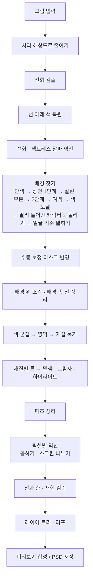

# Illustracy — 일러스트 레이어 분리기

다 그린 그림 한 장을, 그림을 그릴 때처럼 **여러 장의 투명한 층(레이어)으로 다시 나눠** 포토샵 파일(PSD)로 저장하는 프로그램입니다.

- 파일 하나(`index.html`)를 브라우저로 열면 바로 쓸 수 있습니다.
- 설치도, 인터넷 연결도, 비용도 필요 없습니다.
- 그림은 내 컴퓨터 밖으로 나가지 않습니다.

---

## 목차

1. [쉽게 알아보기](#1-쉽게-알아보기)
2. [원리](#2-원리)
3. [작동 방식](#3-작동-방식)
4. [알고리즘과 수식](#4-알고리즘과-수식)
5. [물리 세계와의 대응](#5-물리-세계와의-대응)
6. [체계 (프로그램 구성)](#6-체계-프로그램-구성)
7. [이슈와 해결](#7-이슈와-해결)
8. [최적화](#8-최적화)
9. [특장점](#9-특장점)
10. [한계](#10-한계)
11. [검증](#11-검증)
12. [업데이트 내역](#12-업데이트-내역)

---

## 1. 쉽게 알아보기

### 이게 뭔가요?

컴퓨터로 그림을 그릴 때는 보통 투명한 종이를 여러 장 겹쳐서 그립니다.
맨 아래 종이에 색을 칠하고, 그 위 종이에 그림자를, 또 그 위에 반짝이는 빛을, 맨 위에 선을 그리는 식입니다.
그런데 다 그린 그림을 한 장으로 합쳐 저장하면 이 종이들이 사라지고 한 장만 남습니다.

Illustracy는 한 장으로 합쳐진 그림을 보고, 그림을 그렸던 순서대로 종이들을 다시 나눠 줍니다.
나눈 종이들을 다시 겹치면 원래 그림과 눈으로 구분할 수 없을 만큼 똑같이 보입니다.

### 무엇으로 나뉘나요?

| 층 | 들어 있는 것 |
|---|---|
| 러프 | 처음에 대충 그린 밑그림처럼 만든 스케치. 원래 그림에는 없으므로 짐작해서 만든 것이고, 처음에는 숨겨져 있습니다 |
| 선화 | 그림의 선 |
| 색트레스 | 선 중에서 색이 다른 부분(빛을 받은 선, 색깔 선) |
| 밑색 | 머리카락, 피부, 옷처럼 부분마다 칠한 한 가지 색 |
| 1차 · 2차 그림자 | 밑색 위에 겹친 어두운 부분. 2차는 1차보다 더 어두운 곳 |
| 하이라이트 | 밑색보다 밝게 칠한 부분(머리카락 윤기 등) |
| 명암 · 그라데이션 | 부드럽게 어두워지는 부분 |
| 반사광 · 림라이트 | 그림자 속에서 다시 밝아진 부분, 몸 가장자리에 비친 빛 |
| 빛 · 반짝임 | 빛나는 효과, 눈 속 반짝임, 별 |
| 배경 · 배경 효과 | 캐릭터 뒤의 배경, 배경 위에 떠 있는 빛 조각 |
| 외곽 글로우 | 캐릭터 둘레에 두른 형광 띠(있는 그림만) |

부분(파츠)마다 폴더가 따로 생기고, 폴더 안에 그 부분의 밑색 · 그림자 · 하이라이트가 들어 있습니다.
그림에서 얼굴을 찾으면 얼굴 둘레의 색으로 **눈 · 피부 · 머리카락** 폴더에 이름을 붙이고, 나머지 폴더는 색 이름(파랑, 검정 …)으로 붙습니다.

### 무엇이 필요한가요?

- `index.html` 파일 하나와 브라우저(Chrome, Edge, Firefox, Safari)
- 끝. 인터넷, 설치, 계정, 비용이 모두 필요 없습니다.

### 쓰는 법

1. `index.html`을 브라우저로 엽니다.
2. 그림을 창에 끌어다 놓거나, 왼쪽 위 상자를 눌러 고르거나, 복사한 그림을 `Ctrl+V`로 붙여 넣습니다.
   먼저 해 보고 싶으면 **예제 그림**을 누르세요.
3. 몇 초 기다리면 오른쪽에 층 목록이 나옵니다.
   - 동그라미 버튼: 그 층을 켜고 끄기
   - 층 이름 누르기: 섞는 방식과 진하기 바꾸기, 그 층만 그림 파일로 저장
   - 층 이름 두 번 누르기: 이름 바꾸기
   - 목록 위 **눈 모양 버튼**: 눈 뜬 모양을 누르면 모든 층과 폴더가 한 번에 꺼지고 눈 감은 모양으로 바뀝니다. 눈 감은 모양을 누르면 끄기 전 상태로 돌아옵니다.
     모두 끈 뒤 층 하나를 켜면 그 층이 든 폴더도 함께 켜져 그 층만 보이고, 폴더를 켜면 그 안의 층들이 보입니다
4. **PSD 다운로드**를 누르면 포토샵에서 열 수 있는 파일이 저장됩니다. 목록에서 바꾼 이름 · 진하기 · 켜고 끈 상태도 그대로 들어갑니다.

가운데 그림은 마우스 휠로 크게 · 작게 보고, 끌어서 옮깁니다.
위쪽 버튼으로 **합성**(나눈 층을 겹친 모습) · **원본** · **선택 레이어**(고른 층만) · **차이 ×8**(원본과 다른 곳을 8배로 강조)을 바꿔 볼 수 있습니다.

### 틀리게 나뉜 곳 고치기

자동으로 나누다 보면 배경의 물건이 캐릭터 쪽에 남거나, 캐릭터 일부가 배경으로 가기도 합니다.

- **배경으로 보내기**: 켠 뒤 옮길 물건(탁자, 의자 등)을 누르거나 문지르면 배경으로 옮겨집니다. 선을 넘어 옆 부분까지 끌려가지 않습니다.
- **캐릭터로 되돌리기**: 배경에 잘못 들어간 부분(잘린 모자, 소매, 다리)을 문지르면 캐릭터로 돌아오고, 그림을 다시 나눕니다(몇 초).
- 넓은 곳은 옮길 부분을 **빙 둘러 고리**를 그리면(끝을 시작점 근처로 돌아오게) 안쪽이 한 번에 처리됩니다. 고리 안이 옅게 채워지면 고리로 인식된 것입니다.
- 잘못했으면 `↶` 버튼이나 `Ctrl+Z`로 되돌립니다.
- 이 두 도구를 켠 동안 화면 이동은 마우스 오른쪽 버튼으로 끕니다.

고친 내용은 설정을 바꿔 다시 나눠도 남아 있고, 새 그림을 열면 지워집니다. 고쳐도 겹친 결과는 원래 그림 그대로입니다.

### 인터넷 없이 쓰기

1. `index.html`을 내려받습니다(GitHub에서 파일을 열고 *Download raw file*, 또는 저장소 ZIP).
   이미 열어 둔 프로그램에서 왼쪽 위 **⬇ 프로그램 저장 (오프라인 실행용)**을 눌러도 같은 파일을 받습니다.
2. 받은 파일을 더블클릭합니다. 인터넷이 끊겨 있어도 모든 기능이 됩니다.

### 설정

| 설정 | 뜻 |
|---|---|
| 처리 해상도 | 그림의 긴 변을 이 크기로 줄여서 처리합니다(기본 2048px). 클수록 자세하지만 느립니다 |
| 선 감도 | 높이면 옅은 선도 선으로 봅니다 |
| 최대 선 굵기 | 이보다 두꺼운 어두운 곳은 선이 아니라 칠한 면으로 봅니다(0 = 그림에서 선 굵기를 재서 자동. 고른 값과 잰 굵기가 옆에 나옵니다) |
| 선 색상 | 선화 + 색트레스(기본) / 원래 선 색 그대로 한 장 / 검정 한 가지 |
| 색상 군집 수 | 처음에 색을 몇 가지로 나눠 볼지 |
| 밑색 병합 강도 | 높이면 밝기만 다른 색을 같은 부분으로 더 많이 묶습니다 |
| 그림자 판정 기준 | 높이면 옅게 어두워진 곳도 그림자 층으로 보냅니다 |
| 반짝임 최대 크기 | 이보다 작은 밝은 점을 반짝임으로 봅니다(0 = 해상도에 맞춰 자동) |
| 최대 파츠 수 | 부분 폴더의 최대 개수(기본 32). 넘치는 작은 부분은 "작은 파츠" 폴더로 |
| 채색을 파츠별 폴더로 나누기 | 끄면 밑색 · 그림자 · 하이라이트를 부분 구분 없이 한 장씩 |
| 그림자·하이라이트를 밑색에 클리핑 | 그림자와 하이라이트가 밑색 바깥으로 나가지 않게 묶습니다 |
| 단색 배경 자동 분리 | 배경 찾기를 켜고 끕니다 |
| 러프 스케치 생성 · 러프 색상 | 러프 층을 만들지, 무슨 색으로 그릴지 |

### 잘 되는 그림, 어려운 그림

- **잘 되는 그림**: 선이 있고, 색을 면으로 또렷하게 나눠 칠한 애니메이션풍 그림(셀 채색)
- **어려운 그림**
  - 선이 없는 그림, 붓 자국이 많은 그림
  - 배경의 물건도 캐릭터처럼 진한 선으로 그린 그림(바닥의 과자, 소품 등)
  - 캐릭터와 배경의 색이 거의 같은 그림(검은 옷 + 검은 배경 등)
- 얼굴을 찾으면 눈 · 피부 · 머리카락 부분에 그 이름이 붙고, 나머지 부분은 색 이름(파랑, 검정 …)으로 붙습니다. "옷", "리본" 같은 뜻은 알지 못합니다.

### 설정은 그림을 재서 정합니다

그림을 열면 선(펜)의 굵기를 재서, 기본값으로는 선을 다 담지 못하는 그림일 때만 **최대 선 굵기**를 올립니다.
예를 들어 작은 그림에 굵은 선으로 그렸으면 선 검출 창을 넓힙니다. 보통 그림은 기본값을 그대로 씁니다.
고른 값과 잰 굵기는 설정 옆에 "자동 · 8 px (이 그림 13 px)"처럼 나오고, 슬라이더를 움직이면 그 값으로 바뀝니다.
나머지 설정도 그림에서 재서 정해 봤지만 결과가 나빠지거나 나아지지 않아, 여러 그림으로 맞춘 기본값을 씁니다(7.5).

---

## 2. 원리

### 2.1 작가가 층을 쌓는 순서를 그대로 따른다

셀 채색 작업 파일은 대체로 이런 순서로 쌓입니다.

```
선화            ← 맨 위, 선
빛 · 반짝임      ← 밝게 더하는 효과
명암            ← 부드러운 음영
하이라이트        ← 밑색보다 밝은 면
그림자           ← 밑색 위에 겹쳐 어둡게
밑색            ← 부분마다 한 가지 색
배경
```

층마다 **겹치는 방식**이 다릅니다.

- **표준**: 위의 색이 아래를 덮습니다(밑색, 하이라이트, 선화).
- **곱하기**: 색 셀로판을 겹친 것처럼 아래를 어둡게 합니다(그림자, 명암).
- **스크린**: 조명을 하나 더 켠 것처럼 아래를 밝게 합니다(빛, 반짝임, 림라이트, 반사광).

Illustracy는 결과 파일이 이 구성을 따르도록 나눕니다.

### 2.2 겹친 결과가 원본이 되도록 거꾸로 푼다

겹치는 방식은 모두 간단한 계산식입니다. 그래서 "원래 그림의 색"과 "밑색 · 그림자 색"을 알면,
**나머지 층에 무엇이 들어가야 원래 그림이 나오는지**를 픽셀마다 거꾸로 풀 수 있습니다.

같은 그림을 만드는 층 구성은 무수히 많습니다. 그중에서 작가가 실제로 만들 법한 것을 고릅니다.

- 밑색은 부분마다 한 가지 색
- 그림자도 부분마다 한 가지 색(1차, 필요하면 2차)
- 그 한 가지 색으로 설명되지 않고 남는 차이만 명암 · 빛 층으로

마지막에 남는 차이까지 층에 담기 때문에, 나눈 결과를 겹치면 원본으로 돌아옵니다.
오차는 파일이 색을 0~255 정수로 저장하면서 생기는 반올림 정도뿐입니다.

### 2.3 선은 "가늘고 주변보다 어두운 것"이다

어두운 가는 구조를 지운 그림을 만들고(주변의 밝은 색으로 메움), 원래 그림과의 차이를 보면 선만 남습니다.
두꺼운 어두운 면(검은 옷)은 지워지지 않으므로 선으로 잡히지 않습니다.

### 2.4 선이 가린 색은 주변에서 짐작한다

선 아래에 칠해져 있었을 색은 선 바로 바깥 색을 안쪽으로 한 겹씩 채워 짐작합니다.
아래 색을 알면 "선 색이 몇 %의 진하기로 덮였는지"를 계산할 수 있고, 선의 흐린 가장자리(안티에일리어싱)까지 투명도로 표현됩니다.

### 2.5 배경은 여섯 가지 단서로 가른다

1. **테두리와 이어짐**: 배경은 그림 테두리에 닿아 있고, 캐릭터의 윤곽선을 넘지 않고 이어집니다.
2. **선의 많고 적음**: 캐릭터와 소품은 선으로 그리고, 배경은 선 없이 칠하는 경우가 많습니다.
3. **또렷함**: 배경은 초점이 나간 것처럼 흐리게 그리는 경우가 많아, 진하고 또렷한 선이 드뭅니다.
4. **색의 차이**: 배경까지 선으로 그린 그림은, 그림마다 배경의 색과 캐릭터의 색을 배워서 가릅니다.
5. **선명한 색 경계**: 선 없이 부드럽게 칠한 팔 · 손 · 소매도 초점이 맞은 물체라서 둘레의 색이 또렷하게 바뀝니다.
   선이 적어 배경에 딸려 들어간 조각이 이 경계로 떨어져 있고, 캐릭터에 붙어 있고, 색이 캐릭터 쪽이면 캐릭터로 되돌립니다.
6. **얼굴**: 애니풍 얼굴은 어두운 둥근 눈 두 개가 나란히 있고 그 아래가 밝고 고른 피부입니다. 얼굴을 찾으면 머리와 몸이 어디쯤 있는지 압니다.
   머리 · 몸 자리 밖에서 색이 분명히 배경 쪽이고, 이미 찾은 배경과 선 없이 이어진 곳만 배경에 더합니다.
   캐릭터는 윤곽선으로 둘러싸여 있어서, 배경과 색이 비슷한 머리카락 끝이나 소매 쪽으로는 넘어가지 않습니다.

화면 아래 테두리는 캐릭터가 잘려 있는 경우(상반신 그림)가 많아서 배경 찾기의 출발점으로 쓰지 않습니다.

### 2.6 재질 경계에는 선이 있고, 그림자 경계에는 선이 없다

셀 채색에서 머리카락과 피부 사이에는 선을 긋지만, 머리카락의 밝은 면과 그림자 사이에는 선을 긋지 않습니다.
그래서 선 없이 맞닿아 있고 같은 색 계열이면 같은 재질의 명암으로, 선으로 막혀 있으면 다른 재질로 봅니다.

### 2.7 같은 재질 안에서 가장 넓은 색이 밑색이다

한 재질 안의 색을 다시 몇 가지 톤으로 나누면, 가장 넓게 칠한 톤이 밑색입니다.
그보다 확실히 어두운 톤은 그림자, 확실히 밝은 톤은 하이라이트입니다.
그림자 톤이 밑색보다 채널별로 몇 배 어두운지가 곧 그림자 층의 **곱하기 색**입니다.

### 2.8 밝아진 곳은 위치와 모양으로 종류를 가린다

밑색 · 그림자로 설명되지 않고 더 밝아진 부분은 이렇게 나눕니다.

- 떨어져 있는 작고 아주 밝은 점 → **반짝임**
- 캐릭터 실루엣 가장자리에만 몰린 빛 → **림라이트**
- 그림자 안에서 다시 밝아진 부분 → **반사광**
- 나머지 넓게 퍼진 밝아짐 → **빛**

### 2.9 러프는 완성본에서 거꾸로 만든다

러프는 원래 그림에 남아 있지 않으므로 복원할 수 없습니다.
대신 사람이 연필로 대충 잡은 밑그림처럼 만듭니다.

- 선의 굵기와 진하기를 따라 부드러운 굵은 획으로 그립니다. 원래 선이 진한 눈 · 윤곽은 굵게, 옅은 선은 가늘게 됩니다.
- 그 획을 조금씩 비틀어 세 번 겹쳐, 여러 번 덧그린 연필 선처럼 보이게 합니다.
- 옅은 선도 끊어지지 않도록 선의 가운데 줄을 획 아래에 깔아 둡니다. 선과 이어지지 않는 자잘한 부스러기(반짝임 · 질감 점)는 그리지 않습니다.
- 캐릭터의 선과 실루엣, 배경의 밝기 윤곽까지 담아 구도 전체를 잡습니다.

### 2.10 기본값이 감당하지 못할 때만 그림에 맞춘다

작가는 같은 펜으로 선을 그으므로, 선의 굵기를 세면 한 굵기에 몰립니다. 이 "펜 굵기"를 재면 그림 크기와 상관없이 선을 담을 창의 크기를 알 수 있습니다.
다만 이 프로그램의 다른 단계(배경 찾기가 쓰는 선 밀도 등)는 기본 창에 맞춰져 있으므로, 잰 값이 기본값을 분명히 넘을 때만 바꿉니다.

---

## 3. 작동 방식



### 3.1 준비

그림을 **처리 해상도**(기본 긴 변 2048px)로 줄이고, 계산은 브라우저의 **Web Worker**(화면과 따로 도는 계산 스레드)에서 합니다.
워커를 쓸 수 없는 환경에서는 화면 쪽에서 그대로 계산합니다.

최대 선 굵기가 자동(0)이면 먼저 그림을 잽니다. 주변보다 어둡고 가는 구조의 중심선에서 선 굵기 분포를 세어 펜 굵기를 찾고,
해상도로 정한 기본 창이 이 선을 담지 못하면 창을 넓힙니다(4.3).

### 3.2 선화 검출

밝기 그림에 **클로징**(최대 필터 뒤 최소 필터)을 하면 선 굵기보다 가는 어두운 구조가 주변 밝은 색으로 메워집니다.
"클로징 − 원본"(**블랙 탑햇**)이 선의 깊이입니다. 깊이가 큰 픽셀에서 시작해 조금 약한 픽셀까지 이어 붙이고(**히스테리시스**), 너무 작은 조각은 버립니다.
선이 모이는 교차점처럼 클로징 창보다 넓어진 어두운 덩어리는 선에서 이어서 채우되, 선 굵기를 넘어 계속되는 어두운 면(검은 옷)은 채우지 않습니다.

진하고, 살짝 흐리면 깊이가 크게 줄어드는 선은 **선명한 선**으로 따로 표시합니다. 배경을 가를 때 캐릭터 선과 흐린 배경 자국을 구분하는 데 씁니다.

### 3.3 선 아래 색 복원

선과 그 가장자리 1px을 "모르는 픽셀"로 두고, 바깥쪽부터 한 겹씩 이웃한 아는 픽셀들의 평균으로 채웁니다(양파 껍질 방식 인페인팅).

### 3.4 선화와 색트레스

선이 거의 완전히 덮은 픽셀들의 색 중앙값을 **기본 선 색**으로 정합니다.
픽셀마다 "원본 = 선 알파 × 선 색 + (1 − 선 알파) × 아래 색"을 풀어 알파를 구하고,
기본 선 색으로 원본이 맞지 않는 곳(빛 받은 선, 색 선)은 그 자리의 실제 선 색을 따로 구해 **색트레스** 층에 넣습니다.
색트레스는 선화에 클리핑된 층이라, 선화의 알파 안에서 선 색만 바꿉니다.

### 3.5 배경 찾기

차례로 여러 방법을 쓰고, 찾은 배경을 합칩니다.

1. **단색 · 그라데이션 배경**: 테두리에서 가장 흔한 색에서 출발해 선을 넘지 않고 비슷한 색으로 퍼집니다. 테두리를 따라 색이 서서히 바뀌는 그라데이션도 따라갑니다.
2. **장면 배경 1단계**: 선의 밀도(선 픽셀을 넓게 흐린 값)가 낮은 곳 중 위 · 왼쪽 · 오른쪽 테두리와 이어진 곳.
3. **잘린 캐릭터 부분 가려내기**: 테두리를 따라 걸으며, 선명한 윤곽선을 사이에 두고 배경 조각들 사이에 끼어 있고 양옆과 색이 확연히 다른 조각은 화면에서 잘린 캐릭터 부분(모자, 소매)으로 보고 되돌립니다.
4. **장면 배경 2단계**: 선명한 선은 없고 흐린 자국만 빽빽한 곳(흐리게 그린 선반, 글씨, 무늬)으로 넓힙니다.
5. **여백**: 캐릭터 둘레의 여백을 선을 넘지 않고 색이 매끄럽게 이어지는 곳까지 넓힙니다.
6. **색 모델**: 배경도 선으로 그린 그림(불꽃놀이, 포장마차, 그래피티)을 위해, 그림을 작은 색 영역으로 나눈 뒤
   "지금까지 찾은 배경"과 "선명한 선이 촘촘한 캐릭터 핵심"의 색 분포를 배워 영역 단위로 가릅니다(GrabCut 방식의 그래프 컷).
   색이 많이 겹치는 그림, 이미 배경을 다 찾은 그림에서는 하지 않고, 이미 찾은 배경을 빼는 일 없이 더하기만 합니다.
7. **딸려 들어간 캐릭터 부분 되돌리기**: 1~5에서 찾은 배경을 선명한 색 경계와 선에서 잘라 조각으로 나눕니다.
   위 · 왼쪽 · 오른쪽 테두리에 닿지 않고, 둘레의 80% 이상이 캐릭터와 맞닿아 있고, 색이 나머지 배경보다 캐릭터에 가까운 조각을
   캐릭터로 되돌립니다(선 없이 칠한 팔 · 손 · 소매 · 날개). 색 모델은 되돌리기 전의 배경으로 계산하고, 되돌린 부분은 색 모델이 더한 배경에서도 뺍니다.
8. **얼굴 기준으로 넓히기**: 그림에서 애니풍 얼굴을 찾으면(4.5), 얼굴마다 머리와 몸이 있을 자리를 "캐릭터일 확률"로 두고 색 모델과 같은 영역 그래프 컷을 다시 합니다.
   그 결과 배경 쪽이 된 영역 중, 색이 분명히 배경 쪽이고 머리 · 몸 자리 밖이며 이미 찾은 배경에서 선 없는 경계(맞닿은 길이의 절반 이상이 선이 아님)로만
   이어진 곳을 배경에 더합니다. 7에서 되돌린 부분은 다시 가져가지 않고, 이미 찾은 배경을 빼는 일은 없습니다. 얼굴을 못 찾은 그림에서는 하지 않습니다.

그다음 사용자가 칠한 보정(배경으로 보내기 / 캐릭터로 되돌리기)을 자동 판정보다 우선해서 반영합니다.

### 3.6 배경 위 조각과 배경 속 선 정리

- 배경에 둘러싸인 작은 조각(입자, 빛줄기 조각)은 캐릭터 파츠가 아니라, 아래 배경색을 주변에서 짐작해 **배경 + 배경 효과(스크린)**로 나눕니다.
  배경에서 되돌린 캐릭터 부분과 사용자가 캐릭터로 되돌린 부분은 작아도 여기에 넣지 않습니다.
- 배경 안에 흡수된 흐린 자국, 캐릭터에서 멀리 떨어진 배경 그림의 선(창틀, 구름), 배경색과 같은 색의 "선"(빛줄기 사이로 보이는 배경 틈)은 선화에서 빼서 배경 그림에 남깁니다.

### 3.7 영역 나누기와 재질 묶기

선 아래 색을 복원한 그림을 Lab 색공간에서 **k-평균**으로 몇 가지 색(기본 18)으로 나누고, 같은 색끼리 이어진 덩어리를 **영역**으로 삼습니다.
너무 작거나 가느다란 영역(가장자리 번짐)은 버리고 가까운 영역으로 채웁니다.
맞닿은 영역 쌍마다 경계가 선으로 막힌 길이와 열린 길이를 세어 **인접 그래프**를 만들고,
경계가 대부분 열려 있고 색이 같은 재질의 명암 관계이면 한 재질로 묶습니다.

### 3.8 톤과 밑색

재질마다 다시 k-평균으로 톤(최대 6개)을 나눕니다. 가장 넓은 톤(넓이가 비슷하면 더 밝은 쪽)의 밝은 쪽 평균이 **밑색**입니다.
선으로 나뉜 같은 재질(앞머리 / 뒷머리)은 밑색을 서로 맞춥니다.

### 3.9 파츠 정리

실제 작업 파일처럼 부분 수를 줄입니다.

1. 거의 같은 밑색끼리 한 파츠로
2. 선 건너편의 더 어두운 면이 밝은 파츠의 그림자로 그럴듯하면 합침(흰 머리카락 옆 연보라 가닥)
3. 작은 조각은 색이 비슷한 이웃 파츠로
4. 파츠가 **최대 파츠 수**를 넘으면 가장 작은 것부터 비슷한 색의 이웃에 합치고, 비슷한 이웃이 없으면 **작은 파츠** 폴더로
5. **이름 붙이기**: 얼굴을 찾았으면 얼굴 틀로 콧등 · 볼(피부), 앞머리(머리카락), 두 눈 칸(눈)을 차지한 파츠를 찾아 그 이름을 붙입니다(4.8).
   나머지 파츠는 밑색의 색 이름(검정, 흰색, 파랑 …)으로 붙고, 얼굴로 피부를 찾은 그림에서는 다른 살색 파츠를 "피부"가 아니라 "베이지 · 살구"로 부릅니다.

### 3.10 그림자 단계와 하이라이트

밑색보다 확실히 어두운 톤은 그림자입니다. 그림자 톤들을 밝기 순으로 늘어놓고 틈이 크게 벌어진 곳에서 **1차 / 2차**로 나눕니다.
단계마다 곱하기 색을 하나씩 정합니다(2차는 1차 위에 한 번 더 곱해지는 색).
밑색보다 확실히 밝은 톤은 하이라이트(표준 층)이고, 거의 흰색이며 훨씬 밝은 작은 톤 조각은 반짝임 후보입니다.

### 3.11 역산: 명암과 빛 나누기

픽셀마다 "밑색 × 1차 × 2차 → 하이라이트"까지 칠한 색과 선 아래 복원색을 비교합니다.

- 더 어두우면 남은 **어두워짐**을, 넓게 깔린 부분(**그라데이션**)과 나머지(**명암**)로 나눕니다. 둘 다 곱하기라서 곱하면 원래 어두워짐이 됩니다.
- 더 밝으면 남은 **밝아짐**을 반짝임 → 림라이트 → 가는 반짝임 → 반사광 → 빛 순서로 떼어 냅니다. 스크린끼리 겹친 결과가 원래 밝아짐과 같도록 나눕니다.

내용이 거의 없는 층은 만들지 않습니다(예: 셀 채색 그림의 그라데이션). 그 몫은 명암 · 빛에 남깁니다.

### 3.12 선화 층, 검증, 레이어 트리, 러프

선화 · 색트레스 층을 만든 뒤, **저장될 8비트 값 그대로** 모든 층을 다시 합성해 원본과 비교합니다(재현 PSNR, 화면 오른쪽 위에 표시).
층들을 작업 파일 구성의 트리로 묶고, 러프를 만들어 맨 위에 숨겨 둡니다.

```
러프 (추정)                 표준 45%, 숨김
[캐릭터]
  [선화]
    색트레스                표준, ↳클리핑
    선화                    표준
  [효과]
    반짝임                  스크린
    빛                      스크린
  [채색]
    림라이트                스크린
    반사광                  스크린
    명암                    곱하기
    그라데이션              곱하기
    [피부] [머리카락] [보라] …  파츠 폴더(눈 · 피부 · 머리카락, 나머지는 밑색 색 이름)
      하이라이트            표준, ↳클리핑
      2차 그림자            곱하기, ↳클리핑
      1차 그림자            곱하기, ↳클리핑
      밑색 #7B56B5          표준
    [작은 파츠 (n)]         색이 비슷한 이웃이 없는 작은 파츠들
    실루엣 (선택용)         표준, 숨김
[배경]
  배경 효과                 스크린
  외곽 글로우               표준(캐릭터 둘레에 형광 띠를 두른 그림만)
  배경                      표준
```

배경이 없는 불투명한 그림은 [캐릭터] · [배경] 폴더 없이 [선화] · [효과] · [채색]이 맨 위에 옵니다.

**캐릭터가 여럿이면** [캐릭터] 대신 왼쪽부터 [캐릭터 1] · [캐릭터 2] … 폴더가 생기고, 폴더마다 위와 같은 [선화] · [효과] · [채색]이 들어 있습니다.
캐릭터는 찾은 얼굴로 정합니다. 크기와 높이가 비슷하고 서로의 몸 자리 밖에 있는 얼굴들을 캐릭터로 보고(무릎 · 신발에서 찾은 가짜 얼굴은 빠짐),
각 얼굴의 머리 · 몸 자리에서 출발해 윤곽선을 벽으로 삼아 픽셀을 나눕니다(4.8). 층을 합성한 결과는 한 폴더일 때와 같습니다.

### 3.13 미리보기와 PSD 저장

미리보기는 브라우저 캔버스의 혼합 모드(multiply, screen)로 층을 겹치고, 클리핑은 Photoshop과 같은 방식으로 흉내 냅니다.
PSD는 외부 라이브러리 없이 직접 씁니다(RGB 8비트, 폴더, 클리핑, 혼합 모드, 한글 층 이름, 병합 이미지).

### 3.14 수동 보정

- **배경으로 보내기**: 획이 닿은 파츠와 그와 거의 같은 색의 파츠 안에서, 선을 넘지 않고 색이 이어지는 곳을 골라
  배경 층으로 원본 색 그대로 옮기고 캐릭터 쪽 층에서는 지웁니다. 그래서 다시 나누지 않아도 합성 결과가 원본과 같습니다.
- **캐릭터로 되돌리기**: 배경에서 선을 넘지 않고 이어지는 곳을 "여기는 캐릭터"로 표시하고 그림을 다시 나눕니다.
- 두 보정은 그림 크기의 표시(마스크)로 남아, 옵션을 바꿔 다시 나눠도 자동 판정보다 먼저 반영됩니다.

---

## 4. 알고리즘과 수식

### 4.0 표기

- 픽셀 값은 0~1로 둔 sRGB 값입니다. 원본을 `O`, 선 아래 복원색을 `U`, 채널을 `c ∈ {R, G, B}`로 씁니다.
- 밝기는 `lum(r, g, b) = 0.299r + 0.587g + 0.114b`입니다.
- `s = max(W, H) / 1000`은 그림 크기에 따른 배율입니다(길이 기준값에 곱함).
- `clamp(x) = min(1, max(0, x))`, `smoothstep(a, b, x)`는 `t = clamp((x − a)/(b − a))`에 대한 `t²(3 − 2t)`입니다.
- 색 차이 `ΔE`는 CIE76(Lab 공간의 유클리드 거리)입니다.

### 4.1 색공간

sRGB를 선형화한 뒤 XYZ(D65)를 거쳐 Lab으로 바꿉니다.

```math
C_{lin}=\begin{cases}C/12.92 & C\le 0.04045\\ \left(\frac{C+0.055}{1.055}\right)^{2.4} & \text{otherwise}\end{cases}
\qquad
L^*=116f(Y)-16,\; a^*=500\,(f(X/X_n)-f(Y)),\; b^*=200\,(f(Y)-f(Z/Z_n))
```

```math
f(t)=\begin{cases}t^{1/3} & t>0.008856\\ 7.787\,t+16/116 & \text{otherwise}\end{cases}
```

선형화는 256칸 표로 미리 계산해 둡니다. 채도 `C* = √(a*² + b*²)`, 색상각 `h = atan2(b*, a*)`.

### 4.2 기본 연산

- **팽창 / 침식**(정사각형 반지름 `r`): 행과 열로 나눈 1차원 슬라이딩 최대 / 최소를 **단조 덱**으로 계산해 픽셀당 `O(1)`입니다.
- **가우시안 흐림**: 반지름 `r = round((√(4σ² + 1) − 1)/2)`인 상자 흐림을 가로 · 세로로 3번 반복해 근사합니다.
- **인페인팅**: 모르는 픽셀을 아는 픽셀과의 거리 순서(바깥 겹부터)로 방문해, 한 겹 안쪽까지 확정된 8-이웃의 평균으로 채웁니다.
- **라벨 채우기**: 라벨 없는 픽셀을 거리 순서로 방문해, 확정된 8-이웃 라벨의 다수결(4-이웃은 2배 가중)로 채웁니다.

### 4.3 선화 검출

선 굵기 한계 `w`(기본 `w₀ = max(3, round(4s))`, 아래 자동 설정 또는 설정값)로 밝기 `L`을 클로징합니다.

```math
\mathcal{C}=\mathrm{erode}_w(\mathrm{dilate}_w(L)),\qquad d=\mathcal{C}-L,\qquad
\mathrm{strength}=\min\!\left(\frac{d}{\mathcal{C}},\frac{d}{0.3}\right)\quad(\mathcal{C}>0.02,\ d>0)
```

히스테리시스 임계값은 선 감도 `η ∈ [0, 1]`(기본 0.5)에서

```math
t_{high}=0.58-0.34\,\eta,\qquad t_{low}=0.45\,t_{high}
```

`strength ≥ t_high`인 픽셀에서 출발해 `strength ≥ t_low`인 8-이웃으로 넓히고, `max(4, 6s)`픽셀보다 작은 조각은 버립니다.

**교차점 채우기**: 선에서 출발해 `w + 1`단계까지, 출발 선의 밝기 `L_ref`보다 0.05 이상 밝지 않고 `L ≤ 0.5`인 픽셀로 넓힙니다.
넓힌 덩어리 중 `w + 1`단계 끝까지 닿은 것(선 굵기를 넘어 이어지는 어두운 면)은 버리고 나머지를 선에 더합니다.

**선명한 선**:

```math
d>0.02,\qquad \mathrm{strength}\ge 0.45,\qquad \frac{G_{1.5}(L)-L}{d}\ge 0.25
```

`G_σ`는 가우시안 흐림입니다. 세 번째 조건은 "살짝 흐리면 깊이의 25% 이상이 사라지는 가는 선"을 뜻합니다.

선과 그 8-이웃 1px을 `inMask`, 나머지 불투명 픽셀을 `known`으로 둡니다.

**자동 설정(최대 선 굵기가 0일 때)**

**펜 굵기**: 넉넉한 창 `R_b = max(8, round(12s))`로 위와 같은 `strength`를 구하고, `strength ≥ 0.5`인 구조의 거리 변환 `D`(체임퍼)에서
4-이웃 극대점(중심선)마다 굵기 `2D − 1`(≥ 1.8)을 셉니다. 1px 칸 히스토그램에서 `±max(1, round(0.2w))` 안의 개수가 가장 많은 굵기가 봉우리 `m`,
`m`의 3배 이하인 굵기들의 90% 값이 펜 굵기 `w₉₀`입니다. 중심선이 150개 미만이면 재지 않습니다.

```math
w=\begin{cases}\min\big(16,\ \lceil w_{90}/2\rceil+1\big) & \lceil w_{90}/2\rceil+1\ \ge\ w_0+2\\ w_0 & \text{그 밖}\end{cases}
```

### 4.4 선 알파와 선 색

선이 덮은 픽셀은 표준 합성식을 만족해야 합니다.

```math
O_c=a\,K_c+(1-a)\,U_c
```

- **검정 단색**: `a = clamp(1 − lum(O)/lum(U))`
- **원본 선 색 한 장**: `a = clamp(max_c(1 − O_c/U_c))`, `K_c = (O_c − (1 − a)U_c)/a`
- **선화 + 색트레스**(기본):
  1. 기본 선 색 `K⁰` = 알파 0.85 이상인 선 픽셀의 원본 색 채널별 중앙값
  2. 선 색 `K`가 주어졌을 때의 최소제곱 알파

     ```math
     a(K)=\mathrm{clamp}\!\left(\frac{\sum_c (U_c-O_c)(U_c-K_c)}{\sum_c (U_c-K_c)^2}\right)
     ```

  3. `a(K⁰) ≥ 0.5`인 픽셀에서 실제 선 색 `K_c = (O_c − (1 − a)U_c)/a`를 구하고, 선 영역 전체로 인페인팅해 부드러운 선 색 `K̃`를 얻습니다.
  4. `ΔE(K̃, K⁰) ≤ 6`이고 `K⁰`로 합성한 잔차가 채널별 8/255 이하이면 선화(기본 선 색), 아니면 색트레스입니다.
  5. 색트레스 알파는 원본이 0~1 범위 안의 선 색으로 정확히 재현되는 **최소 알파** 이상으로 잡습니다.

     ```math
     a_{min}=\max_c\left\{\,1-\frac{O_c}{U_c}\ (U_c>0.004),\ \ \frac{O_c-U_c}{1-U_c}\ (O_c>U_c)\right\},\qquad a=\max(a(\tilde K),a_{min})
     ```

  6. 색트레스 픽셀의 알파 합이 전체 선 알파 합의 0.3% 미만이면 색트레스 층을 만들지 않고 선화 한 장으로 둡니다.

알파가 0.02 이하인 픽셀은 선이 아닌 것으로 보고 복원색을 원본으로 되돌립니다.

### 4.5 배경

**단색 · 그라데이션 배경**

1. 테두리 픽셀 색을 채널별 16단계(4096칸)로 세어 가장 많은 칸의 평균을 기준색 `r`로 둡니다. 테두리의 45% 이상이 `max_c|U_c − r_c| < 0.1`이 아니면 포기합니다.
2. `max_c|U − r| < 0.12`인 테두리 픽셀에서 출발해, 이웃 간 변화 `< 0.035`이고 출발 기준색과의 차이 `< 0.3`인 `known` 픽셀로 퍼집니다(픽셀마다 자기 기준색을 들고 퍼짐).
3. 테두리를 양방향으로 걸으며, 배경 픽셀에서 64px 이내이고 직전 배경색과 `< 0.05` 차이인 픽셀을 새 씨앗(자기 색이 기준)으로 더하고 허용치 0.12로 다시 퍼집니다(최대 3회). 선을 만나면 걷기를 끊습니다.
4. 넓이가 전체의 3~97%일 때만 씁니다.

**장면 배경**

선 밀도는 `σ = 0.02 · max(W, H)`로 흐린 값입니다.

```math
D_a=G_\sigma(\mathbb{1}_{line}),\quad D_c=G_\sigma(\mathbb{1}_{crisp}),\quad D_s=G_\sigma(\mathbb{1}_{line\wedge\neg crisp}),\qquad
\tau_a=\tfrac14\,\mathrm{median}_{line}D_a,\quad \tau_c=\tfrac14\,\mathrm{median}_{crisp}D_c
```

- **1단계 후보**: `known ∧ D_a < τ_a`. 후보를 `r = max(2, round(3s))`만큼 침식한 뒤 위 · 왼쪽 · 오른쪽 테두리에서 채우고, 침식한 만큼(+1) 원래 후보 안에서 되살립니다. 좁은 틈으로는 새지 않습니다.
- **2단계 후보**: 1단계 후보 ∪ `(D_c < τ_c ∧ D_s ≥ 0.085 ∧ (known ∨ 흐린 선))`. 1단계 배경과 위 · 옆 테두리에서 같은 방식으로 채웁니다.
- **여백**: 배경에서 출발해 최대 `0.05 · max(W, H)` 단계까지, 이웃 간 변화 `< 0.03`이고 출발색과 `< 0.1` 차이인 `known` 픽셀로 넓힙니다.
- 넓이가 5~90%일 때만 씁니다.

**잘린 캐릭터 부분**: 1단계 배경의 연결 조각에 대해 테두리 경로를 한 바퀴 걸으며 구간(run)을 만듭니다. 0.3% 미만 조각은 틈으로 봅니다.
가장 넓은 조각, 15%를 넘는 조각, 위쪽 두 모서리 5% 안에 닿은 조각은 대상에서 뺍니다.
어떤 조각의 모든 구간에서 양옆 이웃 조각까지 가는 사이에 선명한 선이 있고 이웃과의 `ΔE ≥ 25`이면 그 조각을 캐릭터로 되돌립니다.

**색 모델로 넓히기 (GrabCut 방식)**

1. **영역**: 원본의 Lab을 `known` 픽셀에서 k-평균(24색, 표본 4만 개)으로 나누고, 같은 색의 4-연결 성분 중 40px 이상을 영역 `r`로, 나머지는 라벨 채우기로 붙입니다.
2. **영역 특성**: 넓이 `A_r`, 평균 Lab, 선명한 선 밀도 비 `ρ_r = mean_r(D_c)/τ_c`, 기존 배경 비율 `β_r`, 위 · 왼쪽 · 오른쪽 테두리 접촉 픽셀 수 `F_r`, 둘레 중 선명한 선의 비율 `κ_r`.
3. **맞닿음**: 영역 쌍 `(r, q)`마다 선 없이 맞닿은 길이 `o`, 선으로 맞닿은 길이 `l`, 선명한 선 길이 `k`.
4. **색 분포**: Lab을 `13 × 32 × 32`칸(`L/8`, `(a + 128)/8`, `(b + 128)/8`)으로 세고, 이웃 `3 × 3 × 3`칸을 합쳐 부드럽게 한 뒤 정규화합니다.
5. **초기값**: 배경 `B⁰ = {β_r > 0.5} ∪ {F_r > 0 ∧ ρ_r < 1}`, 캐릭터 핵심 `F⁰ = {ρ_r > 3 ∧ F_r = 0} \ B⁰`.
6. **안전장치**:
   - 두 분포의 겹침 `Σ min(p_F⁰, p_B⁰) ≥ 0.3`이면 하지 않습니다.
   - 기존 배경이 위 · 왼쪽 · 오른쪽 테두리의 90% 이상을 덮으면 하지 않습니다.
7. **에너지**: 캐릭터 = 1, 배경 = 0인 라벨 `x_r`에 대해

   ```math
   E(x)=\sum_r \theta_r\,[x_r=0]\;+\;\sum_{(r,q)} w_{rq}\,[x_r\ne x_q]
   ```

   ```math
   \theta_r=\sum_{p\in r,\,known}\mathrm{clip}_{[-3,3]}\ln\frac{p_F(c_p)}{p_B(c_p)}
   +A_r\,\mathrm{clip}_{[0,2]}\ln\frac{\rho_r}{2}
   -A_r\,\beta_r-20F_r
   +A_r\,\mathrm{clip}_{[0,2]}\frac{\kappa_r-0.3}{0.15}
   ```

   ```math
   w_{rq}=8\,o\,\exp\!\left(-\frac{\Delta E_{rq}^2}{2\cdot 12^2}\right)+0.3\,l
   ```

   `θ_r > 0`이면 캐릭터 쪽 비용입니다. `β_r > 0.5`인 영역은 배경으로 고정(`θ = −∞`), 평균 `L* < 30`이고 `C* < 12`인 영역(검정에 가까운 무채색)은 캐릭터로 고정(`θ = +∞`)합니다.
8. **최소 컷**: 소스(캐릭터) → 영역 용량 `θ_r⁺`, 영역 → 싱크(배경) 용량 `θ_r⁻`, 영역 쌍은 양방향 `w_rq`인 그래프에서 **Dinic** 최대 흐름을 구하고, 잔여 그래프에서 소스로부터 닿는 영역을 캐릭터로 둡니다.
9. **연결 조건**: 새 배경 영역은 기준 배경(`B⁰`)에서, 선명하지 않은 맞닿음이 `max(3, 0.3(o + l))` 이상인 경계만 건너 닿을 수 있어야 합니다. 닿지 못하면 캐릭터로 되돌립니다.
10. 나눈 결과로 두 색 분포를 다시 배워 7~9를 4번 반복합니다. 배경이 된 영역의 `known` 픽셀과 흐린 선 픽셀을 배경에 더합니다(선명한 선은 더하지 않음).

난수는 이 단계만의 고정 씨앗(777)을 써서, 이 단계가 동작하지 않는 그림의 결과를 한 비트도 바꾸지 않습니다. 영역 그래프는 처음 필요할 때 한 번 만들어 아래 얼굴 단계와 같이 씁니다.

**딸려 들어간 캐릭터 부분**

1. **선명한 경계**: `U`(선 아래 색을 복원한 그림)의 Lab에서 `max(ΔE(p−1, p+1), ΔE(p−W, p+W)) ≥ 20`인 픽셀. 흐리게 번진 경계는 2px 사이 차이가 작아 들지 않습니다.
2. **조각**: (1~5단계 배경) ∧ ¬선명한 경계 ∧ ¬선의 4-연결 성분 `k`. 경계 · 선 픽셀은 가장 가까운 조각이나 캐릭터의 라벨로 채운 뒤, 라벨이 다른 이웃 쌍으로 맞닿은 길이를 잽니다.
3. **색 로그 우도비**: Lab을 `10 × 16 × 16`칸(`L/10`, `(a + 128)/16`, `(b + 128)/16`)으로 세어, 캐릭터(배경이 아닌 `known`) 분포 `h_C`와 배경 분포 `h_B`에서 조각 자신 `h_k`를 뺀 분포를 비교합니다.

   ```math
   \bar\ell_k=\frac1{|k|}\sum_{p\in k,\,known}\mathrm{clip}_{[-4,4]}\ln\frac{(h_C(c_p)+1)/(n_C+2560)}{(h_B(c_p)-h_k(c_p)+1)/(n_B-|k|+2560)}
   ```

4. **조건**: 넓이 ≥ 전체의 0.1%, 위 · 왼쪽 · 오른쪽 테두리에 닿지 않음, 캐릭터와 맞닿은 길이 ≥ 0.8 × 전체 맞닿은 길이, `ℓ̄_k ≥ 0.8`.
5. 고른 조각과, 그 조각 쪽 경계 · 선 띠, 캐릭터 쪽 경계 띠(3px까지)를 배경에서 뺍니다.
   색 모델은 되돌리기 전 배경으로 계산하고, 되돌린 픽셀은 색 모델이 더한 배경에서도 빼며, 아래의 배경 효과 후보에서도 뺍니다.

**얼굴 찾기**

학습한 모델 없이, 손으로 정한 규칙과 평균 무늬로 찾습니다. 그림을 긴 변 800px로 맞추고(줄일 때는 면적 평균, 투명한 곳은 흰 바탕), Lab에서 잽니다.

1. **눈 후보**: `L*/100`을 상자 흐림 3회(반지름 `ρ ∈ {1, 2, 3, 4, 5, 7, 9, 12, 15, 20}`, `σ = √(ρ² + ρ)`)로 흐리고 2차 차분으로 헤세 행렬을 구해,

   ```math
   D_\sigma=\sigma^4\left(L_{xx}L_{yy}-L_{xy}^2\right)\quad(L_{xx}+L_{yy}>0)
   ```

   가운데가 둘레보다 어두운 둥근 덩어리만 봅니다. 이웃한 두 크기와 5×5 안에서 가장 크고 `D > 0.004`인 점을 반지름 `r = 1.414σ`의 후보로, 큰 순서로 3000개까지 둡니다.
2. **짝**: 두 후보(왼쪽 `a`, 오른쪽 `b`) 사이 거리 `d ≥ 16`, `4 ≤ d / r̄ ≤ 24`, `|Δy| ≤ 0.8Δx`, 반지름 비 `≤ 1.7`.
3. **얼굴 틀**: 두 눈 가운데를 원점, 눈 방향을 `u`, 그에 수직인 아래 방향을 `v`로 두고 `d`를 단위로 격자 표본(쌍선형 보간)을 잽니다.
   눈 칸 `0.28 ≤ |u| ≤ 0.72, |v| ≤ 0.18`, 속눈썹 띠 `0.25 ≤ |u| ≤ 0.75, −0.32 ≤ v ≤ −0.14`, 콧등 `|u| ≤ 0.12, 0.05 ≤ v ≤ 0.45`, 볼 `0.3 ≤ |u| ≤ 0.7, 0.35 ≤ v ≤ 0.7`.
   피부 밝기 `S`는 콧등 · 볼 `L*`의 중앙값입니다.
4. **평균 무늬**: 눈 무늬(12×12, `0.2 ≤ |u| ≤ 0.8, |v| ≤ 0.3`, 오른눈은 좌우를 뒤집음)와 얼굴 무늬(16×16, `|u| ≤ 1.1, −0.9 ≤ v ≤ 1.3`)는
   시험 그림 24장의 얼굴 31개를 사람이 표시한 두 눈 위치로 맞춰 잰 밝기를, 평균 0 · 표준편차 1로 맞춘 뒤 평균한 것입니다(프로그램 안의 숫자 400개).
   후보도 같은 격자를 평균 0 · 표준편차 1로 맞춰 상관 `c = mean(z · T)`를 잽니다. 눈은 두 눈 중 작은 값입니다.
5. **점수**: 근거마다 `clip_[0,1]`한 값의 가중 합(최대 15)입니다.

   | 근거 | 값(0~1로 자름) | 무게 |
   |---|---|---|
   | 눈이 피부보다 어두움 | `(S − 눈 칸 평균 L* − 8) / 16` | 1 |
   | 피부가 밝음 | `(S − 60) / 25` | 1 |
   | 콧등이 고름 | `(16 − 콧등 L* 표준편차) / 12` | 1 |
   | 콧등 · 두 볼의 색이 같음 | `(32 − 세 평균색의 최대 ΔE) / 22` | 1 |
   | 두 홍채의 색이 같음 | `(28 − 두 눈 칸 어두운 절반의 평균색 ΔE) / 20` | 1 |
   | 속눈썹이 진함 | `(S − 속눈썹 띠 줄별 최솟값의 평균 − 20) / 30` | 1 |
   | 눈동자가 어두움 | `(25 − 눈 칸 최솟값) / 18` | 1 |
   | 볼이 고름 | `(22 − 볼 L* 표준편차) / 14` | 1 |
   | 많이 기울지 않음 | `(0.7 − t) / 0.5`, `t` = 두 눈의 세로 차 ÷ 가로 차(절댓값) | 1 |
   | 얼굴 무늬 | `(c_face − 0.2) / 0.3` | 3 |
   | 눈 무늬 | `(c_eye − 0.1) / 0.4` | 1 |
   | 눈 속 반짝임 | `(h − 2) / 8`, `h` = 눈 칸(0.4d × 0.4d, 17×17)에서 가장 밝은 점 − 약 0.07d 떨어진 둘레 8점의 중앙값(두 눈 중 작은 값) | 2 |

6. **위치 다듬기**: 점수 상위 40개 짝은 한 눈씩 `±0.12d` 안(5×5 격자)에서 얼굴 무늬 상관이 가장 큰 곳으로 옮기기를 두 번 되풀이하고 다시 잽니다.
7. **고르기**: 점수 11 이상을 높은 순서로 고르되, 이미 고른 얼굴과 가운데 거리가 `max(d, d')` 미만이거나 한 눈이 그 얼굴 눈의 `0.5 max(d, d')` 안이면 뺍니다.
8. **얼굴다운 자리인지**: 진짜 얼굴은 머리가 거의 다 그림 안에 있고, 이미 찾은 배경 위에 있지 않습니다. 머리 타원(아래)의 80% 이상이 그림 안이고
   그 안에서 이미 찾은 배경이 30% 이하인 얼굴만 남깁니다(4px 간격 표본). 점수가 가장 높은 얼굴은 늘 남깁니다.
   무릎 · 쿠션을 크게 잡은 가짜 얼굴이 넓은 배경을 "머리 · 몸 자리"로 막던 것을 줄입니다.

문턱은 놓치는 얼굴이 적은 쪽으로 정했습니다. 가짜 얼굴(무릎, 손, 그릇, 옷 무늬)은 아래 단계에서 그 자리를 캐릭터 쪽으로 지킬 뿐 배경을 더하지 않지만,
놓친 얼굴의 캐릭터는 지켜지지 않기 때문입니다.

**얼굴 기준으로 넓히기**

1. 색 모델과 같은 영역 그래프(24색 영역, 맞닿은 길이 `o, l`, 색 분포)를 씁니다. 두 단계가 한 번 만든 그래프를 같이 씁니다.
2. **자리 확률**(캐릭터일 확률) `π(p)`: 얼굴마다 원래 해상도의 `(u, v)`에서

   ```math
   \pi_f=\begin{cases}0.9 & -1.2\le v\le 8,\ |u|\le 1.2+0.35\max(v-1.5,\,0)\quad(\text{몸})\\
   0.85 & (u/2.2)^2+((v+0.3)/2)^2\le 1\quad(\text{머리})\\
   0.45 & \text{그 밖}\end{cases},\qquad \pi(p)=\max_f \pi_f(p)
   ```

   영역 평균을 `π̄_r`로 둡니다.
3. **처음 나누기**: 캐릭터 = `π̄_r ≥ 0.8 ∧ β_r < 0.5`(머리 · 몸 자리), 배경 = `β_r > 0.5`(기존 배경).
4. **에너지**와 최소 컷(색 모델과 같은 Dinic)을 4번 되풀이하며 색 분포를 다시 배웁니다.

   ```math
   \theta_r=\sum_{p\in r,\,known}\mathrm{clip}_{[-3,3]}\ln\frac{p_F(c_p)}{p_B(c_p)}+\sum_{p\in r}\ln\frac{\pi(p)}{1-\pi(p)}-2A_r\beta_r,\qquad
   w_{rq}=o\,\exp\!\left(-\frac{\Delta E_{rq}^2}{288}\right)+0.0375\,l
   ```

5. **확실한 곳만**: 배경 쪽이 된 영역 중 색 항의 평균(알고 있는 픽셀당)이 `−1` 미만이고 `π̄_r ≤ 0.5`인 영역이 후보입니다.
   기존 배경(`β_r > 0.5`)에서 출발해 `o ≥ 0.5(o + l)`인 경계만 건너 후보 안으로 이어진 영역의 픽셀을 배경에 더합니다
   (선명한 선 픽셀, 앞에서 되돌린 캐릭터 부분은 빼고).

**외곽 글로우**: 캐릭터 둘레에 두른 채도 높고 밝은 띠(네온 글로우, 형광 테두리)를 따로 뺍니다.

1. **띠 후보**: 배경 경계에 닿은 칠한 픽셀에서 캐릭터 쪽으로 선을 넘지 않고 `D = max(12, 0.025·max(W, H))` 걸음 안에 닿는 픽셀(4-이웃 너비 우선).
2. **판정**: 형광 = `L* > 60`이고 `C* > 45`(선 아래 색을 복원한 `U`에서). 띠 후보의 18% 이상이 형광이고, 그 비율이 캐릭터 안쪽(배경에서 `2D` 넘게 떨어진 곳)의 4배 이상.
3. **글로우 색**: 띠 후보의 형광 픽셀을 `(a*, b*)` 16×16칸으로 세어, 형광 픽셀 수의 0.5% 이상인 칸.
4. **글로우**: 띠 후보의 형광 픽셀에서 4-이웃으로 넓힙니다.
   - 캐릭터 쪽: 배경까지 깊이 + 가장 가까운 선까지 거리 `≤ D`인 픽셀(배경과 윤곽선 사이에 끼인 띠) 중 글로우 색(`L* > 45`, `C* > 25`, 글로우 칸)이나 흰 심(`L* > 80`)
   - 배경 쪽: 캐릭터에서 `D` 안의 글로우 색
5. **두르기**: 캐릭터와 맞닿은 배경 픽셀 중 글로우에서 3px 안인 것이 35% 이상일 때만 씁니다.
6. 글로우 픽셀은 배경 쪽으로 옮기고, "외곽 글로우" 층(표준, 불투명)에 원래 색 그대로 넣습니다. 그 아래 배경 층의 색은 나머지 배경에서 인페인팅한 값입니다.
   사용자가 캐릭터로 되돌린 곳과 배경에서 되돌린 캐릭터 부분은 뺍니다.

**배경 효과**: 배경이 아닌 조각 중 전체의 1.5% 미만은 배경 효과 후보입니다. 그 아래 배경색 `U^bg`를 나머지 배경에서 인페인팅하고, 배경 층에는 `min(U, U^bg)`, 배경 효과 층에는 스크린 값 `1 − (1 − U)/(1 − base)`를 넣습니다.

**배경 속 선 빼기**: 선 연결 조각마다

- 조각의 50% 이상이 배경 안이면 뺍니다.
- 선이 아닌 이웃의 85% 이상이 배경일 때: 캐릭터에서 `max(10, 20s)`px 밖이면, 전체 선 픽셀의 0.5% 미만인 작은 조각이면, 선 평균색과 옆 배경 평균색의 `ΔE < 15`이면 뺍니다.
- 배경에 흡수된 흐린(선명하지 않은) 선 픽셀은 픽셀 단위로 뺍니다.

뺀 선 픽셀은 원본 색으로 되돌려 배경 그림에 남깁니다.

### 4.6 영역과 재질

- **k-평균**: 표본 최대 5만 개, k-means++ 초기화, 최대 18번 반복, 이동한 표본이 0.1% 미만이면 멈춤. 빈 군집은 가장 먼 표본으로 옮깁니다.
- **영역 유지 조건**: `A ≥ max(10, round(12s²))`이고 `A ≥ 0.75 × 둘레`(가느다란 번짐 제거).
- **재질 묶기**: 경계 쌍을 열린 길이 순으로 보며, 열린 길이 `o ≥ 3`, 열린 비율 `o/(o + l) ≥ 0.8 − 0.45m`(`m` = 밑색 병합 강도, 기본 0.5)이고 아래 관계가 두 영역과 두 그룹의 대표색(허용치 1.5배)에서 모두 성립하면 합칩니다.

```math
\mathrm{shadeRelated}(c_1,c_2)=
\begin{cases}
\text{참} & \Delta E<\varepsilon_s\\
|L_1-L_2|<3\varepsilon_s & C_1<12,\ C_2<12\\
|h_1-h_2|<\varepsilon_h,\ \ 0.3<C_1/C_2<3.3 & C_1\ge 12,\ C_2\ge 12\\
L_n>L_c+8,\ \ L_n>70 & \text{한쪽만 무채색}
\end{cases}
\qquad \varepsilon_h=14+40m,\ \ \varepsilon_s=5+12m
```

### 4.7 톤, 밑색, 그림자, 하이라이트

- 재질마다 톤 수 `k = min(6, max(1, ⌊n/40⌋))`로 k-평균, `ΔE < 8`인 중심은 하나로.
- 톤마다 평균, **밝은 쪽 평균**(`lum ≥ 평균 − 0.01`), **어두운 쪽 평균**을 구합니다.
- **밑색**: 넓이가 가장 넓은 톤의 75% 이상인 톤들 중 밝은 쪽 평균의 `L*`이 가장 큰 톤 → 밑색 `F` = 그 톤의 밝은 쪽 평균.
  넓은 재질부터 보며, 다른 톤(재질의 10% 이상)이 앞서 정한 밑색과 `ΔE < 7`이면 그 톤으로 바꿉니다(선으로 나뉜 같은 재질).
- **그림자 톤**: 그림자 판정 기준 `η_s`(기본 0.5)에 대해

  ```math
  \frac{\mathrm{lum}(\bar t)}{\mathrm{lum}(F)}<0.86+0.12\,\eta_s
  \quad\Rightarrow\quad g_c=\min\!\left(1,\frac{t^{up}_c}{F_c}\right)
  ```

  `g`가 그 톤의 곱하기 색입니다.
- **1차 / 2차**: 파츠의 그림자 톤을 `lum(g)` 내림차순으로 놓고, 범위가 0.07 이상이고 가장 큰 틈이 0.04 이상이면 거기서 나눕니다.
  `sh¹` = 1차 톤 `g`의 넓이 가중 평균, `sh²` = 2차 톤 `g/sh¹`의 넓이 가중 평균(8비트로 양자화).
- **하이라이트**: `1 − (1 − lum(t^lo))/(1 − lum(F)) > 0.12`. 톤 평균의 최댓값 채널이 0.85 이상이고 위 값이 0.35를 넘으면 반짝임 후보이며,
  그 톤의 연결 조각 중 `3π r_s²` 이하(`r_s = max(4, 7s)` 또는 설정값)는 반짝임 픽셀입니다.

### 4.8 파츠 정리

`minPart = max(64, 0.0015N)`.

1. 넓이 `≥ minPart`인 파츠끼리 대표색 `ΔE < 6`이면 합침.
2. 파츠 경계를 긴 순서로 보며, 경계가 8픽셀 이상이고 어두운 쪽 둘레의 40% 이상이며 어두운 쪽이 밝은 쪽의 1.5배 이하 넓이일 때,
   밝기 비 `r = lum(dark)/lum(lit)`가 0.45~0.93이고 다음을 만족하면 그림자로 합칩니다. 그다음 1을 한 번 더 합니다.
   - 둘 다 채도 25 미만(흰 머리카락 ↔ 연보라 그림자 같은 경우): `|C_d − C_l| < 18`이고 `r ≥ 0.55`
   - 그 밖: 둘 다 채도 12 이상, 색상각 차 30° 미만, `0.5 < C_d/C_l < 2`
3. `minPart` 미만 파츠는 가장 길게 맞닿은 `ΔE < 30` 이웃에, 없으면 `ΔE < 20`인 큰 파츠에, 그것도 없으면 가장 길게 맞닿은 이웃에 합침.
4. 파츠 수가 최대 파츠 수 `P`(기본 32)를 넘는 동안, 가장 작은 파츠를 맞닿은 파츠 중 `ΔE < 30`인 가장 가까운 색에 합치고, 없으면 "작은 파츠"로 표시합니다.

마지막으로 밑색 `ΔE < 2.5`인 파츠는 층을 만들 때 하나로 봅니다(사람이 구분하기 어려운 차이).

**캐릭터 나누기**

1. **캐릭터 얼굴**: 점수 11.5 이상인 얼굴(과 점수가 가장 높은 얼굴)에서, 모든 쌍이 다음을 만족하는 묶음 중 표 `Σ(점수 − 10)²`가 가장 큰 묶음.
   - 크기(두 눈 사이) 비가 0.55~1.8
   - 서로의 얼굴 틀에서 세로로 `3d` 안(높이가 비슷함)
   - 서로의 머리 타원 · 몸 기둥(4.5의 자리 확률과 같은 모양) 밖
   얼굴이 하나만 남으면 나누지 않습니다.
2. **씨앗**: 한 캐릭터의 머리 타원이나 몸 기둥에만 드는 칠한 픽셀. 둘 이상의 자리에 드는 픽셀은 씨앗에서 뺍니다.
3. **퍼지기**: 씨앗에서 칠 · 선 픽셀을 따라 4-이웃으로 퍼지며, 한 걸음 비용 `1 + round(30·α²)`(`α` = 선 알파)의 최단 거리로 캐릭터를 정합니다(정수 비용 버킷 큐).
   닿지 못한 픽셀(떨어진 조각, 배경)은 가장 가까운 캐릭터로 채웁니다.
4. 캐릭터 쪽 픽셀의 5% 미만을 차지한 캐릭터는 빼고 1~3을 다시 합니다.
5. 한 캐릭터에 64픽셀 미만인 파츠 조각은 그 파츠가 가장 많은 캐릭터로 옮깁니다(옆 캐릭터 파츠의 끝자락이 부스러기 층이 되지 않게).
6. 캐릭터마다 그 픽셀만 담은 [선화] · [효과] · [채색]을 만듭니다. 캐릭터끼리 픽셀이 겹치지 않으므로 합성 결과는 한 폴더일 때와 같습니다.

**이름 붙이기**: 찾은 얼굴(4.5)마다 원래 해상도의 얼굴 틀 `(u, v)`(단위 `d`)에서 영역별로 파츠 픽셀을 셉니다.

| 영역 | 범위 |
|---|---|
| 눈 칸 | `0.25 ≤ |u| ≤ 0.75, |v| ≤ 0.22` |
| 피부(콧등 · 볼) | `|u| ≤ 0.15, 0.1 ≤ v ≤ 0.5` 또는 `0.3 ≤ |u| ≤ 0.7, 0.35 ≤ v ≤ 0.7` |
| 앞머리 | `|u| ≤ 0.8, −0.9 ≤ v ≤ −0.45` |
| 몸통 가운데 | `|u| ≤ 0.8, 2 ≤ v ≤ 3.5` |

1. 얼굴의 표 무게 `w = max(0, 점수 − 10)²`. 가짜 얼굴은 점수가 낮아 표가 작습니다.
2. **피부 표**: 피부 영역이 절반 이상 파츠로 칠해져 있을 때, 그 35% 이상을 차지한 가장 넓은 파츠.
3. **머리카락 표**: 앞머리 영역이 절반 이상 칠해져 있을 때, 피부 파츠(이마)를 뺀 나머지의 40% 이상인 가장 넓은 파츠와, 30% 이상인 그다음 파츠(머리색 + 광택).
4. **옷 표시**: 몸통 가운데의 25% 이상을 덮는 파츠.
5. **눈**: 점수 12 이상인 얼굴의 눈 칸 안 픽셀(피부 · 머리카락 파츠 제외)이 30픽셀 이상이고 파츠 넓이의 절반 이상인 파츠.
6. 가장 큰 `w`의 40% 이상 표를 받은 파츠에 이름을 붙이되,
   - 픽셀의 절반 넘게 센 얼굴(점수가 가장 높은 얼굴의 90% 이상) 가운데에서 `6d` 밖에 있으면 붙이지 않습니다(바닥 · 소품과 한 색인 파츠).
   - 피부 표와 머리카락 표를 함께 받으면 붙이지 않습니다.
   - "피부"는 따뜻한 색(빨강 채널이 가장 밝고, 밝기 0.55 이상, 채도가 있고, 보라 · 파랑 쪽이 아닌 색)일 때만, "머리카락"은 옷 표시가 `w`의 40% 미만일 때만 붙입니다.
7. 뜻 이름이 붙은 파츠는 작아도 "작은 파츠" 폴더에 넣지 않습니다.

### 4.9 픽셀별 역산

파츠 `k`, 톤 단계 `v`의 픽셀에서 칠한 색은

```math
x_c=F_c\cdot(sh^1_c)^{[v\ge1]}\cdot(sh^2_c)^{[v=2]}\qquad(\text{하이라이트 톤이면 }x_c=\text{톤 색})
```

복원색 `u = U_c`와 비교해 남은 어두워짐 `D`와 밝아짐 `S`를 구합니다. 1/255 이하의 밝아짐은 양자화 잡음으로 봅니다.

```math
u\le x+\tfrac{1.2}{255}:\quad D_c=1-\frac{u}{x};\qquad
u> x+\tfrac{1.2}{255}:\quad S_c=1-\frac{1-u}{1-x}
```

곱하기 `x(1 − D) = u`, 스크린 `1 − (1 − x)(1 − S) = u`이므로 두 경우 모두 정확히 원본으로 돌아옵니다.

### 4.10 그라데이션과 명암

`d_max = max_c D_c`에 대해, 캐릭터 밖은 1로 둔 뒤

```math
\mathrm{env}=G_{R/2}\big(\mathrm{erode}_R(d_{max})\big),\quad R=\max(8,\,24s),\qquad
f=\frac{\min(d_{max},\mathrm{env})}{d_{max}}
```

```math
D^{grad}_c=f\,D_c,\qquad D^{shade}_c=1-\frac{1-D_c}{1-D^{grad}_c}
\quad\Longrightarrow\quad (1-D^{grad}_c)(1-D^{shade}_c)=1-D_c
```

침식은 아래 포락선(넓게 깔린 최소 어두워짐)을, 흐림은 그것을 부드럽게 만듭니다.
`min(d_max, env) > 12/255`인 픽셀이 `max(24, 캐릭터 픽셀의 0.3%)`보다 적으면 그라데이션 층을 만들지 않고(`f = 0`) 명암 한 장으로 둡니다.

### 4.11 밝아짐 나누기

스크린은 순서대로 겹쳐도 `1 − Π(1 − a_i)`이므로, 가중치 `w`로 일부를 떼어 내면

```math
a=S\,w,\qquad S'=1-\frac{1-S}{1-a}\qquad\Longrightarrow\qquad 1-(1-a)(1-S')=S
```

을 반복해 차례로 나눕니다.

| 순서 | 층 | 가중치 `w` |
|---|---|---|
| 1 | 반짝임(작은 조각) | 반짝임 픽셀이거나, `S > 3/255`인 연결 조각 중 넓이 `≤ 3πr_s²`, 최대 `S > 0.25`, 평균 `min_c U > 0.65`, 최대 탑햇 `> 0.12` |
| 2 | 림라이트 | `smoothstep(R_r, 0.4R_r, e) · clamp((S_max − Ō)/S_max)` |
| 3 | 반짝임(가는 광택) | `smoothstep(0.08, 0.2, T) · smoothstep(0.55, 0.8, min_c U_c)` |
| 4 | 반사광 | 그림자 픽셀이면 1 |
| 5 | 빛 | 나머지 전부 |

- `e`는 실루엣(배경 · 투명과 맞닿은 캐릭터 가장자리)에서의 거리, `R_r = max(4, 12s)`.
- `Ō`는 가장자리보다 안쪽(`e > R_r`) 밝아짐의 지역 평균(가우시안 `σ = 1.5R_r`로 정규화).
- `T = lum(U) − open_{r_s}(lum(U))`(화이트 탑햇, `open` = 침식 뒤 팽창).

림라이트 · 반사광은 12/255 넘는 픽셀이 `max(24, 캐릭터 픽셀의 0.3%)`보다 적으면 만들지 않고 빛에 남깁니다.

### 4.12 최소 알파 저장

곱하기 · 스크린 층의 픽셀 값 `v`(채널별 0~1)를 "색 `K` + 알파 `a`"로 저장할 때, 가장 작은 알파를 씁니다.

```math
a=\frac{\max(1,\ \mathrm{round}(255\max_c v_c))}{255},\qquad K_c=\mathrm{clamp}\!\left(\frac{v_c}{a}\right)
```

스크린은 `1 − (1 − x)(1 − aK)`, 곱하기는 `x(1 − a + aK)`로 합성되므로, 곱하기 층은 `K ← 1 − K`로 저장합니다.
알파가 작을수록 층이 투명해 보여서, 작가가 옅게 칠한 층처럼 보이고 다시 손대기 쉽습니다.
8/255 넘는 알파가 24픽셀 미만인 층은 비어 있는 것으로 보고 만들지 않습니다.

### 4.13 재현 검증

저장될 8비트 값 그대로 다시 합성합니다.

```math
v=\big(F\cdot sh^1\cdot sh^2\ \text{또는 하이라이트}\big)\times\prod_{\text{grad, shade}}(1-a+aK)
\ \to\ 1-(1-v)\prod_{\text{refl, rim, spark, fx}}(1-aK)
\ \to\ v(1-a_\ell)+a_\ell K_\ell
```

```math
\mathrm{PSNR}=10\log_{10}\frac{255^2}{\mathrm{MSE}}
```

MSE는 불투명 픽셀(알파 > 0.98)의 세 채널 평균제곱오차입니다.

### 4.14 러프 생성

1. **재료** `B`: 선 알파 `≥ 0.25`인 픽셀, 캐릭터 실루엣(배경 · 투명과의 경계).
   - 선화가 거의 없는 그림(선 픽셀이 캐릭터 칠 면적의 3% 미만)은 밑색 `ΔE ≥ 20`인 파츠 사이 경계도 넣습니다.
   - 배경은 밝기를 `σ = 1.5 · max(1, s)`로 흐린 뒤 소벨 기울기, 기울기 방향 최대만 남기기, 히스테리시스(`0.045 / 0.02`)로 한 줄짜리 윤곽을 찾아 더합니다(캐니 방식).
2. **중심선**: 선 굵기 `w`보다 두꺼운 면(반지름 `⌈w/2⌉ + 1`의 열기 뒤에도 남는 곳)은 바깥 윤곽만 남긴 뒤, `B`를 1px 넓혀 틈을 잇고
   **Zhang–Suen 세선화**로 1px 중심선을 얻습니다. 끝점을 `k = max(3, 5s)`번 지우고 살아남은 선 끝에서만 되살려 짧은 곁가지를 치고,
   `max(12, 14s)`픽셀보다 짧은 조각은 버립니다.
3. **부스러기 빼기**: 두꺼운 면을 채운 재료 중 중심선에서 2px 안에 닿는 연결 조각만 남깁니다(`keep`).
4. **획의 바탕**:

   ```math
   b=\max\Big(\min\big(1,\;1.4\,G_{1.2}(\ell)\big),\;0.6\,\min\big(1,\;\sqrt{2\pi}\,\sigma_k\cdot 1.2\;G_{\sigma_k}(k)\big)\Big),\qquad \ell=\mathbb{1}_{keep}\max(\alpha_{line},\,0.5\,B),\quad \sigma_k=0.9\max(1,s)
   ```

   첫째 항은 원래 선의 굵기 · 진하기를 따르는 부드러운 획, 둘째 항은 중심선 `k`를 따라 최소 진하기(0.6)를 보장하는 바닥입니다.
   150만 픽셀을 넘는 그림은 `b`를 절반 해상도로 줄여 다음 단계를 합니다.
5. **세 번 겹쳐 그리기**: `j = 0, 1, 2`에 대해 칸 크기 `35 + 25j`, 변위 `2 + 1.6j`(× `max(1, s)`)인 값 잡음으로 `b`를 비틀어 가중치 0.85 · 0.55 · 0.4로 스크린 합성합니다.
6. **알파**: `smoothstep(0.1, 0.65, v · (0.82 + 0.18ξ))`(`ξ`는 난수, 연필 결). 중심선 위에서는 `v ≥ 0.6 · 0.85`라 알파가 약 0.5 아래로 떨어지지 않아 선이 끊어지지 않습니다.
   러프 색, 불투명도 45%, 숨김.

### 4.15 PSD 형식

| 부분 | 내용 |
|---|---|
| 머리 | `8BPS`, 버전 1, 채널 3(투명 그림은 4), 8비트, RGB |
| 이미지 리소스 | 해상도 정보(`0x03ED`) |
| 층 정보 | 층 개수(투명 그림은 음수: 병합 이미지의 첫 알파가 투명도), 층마다 경계 · 채널 목록(−1 = 알파) · 혼합 키 · 불투명도 · 클리핑 · 표시 여부 |
| 층 추가 정보 | 혼합 범위(회색 + 4채널 전체), 파스칼 이름(ASCII 대체 이름, 4바이트 정렬), `luni`(유니코드 이름), 폴더는 `lsct`(1 열린 폴더, 2 닫힌 폴더, 3 끝 표시, 통과 혼합 키) |
| 채널 데이터 | 줄마다 PackBits RLE, 줄 길이 표 |
| 병합 이미지 | 미리보기와 같은 합성 결과, RLE |

폴더 트리는 아래에서 위 순서의 평평한 목록으로 펼치고, 폴더마다 `</Layer group>` 끝 표시를 넣습니다.
혼합 키는 `norm`, `mul `, `scrn`, `pass`를 씁니다.

### 4.16 미리보기 합성

캔버스 2D의 `globalCompositeOperation`(`multiply`, `screen`)으로 겹칩니다.
클리핑 묶음은 Photoshop처럼, 기본 층을 불투명하게 만든 위에 클리핑 층들을 섞은 뒤 기본 층의 알파로 한 번만 잘라(`destination-in`) 기본 층의 혼합 모드로 그립니다.

### 4.17 수동 보정 알고리즘

**배경으로 보내기**

- 획의 점마다(획이 48px 이상이면 양 끝 12px 제외) 선 알파 < 110/255(약 0.43)이고 아직 배경이 아닌 곳에서 채우기를 시작합니다.
- 허용 파츠 = 획이 닿은 파츠 + 그와 `ΔE < 12 ∧ Δab < 9`인 파츠(밝기 차이는 넉넉히, 색상 차이는 좁게).
- 채우기는 붓 폭(`max(24, 0.05 · max(W, H))`) 안, 선 알파 < 110/255, 허용 파츠 안, 이웃 원본색 차이 ≤ 40(파츠가 하나면 26)인 4-이웃으로 넓힙니다.
- 획 가운데가 10px 이상 지나가지 않은 채우기는 버립니다(가장자리를 스친 경우).
- 한 번 누른 곳이 선 위이고 선 양쪽이 서로 다른 부분이면 고르지 않습니다.
- 둘레 선 픽셀은 10px 안에서 가장 가까운 칠한 쪽(이 물건 / 배경 / 나머지 캐릭터)을 따릅니다.
- 남은 캐릭터 픽셀에서 4px 안의 선 픽셀과 색이 매끄럽게(차이 < 16) 이어지는 가장자리는 캐릭터 쪽에 남깁니다.
- 고른 픽셀은 배경 층에 원본 색 그대로 넣고 다른 층의 알파를 0으로 만듭니다. 바뀐 사각형만 되돌리기용으로 저장합니다.

**캐릭터로 되돌리기**: 배경 안에서 같은 방식(허용치 40, 가장자리 2px 포함)으로 고른 뒤 "캐릭터" 마스크에 기록하고 다시 분리합니다.

**올가미**: 획 길이 120px 이상이고 끝점이 시작점에서 `max(24, 0.2 × 외곽 사각형 대각선)` 안이면 닫힌 고리로 보고, 짝홀 규칙으로 안쪽(400px 이상)을 채웁니다.
안쪽을 선으로 둘러싸인 조각 단위로 맞춰, 조각의 60% 이상이 고리 안이면 통째로, 40% 이하면 제외, 그 사이는 고리 안쪽만 고릅니다.

---

## 5. 물리 세계와의 대응

그림의 층 구성은 빛과 물감의 성질을 흉내 낸 것이고, Illustracy의 계산도 같은 대응 위에 서 있습니다.

| 물리 현상 | 그림의 층 | 계산 |
|---|---|---|
| **빛의 흡수**: 색 필터(셀로판, 겹쳐 바른 투명 물감)를 지난 빛은 채널마다 투과율만큼 줄고, 필터 두 장은 투과율의 곱(비어–람베르트 법칙) | 그림자, 명암, 그라데이션(곱하기) | `x · g`, 1차 × 2차 그림자 = 필터 두 장 |
| **빛의 더함**: 조명을 하나 더 켜면 밝아지되 흰색을 넘지 않음. 슬라이드 여러 장을 한 스크린에 함께 투사한 것과 비슷해 붙은 이름이며, 식은 "두 빛 중 적어도 하나가 닿을 확률"과 같은 꼴 | 빛, 반짝임, 림라이트, 반사광(스크린) | `1 − (1 − a)(1 − b)` |
| **덮음**: 불투명한 잉크가 픽셀 넓이의 `a`만큼을 덮음. 선의 흐린 가장자리(안티에일리어싱)는 부분적으로 덮인 픽셀 | 선화, 밑색, 하이라이트(표준) | `aK + (1 − a)U` |
| **잉크 선**: 빛을 흡수하는 가는 물질 | 선화 | 가늘고 어두운 구조 = 클로징 − 원본 |
| **형태 그림자와 가림**: 빛을 등진 면이 어둡고, 접힌 곳 · 맞닿은 곳은 주변 빛까지 가려져 더 어두움 | 1차 / 2차 그림자 | 톤을 밝기 틈으로 두 단계 분할 |
| **정반사**: 매끄러운 표면(눈, 머리카락, 금속)이 광원을 작고 밝게 비춤 | 하이라이트, 반짝임 | 작고 매우 밝은 조각, 화이트 탑햇 |
| **역광과 스치는 각**: 물체 가장자리에서는 표면이 시선과 거의 평행해 뒤에서 온 빛이 강하게 보임(프레넬 반사율이 스치는 각에서 커짐) | 림라이트 | 실루엣에서의 거리로 가중 |
| **간접광**: 바닥 · 주변에 튕긴 빛이 그림자 속을 다시 밝힘 | 반사광 | 그림자 픽셀 안의 밝아짐 |
| **거리와 확산 반사**: 넓은 면에서 조명이 거리 · 각도에 따라 천천히 변함 | 그라데이션 | 저주파 성분(침식 + 흐림 포락선) |
| **피사계 심도**: 초점 밖 물체는 착란원만큼 퍼져 흐리게 찍힘 | 흐리게 그린 배경 | "선명한 선"(살짝 흐리면 크게 약해지는 선)의 유무 |
| **사람의 색 지각**: 눈은 초록에 가장 민감하고, 색 차이를 밝기와 색상으로 나눠 느낌 | 모든 색 비교 | 밝기 가중치 0.299 · 0.587 · 0.114, Lab과 ΔE(약 2.3이 겨우 구분되는 차이 → 파츠 합침 기준 2.5) |

곱하기 · 스크린은 Photoshop과 같이 **감마 부호화된 sRGB 값**에 대해 계산합니다.
물리적으로 정확한 선형 공간 합성은 아니지만, PSD를 열었을 때 Photoshop이 같은 식으로 합성하므로 원본이 그대로 재현됩니다.
색 비교(k-평균, ΔE)만 선형화를 거친 Lab 공간에서 합니다.

---

## 6. 체계 (프로그램 구성)

### 6.1 파일 구성

`index.html` 한 파일 안에 다음이 들어 있습니다.

| 구성 요소 | 하는 일 |
|---|---|
| 화면(HTML · CSS) | 왼쪽 설정, 가운데 미리보기, 오른쪽 층 목록 |
| `IllustracyCore()` | 분해 알고리즘 전체. 함수 하나로 닫혀 있어 `toString()`으로 워커에 그대로 옮겨짐 |
| 워커 연결부 | 코어를 Blob URL 워커로 띄우고, 결과 층의 버퍼를 복사 없이 넘겨받음(transferable). 실패하면 화면 쪽에서 실행 |
| `PSD.write()` | PSD 파일 작성기 |
| 합성기 | 미리보기, 차이 보기, PNG 저장, PSD 병합 이미지 |
| 보정 도구 | 배경으로 보내기, 캐릭터로 되돌리기, 올가미, 되돌리기 스택 |
| 예제 그림 | 캔버스로 직접 그리는 셀 채색 그림 |
| 프로그램 저장 | 지금 페이지의 HTML을 그대로 파일로 내려받기 |

### 6.2 데이터 흐름

```
입력 그림 ─(처리 해상도로 축소)→ ImageData ─(워커로 전달)→ IllustracyCore.process
  → 채널별 Float32Array (R, G, B, A, 복원색 U, 선 알파, 선 색, 마스크 …)
  → buildLayers: 층마다 RGBA Uint8ClampedArray를 내용이 있는 사각형으로 잘라 { x, y, w, h, data }
  → 층 트리 + 통계(시간, 파츠 수, 재현 PSNR)
← 워커에서 화면으로 버퍼 이동
  → 층마다 캔버스 생성 → 미리보기 합성 / 층 목록 / PSD 작성
```

### 6.3 층 객체

```
{ name, kind, blend, opacity, visible, clipping, x, y, w, h, data }   // 픽셀 층
{ name, kind: 'group', group: true, blend: 'pass', open, children }  // 폴더
```

`kind`는 `line`, `trace`, `flat`, `shadow`, `shadow2`, `highlight`, `gradient`, `shade`, `reflect`, `rim`, `effect`, `sparkle`, `bg`, `bgfx`, `glow`, `silhouette`, `rough`입니다.
보정 도구와 PSD 작성기는 이 값으로 층의 역할을 알아봅니다.

### 6.4 상태와 되돌리기

- 화면 상태: 원본, 처리용 그림, 현재 결과, 선택한 층, 보기 방식, 확대 · 위치, 눈 모양 버튼으로 모두 끄기 직전의 층 · 폴더별 표시 상태. 층을 켜면 위의 폴더도 켜서 실제로 보이게 합니다.
- 보정 마스크 `forceBg`, `forceChar`: 처리용 그림 크기의 바이트 배열. 옵션을 바꿔 다시 분리할 때 코어에 함께 넘깁니다.
- 되돌리기 스택: 바뀐 층의 사각형 줄들, 배경 층 전체, 마스크 이전 상태, 다시 분리하기 전 결과 중 필요한 것을 저장합니다.
- 분리하는 중에 다시 분리를 요청하면 버리지 않고, 끝난 뒤 한 번 더 실행합니다.

### 6.5 결정성

모든 난수는 고정 씨앗의 mulberry32 생성기를 씁니다(본 과정 12345, 색 모델 · 얼굴 단계가 같이 쓰는 영역 그래프 777). 얼굴 찾기는 난수를 쓰지 않습니다.
같은 그림과 같은 설정이면 언제나 같은 결과가 나오고, 한 단계를 고쳐도 다른 단계의 난수 흐름이 흔들리지 않습니다.

---

## 7. 이슈와 해결

개발 중 실제 그림으로 검증하며 드러난 문제와 해결 방법입니다.

### 7.1 분해 품질

| 문제 | 원인 | 해결 |
|---|---|---|
| 흰 머리카락 옆 연보라 그림자 가닥이 따로 파츠가 됨 | 그림자 면이 선으로 나뉘어 있어 "선 없는 경계" 규칙에 안 걸림 | 선 건너편의 더 어두운 면이 밝은 파츠에 대부분 둘러싸이고 밝기 비 · 채도가 그림자 관계이면 합침(4.8의 2) |
| 파츠가 수십 개로 늘어남 | 색이 많은 그림에서 작은 색 조각이 모두 파츠가 됨 | 최대 파츠 수 + 색이 비슷한 이웃에만 합치기 + "작은 파츠" 폴더 |
| 머리카락 결 · 피부의 밝은 면이 반짝임으로 잡힘 | 밝아짐의 크기만 봄 | 그림 자체에서 주변보다 튀는 옅은 색만 인정(화이트 탑햇 + 최소 채널 조건) |
| 작은 그림에 굵은 선으로 그리면 선을 거의 못 찾음(800px에 12px 선: 찾은 선 1%) | 선 검출 창을 해상도로만 정함 | 그림에서 펜 굵기를 재서, 기본 창이 모자라면 넓힘(4.3). 같은 그림 92% |
| 선 사이 1~2px 틈의 색이 어긋남 | 인페인팅이 양쪽 선에서 섞임 | 선 알파를 최소제곱으로 풀고, 맞지 않는 곳은 최소 알파 색트레스로 정확히 재현 |
| 러프 선이 뚝뚝 끊어짐(선화의 길잡이로 쓸 수 없음) | 옅거나 가는 선은 흐린 뒤 값이 작아 마지막 문턱 아래로 떨어진 곳마다 끊김. 색 경계에서 나온 자잘한 자국과 반짝임 부스러기도 점점이 남음 | 선의 가운데 줄을 획 아래에 최소 진하기로 깔고, 가운데 줄과 이어지지 않는 부스러기와 색 경계 자국은 뺌. 덧그린 연필 느낌은 그대로. 선 1000px당 조각 수 16~35 → 3.6~5.4 |
| 러프를 가운데 한 줄의 고른 선으로 바꿨더니 기계가 윤곽을 딴 것처럼 작위적임 | 사람의 러프는 굵기 · 진하기가 선마다 다르고 여러 번 덧그려 번져 있음 | 고른 한 줄 방식은 버리고, 원래 선의 굵기를 따르는 부드러운 획 + 세 번 덧그리기로 되돌림(끊김 방지만 더함) |
| 얼굴로 붙인 "머리카락" 이름이 검은 원피스 · 흰 옷에도 붙음 | 파츠는 색으로 나눈 것이라 머리카락과 같은 색의 옷이 한 파츠 | 몸통 가운데의 25% 이상을 덮는 색은 머리카락이라 부르지 않음. 피부 표와 머리카락 표를 함께 받은 색도 부르지 않음 |
| 앞머리 둘레(옆머리까지)로 머리카락을 고르니 옷깃 · 모자 · 배경이 뽑힘 | 옆머리 자리는 그림마다 옷 · 모자 · 배경이 차지함 | 이마 바로 위 앞머리만 보고, 드러난 이마(피부)는 빼고 셈 |
| 하얀 옷과 한 색이 된 창백한 피부 파츠가 "피부"가 됨 | 볼 · 콧등을 차지한 파츠가 옷과 같은 색 | "피부"는 따뜻한 색이고 너무 하얗지 않을 때만 |
| 빛줄기 사이로 보이는 배경 틈이 선화로 잡힘 | 밝은 빛줄기 사이의 어두운 틈 = "가늘고 어두운 것" | 배경에 거의 둘러싸이고 배경과 같은 색인 선 조각은 선화에서 뺌 |

### 7.2 배경 판정

| 문제 | 원인 | 해결 |
|---|---|---|
| 화면 아래에서 잘린 소매 · 치마가 배경이 됨 | 아래 테두리에서도 배경을 채움 | 아래 테두리는 출발점으로 쓰지 않음. 바닥은 옆 · 위 배경과 이어져 있으면 그쪽에서 채워짐 |
| 위 · 옆에서 잘린 모자 · 소매가 배경이 됨 | 테두리에 닿고 안쪽에 선이 적음 | 테두리를 걸으며 선명한 윤곽선 사이에 끼고 양옆과 색이 다른 조각을 되돌림(4.5) |
| 방 모서리 · 기둥이 잘린 부분으로 오인됨 | 모서리 한 픽셀이 배경이 아니라 조각이 테두리 사이에 낀 것처럼 보임 | 위쪽 두 모서리 5% 안에 닿은 조각은 대상에서 뺌 |
| 흐리게 그린 선반 · 글씨가 캐릭터로 남음 | 선 밀도가 높음 | "선명한 선은 없고 흐린 자국만 빽빽한 곳"으로 2단계 확장 |
| 불꽃놀이 · 포장마차 · 그래피티 배경을 못 찾음 | 배경도 선으로 그려 선 밀도로 구분 불가 | 색 모델 그래프 컷(4.5). 경계 겹침 IoU 0.72 → 0.90(그래피티), 0.71 → 0.79(불꽃놀이) |
| 색 모델이 검은 옷 · 어두운 머리카락을 배경으로 가져감 | 검은 배경과 검은 옷 사이에 보이는 선이 없고 색도 같음 | 검정에 가까운 무채색은 더하지 않음, 배경이 이미 테두리의 90%를 두르면 하지 않음 |
| 색 모델이 수채풍 그림의 교복을 배경으로 가져감 | 교복과 벽 · 책상 색이 비슷함 | 캐릭터 핵심과 배경의 색 분포 겹침이 0.3 이상이면 하지 않음 |
| 색 모델이 책 · 모자 같은 소품을 떼어 감 | 선으로 막힌 경계는 끊는 비용이 낮음 | 새 배경은 기존 배경에서 선명한 선을 건너지 않고 이어질 때만 인정 |
| 선 없이 부드럽게 칠한 팔 · 손 · 소매 · 날개가 배경이 됨 | 선 밀도가 낮아 배경 채우기가 선 없는 경계를 타고 들어감 | 배경을 선명한 색 경계에서 조각내고, 캐릭터에 붙어 있고 색이 캐릭터 쪽인 조각을 되돌림(4.5) |
| 되돌린 작은 부분(고양이 귀)이 다시 배경이 됨 | 캐릭터와 가는 띠로만 이어져 "배경 위에 뜬 작은 조각"으로 보임 | 되돌린 부분은 배경 효과 후보에서 뺌 |
| 되돌리기가 색 모델 결과까지 바꿈 | 색 모델이 배우는 배경 색이 달라짐 | 색 모델은 되돌리기 전 배경으로 계산하고, 되돌린 부분만 나중에 뺌 |
| 배경과 캐릭터를 같은 색 · 같은 선으로 그린 그림(단풍 · 등롱 · 주방)은 색 모델이 동작하지 않음 | 무엇이 캐릭터인지 알려 주는 단서가 없음 | 애니풍 얼굴(두 눈)을 찾아 머리 · 몸 자리를 캐릭터 쪽으로 두고, 그 밖의 확실한 배경만 더함(4.5) |
| 얼굴 기준 넓히기가 지팡이 · 치마 끝 · 팔 · 소매를 배경으로 가져감 | 머리 · 몸 자리 밖에 있고 색이 배경과 비슷함 | 기존 배경에서 "선 없는 경계"로만 이어질 때 인정. 캐릭터는 윤곽선으로 둘러싸여 있어 넘어가지 않음 |
| 무릎 · 손 · 그릇 · 옷 무늬 · 배경의 장식을 얼굴로 봄 | 둥글고 어두운 점 두 개 + 그 아래 밝은 면 | 가짜 얼굴은 그 자리를 지킬 뿐 배경을 더하지 않고, 놓친 얼굴은 캐릭터를 지키지 못하므로 놓치지 않는 쪽으로 문턱을 둠 |
| 무릎 · 쿠션을 진짜 얼굴의 3~4배 크기 얼굴로 봐서, 그 "머리 · 몸 자리"가 창가 그림의 배경 절반을 막음 | 가짜 얼굴이 클수록 지키는 자리가 넓음 | 머리 타원이 그림 밖으로 20% 넘게 나가거나 이미 찾은 배경이 30%를 넘는 얼굴은 뺌(가장 점수 높은 얼굴은 남김). 창가 그림 배경 52% → 56% |
| 치마 주름 · 옷깃 · 리본 · 달 표면의 점 두 개가 얼굴로 잡힘 | 눈 · 피부 규칙만으로는 비슷하게 보임 | 평균 얼굴 무늬와의 상관(3배) · 눈 속 반짝임(2배)을 점수에 넣고, 점수 상위 짝은 얼굴 무늬에 맞춰 눈 위치를 다듬은 뒤 다시 잼 |

### 7.3 보정 도구

| 문제 | 원인 | 해결 |
|---|---|---|
| 탁자를 누르면 캐릭터 전체가 딸려 옴 | 선 없는 곳으로 무한히 번짐 | 붓 폭 띠 + 같은 파츠 안에서만 |
| 탁자와 맞닿은 치마가 딸려 옴 | 밝기가 같고 색상만 조금 다른(Δab 10.6) 파츠를 "비슷한 색"으로 봄 | 밝기 차이는 넉넉히(ΔE < 12), 색상 차이는 좁게(Δab < 9) |
| 의자 다리를 칠하면 스타킹이 딸려 옴 | 획 끝이 스타킹에 닿고, 스타킹과 의자 나무가 같은 파츠 | 획 끝 12px에서는 채우기를 시작하지 않고, 획 가운데가 10px 이상 지나간 채우기만 인정 |
| 선 위를 누르면 엉뚱한 쪽이 선택됨 | 선 양쪽이 서로 다른 부분 | 양쪽이 다르면 고르지 않고 안쪽을 누르도록 안내 |

### 7.4 파일 · 화면

| 문제 | 원인 | 해결 |
|---|---|---|
| 일부 PSD 파서에서 층 이름 뒤 정보가 어긋남 | 파스칼 이름의 4바이트 정렬을 잘못된 위치에서 계산 | 정렬 기준을 추가 정보 시작 위치로 고침 |
| 미리보기의 클리핑 합성이 Photoshop과 다름(37.6 dB) | 클리핑 층을 하나씩 잘라 그림 | 불투명 기본 층 위에 모두 섞고 기본 층 알파로 한 번만 자름 |
| 한글 층 이름이 깨짐 | 파스칼 이름은 ASCII | `luni` 유니코드 이름을 함께 쓰고, 파스칼 이름에는 층 종류의 영문 이름 |

### 7.5 시도했지만 채택하지 않은 방법

| 방법 | 결과 |
|---|---|
| 배경 조각을 좁은 목(윤곽선 틈)에서 나눠 잘린 다리를 따로 판정 | 도시 야경 같은 배경까지 조각나 캐릭터로 되돌아감. 채택하지 않음 |
| 캐릭터 둘레의 거리별 경계 세기로 외곽 글로우 자동 검출 | 글로우가 있는 그림과 없는 그림의 차이가 뚜렷하지 않음. 테두리 띠의 형광색 비율로 바꿔 채택(4.5) |
| 외곽 글로우를 "배경과 윤곽선 사이의 선 없는 띠의 폭"이나 "경계를 따라 길게 이어지는 색"으로 찾기 | 보통 그림(띠 54%)이 글로우 그림(29%, 18%)보다 높게 나오거나, 글로우 그림이 0%로 나옴. 구분되지 않음 |
| 외곽 글로우를 스크린 층으로(배경색 위에 밝아짐만) | 초록 글로우가 분홍 배경 위에 있으면 배경보다 어두운 채널을 표현하지 못해 글로우가 배경 층에 남음. 불투명한 표준 층으로 |
| 유카타 그림의 무지개 테두리도 글로우로 | 배경을 19%만 찾아 경계가 테두리를 따라가지 않고, 찾은 "글로우"가 대부분 불꽃놀이 · 등롱 조각. 경계를 35% 이상 두를 때만 쓰도록 해 이 그림은 하지 않음 |
| 피부색으로 캐릭터 보호 | 나무 · 베이지 벽 · 쿠션도 피부색이라 그림에 따라 10~50%가 배경 픽셀. 채택하지 않음 |
| 배경 채우기 자체를 선명한 색 경계에서 멈추기 | 달 표면 · 정원 · 금빛 장식처럼 선명한 경계가 많은 배경이 통째로 캐릭터로 돌아감(한 그림은 배경 7% → 0%). 채우기는 그대로 두고 조각 단위로 판정 |
| 선 없이 캐릭터와 이어진 길이(매끄러운 맞닿음)로 판정 | 하늘 조각도 캐릭터 둘레의 여백과 매끄럽게 이어져 있어 구분되지 않음. 맞닿은 길이의 비율과 색으로 판정 |
| 선 감도도 그림에서 재기(선 진하기 상위 25% 값으로 문턱) | 선이 옅은 그림에서 결 · 잔 자국까지 선이 되어, 배경 찾기가 쓰는 선 밀도가 올라감. 카페 실내 배경 41% → 32%, 세 장이 3~4%p 줄어듦. 기본값 유지 |
| 펜 굵기에 맞춰 선 검출 창을 늘 바꾸기(줄이기 포함) | 보통 그림도 창이 1px씩 바뀌어 배경 · 파츠가 흔들림(카페 실내 배경 41% → 33%). 기본 창이 모자랄 때만 넓힘 |
| 밑색 병합 강도 · 그림자 기준을 분포의 골짜기(오츠)로 정하기 | 봉우리가 하나뿐인 분포라 거의 모든 그림이 범위 끝(병합 0.3, 그림자 0.2)으로 몰림. 합성 그림에서 나아진 것도 "옷깃과 흰자가 한 파츠로 합쳐짐"뿐. 기본값 유지 |
| 색이 많은 그림에서 색상 군집 수 · 최대 파츠 수 늘리기 | 파츠가 같은 색 이름(피부 1~12, 빨강 1~13)끼리 다르게 나뉠 뿐 더 나아지지 않고, 작은 파츠가 늘어난 그림도 있음. 기본값 유지 |
| 색상 군집 수를 단순한 그림에서 줄이기 | 10색이면 보라 머리가 두 파츠로 갈라지고, 12색이면 흰자와 옷깃이 합쳐짐. 14색은 기본과 같음. 기본값 유지 |
| 작은 밝은 점의 크기(화이트 탑햇 조각 반지름의 90% 값)로 반짝임 크기 정하기 | 큰 별을 그린 그림과 보통 그림의 값이 거의 같음(13.1 대 11.9, 눈 반짝임이 대부분). 큰 별이 잡힌 것은 문턱 근처의 우연이었고, 2048px 확대본은 오히려 800px 원본과 다르게 눈 반짝임이 반짝임 층으로 감. 기본값 유지 |
| 영역 둘레의 "선 비율"을 양방향 증거로 사용 | 캐릭터 안의 그림자 경계(선 없음)가 배경 쪽으로 밀려 결과가 크게 나빠짐. 캐릭터 쪽 증거로만 사용 |
| 색 분포만으로 캐릭터와 배경 가르기 | 정답 윤곽에서 배운 캐릭터 · 배경 색 분포를 그대로 써도, 같은 색이 양쪽에 있는 그림(빨간 리본과 단풍, 검은 모자와 그늘진 신사)에서는 영역의 76~86%만 맞음. 이웃끼리 묶어도(그래프 컷) 1~4%p만 오름 |
| 선 스타일(선 색 · 진하기 · 굵기)로 캐릭터 선과 배경 선 가르기 | 배경도 캐릭터와 같은 선으로 그린 그림에서는 "모두 캐릭터 선"이라고 할 때보다 1~7%p 나을 뿐. 배경 선이 형광색인 주방 그림에서만 뚜렷함 |
| 흐림(초점): 가는 척도와 굵은 척도 기울기의 비 | 캐릭터와 배경의 분포가 거의 같음. 가장 잘 가를 때도 다수결 수준 |
| 얼굴을 기준으로 한 위치를 규칙으로(얼굴 아래 몸통은 캐릭터, 머리 위는 배경) | 머리 위의 모자 · 큰 머리 모양을 배경으로 봄. 위치 없이 색만으로 넓히면 단풍 그림에서 두 캐릭터의 절반이 배경이 됨. 확률로 두고 확실한 곳만 더하는 방식으로 바꿔 채택(4.5) |
| 얼굴 기준 넓히기를 윤곽선 조건 없이(색과 자리만으로) | 정답 윤곽 8장에서는 더 많이 찾지만(전체 정확도 +1.8%p), 다른 그림에서 마법소녀의 지팡이 · 치마 끝, 교실 소녀의 팔 · 치마가 배경이 됨. 선 없는 경계 조건을 붙여 채택 |
| 선명한 선이 촘촘한 곳은 얼굴 기준 넓히기에서 빼기 | 배경도 선으로 그린 그림에서 찾은 배경까지 사라져 얻는 것이 없어짐(8장 평균 +0.9%p → +0.1%p) |
| 점수가 낮은 얼굴은 자리만 지키고 색 배우기에서 빼기(두 단계 문턱) | 한 문턱보다 나빠짐(8장 평균 0.4~1.2%p 낮음) |
| 얼굴 기준 넓히기에서 흐린 선(선명하지 않은 선)은 넘게 하기 | 캐릭터 윤곽이 흐린 그림에서 교실 소녀의 팔 · 치마, 은발 소녀 · 베레모 소녀의 머리카락, 마법소녀의 지팡이가 배경이 됨(교실 그림에서 10%) |
| 머리 · 몸 자리에서 멀면 색 확신 문턱 낮추기, 자리 안이라도 색이 아주 분명하면 받기 | 8장 평균 +0.5%p이지만 금빛 무희의 반투명 소매 · 머리카락, 크레페 소녀가 든 크레페, 클로즈업 소녀의 구슬 장식, 전신 그림의 날개가 배경이 됨 |
| 선에 막혔어도 캐릭터 쪽 영역과 전혀 닿지 않는 조각(창틀 · 선반 같은 떨어진 물건)은 넘기 | 8장 평균 +0.3%p이지만, 책상에 가려 떨어져 보이는 교실 소녀의 치마(그림의 4.9%)와 베레모 소녀의 머리카락이 배경이 됨. 가려진 캐릭터 부분도 떨어진 조각처럼 보임 |
| 머리 · 몸 자리 크기와 색 확신 문턱 바꾸기 | 8장 평균 차이 ±0.3%p 안(자리 폭 1.0d · 머리 1.8d, 문턱 0.7, 자리 확률 0.4 등) |

---

## 8. 최적화

| 대상 | 방법 | 효과 |
|---|---|---|
| 팽창 · 침식 | 행 · 열로 나눈 1차원 슬라이딩 최대/최소, 단조 덱 | 반지름과 무관하게 픽셀당 `O(1)` |
| 가우시안 흐림 | 상자 흐림 3회, 누적 합 | 반지름과 무관하게 `O(N)` |
| 퍼짐 계산(채우기, 거리, 인페인팅) | 앞선 층(front)만 도는 너비 우선 탐색, 거리 순서 방문 | 각 픽셀을 한 번씩만 방문 |
| 배경 색 모델 | 픽셀이 아닌 영역(수천 개) 단위 그래프 컷, Dinic 최대 흐름 | 픽셀 수백만 개 대신 영역 수천 개로 풀어 4번 반복해도 가벼움 |
| k-평균 | 최대 5만(색 모델은 4만) 표본, k-means++ 초기화, 조기 종료 | 그림 크기와 무관한 군집 비용 |
| 층 저장 | 내용이 있는 사각형으로 잘라 저장, 빈 층은 만들지 않음 | 메모리와 PSD 크기 절약 |
| PSD 압축 | 채널 줄마다 PackBits RLE | 투명 영역이 많은 층이 매우 작아짐 |
| 계산 위치 | Web Worker, 결과 버퍼 이동(복사 없음) | 계산 중에도 화면이 멈추지 않음 |
| 러프 | 150만 픽셀 이상은 흔들어 겹치기를 절반 해상도에서, 세선화는 지운 픽셀을 후보 목록에서 빼며 반복 | 잡음 비틀기 계산량 약 1/4, 세선화는 반복마다 선 주변만 다시 봄 |
| 색 변환 | sRGB 선형화 256칸 표 | 거듭제곱 계산 생략 |
| 미리보기 | 클리핑 기본 층의 불투명 사본을 캐시, 보정으로 바뀐 층만 캔버스를 다시 만듦 | 층 켜고 끄기 · 보정이 바로 반영 |
| 보정 되돌리기 | 바뀐 사각형 줄만 저장 | 큰 그림에서도 되돌리기 메모리가 작음 |
| 단계 격리 | 단계별 고정 난수 씨앗, 동작 조건 밖에서는 즉시 반환 | 새 단계가 기존 그림 결과를 바꾸지 않음(회귀 검증이 바이트 비교로 가능) |

---

## 9. 특장점

- **원본으로 돌아가는 분해**: 나눈 층을 겹치면 원본이 나옵니다(재현 PSNR 49~65 dB). 층을 나눠도 그림이 상하지 않습니다.
- **작가의 작업 파일과 같은 구성**: 파츠별 밑색 폴더, 클리핑된 1차 · 2차 그림자와 하이라이트, 곱하기 명암, 스크린 빛 효과, 선화 + 색트레스.
- **옅게 칠한 층**: 곱하기 · 스크린 층을 가능한 가장 작은 알파로 저장해, 작가가 옅게 칠한 층처럼 보이고 이어서 손대기 쉽습니다.
- **배경 판정의 여러 단서**: 테두리 연결, 선 밀도, 또렷함(초점), 그림마다 배운 색 분포, 얼굴 위치를 차례로 쓰고, 잘린 캐릭터 부분을 가려냅니다. 얼굴은 학습한 모델 없이 규칙과 평균 무늬로 찾습니다.
- **정확한 수동 보정**: 선과 파츠 경계를 넘지 않는 붓과 올가미. 보정해도 합성 결과는 원본 그대로입니다.
- **파일 하나, 오프라인, 무료**: 설치 · 서버 · 외부 라이브러리 · 유료 서비스가 없습니다. 그림이 컴퓨터 밖으로 나가지 않습니다.
- **직접 구현한 PSD 작성기**: 폴더, 클리핑, 혼합 모드, 한글 이름, 병합 이미지. 두 가지 독립된 PSD 파서로 검증했습니다.
- **결정적 결과**: 같은 그림, 같은 설정이면 언제나 같은 결과입니다.
- **빠름**: 긴 변 1200px 안팎의 그림은 대개 4~9초, 2048px 그림은 15초 안팎(검증에 쓴 컴퓨터 기준).

---

## 10. 한계

- 학습된 모델이 아닌 영상 처리 규칙입니다. **선이 있는 셀 채색**에서 가장 잘 되고, 선이 없거나 붓 자국이 많은 그림은 밑색이 여러 톤으로 나뉘거나 음영이 명암 층으로 많이 넘어갈 수 있습니다.
- 러프는 원본에 없으므로 **추정 스케치**입니다. 원래 선을 따라가므로 선이 촘촘한 그림(머리카락 결, 레이스)은 러프도 그만큼 촘촘하고, 레이스 같은 곳에는 작은 점 자국이 조금 남습니다.
- 선 아래 색은 주변에서 짐작한 값입니다. 선 두 개 사이의 1~2px 틈 같은 곳은 오차가 남을 수 있습니다(재현은 색트레스로 정확히 맞춤).
- 파츠 이름은 얼굴로 알아본 눈 · 피부 · 머리카락 말고는 색 이름이며 "옷", "리본" 같은 의미는 알지 못합니다.
- 캐릭터별 폴더는 두 눈이 보이는 얼굴이 있는 캐릭터만 따로 나뉩니다. 옆얼굴 · 뒷모습 캐릭터, 얼굴이 아주 작은 캐릭터는 가까운 캐릭터 폴더에 함께 들어갑니다.
  두 캐릭터가 겹친 곳(팔을 두른 곳, 맞닿은 다리)은 윤곽선을 따라 가르지만, 선이 약한 곳에서는 몇 %가 옆 캐릭터 폴더로 갈 수 있습니다.
- 파츠는 색으로 나눈 것이라, 머리카락과 같은 색인 옷 · 피부와 같은 색인 바닥이나 음식도 그 이름의 파츠에 함께 들어갑니다(예: 검은 머리 + 검은 옷, 살색 조명이 비친 바닥).
  하얀 옷과 한 색으로 합쳐진 창백한 피부, 머리색과 같은 색의 옷이 넓은 그림은 이름을 붙이지 않고 색 이름으로 둡니다.
- 피부와 머리카락처럼 서로 다른 재질이 거의 같은 색이면 한 파츠로 합쳐집니다.
- 빛 · 반짝임 층은 선화 아래에 둡니다. 선 위에 빛을 칠한 그림은 그 부분이 색트레스로 들어갑니다.
- 캐릭터 둘레의 형광 글로우는 캐릭터를 넓게 두르고 배경이 분리된 그림에서만 "외곽 글로우" 층으로 나뉩니다(시험 그림 중 은발 고스로리). 글로우 가장 바깥의 옅은 테는 배경 층에 남습니다.
  흰 스티커 테두리, 배경을 조금만 찾은 그림의 테두리(유카타 두 사람의 무지개 테두리)는 나누지 못하고 캐릭터 쪽이나 배경 쪽에 남습니다.
- 바닥의 과자 · 소품, 탁자 · 의자처럼 캐릭터와 같은 방식(진한 선 + 칠)으로 그린 배경 물건은 캐릭터 쪽에 남습니다. **배경으로 보내기**로 옮깁니다.
- 선 없이 부드럽게 칠한 팔 · 손 · 소매가 배경에 딸려 들어가면 자동으로 되돌리지만, 위 · 옆 테두리에 닿은 부분(모자 챙, 어깨, 잘린 소매)과
  배경과 색이 비슷한 부분(하늘 · 구름 앞의 흰 치마)은 배경에 남을 수 있습니다. **캐릭터로 되돌리기**로 그 부분을 따라 칠하면 돌아옵니다(팔 하나는 한 획이면 대부분).
  반대로 캐릭터와 맞닿은 작은 배경 조각(풀 · 등롱 조각, 바닥의 컵)이 캐릭터 쪽으로 오기도 합니다. **배경으로 보내기**로 옮깁니다.
- 화면 전체를 선으로 촘촘히 그렸고 캐릭터와 배경 색이 비슷한 장면은 배경을 자동으로 찾지 못할 수 있습니다. **배경으로 보내기** 올가미로 두세 번 둘러 그리면 배경 층이 만들어집니다.
  이런 그림은 무엇이 모자이고 무엇이 단풍잎인지 알아봐야 가를 수 있어, 색 · 선 · 흐림 같은 규칙만으로는 한계가 있습니다(7.5, 11).
- 얼굴은 두 눈이 보이는 애니풍 얼굴만 찾습니다. 옆얼굴, 한 눈만 보이거나 감은 얼굴, 아주 작은 얼굴(긴 변 800px에서 두 눈 사이 16px 미만)은 찾지 못하고,
  얼굴을 하나도 찾지 못한 그림에서는 얼굴 기준 넓히기를 하지 않습니다. 무릎 · 손 · 그릇을 얼굴로 볼 때도 있는데, 그러면 그 둘레를 캐릭터 쪽으로 지킬 뿐입니다.
  얼굴 기준 넓히기는 확실한 곳만 더하므로 배경을 조금 더 찾는 정도이고(11), 배경과 선 없이 이어진 캐릭터 조각(이미 배경에 둘러싸인 셔츠 끝단 조각 등)이 드물게 함께 빠지기도 합니다.
- 어두운 배경 앞의 어두운 옷처럼 색이 거의 같은 곳에서는 옷이 배경으로 새지 않도록 배경을 보수적으로 잡습니다.
- 나뭇잎 사이 햇빛처럼 강한 빛 얼룩이 캐릭터 위에 드리우면 밑색 파츠가 조각나기 쉽습니다(빛 얼룩 자체는 빛 층으로 갑니다).

---

## 11. 검증

모든 그림에서 PSD를 **psd-tools**(Python)로 다시 합성해 원본과 비교했고, **ag-psd**(JavaScript)로 구조를 읽어 층 · 폴더 수가 프로그램과 같은지 확인했습니다.
층 구조(이름, 혼합 모드, 클리핑 기반, 빈 층, 캔버스 범위) 점검에서 문제는 0건이었고, 같은 그림을 두 번 분리하면 모든 층의 픽셀이 바이트 단위로 같았습니다.
브라우저의 외부 네트워크 요청을 모두 막은 상태와, 저장한 오프라인 사본으로도 실행해 확인했습니다(외부 요청 0건).

| 그림 | 특징 | 파츠 | 재현 PSNR | 시간 |
|---|---|---|---|---|
| 예제 그림 (800×800) | 셀 채색, 단색 배경 | 6 | 65.1 dB | 4초 |
| 어두운 배경의 소녀 (2000×1125) | 흰 머리, 가는 선, 빛줄기 효과 | 15 | 53.9 dB | 11초 |
| 마법소녀 (1200×800) | 색 선(색트레스), 커튼 배경, 반짝이 | 24 | 60.1 dB | 6초 |
| 교실 (800×1200) | 저채도 수채풍, 교실 배경, 소품 | 15 | 57.7 dB | 5초 |
| 달 위의 다과회 (1200×675) | 우주 · 지구 · 달 표면 배경, 두 인물 | 28 | 53.7 dB | 5초 |
| 카페와 마스코트 (961×1200) | 흐린 카페 배경, 마스코트, 파르페 | 16 | 61.3 dB | 7초 |
| 비 오는 거리의 크레페 (959×1200) | 보케 조명 배경, 역광, 긴 머리 | 24 | 56.6 dB | 7초 |
| 벤치 위 (961×1200) | 나뭇잎 사이 햇빛 얼룩, 보도블록 | 31 + 작은 3 | 54.4 dB | 8초 |
| 카페 실내 전신 (800×1200) | 세밀하게 그린 실내 배경(흐린 결 + 또렷한 가구) | 31 + 작은 3 | 51.8 dB | 6초 |
| 주방의 두 사람 (1200×930) | 선으로 그린 주방, 물감 튄 테두리 효과 | 32 + 작은 28 | 53.7 dB | 9초 |
| 베레모와 책 (930×1200) | 위에서 잘린 베레모, 흐린 정원 배경 | 32 + 작은 2 | 52.5 dB | 8초 |
| 교실의 은발 소녀 (936×1200) | 아래에서 잘린 재킷 · 치마, 교실 배경 | 29 + 작은 3 | 53.5 dB | 8초 |
| 두 사람의 전신 (1200×936) | 바닥까지 보이는 전신, 날개 · 꼬리 | 23 | 51.0 dB | 7초 |
| 은발 고스로리 (930×1200) | 네온 외곽 글로우, 그래피티 골목 배경 | 31 + 작은 5 | 49.4 dB | 8초 |
| 유카타 두 사람 (930×1200) | 불꽃놀이 · 포장마차 배경 | 32 + 작은 4 | 58.1 dB | 8초 |
| 파티의 두 사람 (1200×930) | 풍선 · 과자, 앉은 자세 | 31 + 작은 1 | 59.7 dB | 7초 |
| 야경 앞 두 사람 (1200×930) | 네온 조명, 고양이귀, 망사 스타킹 | 27 + 작은 6 | 52.0 dB | 8초 |
| 창가의 두 사람 (1200×930) | 도시 야경, 긴 머리가 배경에 겹침 | 31 + 작은 9 | 58.7 dB | 8초 |
| 모자 쓴 소녀의 클로즈업 (1200×800) | 턱을 괸 얼굴, 흐린 숲 · 하늘 배경, 손글씨 | 21 | 58.2 dB | 7초 |
| 단풍 앞 마녀와 무녀 (1200×1097) | 단풍 · 신사 건물 배경, 마녀 모자 | 30 + 작은 2 | 53.3 dB | 9초 |
| 금빛 무희 카드 일러스트 (960×1200) | 금빛 장식 · 구름으로 가득한 배경, 반짝이 | 31 + 작은 7 | 53.9 dB | 9초 |
| 치파오 카드 일러스트 (960×1200) | 매화 가지 · 붉은 등롱 배경 | 32 + 작은 5 | 54.1 dB | 9초 |
| 미쿠 흉상 (822×1200) | 하늘 단색에 가까운 배경, 바람에 날리는 머리 | 31 + 작은 5 | 54.9 dB | 7초 |
| 체크 셔츠 여성과 만화 컷 (829×1200) | 실내 바닥 · 벽, 작은 만화 컷 두 개 | 29 + 작은 3 | 49.9 dB | 7초 |
| 꽃밭의 엘프 (1200×630) | 하늘 · 구름 · 꽃밭 배경, 흩날리는 꽃잎 | 20 | 64.5 dB | 5초 |
| 그 밖에 | 2048px 확대본, 잡음 섞인 JPEG, 투명 배경 PNG | | 55~60 dB | |

시간은 처리 해상도 2048px, 기본 설정에서 분해에 걸린 시간을 한 컴퓨터에서 한 장씩 차례로 잰 값이며, 컴퓨터에 따라 다릅니다.
같은 컴퓨터에서 0.11과 번갈아 재면 얼굴 찾기 · 얼굴 기준 넓히기로 한 장에 −0.1~2.4초(가운데값 0.6초) 더 걸립니다. 얼굴 찾기 자체는 0.4~0.6초입니다.

**psd-tools로 다시 합성한 PSNR**: 48~57 dB.

마지막 다섯 장 중 카드 일러스트 두 장은 배경이 조금만 분리됩니다(배경 7%, 21%). 배경의 금빛 장식 · 구름 · 등롱을 캐릭터와 같은 진하고 또렷한 선으로 그렸고,
배경색이 캐릭터 색(금발 · 피부, 붉은 옷)과 많이 겹쳐(색 분포 겹침 0.67, 0.51) 색 모델 단계는 안전장치에 따라 동작하지 않습니다.
치파오 그림은 얼굴 기준 넓히기로 배경이 15% → 21%가 되었습니다(왼쪽 기둥 · 바닥의 구름).
나머지 세 장은 하늘 · 바닥 · 벽 · 꽃밭이 배경으로 분리됩니다(36%, 31%, 63%).
**단풍 앞 마녀와 무녀**도 카드 일러스트와 같은 경우입니다(배경 12%). 단풍 · 신사 건물을 캐릭터와 같은 선으로 그렸고, 단풍색이 붉은 옷 · 금발과 겹칩니다(색 분포 겹침 0.66).

**딸려 들어간 캐릭터 부분 되돌리기**(3.5의 7): 선 없이 부드럽게 칠해 배경에 들어갔던 부분이 캐릭터로 돌아왔습니다.

| 그림 | 돌아온 부분 | 배경 |
|---|---|---|
| 교실의 은발 소녀 | 얼굴에 댄 팔의 분홍 소매 | 22.9% → 18.0% |
| 두 사람의 전신 | 뻗은 손, 날개 조각, 머리 윗부분, 다른 인물의 손가락 | 38.4% → 36.0% |
| 모자 쓴 소녀의 클로즈업 | 턱을 괸 팔 | 34.9% → 32.1% |
| 교실 | 책 위에 올린 소매 | 54.0% → 53.0% |
| 단풍 앞 마녀와 무녀 | 모자를 잡은 손 | 11.4% → 11.0% |
| 야경 앞 두 사람 | 고양이 귀 두 개 | 35.0% → 34.4% |
| 그 밖에 | 흩날리는 머리카락 끝, 치마 사이 피부, 옷자락 | 각 0.1~0.4%p |

대신 캐릭터와 맞닿은 작은 배경 조각도 몇 개 캐릭터로 왔습니다(불꽃놀이 한 조각, 풀 한 무더기, 등롱 한 조각, 만화 컷 속 틈, 바닥의 컵 두 개. 각각 전체의 0.1~0.7%).
나머지 15장은 결과가 바이트 단위로 같습니다. 겹침(IoU)은 유카타 두 사람 0.791 → 0.791, 야경 앞 두 사람 0.768 → 0.762입니다
(기준 윤곽선이 고양이 귀 끝을 빼고 그려져 있고 컵을 배경으로 셈).

테두리에 닿은 부분은 그대로 남습니다: 모자 쓴 소녀의 클로즈업(모자 챙, 소매 끝), 미쿠 흉상(화면 오른쪽 어깨), 꽃밭의 엘프(흰 치마).
**캐릭터로 되돌리기**로 팔을 따라 한 번 칠하면, 배경에 들어갔던 팔 넓이의 90%가 캐릭터로 돌아오는 것을 확인했습니다.

**배경 판정**: 사람이 직접 확인한 캐릭터 영역과 비교한 겹침(IoU)입니다.

| 그림 | 색 모델 단계 전 | 후 |
|---|---|---|
| 은발 고스로리 | 0.72 | 0.90 |
| 유카타 두 사람 | 0.71 | 0.79 |
| 파티의 두 사람 | 0.58 | 0.63 |
| 야경 앞 두 사람 | 0.68 | 0.77 |
| 창가의 두 사람 | 0.69 | 0.69 |

색 모델 단계는 선으로 그린 배경의 그림(위 다섯 장과 주방 그림)에서만 동작합니다.
나머지 그림은 이 단계가 없을 때와 결과가 **바이트 단위로 같음**을 비교해 확인했습니다.

**자동 설정 검증**: 예제 그림을 코드로 다시 그리면서 선 굵기 · 선 색 · 해상도 · 별 크기를 바꾼 변형을 만들고,
같은 그림을 "선만 검정"으로도 그려 정답 선으로 삼았습니다. 찾은 선 픽셀 중 정답(1px 허용)의 비율이 정밀도, 정답 중 찾은 비율이 재현율입니다.

| 변형 | 기본값 정밀도 / 재현율 | 자동 정밀도 / 재현율 | 자동으로 고른 값 |
|---|---|---|---|
| 800px, 5px 선(예제 그대로) | 0.998 / 0.993 | 0.998 / 0.993 | 기본값 그대로 |
| 800px, 2px 선 | 0.991 / 1.000 | 0.991 / 1.000 | 기본값 그대로 |
| 2000px, 5px 선 | 0.988 / 1.000 | 0.988 / 1.000 | 기본값 그대로 |
| 800px, 12px 선 | 0.898 / 0.010 | 0.991 / 0.924 | 선 굵기 3 → 8 (잰 펜 굵기 13px) |
| 500px, 9px 선 | 0.990 / 0.304 | 0.974 / 0.986 | 선 굵기 3 → 7 (10px) |

선이 옅거나(회보라) 색 선(적갈색)인 변형은 기본값 · 자동 모두 같습니다(재현율 0.015, 0.605). 선이 칠보다 밝은 곳은 "어두운 가는 구조"가 아니어서 찾지 못합니다.
시험 그림 28장은 모두 기본 창으로 충분해, 자동 설정으로도 결과가 **바이트 단위로 같습니다**(잰 펜 굵기 4.7~9px, 2048px 확대본 12.3px).
그림을 재는 데 드는 시간은 한 장에 0.3초 안팎으로, 잴 때마다 생기는 차이와 비슷합니다.

**의미로 배경 가르기의 한계**: 캐릭터와 배경을 같은 색 · 같은 선으로 그린 그림에 캐릭터 윤곽을 손으로 그려 정답으로 삼고, 여러 방법이 어디까지 가를 수 있는지 쟀습니다.
값은 "찾은 배경 비율 / 지킨 캐릭터 비율"(24색 영역 단위, 넓이 가중)이며, 윤곽을 손으로 대충 그려 몇 %p의 오차가 있습니다.

| 그림 | 0.11 | 0.13(얼굴 찾기 + 확실한 곳만) | 사람이 표시한 눈 위치 + 확신할 때만 넓히기(윤곽선 조건 없이) | 상한(정답에서 배운 색 + 얼굴 기준 위치) |
|---|---|---|---|---|
| 단풍 앞 마녀와 무녀 | 34% / 94% | 37% / 94% | 51% / 93% | 76% / 93% |
| 주방의 두 사람 | 5% / 99% | 5% / 99% | 9% / 99% | 60% / 95% |
| 치파오 카드 일러스트 | 26% / 93% | 37% / 92% | 39% / 90% | 79% / 95% |
| 창가의 두 사람 | 52% / 92% | 56% / 92% | 71% / 91% | 86% / 99% |
| 은발 고스로리 | 84% / 100% | 86% / 100% | 81% / 99% | 80% / 100% |

상한은 정답을 미리 아는 경우라 실제로는 닿을 수 없는 값입니다. 눈 위치를 알면 배경을 조금 더 찾을 수 있지만, 눈 위치 없이 같은 방법을 쓰면 단풍 그림에서 두 캐릭터의 절반을 배경으로 보냅니다.
0.13은 눈을 사람 대신 프로그램이 찾고(가짜 얼굴이 섞임), 캐릭터 부분을 잃지 않도록 "기존 배경에서 선 없이 이어진 곳"만 더해서 사람이 표시한 경우보다 덜 찾습니다.
윤곽을 그린 8장(위 다섯 장과 유카타 · 파티 · 야경 그림) 평균으로 찾은 배경은 49.9%(0.11) → 51.9%(0.12) → 52.5%(0.13), 지킨 캐릭터는 96.7% → 96.5% → 96.5%, 영역 전체가 맞은 비율은 79.8% → 80.4% → 80.7%입니다.
줄어든 캐릭터는 대부분 치파오 그림(92.6% → 91.5%)에서 화면 아래 끝의 금빛 구름 장식과 나뭇가지 · 바닥 조각으로, 손으로 대충 그린 윤곽 안에 들어 있던 곳입니다.

**얼굴 찾기**: 시험 그림 24장에서 두 눈이 보이는 얼굴 31개에 사람이 눈 위치를 표시하고, 평균 무늬를 그 그림을 뺀 나머지 그림으로 만들어(한 장씩 빼기) 쟀습니다.
문턱 11에서 31개 중 30개를 찾았고(놓친 하나는 역광 그림의 얼굴, 점수 10.4), 얼굴이 아닌 것도 그림당 평균 2개를 얼굴로 봤습니다(무릎, 손, 그릇, 옷 무늬, 배경 장식).
문턱을 12로 올리면 가짜가 절반 아래로 줄지만 31개 중 26개만 찾고, 얼굴을 놓친 캐릭터가 배경으로 새는 일이 생겨(지킨 캐릭터: 단풍 그림 94% → 81%, 치파오 그림 93% → 86%) 11로 뒀습니다.
프로그램에 넣은 평균 무늬(31개 모두로 만든 것)로는 투명 배경 PNG를 뺀 27장에서 얼굴을 1~6개 찾았습니다.

**얼굴 기준 넓히기가 바꾼 것**: 캐릭터 윤곽을 그리지 않은 그림은 결과를 전과 나란히 놓고 새로 배경이 된 곳을 하나하나 봤습니다.
두 사람의 전신(뒤쪽 건물, 배경 36% → 42%), 꽃밭의 엘프(하늘 · 꽃밭 조각, 59% → 63%), 마법소녀(머리카락 사이로 보이던 커튼, 58% → 59%)는 캐릭터를 건드리지 않고 배경만 더 떼어 냈습니다.
나머지 그림은 둘레의 작은 배경 조각(창틀, 나뭇잎, 벽 조각)이 0.1~0.9% 빠졌습니다. 캐릭터 쪽 손실은 미쿠 흉상에서 이미 배경에 둘러싸여 있던 셔츠 끝단 조각 몇 개(0.1% 미만)였습니다.
0.12에서는 예제 그림 · 파티 · 야경 · 창가 그림과 2048px 확대본이 얼굴을 찾았지만 더할 배경이 없어 결과가 **바이트 단위로 같았습니다**.
0.13에서 가짜 얼굴을 거르자 창가 그림(뒤쪽 도시 야경 · 커튼, 배경 23.8% → 25.8%)과 유카타 그림(18.7% → 19.5%)이 더 떨어졌고,
달 위의 다과회 · 카페 실내 · 클로즈업 · 단풍 그림은 0.1~0.3%p 안에서 바뀌었습니다(달 위의 다과회에서 왼쪽 인물 목깃의 작은 조각 하나가 함께 빠짐). 투명 배경 PNG는 배경 찾기를 하지 않으므로 얼굴도 찾지 않습니다.

**파츠 이름(눈 · 피부 · 머리카락)**: 시험 그림 25장 모두에서 뜻 이름이 하나 이상 붙었습니다(피부 23장, 머리카락 22장, 눈 4장, 모두 72개 파츠).
이름이 붙은 파츠를 그림 위에 색칠해 하나하나 봤을 때, 대략 10개 중 9개는 그 파츠의 대부분이 이름대로였습니다.
틀린 경우는 파츠가 다른 물건과 한 색으로 묶였을 때입니다: 카페 그림의 파르페 크림("피부"), 네온 골목 그림의 검은 원피스(검은 머리와 한 파츠라 "머리카락"),
두 사람의 전신 그림에서 조명이 비친 바닥("피부"와 한 파츠), 역광 그림의 분홍빛 흰 머리("피부"와 한 파츠).
층의 픽셀 · 층 수 · 재현 PSNR은 이름을 붙이기 전과 모두 같고, 두 PSD 파서 모두 한글 이름을 읽었습니다.

**캐릭터별 폴더**: 두 사람이 나오는 시험 그림 7장은 모두 [캐릭터 1] · [캐릭터 2]로 나뉘었고, 나머지 18장은 한 [캐릭터] 폴더 그대로입니다
(한 사람 그림에서 무릎 · 신발 · 옷 무늬의 가짜 얼굴로 캐릭터가 늘어난 경우 0장. 달 위의 다과회의 눈 감은 옆얼굴 인물, 체크 셔츠 그림 속 만화 컷의 작은 인물은 따로 나뉘지 않음).
캐릭터 윤곽을 사람이 그린 네 장에서 두 캐릭터 중 한쪽 윤곽 안에만 드는 픽셀이 맞는 캐릭터 폴더로 간 비율은 유카타 99.2%, 파티 93.2%, 야경 98.1%, 창가 96.3%입니다.
처음 방식(얼굴 가운데 작은 씨앗에서만 퍼지기)은 90.0~94.1%였고, 선 비용을 5~13배로 올리면 옷 무늬 · 머리카락 결의 선까지 벽이 되어 80~93%로 나빠졌습니다.
합성 결과(재현 PSNR, 미리보기)는 한 폴더일 때와 모든 그림에서 같고, 두 사람 그림에서도 배경으로 보내기 · 캐릭터로 되돌리기 · 되돌리기가 전과 같게 동작합니다.

**외곽 글로우**: 테두리 띠의 형광색 비율은 은발 고스로리 23%(안쪽 4.7%), 유카타 두 사람 30%(안쪽 4.6%)였고, 나머지 23장은 15% 미만이거나 안쪽과 비슷했습니다(꽃밭의 엘프 30% 대 안쪽 10%).
은발 고스로리는 캐릭터를 두른 네온 띠가 "외곽 글로우" 층(전체의 5.0%)으로 떨어졌고, 캐릭터 쪽에서 작은 파츠로 흩어져 있던 글로우 조각 3개가 사라졌습니다.
유카타 두 사람은 경계를 26%만 둘러 하지 않았습니다. 나머지 27장은 결과가 바이트 단위로 같습니다.

---

## 12. 업데이트 내역

새 버전이 위에 있습니다. 버전마다 마지막 커밋을 적었습니다. 그 커밋의 `index.html`을 받으면 그 버전을 쓸 수 있습니다.

### 0.16 (2026-09-28) 외곽 글로우 층

- 캐릭터 둘레에 형광 띠(네온 글로우)를 두른 그림은 그 띠를 [배경] 폴더의 "외곽 글로우" 층으로 따로 뺍니다(4.5). 그 아래 배경은 주변 배경에서 짐작해 채웁니다.
- 시험 그림 중 은발 고스로리에서 동작하고, 나머지 그림은 결과가 전과 같습니다. 흰 스티커 테두리, 배경을 조금만 찾은 그림의 테두리는 아직 나누지 못합니다.

### 0.15 (2026-09-28) 캐릭터별 폴더

- 캐릭터가 여럿인 그림은 [캐릭터 1] · [캐릭터 2] … 폴더로 나뉘고, 폴더마다 그 캐릭터의 선화 · 효과 · 채색이 들어 있습니다(3.12, 4.8).
- 캐릭터는 찾은 얼굴로 정하고, 머리 · 몸 자리에서 출발해 윤곽선을 따라 나눕니다. 두 사람 그림 7장 모두 둘로 나뉘었고, 한 사람 그림이 잘못 나뉜 경우는 없습니다.
- 사람이 그린 윤곽과 비교해 93~99%의 픽셀이 맞는 캐릭터로 갑니다. 합성 결과는 전과 같습니다.
- 커밋 `73169c3`

### 0.14 (2026-09-28) 눈 · 피부 · 머리카락 이름

- 얼굴을 찾으면 파츠 폴더에 색 이름 대신 **눈 · 피부 · 머리카락** 이름을 붙입니다(3.9, 4.8). 나머지 파츠는 지금처럼 색 이름입니다.
- 시험 그림 25장 모두 하나 이상 이름이 붙었고, 대략 10개 중 9개가 맞습니다. 틀리는 것은 머리카락과 같은 색의 옷, 피부와 같은 색의 바닥 · 음식처럼 한 파츠로 묶인 경우입니다.
- 층의 픽셀과 재현 결과는 바뀌지 않습니다.
- 커밋 `14eb736`

### 0.13 (2026-09-28) 가짜 얼굴 거르기

- 머리 자리가 그림 밖으로 많이 나가거나 이미 찾은 배경 위에 있는 "얼굴"(무릎, 쿠션, 배경 장식)은 빼고 얼굴 기준 넓히기를 합니다(4.5).
  창가의 두 사람 배경 24% → 26%, 유카타 두 사람 19% → 20%. 윤곽을 그린 8장 평균으로 찾은 배경 51.9% → 52.5%, 지킨 캐릭터는 그대로.
- 더 많이 찾는 방법(흐린 선 넘기, 멀리서는 색 문턱 낮추기, 캐릭터와 닿지 않은 조각은 선 넘기)도 시험했지만 캐릭터의 팔 · 머리카락 · 치마 · 소품을 떼어 가서 넣지 않았습니다(7.5).
- 커밋 `d1be572`

### 0.12 (2026-09-28) 얼굴을 찾아 배경 넓히기

- 애니풍 얼굴(나란한 두 눈 + 그 아래 밝고 고른 피부)을 학습한 모델 없이 규칙과 평균 무늬로 찾습니다(4.5).
  시험 그림의 얼굴 31개 중 30개를 찾습니다.
- 얼굴을 찾으면 머리 · 몸 자리를 캐릭터 쪽으로 두고, 그 밖에서 색이 분명히 배경이며 이미 찾은 배경과 선 없이 이어진 곳을 배경에 더합니다.
  두 사람의 전신 배경 36% → 42%, 치파오 카드 일러스트 15% → 21%, 꽃밭의 엘프 59% → 63%.
  캐릭터 윤곽을 그린 8장 평균으로 찾은 배경 49.9% → 51.9%, 지킨 캐릭터 96.7% → 96.5%.
- 얼굴을 찾지 못했거나 더할 배경이 없는 그림은 결과가 전과 바이트 단위로 같습니다. 한 장에 가운데값 0.6초(최대 2.4초) 더 걸립니다.
- 커밋 `fe04e3c`

### 0.11 (2026-09-28) 그림을 재서 정하는 선 굵기

- 최대 선 굵기가 자동(0)이면 그림에서 선(펜) 굵기를 재서, 기본 창이 선을 다 담지 못할 때 넓힙니다.
  작은 그림에 굵은 선으로 그린 그림에서 찾은 선이 1% → 92%(800px, 12px 선), 30% → 99%(500px, 9px 선).
- 고른 값과 잰 굵기가 설정 옆에 나옵니다(예: "자동 · 8 px", "이 그림 13 px").
- 선 감도 · 밑색 병합 강도 · 그림자 기준 · 색상 군집 수 · 최대 파츠 수 · 반짝임 크기도 그림에서 재서 정해 봤지만,
  결과가 나빠지거나 나아지지 않아 기본값을 씁니다(7.5).
- 시험 그림 28장은 결과가 전과 바이트 단위로 같습니다.
- 커밋 `19703f1`

### 0.10 (2026-09-28) 딸려 들어간 캐릭터 부분 되돌리기, 전체 재검증

- 선 없이 부드럽게 칠해서 배경에 딸려 들어가던 팔 · 손 · 소매 · 날개 · 고양이 귀를 자동으로 캐릭터로 되돌립니다(3.5의 7).
  되돌릴 부분이 없는 그림은 결과가 전과 바이트 단위로 같습니다.
- 지금까지의 시험 그림 28장을 모두 다시 검증했습니다: 오류 · 외부 요청 0건, PSD를 두 가지 도구로 확인, 같은 그림은 늘 같은 결과. 시험 그림 두 장을 추가했습니다.
- 커밋 `d62b88a`

### 0.9 (2026-09-27) 끊기지 않는 러프

- 러프 선이 굵게 뭉치고 뚝뚝 끊기던 문제를 고쳤습니다. 여러 번 그은 듯한 손그림 획은 그대로 두고, 원래 선의 중심선을 바닥에 깔아 옅은 선도 끊기지 않습니다.
- 반짝이 · 잔 자국처럼 선과 이어지지 않은 조각은 러프에서 뺍니다.
- 시도했다가 되돌린 것: 고른 굵기의 중심선 한 줄(기계로 딴 선처럼 보임), 머리카락 결 줄이기.
- 커밋 `e074b94`

### 0.8 (2026-09-27) 레이어 모두 끄기

- 레이어 목록 위의 눈 아이콘으로 모든 레이어와 폴더를 한 번에 끄고, 다시 누르면 끄기 전 상태로 돌아옵니다.
- 레이어를 켜면 그 위 폴더도 켜지고, 체크할 때 목록 스크롤 위치가 유지됩니다.
- 커밋 `99d8575`

### 0.7 (2026-09-27) 선으로 그린 배경 자동 분리

- 불꽃놀이 · 포장마차 · 그래피티처럼 배경도 선으로 그린 그림에서, 그림마다 배경과 캐릭터의 색을 배워 배경을 넓힙니다(그래프 컷).
  캐릭터 영역 겹침(IoU): 그래피티 0.72 → 0.90, 불꽃놀이 0.71 → 0.79, 야경 0.68 → 0.77.
- 캐릭터 윤곽과 부분 이름을 사람이 표시해 주는 "내용 힌트" 방식은 사람 손이 들어가서 빼고, 위의 자동 방식으로 바꿨습니다.
- README를 쉬운 설명부터 알고리즘 · 수식까지 다시 썼습니다.
- 커밋 `230ab4f`

### 0.6 (2026-09-27) 잘린 부분 자동 판정, 올가미, 최대 파츠 수

- 화면 위 · 옆에서 잘린 모자 · 소매를 자동으로 캐릭터로 남깁니다.
- 두 보정 도구에서 고리(올가미)를 그리면 안쪽이 한 번에 옮겨집니다.
- 최대 파츠 수 설정을 추가했습니다(기본 32). 넘치는 작은 부분은 "작은 파츠" 폴더로 갑니다.
- 커밋 `cb48cf5`

### 0.5 (2026-09-27) 보정 도구

- **배경으로 보내기**: 탁자 · 의자를 문질러 배경으로 옮깁니다. 의자 다리는 한 획으로 옮겨지고, 맞닿은 치마 · 스타킹은 딸려 오지 않습니다.
- **캐릭터로 되돌리기**: 배경에 잘못 들어간 부분을 문질러 되돌리면 그림을 다시 나눕니다.
- 보정은 설정을 바꿔 다시 나눠도 남아 있고, `Ctrl+Z`로 되돌립니다.
- 화면 아래에서 잘린 소매 · 치마 · 다리가 배경이 되지 않습니다.
- 커밋 `5d1c8b6`

### 0.4 (2026-09-27) 장면 배경과 정확한 선

- 선 없이 칠한 장면 배경을 선의 밀도로 찾고, 흐리게 그린 세밀한 배경(선반, 글씨)도 찾습니다(카페 실내 배경 19% → 41%).
- 색 선(색트레스)을 정확히 재현합니다(마법소녀 재현 PSNR 38 → 60 dB).
- 커밋 `f975896`

### 0.3 (2026-09-27) 실제 그림으로 다듬기, 작업 파일 층

- 실제 일러스트로 다듬어 파츠가 168개에서 9개로 정리되고 재현 PSNR이 41에서 47 dB로 올랐습니다.
- 림라이트, 반사광, 그라데이션, 배경 효과, 실루엣(선택용) 층과 [캐릭터] · [배경] · [선화] 폴더를 추가했습니다.
- 커밋 `1e81f4e`

### 0.2 (2026-09-27) 일러스트레이터식 층 구조, 인터넷 없이 실행

- 파츠마다 폴더를 만들고, 밑색 위에 1차 · 2차 그림자와 하이라이트를 클리핑합니다. 명암, 빛 · 반짝임, 선화 + 색트레스 층.
- 미리보기의 클리핑 합성을 Photoshop과 같게 맞췄습니다.
- **프로그램 저장** 버튼으로 받은 파일을 인터넷 없이 실행할 수 있습니다.
- 커밋 `705d921`

### 0.1 (2026-09-27) 첫 버전

- 브라우저에서 파일 하나(`index.html`)로 동작합니다. 완성 그림을 선화 · 밑색 · 그림자 · 명암 · 하이라이트 · 반짝임 · 효과 · 배경 · 러프로 나누고,
  다시 겹치면 원본이 되는 PSD(폴더, 클리핑, 혼합 모드, 한글 층 이름)로 저장합니다.
- 커밋 `5ad0a49`
