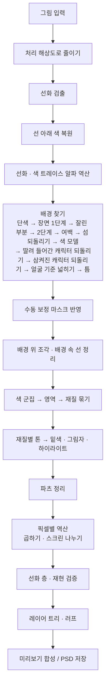

# Illustracy — 일러스트 레이어 분리기

**한국어** | [English](README.en.md)

다 그린 그림 한 장을, 그림을 그릴 때처럼 **여러 장의 투명한 층(레이어)으로 다시 나눠** 포토샵 파일(PSD)로 저장하는 프로그램입니다.

- 파일 하나(`index.html`)를 브라우저로 열면 바로 쓸 수 있습니다.
- 설치도, 인터넷 연결도, 비용도 필요 없습니다.
- 그림은 내 컴퓨터 밖으로 나가지 않습니다.
- 분해능: **0.1의 1.78배**(0.38, 95% 구간 1.50~2.14배. 정답이 있는 그림 185장에서 캐릭터 · 배경을 잘못 가른 비율로 잼, 11).

---

## 목차

1. [쉽게 알아보기](#1-쉽게-알아보기)
2. [원리](#2-원리)
3. [작동 방식](#3-작동-방식)
4. [알고리즘과 수식](#4-알고리즘과-수식)
5. [물리 세계와의 대응](#5-물리-세계와의-대응)
6. [체계 (프로그램 구성)](#6-체계-프로그램-구성)
7. [이슈와 해결](#7-이슈와-해결)
8. [최적화](#8-최적화)
9. [특장점](#9-특장점)
10. [한계](#10-한계)
11. [검증](#11-검증)
12. [업데이트 내역](#12-업데이트-내역)

---

## 1. 쉽게 알아보기

### 이게 뭔가요?

컴퓨터로 그림을 그릴 때는 보통 투명한 종이를 여러 장 겹쳐서 그립니다.
맨 아래 종이에 색을 칠하고, 그 위 종이에 그림자를, 또 그 위에 반짝이는 빛을, 맨 위에 선을 그리는 식입니다.
그런데 다 그린 그림을 한 장으로 합쳐 저장하면 이 종이들이 사라지고 한 장만 남습니다.

Illustracy는 한 장으로 합쳐진 그림을 보고, 그림을 그렸던 순서대로 종이들을 다시 나눠 줍니다.
나눈 종이들을 다시 겹치면 원래 그림과 눈으로 구분할 수 없을 만큼 똑같이 보입니다.

### 무엇으로 나뉘나요?

| 층 | 들어 있는 것 |
|---|---|
| 러프 | 처음에 대충 그린 밑그림처럼 만든 스케치. 원래 그림에는 없으므로 짐작해서 만든 것이고, 처음에는 숨겨져 있습니다 |
| 선화 | 그림의 선 |
| 색 트레이스 | 선 중에서 색이 다른 부분(빛을 받은 선, 색깔 선) |
| 밑색 | 머리카락, 피부, 옷처럼 부분마다 칠한 한 가지 색 |
| 1차 · 2차 그림자 | 밑색 위에 겹친 어두운 부분. 2차는 1차보다 더 어두운 곳 |
| 하이라이트 | 밑색보다 밝게 칠한 부분(머리카락 윤기 등) |
| 명암 · 그라데이션 | 부드럽게 어두워지는 부분 |
| 반사광 · 림라이트 | 그림자 속에서 다시 밝아진 부분, 몸 가장자리에 비친 빛 |
| 빛 · 반짝임 | 빛나는 효과, 눈 속 반짝임, 별 |
| 배경 · 배경 효과 | 캐릭터 뒤의 배경, 배경 위에 떠 있는 빛 조각 |
| 외곽 글로우 | 캐릭터 둘레에 두른 형광 띠(있는 그림만) |

부분(파츠)마다 폴더가 따로 생기고, 폴더 안에 그 부분의 밑색 · 그림자 · 하이라이트가 들어 있습니다.
그림에서 얼굴을 찾으면(배경이 투명한 PNG도) 얼굴 둘레의 색으로 **눈 · 피부 · 머리카락** 폴더에 이름을 붙이고, 나머지 폴더는 색 이름(파랑, 검정 …)으로 붙습니다.

### 무엇이 필요한가요?

- `index.html` 파일 하나와 브라우저(Chrome, Edge, Firefox, Safari)
- 끝. 인터넷, 설치, 계정, 비용이 모두 필요 없습니다.

### 쓰는 법

1. `index.html`을 브라우저로 엽니다.
2. 그림을 창에 끌어다 놓거나, 왼쪽 위 상자를 눌러 고르거나, 복사한 그림을 `Ctrl+V`로 붙여 넣습니다.
   먼저 해 보고 싶으면 **예제 그림**을 누르세요.
3. 몇 초 기다리면 오른쪽에 층 목록이 나옵니다.
   - 동그라미 버튼: 그 층을 켜고 끄기
   - 층 이름 누르기: 섞는 방식과 진하기 바꾸기, 그 층만 그림 파일로 저장
   - 층 이름 두 번 누르기: 이름 바꾸기
   - 목록 위 **눈 모양 버튼**: 눈 뜬 모양을 누르면 모든 층과 폴더가 한 번에 꺼지고 눈 감은 모양으로 바뀝니다. 눈 감은 모양을 누르면 끄기 전 상태로 돌아옵니다.
     모두 끈 뒤 층 하나를 켜면 그 층이 든 폴더도 함께 켜져 그 층만 보이고, 폴더를 켜면 그 안의 층들이 보입니다
4. **PSD 다운로드**를 누르면 포토샵에서 열 수 있는 파일이 저장됩니다. 목록에서 바꾼 이름 · 진하기 · 켜고 끈 상태도 그대로 들어갑니다.

가운데 그림은 마우스 휠로 크게 · 작게 보고, 끌어서 옮깁니다.
위쪽 버튼으로 **합성**(나눈 층을 겹친 모습) · **원본** · **선택 레이어**(고른 층만) · **차이 ×8**(원본과 다른 곳을 8배로 강조)을 바꿔 볼 수 있습니다.

### 틀리게 나뉜 곳 고치기

자동으로 나누다 보면 배경의 물건이 캐릭터 쪽에 남거나, 캐릭터 일부가 배경으로 가기도 합니다.

- **배경으로 보내기**: 켠 뒤 옮길 물건(탁자, 의자 등)을 누르거나 문지르면 배경으로 옮겨집니다. 선을 넘어 옆 부분까지 끌려가지 않습니다.
- **캐릭터로 되돌리기**: 배경에 잘못 들어간 부분(잘린 모자, 소매, 다리)을 문지르면 캐릭터로 돌아오고, 그림을 다시 나눕니다(몇 초).
- 넓은 곳은 옮길 부분을 **빙 둘러 고리**를 그리면(끝을 시작점 근처로 돌아오게) 안쪽이 한 번에 처리됩니다. 고리 안이 옅게 채워지면 고리로 인식된 것입니다.
- 잘못했으면 `↶` 버튼이나 `Ctrl+Z`로 되돌립니다.
- 이 두 도구를 켠 동안 화면 이동은 마우스 오른쪽 버튼으로 끕니다.

고친 내용은 설정을 바꿔 다시 나눠도 남아 있고, 새 그림을 열면 지워집니다. 고쳐도 겹친 결과는 원래 그림 그대로입니다.

### 인터넷 없이 쓰기

1. `index.html`을 내려받습니다(GitHub에서 파일을 열고 *Download raw file*, 또는 저장소 ZIP).
   이미 열어 둔 프로그램에서 왼쪽 위 **⬇ 프로그램 저장 (오프라인 실행용)**을 눌러도 같은 파일을 받습니다.
2. 받은 파일을 더블클릭합니다. 인터넷이 끊겨 있어도 모든 기능이 됩니다.

### 예전 PSD의 층 이름 바꾸기

0.34까지 저장한 PSD에는 선 색 층 이름이 `색트레스`로 적혀 있습니다. 그 PSD를 그림처럼 창에 끌어다 놓거나 왼쪽 위 상자를 눌러 고르면(여러 개 한꺼번에 됩니다)
층 이름을 `색 트레이스`로 고친 PSD가 같은 파일 이름으로 바로 저장됩니다. 그림 · 층 순서 · 폴더 · 클리핑은 그대로이고, 파일은 브라우저 밖으로 나가지 않습니다.
PSB, 16 · 32비트로 바꿔 저장한 파일도 됩니다. 이미 고친 파일이면 고칠 층 이름이 없다고 알려 줍니다.

### 설정

| 설정 | 뜻 |
|---|---|
| 처리 해상도 | 그림의 긴 변을 이 크기로 줄여서 처리합니다(기본 2048px). 클수록 자세하지만 느립니다 |
| 큰 그림은 줄여서 나누기 · 줄이는 방식 · 줄일 크기 | 기본 꺼짐(방식 · 크기도 꺼진 채 움직이지 않음). 켜면 긴 변이 줄일 크기(기본 1200px)보다 큰 그림을 줄여서 나눕니다. 켜거나 방식을 바꾸면 그 방식의 설명과 검증 결과를 보여 주고, 확인하면 바로 다시 나눕니다. **전부 줄여서 나누기**: 모든 단계를 줄인 크기로(PSD도 그 크기). 결과는 원래 크기와 비슷하고 시간은 약 절반. **배경 · 얼굴만 줄여서 찾기**: 배경 · 얼굴만 줄인 그림에서 찾고 층은 처리 해상도로. 캐릭터를 더 잃는 그림이 많아 권하지 않음(11) |
| 선 감도 | 높이면 옅은 선도 선으로 봅니다 |
| 최대 선 굵기 | 이보다 두꺼운 어두운 곳은 선이 아니라 칠한 면으로 봅니다(0 = 그림에서 선 굵기를 재서 자동. 고른 값과 잰 굵기가 옆에 나옵니다) |
| 선 색상 | 선화 + 색 트레이스(기본) / 원래 선 색 그대로 한 장 / 검정 한 가지 |
| 색상 군집 수 | 처음에 색을 몇 가지로 나눠 볼지 |
| 밑색 병합 강도 | 높이면 밝기만 다른 색을 같은 부분으로 더 많이 묶습니다 |
| 그림자 판정 기준 | 높이면 옅게 어두워진 곳도 그림자 층으로 보냅니다 |
| 반짝임 최대 크기 | 이보다 작은 밝은 점을 반짝임으로 봅니다(0 = 해상도에 맞춰 자동) |
| 최대 파츠 수 | 부분 폴더의 최대 개수(기본 32). 넘치는 작은 부분은 "작은 파츠" 폴더로 |
| 채색을 파츠별 폴더로 나누기 | 끄면 밑색 · 그림자 · 하이라이트를 부분 구분 없이 한 장씩 |
| 그림자·하이라이트를 밑색에 클리핑 | 그림자와 하이라이트가 밑색 바깥으로 나가지 않게 묶습니다 |
| 단색 배경 자동 분리 | 배경 찾기를 켜고 끕니다 |
| 기울어진 그림 | 기본 꺼짐. 그림 전체가 크게(45° 넘게) 기울었거나 옆으로 누운 그림에서 켜면, 얼굴을 여러 각도(0 · ±30 · ±60 · ±90°)로 찾아 가장 얼굴다운 각도로 이름 · 캐릭터 폴더 · 배경 규칙을 맞춥니다. 고른 기울기는 결과 줄에 "기울기 N°"로 나옵니다. 똑바른 그림에 켜면 얼굴을 조금 덜 찾고 가짜 얼굴이 조금 늘어(정답 그림 82장: 실제 얼굴 29/35 → 26/35, 가짜 얼굴 15 → 17개) 기울지 않은 그림에는 끄는 편이 낫습니다. 돌려 저장해 네 모서리가 흰색 · 한 색 · 투명인 그림은 켜지 않아도 알아봅니다 |
| 러프 스케치 생성 · 러프 색상 | 러프 층을 만들지, 무슨 색으로 그릴지 |

### 잘 되는 그림, 어려운 그림

- **잘 되는 그림**: 선이 있고, 색을 면으로 또렷하게 나눠 칠한 애니메이션풍 그림(셀 채색)
- **어려운 그림**
  - 선이 없는 그림, 붓 자국이 많은 그림
  - 역광 · 어두운 장면, 얼굴이 손 · 물건에 가려진 그림, 작은(긴 변 900px 미만) 그림
  - 배경의 물건도 캐릭터처럼 진한 선으로 그린 그림(바닥의 과자, 소품 등)
  - 캐릭터와 배경의 색이 거의 같은 그림(검은 옷 + 검은 배경, 흰 옷 · 옅은 머리 + 흰 배경 등)
  - 여러 사람이 나오는 단체 그림, 한 장에 여러 칸을 그린 그림
  - 모서리 없이 꽉 찬 채로 크게(45° 넘게) 기운 그림: 설정 "기울어진 그림"을 켜야 얼굴 · 이름 · 캐릭터 폴더가 나아집니다. 45° 안팎은 켜도 비슷할 때가 많습니다
- 얼굴을 찾으면 눈 · 피부 · 머리카락 부분에 그 이름이 붙고, 나머지 부분은 색 이름(파랑, 검정 …)으로 붙습니다. "옷", "리본" 같은 뜻은 알지 못합니다.

### 설정은 그림을 재서 정합니다

그림을 열면 선(펜)의 굵기를 재서, 기본값으로는 선을 다 담지 못하는 그림일 때만 **최대 선 굵기**를 올립니다.
예를 들어 작은 그림에 굵은 선으로 그렸으면 선 검출 창을 넓힙니다. 보통 그림은 기본값을 그대로 씁니다.
고른 값과 잰 굵기는 설정 옆에 "자동 · 8 px (이 그림 13 px)"처럼 나오고, 슬라이더를 움직이면 그 값으로 바뀝니다.
나머지 설정도 그림에서 재서 정해 봤지만 결과가 나빠지거나 나아지지 않아, 여러 그림으로 맞춘 기본값을 씁니다(7.5).

---

## 2. 원리

### 2.1 작가가 층을 쌓는 순서를 그대로 따른다

셀 채색 작업 파일은 대체로 이런 순서로 쌓입니다.

```
선화            ← 맨 위, 선
빛 · 반짝임      ← 밝게 더하는 효과
명암            ← 부드러운 음영
하이라이트        ← 밑색보다 밝은 면
그림자           ← 밑색 위에 겹쳐 어둡게
밑색            ← 부분마다 한 가지 색
배경
```

층마다 **겹치는 방식**이 다릅니다.

- **표준**: 위의 색이 아래를 덮습니다(밑색, 하이라이트, 선화).
- **곱하기**: 색 셀로판을 겹친 것처럼 아래를 어둡게 합니다(그림자, 명암).
- **스크린**: 조명을 하나 더 켠 것처럼 아래를 밝게 합니다(빛, 반짝임, 림라이트, 반사광).

Illustracy는 결과 파일이 이 구성을 따르도록 나눕니다.

### 2.2 겹친 결과가 원본이 되도록 거꾸로 푼다

겹치는 방식은 모두 간단한 계산식입니다. 그래서 "원래 그림의 색"과 "밑색 · 그림자 색"을 알면,
**나머지 층에 무엇이 들어가야 원래 그림이 나오는지**를 픽셀마다 거꾸로 풀 수 있습니다.

같은 그림을 만드는 층 구성은 무수히 많습니다. 그중에서 작가가 실제로 만들 법한 것을 고릅니다.

- 밑색은 부분마다 한 가지 색
- 그림자도 부분마다 한 가지 색(1차, 필요하면 2차)
- 그 한 가지 색으로 설명되지 않고 남는 차이만 명암 · 빛 층으로

마지막에 남는 차이까지 층에 담기 때문에, 나눈 결과를 겹치면 원본으로 돌아옵니다.
오차는 파일이 색을 0~255 정수로 저장하면서 생기는 반올림 정도뿐입니다.

### 2.3 선은 "가늘고 주변보다 어두운 것"이다

어두운 가는 구조를 지운 그림을 만들고(주변의 밝은 색으로 메움), 원래 그림과의 차이를 보면 선만 남습니다.
두꺼운 어두운 면(검은 옷)은 지워지지 않으므로 선으로 잡히지 않습니다.

### 2.4 선이 가린 색은 주변에서 짐작한다

선 아래에 칠해져 있었을 색은 선 바로 바깥 색을 안쪽으로 한 겹씩 채워 짐작합니다.
아래 색을 알면 "선 색이 몇 %의 진하기로 덮였는지"를 계산할 수 있고, 선의 흐린 가장자리(안티에일리어싱)까지 투명도로 표현됩니다.

### 2.5 배경은 일곱 가지 단서로 가른다

1. **테두리와 이어짐**: 배경은 그림 테두리에 닿아 있고, 캐릭터의 윤곽선을 넘지 않고 이어집니다.
2. **선의 많고 적음**: 캐릭터와 소품은 선으로 그리고, 배경은 선 없이 칠하는 경우가 많습니다.
3. **또렷함**: 배경은 초점이 나간 것처럼 흐리게 그리는 경우가 많아, 진하고 또렷한 선이 드뭅니다.
4. **색의 차이**: 배경까지 선으로 그린 그림은, 그림마다 배경의 색과 캐릭터의 색을 배워서 가릅니다.
5. **선명한 색 경계**: 선 없이 부드럽게 칠한 팔 · 손 · 소매도 초점이 맞은 물체라서 둘레의 색이 또렷하게 바뀝니다.
   선이 적어 배경에 딸려 들어간 조각이 이 경계로 떨어져 있고, 캐릭터에 붙어 있고, 색이 캐릭터 쪽이면 캐릭터로 되돌립니다.
6. **얼굴**: 애니풍 얼굴은 어두운 둥근 눈 두 개가 나란히 있고 그 아래가 밝고 고른 피부입니다. 얼굴을 찾으면 머리와 몸이 어디쯤 있는지 압니다.
   머리 · 몸 자리 밖에서 색이 분명히 배경 쪽이고, 이미 찾은 배경과 선 없이 이어진 곳만 배경에 더합니다.
   캐릭터는 윤곽선으로 둘러싸여 있어서, 배경과 색이 비슷한 머리카락 끝이나 소매 쪽으로는 넘어가지 않습니다.
   반대로 또렷한 얼굴 자리가 배경이 되어 있으면 캐릭터가 통째로 배경에 삼켜진 것이라(윤곽선이 머리카락 · 배경과 같은 색이라 보이지 않는 그림),
   그 머리 · 몸 자리에 든 배경 조각을 캐릭터로 되돌립니다.

7. **선으로 둘러싸임**: 캐릭터는 윤곽선 · 옷 주름 · 머리카락 결에 사방이 둘러싸여 있어, 안에 선이 없는 흰 옷 · 치마 · 단색 머리도 어느 쪽으로 가든 곧 선에 닿습니다.
   배경은 적어도 몇 방향으로는 선 없이 그림 밖까지 트여 있습니다. 선이 드물어도 거의 모든 방향이 선으로 막힌 곳은 배경으로 보지 않습니다.
   다만 흰 배경 · 단색 배경에서는 팔과 몸 사이, 머리카락 가닥 사이로 보이는 배경(틈)도 사방이 윤곽선인데, 이런 곳은 배경과 똑같은 색이고
   둘레가 선과 배경뿐이라 캐릭터의 흰 옷(둘레에 그림자 · 음영이 닿음)과 가를 수 있어 배경으로 보냅니다.

화면 아래 테두리는 캐릭터가 잘려 있는 경우(상반신 그림)가 많아서 배경 찾기의 출발점으로 쓰지 않습니다.

### 2.6 재질 경계에는 선이 있고, 그림자 경계에는 선이 없다

셀 채색에서 머리카락과 피부 사이에는 선을 긋지만, 머리카락의 밝은 면과 그림자 사이에는 선을 긋지 않습니다.
그래서 선 없이 맞닿아 있고 같은 색 계열이면 같은 재질의 명암으로, 선으로 막혀 있으면 다른 재질로 봅니다.

붓으로 칠한 그림에서는 붓 자국 · 머리카락 결이 선으로 잡히기도 합니다. 이런 결은 한 색 위에 그은 것이라 선 양쪽의 색이 같습니다.
그림의 선 대부분이 이런 결이면 결은 재질 경계로 보지 않습니다. 선화 그림은 옅은 피부와 옅은 머리카락처럼 색이 거의 같은 재질도 선으로 가르므로, 선을 그대로 경계로 봅니다.

### 2.7 같은 재질 안에서 가장 넓은 색이 밑색이다

한 재질 안의 색을 다시 몇 가지 톤으로 나누면, 가장 넓게 칠한 톤이 밑색입니다.
그보다 확실히 어두운 톤은 그림자, 확실히 밝은 톤은 하이라이트입니다.
그림자 톤이 밑색보다 채널별로 몇 배 어두운지가 곧 그림자 층의 **곱하기 색**입니다.

### 2.8 밝아진 곳은 위치와 모양으로 종류를 가린다

밑색 · 그림자로 설명되지 않고 더 밝아진 부분은 이렇게 나눕니다.

- 떨어져 있는 작고 아주 밝은 점 → **반짝임**
- 캐릭터 실루엣 가장자리에만 몰린 빛 → **림라이트**
- 그림자 안에서 다시 밝아진 부분 → **반사광**
- 나머지 넓게 퍼진 밝아짐 → **빛**

### 2.9 러프는 완성본에서 거꾸로 만든다

러프는 원래 그림에 남아 있지 않으므로 복원할 수 없습니다.
대신 사람이 연필로 대충 잡은 밑그림처럼 만듭니다.

- 선의 굵기와 진하기를 따라 부드러운 굵은 획으로 그립니다. 원래 선이 진한 눈 · 윤곽은 굵게, 옅은 선은 가늘게 됩니다.
- 그 획을 조금씩 비틀어 세 번 겹쳐, 여러 번 덧그린 연필 선처럼 보이게 합니다.
- 옅은 선도 끊어지지 않도록 선의 가운데 줄을 획 아래에 깔아 둡니다. 선과 이어지지 않는 자잘한 부스러기(반짝임 · 질감 점)는 그리지 않습니다.
- 캐릭터의 선과 실루엣, 배경의 밝기 윤곽까지 담아 구도 전체를 잡습니다.

### 2.10 기본값이 감당하지 못할 때만 그림에 맞춘다

작가는 같은 펜으로 선을 그으므로, 선의 굵기를 세면 한 굵기에 몰립니다. 이 "펜 굵기"를 재면 그림 크기와 상관없이 선을 담을 창의 크기를 알 수 있습니다.
다만 이 프로그램의 다른 단계(배경 찾기가 쓰는 선 밀도 등)는 기본 창에 맞춰져 있으므로, 잰 값이 기본값을 분명히 넘을 때만 바꿉니다.

---

## 3. 작동 방식



### 3.1 준비

그림을 **처리 해상도**(기본 긴 변 2048px)로 줄이고, 계산은 브라우저의 **Web Worker**(화면과 따로 도는 계산 스레드)에서 합니다.
워커를 쓸 수 없는 환경에서는 화면 쪽에서 그대로 계산합니다.

최대 선 굵기가 자동(0)이면 먼저 그림을 잽니다. 주변보다 어둡고 가는 구조의 중심선에서 선 굵기 분포를 세어 펜 굵기를 찾고,
해상도로 정한 기본 창이 이 선을 담지 못하면 창을 넓힙니다(4.3).

### 3.2 선화 검출

밝기 그림에 **클로징**(최대 필터 뒤 최소 필터)을 하면 선 굵기보다 가는 어두운 구조가 주변 밝은 색으로 메워집니다.
"클로징 − 원본"(**블랙 탑햇**)이 선의 깊이입니다. 깊이가 큰 픽셀에서 시작해 조금 약한 픽셀까지 이어 붙이고(**히스테리시스**), 너무 작은 조각은 버립니다.
선이 모이는 교차점처럼 클로징 창보다 넓어진 어두운 덩어리는 선에서 이어서 채우되, 선 굵기를 넘어 계속되는 어두운 면(검은 옷)은 채우지 않습니다.

진하고, 살짝 흐리면 깊이가 크게 줄어드는 선은 **선명한 선**으로 따로 표시합니다. 배경을 가를 때 캐릭터 선과 흐린 배경 자국을 구분하는 데 씁니다.

### 3.3 선 아래 색 복원

선과 그 가장자리 1px을 "모르는 픽셀"로 두고, 바깥쪽부터 한 겹씩 이웃한 아는 픽셀들의 평균으로 채웁니다(양파 껍질 방식 인페인팅).

### 3.4 선화와 색 트레이스

선이 거의 완전히 덮은 픽셀들의 색 중앙값을 **기본 선 색**으로 정합니다.
픽셀마다 "원본 = 선 알파 × 선 색 + (1 − 선 알파) × 아래 색"을 풀어 알파를 구하고,
기본 선 색으로 원본이 맞지 않는 곳(빛 받은 선, 색 선)은 그 자리의 실제 선 색을 따로 구해 **색 트레이스** 층에 넣습니다.
색 트레이스는 선화에 클리핑된 층이라, 선화의 알파 안에서 선 색만 바꿉니다.

### 3.5 배경 찾기

차례로 여러 방법을 쓰고, 찾은 배경을 합칩니다.
그림 가장자리를 가는 테두리 선(액자)이 두르고 있으면 배경 찾기가 테두리에서 출발하지 못하므로, 배경을 찾는 동안만 액자 두께만큼의 바깥을
바로 안쪽 색으로 채워 두고 찾습니다(4.5). 흰 배경의 캐릭터 설정화 · 카드처럼 얇은 테두리를 두른 그림에서 배경을 찾지 못하던 것이 풀렸습니다.
그림을 기울여 저장해 캔버스가 넓어지고 네 모서리가 한 색(흰색 등)이나 투명으로 채워진 그림(**돌린 캔버스**)은 그 채움을 알아보고,
배경을 찾는 동안만 채움과 그 둘레 3px를 가장 가까운 그림 내용의 값으로 채워 둔 뒤, 끝나면 채움을 배경으로 둡니다(4.5, 0.37).
모서리가 투명해도 투명 배경 그림으로 보지 않고 배경을 찾습니다. 채움의 곧은 변에서 그림이 몇 도 기울었는지도 알 수 있어,
얼굴을 그 기울기로 찾고(4.5) 아래 테두리 · 위쪽 모서리 규칙을 얼굴로 정한 그림의 실제 아래쪽에 맞춥니다.

1. **단색 · 그라데이션 배경**: 테두리에서 가장 흔한 색에서 출발해 선을 넘지 않고 비슷한 색으로 퍼집니다. 테두리를 따라 색이 서서히 바뀌는 그라데이션도 따라갑니다.
   위 · 왼쪽 · 오른쪽 테두리에서 먼저 퍼지고, 아래 테두리에서만 닿는 곳은 거의 한 색일 때만 배경으로 둡니다(그림 아래 끝에 걸친 흰 옷 · 치마는 배경과 같은 흰색이어도 명암이 있음).
   이웃 픽셀 사이 색 변화의 문턱은 긴 변 1200px 그림에서 맞췄고, 그보다 큰 그림은 크기에 비례해 줄입니다(같은 경계의 색 변화가 더 많은 픽셀에 나뉘기 때문. 5의 여백 넓히기도 같음).
   줄인 문턱으로 배경이 모자라면 원래 문턱으로 다시 합니다.
   찾은 배경이 밝고 거의 한 색이면(흰 배경 · 옅은 단색 배경) 좁은 틈을 막고 한 번 더 채웁니다. 선과 색이 확 바뀌는 경계에서 2px(긴 변 1200px 기준) 안으로는
   채우기가 지나가지 못하게 해, 옅은 윤곽선이 끊긴 곳으로 흰 옷 · 옅은 머리카락 안까지 들어가지 않게 하고, 다 채운 뒤 경계 쪽으로 그만큼 되살립니다(4.5, 0.34).
2. **장면 배경 1단계**: 선의 밀도(선 픽셀을 넓게 흐린 값)가 낮은 곳 중 위 · 왼쪽 · 오른쪽 테두리와 이어진 곳.
   다만 선으로 둘러싸인 곳(16방향 중 15방향 이상이 긴 변의 25% 안에서 선에 막힌 곳, 4.5)은 선이 드물어도 뺍니다.
   넓게 흐린 선 밀도는 선 없는 흰 옷 · 치마 · 단색 머리의 가운데에서 배경만큼 낮아지지만, 둘러싸인 정도는 낮아지지 않습니다.
   둘러싸인 곳을 빼니 장면 배경이 넓이 기준(아래 5)에 못 미치는 그림(화면 전체를 선으로 촘촘히 그린 그림)은, 둘러싸인 곳을 빼지 않고 1~5를 다시 합니다.
   단색 배경(위 1)의 가장자리에서 색이 확 바뀌는 곳은 건너지 않습니다(4.5, 0.37). 윤곽선이 옷과 같은 색이라 선으로 잡히지 않는
   검은 스타킹 · 검은 옷 · 짙은 머리카락이 흰 배경과 맞닿으면, 선이 드문 곳을 따라가는 장면 배경이 그 안까지 들어가 버렸기 때문입니다.
3. **잘린 캐릭터 부분 가려내기**: 테두리를 따라 걸으며, 선명한 윤곽선을 사이에 두고 배경 조각들 사이에 끼어 있고 양옆과 색이 확연히 다른 조각은 화면에서 잘린 캐릭터 부분(모자, 소매)으로 보고 되돌립니다.
4. **장면 배경 2단계**: 선명한 선은 없고 흐린 자국만 빽빽한 곳(흐리게 그린 선반, 글씨, 무늬)으로 넓힙니다.
5. **여백**: 캐릭터 둘레의 여백을 선을 넘지 않고 색이 매끄럽게 이어지는 곳까지 넓힙니다. 선으로 둘러싸인 곳으로는 넓히지 않습니다.
   그다음 삼켜진 캐릭터를 되돌리고(아래 8), 남은 넓이가 그림의 2~90%일 때만 장면 배경으로 씁니다.
   **장면 배경 속 섬 되돌리기**(4.5, 0.38): 단색 배경(위 1)이 있는 그림이면, 장면 배경 중 단색 배경과 같은 색이 아닌 덩어리(섬)가
   위 · 왼쪽 · 오른쪽 테두리에 닿는지 봅니다. 닿지 않는 섬은 장면 배경이 단색 배경을 거쳐서만 들어간 곳 — 선 없이 칠한 옷 · 다리 · 머리카락이
   단색 배경 가장자리의 약한 경계로 새어 나간 곳입니다. 이런 섬이 캐릭터 쪽 큰 덩어리(가장 큰 덩어리의 4분의 1 이상)와 이어져 있거나 얼굴을 품으면 캐릭터로 되돌립니다.
   캐릭터에서 떨어져 떠 있는 글자 · 문양 · 반짝이는 덩어리가 작아 배경으로 남습니다.
6. **색 모델**: 배경도 선으로 그린 그림(불꽃놀이, 포장마차, 그래피티)을 위해, 그림을 작은 색 영역으로 나눈 뒤
   "지금까지 찾은 배경"과 "선명한 선이 촘촘한 캐릭터 핵심"의 색 분포를 배워 영역 단위로 가릅니다(GrabCut 방식의 그래프 컷).
   색이 많이 겹치는 그림, 이미 배경을 다 찾은 그림에서는 하지 않고, 이미 찾은 배경을 빼는 일 없이 더하기만 합니다. 선으로 둘러싸인 영역은 더하지 않습니다.
7. **딸려 들어간 캐릭터 부분 되돌리기**: 1~5에서 찾은 배경(아래 8로 되돌리기 전)을 선명한 색 경계와 선에서 잘라 조각으로 나눕니다.
   위 · 왼쪽 · 오른쪽 테두리에 닿지 않고, 둘레의 80% 이상이 캐릭터와 맞닿아 있고, 색이 나머지 배경보다 캐릭터에 가까운 조각을
   캐릭터로 되돌립니다(선 없이 칠한 팔 · 손 · 소매 · 날개). 색 모델은 되돌리기 전의 배경으로 계산하고, 되돌린 부분은 색 모델이 더한 배경에서도 뺍니다.
8. **삼켜진 캐릭터 되돌리기**: 점수가 높은 얼굴(4.5)의 얼굴 자리나 정수리 칸이 4분의 1 넘게 배경이면, 윤곽선이 보이지 않는 캐릭터를
   장면 배경이 통째로 삼킨 것입니다(검은 머리카락 · 옷의 윤곽선이 머리카락과 같은 색, 어두운 배경 위의 어두운 윤곽선). 배경을 선명한 색 경계와 선에서 잘라,
   그 얼굴의 머리 · 몸 자리에 절반 이상 들고, 위 · 왼쪽 · 오른쪽 테두리에 닿지 않고, 색이 테두리 쪽 배경에서 드문 조각을 캐릭터로 되돌립니다.
   그래도 삼켜진 얼굴이 남으면(배경과 거의 같은 색의 머리카락) 더 옅은 색 경계로, 그래도 남으면 그보다 더 옅은 경계와 더 고운 색 칸으로 한 번 더 나눕니다(0.34).
   장면 배경 단계(5 뒤)와 색 모델 뒤(7 뒤)에 두 번 합니다.
   얼굴이 멀쩡해도 그 아래 몸 자리에 절반 이상 드는 배경 조각은 먼저 되돌립니다(흰 배경 위의 흰 옷 · 치마가 아래 테두리까지 배경과 이어진 경우).
   이때는 색이 드물 필요가 없지만, 색이 캐릭터보다 나머지 배경에 훨씬 흔한 조각(치마와 소매 사이로 보이는 배경, 글자 칸)은 남깁니다.
9. **얼굴 기준으로 넓히기**: 그림에서 애니풍 얼굴을 찾으면(4.5), 얼굴마다 머리와 몸이 있을 자리를 "캐릭터일 확률"로 두고 색 모델과 같은 영역 그래프 컷을 다시 합니다.
   그 결과 배경 쪽이 된 영역 중, 색이 분명히 배경 쪽이고 머리 · 몸 자리 밖이며 이미 찾은 배경에서 선 없는 경계(맞닿은 길이의 절반 이상이 선이 아님)로만
   이어진 곳을 배경에 더합니다. 7 · 8에서 되돌린 부분과 선으로 둘러싸인 영역은 가져가지 않고, 이미 찾은 배경을 빼는 일은 없습니다. 얼굴을 못 찾은 그림에서는 하지 않습니다.
   이미 찾은 배경이 거의 한 색(흰 배경 · 단색 배경, 배경 픽셀의 60% 이상이 가운데 색과 비슷함)이면 하지 않습니다.
   이런 배경은 1~8로 이미 거의 다 찾았고, 넓히면 같은 색의 캐릭터 부분(흰 드레스, 검은 머리카락)을 가져가는 일이 더 많았기 때문입니다(12의 0.27).
10. **캐릭터 사이로 보이는 배경(틈)**: 찾은 배경이 거의 한 색이면(흰 배경 · 단색 배경), 캐릭터 쪽에 남은 칠 중 배경과 거의 같은 색(`ΔE` 5 안)인 조각을 봅니다.
   둘레가 선 · 배경뿐이고(다른 색 칠에 닿은 둘레가 10% 이하), 얼굴의 머리 자리 밖이고, 그림의 2% 이하인 조각은 팔과 몸 사이 · 머리카락 사이 · 다리 사이로 보이는
   배경이므로 배경으로 보냅니다. 이런 곳은 사방이 윤곽선이라 1~9가 닿지 못하고, 선으로 둘러싸여 있어 일부러 막아 둔 곳입니다(0.31).
   흰 옷 · 흰 머리카락은 그림자 · 음영에 닿아 있어 남습니다. 조건에 맞는 조각이 캐릭터 칠의 5%를 넘는 그림(흰 칠 흑백 선화, 흰 배경 위의 흰 옷)과
   캐릭터 쪽 픽셀의 30% 이상이 선인 그림(입자 · 망점이 선으로 잡힘)은 하지 않습니다(4.5).

얼굴은 배경을 찾지 않았거나(배경 분리를 끔, 투명 배경 PNG) 찾지 못한 그림에서도 찾아, 파츠 이름과 캐릭터 나누기에 씁니다.
투명 배경 그림은 투명한 곳을 배경으로 보고 4.5의 "얼굴다운 자리" 조건을 봅니다.

설정 "큰 그림은 줄여서 나누기"의 "배경 · 얼굴만 줄여서 찾기"를 켜면, 1~9와 얼굴 찾기를 긴 변을 줄인 그림에서 하고 찾은 배경 · 되돌린 부분 · 얼굴을 원래 크기로 키워 씁니다(4.5).

그다음 사용자가 칠한 보정(배경으로 보내기 / 캐릭터로 되돌리기)을 자동 판정보다 우선해서 반영합니다.
배경을 못 찾은 그림은 배경으로 보내기를 칠했을 때 비로소 배경 층이 생깁니다.

### 3.6 배경 위 조각과 배경 속 선 정리

- 배경에 둘러싸인 작은 조각(입자, 빛줄기 조각)은 캐릭터 파츠가 아니라, 아래 배경색을 주변에서 짐작해 **배경 + 배경 효과(스크린)**로 나눕니다.
  배경에서 되돌린 캐릭터 부분과 사용자가 캐릭터로 되돌린 부분은 작아도 여기에 넣지 않습니다.
- 배경 안에 흡수된 흐린 자국, 캐릭터에서 멀리 떨어진 배경 그림의 선(창틀, 구름), 배경색과 같은 색의 "선"(빛줄기 사이로 보이는 배경 틈)은 선화에서 빼서 배경 그림에 남깁니다.

### 3.7 영역 나누기와 재질 묶기

선 아래 색을 복원한 그림을 Lab 색공간에서 **k-평균**으로 몇 가지 색(기본 18)으로 나누고, 같은 색끼리 이어진 덩어리를 **영역**으로 삼습니다.
너무 작거나 가느다란 영역(가장자리 번짐)은 버리고 가까운 영역으로 채웁니다.
배경 판정에서 캐릭터로 둔 곳은 배경에서 2.5px 넘게 떨어져 있으면 배경 번호를 받지 않고 가까운 캐릭터 영역으로 채웁니다
(결이 있는 종이 · 잔 붓 자국은 색이 잘게 부서져 넓은 칠이 통째로 버려지고, 배경 쪽 번호가 번져 들어와 캐릭터가 배경이 되던 것).
틈(3.5의 10)으로 보낸 배경은 캐릭터 한가운데에 있어, 그 번호가 선을 타고 캐릭터 안으로 멀리 번질 수 있습니다. 가장 가까운 배경이 틈인 선 · 잔조각 픽셀은
틈에서 2.5px 넘게 떨어져 있으면 배경 번호 대신 가까운 캐릭터 번호를 줍니다(영역과 톤 모두, 4.6).
맞닿은 영역 쌍마다 경계가 선으로 막힌 길이와 열린 길이를 세어 **인접 그래프**를 만들고,
경계가 대부분 열려 있고 색이 같은 재질의 명암 관계이면 한 재질로 묶습니다.
붓 결이 선으로 잡힌 그림(선 양쪽 색이 같은 선이 절반 이상)에서는 양쪽 색이 같은 선 경계를 열린 경계로 셉니다(4.6).

### 3.8 톤과 밑색

재질마다 다시 k-평균으로 톤(최대 6개)을 나눕니다. 가장 넓은 톤(넓이가 비슷하면 더 밝은 쪽)의 밝은 쪽 평균이 **밑색**입니다.
선으로 나뉜 같은 재질(앞머리 / 뒷머리)은 밑색을 서로 맞춥니다.

### 3.9 파츠 정리

실제 작업 파일처럼 부분 수를 줄입니다.

1. 거의 같은 밑색끼리 한 파츠로
2. 선 건너편의 더 어두운 면이 밝은 파츠의 그림자로 그럴듯하면 합침(흰 머리카락 옆 연보라 가닥).
   그림자는 어느 채널도 밝은 면보다 밝을 수 없고, 밝은 면에 색상이 있으면 그 색상 가까이에 있어야 합니다(회색 옷 옆 살구색 피부, 크림색 옷 옆 분홍 피부는 합치지 않음)
3. 작은 조각은 색이 비슷한 이웃 파츠로
4. 파츠가 **최대 파츠 수**를 넘으면 가장 작은 것부터 비슷한 색의 이웃에 합치고, 비슷한 이웃이 없으면 **작은 파츠** 폴더로
5. **이름 붙이기**: 캐릭터 얼굴마다 얼굴 틀로 콧등 · 볼(피부), 앞머리(머리카락, 이마가 드러났으면 그 위), 두 눈 칸(눈)을 차지한 파츠를 찾아 그 이름을 붙입니다(4.8).
   나머지 파츠는 밑색의 색 이름(검정, 흰색, 파랑 …)으로 붙습니다. "피부"는 얼굴로 확인한 파츠에만 붙이고, 다른 살색 파츠는 얼굴을 못 찾은 그림에서도 "베이지 · 살구"로 부릅니다.
6. **떨어진 머리카락 조각 떼기**: 파츠는 같은 밑색을 그림 전체에서 모은 것이라, 머리카락과 같은 색의 치마 · 다리 · 소매 · 소품 · 배경 조각도 "머리카락" 파츠에 들어 있습니다.
   얼굴의 머리 자리에서 같은 파츠를 따라 이어진 곳과, 거기서 가까운(얼굴 두 눈 사이의 2.5배 안) 조각만 "머리카락"으로 두고,
   나머지는 같은 색의 따로 된 파츠(색 이름)로 뗍니다. 팔 · 소매에 가려 끊긴 긴 머리 · 트윈테일은 가까워서 남고, 몸 가운데의 넥타이 · 리본 · 다리는 가까워도 뗍니다.
   피부는 떨어진 조각도 대부분 진짜 손 · 팔 · 다리라 떼지 않습니다. 층의 픽셀은 바뀌지 않고 파츠 층만 나뉩니다(4.8).

### 3.10 그림자 단계와 하이라이트

밑색보다 확실히 어두운 톤은 그림자입니다. 그림자 톤들을 밝기 순으로 늘어놓고 틈이 크게 벌어진 곳에서 **1차 / 2차**로 나눕니다.
단계마다 곱하기 색을 하나씩 정합니다(2차는 1차 위에 한 번 더 곱해지는 색).
밑색보다 확실히 밝은 톤은 하이라이트(표준 층)이고, 거의 흰색이며 훨씬 밝은 작은 톤 조각은 반짝임 후보입니다.

### 3.11 역산: 명암과 빛 나누기

픽셀마다 "밑색 × 1차 × 2차 → 하이라이트"까지 칠한 색과 선 아래 복원색을 비교합니다.

- 더 어두우면 남은 **어두워짐**을, 넓게 깔린 부분(**그라데이션**)과 나머지(**명암**)로 나눕니다. 둘 다 곱하기라서 곱하면 원래 어두워짐이 됩니다.
- 더 밝으면 남은 **밝아짐**을 반짝임 → 림라이트 → 가는 반짝임 → 반사광 → 빛 순서로 떼어 냅니다. 스크린끼리 겹친 결과가 원래 밝아짐과 같도록 나눕니다.

내용이 거의 없는 층은 만들지 않습니다(예: 셀 채색 그림의 그라데이션). 그 몫은 명암 · 빛에 남깁니다.

### 3.12 선화 층, 검증, 레이어 트리, 러프

선화 · 색 트레이스 층을 만든 뒤, **저장될 8비트 값 그대로** 모든 층을 다시 합성해 원본과 비교합니다(재현 PSNR, 화면 오른쪽 위에 표시).
층들을 작업 파일 구성의 트리로 묶고, 러프를 만들어 맨 위에 숨겨 둡니다.

```
러프 (추정)                 표준 45%, 숨김
[캐릭터]
  [선화]
    색 트레이스                표준, ↳클리핑
    선화                    표준
  [효과]
    반짝임                  스크린
    빛                      스크린
  [채색]
    림라이트                스크린
    반사광                  스크린
    명암                    곱하기
    그라데이션              곱하기
    [피부] [머리카락] [보라] …  파츠 폴더(눈 · 피부 · 머리카락, 나머지는 밑색 색 이름)
      하이라이트            표준, ↳클리핑
      2차 그림자            곱하기, ↳클리핑
      1차 그림자            곱하기, ↳클리핑
      밑색 #7B56B5          표준
    [작은 파츠 (n)]         색이 비슷한 이웃이 없는 작은 파츠들
    실루엣 (선택용)         표준, 숨김
[배경]
  배경 효과                 스크린
  외곽 글로우               표준(캐릭터 둘레에 형광 띠를 두른 그림만)
  배경                      표준
```

배경이 없는 불투명한 그림은 [캐릭터] · [배경] 폴더 없이 [선화] · [효과] · [채색]이 맨 위에 옵니다.

**캐릭터가 여럿이면** [캐릭터] 대신 왼쪽부터 [캐릭터 1] · [캐릭터 2] … 폴더가 생기고, 폴더마다 위와 같은 [선화] · [효과] · [채색]이 들어 있습니다.
캐릭터는 찾은 얼굴로 정합니다. 크기와 높이가 비슷하고 서로의 몸 자리 밖에 있는 얼굴들을 캐릭터로 보고(무릎 · 신발에서 찾은 가짜 얼굴은 빠짐),
각 얼굴의 머리 · 몸 자리에서 출발해 윤곽선을 벽으로 삼아 픽셀을 나눕니다(4.8). 층을 합성한 결과는 한 폴더일 때와 같습니다.

### 3.13 미리보기와 PSD 저장

미리보기는 브라우저 캔버스의 혼합 모드(`multiply`, `screen`)로 층을 겹치고, 클리핑은 포토샵과 같은 방식으로 흉내 냅니다.
PSD는 외부 라이브러리 없이 직접 씁니다(RGB 8비트, 폴더, 클리핑, 혼합 모드, 한글 층 이름, 병합 이미지).

### 3.14 수동 보정

- **배경으로 보내기**: 획이 닿은 파츠와 그와 거의 같은 색의 파츠 안에서, 선을 넘지 않고 색이 이어지는 곳을 골라
  배경 층으로 원본 색 그대로 옮기고 캐릭터 쪽 층에서는 지웁니다. 그래서 다시 나누지 않아도 합성 결과가 원본과 같습니다.
- **캐릭터로 되돌리기**: 배경에서 선을 넘지 않고 이어지는 곳을 "여기는 캐릭터"로 표시하고 그림을 다시 나눕니다.
- 두 보정은 그림 크기의 표시(마스크)로 남아, 옵션을 바꿔 다시 나눠도 자동 판정보다 먼저 반영됩니다.
- 보정 뒤 다시 나눌 때는 자동 배경 판정(배경 찾기 · 얼굴 찾기, 한 장에 대개 2~4초)을 다시 하지 않고 저장해 둔 결과를 씁니다.
  이 단계는 보정과 상관없고 선 · 복원색을 바꾸지 않아, 결과는 처음부터 다시 계산한 것과 바이트 단위로 같습니다. 그림이나 선 설정(선 굵기 · 감도 · 선 색 방식 · 배경 분리)을 바꾸면 다시 계산합니다.

---

## 4. 알고리즘과 수식

### 4.0 표기

- 픽셀 값은 0~1로 둔 sRGB 값입니다(8비트 값 ÷ 255). 원본을 `O`, 알파를 `A`, 선 아래 복원색을 `U`, 채널을 `c ∈ {R, G, B}`로 씁니다.
- 밝기는 `lum(r, g, b) = 0.299r + 0.587g + 0.114b`입니다.
  선을 찾을 때의 밝기는 흰 바탕에 얹은 색의 밝기 `L = lum(A·O_R + 1 − A, A·O_G + 1 − A, A·O_B + 1 − A)`입니다.
- **처리 해상도**: 긴 변 한계 `M`(기본 2048, 0은 원본 크기)에 대해 `k = min(1, M / max(w₀, h₀))`, `W = max(1, round(k·w₀))`, `H = max(1, round(k·h₀))`로
  브라우저의 고품질 축소를 씁니다. `N = W·H`입니다. 한계가 0이고 원본이 1600만 픽셀을 넘으면 경고를 띄웁니다.
- **투명 그림**: `A < 0.98`인 픽셀이 `0.001N`보다 많으면 투명 그림으로 봅니다. `A ≤ 0.02`인 픽셀은 빈 곳입니다.
- `s = max(W, H) / 1000`은 그림 크기에 따른 배율입니다(길이 기준값에 곱함).
- `clamp(x) = min(1, max(0, x))`, `smoothstep(a, b, x)`는 `t = clamp((x − a)/(b − a))`에 대한 `t²(3 − 2t)`입니다(`a > b`이면 거꾸로 내려가는 곡선).
- 색 차이 `ΔE`는 CIE76(Lab 공간의 유클리드 거리)입니다. 색상각 차이는 `d = |h₁ − h₂| mod 360°`에 대해 `Δh = min(d, 360° − d)`입니다.
- 설정의 백분율 슬라이더(선 감도 `η`, 밑색 병합 강도 `m`, 그림자 판정 기준 `η_s`)는 `값 / 100`으로 0~1이 됩니다.
- `round`는 가장 가까운 정수(0.5는 올림), `⌊ ⌋` · `⌈ ⌉`는 내림 · 올림입니다.

### 4.1 색공간

sRGB를 선형화한 뒤 XYZ(D65)를 거쳐 Lab으로 바꿉니다.

```math
C_{lin}=\begin{cases}C/12.92 & C\le 0.04045\\ \left(\frac{C+0.055}{1.055}\right)^{2.4} & \text{otherwise}\end{cases}
\qquad
L^*=116f(Y)-16,\; a^*=500\,(f(X/X_n)-f(Y)),\; b^*=200\,(f(Y)-f(Z/Z_n))
```

```math
f(t)=\begin{cases}t^{1/3} & t>0.008856\\ 7.787\,t+16/116 & \text{otherwise}\end{cases}
```

선형 RGB에서 XYZ로는 sRGB(D65) 행렬을 쓰고, 기준 백색은 `X_n = 0.95047, Y_n = 1, Z_n = 1.08883`입니다.

```math
\begin{pmatrix}X\\Y\\Z\end{pmatrix}=
\begin{pmatrix}0.4124564&0.3575761&0.1804375\\0.2126729&0.7151522&0.0721750\\0.0193339&0.1191920&0.9503041\end{pmatrix}
\begin{pmatrix}R_{lin}\\G_{lin}\\B_{lin}\end{pmatrix}
```

선형화는 8비트 값 256칸 표로 미리 계산해 둡니다(`C`를 `round(255C)`칸으로). 채도 `C* = √(a*² + b*²)`, 색상각 `h = atan2(b*, a*)`(도 단위).

**Lab → sRGB**(표본이 하나도 없는 톤의 색을 k-평균 중심에서 되살릴 때):

```math
f_y=\frac{L^*+16}{116},\ f_x=f_y+\frac{a^*}{500},\ f_z=f_y-\frac{b^*}{200},\qquad
f^{-1}(t)=\begin{cases}t^3 & t^3>0.008856\\ (t-16/116)/7.787 & \text{otherwise}\end{cases}
```

```math
\begin{pmatrix}R_{lin}\\G_{lin}\\B_{lin}\end{pmatrix}=
\begin{pmatrix}3.2404542&-1.5371385&-0.4985314\\-0.9692660&1.8760108&0.0415560\\0.0556434&-0.2040259&1.0572252\end{pmatrix}
\begin{pmatrix}X_n f^{-1}(f_x)\\ f^{-1}(f_y)\\ Z_n f^{-1}(f_z)\end{pmatrix},\qquad
C=\begin{cases}12.92\,C_{lin} & C_{lin}\le 0.0031308\\ 1.055\,C_{lin}^{1/2.4}-0.055 & \text{otherwise}\end{cases}
```

(`C_lin`은 0~1로 자른 뒤 감마를 씌웁니다.) 수동 보정 도구의 색 비교(4.17)도 같은 식의 Lab을 씁니다.

### 4.2 기본 연산

- **팽창 / 침식**(정사각형 반지름 `r`): `dilate_r(f)(x, y) = max_{|i|, |j| ≤ r} f(x + i, y + j)`(침식은 min, 그림 밖은 창에서 뺌).
  행과 열로 나눈 1차원 슬라이딩 최대 / 최소를 **단조 덱**으로 계산해 픽셀당 `O(1)`입니다. **닫기**는 팽창 뒤 침식, **열기**는 침식 뒤 팽창입니다.
- **가우시안 흐림**: 반지름 `r`인 상자 흐림(폭 `2r + 1`, 그림 밖은 가장자리 값을 되풀이)을 가로 · 세로로 3번 반복해 근사합니다.
  상자 한 번의 분산이 `((2r + 1)² − 1)/12 = r(r + 1)/3`이므로 세 번이면 `r(r + 1) = σ²`이 되고, 이를 풀면
  `r = max(1, round((√(4σ² + 1) − 1)/2))`입니다. `σ < 0.3`이면 흐리지 않습니다.
- **인페인팅**: 모르는 픽셀을 아는 픽셀과의 거리 순서(바깥 겹부터)로 방문해, 한 겹 안쪽까지 확정된 8-이웃의 평균으로 채웁니다.

  ```math
  U(p)=\frac{1}{|\mathcal N_p|}\sum_{q\in\mathcal N_p}U(q),\qquad \mathcal N_p=\{q\in 8\text{-이웃}(p):\ \text{겹}(q)<\text{겹}(p)\}
  ```

- **라벨 채우기**: 라벨 없는 픽셀을 거리 순서로 방문해, 확정된 8-이웃 라벨의 다수결(4-이웃은 2표, 대각선은 1표)로 채웁니다.
- **연결 성분**: 같은 값끼리 4-이웃으로 이어진 덩어리입니다. **둘레**는 성분의 픽셀마다 4-이웃 중 다른 성분(또는 그림 밖)인 변의 수를 더한 값입니다.
- **거리 변환**(체임퍼): 가로 · 세로 한 칸 1, 대각선 한 칸 `√2`인 두 번 훑기(위 → 아래, 아래 → 위)로 가장 가까운 표시 픽셀까지의 거리를 근사합니다.

  ```math
  d(p)=\min\big(d(p),\ d(q)+w_{pq}\big),\qquad w_{pq}\in\{1,\sqrt2\}
  ```

  "몇 걸음 안"이라고 쓴 곳은 4-이웃 너비 우선 탐색의 걸음 수(맨해튼 거리)입니다.
- **k-평균**(Lab 제곱 거리): 표본 `M = min(n, M_max)`개를 뽑고(`n > M_max`이면 복원 추출), **k-means++**로 첫 중심은 고르게, 다음 중심은 지금까지의 가장 가까운 중심까지 거리의 제곱 `D(x)²`에 비례하는 확률로 뽑습니다.
  배정 → 평균 갱신을 최대 18번 하고, 4번째 반복부터 배정이 바뀐 표본이 `0.001M` 미만이면 멈춥니다. 빈 군집은 가장 먼 표본으로 옮깁니다.
  `M_max`는 영역 나누기 50000, 색 모델의 영역 그래프 40000, 재질별 톤 6000입니다.
- **난수**: 결과가 매번 같도록 고정 씨앗의 mulberry32를 씁니다(본 계산 12345, 색 모델 · 얼굴 단계의 영역 그래프 777). 32비트 정수 연산으로
  `s ← s + 0x6D2B79F5`, `t = (s ⊕ s≫15)·(s | 1)`, `t ← t ⊕ (t + (t ⊕ t≫7)·(t | 61))`, 난수 `= (t ⊕ t≫14) / 2³²`입니다(`≫`는 부호 없는 오른쪽 밀기).
- **값 잡음**(러프의 흔들림): 간격 `cell`인 격자점마다 `[−1, 1]`의 난수 `g`를 두고, 격자 칸 안에서 `sx = smoothstep(0, 1, tx)`, `sy = smoothstep(0, 1, ty)`로 섞습니다.

  ```math
  n(x,y)=\big(g_{00}+(g_{10}-g_{00})s_x\big)(1-s_y)+\big(g_{01}+(g_{11}-g_{01})s_x\big)s_y
  ```

- **쌍선형 보간**: `x₀ = ⌊x⌋, t_x = x − x₀`(세로도 같게)일 때 `f = f₀₀(1 − t_x)(1 − t_y) + f₁₀t_x(1 − t_y) + f₀₁(1 − t_x)t_y + f₁₁t_x t_y`.
- **크기 바꾸기**(얼굴 찾기용, 가로 · 세로 따로): 비율 `r = n / m`(원래 칸 수 / 새 칸 수)이 1 이상이면 새 칸 `i`가 덮는 원래 구간 `[ir, (i + 1)r)`의 **면적 평균**,
  1 미만이면 `x = (i + 0.5)r − 0.5`에서의 **선형 보간**입니다.
- **백분위**: 오름차순 `s₀ … s_{n−1}`에서 `x = (n − 1)q / 100`, `k = ⌊x⌋`일 때 `s_k + (s_{k+1} − s_k)(x − k)`(가운데값은 `q = 50`). **표준편차**는 `n`으로 나눈 모표준편차입니다.
- **z 정규화**: `z = (a − 평균) / 표준편차`(표준편차가 `10⁻⁶` 이하이면 모두 0).

### 4.3 선화 검출

선 굵기 한계 `w`(기본 `w₀ = max(3, round(4s))`, 아래 자동 설정 또는 설정값)로 밝기 `L`을 클로징합니다.

```math
\mathcal{C}=\mathrm{erode}_w(\mathrm{dilate}_w(L)),\qquad d=\mathcal{C}-L,\qquad
\mathrm{strength}=\min\!\left(\frac{d}{\mathcal{C}},\frac{d}{0.3}\right)\quad(\mathcal{C}>0.02,\ d>0)
```

히스테리시스 임계값은 선 감도 `η ∈ [0, 1]`(기본 0.5)에서

```math
t_{high}=0.58-0.34\,\eta,\qquad t_{low}=0.45\,t_{high}
```

`strength ≥ t_high`인 픽셀에서 출발해 `strength ≥ t_low`인 8-이웃으로 넓히고, `max(4, round(6s))`픽셀보다 작은 조각은 버립니다.
`strength`는 "주변의 밝은 칠(`𝒞`)에 비해 얼마나 어두운가"(`d/𝒞`)와 "절대적으로 얼마나 어두운가"(`d/0.3`) 중 작은 값이라, 어두운 칠 위의 얕은 요철과 밝은 칠 위의 옅은 잡음을 모두 거릅니다.

**교차점 채우기**: 선에서 출발해 `w + 1`단계까지, 출발 선의 밝기 `L_ref`보다 0.05 이상 밝지 않고 `L ≤ 0.5`인 픽셀로 넓힙니다.
넓힌 덩어리 중 `w + 1`단계 끝까지 닿은 것(선 굵기를 넘어 이어지는 어두운 면)은 버리고 나머지를 선에 더합니다.

**선명한 선**:

```math
d>0.02,\qquad \mathrm{strength}\ge 0.45,\qquad \frac{G_{1.5}(L)-L}{d}\ge 0.25
```

`G_σ`는 가우시안 흐림입니다. 세 번째 조건은 "살짝 흐리면 깊이의 25% 이상이 사라지는 가는 선"을 뜻합니다.

선과 그 8-이웃 1px을 `inMask`, 나머지 픽셀 중 `A > 0.02`인 것을 `known`으로 둡니다.

**자동 설정(최대 선 굵기가 0일 때)**

**펜 굵기**: 넉넉한 창 `R_b = max(8, round(12s))`로 위와 같은 `strength`를 구하고, `strength ≥ 0.5`인 구조의 거리 변환 `D`(체임퍼)에서
4-이웃 극대점(`D(p) ≥` 네 이웃의 `D`, 중심선)마다 굵기 `2D − 1`(≥ 1.8)을 셉니다. 굵기를 `round`한 1px 칸 히스토그램 `h`(0~63)에서
`w = 2 … 59` 중 `Σ_{|k − w| ≤ max(1, round(0.2w))} h_k`가 가장 큰 굵기가 봉우리 `m`이고,
`m`의 3배 이하인 굵기들을 오름차순으로 놓은 `⌊0.9(n − 1)⌋`번째 값(소수 첫째 자리)이 펜 굵기 `w₉₀`입니다. 중심선이 150개 미만이면 재지 않습니다.

```math
w=\begin{cases}\min\big(16,\ \lceil w_{90}/2\rceil+1\big) & \lceil w_{90}/2\rceil+1\ \ge\ w_0+2\\ w_0 & \text{그 밖}\end{cases}
```

### 4.4 선 알파와 선 색

선이 덮은 픽셀은 표준 합성식을 만족해야 합니다.

```math
O_c=a\,K_c+(1-a)\,U_c
```

- **검정 단색**(`K = 0`): `a = clamp(1 − lum(O)/lum(U))`(`lum(U) ≤ 0.01`이면 0)
- **원본 선 색 한 장**: `a = clamp(max_c(1 − O_c/U_c))`(`U_c > 0.004`인 채널만), `K_c = clamp((O_c − (1 − a)U_c)/a)`
- **선화 + 색 트레이스**(기본):
  1. 기본 선 색 `K⁰` = 알파 0.85 이상인 선 픽셀의 원본 색 채널별 중앙값(8비트 256칸 히스토그램에서 누적이 절반 이상이 되는 첫 칸)
  2. 선 색 `K`가 주어졌을 때의 최소제곱 알파(`Σ_c (O_c − (aK_c + (1 − a)U_c))²`을 가장 작게 하는 `a`, 분모가 `10⁻⁵` 이하이면 0)

     ```math
     a(K)=\mathrm{clamp}\!\left(\frac{\sum_c (U_c-O_c)(U_c-K_c)}{\sum_c (U_c-K_c)^2}\right)
     ```

  3. `a(K⁰) ≥ 0.5`인 픽셀에서 실제 선 색 `K_c = clamp((O_c − (1 − a)U_c)/a)`를 구하고, 선 영역(`inMask`) 전체로 인페인팅해 부드러운 선 색 `K̃`를 얻습니다.
  4. `ΔE(K̃, K⁰) ≤ 6`이고 `K⁰`로 합성한 잔차가 채널별 8/255 이하이면 선화(기본 선 색), 아니면 색 트레이스입니다.
  5. 색 트레이스 알파는 원본이 0~1 범위 안의 선 색으로 정확히 재현되는 **최소 알파** 이상으로 잡습니다.

     ```math
     a_{min}=\max_c\left\{\,1-\frac{O_c}{U_c}\ (U_c>0.004),\ \ \frac{O_c-U_c}{1-U_c}\ (O_c>U_c,\ U_c<0.996)\right\},\qquad a=\max(a(\tilde K),a_{min})
     ```

     그 픽셀의 색 트레이스 색은 `K_c = clamp((O_c − (1 − a)U_c)/a)`입니다. `1 − O_c/U_c`는 선 색이 0 아래로 내려가지 않을 최소 알파, `(O_c − U_c)/(1 − U_c)`는 1 위로 올라가지 않을 최소 알파입니다.
  6. 색 트레이스 픽셀의 알파 합이 전체 선 알파 합의 0.3% 미만이면 색 트레이스 층을 만들지 않고, 그 픽셀들도 `a(K⁰)`와 `K⁰`로 선화 한 장에 둡니다.

알파가 0.02 이하인 픽셀은 선이 아닌 것으로 보고 복원색을 원본으로 되돌립니다.

### 4.5 배경

**줄여서 찾기(설정, 기본 꺼짐)**: "배경 · 얼굴만 줄여서 찾기"이고 `max(W, H) > S`(줄일 크기)이면, 각 채널을 넓이 평균으로 `k = S / max(W, H)`배 줄인 그림에서 아래 배경 단계와 얼굴 찾기까지만 돌립니다
(선 굵기는 사용자가 고른 값에 `k`를 곱하고, 자동이면 줄인 그림에서 다시 잽니다). 배경 · 되돌린 부분 지도는 쌍선형으로 원래 크기로 키워 `≥ 0.5`이면 켜되,
원래 크기의 선(+ 가장자리 1px) 위에서는 키운 값이 1일 때만 켭니다. 얼굴은 위치 · 크기를 `1/k`배 합니다.
"전부 줄여서 나누기"는 처리 해상도를 `min(처리 해상도, S)`로 낮추는 것과 같습니다.

**액자**: 테두리를 한 바퀴 도는 고리(깊이 `d`의 고리 = 가장자리에서 `d`px 안쪽 사각형 둘레)에서 `known` 픽셀의 비율을 `κ(d)`로 둡니다.
`κ(0) < 0.05`이고 긴 변 · 짧은 변이 16px보다 크면, `d = 1 … max(3, round(0.01 · max(W, H)))`에서 `κ(d) ≥ 0.5`인 첫 `d`를 액자 두께 `f`로 둡니다.
`f > 0`이면 배경 단계(아래 모두와 얼굴 찾기) 동안만 가장자리 `f`px 안의 픽셀마다 `U`, 원본, `known`, 선, 선명한 선, `inMask`를 가장 가까운
안쪽 픽셀(`(clamp(x, f, W − 1 − f), clamp(y, f, H − 1 − f))`)의 값으로 바꿔 두고, 끝나면 되돌립니다. 투명한 그림은 하지 않습니다.
666장 중 3장이 `κ(0) < 0.05`였고, 그중 2장에서 액자를 찾았습니다(`f` = 2px).

**돌린 캔버스**(0.37):
1. 네 모서리 픽셀 중 셋 이상이 같은 채움이면 채움으로 봅니다: 셋 이상이 투명(`A ≤ 0.02`)하거나, 셋 이상이 불투명(`A ≥ 0.98`)하고 서로 `max_c` 차이 `≤ 4/255`.
   채움과 같은 픽셀을 모서리에서부터 4-이웃으로 따라가 `F₀`를 잡습니다.
2. 줄 `y`마다 `F₀`가 아닌 첫 · 끝 `x`(`x_l(y)`, `x_r(y)`), 칸 `x`마다 첫 · 끝 `y`(`y_t(x)`, `y_b(x)`)를 모읍니다.
   돌린 직사각형이면 `x_l`은 가장 작은 곳에서 꺾이는 두 직선, `x_r`는 가장 큰 곳에서 꺾이는 두 직선입니다(`y_t`, `y_b`도 같음).
   꺾인 곳 후보(가장 작은 · 큰 곳과 고르게 나눈 15곳)마다 양쪽을 최소제곱 직선으로 맞추고, 직선에서 `τ = 1.5 + 0.002 · max(W, H)`px 넘게 벗어난 점을 빼고 두 번 다시 맞춥니다.
   맞는 점(`τ` 안)이 가장 많은 후보를 고르고, 맞는 점이 85% 미만이면 돌린 캔버스가 아닙니다(그림 끝에 닿은 흰 칠은 채움과 이어져 벗어난 점이 됨).
3. 내용 = `max(l₁(y), l₂(y)) − 0.5 ≤ x ≤ min(r₁(y), r₂(y)) + 0.5`이고 `max(t₁(x), t₂(x)) − 0.5 ≤ y ≤ min(b₁(x), b₂(x)) + 0.5`인 픽셀, 채움 영역 `F` = 나머지.
   `F`가 그림의 1~70%이고 `F`의 97% 이상이 실제로 채움 색일 때만 씁니다.
4. 기울기 `θ`: 여덟 직선의 방향각 `α`(줄 끝은 기울기 `m = dx/dy`에서 `α = atan2(1, m)`, 칸 끝은 `α = atan2(m, 1)`)를 4배 각으로 평균한 `θ = ¼ · atan2(Σ sin 4α, Σ cos 4α)`(−45°~45°, 시계 방향 양수).
   직사각형의 변만으로는 `θ`와 `θ ∓ 90°`를 가를 수 없습니다. `|θ| < 1°`(기울지 않은 여백 · 레터박스)이면 쓰지 않습니다.
5. 배경 단계(아래 모두와 얼굴 찾기 뒤의 단계) 동안만 띠 `B = F ⊕ 7×7`(`F`를 3px 넓힌 것: 돌릴 때 생긴 경계의 섞인 색 · 튄 값)의 픽셀마다
   `U`, 원본, 알파, `known`, 선, 선명한 선, `inMask`를 `B` 밖에서 4-이웃 너비 우선으로 가장 가까운 픽셀의 값으로 바꿔 두고, 끝나면 되돌립니다.
   그 뒤 `F`를 배경(되돌린 부분에서는 뺌)으로 둡니다. 모서리가 투명해도 배경을 찾고, "배경으로 보내기"도 씁니다. 배경 층의 알파는 원본 알파입니다(불투명 그림은 255 그대로).
6. 얼굴은 채우기 전 그림에서 찾습니다.

**그림의 아래 방향**(0.37): 기울기 가설이 있을 때(돌린 캔버스 또는 설정 "기울어진 그림"), 이름용 얼굴(좌우 합의)의 아래 방향 `f`를 `w = max(0, s − 10)²`로 무게 매겨 평균한
`ḡ = Σ w f / Σ w`가 `|ḡ| ≥ 0.8`(얼굴들이 서로 맞음)이고 세로에서 40° 넘게 기울었으면 `g = ḡ / |ḡ|`를 아래 방향으로 씁니다.
- 테두리 픽셀의 바깥쪽 방향 `n`(위 `(0, −1)` · 오른쪽 `(1, 0)` · 아래 `(0, 1)` · 왼쪽 `(−1, 0)`, 모서리는 둘 다)에서 `n · g ≥ 0.5`인 쪽을 "아래" 테두리로 봅니다.
  단색 배경의 아래 테두리 규칙(1)과 장면 배경의 씨앗(1단계는 "아래" 테두리를 빼고 출발)이 이 테두리를 씁니다.
- 잘린 부분 되살리기에서 뺄 "위쪽 모서리"는 모서리 방향 `(s_x, s_y) ∈ {±1}²`에서 `(s_x g_x + s_y g_y) / √2 < −0.4`인 모서리입니다.
- 40°는 기울기 가설 없이 찾는 얼굴의 최대 기울기(짝 거르기 `|Δy| ≤ 0.8Δx`, 38.7°)보다 커서, 기울기 가설이 없는 똑바른 그림에는 쓰이지 않습니다.

**단색 · 그라데이션 배경**

1. 테두리의 `known` 픽셀 색을 채널별 16단계 칸 `q(U) = 256⌊15.99U_R⌋ + 16⌊15.99U_G⌋ + ⌊15.99U_B⌋`(4096칸)로 세어 가장 많은 칸의 평균을 기준색 `r`로 둡니다.
   `known`인 테두리 픽셀이 16개 미만이거나, 그중 `max_c|U_c − r_c| < 0.1`인 픽셀이 45% 미만이면 포기합니다.
2. `max_c|U − r| < 0.12`인 테두리 픽셀에서 출발해, 이웃 간 변화 `< 0.035 · k`이고 출발 기준색과의 차이 `< 0.3`인 `known` 픽셀로 퍼집니다(픽셀마다 자기 기준색을 들고 퍼짐).
   `k = min(1, 1200 / max(W, H))`는 크기 비율입니다(긴 변 1200px 이하는 1). `k < 1`인데 4의 넓이 조건에 걸리면 `k = 1`로 1~4를 다시 합니다.
   위 · 오른쪽 · 왼쪽 테두리에서 먼저 퍼진 뒤 아래 테두리에서 퍼지고, 아래 테두리에서만 새로 닿은 4-연결 성분 중 `max_c|U − r| > 0.04`인 픽셀이 5% 이상인 것은 배경에서 뺍니다.
   그림 아래 끝에 걸친 흰 옷 · 치마는 배경과 같은 흰색이어도 명암 · 주름이 있고, 아래 테두리의 흰 바닥 · 여백은 거의 한 색입니다.
3. 테두리(위 → 오른쪽 → 아래 → 왼쪽으로 한 바퀴 도는 경로)를 양방향으로 두 바퀴씩 걸으며, 경로상 마지막 배경 픽셀에서 64칸 이내이고 그 색과 `max_c` 차이 `< 0.05`인 `known` 픽셀을
   새 씨앗(자기 색이 기준)으로 더하고 허용치 0.12로 다시 퍼집니다(새 씨앗이 없을 때까지, 최대 3회). 선(`known`이 아닌 픽셀)을 만나면 걷기를 끊습니다.
4. 넓이가 전체의 3~97%일 때만 씁니다.
5. **좁은 틈 막기**(0.34): 1~4로 찾은 배경이 밝고 거의 한 색이면(배경 `known` 픽셀 최대 약 2만 개의 `L*` 가운데값 `≥ 70`,
   그 가운데 색에서 `ΔE < 10`인 비율 `≥ 0.6`, 얼굴 기준 넓히기의 "거의 한 색"과 같은 식) 같은 문턱으로 1~4를 다시 하되,
   벽 `B = ¬known ∨ (오른쪽 · 아래 이웃과의 변화 ≥ 0.035k)`를 `g = max(2, round(2 · max(W, H)/1200))`만큼 팽창한 곳 `dilate_g(B)`로는 퍼지지 않습니다.
   다 퍼진 뒤 배경에서 `g + 1`걸음까지, 원래 퍼지는 조건(이웃 간 변화 `< 0.035k`, 기준색과 `< 0.3`)으로 `known` 픽셀을 되살립니다.
   폭 `2g` 이하로 끊긴 윤곽선(옅은 선, 안티에일리어싱 틈)으로는 채우기가 넘어가지 못하고, 벽 둘레의 배경은 되살리기로 다시 찹니다.
   다시 한 결과가 4의 넓이 조건에 걸리면 처음 결과를 씁니다.
   장면 · 무늬 배경은 한 걸음 색 차가 여기저기 벽이 되어 채우기가 끊기고, 어두운 한 색 배경(밤 장면)은 막힌 틈 너머의 배경 물건이 캐릭터로 돌아와 하지 않습니다(7.5).

**장면 배경**

선 밀도는 `σ = 0.02 · max(W, H)`로 흐린 값입니다. 선 픽셀이 `0.002N` 미만이면 장면 배경을 찾지 않습니다.

**선으로 둘러싸인 정도** `ε(p)`: 선 지도를 긴 변 `S = 240`칸으로 줄입니다(`w = max(2, round(240W / max(W, H)))`, `h`도 같게,
픽셀 `(x, y)`는 칸 `(min(w − 1, ⌊xw/W⌋), min(h − 1, ⌊yh/H⌋))`에 들고, 칸 안에 선 픽셀이 하나라도 있으면 벽).
칸마다 16방향 `θ_k = 2πk/16`으로 `t = 1 … 60`(긴 변의 25%)칸을 곧게 나아가며(`(round(x + t cos θ_k), round(y + t sin θ_k))`) 처음 만나는 것이 벽이면 막힌 방향,
그림 밖이거나 60칸 안에 벽이 없으면 트인 방향입니다. `ε`는 막힌 방향의 비율이고 픽셀 값은 그 픽셀이 든 칸의 값입니다.
**둘러싸인 곳**은 `ε ≥ 0.9`(16방향 중 15방향 이상)입니다. 칸 수가 그림 크기와 상관없어 어느 그림이든 0.1~0.3초 걸립니다(선이 드물수록 오래 걸림).

```math
D_a=G_\sigma(\mathbb{1}_{line}),\quad D_c=G_\sigma(\mathbb{1}_{crisp}),\quad D_s=G_\sigma(\mathbb{1}_{line\wedge\neg crisp}),\qquad
\tau_a=\tfrac14\,\mathrm{median}_{line}D_a,\quad \tau_c=\tfrac14\,\mathrm{median}_{crisp}D_c
```

가운데값은 `round(1000D)`의 1001칸 히스토그램에서 누적이 절반 이상이 되는 첫 칸 `i`의 `i/1000`입니다(선명한 선이 없으면 `τ_c = 0`).

- **1단계 후보**: `known ∧ D_a < τ_a ∧ ε < 0.9`. 후보를 `r = max(2, round(3s))`만큼 침식한 뒤 위 · 왼쪽 · 오른쪽 테두리에서 채우고, 침식한 만큼(+1) 원래 후보 안에서 되살립니다. 좁은 틈으로는 새지 않습니다.
- **단색 배경 가장자리 막기**(0.37): 단색 · 그라데이션 배경 `B₁`(위)과, 거기서 4-이웃으로 3걸음 안에서 이어지며 출발한 `B₁` 픽셀과 `max_c|ΔU_c| < 0.06`인 픽셀을
  "배경 같은 픽셀" `B̃`로 둡니다(단색 배경은 선명한 경계 앞 2px에서 멈추므로, 그 사이도 넣기 위해).
  1 · 2단계의 채우기(침식한 후보에서 채우기와 되살리기 모두)에서 `p → q` 걸음은 `q ∉ B̃`이고, `p ∈ B̃`이거나 한 칸 앞 `p' = 2p − q`가 `B̃`이면서
  그 픽셀과 `q`의 `max_c|ΔU_c|`가 `0.1` 이상이면 막습니다(1 ~ 2px 섞인 가장자리까지). `B₁`이 없으면 하지 않고, 여백 넓히기 · 색 모델은 그대로입니다.
- **장면 배경 속 섬 되돌리기**(0.38): `B₁`이 있으면 다 찾은 장면 배경 `S`(삼켜진 캐릭터를 되돌리고 넓이 기준을 통과한 뒤)에서 `S ∧ ¬B̃`의 4-이웃 연결 성분(섬)을 나누고,
  위 · 왼쪽 · 오른쪽 테두리 픽셀을 품지 않는 섬들을 `𝓘`로 둡니다(그림의 아래 방향이 정해졌으면 그 방향의 아래 테두리가 아닌 테두리 픽셀, 4.5).
  캐릭터 덩어리 `C = ¬(B₁ ∨ S) ∨ ⋃𝓘`를 4-이웃 연결 성분으로 나눠 가장 큰 넓이를 `|C_max|`라 하면, 섬 `I ∈ 𝓘`가 든 성분 `C(I)`가
  `|C(I)| / |C_max| ≥ 0.25`이거나 찾은 얼굴(4.5)의 가운데 `(round(c_x), round(c_y))`를 품을 때 `I`를 `S`에서 뺍니다(삼켜진 캐릭터를 되돌리기 전의 장면 배경에서도 뺌).
  그다음 `S`를 `B₁`에 합칩니다. 떠 있는 글자 · 문양의 성분은 실제 그림에서 `|C(I)| / |C_max| ≤ 0.04`였습니다.
- **2단계 후보**: 1단계 후보 ∪ `(D_c < τ_c ∧ D_s ≥ 0.085 ∧ (known ∨ 흐린 선))`. 1단계 배경과 위 · 옆 테두리에서 같은 방식으로 채웁니다.
- **여백**: 배경에서 출발해 최대 `round(0.05 · max(W, H))` 걸음까지, 이웃 간 변화 `max_c|ΔU_c| < 0.03 · k`(`k`는 위 단색 배경과 같음)이고 출발색과 `max_c` 차이 `< 0.1`이고 `ε < 0.9`인 `known` 픽셀로 넓힙니다.
  `k < 1`이고 넓힌 뒤 넓이가 `0.05N` 미만이면 넓히기 전으로 되돌려 `k = 1`로 다시 넓힙니다.
- 삼켜진 캐릭터를 되돌린 뒤(아래) 넓이가 2~90%일 때만 씁니다. `ε`를 쓴 장면 배경이 이 기준에 걸리면 `ε` 조건 없이(1단계 후보와 여백에서 `ε < 0.9`를 빼고) 한 번 더 찾습니다.
  색 모델 · 얼굴 기준 넓히기는 그대로 `ε`를 씁니다. 윤곽선이 보이지 않는 캐릭터를 통째로 삼켜 90%를 넘던 그림(그라데이션 하늘 위의 검은 머리 캐릭터)도 되돌린 뒤에는 씁니다.

**잘린 캐릭터 부분**: 1단계 배경의 연결 조각에 대해 테두리 경로를 한 바퀴 걸으며 구간(run)을 만듭니다. 0.3% 미만 조각은 틈으로 봅니다.
가장 넓은 조각, 15%를 넘는 조각, 위쪽 두 모서리 근처(위 테두리를 따라 모서리에서 `max(3, round(0.05W))`, 옆 테두리를 따라 `max(3, round(0.05H))` 안)에 닿은 조각은 대상에서 뺍니다.
어떤 조각의 모든 구간에서, 양옆으로 틈 구간을 건너 처음 만나는 다른 조각까지 가는 사이에 선명한 선이 있고 두 조각의 평균색(`U`의 Lab) 차이가 `ΔE ≥ 25`이면 그 조각을 캐릭터로 되돌립니다.

**색 모델로 넓히기 (GrabCut 방식)**

1. **영역**: 원본의 Lab을 `known` 픽셀에서 k-평균(24색, 표본 4만 개)으로 나누고, 같은 색의 4-연결 성분 중 40px 이상을 영역 `r`로, 나머지는 라벨 채우기로 붙입니다.
   `known` 픽셀이 `0.2N` 미만이면 이 단계와 얼굴 기준 넓히기를 하지 않습니다.
2. **영역 특성**: 넓이 `A_r`, 평균 Lab(`known` 픽셀), 선명한 선 밀도 비 `ρ_r = mean_r(D_c)/τ_c`(여기서는 `τ_c ≥ 10⁻⁴`), 기존 배경 비율 `β_r`, 위 · 왼쪽 · 오른쪽 테두리 픽셀 중 `r`인 것의 수 `F_r`,
   둘레 중 선명한 선의 비율 `κ_r = (선명한 선에 걸친 경계 픽셀 쌍 수) / (다른 영역과 맞닿은 경계 픽셀 쌍 수)`.
3. **맞닿음**: 가로 · 세로로 이웃한 픽셀 쌍이 다른 영역이면, 둘 중 하나라도 `inMask`이면 선으로 맞닿은 길이 `l`에, 아니면 선 없이 맞닿은 길이 `o`에 1을 더하고,
   하나라도 선명한 선이면 선명한 선 길이 `k`에도 1을 더합니다.
4. **색 분포**: Lab을 `13 × 32 × 32`칸(`⌊L/8⌋`, `⌊(a + 128)/8⌋`, `⌊(b + 128)/8⌋`, 범위 밖은 끝 칸)으로 세고, 이웃 `3 × 3 × 3`칸을 합쳐 부드럽게 한 뒤 정규화합니다.

   ```math
   p(i)=\frac{\tilde h(i)}{\sum_j \tilde h(j)},\qquad \tilde h(l,a,b)=\sum_{|\delta_l|,|\delta_a|,|\delta_b|\le1}h(l+\delta_l,\,a+\delta_a,\,b+\delta_b)
   ```

5. **초기값**: 배경 `B⁰ = {β_r > 0.5} ∪ {F_r > 0 ∧ ρ_r < 1}`, 캐릭터 핵심 `F⁰ = {ρ_r > 3 ∧ F_r = 0} \ B⁰`.
   `F⁰`는 아래 겹침 검사에만 쓰고, 첫 번째 컷의 캐릭터 분포는 `B⁰` 밖의 모든 영역에서 배웁니다.
6. **안전장치**:
   - 두 분포의 겹침 `Σ min(p_F⁰, p_B⁰) ≥ 0.3`이면 하지 않습니다.
   - 기존 배경이 위 · 왼쪽 · 오른쪽 테두리의 90% 이상을 덮으면 하지 않습니다.
7. **에너지**: 캐릭터 = 1, 배경 = 0인 라벨 `x_r`에 대해

   ```math
   E(x)=\sum_r \theta_r\,[x_r=0]\;+\;\sum_{(r,q)} w_{rq}\,[x_r\ne x_q]
   ```

   ```math
   \theta_r=\sum_{p\in r,\,known}\mathrm{clip}_{[-3,3]}\ln\frac{p_F(c_p)+10^{-6}}{p_B(c_p)+10^{-6}}
   +A_r\,\mathrm{clip}_{[0,2]}\ln\frac{\max(\rho_r,\,10^{-3})}{2}
   -A_r\,\beta_r-20F_r
   +A_r\,\mathrm{clip}_{[0,2]}\frac{\kappa_r-0.3}{0.15}
   ```

   첫째 항은 색, 둘째 항은 선명한 선 밀도가 `2τ_c`(선명한 선 위 밀도 가운데값의 절반)를 넘는 정도(`ρ_r = 2e² ≈ 14.8`에서 최대 2),
   셋째 · 넷째 항은 기존 배경과 테두리, 다섯째 항은 선명한 선으로 둘러싸인 정도(`κ_r` 30%에서 0, 60%에서 2)입니다.

   ```math
   w_{rq}=8\,o\,\exp\!\left(-\frac{\Delta E_{rq}^2}{2\cdot 12^2}\right)+0.3\,l
   ```

   `θ_r > 0`이면 캐릭터 쪽 비용입니다. `β_r > 0.5`인 영역은 배경으로 고정(`θ = −∞`), 평균 `L* < 30`이고 `C* < 12`인 영역(검정에 가까운 무채색)과
   영역 평균 `ε̄_r ≥ 0.9`인 영역(선으로 둘러싸인 곳)은 캐릭터로 고정(`θ = +∞`)합니다.
8. **최소 컷**: 소스(캐릭터) → 영역 용량 `θ_r⁺ = max(θ_r, 0)`, 영역 → 싱크(배경) 용량 `θ_r⁻ = max(−θ_r, 0)`, 영역 쌍은 양방향 `w_rq`인 그래프에서 **Dinic** 최대 흐름을 구하고
   (너비 우선으로 층을 매긴 뒤 층이 하나씩 늘어나는 증가 경로를 깊이 우선으로 막힐 때까지 흘리기를 반복, 남은 용량 `10⁻⁹` 이하는 0으로 봄),
   잔여 그래프에서 소스로부터 닿는 영역을 캐릭터로 둡니다. 최대 흐름 = 최소 컷이므로 이것이 `E(x)`를 가장 작게 하는 나누기입니다.
9. **연결 조건**: 새 배경 영역은 기준 배경(`B⁰`)에서, 선명하지 않은 맞닿음 `o + l − k`가 `max(3, 0.3(o + l))` 이상인 경계만 건너 닿을 수 있어야 합니다. 닿지 못하면 캐릭터로 되돌립니다.
10. 나눈 결과로 두 색 분포를 다시 배워 7~9를 4번 반복합니다. 배경이 된 영역의 `known` 픽셀과 흐린 선 픽셀을 배경에 더합니다(선명한 선은 더하지 않음).

난수는 이 단계만의 고정 씨앗(777)을 써서, 이 단계가 동작하지 않는 그림의 결과를 한 비트도 바꾸지 않습니다. 영역 그래프는 처음 필요할 때 한 번 만들어 아래 얼굴 단계와 같이 씁니다.

**딸려 들어간 캐릭터 부분**

1. **선명한 경계**: `U`(선 아래 색을 복원한 그림)의 Lab에서 `max(ΔE(p−1, p+1), ΔE(p−W, p+W)) ≥ 20`인 픽셀. 흐리게 번진 경계는 2px 사이 차이가 작아 들지 않습니다.
2. **조각**: (1~5단계 배경) ∧ ¬선명한 경계 ∧ ¬선의 4-연결 성분 `k`. 경계 · 선 픽셀은 가장 가까운 조각이나 캐릭터의 라벨로 채운 뒤, 라벨이 다른 이웃 쌍으로 맞닿은 길이를 잽니다.
3. **색 로그 우도비**: Lab을 `10 × 16 × 16 = 2560`칸(`⌊L/10⌋`, `⌊(a + 128)/16⌋`, `⌊(b + 128)/16⌋`, 범위 밖은 끝 칸)으로 세어, 캐릭터(배경이 아닌 `known`, `n_C`개) 분포 `h_C`와
   배경(`known`, `n_B`개) 분포 `h_B`에서 조각 자신 `h_k`를 뺀 분포를 비교합니다(칸마다 1을 더하는 라플라스 평활, `n_B − |k|`는 1 이상으로).

   ```math
   \bar\ell_k=\frac1{|k|}\sum_{p\in k,\,known}\mathrm{clip}_{[-4,4]}\ln\frac{(h_C(c_p)+1)/(n_C+2560)}{(h_B(c_p)-h_k(c_p)+1)/(n_B-|k|+2560)}
   ```

4. **조건**: 넓이 ≥ 전체의 0.1%, 위 · 왼쪽 · 오른쪽 테두리에 닿지 않음, 캐릭터와 맞닿은 길이 ≥ 0.8 × 전체 맞닿은 길이, `ℓ̄_k ≥ 0.8`.
5. 고른 조각과, 그 조각 쪽 경계 · 선 띠, 캐릭터 쪽 경계 띠(3px까지)를 배경에서 뺍니다.
   색 모델은 되돌리기 전 배경으로 계산하고, 되돌린 픽셀은 색 모델이 더한 배경에서도 빼며, 아래의 배경 효과 후보에서도 뺍니다.
6. 장면 배경 단계에서 삼켜진 캐릭터를 되돌린 그림(아래)은, 조각 나누기와 색 비교를 되돌리기 전의 배경으로 합니다.
   되돌린 캐릭터 색이 캐릭터 쪽 분포에 들어가면 다른 조각(같은 색 계열의 머리카락)의 우도비가 바뀌어 판정이 흔들리기 때문입니다.

**얼굴 찾기**

학습한 모델 없이, 손으로 정한 규칙과 평균 무늬로 찾습니다. 그림을 `k_f = 800 / max(W, H)`배(`w = max(2, round(k_f W))`, `h`도 같게)로 맞추고
(줄일 때는 면적 평균, 투명한 곳은 흰 바탕 `A·O + 1 − A`), Lab에서 잽니다. 찾은 위치 · 크기는 `1/k_f`배해 처리 해상도로 돌려놓습니다.

1. **눈 후보**: `ℓ = L*/100`을 상자 흐림 3회(반지름 `ρ ∈ {1, 2, 3, 4, 5, 7, 9, 12, 15, 20}`, `σ = √(ρ² + ρ)`: 4.2의 상자 흐림 분산식을 거꾸로 푼 값)로 흐리고 2차 차분으로 헤세 행렬을 구해,

   ```math
   L_{xx}=\ell_{x-1,y}-2\ell_{x,y}+\ell_{x+1,y},\quad L_{yy}=\ell_{x,y-1}-2\ell_{x,y}+\ell_{x,y+1},\quad
   L_{xy}=\tfrac14\left(\ell_{x+1,y+1}-\ell_{x-1,y+1}-\ell_{x+1,y-1}+\ell_{x-1,y-1}\right)
   ```

   ```math
   D_\sigma=\sigma^4\left(L_{xx}L_{yy}-L_{xy}^2\right)\quad(L_{xx}+L_{yy}>0)
   ```

   헤세 행렬식이 양수이면 둥근 덩어리이고, `L_xx + L_yy > 0`(가운데가 둘레보다 어두움)인 것만 봅니다. `σ⁴`는 크기가 달라도 값을 견줄 수 있게 하는 크기 정규화입니다.
   이웃한 두 크기와 5×5 안에서 가장 크고 `D > 0.004`인 점을 반지름 `r = 1.414σ`의 후보로, 큰 순서로 3000개까지 둡니다.
2. **짝**: 두 후보(왼쪽 `a`, 오른쪽 `b`) 사이 거리 `d ≥ 16`, `4 ≤ d / r̄ ≤ 24`(`r̄`은 두 반지름의 평균), `|Δy| ≤ 0.8Δx`, 반지름 비 `≤ 1.7`.
   **기울기 가설**(0.37): 돌린 캔버스(기울기 `θ`)이면 가설 `φ ∈ {θ, θ ∓ 90°}`마다 따로 찾습니다. 짝 거르기는 눈을 잇는 방향과 `φ`의 차 `δ`(−90°~90°로 접음)에서 `|tan δ| ≤ 0.8`,
   기울기 근거(5의 "많이 기울지 않음")는 `t = |tan(∠e − φ)|`이고, 6의 위치 다듬기와 7의 고르기도 가설마다 합니다. 옆으로 누운 얼굴은 아래가 어느 쪽인지 모르므로
   눈을 잇는 선이 가파른 짝은 180° 돌린 틀(`e`, `f`의 부호를 모두 바꿈)로도 잽니다. 이름용 얼굴(좌우 합의: 뒤집은 그림은 `−φ`)의 가장 높은 점수가 큰 가설을 쓰고, 같으면 `θ`입니다.
   설정 "기울어진 그림"을 켜면 돌린 캔버스가 아닌 그림도 `φ ∈ {0, −30, 30, −60, 60, −90, 90}°`로 같은 방법으로 찾습니다(0°를 우대하지 않음).
   둘 다 아니면 `φ = 0` 하나이고 0.36과 같습니다.
3. **얼굴 틀**: 두 눈 가운데를 원점, 눈 방향을 `u`, 그에 수직인 아래 방향을 `v`로 두고 `d`를 단위로 격자 표본(쌍선형 보간, 그림 밖은 가장자리로)을 잽니다.

   ```math
   \mathbf c=\tfrac12(\mathbf a+\mathbf b),\quad d=|\mathbf b-\mathbf a|,\quad \mathbf e=\frac{\mathbf b-\mathbf a}{d},\quad \mathbf f=\pm(-e_y,\,e_x)\ (f_y\ge0),\qquad
   \mathbf x(u,v)=\mathbf c+d\,(u\,\mathbf e+v\,\mathbf f)
   ```

   거꾸로 픽셀 `x`의 틀 좌표는 `u = (x − c)·e / d`, `v = (x − c)·f / d`입니다. 기울기는 `t = |b_y − a_y| / max(|b_x − a_x|, 10⁻⁶)`입니다.
   격자는 범위 양 끝을 포함해 고르게 나눈 `n_u × n_v`점입니다.

   | 칸 | 범위 | 격자 |
   |---|---|---|
   | 눈 칸(두 눈 각각) | `0.28 ≤ \|u\| ≤ 0.72, \|v\| ≤ 0.18` | 8 × 6 |
   | 속눈썹 띠(두 눈 각각) | `0.25 ≤ \|u\| ≤ 0.75, −0.32 ≤ v ≤ −0.14` | 8 × 3 |
   | 콧등 | `\|u\| ≤ 0.12, 0.05 ≤ v ≤ 0.45` | 4 × 6 |
   | 볼(두 볼 각각) | `0.3 ≤ \|u\| ≤ 0.7, 0.35 ≤ v ≤ 0.7` | 5 × 5 |
   | 눈 속 반짝임(두 눈 각각) | `\|u ∓ 0.5\| ≤ 0.2, \|v\| ≤ 0.2` | 17 × 17 |
   | 입 아래 볼 · 코 아래(9의 조정) | `\|u\| ≤ 0.9, 0.4 ≤ v ≤ 0.8` · `\|u\| ≤ 0.25, 0.8 ≤ v ≤ 1.3` | 9 × 5 · 7 × 7 |
   | 위 · 아래 눈꺼풀 띠(9의 조정) | `\|u\| ≤ 0.7`, `−0.3 ≤ v ≤ −0.12` · `0.12 ≤ v ≤ 0.3` | 15 × 4 |

   피부 밝기 `S`는 콧등 · 두 볼 표본 74개 `L*`의 가운데값입니다. 눈 칸의 **홍채 색**은 `L*`이 가운데값 이하인 표본의 평균 Lab, **속눈썹 띠 값**은 3줄마다의 최솟값의 평균,
   **눈 칸 최솟값**은 두 눈 칸 최솟값의 평균입니다. **반짝임** `h`는 17 × 17 격자(간격 `0.025d`)에서 가장 밝은 점과, 그 점에서 격자 3칸(`±3, 0`, `0, ±3`)과 대각선 2칸(`±2, ±2`)
   떨어진 8점(격자 밖은 가장자리)의 가운데값의 차이입니다.
4. **평균 무늬**: 눈 무늬(12×12, `0.2 ≤ |u| ≤ 0.8, |v| ≤ 0.3`, 오른눈은 좌우를 뒤집음)와 얼굴 무늬(16×16, `|u| ≤ 1.1, −0.9 ≤ v ≤ 1.3`)는
   시험 그림 24장의 얼굴 31개를 사람이 표시한 두 눈 위치로 맞춰 잰 밝기를, 평균 0 · 표준편차 1로 맞춘 뒤 평균한 것입니다(프로그램 안의 숫자 400개).
   후보도 같은 격자를 평균 0 · 표준편차 1로 맞춰 상관 `c = mean(z · T)`를 잽니다. 눈은 두 눈 중 작은 값입니다.
5. **점수**: 근거마다 `clip_[0,1]`한 값의 가중 합(최대 15)입니다.

   | 근거 | 값(0~1로 자름) | 무게 |
   |---|---|---|
   | 눈이 피부보다 어두움 | `(S − 눈 칸 평균 L* − 8) / 16` | 1 |
   | 피부가 밝음 | `(S − 60) / 25` | 1 |
   | 콧등이 고름 | `(16 − 콧등 L* 표준편차) / 12` | 1 |
   | 콧등 · 두 볼의 색이 같음 | `(32 − 세 평균색의 최대 ΔE) / 22` | 1 |
   | 두 홍채의 색이 같음 | `(28 − 두 눈 칸 어두운 절반의 평균색 ΔE) / 20` | 1 |
   | 속눈썹이 진함 | `(S − 속눈썹 띠 줄별 최솟값의 평균 − 20) / 30` | 1 |
   | 눈동자가 어두움 | `(25 − 눈 칸 최솟값) / 18` | 1 |
   | 볼이 고름 | `(22 − 볼 L* 표준편차) / 14` | 1 |
   | 많이 기울지 않음 | `(0.7 − t) / 0.5`, `t` = 두 눈의 세로 차 ÷ 가로 차(절댓값) | 1 |
   | 얼굴 무늬 | `(c_face − 0.2) / 0.3` | 3 |
   | 눈 무늬 | `(c_eye − 0.1) / 0.4` | 1 |
   | 눈 속 반짝임 | `(h − 2) / 8`, `h` = 눈 칸(0.4d × 0.4d, 17×17)에서 가장 밝은 점 − 약 0.07d 떨어진 둘레 8점의 중앙값(두 눈 중 작은 값) | 2 |

6. **위치 다듬기**: 점수 상위 40개 짝은 한 눈씩 `±0.12d` 안(5×5 격자, 간격 `0.06d`, `d`는 다듬기 전 거리)에서 얼굴 무늬 상관이 가장 큰 곳으로 옮기기를
   왼눈 → 오른눈 순서로 두 번 되풀이하고(지금보다 상관이 커질 때만 옮김) 다시 잽니다.
7. **고르기**: 점수 11 이상을 높은 순서로 고르되, 이미 고른 얼굴과 가운데 거리가 `max(d, d')` 미만이거나 한 눈이 그 얼굴 눈의 `0.5 max(d, d')` 안이면 뺍니다.
8. **얼굴다운 자리인지**: 진짜 얼굴은 머리가 거의 다 그림 안에 있고, 얼굴 자체는 이미 찾은 배경 위에 있지 않습니다. 머리 타원(아래)의 80% 이상이 그림 안이고,
   그 안에서 이미 찾은 배경이 30% 이하이거나 얼굴 타원(눈 · 볼, `u² + ((v − 0.2)/0.8)² ≤ 1`)의 배경이 5% 이하인 얼굴만 남깁니다.
   가운데에서 `2.4d` 안의 그림 속 픽셀을 가로 · 세로 4px 간격(4의 배수 좌표)으로 보고, 표본 하나를 `16`px²로 쳐서 "80% 이상이 그림 안"은
   머리 타원 안 표본 수 `n ≥ 0.8 · π · 2.2 · 2 · d² / 16`입니다.
   점수가 가장 높은 얼굴은 얼굴 타원의 절반 넘게 배경일 때만 뺍니다.
   무릎 · 쿠션을 크게 잡은 가짜 얼굴이 넓은 배경을 "머리 · 몸 자리"로 막던 것을 줄이면서, 머리가 작아 머리 타원 둘레가 배경인 캐릭터의 얼굴은 남깁니다.
   시험 그림의 진짜 얼굴 30개는 모두 얼굴 타원의 배경이 0%, 머리 타원의 배경이 28% 이하였습니다.

문턱은 놓치는 얼굴이 적은 쪽으로 정했습니다. 가짜 얼굴(무릎, 손, 그릇, 옷 무늬)은 아래 단계에서 그 자리를 캐릭터 쪽으로 지킬 뿐 배경을 더하지 않지만,
놓친 얼굴의 캐릭터는 지켜지지 않기 때문입니다.

9. **이름 · 캐릭터 폴더용 얼굴**: 6까지 잰 짝마다 점수에 아래 조정을 더해 7 · 8을 한 번 더 합니다(문턱 10.75). 배경 판정(아래 단계들)은 7의 얼굴을, 파츠 이름과 캐릭터 나누기는 이 얼굴을 씁니다.

   | 조정 | 값 |
   |---|---|
   | 입이 보임 | `clip((m − 15) / 20) − 1`, `m` = 볼 · 콧등 아래 칸(`\|u\| ≤ 0.9, 0.4 ≤ v ≤ 0.8`) `L*` 중앙값 − 코 아래 칸(`\|u\| ≤ 0.25, 0.8 ≤ v ≤ 1.3`) 최솟값 |
   | 눈 대비가 지나치게 진함 | `−clip((S − 눈 칸 평균 L* − 40) / 15)` |
   | 아래 눈꺼풀이 지나치게 밝음 | `−clip((아래 띠 − 위 띠 평균 L* − 35) / 20)`, 위 띠 `\|u\| ≤ 0.7, −0.3 ≤ v ≤ −0.12`, 아래 띠 `\|u\| ≤ 0.7, 0.12 ≤ v ≤ 0.3` |
   | 피부가 흰 바탕색 | `−clip((S − 97) / 3)` |

   처음 보는 픽시브 그림 300장의 얼굴 후보에 사람이 진짜 · 가짜를 표시해 보니(11), 진짜 얼굴은 입이 보이고(점수 9 이상 후보의 `m` 가운데값 57 대 가짜 38),
   가짜(옷 무늬, 글자, 소품, 과자)는 눈 대비와 아래 눈꺼풀 밝기가 지나치게 크거나 피부 자리가 흰 바탕인 경우가 많았습니다.
   점수 10 이상인 짝에서 조정의 평균은 진짜 −0.13(가운데값 0), 가짜 −0.41(4분의 1은 −0.85 이하)입니다.
   두 가지 얼굴을 쓰는 것은, 이 조정으로 배경 판정의 얼굴까지 바꾸면 배경이 좋고 나쁘게 섞여 흔들렸기 때문입니다(7.5).
10. **좌우 합의**(0.34): 그림을 좌우로 뒤집어 1~9를 한 번 더 하고, 9의 얼굴 중 뒤집은 그림의 9에도 같은 자리
   (뒤집은 쪽 가운데를 `x ↦ W − 1 − x`로 되돌려 두 가운데 사이가 `max(d, d')` 미만)에 얼굴이 있는 것만 이름 · 캐릭터 폴더에 씁니다(자리 · 점수는 원래 그림 쪽 값).
   진짜 얼굴은 뒤집어도 얼굴이지만, 옷 주름 · 무늬 · 글자에서 우연히 나온 가짜는 평균 무늬 · 속눈썹 띠 · 눈 위치 다듬기 순서의 비대칭 때문에 한쪽에서만 문턱을 넘는 일이 많습니다.
   픽시브 그림에서 한쪽에서만 나온 이름용 얼굴을 표시해 보니 108개 중 101개가 가짜였습니다(11). 7의 얼굴(배경 판정용)은 그대로 둡니다
   (배경 판정에도 쓰면 가짜 얼굴이 지키던 캐릭터 부분을 잃는 그림이 늘었음, 7.5). 얼굴 찾기를 두 번 하므로 그만큼 더 걸립니다(666장 처리 시간 가운데값 9.4초 → 10.8초).

얼굴 찾기는 배경과 상관없이 한 번 합니다. 배경을 찾지 않았거나 못 찾은 그림은 투명한 곳(알파 0.02 이하)을 배경으로 보고 8을 적용해, 파츠 이름과 캐릭터 나누기에 씁니다.

**삼켜진 캐릭터 되돌리기**

윤곽선이 머리카락 · 배경과 같은 색이라 보이지 않고 머리카락 · 옷을 선 없이 칠한 그림은, 선 밀도로 찾는 장면 배경이 캐릭터 경계를 그대로 넘어갑니다.

1. **삼켜진 얼굴**: 점수 13 이상인 얼굴(8의 조건과 상관없이 찾은 얼굴 모두) 중, 얼굴 타원(`u² + ((v − 0.2)/0.8)² ≤ 1`)이나 정수리 칸(`|u| ≤ 0.8, −1.6 ≤ v ≤ −0.45`)의 배경이 25%를 넘는 얼굴
   (가운데에서 가로 · 세로 `1.7d` 안의 모든 픽셀로 잼).
   시험 그림의 진짜 얼굴은 둘 다 2% 이하였고, 얼굴 · 정수리가 배경 위에 있는 가짜 얼굴(배경 장식)은 모두 점수 12.6 이하였습니다.
2. **조각**: 딸려 들어간 캐릭터 부분과 같은 방법(선명한 경계 `ΔE ≥ 20`, 선)으로 지금의 배경을 조각 `k`로 나눕니다.
3. **색이 드묾**: 위 · 왼쪽 · 오른쪽 테두리에 닿은 조각들의 픽셀 `n_B`개로 센 색 분포 `h_B`(Lab `10 × 16 × 16 = 2560`칸)에서, 테두리에 닿지 않은 조각 `k`마다

   ```math
   \nu_k=\sum_{p\in k}\mathrm{clip}_{[-4,4]}\ln\frac{1/2560}{(h_B(c_p)+1)/(n_B+2560)}
   ```

   분자는 균등 분포, 분모는 테두리 쪽 배경 분포(라플라스 평활)라, 색이 균등 분포보다 테두리 쪽 배경에서 드물수록 양수로 커집니다.
4. **되돌리기**: 넓이의 절반 이상이 삼켜진 얼굴 중 하나의 머리 타원이나 몸 기둥(얼굴 기준 넓히기의 자리 확률과 같은 모양)에 들고,
   위 · 왼쪽 · 오른쪽 테두리에 닿지 않으며, `ν_k > 0`인 조각과 그 조각 쪽 경계 · 선 띠, 캐릭터 쪽 경계 띠(3px까지)를 캐릭터로 되돌립니다.
   머리카락과 목 사이로 보이는 배경 틈은 배경색이라 남습니다.
5. 되돌린 뒤에도 삼켜진 얼굴이 남으면(배경과 거의 같은 색의 검은 머리카락: 선명한 경계가 없음) 선명한 경계를 `ΔE ≥ 8`로 낮춰 1~4를 한 번 더 합니다.
   그래도 남으면 `ΔE ≥ 5`로 낮추고, 3의 색 칸을 `L*` · `a*` · `b*` 모두 4 간격의 `25 × 64 × 64 = 102400`칸(분자 · 평활도 이 칸 수로)으로 곱게 나눠 한 번 더 합니다(0.34).
   배경과 `ΔE` 6~9인 검은 머리카락은 2560칸에서는 배경과 같은 칸이라 드물지 않고, 고운 칸에서는 다른 칸이 됩니다.
6. **몸 자리 조각**(1~5보다 먼저): 얼굴이 삼켜지지 않은 점수 13 이상 얼굴이 있으면, 같은 조각(`ΔE ≥ 20`) 중 넓이의 절반 이상이 그 얼굴의 몸 기둥 아래쪽
   (`1 ≤ v ≤ 8`, `|u| ≤ 1.2 + 0.35 · max(v − 1.5, 0)`)에 들고, 위 · 왼쪽 · 오른쪽 테두리에 닿지 않고, 넓이가 전체의 0.3% 이상인 조각을 봅니다.
   흰 배경 위의 흰 옷은 배경과 같은 색이라 3의 드묾 조건을 쓰지 않고, 캐릭터(지금 배경이 아닌 픽셀) 분포와 나머지 배경 조각 분포의
   색 로그 우도비(딸려 들어간 캐릭터 부분의 `ℓ̄_k`와 같은 식)가 `ℓ̄_k ≥ −2`인 조각만 되돌립니다.
   치마와 소매 사이로 보이는 배경 구멍(`ℓ̄ ≈ −3.9`), 캐릭터 옆 글자 칸(`−2.1`)은 남고, 흰 옷 · 치마 조각은 `−1.6` 이상이었습니다.
7. 장면 배경 단계의 넓이 확인 직전과, 색 모델 · 딸려 들어간 부분 되돌리기 뒤에 합니다. 되돌린 부분은 딸려 들어간 캐릭터 부분과 같이 다룹니다
   (색 모델 · 얼굴 기준 넓히기가 다시 가져가지 않고, 배경 효과 후보에서도 뺌).

**얼굴 기준으로 넓히기**

0. **배경이 거의 한 색이면 하지 않기**: 지금까지 찾은 배경 픽셀 `n_b`개(100개 미만이면 평평도 0)에서 픽셀 순서대로 `t = max(1, ⌊n_b / 20000⌋)`개마다 하나씩 뽑아
   원본 Lab `(L_i, a_i, b_i)`의 채널별 중앙값 `(m_L, m_a, m_b)`(정렬한 `n`개 중 `⌊n/2⌋`번째, 0부터)을 구합니다.

   ```math
   \mathrm{flat}=\frac{1}{n}\left|\left\{\,i:(L_i-m_L)^2+(a_i-m_a)^2+(b_i-m_b)^2<10^2\,\right\}\right|
   ```

   `flat ≥ 0.6`이면(흰 배경 · 단색 배경) 이 단계를 하지 않습니다. 666장에서 얼굴 단계 전의 배경으로 재면 흰 · 단색 배경 211장 중 171장(81%)이 0.6 이상이고,
   선이나 칠로 그린 장면 배경은 173장 중 13장(8%)만 0.6 이상입니다(11).
1. 색 모델과 같은 영역 그래프(24색 영역, 맞닿은 길이 `o, l`, 색 분포)를 씁니다. 두 단계가 한 번 만든 그래프를 같이 씁니다.
2. **자리 확률**(캐릭터일 확률) `π(p)`: 얼굴마다 원래 해상도의 `(u, v)`에서

   ```math
   \pi_f=\begin{cases}0.9 & -1.2\le v\le 8,\ |u|\le 1.2+0.35\max(v-1.5,\,0)\quad(\text{몸})\\
   0.85 & (u/2.2)^2+((v+0.3)/2)^2\le 1\quad(\text{머리})\\
   0.45 & \text{그 밖}\end{cases},\qquad \pi(p)=\max_f \pi_f(p)
   ```

   영역 평균을 `π̄_r`로 둡니다. 자리 항의 로그 오즈는 `ln(0.9/0.1) = 2.197`, `ln(0.85/0.15) = 1.735`, `ln(0.45/0.55) = −0.201`입니다.
3. **처음 나누기**: 캐릭터 = `π̄_r ≥ 0.8 ∧ β_r < 0.5`(머리 · 몸 자리), 배경 = `β_r > 0.5`(기존 배경). 그다음부터는 앞 컷의 결과(캐릭터 / 나머지 전부)로 배웁니다.
4. **에너지**와 최소 컷(색 모델과 같은 Dinic)을 4번 되풀이하며 색 분포를 다시 배웁니다.

   ```math
   \theta_r=\sum_{p\in r,\,known}\mathrm{clip}_{[-3,3]}\ln\frac{p_F(c_p)+10^{-6}}{p_B(c_p)+10^{-6}}+\sum_{p\in r}\ln\frac{\pi(p)}{1-\pi(p)}-2A_r\beta_r,\qquad
   w_{rq}=o\,\exp\!\left(-\frac{\Delta E_{rq}^2}{288}\right)+0.0375\,l
   ```

5. **확실한 곳만**: 배경 쪽이 된 영역 중 색 항의 평균(`known` 픽셀당)이 `−1` 미만이고 `π̄_r ≤ 0.5`인 영역이 후보입니다(되돌린 캐릭터 부분이 넓이의 절반을 넘는 영역과 `ε̄_r ≥ 0.9`인 영역은 빼고).
   기존 배경(`β_r > 0.5`)에서 출발해 `o ≥ 0.5(o + l)`인 경계만 건너 후보 안으로 이어진 영역의 픽셀을 배경에 더합니다
   (선명한 선 픽셀, 앞에서 되돌린 캐릭터 부분은 빼고).

**캐릭터 사이로 보이는 배경(틈)**: 얼굴 기준 넓히기 뒤에 합니다. 지금까지 찾은 배경의 칠한(`known`) 픽셀이 `0.02N` 이상이고,
배경이 아닌 불투명 픽셀(`A > 0.02`) `n_o`개 중 선 픽셀(`lineMask`)이 `0.3 n_o` 미만일 때만 합니다(입자 · 망점 · 촘촘한 해칭이 선으로 잡힌 그림은 아래 4.6의 번짐이 커서 뺌).

1. **배경 대표색**: 배경의 칠한 픽셀 `n_b`개에서 픽셀 순서대로 `t = max(1, ⌊n_b / 20000⌋)`개마다 하나씩 뽑아 선 아래 색(`U`)의 Lab 채널별 중앙값 `(m_L, m_a, m_b)`를 구하고,
   얼굴 기준 넓히기의 0과 같은 식으로 평평도 `flat`(중앙값에서 `ΔE` 10 안인 비율)을 잽니다. `flat < 0.6`이면 하지 않습니다(장면 배경은 틈으로 보이는 곳의 색도 제각각이라 이 규칙으로 가를 수 없음).
2. **후보**: 배경이 아닌 칠한 픽셀 중 배경 대표색과 거의 같은 색인 픽셀(되돌린 캐릭터 부분은 빼고)을 4-연결 조각 `r`로 나눕니다.

   ```math
   (L_p-m_L)^2+(a_p-m_a)^2+(b_p-m_b)^2\le 5^2
   ```

3. **조각 조건**: 조각 밖의 8-이웃 중 후보가 아닌 픽셀을 둘레 `R_r`, 그중 배경이 아닌 칠한 픽셀을 `R^c_r`라 할 때

   ```math
   30\le A_r\le 0.02N,\qquad |R^c_r|\le 0.1\,|R_r|,\qquad \forall p\in r,\ \forall f:\ (u/2.2)^2+((v+0.3)/2)^2>1
   ```

   둘레가 거의 선과 배경뿐이고(다른 색 칠에 닿은 흰 옷 · 흰 머리카락은 대개 그림자 · 음영에 닿아 있음), 얼굴의 머리 타원(배경 판정에 쓰는 얼굴) 밖이어야 합니다(흰자위 · 이).
4. **그림 조건**: 조건에 맞는 조각의 넓이 합이 캐릭터 쪽 칠한 픽셀 수 `n_c`의 5% 이하일 때만 그 조각을 모두 배경에 더합니다.

   ```math
   \sum_{r\ \text{조건 만족}} A_r\le 0.05\,n_c
   ```

   흰 배경 위의 흰 옷, 흰 칠 흑백 선화처럼 캐릭터 자체가 배경색인 그림은 합이 커서 걸러집니다. 두 문턱(0.05 · 0.02)과 평평도 0.6은 조각을 느슨하게 모은 판(합 제한 없음, 조각 5%)이
   바꾼 161장을 하나씩 보고 정했습니다(11). 보낸 픽셀은 틈 지도로 따로 기억해 영역 · 톤 채우기(4.6)에 씁니다.

**외곽 글로우**: 캐릭터 둘레에 두른 채도 높고 밝은 띠(네온 글로우, 형광 테두리)를 따로 뺍니다.

배경이 전체의 2~95%인 그림에서만 봅니다.

1. **띠 후보**: 배경과 4-이웃으로 맞닿은 칠한(`known`, 선이 아닌) 픽셀을 깊이 1로 두고, 캐릭터 쪽으로 선을 넘지 않고 `D = max(12, round(0.025·max(W, H)))` 걸음 안에 닿는 픽셀(4-이웃 너비 우선, 깊이 = 걸음 수).
2. **판정**: 형광 = `L* > 60`이고 `C* > 45`(선 아래 색을 복원한 `U`에서). 띠 후보 `n_r`개 중 형광 `f_r`개, 캐릭터 안쪽(배경까지 체임퍼 거리 `> 2D`) `n_i`개 중 형광 `f_i`개일 때
   `f_r ≥ 0.18 n_r`, `f_r / n_r ≥ 4 f_i / n_i`, `f_r ≥ 0.002N`이어야 합니다.
3. **글로우 색**: 띠 후보의 형광 픽셀을 `(a*, b*)` 16×16칸(`⌊(a* + 128)/16⌋`, `⌊(b* + 128)/16⌋`)으로 세어, `0.005 f_r` 이상인 칸.
4. **글로우**: 띠 후보의 형광 픽셀에서 4-이웃으로 넓힙니다.
   - 캐릭터 쪽: 배경까지 깊이 + 가장 가까운 선까지 체임퍼 거리 `≤ D`인 픽셀(배경과 윤곽선 사이에 끼인 띠) 중 글로우 색(`L* > 45`, `C* > 25`, 글로우 칸)이나 흰 심(`L* > 80`)
   - 배경 쪽: 캐릭터까지 체임퍼 거리 `≤ D`인 글로우 색
5. **두르기**: 캐릭터와 맞닿은 배경 픽셀(캐릭터까지 체임퍼 거리 `≤ 1.5`) 중 글로우에서 3px 안(반지름 3 정사각형 팽창)인 것이 35% 이상일 때만 씁니다.
6. 글로우 픽셀은 배경 쪽으로 옮기고, "외곽 글로우" 층(표준, 불투명)에 원래 색 그대로 넣습니다. 그 아래 배경 층의 색은 나머지 배경에서 인페인팅한 값입니다.
   사용자가 캐릭터로 되돌린 곳과 배경에서 되돌린 캐릭터 부분은 뺍니다.

**배경 효과**: 배경이 아닌(`A > 0.02`) 4-연결 조각 중 넓이가 `0.015N` 미만인 것은 배경 효과 후보입니다(되돌린 캐릭터 부분 · 사용자가 캐릭터로 되돌린 곳이 든 조각은 빼고).
그 아래 배경색 `U^bg`를 나머지 배경에서 인페인팅하고(다른 캐릭터 픽셀은 건너뜀), 배경 층에는 `base_c = min(U_c, U^bg_c)`(외곽 글로우 자리는 `U^bg_c`),
배경 효과 층에는(외곽 글로우 자리는 빼고) `U_c > base_c + 1.2/255`이고 `base_c < 0.9999`일 때 스크린 값 `S_c = clamp(1 − (1 − U_c)/(1 − base_c))`를 넣습니다(4.12의 최소 알파로 저장).

**배경 속 선 빼기**: 선 연결 조각마다

- 조각의 50% 이상이 배경 안이면 뺍니다.
- 선이 아닌 4-이웃(`inMask` 밖)의 85% 이상이 배경일 때: 캐릭터(배경이 아닌 `known`)에서 `max(10, round(20s))` 걸음 밖이면, 전체 선 픽셀의 0.5% 미만인 작은 조각이면,
  선의 원본 평균색과 옆 배경(맞닿은 배경 픽셀의 `U`) 평균색의 `ΔE < 15`이면 뺍니다.
- 배경에 흡수된 흐린(선명하지 않은) 선 픽셀은 픽셀 단위로 뺍니다.

뺀 선 픽셀은 원본 색으로 되돌려 배경 그림에 남깁니다.

### 4.6 영역과 재질

- **k-평균**(4.2): 배경이 아닌 `known` 픽셀의 `U` Lab을 `K = max(2, min(색 수, 픽셀 수))`색(색 수 기본 18)으로, 표본 최대 5만 개, k-means++ 초기화, 최대 18번 반복,
  이동한 표본이 0.1% 미만이면 멈춤. 빈 군집은 가장 먼 표본으로 옮깁니다. 모든 픽셀은 가장 가까운 중심의 색 번호를 받고, 같은 번호의 4-연결 성분이 영역 후보입니다.
- **영역 유지 조건**: `A ≥ max(10, round(12s²))`이고 `A ≥ 0.75 × 둘레`(가느다란 번짐 제거. 둘레는 4.2의 정의라 한 줄짜리 띠는 `A / 둘레 ≈ 0.5`).
  버린 픽셀과 선 픽셀은 가까운 영역(배경 포함)의 번호로 채웁니다. 다만 배경이 아닌 `known` 픽셀이 배경 번호를 받았고 배경에서 2.5px(체임퍼 거리) 넘게
  떨어져 있으면, 배경 번호를 뺀 채우기를 한 번 더 해서 가까운 캐릭터 영역 번호를 줍니다. 결이 있는 종이 · 잔 붓 자국 그림은 k-평균이 칠을 잘게 부숴
  그림 픽셀의 35~39%가 버려지고 8~12%가 배경 번호를 받아, 배경 판정이 캐릭터로 둔 곳이 배경이 되던 것입니다(픽시브 그림 300장 중 20장이 1% 넘게, 가운데값 0.24%).
  2.5px 안쪽 테두리를 남기는 것은 배경과 맞닿은 번짐 때문입니다(테두리까지 고치면 윤곽을 그린 8장의 찾은 배경이 픽셀 합계로 56.79 → 56.66%).
- **틈에서 번진 번호 되돌리기**: 틈(4.5)이 있으면 배경을 틈 `G`와 나머지 `O`로 나눠 체임퍼 거리 `d_G`, `d_O`를 잽니다. 배경이 아닌 불투명 픽셀(선 픽셀 포함) 중
  배경 번호를 받았고 `d_G > 2.5`, `d_G < d_O`(가장 가까운 배경이 틈)인 픽셀은, 배경 번호를 뺀 채우기를 한 번 더 해서 가까운 캐릭터 번호를 줍니다.
  영역 번호(위)와 톤 번호(4.7의 잔조각 채우기 뒤) 모두에 합니다. 선은 영역 번호가 없어 가까운 번호를 받는데, 틈이 캐릭터 한가운데에 배경 번호를 두면
  그 번호가 선을 타고 멀리 번집니다. 이 되돌리기와 선 비율 조건(4.5) 없이 틈만 넣은 판은 바뀐 198장 중 131장에서 틈 밖의 캐릭터를 더 잃었고(0.05% 넘게, 많게는 3.8%),
  둘을 넣은 뒤에는 49장 · 많게는 0.4%입니다(11). 틈이 아닌 배경 쪽 번짐은 전과 같게 둡니다.
- **영역 색**: 영역마다 `known` 픽셀의 평균색(LCh로 둠)을 씁니다. 맞닿음은 가로 · 세로로 이웃한 두 불투명 픽셀이 다른 영역일 때 세고,
  둘 중 하나라도 `inMask`이면 선으로 막힌 길이 `l`, 아니면 열린 길이 `o`입니다.
- **재질 묶기**: 경계 쌍을 열린 길이 순으로 보며, 열린 길이 `o ≥ 3`, 열린 비율 `o/(o + l) ≥ 0.8 − 0.45m`(`m` = 밑색 병합 강도, 기본 0.5)이고 아래 관계가 두 영역과 두 그룹의 대표색(허용치 1.5배)에서 모두 성립하면 합칩니다.
  그룹의 대표색은 그룹 안에서 `known` 픽셀이 가장 많은 영역의 색이고, 합칠 때는 넓은 그룹 쪽으로 붙입니다(합집합-찾기).

```math
\mathrm{shadeRelated}(c_1,c_2)=
\begin{cases}
\text{참} & \Delta E<\varepsilon_s\\
|L_1-L_2|<3\varepsilon_s & C_1<12,\ C_2<12\\
|h_1-h_2|<\varepsilon_h,\ \ 0.3<C_1/C_2<3.3 & C_1\ge 12,\ C_2\ge 12\\
\text{아래 규칙} & \text{한쪽만 무채색}
\end{cases}
\qquad \varepsilon_h=14+40m,\ \ \varepsilon_s=5+12m
```

한쪽만 무채색이면(`n`: `C < 12`인 쪽, `c`: 다른 쪽) 다음을 봅니다.

- `C_n ≥ 4`(색상을 알아볼 만함)이면 `|h_n − h_c| < ε_h`이고 `C_n/C_c > 0.2`여야 합니다(옅은 피부는 파란 머리카락의 하이라이트가 아님).
- `L_n ≥ L_c`(하이라이트): `L_n > L_c + 8`이고 `L_n > 70`(중간 회색은 하이라이트가 아님).
- `L_n < L_c`(채도가 빠진 그림자): `C_n ≥ 4`, `L_c − L_n ≥ 4`, `L_n ≥ 30`(밝기가 같은데 채도만 다르면 다른 재질, 아주 어두운 색은 여러 재질의 그림자가 모이는 색).

- **붓 결 건너기**: 선으로 막힌 경계 픽셀 쌍마다 선 밖 양쪽의 색을 모읍니다. 쌍의 방향(가로 · 세로)으로 `w + 3`걸음(`w` = 선 굵기 한계) 안에서 처음 만나는 칠한 픽셀이고, 각자의 영역이어야 합니다.
  영역 쌍마다 두 평균이 모두 `C ≥ 12`이고 `ΔE < 0.55 ε_s`(기본 6)이면 그 경계는 칠 위에 그은 결입니다.
  그림 전체에서 양쪽 색을 잰 선 경계 길이의 절반 이상이 결이면, 결인 경계의 잰 길이를 열린 길이로 옮긴 뒤 위처럼 묶습니다.
  흰색 · 회색 · 검정과 채도가 빠진 그림자는 여러 재질이 같이 쓰는 색이라 양쪽이 같아도 결로 세지 않습니다.

### 4.7 톤, 밑색, 그림자, 하이라이트

- 재질마다 톤 수 `k = min(6, max(1, ⌊n/40⌋))`(`n` = 재질의 픽셀 수)로 k-평균(표본 최대 6000개, `k = 1`이면 평균), `ΔE < 8`인 중심은 하나로. 픽셀은 가장 가까운 톤을 받습니다.
- 톤도 영역과 같은 유지 조건(`A ≥ max(10, round(12s²))`, `A ≥ 0.75 × 둘레`)으로 잔조각을 버리고 라벨 채우기로 메웁니다.
- 톤마다 평균 `t̄`, **밝은 쪽 평균** `t^up`(`lum ≥ lum(t̄) − 0.01`인 픽셀), **어두운 쪽 평균** `t^lo`(`lum ≤ lum(t̄) + 0.01`)를 구합니다. 표본이 없는 톤은 k-평균 중심의 Lab을 sRGB로 되돌립니다(4.1).
- **밑색**: 넓이가 가장 넓은 톤의 75% 이상인 톤들 중 밝은 쪽 평균의 `L*`이 가장 큰 톤 → 밑색 `F` = 그 톤의 밝은 쪽 평균.
  넓은 재질부터 보며, 다른 톤(재질의 10% 이상)이 앞서 정한 밑색과 `ΔE < 7`이면(가장 가까운 것) 그 톤으로 바꿉니다(선으로 나뉜 같은 재질). 지금 밑색이 그보다 더 가까우면 그대로 둡니다.
- **그림자 톤**: 그림자 판정 기준 `η_s`(기본 0.5)에 대해(밑색이 아닌 톤, `lum(F) > 0.01`)

  ```math
  \frac{\mathrm{lum}(\bar t)}{\mathrm{lum}(F)}<0.86+0.12\,\eta_s
  \quad\Rightarrow\quad g_c=\min\!\left(1,\frac{t^{up}_c}{F_c}\right)\quad(F_c\le0.004\text{이면 }g_c=1)
  ```

  `g`가 그 톤의 곱하기 색입니다. 밝은 쪽 평균으로 나누는 것은, 톤 안의 더 어두운 픽셀을 명암 층(4.10)에 남기기 위해서입니다.
- **1차 / 2차**: 파츠의 그림자 톤(`g_c < 0.998`인 채널이 있는 톤)을 `lum(g)` 내림차순으로 놓고, 처음과 끝의 차이가 0.07 이상이고 이웃 사이 가장 큰 틈이 0.04 이상이면 거기서 나눕니다.

  ```math
  sh^1_c=q_8\!\left(\frac{\sum_{t\in\text{1차}}n_t\,g_{t,c}}{\sum_{t\in\text{1차}}n_t}\right),\qquad
  sh^2_c=q_8\!\left(\frac{\sum_{t\in\text{2차}}n_t\min\!\big(1,\ g_{t,c}/\max(sh^1_c,10^{-3})\big)}{\sum_{t\in\text{2차}}n_t}\right),\qquad q_8(x)=\frac{\mathrm{round}(255\,\mathrm{clamp}(x))}{255}
  ```

  `n_t`는 톤의 넓이(최소 1)입니다.
- **하이라이트**: 그림자가 아닌 톤 중 `lum(F) < 0.995`이고 `1 − (1 − lum(t^lo))/(1 − lum(F)) > 0.12`(어두운 쪽조차 밑색보다 스크린으로 12% 넘게 밝음).
  톤 평균의 최댓값 채널이 0.85 이상이고 위 값이 0.35를 넘으면 반짝임 후보이며,
  그 톤의 연결 조각 중 넓이 `3π r_s²` 이하(`r_s = max(4, round(7s))` 또는 설정값)는 반짝임 픽셀입니다(반지름 `r_s` 원 3개 넓이).

### 4.8 파츠 정리

`minPart = max(64, 0.0015N)`. 처음에는 재질 하나가 파츠 하나이고, 파츠의 넓이는 불투명 픽셀 수, 대표색은 파츠 안에서 가장 넓은 재질의 밑색입니다.
파츠 사이 경계 길이는 가로 · 세로로 이웃한 픽셀 쌍 중 두 파츠에 걸친 쌍의 수입니다.

1. 넓이 `≥ minPart`인 파츠를 넓은 순서로 놓고, 모든 쌍에서 대표색 `ΔE < 6`이면 합침.
2. 파츠 경계를 긴 순서로 보며, 경계가 8픽셀 이상이고 어두운 쪽 둘레(다른 파츠와 맞닿은 경계 합)의 40% 이상이며 어두운 쪽이 밝은 쪽의 1.5배 이하 넓이일 때,
   밝기 비 `r = lum(dark)/max(lum(lit), 10⁻³)`가 0.45~0.93이고, 어두운 쪽이 어느 채널에서도 밝은 쪽보다 0.03 넘게 밝지 않으며(곱하기로 만들 수 있는 색),
   다음을 만족하면 그림자로 합칩니다. 단 `r < 0.6`이면서 어두운 쪽이 그림의 1% 이상으로 넓으면 합치지 않습니다(빛을 받은 갈색 머리카락과 피부.
   시험 그림 25장 · 합성 48장에서 그만큼 진한 면을 그림자로 합친 것은 이 경우 말고는 모두 그림의 0.3% 미만인 작은 면이었습니다). 그다음 1을 한 번 더 합니다.
   - 둘 다 채도 25 미만(흰 머리카락 ↔ 연보라 그림자 같은 경우): `|C_d − C_l| < 18`, `r ≥ 0.55`, 밝은 쪽 채도가 4 이상이면 색상각 차 50° 미만
   - 그 밖: 둘 다 채도 12 이상, 색상각 차 30° 미만, `0.5 < C_d/C_l < 2`
3. `minPart` 미만 파츠는(작은 재질부터) 가장 길게 맞닿은 `ΔE < 30` 이웃에, 없으면 `ΔE < 20`인 큰 파츠 중 가장 가까운 색에, 그것도 없으면 가장 길게 맞닿은 이웃에 합침.
4. "작은 파츠"가 아닌 파츠 수가 최대 파츠 수 `max(4, P)`(`P` 기본 32)를 넘는 동안, 가장 작은 파츠를 맞닿은 파츠 중 `ΔE < 30`인 가장 가까운 색에 합치고, 없으면 "작은 파츠"로 표시합니다.

마지막으로 파츠를 넓은 순서로 보며 8비트로 반올림한 밑색이 앞 파츠와 `ΔE < 2.5`이면 층을 만들 때 하나로 봅니다(사람이 구분하기 어려운 차이).

**캐릭터 나누기**

캐릭터 나누기와 파츠 이름은 이름 · 폴더용 얼굴(4.5 얼굴 찾기의 9, 조정한 점수)을 씁니다.

1. **캐릭터 얼굴**: 점수 11.5 이상인 얼굴(과 점수가 가장 높은 얼굴)에서, 모든 쌍이 다음을 만족하는 묶음 중 표 `Σ(점수 − 10)²`가 가장 큰 묶음.
   - 크기(두 눈 사이) 비가 0.5~2(찾은 크기는 사람이 표시한 두 눈 사이의 0.67~1.18배로 흔들림)
   - 서로의 얼굴 틀에서 세로로 `4d` 안(높이가 비슷함)
   - 서로의 머리 타원 · 몸 기둥(4.5의 자리 확률과 같은 모양) 밖
   후보는 점수 순서로 8개까지이고, `2⁸`개 이하의 부분집합을 모두 봅니다(둘 이상인 묶음이 표 합에서 가장 높은 얼굴 하나를 넘어야 채택). 얼굴이 하나만 남으면 나누지 않습니다.
   `max(0, 점수 − 10)²`은 문턱 근처의 얼굴보다 확실한 얼굴에 훨씬 큰 표를 줍니다(점수 11은 1표, 14는 16표).
2. **씨앗**: 얼굴마다 가운데에서 가로 · 세로 `10d` 안에서, 한 캐릭터의 머리 타원이나 몸 기둥에만 드는 칠한 픽셀. 둘 이상의 자리에 드는 픽셀은 씨앗에서 뺍니다.
3. **퍼지기**: 씨앗(거리 0)에서 칠 · 선 픽셀을 따라 4-이웃으로 퍼지며, 픽셀 `q`로 들어가는 한 걸음 비용 `1 + round(30·α_q²)`(`α` = 선 알파)의 최단 거리로 캐릭터를 정합니다.
   비용이 정수라 다익스트라 대신 버킷 큐(버킷 32개를 돌려 씀. 한 걸음 비용이 31 이하라 충분)를 씁니다. 진한 선(`α = 1`)은 한 칸에 31걸음 값이라 넘기 어렵습니다.
   닿지 못한 픽셀(떨어진 조각, 배경)은 4-이웃 너비 우선으로 가장 가까운 캐릭터로 채웁니다.
4. 캐릭터 쪽 픽셀의 5% 미만을 차지한 캐릭터는 빼고 1~3을 다시 합니다.
5. 한 캐릭터에 64픽셀 미만인 파츠 조각은 그 파츠가 가장 많은 캐릭터로 옮깁니다(옆 캐릭터 파츠의 끝자락이 부스러기 층이 되지 않게).
6. 캐릭터마다 그 픽셀만 담은 [선화] · [효과] · [채색]을 만듭니다. 캐릭터끼리 픽셀이 겹치지 않으므로 합성 결과는 한 폴더일 때와 같습니다.

**이름 붙이기**: 캐릭터 얼굴(위 1의 묶음)마다 원래 해상도의 얼굴 틀 `(u, v)`(단위 `d`, 가운데에서 가로 · 세로 `3.6d` 안)에서 영역별로 파츠 픽셀을 셉니다.
영역이 겹치면 눈 칸 → 피부 → 앞머리 → 그 위 → 몸통 순서로 한 곳에만 셉니다(눈 자리는 따로). "칠해져 있음"은 영역 픽셀 중 파츠(배경이 아닌 칠)의 비율입니다.
무릎 · 손 · 옷 무늬 · 배경 장식의 가짜 얼굴은 그 칸이 옷 · 리본 · 소품 위에 놓여 틀린 이름을 붙이므로 쓰지 않습니다.

| 영역 | 범위 |
|---|---|
| 눈 칸 | `0.25 ≤ \|u\| ≤ 0.75, \|v\| ≤ 0.22` |
| 눈 자리(머리카락 후보 판정) | `0.2 ≤ \|u\| ≤ 0.8, \|v\| ≤ 0.35` |
| 피부(콧등 · 볼) | `\|u\| ≤ 0.15, 0.1 ≤ v ≤ 0.5` 또는 `0.3 ≤ \|u\| ≤ 0.7, 0.35 ≤ v ≤ 0.7` |
| 앞머리 | `\|u\| ≤ 0.8, −0.9 ≤ v ≤ −0.45` |
| 그 위(이마 위 · 정수리) | `\|u\| ≤ 0.8, −1.6 ≤ v < −0.9` |
| 몸통 가운데 | `\|u\| ≤ 0.8, 2 ≤ v ≤ 3.5` |

1. **피부 표**: 피부 영역이 절반 이상 파츠로 칠해져 있을 때, 그 35% 이상을 차지한 가장 넓은 파츠.
2. **머리카락 후보**: 피부 파츠가 아니고, 넓이가 `0.3d²` 이상이며(흰자 위 그림자 같은 조각은 빠짐), 픽셀의 절반 이상이 눈 자리에 있지 않은 파츠(눈동자는 빠짐).
3. **머리카락 표**: 앞머리 영역이 절반 이상 칠해져 있을 때, 후보 픽셀 중 40% 이상인 가장 넓은 파츠와 30% 이상인 그다음 파츠(머리색 + 광택).
   후보 픽셀이 앞머리 영역의 25% 미만이면(이마가 드러남) 위 영역에서도 같은 방법으로 고릅니다(위 영역의 10% 이상이 후보일 때).
   앞머리가 여러 색 파츠로 잘게 나뉘어 고르지 못한 경우에는 위 영역을 보지 않습니다(위 영역에는 모자가 많음).
4. **피부와 머리카락이 한 파츠**: 두 영역이 절반 넘게 칠해져 있고 피부 파츠가 앞머리 영역의 80% 이상, 위 영역의 90% 이상을 덮으면(창백한 얼굴 + 옅은 머리)
   그 파츠에 머리카락 표도 줍니다.
5. **옷 표시**: 몸통 가운데의 25% 이상을 덮는 파츠.
6. **눈**: 점수 12 이상인 캐릭터 얼굴의 눈 칸 안 픽셀(그 얼굴의 피부 · 머리카락 표 파츠 제외)을 모든 얼굴에서 더해 30픽셀 이상이고 파츠 넓이의 절반 이상인 파츠.
7. 표를 받은 파츠에 이름을 붙이되,
   - 픽셀의 3분의 2 넘게 캐릭터 얼굴 가운데에서 `6d` 밖(`(x − c_x)² + (y − c_y)² > 36d²`, 세 픽셀마다 하나씩 세어 3배)에 있으면 붙이지 않습니다(바닥 · 소품과 한 색인 파츠).
     긴 머리카락, 전신 그림의 다리 피부는 절반 넘게 `6d` 밖에 있을 수 있습니다.
   - 피부 표와 머리카락 표를 함께 받으면 붙이지 않습니다.
   - "피부"는 따뜻한 색일 때만, "머리카락"은 옷 표시가 없을 때만 붙입니다. 이름은 피부 → 머리카락 → 눈 순서로 봅니다.
     밑색 `(r, g, b)`(0~1)에서 `mx = max`, `mn = min`일 때 따뜻한 색(`skinLike`)은

     ```math
     mx=r\ \wedge\ mx\ge0.55\ \wedge\ \big(mx-mn\ge0.07\,mx\ \vee\ \text{옅은 피부}\big)\ \wedge\ \big(g\ge b-0.02\ \vee\ b-g<0.35\,(r-\min(g,b))\big)
     ```

     입니다(빨강 채널이 가장 밝음, 채도 7% 이상, 마지막 항은 분홍까지 받고 보라 · 파랑은 뺌).
     **옅은 피부**(`mx ≥ 0.85`, `mx − mn ≥ 0.025mx`)는 파츠 넓이가 `12 d_max²`(가장 큰 캐릭터 얼굴의 `d`) 이하이고 `0.13N` 이하일 때만 "피부"라고 부릅니다.
     옅은 피부는 흰 옷 · 흰 머리카락과 한 파츠로 합쳐지기 쉬운데, 그러면 넓이가 얼굴 · 손 · 팔다리보다 훨씬 커지기 때문입니다.
8. 뜻 이름이 붙은 파츠는 작아도 "작은 파츠" 폴더에 넣지 않습니다.
9. **떨어진 머리카락 조각 떼기**: "머리카락" 이름을 받은 파츠 `k`마다
   - **닻**: 닻 얼굴(캐릭터 얼굴과, 점수 11 이상인 모든 얼굴: 캐릭터 묶음에 들지 못한 다른 인물 · 같은 인물의 두 번째 모습)마다
     머리 타원 `(u/2.2)² + ((v+0.3)/2)² ≤ 1` 안의 `k` 픽셀에서 `k`를 따라 4-이웃으로 닿는 픽셀을 남깁니다.
   - **가까운 조각**: 남지 않은 `k` 픽셀의 4-연결 조각 `c`(넓이 `A_c`) 중, 캐릭터 얼굴의 몸 가운데 기둥 `|u| < 1 ∧ v > 1.5`에 드는 픽셀 수 `B_c`가 `B_c ≤ 0.5 A_c`이고
     남은 픽셀까지의 체임퍼 거리(4.2)가 `2.5 d_max`(`d_max` = 가장 큰 캐릭터 얼굴의 `d`) 이하인 픽셀이 하나라도 있는 조각을 남깁니다.
     남긴 조각에서 거리를 다시 재어 새로 남길 조각이 없을 때까지, 세 번까지 되풀이합니다.
   - 남지 않은 픽셀은 밑색이 같은 새 파츠(뜻 이름 없음)로 옮깁니다. 그래서 층 픽셀과 합성 결과는 바뀌지 않습니다.
   - 새 파츠 때문에 "작은 파츠"가 아닌 파츠 수가 최대 파츠 수를 넘으면, 넘는 수만큼 새 파츠를 작은 것부터 "작은 파츠"로 표시합니다.
10. 나머지 파츠는 밑색의 색 이름입니다. 8비트 밑색을 HSV(`V = mx`, `S = (mx − mn)/mx`, `H`는 0~360°)로 바꿔 차례로 봅니다.

    | 조건 | 이름 |
    |---|---|
    | `V < 0.18` | 검정 |
    | `S < 0.1` | `V > 0.9`이면 흰색, 아니면 회색 |
    | `5° ≤ H ≤ 45°`, `0.08 ≤ S ≤ 0.55`, `V ≥ 0.7`(살색) | `S < 0.25`이면 베이지, 아니면 살구 |
    | `H < 15°` 또는 `H ≥ 345°` | `V < 0.45` 갈색, `S < 0.5 ∧ V > 0.8` 분홍, 그 밖 빨강 |
    | `H < 40°` | `V < 0.6` 갈색, 아니면 주황 |
    | `H < 65°` | `V < 0.5` 갈색, 아니면 노랑 |
    | `H < 160°` · `< 200°` · `< 255°` · `< 290°` · 그 밖 | 초록 · 청록 · 파랑 · 보라 · 분홍 |

    `H = 60° × ((g − b)/(mx − mn) mod 6)`(`mx = r`), `60° × ((b − r)/(mx − mn) + 2)`(`mx = g`), `60° × ((r − g)/(mx − mn) + 4)`(`mx = b`)입니다.
    살색은 "베이지 · 살구"로 부르고 "피부"라고 부르지 않습니다.
    살색인 머리카락(금발 · 옅은 갈색) · 꽃 · 나무 · 과자 · 방 안이 많아, 얼굴 없이 색만으로 "피부"라고 하면 대부분 틀리기 때문입니다(11).
    같은 이름이 여럿이면 넓은 파츠부터 "이름", "이름 2", "이름 3" …입니다.

### 4.9 픽셀별 역산

파츠 `k`, 톤 단계 `v`의 픽셀에서 칠한 색은

```math
x_c=F_c\cdot(sh^1_c)^{[v\ge1]}\cdot(sh^2_c)^{[v=2]}\qquad(\text{하이라이트 톤이면 }x_c=\text{톤 색})
```

복원색 `u = U_c`와 비교해 남은 어두워짐 `D`와 밝아짐 `S`를 구합니다. 1/255 이하의 밝아짐은 양자화 잡음으로 봅니다.

```math
u\le x+\tfrac{1.2}{255}:\quad D_c=1-\mathrm{clamp}\!\left(\frac{u}{x}\right);\qquad
u> x+\tfrac{1.2}{255}:\quad S_c=\mathrm{clamp}\!\left(1-\frac{1-u}{1-x}\right)
```

곱하기 `x(1 − D) = u`, 스크린 `1 − (1 − x)(1 − S) = u`이므로 두 경우 모두 정확히 원본으로 돌아옵니다.
`x ≤ 0.002`(거의 검정)이면 `D_c = 0`, `x ≥ 0.9999`(흰색)이면 `S_c = 0`으로 두어 0으로 나누지 않습니다. `d_max = max_c D_c`, `S_max = max_c S_c`입니다.
하이라이트 톤 색은 8비트로 반올림한 값(`q₈`)을 씁니다. 밑색 · 그림자 층의 알파는 원본 알파 `A`, 반짝임 픽셀은 하이라이트가 아니라 밑색 쪽으로 칠한 뒤 밝아짐으로 뺍니다.

### 4.10 그라데이션과 명암

`d_max = max_c D_c`에 대해, 캐릭터 밖은 1로 둔 뒤

```math
\mathrm{env}=G_{R/2}\big(\mathrm{erode}_R(d_{max})\big),\quad R=\max(8,\,\mathrm{round}(24s)),\qquad
f=\frac{\min(d_{max},\mathrm{env})}{d_{max}}\quad(d_{max}>0)
```

```math
D^{grad}_c=f\,D_c,\qquad D^{shade}_c=\mathrm{clamp}\!\left(1-\frac{1-D_c}{1-D^{grad}_c}\right)
\quad\Longrightarrow\quad (1-D^{grad}_c)(1-D^{shade}_c)=1-D_c
```

(`D^grad_c ≥ 0.9999`이면 `D^shade_c = 0`.) 모든 채널에 같은 `f`를 곱하므로 그라데이션은 어두워짐과 같은 색 방향의 일부입니다.

침식은 아래 포락선(넓게 깔린 최소 어두워짐)을, 흐림은 그것을 부드럽게 만듭니다.
`min(d_max, env) > 12/255`인 픽셀이 `max(24, 캐릭터 픽셀의 0.3%)`보다 적으면 그라데이션 층을 만들지 않고(`f = 0`) 명암 한 장으로 둡니다.

### 4.11 밝아짐 나누기

스크린은 순서대로 겹쳐도 `1 − Π(1 − a_i)`이므로, 가중치 `w`로 일부를 떼어 내면

```math
a=S\,w,\qquad S'=\mathrm{clamp}\!\left(1-\frac{1-S}{1-a}\right)\quad(a\ge0.9999\text{이면 }S'=0)\qquad\Longrightarrow\qquad 1-(1-a)(1-S')=S
```

을 채널마다 반복해 차례로 나눕니다(`S⁽⁰⁾ = S`, `aᵢ = S⁽ⁱ⁻¹⁾wᵢ`, `S⁽ⁱ⁾ = S'`).

| 순서 | 층 | 가중치 `w` |
|---|---|---|
| 1 | 반짝임(작은 조각) | 반짝임 픽셀이거나, `S > 3/255`인 연결 조각 중 넓이 `≤ 3πr_s²`, 최대 `S > 0.25`, 평균 `min_c U > 0.65`, 최대 탑햇 `> 0.12` |
| 2 | 림라이트 | `smoothstep(R_r, 0.4R_r, e) · clamp((S_max − Ō)/S_max)` |
| 3 | 반짝임(가는 광택) | `smoothstep(0.08, 0.2, T) · smoothstep(0.55, 0.8, min_c U_c)` |
| 4 | 반사광 | 그림자 픽셀이면 1 |
| 5 | 빛 | 나머지 전부 |

- `e`는 실루엣(캐릭터 픽셀 중 4-이웃에 캐릭터가 아닌 픽셀이 있는 곳, `e = 0`)에서 캐릭터 안쪽으로 잰 걸음 수, `R_r = max(4, round(12s))`.
  배경도 투명한 곳도 없는 그림은 실루엣이 없어 림라이트를 만들지 않습니다.
- `Ō`는 가장자리보다 안쪽(`e > R_r`) 밝아짐의 지역 평균입니다. `m` = (캐릭터이고 `e > R_r`)의 표시일 때

  ```math
  \bar O=\begin{cases}\dfrac{G_{1.5R_r}(m\,S_{max})}{G_{1.5R_r}(m)} & G_{1.5R_r}(m)>0.02\\[4pt] 0 & \text{otherwise}\end{cases}
  ```

  가장자리에서만 밝으면(`S_max ≫ Ō`) 림라이트, 안쪽도 비슷하게 밝으면 넓은 빛입니다.
- `T = lum(U) − open_{r_s}(lum(U))`(화이트 탑햇, `open` = 침식 뒤 팽창): 반짝임 크기보다 가는 밝은 구조만 남습니다.
- 반짝임 조각의 "평균 `min_c U`"는 조각 픽셀마다 `min(U_R, U_G, U_B)`의 평균(옅은 색일수록 큼)입니다.
- 층으로 나가는 값은 채널마다 반짝임 `1 − (1 − a₁)(1 − a₃)`(두 반짝임을 스크린으로 합침), 림라이트 `a₂`, 반사광 `a₄`, 빛 `S⁽⁴⁾`입니다.

림라이트 · 반사광은 채널 최댓값이 12/255 넘는 픽셀이 `max(24, round(0.003 × 캐릭터 픽셀 수))`보다 적으면 만들지 않고(`w = 0`) 빛에 남깁니다.

### 4.12 최소 알파 저장

곱하기 · 스크린 층의 픽셀 값 `v`(채널별 0~1)를 "색 `K` + 알파 `a`"로 저장할 때, 가장 작은 알파를 씁니다.

```math
a=\frac{\max(1,\ \mathrm{round}(255\max_c v_c))}{255},\qquad K_c=\mathrm{clamp}\!\left(\frac{v_c}{a}\right),\qquad
K^{(8)}_c=\mathrm{round}(255K_c),\quad a^{(8)}=\mathrm{round}(255\,a\,A)
```

`255 max_c v_c < 0.5`인 픽셀은 비워 둡니다. 채널 중 가장 큰 값이 알파가 되고 그 채널의 `K`는 1이라, 이보다 작은 알파로는 같은 값을 만들 수 없습니다.
스크린은 `1 − (1 − x)(1 − aK)`, 곱하기는 `x(1 − a + aK)`로 합성되므로, 곱하기 층(그라데이션 · 명암)은 `v = D`로 구한 `K`를 `K ← 1 − K`(8비트로 `255 − K⁽⁸⁾`)로 저장합니다.
알파가 작을수록 층이 투명해 보여서, 작가가 옅게 칠한 층처럼 보이고 다시 손대기 쉽습니다.
8/255 넘는 알파가 24픽셀 미만인 층은 비어 있는 것으로 보고 만들지 않습니다.

그 밖의 층은 다음과 같이 저장합니다(모두 8비트, 알파가 0이 아닌 픽셀을 감싸는 가장 작은 사각형으로 잘라 둠).

| 층 | 색 | 알파 |
|---|---|---|
| 밑색 | 파츠 밑색 | `round(255A)` |
| 1차 · 2차 그림자 | `round(255 sh¹)` · `round(255 sh²)` | 1차는 단계 1 · 2, 2차는 단계 2 픽셀에 `round(255A)` |
| 하이라이트 | `round(255 · 톤 평균)` | 하이라이트 픽셀에 `round(255A)` |
| 선화 | `K⁰`(선화 + 색 트레이스), 픽셀별 `K`(원본 선 색), 0(검정) | `round(255 · a · A)` |
| 색 트레이스(선화에 클리핑) | 픽셀별 `K` | 255 |
| 배경 | `U`(배경 효과 · 글로우 자리는 `base`) | 255 |
| 외곽 글로우 | `U` | 255 |
| 실루엣(숨김) | 회색 160 | `round(255A)` |

### 4.13 재현 검증

저장될 8비트 값 그대로 다시 합성합니다.

```math
v=\big(F\cdot sh^1\cdot sh^2\ \text{또는 하이라이트}\big)\times\prod_{\text{grad, shade}}(1-a+aK)
\ \to\ 1-(1-v)\prod_{\text{refl, rim, spark, fx}}(1-aK)
\ \to\ v(1-a_\ell)+a_\ell K_\ell
```

배경 픽셀은 `v = 배경 → 1 − (1 − v)(1 − aK)`(배경 효과) `→ v(1 − a_g) + a_g K_g`(외곽 글로우)입니다. 여기서 `a`, `K`는 모두 저장된 8비트 값 ÷ 255입니다.

```math
\mathrm{MSE}=\frac{1}{3n}\sum_{p:\,A_p>0.98}\ \sum_c\big(255\,(v_c(p)-O_c(p))\big)^2,\qquad
\mathrm{PSNR}=10\log_{10}\frac{255^2}{\mathrm{MSE}}
```

`n`은 불투명 픽셀(알파 > 0.98) 수입니다. `MSE ≤ 10⁻⁹`이면 PSNR을 99로 두고 화면에 "∞"로 표시합니다.

### 4.14 러프 생성

1. **재료** `B`: 선 알파 `≥ 0.25`인 픽셀, 캐릭터 실루엣(배경 · 투명과의 경계).
   - 선화가 거의 없는 그림(선 픽셀이 캐릭터 칠 면적의 3% 미만)은 밑색 `ΔE ≥ 20`인 파츠 사이 경계도 넣습니다.
   - 실루엣 · 파츠 경계는 픽셀 `p`와 오른쪽 · 아래 이웃의 무리(빈 곳 / 미정 / 배경 / 재질)가 다르고, 한쪽이 캐릭터가 아니거나(실루엣) 선화가 없는 그림에서 두 파츠의 밑색이 `ΔE ≥ 20`이면 `p`를 넣습니다.
     선화가 있는지는 `선 알파 ≥ 0.25`인 픽셀 수 `≥ 0.03 × max(1, 캐릭터 칠 픽셀 수)`로 정합니다.
   - 배경은 밝기 `lum(U)`를 `σ = 1.5 · max(1, s)`로 흐린 뒤 소벨 기울기, 기울기 방향 최대만 남기기, 히스테리시스(`0.045 / 0.02`)로 한 줄짜리 윤곽을 찾아 더합니다(캐니 방식).

     ```math
     g_x=\tfrac18\big(\ell_{x+1,y-1}+2\ell_{x+1,y}+\ell_{x+1,y+1}-\ell_{x-1,y-1}-2\ell_{x-1,y}-\ell_{x-1,y+1}\big),\quad g_y=(\text{세로로 같게}),\quad |g|=\sqrt{g_x^2+g_y^2}
     ```

     방향 `θ = atan2(g_y, g_x) mod 180°`를 네 방향(`< 22.5° 또는 ≥ 157.5°` 가로, `< 67.5°` 대각선 ↘, `< 112.5°` 세로, 그 밖 대각선 ↙)으로 묶어,
     그 방향 앞뒤 두 이웃보다 작지 않은 배경 픽셀만 남깁니다. `|g| ≥ 0.045`인 점에서 출발해 `|g| ≥ 0.02`인 8-이웃 점으로 잇습니다.
2. **중심선**: 선 굵기 `w`보다 두꺼운 면(반지름 `r_T = ⌈w/2⌉ + 1`의 열기 뒤에도 남는 곳)은 바깥 윤곽(4-이웃 중 면 밖이 있는 픽셀)만 남긴 뒤, `B`를 3×3으로 1px 넓혀 틈을 잇고
   (그림 테두리 1px은 비움) **Zhang–Suen 세선화**로 1px 중심선을 얻습니다. 픽셀 `p`의 8-이웃을 북쪽부터 시계 방향으로 `P₂ … P₉`라 할 때,
   `B(p) = Σ Pᵢ`(2~6), `A(p)` = `P₂ → P₃ → … → P₉ → P₂` 순서에서 0 → 1로 바뀌는 횟수(= 1)이고,
   첫 단계는 `P₂P₄P₆ = 0 ∧ P₄P₆P₈ = 0`, 둘째 단계는 `P₂P₄P₈ = 0 ∧ P₂P₆P₈ = 0`인 픽셀을 한꺼번에 지우기를 더 지울 것이 없을 때까지 번갈아 합니다.
   끝점(8-이웃이 1개 이하)을 `k = max(3, round(5 · max(1, s)))`번 지우고, 살아남은 선 끝(이웃 1개)에서 지운 픽셀을 따라 최대 `k`걸음 되살려 짧은 곁가지를 칩니다.
   8-연결 조각 중 `max(12, round(14 · max(1, s)))`픽셀보다 짧은 것은 버립니다.
3. **부스러기 빼기**: 두꺼운 면을 채운 재료 중 중심선에서 5×5(2px) 안에 닿는 픽셀에서 출발해 4-이웃으로 이어진 조각만 남깁니다(`keep`).
4. **획의 바탕**:

   ```math
   b=\max\Big(\min\big(1,\;1.4\,G_{1.2}(\ell)\big),\;0.6\,\min\big(1,\;\sqrt{2\pi}\,\sigma_k\cdot 1.2\;G_{\sigma_k}(k)\big)\Big),\qquad \ell=\mathbb{1}_{keep}\max(\alpha_{line},\,0.5\,B),\quad \sigma_k=0.9\max(1,s)
   ```

   첫째 항은 원래 선의 굵기 · 진하기를 따르는 부드러운 획, 둘째 항은 중심선 `k`를 따라 최소 진하기(0.6)를 보장하는 바닥입니다.
   1px 선을 `σ`로 흐리면 가운데 값이 `1/(√(2π)σ)`가 되므로, `√(2π)σ_k · 1.2`를 곱하면 중심선 위가 약 1.2가 되어 `min(1, ·)`에서 1이 됩니다.
   150만 픽셀을 넘는 그림은 `b`를 2×2 칸 평균으로 절반 해상도(`⌈W/2⌉ × ⌈H/2⌉`, 배율 `f = 2`, 아니면 `f = 1`)로 줄여 다음 단계를 합니다.
5. **세 번 겹쳐 그리기**: `j = 0, 1, 2`에 대해 칸 크기 `(35 + 25j) · max(1, s) / f`, 변위 `(2 + 1.6j) · max(1, s) / f`인 값 잡음 두 장(`n_x`, `n_y`)으로 `b`를 비틀어
   가중치 `ω_j = 0.85 · 0.55 · 0.4`로 스크린 합성합니다(`v₀ = 0`).

   ```math
   v_{j+1}(x,y)=1-\big(1-v_j(x,y)\big)\Big(1-\omega_j\,b\big(x+\mathrm{amp}_j\,n_x(x,y),\ y+\mathrm{amp}_j\,n_y(x,y)\big)\Big)
   ```

   (`b`는 쌍선형 보간, 그림 밖은 0.) 절반 해상도였으면 `((x + 0.5)/2 − 0.5, (y + 0.5)/2 − 0.5)`에서 쌍선형 보간해 원래 크기로 되돌립니다.
6. **알파**: `a = smoothstep(0.1, 0.65, v · (0.82 + 0.18ξ))`(`ξ`는 픽셀마다 새 난수, 연필 결). `a < 0.02`인 픽셀은 비우고, 8비트 알파는 `round(255a)`입니다.
   중심선 위에서는 `v ≥ 0.6 · 0.85`라 알파가 약 0.5 아래로 떨어지지 않아 선이 끊어지지 않습니다.
   러프 색(기본 `#2F6FE0`), 불투명도 `115/255 ≈ 45%`, 숨김.

### 4.15 PSD 형식

| 부분 | 내용 |
|---|---|
| 머리 | `8BPS`, 버전 1, 예약 6바이트, 채널 3(투명 그림은 4), 높이, 너비, 8비트, 색 모드 3(RGB), 색 모드 데이터 길이 0 |
| 이미지 리소스 | 해상도 정보(`8BIM`, `0x03ED`, 길이 16): 가로 · 세로 72dpi를 16.16 고정소수점 `72 · 2¹⁶`으로, 단위 1(인치) · 1 |
| 층 정보 | 층 개수(투명 그림은 음수: 병합 이미지의 첫 알파가 투명도), 층마다 경계(위, 왼쪽, 아래 = 위 + 높이, 오른쪽 = 왼쪽 + 너비) · 채널 4개(−1 = 알파, 0, 1, 2와 각 데이터 길이) · `8BIM` · 혼합 키 · 불투명도(0~255) · 클리핑(0 / 1) · 플래그(숨김 2, 폴더 레코드는 `0x18`을 더함) · 0 |
| 층 추가 정보 | 마스크 길이 0, 혼합 범위(길이 40: 회색 + 4채널의 원본 · 대상 범위 `0x0000FFFF` 10개), 파스칼 이름, `luni`(유니코드 이름), 폴더는 `lsct` |
| 채널 데이터 | 층마다 알파, R, G, B 순서로 줄마다 PackBits RLE(압축 방식 1 + 줄 길이 표 + 데이터) |
| 병합 이미지 | 미리보기와 같은 합성 결과(불투명 그림은 흰 바탕 위), 채널 R, G, B(, A) 모두 RLE |

- **길이와 정렬**: 파스칼 이름은 ASCII만 남긴 이름(없으면 영어 종류 이름 + 번호, 최대 250자)의 `[길이 1바이트][글자]`를 4바이트 배수가 되도록 0으로 채웁니다.
  `luni`는 길이 `4 + 2n`(`n` = UTF-16 글자 수)을 4의 배수로 올린 뒤 `[n][UTF-16BE 글자][채움]`, `lsct`는 끝 표시면 길이 4(`3`), 폴더면 길이 12(`1` 열린 폴더 / `2` 닫힌 폴더, `8BIM`, 혼합 키)입니다.
  층 정보 전체 길이도 4의 배수로 채우고, 전체 마스크 정보 길이는 0입니다.
- **PackBits**: 한 줄을 앞에서부터 보며, 같은 값이 3번 이상(최대 128) 이어지면 `[257 − n][값]`, 아니면 다음에 같은 값 3개가 시작되기 전까지(최대 128) `[n − 1][값 n개]`로 씁니다.
  한 줄이 가장 길어질 때의 크기는 `w + ⌈w/128⌉ + 2`바이트로 잡아 둡니다. 비어 있는 층(폴더 레코드)은 채널마다 압축 방식 2바이트만 씁니다.
- 폴더 트리는 아래에서 위 순서의 평평한 목록으로 펼치고, 폴더마다 `</Layer group>` 끝 표시(`lsct` 3)를 폴더 내용보다 먼저, 폴더 레코드를 내용 뒤에 넣습니다.
- 혼합 키는 `norm`, `mul `, `scrn`, `pass`를 씁니다.

**예전 PSD 층 이름 고치기**(`PSD.rename`): 입력에 PSD · PSB(확장자 `.psd` · `.psb`, 또는 형식 `image/vnd.adobe.photoshop`)가 들어오면 그림을 나누지 않고 이것을 합니다.
예전 이름 → 지금 이름 목록(`색트레스` → `색 트레이스`)마다 아래처럼 바이트 단위로 읽어 이름이 든 층 레코드만 다시 쓰고,
바뀐 층이 있으면 같은 파일 이름으로 저장합니다(여러 개면 0.4초 간격). 아래에서 `from`은 예전 이름, `to`는 지금 이름입니다.

1. 머리(26바이트) 뒤 색 모드 데이터 · 이미지 리소스를 길이만큼 건너뛰고 층과 마스크 정보로 들어갑니다. PSB는 층과 마스크 · 층 정보 · 채널 길이가 8바이트입니다.
2. 8비트 층 정보와, 그 뒤 전역 추가 정보의 `Lr16` · `Lr32` · `Layr`(16 · 32비트 그림의 층 정보)를 같은 방법으로 읽습니다.
   층마다 채널 길이를 더해 채널 데이터 전체 길이를 구하고, 추가 정보의 `luni` 이름 안에 든 `from`을 모두 `to`로 바꿉니다.
   파스칼 이름도 EUC-KR로 읽어 `from`이 들어 있으면 바꾼 이름을 EUC-KR로 적습니다(255바이트 이하일 때. 한국어판 포토샵이 다시 저장한 파일).
   EUC-KR 표는 `TextDecoder('euc-kr')`로 `0xA1A1`~`0xFEFE` 두 바이트를 모두 풀어 거꾸로 만듭니다.
3. 추가 정보 블록의 길이 폭(PSB에서 4 또는 8바이트)과 블록 뒤 채움(없음 · 2 · 4의 배수)은 프로그램마다 달라서,
   블록 끝이 구역 끝이거나 다음 `8BIM` · `8B64` 서명에 맞는 조합을 고릅니다(PSB에서 문서의 8바이트 키와 `cinf`는 8을 먼저, 나머지는 4를 먼저 시험).
4. 바뀐 `luni`는 길이 `4 + 2n`을 4의 배수로 올려 다시 쓰고, 그 층의 추가 정보 길이, 층 정보 길이(원래 4의 배수였으면 4, 아니면 2의 배수로 채움. `Lr16` 등은 4의 배수),
   층과 마스크 정보 길이만 새로 적습니다. 채널 픽셀 · 병합 이미지 · 이미지 리소스 · 전역 마스크는 바이트 그대로 옮깁니다. 바꿀 층이 없으면 저장하지 않고 그렇다고 알립니다.

### 4.16 미리보기 합성

캔버스 2D의 `globalCompositeOperation`(`multiply`, `screen`)과 `globalAlpha = 불투명도/255`로 겹칩니다.
클리핑 묶음은 포토샵처럼, 기본 층을 불투명하게 만든(알파를 모두 255로) 위에 클리핑 층들을 섞은 뒤 기본 층의 알파로 한 번만 잘라(`destination-in`) 기본 층의 혼합 모드 · 불투명도로 그립니다.
기본 층이 숨겨지면 클리핑 층도 숨습니다. 폴더는 불투명도가 255 미만이거나 혼합 모드가 통과 · 표준이 아니면 따로 그린 뒤 한 장으로 겹치고, 아니면 안의 층을 그대로 겹칩니다.
PNG · PSD 병합 이미지는 불투명 그림이면 흰 바탕 위에 합성합니다.

**화면**

- **차이 보기**: 채널마다 `min(255, 8 |합성 − 원본|)`(8비트)로 8배 확대한 차이를 보여 줍니다.
- **맞춤 배율**: `z = min((W_view − 32)/W, (H_view − 32)/H, 4)`, 가운데 정렬 `t = (W_view − Wz)/2`(세로도 같게).
- **휠 확대**: `z' = clamp_{[0.05, 32]}(z · e^{−0.0015 Δ})`(`Δ` = 휠 이동량), 커서 `c`가 가리키는 점을 고정하도록 `t' = c − (c − t) · z'/z`. 배율 2 이상에서는 픽셀을 그대로 키웁니다.
- 화면 좌표 `(x_s, y_s)`의 그림 픽셀은 `(⌊(x_s − 왼쪽)/z⌋, ⌊(y_s − 위)/z⌋)`이고, 보정 획은 이전 점과의 거리를 `⌈거리/3⌉`등분한 점(반올림)을 더해 3px 간격으로 촘촘히 기록합니다.
- 층 목록의 미리보기 그림은 긴 변 44px(`44 / max(W, H)`배), 불투명도 슬라이더는 `round(불투명도/2.55)`%입니다.

### 4.17 수동 보정 알고리즘

**배경으로 보내기**

선 알파는 모든 선화 층의 8비트 알파 중 가장 큰 값 `α₈`(0~255)입니다. "선 위"는 `α₈ ≥ 110`(약 0.43), "둘레 선"은 `α₈ ≥ 20`(약 0.08)입니다.
**붓 폭** `R_b = max(24, round(0.05 · max(W, H)))`이고, 획에서의 거리는 획의 점들에서 출발한 4-이웃 너비 우선 걸음 수입니다(`R_b`까지).
획의 모든 점이 첫 점에서 `|Δx| + |Δy| ≤ 4` 안이면 **한 번 누르기**, 아니면 칠하기입니다. 칠하기의 길이는 이웃한 점 사이 거리의 합이고,
48px 이상이면 양 끝 12px(획을 따라 잰 거리)의 점은 **획 끝**으로 봅니다.

**배경으로 보내기**

- 획 끝이 아닌 점마다, 선 위가 아니고 아직 배경이 아닌 곳에서 채우기를 시작합니다.
- 허용 파츠 = 획이 닿은 파츠 + 그와 `ΔE < 12 ∧ Δab < 9`인 파츠(밝기 차이는 넉넉히, 색상 차이는 좁게).
  파츠의 색은 밑색 층에서 처음 만나는 불투명 픽셀의 Lab, `Δab = √(Δa*² + Δb*²)`입니다.
- 채우기는 붓 폭 안, 선 위가 아닌 곳, 허용 파츠 안, 이웃 원본색 차이 `max_c |ΔO_c|` ≤ 40(파츠가 하나면 26, 8비트)인 4-이웃으로 넓힙니다.
- 획 가운데가 10px 이상 지나가지 않은 채우기는 버립니다(가장자리를 스친 경우). 채우기마다, 획 끝이 아닌 이웃한 두 점 사이 거리를 뒤 점이 든 채우기에 더해 셉니다.
- 한 번 누른 곳이 선 위이면 13×13(±6px) 안에서 선이 아닌 가장 가까운 점에서 시작하되, 그 안에 선 양쪽이 서로 다른 부분(파츠끼리, 또는 파츠와 배경)이면 고르지 않습니다.
- 둘레 선 픽셀은 10걸음 안에서 가장 가까운 칠한 쪽(이 물건 / 배경 / 나머지 캐릭터)을 따르고, 이 물건 쪽이며 붓 폭 안이면 함께 옮깁니다.
  옮길 선에 이어진 배경 쪽 선도 8걸음까지 붓 폭 안이면 함께 옮깁니다.
- 남은 캐릭터 픽셀에서 4걸음 안의 둘레 선 픽셀과, 색이 매끄럽게(`max_c |ΔO_c| < 16`) 이어지는 가장자리는 캐릭터 쪽에 남깁니다.
- 고른 픽셀이 16개 미만이면 하지 않습니다. 고른 픽셀은 배경 층에 원본 색 그대로(알파 255) 넣고 다른 층(배경 효과 · 러프 제외)의 알파를 0으로 만듭니다.
  바뀐 사각형만 되돌리기용으로 저장합니다. 배경 층이 없던 그림은 마스크에 기록한 뒤 다시 분리합니다.

**캐릭터로 되돌리기**: 배경 안에서 같은 방식(허용치 40, 파츠 구분 없음)으로 고르고, 붓 폭 안에서 배경 쪽으로 2걸음(안티에일리어싱 가장자리)을 더한 뒤 "캐릭터" 마스크에 기록하고 다시 분리합니다.

**올가미**: 점이 30개 이상, 획 길이 120px 이상이고 끝점이 시작점에서 `max(24, 0.2 × 외곽 사각형 대각선)` 안이면 닫힌 고리로 봅니다.
행마다 `y + 0.5` 높이에서 고리의 변과 만나는 `x`(`x = x_a + (y + 0.5 − y_a)(x_b − x_a)/(y_b − y_a)`, 두 끝점이 그 높이의 서로 다른 쪽에 있는 변)를 정렬해
짝을 이룬 구간 `[⌈x₁ − 0.5⌉, ⌊x₂ − 0.5⌋]`을 채웁니다(짝홀 규칙). 안쪽이 400px 미만이면 올가미로 보지 않습니다.
안쪽을 선으로 둘러싸인 조각(배경으로 보내기는 같은 파츠의 4-연결 조각, 캐릭터로 되돌리기는 배경의 4-연결 조각) 단위로 맞춰,
조각 픽셀 중 고리 안의 비율 `f`가 `f ≥ 0.6`이면 통째로, `f ≤ 0.4`면 제외, 그 사이는 고리 안쪽만 고릅니다.
배경으로 보내기는 고리에서 12걸음 안까지를, 캐릭터로 되돌리기는 고른 곳을 2걸음 넓히되 고리에서 2걸음 안까지를 씁니다.

**다시 나누기 캐시**: 자동 배경 판정 결과는 `(W, H, 그림 해시, 선 굵기, 선 감도, 선 색 방식, 배경 분리)`가 같으면 다시 씁니다.
그림 해시는 RGBA 바이트 `v_i`에 대한 두 갈래 FNV-1a(32비트 곱셈)와 길이입니다.

```math
h_1\leftarrow (h_1\oplus v_i)\cdot 16777619,\quad h_1^{(0)}=\mathtt{0x811c9dc5};\qquad
h_2\leftarrow (h_2\oplus v_i)\cdot 2246822519+i,\quad h_2^{(0)}=\mathtt{0x9747b28c}\qquad(\bmod 2^{32})
```

---

## 5. 물리 세계와의 대응

그림의 층 구성은 빛과 물감의 성질을 흉내 낸 것이고, Illustracy의 계산도 같은 대응 위에 서 있습니다.

| 물리 현상 | 그림의 층 | 계산 |
|---|---|---|
| **빛의 흡수**: 색 필터(셀로판, 겹쳐 바른 투명 물감)를 지난 빛은 채널마다 투과율만큼 줄고, 필터 두 장은 투과율의 곱(비어–람베르트 법칙) | 그림자, 명암, 그라데이션(곱하기) | `x · g`, 1차 × 2차 그림자 = 필터 두 장 |
| **빛의 더함**: 조명을 하나 더 켜면 밝아지되 흰색을 넘지 않음. 슬라이드 여러 장을 한 스크린에 함께 투사한 것과 비슷해 붙은 이름이며, 식은 "두 빛 중 적어도 하나가 닿을 확률"과 같은 꼴 | 빛, 반짝임, 림라이트, 반사광(스크린) | `1 − (1 − a)(1 − b)` |
| **덮음**: 불투명한 잉크가 픽셀 넓이의 `a`만큼을 덮음. 선의 흐린 가장자리(안티에일리어싱)는 부분적으로 덮인 픽셀 | 선화, 밑색, 하이라이트(표준) | `aK + (1 − a)U` |
| **잉크 선**: 빛을 흡수하는 가는 물질 | 선화 | 가늘고 어두운 구조 = 클로징 − 원본 |
| **형태 그림자와 가림**: 빛을 등진 면이 어둡고, 접힌 곳 · 맞닿은 곳은 주변 빛까지 가려져 더 어두움 | 1차 / 2차 그림자 | 톤을 밝기 틈으로 두 단계 분할 |
| **정반사**: 매끄러운 표면(눈, 머리카락, 금속)이 광원을 작고 밝게 비춤 | 하이라이트, 반짝임 | 작고 매우 밝은 조각, 화이트 탑햇 |
| **역광과 스치는 각**: 물체 가장자리에서는 표면이 시선과 거의 평행해 뒤에서 온 빛이 강하게 보임(프레넬 반사율이 스치는 각에서 커짐) | 림라이트 | 실루엣에서의 거리로 가중 |
| **간접광**: 바닥 · 주변에 튕긴 빛이 그림자 속을 다시 밝힘 | 반사광 | 그림자 픽셀 안의 밝아짐 |
| **거리와 확산 반사**: 넓은 면에서 조명이 거리 · 각도에 따라 천천히 변함 | 그라데이션 | 저주파 성분(침식 + 흐림 포락선) |
| **피사계 심도**: 초점 밖 물체는 착란원만큼 퍼져 흐리게 찍힘 | 흐리게 그린 배경 | "선명한 선"(살짝 흐리면 크게 약해지는 선)의 유무 |
| **사람의 색 지각**: 눈은 초록에 가장 민감하고, 색 차이를 밝기와 색상으로 나눠 느낌 | 모든 색 비교 | 밝기 가중치 0.299 · 0.587 · 0.114, Lab과 ΔE(약 2.3이 겨우 구분되는 차이 → 파츠 합침 기준 2.5) |

곱하기 · 스크린은 포토샵과 같이 **감마 부호화된 sRGB 값**에 대해 계산합니다.
물리적으로 정확한 선형 공간 합성은 아니지만, PSD를 열었을 때 포토샵이 같은 식으로 합성하므로 원본이 그대로 재현됩니다.
색 비교(k-평균, ΔE)만 선형화를 거친 Lab 공간에서 합니다.

---

## 6. 체계 (프로그램 구성)

### 6.1 파일 구성

`index.html` 한 파일 안에 다음이 들어 있습니다.

| 구성 요소 | 하는 일 |
|---|---|
| 화면(HTML · CSS) | 왼쪽 설정, 가운데 미리보기, 오른쪽 층 목록 |
| `IllustracyCore()` | 분해 알고리즘 전체. 함수 하나로 닫혀 있어 `toString()`으로 워커에 그대로 옮겨짐 |
| 워커 연결부 | 코어를 Blob URL 워커로 띄우고, 결과 층의 버퍼를 복사 없이 넘겨받음(transferable). 실패하면 화면 쪽에서 실행 |
| `PSD.write()` | PSD 파일 작성기 |
| `PSD.rename()` | 예전 버전으로 저장한 PSD의 층 이름 고치기(4.15) |
| 합성기 | 미리보기, 차이 보기, PNG 저장, PSD 병합 이미지 |
| 보정 도구 | 배경으로 보내기, 캐릭터로 되돌리기, 올가미, 되돌리기 스택 |
| 예제 그림 | 캔버스로 직접 그리는 셀 채색 그림 |
| 프로그램 저장 | 지금 페이지의 HTML을 그대로 파일로 내려받기 |

### 6.2 데이터 흐름

```
입력 그림 ─(처리 해상도로 축소)→ ImageData ─(워커로 전달)→ IllustracyCore.process
  → 채널별 Float32Array (R, G, B, A, 복원색 U, 선 알파, 선 색, 마스크 …)
  → buildLayers: 층마다 RGBA Uint8ClampedArray를 내용이 있는 사각형으로 잘라 { x, y, w, h, data }
  → 층 트리 + 통계(시간, 파츠 수, 재현 PSNR)
← 워커에서 화면으로 버퍼 이동
  → 층마다 캔버스 생성 → 미리보기 합성 / 층 목록 / PSD 작성
```

### 6.3 층 객체

```
{ name, kind, blend, opacity, visible, clipping, x, y, w, h, data }   // 픽셀 층
{ name, kind: 'group', group: true, blend: 'pass', open, children }  // 폴더
```

`kind`는 `line`, `trace`, `flat`, `shadow`, `shadow2`, `highlight`, `gradient`, `shade`, `reflect`, `rim`, `effect`, `sparkle`, `bg`, `bgfx`, `glow`, `silhouette`, `rough`입니다.
보정 도구와 PSD 작성기는 이 값으로 층의 역할을 알아봅니다.

### 6.4 상태와 되돌리기

- 화면 상태: 원본, 처리용 그림, 현재 결과, 선택한 층, 보기 방식, 확대 · 위치, 눈 모양 버튼으로 모두 끄기 직전의 층 · 폴더별 표시 상태. 층을 켜면 위의 폴더도 켜서 실제로 보이게 합니다.
- 보정 마스크 `forceBg`, `forceChar`: 처리용 그림 크기의 바이트 배열. 옵션을 바꿔 다시 분리할 때 코어에 함께 넘깁니다.
- 되돌리기 스택: 바뀐 층의 사각형 줄들, 배경 층 전체, 마스크 이전 상태, 다시 분리하기 전 결과 중 필요한 것을 저장합니다.
- 분리하는 중에 다시 분리를 요청하면 버리지 않고, 끝난 뒤 한 번 더 실행합니다.

### 6.5 결정성

모든 난수는 고정 씨앗의 mulberry32 생성기를 씁니다(본 과정 12345, 색 모델 · 얼굴 단계가 같이 쓰는 영역 그래프 777). 얼굴 찾기는 난수를 쓰지 않습니다.
같은 그림과 같은 설정이면 언제나 같은 결과가 나오고, 한 단계를 고쳐도 다른 단계의 난수 흐름이 흔들리지 않습니다.

---

## 7. 이슈와 해결

개발 중 실제 그림으로 검증하며 드러난 문제와 해결 방법입니다.

### 7.1 분해 품질

| 문제 | 원인 | 해결 |
|---|---|---|
| 흰 머리카락 옆 연보라 그림자 가닥이 따로 파츠가 됨 | 그림자 면이 선으로 나뉘어 있어 "선 없는 경계" 규칙에 안 걸림 | 선 건너편의 더 어두운 면이 밝은 파츠에 대부분 둘러싸이고 밝기 비 · 채도가 그림자 관계이면 합침(4.8의 2) |
| 파츠가 수십 개로 늘어남 | 색이 많은 그림에서 작은 색 조각이 모두 파츠가 됨 | 최대 파츠 수 + 색이 비슷한 이웃에만 합치기 + "작은 파츠" 폴더 |
| 머리카락 결 · 피부의 밝은 면이 반짝임으로 잡힘 | 밝아짐의 크기만 봄 | 그림 자체에서 주변보다 튀는 옅은 색만 인정(화이트 탑햇 + 최소 채널 조건) |
| 작은 그림에 굵은 선으로 그리면 선을 거의 못 찾음(800px에 12px 선: 찾은 선 1%) | 선 검출 창을 해상도로만 정함 | 그림에서 펜 굵기를 재서, 기본 창이 모자라면 넓힘(4.3). 같은 그림 92% |
| 선 사이 1~2px 틈의 색이 어긋남 | 인페인팅이 양쪽 선에서 섞임 | 선 알파를 최소제곱으로 풀고, 맞지 않는 곳은 최소 알파 색 트레이스로 정확히 재현 |
| 러프 선이 뚝뚝 끊어짐(선화의 길잡이로 쓸 수 없음) | 옅거나 가는 선은 흐린 뒤 값이 작아 마지막 문턱 아래로 떨어진 곳마다 끊김. 색 경계에서 나온 자잘한 자국과 반짝임 부스러기도 점점이 남음 | 선의 가운데 줄을 획 아래에 최소 진하기로 깔고, 가운데 줄과 이어지지 않는 부스러기와 색 경계 자국은 뺌. 덧그린 연필 느낌은 그대로. 선 1000px당 조각 수 16~35 → 3.6~5.4 |
| 러프를 가운데 한 줄의 고른 선으로 바꿨더니 기계가 윤곽을 딴 것처럼 작위적임 | 사람의 러프는 굵기 · 진하기가 선마다 다르고 여러 번 덧그려 번져 있음 | 고른 한 줄 방식은 버리고, 원래 선의 굵기를 따르는 부드러운 획 + 세 번 덧그리기로 되돌림(끊김 방지만 더함) |
| 얼굴로 붙인 "머리카락" 이름이 검은 원피스 · 흰 옷에도 붙음 | 파츠는 색으로 나눈 것이라 머리카락과 같은 색의 옷이 한 파츠 | 몸통 가운데의 25% 이상을 덮는 색은 머리카락이라 부르지 않음. 피부 표와 머리카락 표를 함께 받은 색도 부르지 않음 |
| 앞머리 둘레(옆머리까지)로 머리카락을 고르니 옷깃 · 모자 · 배경이 뽑힘 | 옆머리 자리는 그림마다 옷 · 모자 · 배경이 차지함 | 이마 바로 위 앞머리만 보고, 드러난 이마(피부)는 빼고 셈 |
| 하얀 옷과 한 색이 된 창백한 피부 파츠가 "피부"가 됨 | 볼 · 콧등을 차지한 파츠가 옷과 같은 색 | "피부"는 따뜻한 색이고 너무 하얗지 않을 때만 |
| 창백한 피부(밝기 85% 이상, 채도 3~7%)의 얼굴 · 손에 "피부" 이름이 하나도 없음(픽시브 그림, 0.23) | 채도 7% 미만은 흰 옷일 수 있어 피부로 부르지 않음 | 파츠 넓이가 얼굴 · 손 · 팔다리 정도(가장 큰 얼굴의 `12d²` 이하, 그림의 13% 이하)일 때만 옅은 피부도 인정(4.8의 7). 픽시브 그림 14장에 새로 붙어 12장은 얼굴 · 손에 맞게, 2장은 섞임 |
| 얼굴을 못 찾은 그림에서 금발 · 해바라기 밭 · 방 안 · 과자에 "피부" 이름(픽시브 그림, 0.24) | 살색 밑색의 색 이름이 "피부"였음(얼굴을 찾은 그림에서만 "베이지 · 살구"로 바꿔 부름) | 살색 색 이름은 늘 "베이지 · 살구", "피부"는 얼굴로 확인한 파츠에만(4.8의 10). 43장의 "피부"가 빠짐(맞게 붙던 10장도 색 이름이 됨) |
| 빛줄기 사이로 보이는 배경 틈이 선화로 잡힘 | 밝은 빛줄기 사이의 어두운 틈 = "가늘고 어두운 것" | 배경에 거의 둘러싸이고 배경과 같은 색인 선 조각은 선화에서 뺌 |
| 이마를 드러낸 머리에서 엉뚱한 파츠가 "머리카락"(카페와 마스코트 그림) | 앞머리 칸이 모두 이마면 후보가 없는데도 표 0개인 첫 파츠를 고름 | 표가 있는 파츠만 고르고, 이마가 드러났으면 그 위 칸에서 고름 |
| 흰자 위 연보라 그림자가 "머리카락 2"(예제 그림) | 이 그림체에서 찾은 눈 위치가 0.22d 아래라 앞머리 칸에 흰자가 걸침 | 넓이 `0.3d²` 미만 파츠와 눈동자는 머리카락 후보에서 뺌 |
| 옷 · 리본 · 머리카락 조각에 "머리카락" · "피부" · "눈"(검은 원피스, 청록 앞치마, 노란 옷, 리본) | 무릎 · 손 · 옷 무늬의 가짜 얼굴도 표를 줌 | 캐릭터 얼굴만 표를 줌 |
| 점수가 낮은 두 번째 캐릭터의 머리카락에 이름이 없음(단풍 그림의 마녀) | 표 무게 `(점수 − 10)²`로 가장 센 얼굴의 26% | 캐릭터 얼굴은 모두 같은 무게 |
| 머리가 작은 두 번째 캐릭터가 이름 · 폴더를 잃음(합성 두 사람 그림) | 머리 타원(4.4d × 4d)의 30% 넘게 배경이면 가짜로 봄 | 얼굴 타원(눈 · 볼)이 배경 위에 있지 않으면 남김 |
| 창백한 얼굴과 옅은 머리가 한 파츠인데 "피부" | 앞머리 칸에서 피부 파츠를 빼고 셈 | 피부 파츠가 앞머리 칸과 그 위를 거의 다 덮으면 이름을 붙이지 않음 |
| 머리카락과 같은 색의 치마 · 다리 · 소매 · 소품 · 배경 조각에 "머리카락" 이름(픽시브 그림, 0.27) | 파츠는 같은 밑색을 그림 전체에서 모으고, 이름은 파츠 단위로 붙음 | 얼굴의 머리 자리와 이어졌거나 가까운(`2.5d` 안) 조각만 이름을 남기고 나머지는 색 이름 파츠로 뗌(4.8의 9). 틀린 곳 339 → 292곳, 틀린 이름이 없는 그림 410 → 437장(666장 중) |
| 붓 그림에서 파란 머리카락 파츠가 옅은 피부 · 흰자 · 눈동자 · 재킷까지 삼킴 | 한쪽만 무채색인 두 색은 무채색 쪽이 8 넘게 밝기만 하면 "흰 하이라이트"로 봄. 채도 12 미만인 옅은 피부는 어떤 어두운 색의 하이라이트도 됨 | 무채색 쪽에 알아볼 만한 색상(채도 4 이상)이 있으면 색상이 같아야 함(4.6). 합성 붓 그림에서 파츠 순도 85% → 99% |
| 채도가 빠진 그림자(회색 쪽이 어두움)가 따로 재질이 됨 | 한쪽만 무채색이면 밝은 하이라이트만 인정 | 색상이 같고 4 이상 어두우면 그림자로 인정(밝기 30 이상만) |
| 회색 드레스 옆 살구색 피부, 크림색 옷 옆 분홍 피부가 한 파츠가 됨 | 파츠 정리의 "선 건너 그림자 면" 규칙이 채도가 낮은 쌍에서 색을 거의 보지 않음 | 그림자는 어느 채널도 밝은 면보다 밝지 않고, 밝은 면에 색상이 있으면 50° 안(4.8의 2) |
| 붓 결 · 머리카락 결이 선으로 잡혀 머리카락이 여러 파츠로 쪼개짐 | 선으로 막힌 경계는 재질 경계로 봄 | 그림의 선 대부분이 양쪽 색이 같은 결이면 결은 열린 경계로(4.6). 합성 붓 결 그림에서 머리카락이 한 파츠에 든 비율 36~54% → 97~100% |
| 긴 금발 · 전신 그림의 다리 피부에 이름이 안 붙음 | 파츠의 절반 넘게 얼굴에서 `6d` 밖이면 이름을 붙이지 않음 | 3분의 2 넘게 밖일 때만 뺌 |
| 빛을 받아 밝아진 갈색 머리카락이 피부 파츠에 합쳐져 피부 · 머리카락 이름이 모두 빠짐(합성 두 사람 그림) | 파츠 정리의 "선 건너 그림자 면" 규칙이 색상이 같은 갈색(채도 30)을 옅은 피부(채도 16)의 그림자로 봄(밝기 비 0.52) | 밝기 비 0.6 미만이면서 그림의 1% 이상인 면은 그림자로 합치지 않음(4.8의 2). 실제 그림 25장 · 합성 48장에서 이 조건에 걸린 것은 이 한 경우 |
| 투명 배경 PNG, 배경 분리를 끈 그림에 파츠 이름 · 캐릭터 폴더가 없음 | 얼굴 찾기를 배경을 찾은 그림에서만 함 | 얼굴은 늘 찾고, 투명한 곳을 배경으로 보고 가짜 얼굴을 거름. 투명 배경 합성 그림 8장에서 얼굴 0 → 14개(14개 중), 캐릭터 폴더 0 → 5장(5장 중) |

### 7.2 배경 판정

| 문제 | 원인 | 해결 |
|---|---|---|
| 화면 아래에서 잘린 소매 · 치마가 배경이 됨 | 아래 테두리에서도 배경을 채움 | 아래 테두리는 출발점으로 쓰지 않음. 바닥은 옆 · 위 배경과 이어져 있으면 그쪽에서 채워짐 |
| 위 · 옆에서 잘린 모자 · 소매가 배경이 됨 | 테두리에 닿고 안쪽에 선이 적음 | 테두리를 걸으며 선명한 윤곽선 사이에 끼고 양옆과 색이 다른 조각을 되돌림(4.5) |
| 방 모서리 · 기둥이 잘린 부분으로 오인됨 | 모서리 한 픽셀이 배경이 아니라 조각이 테두리 사이에 낀 것처럼 보임 | 위쪽 두 모서리 5% 안에 닿은 조각은 대상에서 뺌 |
| 흐리게 그린 선반 · 글씨가 캐릭터로 남음 | 선 밀도가 높음 | "선명한 선은 없고 흐린 자국만 빽빽한 곳"으로 2단계 확장 |
| 불꽃놀이 · 포장마차 · 그래피티 배경을 못 찾음 | 배경도 선으로 그려 선 밀도로 구분 불가 | 색 모델 그래프 컷(4.5). 경계 겹침 IoU 0.72 → 0.90(그래피티), 0.71 → 0.79(불꽃놀이) |
| 색 모델이 검은 옷 · 어두운 머리카락을 배경으로 가져감 | 검은 배경과 검은 옷 사이에 보이는 선이 없고 색도 같음 | 검정에 가까운 무채색은 더하지 않음, 배경이 이미 테두리의 90%를 두르면 하지 않음 |
| 색 모델이 수채풍 그림의 교복을 배경으로 가져감 | 교복과 벽 · 책상 색이 비슷함 | 캐릭터 핵심과 배경의 색 분포 겹침이 0.3 이상이면 하지 않음 |
| 색 모델이 책 · 모자 같은 소품을 떼어 감 | 선으로 막힌 경계는 끊는 비용이 낮음 | 새 배경은 기존 배경에서 선명한 선을 건너지 않고 이어질 때만 인정 |
| 선 없이 부드럽게 칠한 팔 · 손 · 소매 · 날개가 배경이 됨 | 선 밀도가 낮아 배경 채우기가 선 없는 경계를 타고 들어감 | 배경을 선명한 색 경계에서 조각내고, 캐릭터에 붙어 있고 색이 캐릭터 쪽인 조각을 되돌림(4.5) |
| 안에 선이 없는 흰 옷 · 치마 · 단색 머리의 가운데가 배경이 됨(0.30까지 큰 손실의 가장 흔한 원인) | 선 밀도를 넓게 흐려 쓰므로 넓은 면의 가운데에서는 선 밀도가 배경만큼 낮아지고, 옅은 윤곽선을 여백 넓히기가 색을 따라 넘어감 | 선 지도에서 사방 16방향으로 뻗어 거의 모든 방향이 선에 막히는 곳(둘러싸인 곳)은 장면 배경 · 여백 넓히기 · 색 모델 · 얼굴 기준 넓히기가 가져가지 않게 함(0.31, 4.5) |
| 되돌린 작은 부분(고양이 귀)이 다시 배경이 됨 | 캐릭터와 가는 띠로만 이어져 "배경 위에 뜬 작은 조각"으로 보임 | 되돌린 부분은 배경 효과 후보에서 뺌 |
| 되돌리기가 색 모델 결과까지 바꿈 | 색 모델이 배우는 배경 색이 달라짐 | 색 모델은 되돌리기 전 배경으로 계산하고, 되돌린 부분만 나중에 뺌 |
| 배경과 캐릭터를 같은 색 · 같은 선으로 그린 그림(단풍 · 등롱 · 주방)은 색 모델이 동작하지 않음 | 무엇이 캐릭터인지 알려 주는 단서가 없음 | 애니풍 얼굴(두 눈)을 찾아 머리 · 몸 자리를 캐릭터 쪽으로 두고, 그 밖의 확실한 배경만 더함(4.5) |
| 얼굴 기준 넓히기가 지팡이 · 치마 끝 · 팔 · 소매를 배경으로 가져감 | 머리 · 몸 자리 밖에 있고 색이 배경과 비슷함 | 기존 배경에서 "선 없는 경계"로만 이어질 때 인정. 캐릭터는 윤곽선으로 둘러싸여 있어 넘어가지 않음 |
| 삼켜진 캐릭터를 되돌린 그림에서 다른 캐릭터의 머리카락이 배경에 남음(픽시브 그림의 세 사람 셀카, 0.19) | 되돌린 캐릭터의 재킷 색이 캐릭터 쪽 색 분포에 들어가, 가운데 인물의 보라 머리카락 조각의 색 우도비가 1.39 → −0.38로 떨어짐 | 딸려 들어간 부분 되돌리기는 삼켜진 캐릭터를 되돌리기 전의 배경으로 판정(4.5). 이 그림의 배경 40% → 34%, 다른 그림 · 합성 그림은 그대로 |
| 윤곽선이 머리카락 · 배경과 같은 색인 단색 캐릭터(윤곽선과 같은 색의 검은 머리, 어두운 배경 위의 보라 머리 · 옷)가 통째로 배경이 됨 | 장면 배경은 선이 드문 곳을 배경으로 보는데, 보이는 윤곽선이 없어 선 없는 머리카락 · 옷으로 그대로 넘어감. 딸려 들어간 부분 되돌리기는 둘레의 80%가 캐릭터와 맞닿은 조각만 보므로, 바깥 둘레가 모두 배경인 머리카락 · 옷은 되돌리지 못함 | 점수 13 이상인 얼굴의 얼굴 · 정수리 자리가 배경이면, 그 머리 · 몸 자리에 든 배경 조각 중 테두리에 닿지 않고 색이 테두리 쪽 배경에서 드문 것을 되돌림(4.5). 합성 그림에서 지킨 캐릭터 81.1% → 97.6% |
| 그라데이션 하늘 앞의 단색 검은 머리 캐릭터에서 배경을 하나도 못 찾음 | 장면 배경이 캐릭터까지 삼켜 넓이가 90%를 넘자 통째로 버려짐 | 삼켜진 캐릭터를 되돌린 뒤 넓이를 잼(찾은 배경 0% → 100%) |
| 배경과 거의 같은 색(`ΔE` 9 안팎)의 검은 머리가 보케 배경에 섞임 | 선명한 색 경계(`ΔE ≥ 20`)가 없어 조각이 갈리지 않음 | 되돌린 뒤에도 삼켜진 얼굴이 남으면 `ΔE ≥ 8` 경계로 한 번 더 나눔(지킨 캐릭터 59% → 98%). 윤곽이 `ΔE` 6뿐인 단색 배경 앞의 머리는 남음(10) |
| 무릎 · 손 · 그릇 · 옷 무늬 · 배경의 장식을 얼굴로 봄 | 둥글고 어두운 점 두 개 + 그 아래 밝은 면 | 가짜 얼굴은 그 자리를 지킬 뿐 배경을 더하지 않고, 놓친 얼굴은 캐릭터를 지키지 못하므로 놓치지 않는 쪽으로 문턱을 둠 |
| 무릎 · 쿠션을 진짜 얼굴의 3~4배 크기 얼굴로 봐서, 그 "머리 · 몸 자리"가 창가 그림의 배경 절반을 막음 | 가짜 얼굴이 클수록 지키는 자리가 넓음 | 머리 타원이 그림 밖으로 20% 넘게 나가거나 이미 찾은 배경이 30%를 넘는 얼굴은 뺌(가장 점수 높은 얼굴은 남김). 창가 그림 배경 52% → 56% |
| 치마 주름 · 옷깃 · 리본 · 달 표면의 점 두 개가 얼굴로 잡힘 | 눈 · 피부 규칙만으로는 비슷하게 보임 | 평균 얼굴 무늬와의 상관(3배) · 눈 속 반짝임(2배)을 점수에 넣고, 점수 상위 짝은 얼굴 무늬에 맞춰 눈 위치를 다듬은 뒤 다시 잼 |
| 처음 보는 그림에서 옷 · 소품 · 글자 · 과자의 가짜 얼굴이 "머리카락" · "피부" 이름을 붙이고 한 사람 그림을 두 폴더로 나눔(픽시브 그림, 0.21) | 가짜 얼굴이 그림당 1개꼴이고, 이름 · 폴더는 점수가 높은 얼굴을 그대로 믿음 | 입이 보이는지, 눈 대비 · 아래 눈꺼풀이 지나치게 밝은지, 피부 자리가 흰 바탕인지로 점수를 조정한 얼굴을 이름 · 폴더에만 씀(4.5). 가짜 310 → 232개, 폴더 수가 맞는 그림 229 → 232장 |
| 흰 배경 위의 흰 셔츠 · 교복 · 치마가 그림 아래 끝까지 배경이 됨(픽시브 그림, 0.20) | 단색 배경 채우기가 아래 테두리에서도 출발해, 아래 끝에 걸친 흰 옷으로 선 없는 경계를 타고 퍼짐 | 아래 테두리에서만 닿는 곳은 거의 한 색(기준색에서 벗어난 픽셀 5% 미만)일 때만 배경(4.5). 옷에는 명암 · 주름이 있고 바닥 · 여백은 한 색 |
| 얼굴은 남고 그 아래 흰 옷 · 치마 · 코트 아랫자락만 배경이 됨 | 삼켜진 캐릭터 되돌리기는 얼굴 자리가 배경일 때만 동작 | 멀쩡한 확실한 얼굴의 몸 자리에 든 배경 조각도 되돌리되, 색이 캐릭터보다 나머지 배경에 훨씬 흔한 조각(`ℓ̄ < −2`)은 남김(4.5) |
| 흰 · 단색 배경 위의 흰 드레스 · 검은 머리카락 · 다리가 얼굴 기준 넓히기로 통째로 배경이 됨(픽시브 그림, 0.26) | 앞 단계가 배경을 거의 다 찾아 더 찾을 것이 적은데, 색 모델이 배경과 같은 색의 캐릭터 부분을 배경 쪽으로 봄 | 이미 찾은 배경의 60% 이상이 가운데 색에서 `ΔE` 10 안이면 넓히기를 하지 않음(4.5). 달라진 133장에서 나아짐 22장 · 나빠짐 5장, 캐릭터 무손실 87 → 104장(650장 중) |
| 결이 있는 종이 · 잔 붓 자국 그림에서 캐릭터 가장자리 · 옅은 칠이 배경이 되고, 배경 판정이 0.1%만 바뀌어도 결과가 3%씩 흔들림 | 영역 나누기가 잘게 부서진 칠을 버리고 가까운 번호로 채울 때, 배경 번호가 캐릭터 안으로 번짐 | 배경에서 2.5px 넘게 떨어진 캐릭터 픽셀은 캐릭터 영역 번호로 채움(4.6) |
| 큰 그림(긴 변 2048px)에서 배경이 머리카락 끝 · 옷자락 · 소매 · 물건 가장자리로 새어 들어감(0.29) | 단색 배경 채우기와 장면 배경의 여백 넓히기는 이웃 픽셀 한 칸의 색 차(0.035, 0.03)로 멈추는데, 같은 경계도 큰 그림에서는 색 변화가 여러 픽셀에 나뉘어 한 칸의 차가 문턱 아래로 내려감 | 긴 변이 1200px보다 큰 그림은 두 문턱에 1200/긴 변을 곱함(4.5). 줄인 문턱으로 찾은 배경이 넓이 기준에 못 미치면 원래 문턱으로 다시 함. 고화질 115장 중 다시 판정한 80장에서 나아짐 33 · 나빠짐 7 |
| 흰 · 단색 배경에서 팔과 몸 사이 · 머리카락 가닥 사이 · 다리 사이로 보이는 배경이 캐릭터 층에 남음(0.31부터 늘어남) | 사방이 윤곽선이라 배경 채우기가 닿지 못하고, 둘러싸인 곳이라 색 모델 · 얼굴 기준 넓히기도 가져가지 않음(0.31) | 배경이 거의 한 색이면, 배경과 `ΔE` 5 안이고 둘레가 선 · 배경뿐인 조각을 배경으로 보냄(4.5). 그 배경 번호가 선을 타고 번지지 않게 되돌림(4.6). 바뀐 그림 50장 눈가림 판정에서 나음 17 · 나쁨 6 |
| 단색 배경 그림에서 선 없이 칠한 옷 · 다리 · 머리카락이 장면 배경으로 들어감(0.38) | 장면 배경은 선이 드문 곳을 따라 채우는데, 단색 배경 가장자리의 경계가 약한 곳(옅은 그라데이션, 흐린 가장자리)으로 넘어가면 선 없는 칠 안까지 퍼짐. 0.37의 가장자리 막기는 선명한 색 경계만 막음 | 장면 배경 중 위 · 옆 테두리에 닿지 않는 섬(단색 배경을 거쳐서만 들어간 곳)이 캐릭터 쪽 큰 덩어리와 이어지거나 얼굴을 품으면 되돌림(4.5). 시험용 319장에서 큰 손실 없음 들어옴 11 · 빠짐 0 |

### 7.3 보정 도구

| 문제 | 원인 | 해결 |
|---|---|---|
| 탁자를 누르면 캐릭터 전체가 딸려 옴 | 선 없는 곳으로 무한히 번짐 | 붓 폭 띠 + 같은 파츠 안에서만 |
| 탁자와 맞닿은 치마가 딸려 옴 | 밝기가 같고 색상만 조금 다른(Δab 10.6) 파츠를 "비슷한 색"으로 봄 | 밝기 차이는 넉넉히(ΔE < 12), 색상 차이는 좁게(Δab < 9) |
| 의자 다리를 칠하면 스타킹이 딸려 옴 | 획 끝이 스타킹에 닿고, 스타킹과 의자 나무가 같은 파츠 | 획 끝 12px에서는 채우기를 시작하지 않고, 획 가운데가 10px 이상 지나간 채우기만 인정 |
| 선 위를 누르면 엉뚱한 쪽이 선택됨 | 선 양쪽이 서로 다른 부분 | 양쪽이 다르면 고르지 않고 안쪽을 누르도록 안내 |

### 7.4 파일 · 화면

| 문제 | 원인 | 해결 |
|---|---|---|
| 일부 PSD 파서에서 층 이름 뒤 정보가 어긋남 | 파스칼 이름의 4바이트 정렬을 잘못된 위치에서 계산 | 정렬 기준을 추가 정보 시작 위치로 고침 |
| 미리보기의 클리핑 합성이 포토샵과 다름(37.6 dB) | 클리핑 층을 하나씩 잘라 그림 | 불투명 기본 층 위에 모두 섞고 기본 층 알파로 한 번만 자름 |
| 한글 층 이름이 깨짐 | 파스칼 이름은 ASCII | `luni` 유니코드 이름을 함께 쓰고, 파스칼 이름에는 층 종류의 영문 이름 |
| 화면에서 배경을 못 찾은 불투명한 그림에 빈 "배경" 층과 [배경] · [캐릭터] 폴더가 생김(새 342장 중 배경 없는 10장) | 화면은 칠한 곳이 없어도 보정 마스크를 넘기고, 코어는 마스크가 있으면 빈 배경 지도를 만듦. 코드로 직접 돌린 검증에는 마스크가 없어 드러나지 않음 | 칠한 픽셀이 있을 때만 배경 지도를 만듦(0.26). 다른 층의 픽셀은 그대로 |

### 7.5 시도했지만 채택하지 않은 방법

| 방법 | 결과 |
|---|---|
| 작은 그림을 2배로 키워 나눈 뒤 캐릭터 지도를 원래 크기로 줄이기 | 긴 변 900px 미만인 126장에서 Lanczos로 키우면 캐릭터 지도가 1% 넘게 바뀐 그림이 119장이었고, 다시 판정한 18장 중 나빠짐 10 · 나아짐 1(부호 검정 `p` = 0.012), 시간은 4.4배. 픽셀을 그대로 2배로 늘린 경우(보간 없음)도 12장 중 나빠짐 5 · 나아짐 1. 윤곽을 번지지 않게 키우는 DCCI(방향성 큐빅 보간: 원래 픽셀 사이를 대각선 · 가로 · 세로 중 변화가 작은 방향으로 `(−a + 9b + 9c − d)/16` 보간, 두 방향의 변화 비가 1.15 안이면 `1/(1 + d⁵)`로 섞음)로 키워도 27장 중 나빠짐 11 · 나아짐 2(`p` = 0.022), 시간 3.5배였고, Lanczos와 함께 판정한 18장 중 17장은 판정이 같았음. DCCI는 절반으로 줄였다 되돌린 그림을 원본에 1~2 dB 더 가깝게 복원하므로(큐빅 스플라인 대비), 번진 윤곽이 원인은 아님. 원인은 픽셀 단위로 정한 값들이었음(10): 확대한 그림에서 찾은 선이 그림 넓이의 17.1% → 8.5%로 줄어 장면 배경 1단계 · 여백 넓히기와 단색 배경 채우기가 옷 · 머리카락 안으로 들어감. 40장에서 선 창 · 색 걸음 문턱 · 선명한 선 흐림을 확대 배율에 맞추면 원래 크기 결과와 어긋나는 픽셀이 124만 → 54만 개로 줄었음 |
| 작은 그림의 얼굴만 2배로 키워 찾기 | 얼굴이 바뀐 74장에서 새로 찾은 진짜 얼굴 18개 · 잃은 진짜 얼굴 12개(순 +6), 가짜 얼굴은 순 +37개. 가짜 얼굴이 이름 · 폴더를 틀리게 하므로 채택하지 않음 |
| 큰 그림(긴 변 2048px)을 절반으로 줄여 나눈 뒤 되돌리기 | 115장 중 102장에서 1% 넘게 바뀌었지만 다시 판정한 18장은 나아짐 2 · 나빠짐 2로 차이가 없고, 시간은 가운데값 18.0초 → 5.6초. 결과가 좋아지지는 않아 기본 처리 해상도는 그대로 두고, 빠르게 보고 싶으면 설정의 처리 해상도를 1024px로 고르면 됨 |
| (0.28) 떨어진 조각 떼기를 "피부"에도 | 피부 이름이 붙은 그림 111장 중 48장에서 피부 조각을 뗐는데, 무작위로 본 12장에서 떼어 낸 조각은 대부분 진짜 손 · 팔 · 다리(얼굴과 옷으로 끊겨 있을 뿐)였음. 머리카락만 뗌 |
| (0.28) 머리 자리와 이어진 머리카락만 남기기(가까운 조각 남기기 없이) | 머리 자리를 1.5배로 넓혀도, 다시 판정한 61장 중 8장에서 팔 · 소매 · 리본에 가려 끊긴 긴 머리 · 트윈테일 · 드릴 머리의 이름이 빠짐. 가까운 조각을 남기게 바꿈 |
| (0.28) 캐릭터 얼굴만 닻으로 | 바뀐 198장 중 15장에서 캐릭터 묶음에 들지 못한 둘째 인물 · 같은 인물의 두 번째 모습 · 떨어진 포니테일의 머리카락 이름이 빠짐(머리카락이 "대부분" 붙은 그림 94 → 87장, `p` = 0.039). 점수 11 이상인 얼굴도 닻으로 삼아 94 → 91장(`p` = 0.45), 대신 틀린 이름이 없는 그림은 443 → 437장 |
| 배경 조각을 좁은 목(윤곽선 틈)에서 나눠 잘린 다리를 따로 판정 | 도시 야경 같은 배경까지 조각나 캐릭터로 되돌아감. 채택하지 않음 |
| 캐릭터 둘레의 거리별 경계 세기로 외곽 글로우 자동 검출 | 글로우가 있는 그림과 없는 그림의 차이가 뚜렷하지 않음. 테두리 띠의 형광색 비율로 바꿔 채택(4.5) |
| 외곽 글로우를 "배경과 윤곽선 사이의 선 없는 띠의 폭"이나 "경계를 따라 길게 이어지는 색"으로 찾기 | 보통 그림(띠 54%)이 글로우 그림(29%, 18%)보다 높게 나오거나, 글로우 그림이 0%로 나옴. 구분되지 않음 |
| 외곽 글로우를 스크린 층으로(배경색 위에 밝아짐만) | 초록 글로우가 분홍 배경 위에 있으면 배경보다 어두운 채널을 표현하지 못해 글로우가 배경 층에 남음. 불투명한 표준 층으로 |
| 유카타 그림의 무지개 테두리도 글로우로 | 배경을 19%만 찾아 경계가 테두리를 따라가지 않고, 찾은 "글로우"가 대부분 불꽃놀이 · 등롱 조각. 경계를 35% 이상 두를 때만 쓰도록 해 이 그림은 하지 않음 |
| 피부색으로 캐릭터 보호 | 나무 · 베이지 벽 · 쿠션도 피부색이라 그림에 따라 10~50%가 배경 픽셀. 채택하지 않음 |
| 배경 채우기 자체를 선명한 색 경계에서 멈추기 | 달 표면 · 정원 · 금빛 장식처럼 선명한 경계가 많은 배경이 통째로 캐릭터로 돌아감(한 그림은 배경 7% → 0%). 채우기는 그대로 두고 조각 단위로 판정 |
| 선 없이 캐릭터와 이어진 길이(매끄러운 맞닿음)로 판정 | 하늘 조각도 캐릭터 둘레의 여백과 매끄럽게 이어져 있어 구분되지 않음. 맞닿은 길이의 비율과 색으로 판정 |
| 선 감도도 그림에서 재기(선 진하기 상위 25% 값으로 문턱) | 선이 옅은 그림에서 결 · 잔 자국까지 선이 되어, 배경 찾기가 쓰는 선 밀도가 올라감. 카페 실내 배경 41% → 32%, 세 장이 3~4%p 줄어듦. 기본값 유지 |
| 펜 굵기에 맞춰 선 검출 창을 늘 바꾸기(줄이기 포함) | 보통 그림도 창이 1px씩 바뀌어 배경 · 파츠가 흔들림(카페 실내 배경 41% → 33%). 기본 창이 모자랄 때만 넓힘 |
| 밑색 병합 강도 · 그림자 기준을 분포의 골짜기(오츠)로 정하기 | 봉우리가 하나뿐인 분포라 거의 모든 그림이 범위 끝(병합 0.3, 그림자 0.2)으로 몰림. 합성 그림에서 나아진 것도 "옷깃과 흰자가 한 파츠로 합쳐짐"뿐. 기본값 유지 |
| 색이 많은 그림에서 색상 군집 수 · 최대 파츠 수 늘리기 | 파츠가 같은 색 이름(피부 1~12, 빨강 1~13)끼리 다르게 나뉠 뿐 더 나아지지 않고, 작은 파츠가 늘어난 그림도 있음. 기본값 유지 |
| 색상 군집 수를 단순한 그림에서 줄이기 | 10색이면 보라 머리가 두 파츠로 갈라지고, 12색이면 흰자와 옷깃이 합쳐짐. 14색은 기본과 같음. 기본값 유지 |
| 작은 밝은 점의 크기(화이트 탑햇 조각 반지름의 90% 값)로 반짝임 크기 정하기 | 큰 별을 그린 그림과 보통 그림의 값이 거의 같음(13.1 대 11.9, 눈 반짝임이 대부분). 큰 별이 잡힌 것은 문턱 근처의 우연이었고, 2048px 확대본은 오히려 800px 원본과 다르게 눈 반짝임이 반짝임 층으로 감. 기본값 유지 |
| 영역 둘레의 "선 비율"을 양방향 증거로 사용 | 캐릭터 안의 그림자 경계(선 없음)가 배경 쪽으로 밀려 결과가 크게 나빠짐. 캐릭터 쪽 증거로만 사용 |
| 색 분포만으로 캐릭터와 배경 가르기 | 정답 윤곽에서 배운 캐릭터 · 배경 색 분포를 그대로 써도, 같은 색이 양쪽에 있는 그림(빨간 리본과 단풍, 검은 모자와 그늘진 신사)에서는 영역의 76~86%만 맞음. 이웃끼리 묶어도(그래프 컷) 1~4%p만 오름 |
| 선 스타일(선 색 · 진하기 · 굵기)로 캐릭터 선과 배경 선 가르기 | 배경도 캐릭터와 같은 선으로 그린 그림에서는 "모두 캐릭터 선"이라고 할 때보다 1~7%p 나을 뿐. 배경 선이 형광색인 주방 그림에서만 뚜렷함 |
| 흐림(초점): 가는 척도와 굵은 척도 기울기의 비 | 캐릭터와 배경의 분포가 거의 같음. 가장 잘 가를 때도 다수결 수준 |
| 얼굴을 기준으로 한 위치를 규칙으로(얼굴 아래 몸통은 캐릭터, 머리 위는 배경) | 머리 위의 모자 · 큰 머리 모양을 배경으로 봄. 위치 없이 색만으로 넓히면 단풍 그림에서 두 캐릭터의 절반이 배경이 됨. 확률로 두고 확실한 곳만 더하는 방식으로 바꿔 채택(4.5) |
| 얼굴 기준 넓히기를 윤곽선 조건 없이(색과 자리만으로) | 정답 윤곽 8장에서는 더 많이 찾지만(전체 정확도 +1.8%p), 다른 그림에서 마법소녀의 지팡이 · 치마 끝, 교실 소녀의 팔 · 치마가 배경이 됨. 선 없는 경계 조건을 붙여 채택 |
| 선명한 선이 촘촘한 곳은 얼굴 기준 넓히기에서 빼기 | 배경도 선으로 그린 그림에서 찾은 배경까지 사라져 얻는 것이 없어짐(8장 평균 +0.9%p → +0.1%p) |
| 점수가 낮은 얼굴은 자리만 지키고 색 배우기에서 빼기(두 단계 문턱) | 한 문턱보다 나빠짐(8장 평균 0.4~1.2%p 낮음) |
| 얼굴 기준 넓히기에서 흐린 선(선명하지 않은 선)은 넘게 하기 | 캐릭터 윤곽이 흐린 그림에서 교실 소녀의 팔 · 치마, 은발 소녀 · 베레모 소녀의 머리카락, 마법소녀의 지팡이가 배경이 됨(교실 그림에서 10%) |
| 머리 · 몸 자리에서 멀면 색 확신 문턱 낮추기, 자리 안이라도 색이 아주 분명하면 받기 | 8장 평균 +0.5%p이지만 금빛 무희의 반투명 소매 · 머리카락, 크레페 소녀가 든 크레페, 클로즈업 소녀의 구슬 장식, 전신 그림의 날개가 배경이 됨 |
| 선에 막혔어도 캐릭터 쪽 영역과 전혀 닿지 않는 조각(창틀 · 선반 같은 떨어진 물건)은 넘기 | 8장 평균 +0.3%p이지만, 책상에 가려 떨어져 보이는 교실 소녀의 치마(그림의 4.9%)와 베레모 소녀의 머리카락이 배경이 됨. 가려진 캐릭터 부분도 떨어진 조각처럼 보임 |
| 머리 · 몸 자리 크기와 색 확신 문턱 바꾸기 | 8장 평균 차이 ±0.3%p 안(자리 폭 1.0d · 머리 1.8d, 문턱 0.7, 자리 확률 0.4 등) |
| 픽셀의 절반 넘게 눈 둘레(`\|u\| ≤ 1, −0.6 ≤ v ≤ 0.4`)에 있는 파츠를 머리카락 후보에서 빼기 | 흰자 그림자는 빠지지만, 눈 가까이 늘어진 진짜 앞머리(베레모 · 두 사람 전신 · 미쿠 그림)도 빠짐. 넓이 조건으로 바꿈 |
| 앞머리 칸에서 머리카락을 못 고르면 늘 그 위 칸에서 고르기 | 미쿠 흉상은 맞게 찾지만, 앞머리가 세 색으로 나뉜 두 사람 전신 그림에서 모자를 "머리카락"으로 부름. 이마가 드러났을 때만 |
| 가짜 얼굴도 낮은 무게로 표를 주기(0.17까지) | 캐릭터 얼굴만 쓸 때보다 이름이 7개 더 붙는데, 그중 6개가 틀림(옷 · 리본 · 귀 장식 · 스타킹). 맞는 것은 창가 그림의 다리 피부 하나 |
| 선 양쪽 색이 같으면 어느 그림에서나 그 선을 열린 경계로 | 합성 붓 결 그림에서는 좋지만, 실제 그림에서 옅은 피부와 옅은 머리카락 · 흰 옷, 목 · 셔츠 · 넥타이가 한 파츠가 됨(선이 유일한 경계). 그림의 선 대부분이 결일 때만으로 |
| 선 양쪽 색 비교에 흰색 · 회색도 넣기 | 여러 재질의 그림자가 같은 회색이 되어 셔츠 · 피부 그림자 · 넥타이가 이어짐. 채도 12 이상인 색만 |
| "색이 확연히 다른 경계 중 선이 있는 비율"로 선화 그림과 붓 그림 가르기 | 합성 붓 결 그림 45~59%, 실제 그림 44~83%로 겹침. 선 양쪽 색이 같은 선의 비율(합성 86~88%, 실제 4~31%)로 가름 |
| 한쪽만 무채색일 때 "색상이 같고 밝기만 다르면" 밝은 쪽도 인정 | 손의 회색 그림자(밝기 66)가 짙은 빨강 재킷(밝기 24)의 밝은 면이 되어 재킷과 손이 한 파츠. 밝은 쪽은 밝기 70 넘는 하이라이트만 |
| 채도가 빠진 그림자를 어둡기 제한 없이 | 검은 장갑 · 머리카락 조각이 짙은 초록 재킷과 한 재질이 되어 재킷 밑색이 밝은 회녹색으로 바뀜. 밝기 30 이상만 |
| 얼굴 찾기를 좌우 대칭으로(평균 얼굴 무늬를 좌우 평균, 눈 위치 다듬기를 왼눈 먼저 · 오른눈 먼저 두 번 해서 나은 쪽) | 뒤집어도 점수가 정확히 같고(차이 최대 1.24 → 0), 원본 · 뒤집은 그림의 얼굴 62개 중 60개를 찾음(전 59개). 그러나 캐릭터 얼굴 고르기가 48번 중 40번만 맞고(전 42번), 실제 그림의 이름이 나빠짐(치파오 · 고스로리 그림의 머리카락, 클로즈업의 피부, 금빛 무희의 머리카락 · 피부 이름이 대부분 빠지고, 어두운 배경의 소녀는 머리카락 이름이 다른 곳으로), 창가 그림의 캐릭터 폴더가 89% → 61%. 평균 무늬가 이 그림들의 얼굴로 만든 것이라 원래 방향에 맞춰져 있음. 뒤집은 그림만 보면 둘이 같음(24번 중 20번) |
| 얼굴 무늬 상관을 무늬와 좌우 뒤집은 무늬 중 큰 값으로 | 대칭이 되지만 가짜 얼굴이 49 → 58개로 늘고, 체크 셔츠 그림에서 얼굴 아래의 큰 가짜 틀(점수 14.0)이 진짜 얼굴을 가려 놓침 |
| 색 군집(k-평균)을 픽셀 표본 대신 Lab 색 칸 히스토그램으로(픽셀 순서와 상관없게) | 합성 이름 그림에서 머리카락이 색이 거의 같은 두 파츠로 갈려 머리카락 재현율 84.8% → 65.4%. 좌우 뒤집기의 이름 겹침은 거의 그대로(배경 채우기 · 재질 묶기 · 파츠 정리도 픽셀 순서로 욕심껏 합침) |
| 캐릭터 나누기 씨앗 자리를 좁히거나 넓히기(머리 타원 0.7~1배, 몸 기둥 폭 0.8~1.2d, 넓어지는 정도 0.1~0.35) | 실제 두 사람 그림 4장 93.6~93.8%, 합성 두 사람 이상 그림 10장 98.6~98.8%로 차이 없음. 틀리는 곳은 두 캐릭터가 맞닿은 이음매(머리카락 한 가닥 폭)로, 씨앗이 아니라 퍼지는 길의 선 세기 문제 |
| 캐릭터 얼굴 고르기의 높이 조건(서로의 얼굴 틀에서 세로 3d 안)을 늘리거나(5d), 두 얼굴 틀의 평균 방향으로 재거나, 없애기. 점수 문턱을 11.5에서 11로 | 0.20의 얼굴로는 픽시브 그림 300장(11)에서 단체 그림은 1~3장 더 맞지만, 한 사람 그림이 가짜 얼굴로 둘 이상으로 나뉘는 일이 13장에서 17~32장으로 늘어남. 0.22에서 가짜 얼굴을 줄인 뒤 4d로 늘리는 것은 채택(0.24) |
| (0.24) 높이 조건 5d · 없애기, 캐릭터 얼굴 점수 문턱 11 · 11.25 · 12 · 12.5, 크기 비 0.4~2.5 | 4d보다 폴더 수가 맞는 그림이 모두 적거나 같음(5d는 단체 그림 +1장 · 한 사람 그림 −2장, 문턱 12.5는 한 사람 그림 +6장 · 단체 그림 −6장) |
| (0.24) 아주 작은 얼굴도 찾게 두 눈 사이 최소 거리 16 → 14 · 12px(긴 변 800px 기준) | 찾는 진짜 얼굴은 늘지 않고(200 → 199 · 198개) 가짜만 늘어남(458 → 493 · 523개, 문턱 11 · 얼굴다움 거르기 전) |
| (0.24) 옅은 피부를 넓이 조건 없이 인정 | 29장에 이름이 새로 붙었지만 8장은 흰 옷 · 흰 머리 캐릭터 전체 · 만화 칸 · 유리 상자까지 "피부"가 됨 |
| 단색 배경을 아래 테두리에서는 아예 채우지 않기 | 픽시브 그림 45장이 바뀌어 25장이 나아졌지만 13장이 나빠짐(아래 끝의 흰 바닥 · 여백 · 무늬 배경이 캐릭터 쪽에 남음). 아래 테두리에서만 닿는 곳을 색이 거의 한 색일 때 배경으로 두는 것으로 채택 |
| 아래 테두리에서만 닿는 곳을 되돌릴 때 선 밀도나 얼굴 자리로 거르기 | 선 밀도(0.4 이상)는 흑백 풍경 한 장만 거르고 물 반사 · 마스코트 무늬는 못 거름. 얼굴 자리로 거르면 가장 크게 나아진 두 장(눈 감은 소녀의 흰 셔츠, 두 사람의 검은 옷 · 다리)이 확실한 얼굴이 없어 빠짐 |
| 몸 자리 조각을 색 조건 없이 되돌리기 | 치마와 소매 사이로 보이는 배경 구멍이 캐릭터가 됨(윤곽을 그린 8장의 찾은 배경이 픽셀 합계로 56.79 → 56.26%), 캐릭터 옆 검은 글자 칸도. 색 로그 우도비 −2 이상으로 채택 |
| 배경 번호 번짐을 배경과 맞닿은 테두리까지 고치기 | 픽시브 그림 205장이 바뀌었는데 대부분 1~2px 가장자리였고, 윤곽을 그린 8장의 픽셀 합계로 찾은 배경 56.79 → 56.66%, 지킨 캐릭터 96.03 → 96.06%. 2.5px 안쪽은 두는 것으로 채택 |
| 얼굴 점수 조정(입 · 눈 대비 · 눈꺼풀 · 흰 피부)을 배경 판정의 얼굴에도 쓰기 | 픽시브 그림 300장에서 찾은 진짜 얼굴 193 → 199개, 가짜 310 → 249개였지만 86장의 배경이 바뀌었고, 0.5% 넘게 바뀐 56장 중 27장을 보니 나아진 것 4장 · 나빠진 것 11장. 가짜 얼굴이 사라지면 얼굴 기준 넓히기가 꺼져 사람 없는 방 그림의 커튼이 캐릭터 쪽에 남거나, 가짜 얼굴이 지키던 다리 · 머리카락이 배경으로 감. 이름 · 캐릭터 폴더에만 씀(4.5) |
| 이름용 얼굴을 고를 때 조정 점수 상위 40개 짝도 위치를 다듬기 | 진짜 얼굴 196 → 202개로 늘지만 가짜도 232 → 258개. 단풍 그림의 마녀 얼굴이 옆으로 비껴 다듬어진 짝(점수 12.2)에 밀려 제자리 얼굴(12.0)이 빠짐 |
| 얼굴 무늬를 처음 보는 그림의 얼굴로 다시 만들기 | 절반의 그림으로 만든 무늬를 나머지 절반에 쓰면 같은 가짜 수에서 찾는 얼굴이 원래 무늬보다 적음(시험 그림 무늬와 상관 0.93) |
| 얼굴 자리를 믿고, 장면 배경이 가져간 머리 · 몸 자리의 색 영역 중 색이 캐릭터 쪽인 것을 되돌리기(캐릭터 색 = 자리 안에 남은 캐릭터, 배경 색 = 자리 밖 배경) | 픽시브 그림 75장이 바뀌었는데 크게 바뀐 47장 중 18장을 보니 나아진 것 1장, 나빠진 것 15장. 되돌아온 것은 대부분 캐릭터 뒤에 겹친 배경 물건(난간, 꽃덤불, 파도, 물, 바닥)이었음. 캐릭터 뒤의 배경은 자리 밖 배경에 없는 색이 많아 색으로 가를 수 없음 |
| 배경을 못 찾은 불투명한 그림에서는 얼굴을 찾지 않기(0.18처럼) | 픽시브 그림 300장 중 해당하는 5장에서 가짜 얼굴로 캐릭터가 나뉜 그림이 1장 생겼지만, 틀린 "피부" 색 이름이 빠지고 머리카락 이름이 새로 맞게 붙은 그림도 1장. 투명 배경 그림에서의 이득(11)을 위해 얼굴은 늘 찾음 |
| (0.25) 캐릭터 얼굴의 볼 · 콧등 칸을 차지한 색 영역과 앞머리 칸을 차지한 색 영역(색 차 `ΔE` 6 이상)을 재질 묶기 · 파츠 정리에서 한 덩어리로 합치지 않기 | 머리카락 이름이 없는 얼굴의 절반 가까이가 피부 파츠가 앞머리까지 덮은 경우라 시도. 픽시브 그림 28장이 바뀌어 머리카락 · 피부 이름이 붙은 그림은 늘었지만, 하나씩 보니 나아진 것 5장 · 나빠진 것 10장. 떼어 낸 머리카락이 같은 색의 통나무 · 등롱 · 나뭇잎과 묶여 "머리카락"이 되거나, 얼굴 · 모자 · 식탁보에 이름이 붙음. 재질 묶기는 욕심껏 합치므로 한 쌍을 막으면 뒤의 합치기가 줄줄이 바뀌고, 배경 판정이 같아도 톤이 달라져 9장의 캐릭터 · 배경 경계가 조금씩 바뀜 |
| (0.25) 위의 떼어 두기를 파츠 정리 단계에서만 하기 | 캐릭터 · 배경 지도는 그대로이고 21장의 이름만 바뀌었지만 나아진 것 6장(창백한 피부 + 옅은 머리의 머리카락 · 피부 · 눈, 초록 머리) · 나빠진 것 6장(통나무 · 나무 · 식탁보 · 모자 챙) |
| (0.26) 얼굴 기준 넓히기(3.5의 9)가 배경에 더하는 조각 중 캐릭터 조각만 통계로 걸러 내기 | 얼굴 단계가 나쁘게 하거나 섞인 그림 91장에서 더한 조각(그림의 0.1% 이상) 398개를 하나씩 보니 배경 131 · 캐릭터 191 · 애매 76개. 단서 19개(색 로그 우도비, 얼굴 자리 확률, 선명한 경계 비율, 배경 · 캐릭터와 맞닿은 길이와 그 선 비율, 얼굴까지 거리, 넓이, 둘레 캐릭터 · 배경과의 색 차, 머리색과의 색 차, 안쪽 선명도와 그 비, 경계의 어두운 선, 색 흩어짐, 밝기)의 구분력은 AUC 0.41~0.63(0.5가 우연)이고, 서로 겹치지 않는 11개를 합친 로지스틱 회귀를 그림 단위 10겹 교차 검증하면 AUC 0.51(가장 좋던 0.63도 여럿 중 우연히 높았던 값). 캐릭터 조각 절반을 거르려면 배경 조각 48%도 함께 걸려, 거르는 만큼 배경을 잃음. 흰 드레스와 흰 벽, 검은 머리와 어두운 배경은 색 · 선 · 위치 단서로 같은 값이라, 식을 더해도 가를 정보가 없음 |
| 그림자 면 합치기에 밝기 차 상한만 두기 | 지금 그림자로 합치는 작은 면(60~330픽셀, 창가 · 카페 실내 · 단풍 · 벤치 · 야경 그림) 중에도 밝기 차 35~44인 것이 있어 함께 막힘. 밝은 면과 크기가 견줄 만한 넓은 면만 막도록 넓이(그림의 1%)와 함께 봄 |
| (0.29) 크기에 민감한 세 값(선 검출 창 · 색 걸음 문턱 · 선명한 선 흐림)을 모든 크기에서 긴 변 1200px 기준 비율로 | 선 검출 창은 `max(1, round(4s))`(바닥 3을 없앰)로 하고 펜 굵기는 긴 변 1200px로 맞춘 밝기에서 재어 되돌리고, 색 걸음 문턱은 `× 1200/긴 변`, 선명한 선 흐림은 `σ = 1.5 × 긴 변/1200`. 1200px 그림 24장은 그대로였고, 크기가 다른 283장 중 275장이 바뀌어 0.2% 넘게 바뀐 248장을 다시 판정하니 나아짐 61 · 나빠짐 77. 긴 변 900px 미만 그림은 나아짐 19 · 나빠짐 57(`p` < 0.0001), 큰 손실 없음 57 → 38장(`p` = 0.0005)으로 나빠져, 전체 큰 손실 없음이 384 → 367장(나아짐 12 · 나빠짐 29, `p` = 0.012)으로 줄어듦(10) |
| (0.29) 1200px보다 작은 그림에서 세 값을 하나씩 비율로 | 168장에서 선 검출 창만 바꾸면 78장이 5% 넘게 바뀌고 위 행의 차이 픽셀의 61%를 만듦(그 차이의 70% 넘게를 창이 만든 그림은 나아짐 10 · 나빠짐 37). 창이 3~5px에서 2px로 줄어 찾는 선이 줄고, 캐릭터 안의 선 밀도가 낮아져 장면 배경이 옷 · 머리카락으로 들어감(DCCI 확대와 같은 원인). 색 걸음 문턱만(작은 그림에서는 커짐) 23%(나아짐 1 · 나빠짐 6), 선명한 선 흐림만 24%(나아짐 4 · 나빠짐 6) |
| (0.29) 큰 그림의 선명한 선 흐림도 비율로(`σ` 1.5 → 2.6) | 차이의 70% 넘게를 흐림이 만든 16장에서 나아짐 7 · 나빠짐 3 · 비슷 6(`p` = 0.34)으로 근거가 약해 두었음 |
| (0.29) 큰 그림의 펜 굵기를 긴 변 1200px로 줄인 밝기에서 재기 | 선 검출 창이 바뀐 4장 중 2장이 나빠짐(창 10 → 8인 그림은 배경을 하나도 못 찾고, 8 → 12인 그림은 찾은 배경이 70% → 14%) |
| (0.29) 큰 그림의 색 걸음 문턱을 되돌리기 없이 줄이기 | 배경을 찾던 2장이 배경을 하나도 못 찾게 됨(줄인 문턱으로 퍼진 배경이 넓이 기준 3% · 5%에 못 미침). 되돌리기를 넣어 두 그림은 0.28과 같아짐 |
| (0.29) 작은 그림에서 세 값을 비율로 바꾸고 선 밀도 기준도 크기에 맞추기 | 1200px 그림 60장을 긴 변 540px로 줄인 사본에서, 원래 크기 결과의 장면 배경 후보를 가장 잘 재현하는 값을 찾아 (선명한 선 밀도 곱수 0.25 → 0.15, 흐린 선 밀도 문턱 0.085 → 0.06, 색 모델의 선명한 선 밀도 곱수 0.25 → 0.15 · 캐릭터 핵심 3 → 4, 1200px에서 540px 사이는 거듭제곱으로 이음) 1200px보다 작은 그림 168장에 돌림. 0.29와 나란히 다시 판정하니 나음 26 · 나쁨 60(`p` = 0.0003), 큰 손실 없음 84 → 69장(들어옴 6 · 나감 21, `p` = 0.006). 선 밀도를 맞추지 않은 판(84 → 63장)보다는 조금 낫지만 0.29보다 나쁨. 줄인 사본에서 원래 크기 결과와 어긋난 배경 픽셀도 지금의 픽셀 단위 값 9.0%가 가장 적고, 선 검출 창만 비율 10.4% · 색 걸음 문턱만 9.9% · 선명한 선 흐림만 10.3% · 셋 모두 11.4% · 셋 모두 + 선 밀도 11.6%로 모두 더 어긋남 |
| (0.29) 1200px보다 작은 그림을 DCCI로 키워 긴 변 1200px(규칙을 맞춘 크기)에서 나눈 뒤 되돌리기 | 2배씩 키워 1200px을 넘긴 뒤(540px 그림은 두 번) Lanczos로 1200px에 맞추고, 캐릭터 · 이름 지도는 번호별 넓이 평균이 가장 큰 번호로 되돌림. 168장 중 165장이 0.2% 넘게 바뀌었고, 0.29와 나란히 다시 판정하니 나음 42 · 나쁨 52 · 비슷 63(`p` = 0.35), 큰 손실 없음 84 → 82장(들어옴 15 · 나감 17), 캐릭터 무손실 20 → 27장(11 · 4, `p` = 0.12), 완벽 분리 7 → 4장. 540px 그림은 나음 32 · 나쁨 44(큰 손실 없음 57 → 51장), 900~1200px 그림은 나음 10 · 나쁨 8(27 → 31장)로 어느 쪽도 뚜렷하지 않음. 키우면 흐린 가장자리를 캐릭터로 더 남기는 대신 선 없는 옷 · 머리카락을 배경으로 보내는 그림도 늘어 서로 상쇄됨. 900px 미만 1장 처리 시간 2.6초 → 7.9초 |
| (0.29) 긴 변 900~1200px 그림만 DCCI로 키워 1200px에서 나누기 | 실제 900~1200px 그림 42장과, 표본을 늘리려 1200px 그림 90장을 900~1199px로 줄인 사본(88장이 바뀜)을 원래 크기 결과와 나란히 놓되 어느 쪽이 키운 결과인지 모르게(좌우 무작위) 다시 판정함. 키움이 나음 23 · 원래 크기가 나음 33 · 비슷 74(`p` = 0.23), 큰 손실 없음 84 → 80장(들어옴 6 · 나감 10, `p` = 0.45), 캐릭터 무손실 26 → 27장. 실제 그림만 보면 키움이 나음 7 · 원래 크기가 나음 14. 줄인 사본에서 1200px 원본 결과와 어긋난 픽셀도 원래 크기 5.20% · 키움 5.45%로 차이가 없음. 나누는 시간만 8.4초 → 10.3초(DCCI 시간 제외) |
| (0.29) 1200px보다 큰 그림을 긴 변 1200px로 줄여(Lanczos) 나눈 뒤 되돌리기 | 고화질 115장 중 114장이 바뀌어, 0.29(원래 크기)와 좌우 무작위로 놓고 어느 쪽이 줄인 결과인지 모르게 다시 판정함. 줄임이 나음 25 · 원래 크기가 나음 29 · 비슷 60(`p` = 0.68), 큰 손실 없음 65 → 57장(들어옴 5 · 나감 13, `p` = 0.10), 배경을 못 찾음 1 → 4장. 나누는 시간은 17.4초 → 9.1초로 절반이 되지만 결과가 나아지지 않아 기본으로는 두지 않고, 0.30에서 설정("전부 줄여서 나누기")으로 넣음 |
| (0.30) 큰 그림의 배경 · 얼굴만 1200px로 줄여 찾고 층은 원래 크기로 | 고화질 115장 중 114장이 바뀌어 원래 크기와 눈가림 판정: 줄임이 나음 14 · 원래 크기가 나음 51 · 비슷 49(`p` < 0.0001), 큰 손실 없음 66 → 58장. 줄인 지도를 키우면 경계가 원래 크기의 선 · 색 경계와 어긋나고, 뒤 단계(배경 위 조각 · 선 정리)가 그 어긋남을 넓힘. 배경 단계는 전체 시간의 약 1/3이라 17.4초 → 16.6초로 5%만 빨라짐. 설정으로만 두고 권하지 않음(11) |
| (0.31) 둘러싸인 곳을 장면 배경 1단계에서만 빼기 | 선 밀도가 낮은 곳을 채우는 1단계만 막으면, 선 없는 흰 옷 · 치마는 그다음 여백 넓히기(색이 매끄럽게 이어지는 곳으로 넓힘)가 그대로 가져감. 1단계 · 색 모델 · 얼굴 기준 넓히기를 막은 판이 0.30과 눈가림 45장에서 나음 22 · 나쁨 11이었고, 여백 넓히기까지 막은 판(채택)이 그 판보다 눈가림 26장에서 나음 18 · 나쁨 3 |
| (0.31) 둘러싸인 곳의 문턱 0.8(16방향 중 13방향) | 0.9(15방향)와 바뀐 그림 361장 중 무작위 20장을 눈가림 판정: 나음 8 · 나쁨 8 · 비슷 4로 차이가 없고, 한 장은 배경을 하나도 못 찾게 됨(찾은 장면 배경이 넓이 5%에 못 미침) |
| (0.31) 둘러싸인 정도를 잴 때 아래 테두리도 벽으로 보기(화면 아래에서 잘린 캐릭터) | 0.9 판과 바뀐 그림 167장 중 무작위 12장을 눈가림 판정: 나음 6 · 나쁨 5 · 비슷 1로 차이가 없음. 잘린 치마 · 다리가 남는 만큼 아래쪽 바닥 · 풀밭도 캐릭터 쪽에 남음 |
| (0.32) 둘러싸임 없이 다시 찾은 그림에서는 색 모델 · 얼굴 기준 넓히기도 둘러싸임 없이 | 둘러싸임을 뺀 장면 배경이 모자란 그림에서만 달라져, 666장 중 5장이 바뀜(한 장은 배경이 8.8% → 14.7%). 캐릭터 옷 조각을 더 가져가는 그림도 있어, 색 모델 · 얼굴 기준 넓히기는 그대로 둘러싸인 곳을 막음 |
| (0.33) 0.31에서 나빠진 그림만 골라 둘러싸임 보호를 풀기 | 0.31 눈가림 판정에서 0.30이 나았던 그림과 0.31이 나았던 그림(0.30만 배경으로 본 곳이 그림의 1% 넘는 89장 · 243장)을 13가지 값(둘러싸인 곳의 비율, 선 비율, 보호된 곳 중 둘러싸인 비율 · 얼굴 자리 밖 비율, 테두리 띠의 둘러싸임, 단색 배경 넓이 등)으로 견주니 가르는 힘이 AUC 0.34~0.61(0.5가 우연)이었음. 보호된 곳의 90%가 둘러싸인 곳인 것도 두 쪽이 같음(가운데값 0.905 · 0.896). 긴 선 조각(긴 변의 3% · 8% 이상)만 벽으로 쳐도 두 쪽에서 보호가 같이 줄어(3%에서 0.70 · 0.71) 그림마다 가를 수 없음 |
| (0.33) 틈을 느슨하게(조각 합 제한 없음, 조각 그림의 5%까지) | 666장 중 161장에서 0.05% 넘게 바뀌어 하나씩 보니 틈만 정확히 뺌 85 · 캐릭터를 눈에 띄게 잃음 20 · 섞임 15 · 거의 없음 41. 잃은 쪽은 흰 칠 흑백 선화, 흰 스타킹 · 흰 리본 · 흰 옷 조각(합이 캐릭터 칠의 5~30%)이라, 합 5% · 조각 2%로 막아 잃음 10 · 정확 74로 줄임(4.5) |
| (0.33) 틈에서 번진 번호를 틈이 아닌 배경 쪽까지 되돌리기 | 시험 3장에서 캐릭터 층이 4~12% 늘었는데 대부분 배경 그림의 선 · 무늬가 캐릭터로 온 것이라, 가장 가까운 배경이 틈인 곳만 되돌림(4.6) |
| (0.34) 선 위에 칠한 빛 · 반짝임을 선화 위 층으로 | 선 픽셀 중 둘레 칠보다 밝고 채도가 높은 곳을 선 위의 빛으로 봤더니, 합성 그림(선 위에 빛을 그은 그림)에서는 맞지만 666장 중 574장에서 무언가를 찾음. 대부분 색 트레이스(선을 칠 색으로 물들인 것)였음. 색 트레이스와 "검은 선 + 스크린 빛"은 한 픽셀의 색만으로 구별되지 않고, 이웃 선과 이어진 정도를 조건으로 넣으면 합성 그림의 이득도 사라짐 |
| (0.34) 윤곽선 밖으로 번진 옅은 글로우 | 캐릭터에서 먼 배경을 안쪽으로 메워(인페인팅) 배경의 제 색을 짐작하고, 윤곽선 둘레가 제 색보다 한 가지 색으로 짙게 물들어 있고 선에서 멀어질수록 옅어지면 글로우로 봄(색상이 한쪽으로 모임 0.7 이상, 선 가까이 · 멀리 차이의 비 1.5 이상, 가장자리가 둘레와 부드럽게 이어짐, 경계의 35% 이상을 3px 안에서 두름). 합성 글로우 재현이 6.8% → 27.0%(정밀 100%)였지만, 666장에서 새로 글로우를 찾은 24장이 모두 가짜였음(노란 단색 배경의 캐릭터 둘레 띠, 물속 장면 조각, 가장자리 줄). 먼 배경에서 메운 색이 가까운 배경의 실제 색과 다른 그림(그라데이션 · 조명)이 많음 |
| (0.34) 몸통 칸의 파츠를 "옷"으로 | 얼굴 틀의 몸통 칸(`\|u\| ≤ 0.8, 2 ≤ v ≤ 3.5`)이 절반 넘게 칠해져 있을 때 칸에서 가장 넓은 파츠(피부 · 머리카락 제외)를 "옷"이라 부름. 이름이 붙은 62장을 모두 보니 옷에만 붙음 33 · 섞임 12 · 대부분 옷이 아님 17(머리카락 가닥, 캐릭터 층에 남은 바닥 · 커튼, 얼굴을 잘못 잡은 틀). 몸 기둥 안 비율 · 눈 위 비율 · 그 얼굴에서 피부와 머리카락을 모두 찾았는지로 걸러도 틀린 것이 44장 중 9장 남고 맞는 것 4장을 잃음. 무엇이 옷인지는 색과 자리로 가를 수 없음 |
| (0.34) 러프의 작은 점 자국 지우기(다른 획과 이어지지 않은 `(6s)²` 미만 조각) | 12장(무작위 10장 + 시험 그림 2장)에서 지워진 것이 한 장에 0~67픽셀뿐이었음. 레이스 · 무늬 둘레에 남는 자국은 대부분 100픽셀 넘는 짧은 획이라 작은 조각 지우기로는 줄지 않음 |
| (0.34) 좌우 합의 얼굴을 배경 판정에도 | 가짜 얼굴이 지키던 캐릭터 부분(다리, 머리카락)을 배경이 가져가, 캐릭터 지도가 바뀐 그림에서 큰 손실이 4장 늘어남. 이름 · 폴더에만 씀(4.5의 10) |
| (0.34) 색 군집 표본을 픽셀 자리 대신 색 순서로 뽑고, 재질 묶기 순서도 영역 번호 대신 경계 길이 · 넓이로(좌우 뒤집어도 같은 파츠가 나오게) | 모든 색 군집에 쓰면 실제 그림 25장의 좌우 이름 겹침이 머리카락 47 → 57% · 피부 53 → 65%로 오르지만 눈 59 → 35%로 떨어지고, 배경 단계의 색 모델까지 바뀌어 캐릭터 지도가 절반 넘는 그림에서 달라짐(표본이 달라진 효과이지 나아진 것이 아님). 파츠 · 톤 군집에만 쓰면 머리카락 40% · 피부 50% · 눈 48%로 오히려 낮아짐 |
| (0.34) 옅은 경계(ΔE 5)로 나눈 3차 되돌리기를 캐릭터와 맞닿은 조각만 | 3차 되돌리기가 바꾼 11장 중 옛 판이 나았던 3장의 배경 얼룩은 일부 빠지지만, 합성 어두운 배경 6장의 지킨 캐릭터가 100% → 90.1%로 돌아감(검은 머리카락 조각은 배경 쪽 얼룩과 모양이 같음). 머리 자리로만 좁혀도 같음 |
| (0.34) 좁은 틈 막기를 어두운 한 색 배경 · 모든 배경에도 | 밤 장면 · 어두운 배경 3장에서 배경의 물건 · 어둠 조각이 캐릭터 쪽으로 돌아옴(그림의 2.7~10.3%). 장면 · 무늬 배경은 한 걸음 색 차가 벽이 되어 채우기가 여기저기 끊김. 밝고 거의 한 색인 배경에서만 함(4.5) |
| (0.34) 좁은 틈 막기의 벽을 선만으로(색이 확 바뀌는 경계는 빼고) | 흰 배경 위 흰 옷 · 옅은 머리의 큰 손실 17장 중 3장만 바뀜. 옅은 윤곽선은 선으로 잡히지 않고 색 경계로만 남는 곳이 많음 |
| (0.34) 좁은 틈 막기로 캐릭터가 된 조각 중 배경과 같은 색의 평평한 조각(ΔE 3 안이 90% 이상)은 다시 배경으로 | 눈가림 판정에서 새 판이 나았던 63장과 옛 판이 나았던 48장의 그런 조각 넓이가 그림의 0.52% · 0.45%로 같아 가를 수 없음 |
| (0.34) 캐릭터 폴더의 높이 조건(서로의 얼굴 틀에서 세로 4d 안)을 5d · 6d · 없애기, 점수 문턱 11.5 → 11 | 좌우 합의 얼굴로 436장을 모의하니 여러 사람 그림에서 폴더가 둘 이상인 그림은 31 → 32~44장으로 늘지만 한 사람 그림이 둘로 나뉘는 일도 6 → 7~21장으로 늘어, 나아지는 만큼 나빠짐 |
| (0.37) 아래 방향을 60° 넘게 기울었을 때만, 가장 가까운 한 변만 "아래"로 | 45°에서는 두 변이 아래로 잡혀 장면 배경이 덜 퍼지는 것을 풀려 했으나, 결과가 바뀐 눈가림 사례 17장에서 나음 6 · 나쁨 8 · 같음 3(`p` = 0.79). 돌린 캔버스 45°는 나음 4 · 나쁨 1이었지만 설정 "기울어진 그림"의 45 · 60°는 나음 1 · 나쁨 6 |
| (0.37) 검은 옷 막기를 3px 깎은 단색 배경에서 7걸음 안 모두로 넓히기 | 어두운 배경의 합성 그림에서 머리카락이 새던 것(10)은 막았지만, 실제 그림에서 바뀐 27장을 눈가림으로 보니 나음 14 · 나쁨 7 · 같음 6(`p` = 0.19). 같은 27장에서 채택한 방식은 나음 21 · 나쁨 3이었고, 5장이 "채택 방식이 나음"에서 "0.36이 나음"으로 뒤집힘 |
| (0.37) 검은 옷 막기의 색 비교를 선 아래를 메운 `U` 대신 원본 색으로 | 어두운 배경 합성 그림 4장의 새는 넓이가 그대로(새는 입구가 선 픽셀이 아니라 그림자 쪽) |
| (0.38) 장면 배경 속 섬을 조건 없이 모두 되돌리기 | 개발용 323장 중 바뀐 137장을 눈가림으로 보니 되돌리기가 나음 66 · 0.37이 나음 28 · 같음 43(`p` = 0.0001). 나빠진 28장은 캐릭터에서 떨어져 떠 있는 글자 · 물보라 · 문양 · 반짝이가 캐릭터로 돌아온 경우와, 캐릭터에 붙은 배경 도형(테두리 안의 판 · 원 · 줄무늬 · 바닥)이 돌아온 경우였음. 떠 있는 것은 섬이 든 캐릭터 덩어리가 가장 큰 덩어리의 4% 이하여서, 4분의 1 이상이거나 얼굴을 품을 때만 되돌리게 바꿈(바뀐 60장에서 바꾼 판이 나음 47 · 나쁨 9 · 같음 4, `p` < 0.0001) |
| (0.38) 섬 고르기에 "섬 둘레 중 단색 배경 비율"이나 "섬과 맞닿은 단색 배경의 색 차"를 더하기 | 붙은 배경 도형까지 걸러 보려 했으나, 시험용 319장에서 0.37이 나은 52장과 0.38이 나은 55장의 가운데값이 둘레 비율 0.51 · 0.51, 색 차(채널 최대) 0.058 · 0.060으로 같아 가를 수 없음 |

---

## 8. 최적화

| 대상 | 방법 | 효과 |
|---|---|---|
| 팽창 · 침식 | 행 · 열로 나눈 1차원 슬라이딩 최대/최소, 단조 덱 | 반지름과 무관하게 픽셀당 `O(1)` |
| 가우시안 흐림 | 상자 흐림 3회, 누적 합 | 반지름과 무관하게 `O(N)` |
| 퍼짐 계산(채우기, 거리, 인페인팅) | 앞선 층(front)만 도는 너비 우선 탐색, 거리 순서 방문 | 각 픽셀을 한 번씩만 방문 |
| 배경 색 모델 | 픽셀이 아닌 영역(수천 개) 단위 그래프 컷, Dinic 최대 흐름 | 픽셀 수백만 개 대신 영역 수천 개로 풀어 4번 반복해도 가벼움 |
| k-평균 | 최대 5만(색 모델은 4만) 표본, k-means++ 초기화, 조기 종료 | 그림 크기와 무관한 군집 비용 |
| 층 저장 | 내용이 있는 사각형으로 잘라 저장, 빈 층은 만들지 않음 | 메모리와 PSD 크기 절약 |
| PSD 압축 | 채널 줄마다 PackBits RLE | 투명 영역이 많은 층이 매우 작아짐 |
| 계산 위치 | Web Worker, 결과 버퍼 이동(복사 없음) | 계산 중에도 화면이 멈추지 않음 |
| 러프 | 150만 픽셀 이상은 흔들어 겹치기를 절반 해상도에서, 세선화는 지운 픽셀을 후보 목록에서 빼며 반복 | 잡음 비틀기 계산량 약 1/4, 세선화는 반복마다 선 주변만 다시 봄 |
| 색 변환 | sRGB 선형화 256칸 표 | 거듭제곱 계산 생략 |
| 미리보기 | 클리핑 기본 층의 불투명 사본을 캐시, 보정으로 바뀐 층만 캔버스를 다시 만듦 | 층 켜고 끄기 · 보정이 바로 반영 |
| 보정 되돌리기 | 바뀐 사각형 줄만 저장 | 큰 그림에서도 되돌리기 메모리가 작음 |
| 단계 격리 | 단계별 고정 난수 씨앗, 동작 조건 밖에서는 즉시 반환 | 새 단계가 기존 그림 결과를 바꾸지 않음(회귀 검증이 바이트 비교로 가능) |
| 보정 뒤 다시 나누기 | 자동 배경 판정 결과(배경 · 되돌린 부분 표시, 얼굴)를 워커에 저장. 그림 내용의 해시와 선 설정이 같으면 그대로 씀 | 보정 한 번에 코어 계산 가운데값 8.0 → 5.1초, 화면에서 10.0 → 8.3초(시험 그림 세 장에서 17~35% 빠름). 저장하는 것은 그림 크기 바이트 표시 두 장뿐 |

---

## 9. 특장점

- **원본으로 돌아가는 분해**: 나눈 층을 겹치면 원본이 나옵니다(재현 PSNR 49~65 dB). 층을 나눠도 그림이 상하지 않습니다.
- **작가의 작업 파일과 같은 구성**: 파츠별 밑색 폴더, 클리핑된 1차 · 2차 그림자와 하이라이트, 곱하기 명암, 스크린 빛 효과, 선화 + 색 트레이스.
- **옅게 칠한 층**: 곱하기 · 스크린 층을 가능한 가장 작은 알파로 저장해, 작가가 옅게 칠한 층처럼 보이고 이어서 손대기 쉽습니다.
- **배경 판정의 여러 단서**: 테두리 연결, 선 밀도, 선으로 둘러싸인 정도, 또렷함(초점), 그림마다 배운 색 분포, 얼굴 위치를 차례로 쓰고, 잘린 캐릭터 부분을 가려냅니다. 얼굴은 학습한 모델 없이 규칙과 평균 무늬로 찾습니다.
- **정확한 수동 보정**: 선과 파츠 경계를 넘지 않는 붓과 올가미. 보정해도 합성 결과는 원본 그대로입니다.
- **파일 하나, 오프라인, 무료**: 설치 · 서버 · 외부 라이브러리 · 유료 서비스가 없습니다. 그림이 컴퓨터 밖으로 나가지 않습니다.
- **직접 구현한 PSD 작성기**: 폴더, 클리핑, 혼합 모드, 한글 이름, 병합 이미지. 두 가지 독립된 PSD 파서로 검증했습니다.
- **결정적 결과**: 같은 그림, 같은 설정이면 언제나 같은 결과입니다.
- **빠름**: 긴 변 1200px 안팎의 그림은 대개 4~9초, 2048px 그림은 15초 안팎(검증에 쓴 컴퓨터 기준).

---

## 10. 한계

- 학습된 모델이 아닌 영상 처리 규칙입니다. **선이 있는 셀 채색**에서 가장 잘 되고, 선이 없거나 붓 자국이 많은 그림은 밑색이 여러 톤으로 나뉘거나 음영이 명암 층으로 많이 넘어갈 수 있습니다.
  붓 결은 그림의 선 대부분이 결일 때만 무시하므로, 선화 그림 속 일부만 결로 그린 머리카락은 결을 따라 여러 파츠로 나뉠 수 있습니다.
- 선 없이 칠한 캐릭터에서 머리카락 결만 선으로 잡히면, 배경 찾기(선이 드문 곳을 배경으로 봄)가 선 없는 얼굴 · 옷을 배경으로 가져갈 수 있습니다(합성 붓 결 그림).
  선이 하나도 없는 합성 그림에서는 장면 배경 1단계가 캐릭터의 88%를 가져가고, 색 모델 뒤에도 28%가 배경에 남습니다(지킨 캐릭터 70.5%).
  얼굴은 찾지만(12.3점) 삼켜진 캐릭터를 되돌리는 문턱(13점) 아래라 되돌리지 못합니다. 문턱을 낮추면 가짜 얼굴 둘레의 배경이 캐릭터로 돌아옵니다.
- 러프는 원본에 없으므로 **추정 스케치**입니다. 원래 선을 따라가므로 선이 촘촘한 그림(머리카락 결, 레이스)은 러프도 그만큼 촘촘하고, 레이스 같은 곳에는 짧은 자국이 조금 남습니다.
  이 자국은 대부분 100픽셀 넘는 짧은 획이라, 다른 획과 떨어진 작은 조각을 지우는 것으로는 줄지 않았습니다(7.5).
- 선 아래 색은 주변에서 짐작한 값입니다. 선 두 개 사이의 1~2px 틈 같은 곳은 오차가 남을 수 있습니다(재현은 색 트레이스로 정확히 맞춤).
- 파츠 이름은 얼굴로 알아본 눈 · 피부 · 머리카락 말고는 색 이름이며 "옷", "리본" 같은 의미는 알지 못합니다.
  얼굴 아래 몸통 자리의 가장 넓은 파츠를 "옷"이라 부르는 방법은 이름이 붙은 그림 62장 중 17장에서 대부분 옷이 아닌 곳(머리카락 가닥, 캐릭터 층에 남은 바닥 · 커튼)에 붙어 넣지 않았습니다(7.5).
- 캐릭터별 폴더는 두 눈이 보이는 얼굴이 있는 캐릭터만 따로 나뉩니다. 옆얼굴 · 뒷모습 캐릭터, 얼굴이 아주 작은 캐릭터는 가까운 캐릭터 폴더에 함께 들어갑니다.
  두 캐릭터가 겹친 곳(팔을 두른 곳, 맞닿은 다리)은 윤곽선을 따라 가르지만, 선이 약한 곳에서는 몇 %가 옆 캐릭터 폴더로 갈 수 있습니다.
- 파츠는 색으로 나눈 것이라, 머리카락과 같은 색인 옷 · 피부와 같은 색인 바닥이나 음식도 그 이름의 파츠에 함께 들어갑니다(예: 검은 머리 + 검은 옷, 살색 조명이 비친 바닥).
  하얀 옷과 한 색으로 합쳐진 창백한 피부, 머리색과 같은 색의 옷이 넓은 그림은 이름을 붙이지 않고 색 이름으로 둡니다.
- 피부와 머리카락처럼 서로 다른 재질이 거의 같은 색이면 한 파츠로 합쳐지고, 그 파츠에는 이름을 붙이지 않습니다(창백한 피부 + 옅은 금발 · 은발).
  픽시브 그림에서 진짜 얼굴을 찾고도 머리카락 이름이 없는 캐릭터의 절반 가까이가 이 경우입니다. 두 재질을 떼어 두는 방법은 다른 곳을 더 망가뜨려 두었습니다(7.5).
- 빛 · 반짝임 층은 선화 아래에 둡니다. 선 위에 빛을 칠한 그림은 그 부분이 색 트레이스로 들어갑니다.
  선을 칠 색으로 물들인 색 트레이스와 "검은 선 위의 빛"은 한 픽셀의 색으로 구별되지 않아, 선 위의 빛을 따로 떼는 방법은 실제 그림 666장 중 574장에서 색 트레이스를 빛으로 봤습니다(7.5).
- 캐릭터 층에 캐릭터가 한 조각도 빠짐없이 들어가는 그림은 많지 않습니다. 엄격하게 재면 처음 보는 그림을 섞은 650장 중 13%(95% 11~16%)만
  머리카락 끝 · 손가락 · 소품까지 모두 캐릭터 층에 남고, 배경까지 남김없이 떼는 그림은 4%(2~5%)입니다(11). 대부분의 그림은 **캐릭터로 되돌리기** · **배경으로 보내기**로 다듬어야 합니다.
- 캐릭터 둘레의 형광 글로우는 캐릭터를 넓게 두르고 배경이 분리된 그림에서만 "외곽 글로우" 층으로 나뉩니다(시험 그림 중 은발 고스로리). 글로우 가장 바깥의 옅은 테는 배경 층에 남습니다.
  밝고 채도가 아주 높은 형광(`L* > 60`, `C* > 45`)만 글로우로 보므로, 옅은 청록 · 어두운 배경 위에 옅게 번진 분홍 · 가는 주황 글로우는 나누지 않고 배경 층에 남깁니다(합성 글로우 5장 중 1장만 나눔, 11).
  윤곽선 밖으로 옅게 번진 글로우를 "배경의 제 색보다 물든 정도가 선에서 멀어질수록 옅어짐"으로 찾는 방법은 합성 그림에서는 맞았지만, 실제 그림에서 새로 찾은 24장이 모두 단색 배경의 띠 · 장면 조각이었습니다(7.5).
  흰 스티커 테두리, 배경을 조금만 찾은 그림의 테두리(유카타 두 사람의 무지개 테두리)는 나누지 못하고 캐릭터 쪽이나 배경 쪽에 남습니다.
- 바닥의 과자 · 소품, 탁자 · 의자처럼 캐릭터와 같은 방식(진한 선 + 칠)으로 그린 배경 물건은 캐릭터 쪽에 남습니다. **배경으로 보내기**로 옮깁니다.
- 선 없이 부드럽게 칠한 팔 · 손 · 소매가 배경에 딸려 들어가면 자동으로 되돌리지만, 위 · 옆 테두리에 닿은 부분(모자 챙, 어깨, 잘린 소매)과
  배경과 색이 비슷한 부분(하늘 · 구름 앞의 흰 치마)은 배경에 남을 수 있습니다. **캐릭터로 되돌리기**로 그 부분을 따라 칠하면 돌아옵니다(팔 하나는 한 획이면 대부분).
  반대로 캐릭터와 맞닿은 작은 배경 조각(풀 · 등롱 조각, 바닥의 컵)이 캐릭터 쪽으로 오기도 합니다. **배경으로 보내기**로 옮깁니다.
- 화면 전체를 선으로 촘촘히 그렸고 캐릭터와 배경 색이 비슷한 장면은 배경을 자동으로 찾지 못할 수 있습니다. **배경으로 보내기** 올가미로 두세 번 둘러 그리면 배경 층이 만들어집니다.
  이런 그림은 무엇이 모자이고 무엇이 단풍잎인지 알아봐야 가를 수 있어, 색 · 선 · 흐림 같은 규칙만으로는 한계가 있습니다(7.5, 11).
- 얼굴은 두 눈이 보이는 애니풍 얼굴만 찾습니다. 옆얼굴, 한 눈만 보이거나 감은 얼굴, 아주 작은 얼굴(긴 변 800px에서 두 눈 사이 16px 미만)은 찾지 못하고,
  두 눈이 보여도 평균 얼굴 무늬를 만든 시험 그림들과 그림체가 다르면 놓치기 쉽습니다. 시험 그림에서는 31개 중 30개를 찾지만,
  처음 보는 픽시브 그림 300장에서는 355개 중 189개(53%)만 찾았고 가짜 얼굴도 그림당 1개꼴이었습니다(11).
  규칙을 다듬을 때 쓰지 않은 새 342장에서도 356개 중 204개(57.3%)로 비슷했습니다. 얼굴을 못 찾은 그림은 배경에서 캐릭터의 큰 부분을 잃는 일도 더 잦지만,
  얼굴을 쓰는 배경 단계를 꺼도 그 차이가 그대로라, 얼굴을 못 찾는 그림이 원래 나누기 어려운 그림이어서입니다(11).
  놓친 얼굴의 절반 가까이는 제자리 후보가 문턱(11) 바로 아래였는데, 문턱을 낮추면 가짜 얼굴이 훨씬 빨리 늘어 두었습니다(10.5로 낮추면 찾는 얼굴 +29개, 가짜 +163개).
  얼굴을 하나도 찾지 못한 그림에서는 얼굴 기준 넓히기를 하지 않습니다. 무릎 · 손 · 그릇을 얼굴로 볼 때도 있는데, 그러면 그 둘레를 캐릭터 쪽으로 지키고
  그 밖을 배경으로 넓히는 데에도 씁니다. 얼굴 기준 넓히기는 확실한 곳만 더하도록 했지만, 666장에서 얼굴 단계를 끄고 비교하니 배경과 색이 비슷한 캐릭터 부분
  (검은 머리카락 · 흰 드레스 · 다리 · 장갑 낀 손 · 그림 속 작은 인물)을 통째로 가져가 큰 손실을 만든 그림이 11장, 큰 손실을 막은 그림이 5장이었습니다(11).
  배경을 더 찾는 이득(켠 쪽이 나은 그림 115장 · 못한 그림 48장)이 더 커서 그대로 둡니다.
  다만 이런 손실은 흰 · 단색 배경에 몰려 있어, 0.27부터는 배경이 거의 한 색이면 넓히기를 하지 않습니다(캐릭터가 있는 650장 중 7장이 큰 손실에서 벗어남, 11).
  무늬 · 장면 배경에서는 여전히 생길 수 있습니다.
- 666장을 세부 조건으로 나눠 보면, 다른 조건을 맞춰도 선 없는 그림 · 얼굴이 가려진 그림 · 저화질(긴 변 900px 미만) · 어두운 장면 · 역광에서
  캐릭터의 큰 부분을 잃는 일이 잦고(오즈비 0.39~0.55), 눈을 감거나 윙크한 얼굴 · 평면 · 흑백 · 스케치 · 두꺼운 칠 · 비스듬한 얼굴은 얼굴을 덜 찾습니다(오즈비 0.29~0.53, 11).
  역광 그림은 24장 중 5장만 큰 손실이 없었습니다.
- 어두운 배경 앞의 어두운 옷처럼 색이 거의 같은 곳에서는 옷이 배경으로 새지 않도록 배경을 보수적으로 잡습니다.
- 선으로 둘러싸인 곳은 배경으로 보지 않으므로(0.31), 캐릭터에 둘러싸여 가운데가 빈 배경(치마와 팔 사이, 머리카락 사이로 보이는 배경)과
  선으로 그린 배경 소품 · 글자 칸이 캐릭터 쪽에 남는 일이 조금 늘었습니다. 0.33부터 흰 · 단색 배경에서는 배경과 같은 색의 틈을 배경으로 보내지만,
  장면 · 무늬 배경 속의 틈, 그림자가 져서 배경과 색이 조금 다른 틈, 선이 촘촘한 그림의 틈은 그대로 남습니다.
  반대로 둘레가 선뿐인 흰 캐릭터 부분(흰 스타킹 · 흰 리본의 한 칸)이 틈으로 보내지기도 합니다. **배경으로 보내기** · **캐릭터로 되돌리기**로 옮깁니다.
- 캐릭터 층에 남는 배경은 대부분 배경을 **보수적으로** 잡은 결과입니다. 캐릭터가 있는 그림 무작위 120장(0.32)에서 캐릭터 층에 배경이 남지 않은 그림은 17장(14%),
  작은 조각만 남은 그림 38장, 눈에 띄게 남은 그림 30장, 넓게(그림의 10% 넘게 또는 배경 대부분) 남은 그림 35장이었습니다(11).
  눈에 띄게 · 넓게 남은 65장에서 흔한 것은 선으로 그린 소품 · 물건(31장), 흐린 장면 조각(26장), 글자 · 로고 · 틀(26장), 바닥 · 땅(16장), 장면 전체(13장)입니다.
  무엇이 캐릭터의 물건이고 무엇이 배경의 물건인지는 색 · 선 · 흐림 규칙만으로 가르기 어려워 **배경으로 보내기**로 옮깁니다.
  배경이 많이 남은 그림일수록 캐릭터의 큰 부분을 잃는 일은 적어(남은 배경 없음 17장 중 7장 · 넓게 남음 35장 중 5장), 두 오류는 서로 맞바꾸는 관계입니다.
- 배경을 하나도 찾지 못하는 그림은 캐릭터가 있는 633장 중 5장입니다(0.32, 11). 사진처럼 그린 교실 그림과 하늘 · 수면이 화면 대부분인 풍경은
  찾은 장면 배경이 그림의 90%를 넘어(인물이 아주 작거나 흐림) 버려지고, 고딕 장식 · 스테인드글라스 · 네 칸을 나란히 그린 그림은
  테두리부터 캐릭터까지 선과 장식이 촘촘해 선이 드문 곳이 거의 없습니다. **배경으로 보내기** 올가미로 두르면 배경 층이 만들어집니다.
- 흰 옷 · 옅은 머리를 흰색이나 옅은 배경 위에 그린 그림은 옷 · 머리의 큰 부분이 배경으로 가기 쉽습니다. 옷 안에 선이 적으면 장면 배경(선이 드문 곳)이
  옅은 윤곽선을 넘어 들어가기 때문입니다. 픽시브 그림 300장 중 65장(22%)에서 캐릭터의 큰 부분이 배경으로 갔고, 그중 43장이 이 경우였습니다(11).
  0.31부터는 선으로 사방이 둘러싸인 곳은 배경으로 가져가지 않아 많이 줄었지만(11), 윤곽선이 끊겨 한쪽이 트인 옷, 흰 배경을 단색 채우기가 곧바로 가져가는 옷
  (윤곽선 없이 배경과 이어진 흰 소매 · 치마 끝)은 여전히 배경에 남을 수 있습니다.
  0.34부터는 밝은 단색 배경에서 2px(긴 변 1200px 기준) 이하로 끊긴 윤곽선 틈으로는 단색 채우기가 넘어가지 않아, 바뀐 160장 중 큰 손실이 27장에서 풀리고 12장에서 생겼습니다(11).
  대신 캐릭터 사이로 좁게 트인 흰 배경(팔과 몸 사이, 머리카락 사이)이 캐릭터 층에 남는 일이 늘었습니다(무작위 120장 중 바뀐 30장에서 남은 배경이 늘어난 그림 7 · 줄어든 그림 2).
  얼굴을 찾은 캐릭터는 몸 자리의 배경 조각도 되돌리지만(3.5의 8), 얼굴을 못 찾았거나(눈 감음, 기운 얼굴) 옷이 몸 자리 밖으로 넓게 퍼진 경우는
  **캐릭터로 되돌리기**로 칠해야 합니다.
- 반대로 그림 아래 끝에 닿은 무늬 · 결이 있는 배경(흑백 풍경의 덤불, 물 반사, 배경의 마스코트 무늬)은 옷처럼 색이 한 색이 아니어서 캐릭터 쪽에 남을 수 있습니다
  (픽시브 그림 300장 중 3장에서 눈에 띄게). **배경으로 보내기**로 옮깁니다.
- 가짜 얼굴(과자 · 꽃 · 소매 · 무늬)이 캐릭터 얼굴로 뽑히면 그 둘레의 옷 · 소품에 "머리카락" · "피부" 이름이 붙거나, 한 사람 그림이 두 캐릭터 폴더로 나뉩니다.
  이름 · 폴더에는 가짜를 걸러 내는 점수로 따로 고른 얼굴을 써서(4.5의 9) 가짜 얼굴이 310 → 232개로 줄었지만, 한 사람 그림 235장 중 8장은 여전히 둘로 나뉩니다(11).
  0.34부터는 좌우로 뒤집은 그림에서도 찾히는 얼굴만 이름 · 폴더에 써서(4.5의 10) 666장의 이름용 얼굴이 1046 → 755개로 줄었고, 두 캐릭터 폴더로 나뉘던 한 사람 그림 6장(과 사람 없는 그림 1장)이 풀렸습니다.
  대신 뒤집으면 문턱 아래로 떨어지는 진짜 얼굴(비스듬한 얼굴, 한쪽이 가려진 얼굴)도 빠져, 이름이 바뀐 89장 중 27장은 이전이 나았고 두세 사람 그림 5장은 폴더가 하나 줄었습니다(11).
- 여러 사람이 나오는 그림은 캐릭터 폴더 수가 맞는 경우가 드뭅니다(픽시브 그림 65장 중 11장, 새 342장에서는 61장 중 7장). 얼굴을 다 찾지 못하고, 앞뒤 줄 · 여러 칸처럼 얼굴 높이가 다른
  캐릭터는 같은 그림의 캐릭터로 묶지 않기 때문입니다. 높이 조건을 풀면 한 사람 그림이 가짜 얼굴로 나뉘는 일이 늘어 두었습니다(7.5).
- 나뭇잎 사이 햇빛처럼 강한 빛 얼룩이 캐릭터 위에 드리우면 밑색 파츠가 조각나기 쉽습니다(빛 얼룩 자체는 빛 층으로 갑니다).
- 배경 찾기는 넓이 · 색 분포 겹침에 딱 잘린 문턱(5% · 90% · 0.3)을 써서, 문턱 바로 옆의 그림은 JPEG로 다시 저장한 정도의 잡음에도 배경을 찾거나 못 찾습니다
  (새 342장 중 4장). 같은 파일이면 결과는 늘 같습니다(11).
- 몇몇 값이 그림 크기에 비례하지 않고 픽셀 단위로 정해져 있어, 같은 그림도 크기에 따라 결과가 달라집니다. 긴 변 900px 미만인 126장을 2배로 키워(DCCI) 나눈 뒤 되돌려 원래 크기 결과와 비교해 찾았습니다.
  - **선 검출 창**: 창은 `max(3, round(4 × 긴 변/1000))`px라 작은 그림에서는 최소 3px에 걸리고, 자동 선 굵기 재기는 폭 1.8px 미만을 세지 않아 작은 그림의 1~2px 선을 보지 못하고
    더 굵은 어두운 모양을 재(가운데값 6.7px) 창을 5px로 올립니다. 같은 그림을 2배로 키우면 실제 펜(원래 크기로 3.4px)을 재고 창은 원래 크기로 2px가 되어, 찾은 선이 그림 넓이의 17.1% → 8.5%로 줄고
    캐릭터 안의 선 밀도가 낮아져 장면 배경이 옷 · 머리카락으로 들어갑니다.
  - **색 걸음 문턱**: 단색 배경 채우기와 장면 배경의 여백 넓히기는 이웃 픽셀 한 칸의 색 차(0.035, 0.03)로 멈추는데, 그림을 키우면 같은 경계의 색 변화가 여러 칸에 나뉘어 한 칸의 차가 작아지므로 경계를 넘어갑니다.
    0.29부터 긴 변이 1200px보다 큰 그림은 이 문턱을 크기에 비례해 줄입니다(4.5).
  - **선명한 선 판정**: 1.5px로 흐려 깊이가 25% 넘게 사라지는 선만 선명하다고 보므로, 키운 그림의 굵어진 선은 덜 선명하게 판정됩니다.
  - 40장에서 확대한 그림이 원래 크기 결과보다 캐릭터를 잃은 픽셀은 84만 개였고, 처음 배경이 된 단계는 장면 배경의 여백 넓히기 31% · 장면 배경 1단계 28% · 단색 배경 채우기 16% · 색 모델 11%였습니다.
    선 창만 2배로 맞추면 47만 개(−44%), 색 걸음 문턱만 절반으로 맞추면 72만 개(−15%), 선명한 선 흐림만 2배로 맞추면 81만 개(−5%), 셋 모두 맞추면 26만 개(−69%)입니다(7.5).
  - 원래 캔버스 크기를 아는 고화질 85장(캔버스 긴 변 가운데값 3400px, 2076~5151px)에서 윤곽선 굵기(밝기를 DCCI로 2배 키워 잰 선 폭의 90% 값)는 긴 변의 가운데값 1.5‰(절반이 1.2~2.2‰)이고,
    캔버스가 클수록 픽셀 굵기는 굵어지지만(스피어만 ρ = 0.62, `p` < 0.0001) 긴 변에 대한 비율은 캔버스 크기와 관계가 없었습니다(ρ = −0.09, `p` = 0.44).
    작가들은 캔버스 크기에 맞춰 펜을 고르므로, 굵기의 중앙값은 픽셀이 아니라 그림 크기에 대한 비율로 있습니다. 이 비율이면 선은 긴 변 540px 그림에서 0.8px, 1200px에서 1.8px라,
    작은 그림일수록 픽셀 단위 규칙이 선을 온전히 보지 못합니다.
  - 그래서 0.29에서 세 값을 긴 변 1200px(규칙을 맞춘 크기) 기준 비율로 바꿔 666장으로 검증했습니다. 큰 그림은 색 걸음 문턱을 비율로 바꾸면 나아져 그것만 넣었고,
    작은 그림은 비율로 바꾸면 선 검출 창이 2px로 줄어 캐릭터를 더 잃어(900px 미만에서 큰 손실 없음 50% → 33%) 픽셀 단위로 둡니다(7.5).
    펜 굵기는 그림 크기에 대한 비율로 모여 있지만, 작은 그림에서 넉넉한 픽셀 창이 윤곽선 밖의 어두운 무늬 · 머리카락 결까지 선으로 잡아(900px 미만 무작위 24장에서 찾은 선이 그림 넓이의 가운데값 12.3%, 비율 창이면 8.4%)
    캐릭터 안의 선 밀도를 높이고, 그것이 장면 배경이 캐릭터로 들어가는 것을 막고 있었습니다. 창을 비율로 맞추면 이 보호가 사라집니다.
    뒤따르는 선 밀도 기준까지 크기에 맞춰도 작은 그림은 0.29보다 나빴고(7.5), 1200px 그림을 540px로 줄인 사본에서 원래 크기 결과를 가장 잘 재현하는 것도 지금의 픽셀 단위 값이었습니다.
    작은 그림에서는 0.8px 윤곽선이 픽셀 하나에 번져 비율 창으로는 제대로 잡히지 않고, 넉넉한 픽셀 창이 그 손실을 메웁니다. 그래서 작은 그림은 픽셀 단위 값을 그대로 둡니다.
    DCCI로 1200px까지 키워 나눈 뒤 되돌려도 0.29와 차이가 없었고(나음 42 · 나쁨 52), 시간만 3배가 되어 넣지 않았습니다.
    900~1200px 그림만 키우는 것도 눈가림 판정 130장에서 키움이 나음 23 · 원래 크기가 나음 33으로 차이가 없었습니다(7.5).
    반대로 1200px보다 큰 그림을 1200px로 줄여 나누는 것도 눈가림 판정 114장에서 줄임이 나음 25 · 원래 크기가 나음 29로 차이가 없어, 빠르게 할 때 쓰는 설정으로만 두었습니다(7.5, 0.30).
- 같은 그림을 좌우로 뒤집기만 해도 결과가 조금 달라집니다. 배경은 98.7%가 같고 캐릭터 수는 25장 중 24장이 같지만, 이름 붙은 영역은 원래와 절반 정도만 겹칩니다(11).
  얼굴 찾기의 평균 얼굴 무늬가 좌우 대칭이 아니고(시험 얼굴 31개의 평균), 배경 채우기 · 재질 묶기 · 파츠 정리가 픽셀 순서대로 욕심껏 합치기 때문입니다.
  얼굴 찾기를 정확히 좌우 대칭으로 바꾸면 이름이 더 나빠져 두었습니다(7.5).
  색 군집의 표본을 픽셀 자리와 상관없이 색 순서로 뽑고 재질 묶기 순서도 영역 번호 대신 경계 길이 · 넓이로 정해 봤지만, 머리카락 · 피부 이름의 겹침이 오르는 대신
  눈 이름의 겹침이 떨어지고 캐릭터 지도가 절반 넘는 그림에서 흔들려 두었습니다(7.5). 0.34의 좌우 합의 얼굴로 이름 · 폴더에 쓰는 얼굴은 뒤집어도 같지만,
  파츠가 뒤집을 때마다 다르게 묶이므로 이름 붙은 영역의 겹침은 머리카락 46 → 47%, 피부 53 → 53%로 거의 그대로입니다.
- 짙은 피부의 얼굴은 찾지 못할 수 있습니다(얼굴 찾기가 "밝은 피부 위의 어두운 눈"을 단서로 씀). 합성 그림에서 피부 밝기 77까지는 찾고,
  57은 점수가 문턱에 조금 못 미치며(10.6), 34처럼 눈이 피부보다 밝으면 눈 후보부터 찾지 못합니다.
  피부 밝기 57의 진짜 얼굴 짝은 10.6점인데 흰자 · 속눈썹 둘레의 가짜 짝이 11.8점으로 먼저 뽑혀, 피부 밝기 항을 풀어도(진짜 짝 11.6점) 가짜가 앞섭니다.
  "밝은 피부"를 단서로 쓰는 점수 틀 안에서는 풀리지 않는 문제입니다.
- 안에 선이 없는 넓은 단색 머리 · 옷은 배경 찾기(선이 드문 곳을 배경으로 봄)가 가져갈 수 있습니다. 얼굴을 찾은 캐릭터는 되돌리지만(3.5의 8),
  얼굴이 보이지 않는 캐릭터는 배경에 남을 수 있습니다. 배경과 거의 같은 색(`ΔE` 6~9)의 검은 단색 머리는 0.34부터 더 옅은 경계로 한 번 더 나눠 되돌리지만(3.5의 8),
  얼굴 자리 둘레의 어두운 배경 얼룩도 함께 캐릭터로 오는 그림이 있습니다(바뀐 11장 중 3장이 이전이 나음, 11). `ΔE` 5 아래로 배경과 같은 머리는 남습니다.
- 앞머리가 여러 색 파츠로 잘게 나뉘면 머리카락 이름이 붙지 않을 수 있습니다(미쿠 흉상).
- 머리카락과 같은 색의 옷 · 소품은 얼굴의 머리 자리와 선 없이 이어져 있거나 가까우면(얼굴 두 눈 사이의 2.5배 안) 여전히 "머리카락"으로 불립니다(목의 리본).
  반대로 얼굴을 찾지 못한 인물의 머리카락, 머리와 멀리 떨어진 긴 머리 끝은 색 이름으로 떨어질 수 있습니다(바뀐 198장 중 6장, 11).
- 그림이 기울었는지는 돌려 저장해 생긴 모서리(흰색 · 한 색 · 투명)로만 알아봅니다. 모서리 없이 꽉 찬 채로 크게 기운 그림은 설정 "기울어진 그림"을 켜야 얼굴 · 이름 · 폴더가 나아지고,
  45° 안팎은 켜도 비슷합니다(정답 그림의 실제 얼굴 30개 중 0.36이 12~16개, 켜면 18~20개, 눈가림 나음 7 · 나쁨 5 · 같음 6, 11).
- 45° 돌린 캔버스 그림은 얼굴과 캐릭터는 지키지만 배경은 똑바로 둔 그림보다 덜 찾습니다(정답 윤곽 8장 배경 찾음 12.9~15.4%, 똑바로 둔 그림 44.8%).
  모서리 채움 둘레에 띠를 채워도, 비스듬한 그림 가장자리에서 장면 배경이 덜 퍼지기 때문입니다.
- 꽉 채운 채 45° 기운 그림은 똑바로 둔 같은 그림과 캐릭터 지도가 픽셀의 76.1%만 같습니다(캐릭터 IoU 69.5%, 흰 모서리로 돌리면 87.5%, 뒤집기만 하면 97.5%, 실제 그림 1440개, 11).
- 파츠를 나누는 경계는 그림을 뒤집거나 돌리면 달라집니다(기준 파츠와 가장 많이 겹치는 파츠의 IoU 가운데값: 뒤집기 0.49, 돌리기 0.25~0.34, 11).
- 검은 옷 막기(0.37) 때문에, 어두운 단색 배경에 어두운 머리 · 옷을 그린 합성 그림 4장에서 캐릭터의 1~4%가 배경으로 갑니다(정답 그림 57장 캐릭터 지킴 99.4 → 98.9%).
  막지 않을 때는 머리 · 옷이 통째로 배경에 들어갔다가 얼굴로 되돌아왔는데, 막으면 일부만 들어가 얼굴 기준 되돌리기(3.5의 8)의 문턱에 걸리지 않습니다.
  더 넓게 막으면 이 그림들은 풀리지만 실제 그림에서 나빠져 넣지 않았습니다(7.5).
- 검은 스타킹 · 검은 옷이 선과 같은 색인 합성 그림은 막은 뒤에도 캐릭터의 평균 83%만 지킵니다(맨다리 97%). 윤곽선이 옷과 같은 색이면 선으로도, 색 경계로도 잡히지 않는 곳이 남습니다.
- 장면 배경 속 섬 되돌리기(0.38)는 캐릭터에 붙어 그린 배경 도형(흰 여백 안의 그림 판 · 액자, 뒤의 원 · 줄무늬, 바닥, 종이 결)도 캐릭터 쪽으로 되돌립니다.
  그래서 바뀐 그림에서 캐릭터 손실은 크게 줄었지만 "완벽 분리"는 시험용 4 → 1장, 개발용 3 → 1장으로 줄었고, 좌우를 견준 선호 판정은 0.37이 나음 52 · 0.38이 나음 55 · 같음 7로 비슷합니다
  (배경이 덜 남은 쪽을 고른 판정이 0.37 쪽에 몰림, 11). 캐릭터를 잃는 것보다 배경 조각이 남는 편이 고치기 쉬워 넣었습니다.
  섬 둘레의 단색 배경 비율 · 색 차로는 붙은 배경 도형과 옷을 가를 수 없었습니다(7.5).

---

## 11. 검증

모든 그림에서 PSD를 **psd-tools**(Python)로 다시 합성해 원본과 비교했고, **ag-psd**(JavaScript)로 구조를 읽어 층 · 폴더 수가 프로그램과 같은지 확인했습니다.
층 구조(이름, 혼합 모드, 클리핑 기반, 빈 층, 캔버스 범위) 점검에서 문제는 0건이었고, 같은 그림을 두 번 분리하면 모든 층의 픽셀이 바이트 단위로 같았습니다.
브라우저의 외부 네트워크 요청을 모두 막은 상태와, 저장한 오프라인 사본으로도 실행해 확인했습니다(외부 요청 0건).

**평가에 쓴 식**

- **재현 PSNR**: 4.13의 식입니다. psd-tools로 다시 합성한 PSNR도 같은 식으로 잽니다.
- **픽셀 정답과의 비교**: 프로그램이 캐릭터 쪽으로 둔 픽셀 `C`, 정답 캐릭터 `G`, 정답의 경계에서 3px 띠를 뺀 곳 `I`(윤곽을 그린 실제 그림은 정답을 3번 넓힌 것과 3번 좁힌 것의 차,
  합성 그림은 정답 지도가 바뀌는 곳을 3번 넓힌 것을 뺌. 합성 그림의 배경 정답에서는 글로우 자리도 뺌)일 때

  ```math
  \mathrm{IoU}=\frac{|C\cap G|}{|C\cup G|},\qquad
  \text{지킨 캐릭터}=\frac{|C\cap G\cap I|}{|G\cap I|},\qquad
  \text{찾은 배경}=\frac{|\bar C\cap\bar G\cap I|}{|\bar G\cap I|}
  ```

  "픽셀 합계"는 여러 그림의 분자 · 분모를 각각 더해 나눈 값, "평균"은 그림별 값의 평균입니다. "24색 영역 단위, 넓이 가중"은 픽셀 대신 색 모델의 영역을 넓이로 가중해 센 값입니다.
- **정밀도 · 재현율**: 찾은 것 `P`, 정답 `T`일 때 정밀도 `|P ∩ T| / |P|`, 재현율 `|P ∩ T| / |T|`입니다. 선은 정답 선에서 1px 안이면 맞은 것으로, 이름은 재질 경계 3px 띠를 빼고 픽셀로 셉니다.
  합성 그림에서 얼굴은 정답 두 눈의 가운데에서 `0.35d` 안이고 크기 비가 0.6~1.6인 찾은 얼굴이 있으면 찾은 것으로 셉니다.
- **덮음 · 순도**(붓 그림 밑색): 재질 `m`마다 가장 많이 차지한 파츠의 비율 `max_k |m ∩ k| / |m|`(덮음), 파츠 `k`마다 가장 많은 재질의 비율 `max_m |m ∩ k| / |k|`(순도)의 평균입니다.
- **색감**(시험 그림의 색채도, Hasler–Süsstrunk): 긴 변 300px로 줄인 그림의 0~255 값에서 `rg = R − G`, `yb = (R + G)/2 − B`일 때

  ```math
  M=\sqrt{\sigma_{rg}^2+\sigma_{yb}^2}+0.3\sqrt{\mu_{rg}^2+\mu_{yb}^2}
  ```

  더한 픽시브 342장의 `M`을 세 등분한 경계(33.4, 52.2)로 단조로움 · 중간 · 컬러풀을 나눴습니다.
- **비율의 흩어짐**: `n`장 중 `k`장이 통과하면 `p = k/n`, 그림 단위 표준편차 `√(p(1 − p))`, 표준오차 `SE = √(p(1 − p)/n)`, 오차범위 `z · SE`(`z` = 1.645 · 1.960 · 2.576은 90 · 95 · 99%)입니다.
- **윌슨 점수 구간**:

  ```math
  \frac{p+\frac{z^2}{2n}}{1+\frac{z^2}{n}}\ \pm\ \frac{z}{1+\frac{z^2}{n}}\sqrt{\frac{p(1-p)}{n}+\frac{z^2}{4n^2}}
  ```

- **클로퍼–피어슨 정확 구간**(신뢰수준 `1 − α`): 이항 분포를 뒤집은 구간이라 정규 근사보다 넓고, 실제 포함 확률이 `1 − α` 아래로 내려가지 않습니다. `B(q; a, b)`는 베타 분포의 `q` 분위수입니다.

  ```math
  p_L=B\!\left(\tfrac{\alpha}{2};\,k,\,n-k+1\right)\ (k=0\text{이면 }0),\qquad
  p_U=B\!\left(1-\tfrac{\alpha}{2};\,k+1,\,n-k\right)\ (k=n\text{이면 }1)
  ```

  **한쪽 95% 하한**은 `B(0.05; k, n − k + 1)`, **본페로니**는 세 기준을 함께 볼 때 전체 95%가 되도록 기준마다 `1 − 0.05/3 ≈ 98.3%` 구간을 씁니다.
- **평균의 `t` 구간**: 그림별 값 `x₁ … x_n`의 평균 `x̄`, 표본 표준편차 `s = √(Σ(xᵢ − x̄)²/(n − 1))`에서 `x̄ ± t_{1−α/2, n−1} · s/√n`(100%를 넘으면 100%로)입니다.
- **카이제곱 독립성 검정**: 두 묶음 × (통과 / 그 밖)의 2×2 표(예: 두 픽시브 묶음 × 큰 손실 없음, 얼굴 찾음 · 못 찾음 × 큰 손실 없음)에서
  기대 도수 `E = 행 합 × 열 합 / 전체`와 예이츠 연속성 보정을 쓴 `χ² = Σ(|O − E| − 0.5)² / E`(자유도 1)의 `p` 값입니다.
  `p`는 두 묶음의 참 비율이 같을 때 표본 오차만으로 이만큼 이상 벌어질 확률이고, 0.05보다 작으면 "우연으로 보기 어렵다", 크면 "달라졌다고 할 근거가 없다"고 적었습니다.
  효과 크기는 파이 계수 `φ = √(χ²_보정없음 / n)`입니다.
- **피셔 정확 검정**: 같은 2×2 표에서 행 합 · 열 합을 고정했을 때 왼쪽 위 칸이 `a`일 확률 `P(a) = C(a+b, a) C(c+d, c) / C(n, a+c)`를 쓰고,
  관측한 표보다 확률이 크지 않은 모든 표의 `P`를 더한 값(양측)이 `p`입니다. 기대 도수가 작아도 근사 없이 맞습니다.
- **두 비율의 차이 · 배율 · 오즈비**: 묶음 1이 `n₁`장 중 `k₁`장, 묶음 2가 `n₂`장 중 `k₂`장 통과하면 차이 `p₁ − p₂`의 95% 구간은 두 윌슨 구간 `[l₁, u₁]`, `[l₂, u₂]`를 합친 뉴컴 구간,
  배율 `RR = p₁/p₂`와 오즈비 `OR = k₁(n₂ − k₂) / ((n₁ − k₁)k₂)`의 구간은 로그 척도의 정규 근사입니다.

  ```math
  \bigl[(p_1-p_2)-\sqrt{(p_1-l_1)^2+(u_2-p_2)^2},\ (p_1-p_2)+\sqrt{(u_1-p_1)^2+(p_2-l_2)^2}\bigr]
  ```

  ```math
  \mathrm{RR}\cdot e^{\pm1.96\sqrt{\frac{1}{k_1}-\frac{1}{n_1}+\frac{1}{k_2}-\frac{1}{n_2}}},\qquad
  \mathrm{OR}\cdot e^{\pm1.96\sqrt{\frac{1}{k_1}+\frac{1}{n_1-k_1}+\frac{1}{k_2}+\frac{1}{n_2-k_2}}}
  ```

- **조건을 맞춘 비교(맨텔–헨젤)**: 그림을 한 조건의 값(예: 가림 없음 · 얼굴 가림 · 몸 가림)과 출처로 층 `i`로 나누고, 층마다 2×2 표 `aᵢ, bᵢ, cᵢ, dᵢ`(합 `nᵢ`)를 만들면

  ```math
  \mathrm{OR}_{MH}=\frac{\sum_i a_i d_i/n_i}{\sum_i b_i c_i/n_i},\qquad
  \chi^2_{CMH}=\frac{\bigl(\bigl|\sum_i a_i-\sum_i E[a_i]\bigr|-0.5\bigr)^2}{\sum_i \mathrm{Var}(a_i)}
  ```

  이고, `E[aᵢ] = (aᵢ + bᵢ)(aᵢ + cᵢ)/nᵢ`, `Var(aᵢ) = (aᵢ + bᵢ)(cᵢ + dᵢ)(aᵢ + cᵢ)(bᵢ + dᵢ) / (nᵢ²(nᵢ − 1))`입니다(자유도 1). 오즈비의 구간은 로빈스–브레슬로–그린랜드 분산으로 구합니다.
  한 칸이 비어 표가 성립하지 않는 층은 뺍니다. 층 안에서는 조건이 같으므로, 조건의 차이 때문에 생긴 겉보기 차이를 걸러 냅니다.
- **로지스틱 회귀**: 통과 여부 `y ∈ {0, 1}`를 `P(y = 1) = 1 / (1 + e^{−xβ})`로 놓고, `x`에 보려는 요인(얼굴 찾음 · 묶음)과 모든 조건(인원 · 가림 · 초점 · 기울기 · 자세 · 색감 · 화질의 값마다 0/1, 출처, 긴 변의 로그)을 함께 넣습니다.
  `β`는 반복 재가중 최소제곱 `β ← β + (XᵀWX)⁻¹Xᵀ(y − p)`, `W = diag(p(1 − p))`로 맞추고, 요인의 오즈비는 `e^β`, 구간은 `e^{β ± 1.96 SE}`(`SE`는 `(XᵀWX)⁻¹`의 대각), `p`는 왈드 `z = β/SE`의 양측 값입니다.
- **짝지은 비교(맥니마)**: 같은 그림을 두 방법으로 판정해 한쪽만 통과한 그림 수가 `b`, 다른 쪽만 통과한 수가 `c`이면 `χ² = (|b − c| − 1)² / (b + c)`(자유도 1)이고,
  `b + c`가 작으면 `b ~ Binomial(b + c, 1/2)`의 양측 정확 `p`를 씁니다.
- **구분력(AUC)**: 두 무리(예: 배경 조각 `b`, 캐릭터 조각 `c`)에서 하나씩 뽑았을 때 단서 값이 `b` 쪽이 더 클 확률 `AUC = P(x_b > x_c) + ½P(x_b = x_c)`입니다. 0.5면 동전 던지기와 같고, 1이나 0에 가까울수록 잘 가릅니다.
  여러 단서를 합친 모형은 그림을 10묶음으로 나눠 9묶음으로 맞추고 남은 1묶음으로 재는 일을 10번 되풀이한 **교차 검증**으로 잽니다(같은 그림의 조각이 맞추기와 재기에 함께 들지 않게).
- **여러 검정의 보정(벤야미니–호흐베르크)**: 한 지표에서 조건 `m`개를 각각 나머지 그림과 피셔 정확 검정한 `p`를 작은 순서로 `p₍₁₎ ≤ … ≤ p₍ₘ₎`로 놓으면
  `q₍ₖ₎ = min_{j ≥ k} m p₍ⱼ₎ / j`입니다. `q` < 0.05인 조건만 고르면, 고른 조건 중 실제로는 차이가 없는 것의 비율이 평균 5% 이하입니다.
  그 지표를 잴 수 있는 그림이 5장 미만인 조건은 검정에서 뺍니다.
- **릿지 로지스틱 회귀**: 서로 겹치는 조건을 많이 함께 넣으면 계수가 불안정해, 로그 우도에 `−(λ/2)Σⱼβⱼ²`(절편 제외, `λ` = 1)를 더해 맞춥니다.
  `Λ`를 절편 칸만 0인 `λI`로 두고 `β ← β + (XᵀWX + Λ)⁻¹(Xᵀ(y − p) − Λβ)`를 되풀이하며, 구간과 `p`는 `(XᵀWX + Λ)⁻¹`의 대각을 `SE²`로 써서 구합니다.
- **평균 개수의 비교**(가짜 얼굴 수): 두 묶음의 합계 `x₁`, `x₂`와 그림 수 `n₁`, `n₂`에서 비율이 같다면 `x₁ ~ Binomial(x₁ + x₂, n₁/(n₁ + n₂))`이므로 그 양측 정확 `p`를 씁니다.
- **판정 일치도(코언의 카파)**: 두 번 판정한 `m`장에서 일치 비율 `p_o`, 두 판정의 통과 비율 `p₁`, `p₂`일 때 우연 일치 `p_e = p₁p₂ + (1 − p₁)(1 − p₂)`, `κ = (p_o − p_e)/(1 − p_e)`입니다.
- **두 판정 모두 통과만 인정한 비율**: 1차 비율 `p`에, 재판정 표본에서 1차 통과 중 2차도 통과한 비율 `r = 둘 다 / 1차 통과`를 곱한 `p · r`입니다.
  95% 구간은 부트스트랩으로, `p* = Binomial(n, p)/n`, `r* = Binomial(1차 통과 수, r)/1차 통과 수`를 2만 번 뽑은 `p* r*`의 2.5 · 97.5 백분위입니다(난수 씨앗 0).

| 그림 | 특징 | 파츠 | 재현 PSNR | 시간 |
|---|---|---|---|---|
| 예제 그림 (800×800) | 셀 채색, 단색 배경 | 6 | 65.1 dB | 4초 |
| 어두운 배경의 소녀 (2000×1125) | 흰 머리, 가는 선, 빛줄기 효과 | 17 | 53.8 dB | 10초 |
| 마법소녀 (1200×800) | 색 선(색 트레이스), 커튼 배경, 반짝이 | 26 | 60.2 dB | 6초 |
| 교실 (800×1200) | 저채도 수채풍, 교실 배경, 소품 | 15 | 57.8 dB | 6초 |
| 달 위의 다과회 (1200×675) | 우주 · 지구 · 달 표면 배경, 두 인물 | 29 | 53.7 dB | 6초 |
| 카페와 마스코트 (961×1200) | 흐린 카페 배경, 마스코트, 파르페 | 19 | 60.9 dB | 6초 |
| 비 오는 거리의 크레페 (959×1200) | 보케 조명 배경, 역광, 긴 머리 | 28 + 작은 1 | 56.5 dB | 7초 |
| 벤치 위 (961×1200) | 나뭇잎 사이 햇빛 얼룩, 보도블록 | 31 + 작은 8 | 54.5 dB | 8초 |
| 카페 실내 전신 (800×1200) | 세밀하게 그린 실내 배경(흐린 결 + 또렷한 가구) | 28 + 작은 3 | 51.8 dB | 7초 |
| 주방의 두 사람 (1200×930) | 선으로 그린 주방, 물감 튄 테두리 효과 | 32 + 작은 23 | 53.7 dB | 9초 |
| 베레모와 책 (930×1200) | 위에서 잘린 베레모, 흐린 정원 배경 | 32 + 작은 1 | 52.5 dB | 7초 |
| 교실의 은발 소녀 (936×1200) | 아래에서 잘린 재킷 · 치마, 교실 배경 | 29 + 작은 3 | 53.5 dB | 8초 |
| 두 사람의 전신 (1200×936) | 바닥까지 보이는 전신, 날개 · 꼬리 | 26 | 51.0 dB | 7초 |
| 은발 고스로리 (930×1200) | 네온 외곽 글로우, 그래피티 골목 배경 | 30 + 작은 3 | 49.4 dB | 8초 |
| 유카타 두 사람 (930×1200) | 불꽃놀이 · 포장마차 배경 | 31 + 작은 6 | 58.0 dB | 8초 |
| 파티의 두 사람 (1200×930) | 풍선 · 과자, 앉은 자세 | 30 + 작은 3 | 59.6 dB | 7초 |
| 야경 앞 두 사람 (1200×930) | 네온 조명, 고양이귀, 망사 스타킹 | 27 + 작은 7 | 52.0 dB | 8초 |
| 창가의 두 사람 (1200×930) | 도시 야경, 긴 머리가 배경에 겹침 | 31 + 작은 10 | 58.9 dB | 7초 |
| 모자 쓴 소녀의 클로즈업 (1200×800) | 턱을 괸 얼굴, 흐린 숲 · 하늘 배경, 손글씨 | 21 | 57.8 dB | 6초 |
| 단풍 앞 마녀와 무녀 (1200×1097) | 단풍 · 신사 건물 배경, 마녀 모자 | 30 + 작은 3 | 53.2 dB | 9초 |
| 금빛 무희 카드 일러스트 (960×1200) | 금빛 장식 · 구름으로 가득한 배경, 반짝이 | 31 + 작은 7 | 53.9 dB | 9초 |
| 치파오 카드 일러스트 (960×1200) | 매화 가지 · 붉은 등롱 배경 | 32 + 작은 6 | 54.1 dB | 9초 |
| 미쿠 흉상 (822×1200) | 하늘 단색에 가까운 배경, 바람에 날리는 머리 | 30 + 작은 3 | 54.9 dB | 6초 |
| 체크 셔츠 여성과 만화 컷 (829×1200) | 실내 바닥 · 벽, 작은 만화 컷 두 개 | 28 | 49.9 dB | 6초 |
| 꽃밭의 엘프 (1200×630) | 하늘 · 구름 · 꽃밭 배경, 흩날리는 꽃잎 | 23 | 64.2 dB | 4초 |
| 그 밖에 | 2048px 확대본, 잡음 섞인 JPEG, 투명 배경 PNG | | 55~60 dB | |

시간은 처리 해상도 2048px, 기본 설정에서 분해에 걸린 시간을 한 컴퓨터에서 한 장씩 차례로 잰 값이며, 컴퓨터에 따라 다릅니다.
같은 컴퓨터에서 0.11과 번갈아 재면 얼굴 찾기 · 얼굴 기준 넓히기로 한 장에 −0.1~2.4초(가운데값 0.6초) 더 걸립니다. 얼굴 찾기 자체는 0.4~0.6초입니다.
0.16과 번갈아 재면 0.17은 가운데값 +1%(−12~+15%)로, 잴 때마다 생기는 차이와 비슷합니다.

**psd-tools로 다시 합성한 PSNR**: 48~57 dB.

마지막 다섯 장 중 카드 일러스트 두 장은 배경이 조금만 분리됩니다(배경 7%, 21%). 배경의 금빛 장식 · 구름 · 등롱을 캐릭터와 같은 진하고 또렷한 선으로 그렸고,
배경색이 캐릭터 색(금발 · 피부, 붉은 옷)과 많이 겹쳐(색 분포 겹침 0.67, 0.51) 색 모델 단계는 안전장치에 따라 동작하지 않습니다.
치파오 그림은 얼굴 기준 넓히기로 배경이 15% → 21%가 되었습니다(왼쪽 기둥 · 바닥의 구름).
나머지 세 장은 하늘 · 바닥 · 벽 · 꽃밭이 배경으로 분리됩니다(36%, 31%, 63%).
**단풍 앞 마녀와 무녀**도 카드 일러스트와 같은 경우입니다(배경 11%). 단풍 · 신사 건물을 캐릭터와 같은 선으로 그렸고, 단풍색이 붉은 옷 · 금발과 겹칩니다(색 분포 겹침 0.66).

**딸려 들어간 캐릭터 부분 되돌리기**(3.5의 7): 선 없이 부드럽게 칠해 배경에 들어갔던 부분이 캐릭터로 돌아왔습니다.

| 그림 | 돌아온 부분 | 배경 |
|---|---|---|
| 교실의 은발 소녀 | 얼굴에 댄 팔의 분홍 소매 | 22.9% → 18.0% |
| 두 사람의 전신 | 뻗은 손, 날개 조각, 머리 윗부분, 다른 인물의 손가락 | 38.4% → 36.0% |
| 모자 쓴 소녀의 클로즈업 | 턱을 괸 팔 | 34.9% → 32.1% |
| 교실 | 책 위에 올린 소매 | 54.0% → 53.0% |
| 단풍 앞 마녀와 무녀 | 모자를 잡은 손 | 11.4% → 11.0% |
| 야경 앞 두 사람 | 고양이 귀 두 개 | 35.0% → 34.4% |
| 그 밖에 | 흩날리는 머리카락 끝, 치마 사이 피부, 옷자락 | 각 0.1~0.4%p |

대신 캐릭터와 맞닿은 작은 배경 조각도 몇 개 캐릭터로 왔습니다(불꽃놀이 한 조각, 풀 한 무더기, 등롱 한 조각, 만화 컷 속 틈, 바닥의 컵 두 개. 각각 전체의 0.1~0.7%).
나머지 15장은 결과가 바이트 단위로 같습니다. 겹침(IoU)은 유카타 두 사람 0.791 → 0.791, 야경 앞 두 사람 0.768 → 0.762입니다
(기준 윤곽선이 고양이 귀 끝을 빼고 그려져 있고 컵을 배경으로 셈).

테두리에 닿은 부분은 그대로 남습니다: 모자 쓴 소녀의 클로즈업(모자 챙, 소매 끝), 미쿠 흉상(화면 오른쪽 어깨), 꽃밭의 엘프(흰 치마).
**캐릭터로 되돌리기**로 팔을 따라 한 번 칠하면, 배경에 들어갔던 팔 넓이의 90%가 캐릭터로 돌아오는 것을 확인했습니다.

**배경 판정**: 사람이 직접 확인한 캐릭터 영역과 비교한 겹침(IoU)입니다.

| 그림 | 색 모델 단계 전 | 후 |
|---|---|---|
| 은발 고스로리 | 0.72 | 0.90 |
| 유카타 두 사람 | 0.71 | 0.79 |
| 파티의 두 사람 | 0.58 | 0.63 |
| 야경 앞 두 사람 | 0.68 | 0.77 |
| 창가의 두 사람 | 0.69 | 0.69 |

색 모델 단계는 선으로 그린 배경의 그림(위 다섯 장과 주방 그림)에서만 동작합니다.
나머지 그림은 이 단계가 없을 때와 결과가 **바이트 단위로 같음**을 비교해 확인했습니다.

**자동 설정 검증**: 예제 그림을 코드로 다시 그리면서 선 굵기 · 선 색 · 해상도 · 별 크기를 바꾼 변형을 만들고,
같은 그림을 "선만 검정"으로도 그려 정답 선으로 삼았습니다. 찾은 선 픽셀 중 정답(1px 허용)의 비율이 정밀도, 정답 중 찾은 비율이 재현율입니다.

| 변형 | 기본값 정밀도 / 재현율 | 자동 정밀도 / 재현율 | 자동으로 고른 값 |
|---|---|---|---|
| 800px, 5px 선(예제 그대로) | 0.998 / 0.993 | 0.998 / 0.993 | 기본값 그대로 |
| 800px, 2px 선 | 0.991 / 1.000 | 0.991 / 1.000 | 기본값 그대로 |
| 2000px, 5px 선 | 0.988 / 1.000 | 0.988 / 1.000 | 기본값 그대로 |
| 800px, 12px 선 | 0.898 / 0.010 | 0.991 / 0.924 | 선 굵기 3 → 8 (잰 펜 굵기 13px) |
| 500px, 9px 선 | 0.990 / 0.304 | 0.974 / 0.986 | 선 굵기 3 → 7 (10px) |

선이 옅거나(회보라) 색 선(적갈색)인 변형은 기본값 · 자동 모두 같습니다(재현율 0.015, 0.605). 선이 칠보다 밝은 곳은 "어두운 가는 구조"가 아니어서 찾지 못합니다.
시험 그림 28장은 모두 기본 창으로 충분해, 자동 설정으로도 결과가 **바이트 단위로 같습니다**(잰 펜 굵기 4.7~9px, 2048px 확대본 12.3px).
그림을 재는 데 드는 시간은 한 장에 0.3초 안팎으로, 잴 때마다 생기는 차이와 비슷합니다.

**의미로 배경 가르기의 한계**: 캐릭터와 배경을 같은 색 · 같은 선으로 그린 그림에 캐릭터 윤곽을 손으로 그려 정답으로 삼고, 여러 방법이 어디까지 가를 수 있는지 쟀습니다.
값은 "찾은 배경 비율 / 지킨 캐릭터 비율"(24색 영역 단위, 넓이 가중)이며, 윤곽을 손으로 대충 그려 몇 %p의 오차가 있습니다.

| 그림 | 0.11 | 0.13(얼굴 찾기 + 확실한 곳만) | 사람이 표시한 눈 위치 + 확신할 때만 넓히기(윤곽선 조건 없이) | 상한(정답에서 배운 색 + 얼굴 기준 위치) |
|---|---|---|---|---|
| 단풍 앞 마녀와 무녀 | 34% / 94% | 37% / 94% | 51% / 93% | 76% / 93% |
| 주방의 두 사람 | 5% / 99% | 5% / 99% | 9% / 99% | 60% / 95% |
| 치파오 카드 일러스트 | 26% / 93% | 37% / 92% | 39% / 90% | 79% / 95% |
| 창가의 두 사람 | 52% / 92% | 56% / 92% | 71% / 91% | 86% / 99% |
| 은발 고스로리 | 84% / 100% | 86% / 100% | 81% / 99% | 80% / 100% |

상한은 정답을 미리 아는 경우라 실제로는 닿을 수 없는 값입니다. 눈 위치를 알면 배경을 조금 더 찾을 수 있지만, 눈 위치 없이 같은 방법을 쓰면 단풍 그림에서 두 캐릭터의 절반을 배경으로 보냅니다.
0.13은 눈을 사람 대신 프로그램이 찾고(가짜 얼굴이 섞임), 캐릭터 부분을 잃지 않도록 "기존 배경에서 선 없이 이어진 곳"만 더해서 사람이 표시한 경우보다 덜 찾습니다.
윤곽을 그린 8장(위 다섯 장과 유카타 · 파티 · 야경 그림) 평균으로 찾은 배경은 49.9%(0.11) → 51.9%(0.12) → 52.5%(0.13), 지킨 캐릭터는 96.7% → 96.5% → 96.5%, 영역 전체가 맞은 비율은 79.8% → 80.4% → 80.7%입니다.
줄어든 캐릭터는 대부분 치파오 그림(92.6% → 91.5%)에서 화면 아래 끝의 금빛 구름 장식과 나뭇가지 · 바닥 조각으로, 손으로 대충 그린 윤곽 안에 들어 있던 곳입니다.

**얼굴 찾기**: 시험 그림 24장에서 두 눈이 보이는 얼굴 31개에 사람이 눈 위치를 표시하고, 평균 무늬를 그 그림을 뺀 나머지 그림으로 만들어(한 장씩 빼기) 쟀습니다.
문턱 11에서 31개 중 30개를 찾았고(놓친 하나는 역광 그림의 얼굴, 점수 10.4), 얼굴이 아닌 것도 그림당 평균 2개를 얼굴로 봤습니다(무릎, 손, 그릇, 옷 무늬, 배경 장식).
문턱을 12로 올리면 가짜가 절반 아래로 줄지만 31개 중 26개만 찾고, 얼굴을 놓친 캐릭터가 배경으로 새는 일이 생겨(지킨 캐릭터: 단풍 그림 94% → 81%, 치파오 그림 93% → 86%) 11로 뒀습니다.
프로그램에 넣은 평균 무늬(31개 모두로 만든 것)로는 투명 배경 PNG를 뺀 27장에서 얼굴을 1~6개 찾았습니다.

**얼굴 기준 넓히기가 바꾼 것**: 캐릭터 윤곽을 그리지 않은 그림은 결과를 전과 나란히 놓고 새로 배경이 된 곳을 하나하나 봤습니다.
두 사람의 전신(뒤쪽 건물, 배경 36% → 42%), 꽃밭의 엘프(하늘 · 꽃밭 조각, 59% → 63%), 마법소녀(머리카락 사이로 보이던 커튼, 58% → 59%)는 캐릭터를 건드리지 않고 배경만 더 떼어 냈습니다.
나머지 그림은 둘레의 작은 배경 조각(창틀, 나뭇잎, 벽 조각)이 0.1~0.9% 빠졌습니다. 캐릭터 쪽 손실은 미쿠 흉상에서 이미 배경에 둘러싸여 있던 셔츠 끝단 조각 몇 개(0.1% 미만)였습니다.
0.12에서는 예제 그림 · 파티 · 야경 · 창가 그림과 2048px 확대본이 얼굴을 찾았지만 더할 배경이 없어 결과가 **바이트 단위로 같았습니다**.
0.13에서 가짜 얼굴을 거르자 창가 그림(뒤쪽 도시 야경 · 커튼, 배경 23.8% → 25.8%)과 유카타 그림(18.7% → 19.5%)이 더 떨어졌고,
달 위의 다과회 · 카페 실내 · 클로즈업 · 단풍 그림은 0.1~0.3%p 안에서 바뀌었습니다(달 위의 다과회에서 왼쪽 인물 목깃의 작은 조각 하나가 함께 빠짐).
투명 배경 PNG는 배경 찾기를 하지 않지만, 0.19부터 얼굴은 찾아 이름을 붙입니다(투명 배경 예제 그림: "보라" → "머리카락", "파랑" → "눈". 픽셀은 같음).

**파츠 이름(눈 · 피부 · 머리카락)**: 0.18에서 이름 붙이기를 다시 검증했습니다.

*정답이 있는 합성 그림*: 예제 그림을 코드로 다시 그리면서 머리색 10가지, 피부색 4가지, 크기 · 위치 4가지, 기울기 ±15°~45°, 이마를 드러낸 머리, 긴 머리,
머리색과 같은 옷, 흰 옷 + 창백한 피부, 살색 소품, 선 없음 · 색 선 · 가는 선, 어두운 · 그라데이션 · 살색 배경, 가로 · 세로 그림, 두 사람(머리색이 다름 · 같음 · 크기가 다름) 48장을 만들고,
같은 도형으로 재질 지도를 그려 정답으로 삼았습니다. 재질 경계 3px는 빼고 픽셀로 셌습니다.

| | 머리카락 정밀도 / 재현율 | 피부 정밀도 / 재현율 | 눈 정밀도 / 재현율 | 틀린 이름이 붙은 그림 |
|---|---|---|---|---|
| 0.17 | 98.3% / 73.5% | 90.1% / 92.7% | 100% / 51.0% | 11장 |
| 0.18 | 99.7% / 81.2% | 97.3% / 93.7% | 100% / 52.3% | 1장(짙은 피부: 얼굴을 못 찾고 가짜 얼굴만 남음) |
| 0.19 | 99.7% / 85.8% | 97.3% / 97.6% | 100% / 53.9% | 1장(같음) |

0.17에서 틀린 이름이 붙은 까닭은 여섯 가지였습니다: 이마를 드러낸 머리에서 표가 0개인 파츠를 "머리카락"으로 고름, 흰자 위 그림자를 "머리카락"으로 고름
(찾은 눈 위치가 이 그림체에서 0.22d 아래라 앞머리 칸에 흰자가 걸침. 실제 그림 30개 얼굴은 −0.07~+0.07d), 머리가 작은 두 번째 캐릭터의 얼굴을 가짜로 거름,
크기 비가 1.8을 조금 넘는 두 캐릭터를 한 캐릭터로 봄, 창백한 얼굴 + 옅은 머리가 한 파츠인데 "피부"로 부름, 옷깃의 가짜 얼굴이 옷에 "피부"를 붙임.
눈 재현율이 낮은 것은 이름을 붙이는 눈동자 파츠만 세고 흰자는 옷깃 · 셔츠와 한 파츠가 되기 때문입니다.

*실제 그림 25장*: 24장에 뜻 이름이 붙었습니다(피부 21장, 머리카락 23장, 눈 3장, 모두 62개 파츠). 이름이 붙은 파츠를 그림 위에 색칠해 모두 봤을 때
눈 4개는 모두 눈이었고, 피부 · 머리카락도 대략 10개 중 9개는 그 파츠의 대부분이 이름대로였습니다.
0.17에서 틀렸던 것 중 네온 골목 그림의 검은 원피스("머리카락"), 주방 그림의 청록 앞치마("머리카락"), 클로즈업 그림의 노란 옷("피부"), 야경 그림의 치마("머리카락"),
창가 그림의 리본 · 단풍 그림의 머리카락 조각("눈"), 예제 그림의 흰자 그림자("머리카락"), 카페와 마스코트 그림의 흰 파츠("머리카락", 표 0개 결함)가 없어졌고,
단풍 그림의 마녀 금발(점수가 낮은 두 번째 캐릭터)에 "머리카락"이 새로 붙었습니다. 창가 그림 왼쪽 소녀의 다리 피부는 가짜 얼굴이 붙여 주던 이름이라 빠졌습니다.
남은 오류는 파츠가 다른 물건과 한 색으로 묶였을 때입니다: 역광 그림의 분홍빛 흰 머리("피부"와 한 파츠), 교실 그림의 공책(머리카락과 같은 크림색).
카페와 마스코트 그림은 창백한 얼굴과 금발이 한 파츠라 이름을 붙이지 않습니다. 미쿠 흉상과 두 사람의 전신 그림 왼쪽 인물은 앞머리가 여러 색 파츠로 나뉘어 머리카락 이름이 없습니다.
층의 픽셀 · 층 수 · 재현 PSNR은 이름 규칙과 관계없고(0.18에서 픽셀이 바뀐 그림은 가짜 얼굴을 뺀 달 위의 다과회 한 장), 두 PSD 파서 모두 한글 이름을 읽었습니다.

*좌우 뒤집기*: 그림을 좌우로 뒤집어 분해한 뒤 이름 지도를 되뒤집어 원래와 겹쳐 보면(넓이 가중 IoU) 머리카락 42%, 피부 61%, 눈 48%만 겹칩니다(0.17도 41%, 59%, 42%).
얼굴 점수가 뒤집기만으로 최대 ±1 달라지고(단풍 그림의 마녀 얼굴은 뒤집으면 찾지 못함), 색이 아주 비슷한 재질(흰 머리와 창백한 피부, ΔE 5 안팎)이 한 파츠가 되느냐가
색 군집 표본에 따라 바뀌기 때문입니다. 이름 규칙이 아니라 얼굴 찾기와 파츠 나누기의 안정성 문제입니다(10).
0.19에서 원인을 나눠 봤습니다. 25장 모두 배경은 평균 98.7%(가장 낮은 그림 92.8%)가 같고, 캐릭터 수는 24장이 같습니다.
얼굴 점수의 차이는 평균 얼굴 무늬가 좌우 대칭이 아닌 것과 눈 위치 다듬기를 왼눈부터 하는 것에서 옵니다. 둘 다 대칭으로 바꾸면 점수 차이는 0이 되고
배경은 99.2%(가장 낮은 그림 97.7%), 캐릭터 수는 25장이 같아지지만, 이름 지도의 겹침은 34 · 52 · 34%로 오히려 줄고 원래 방향의 이름이 나빠져 두었습니다(7.5).
색 군집을 픽셀 순서와 상관없게 바꿔도(색 칸 히스토그램) 이름 겹침은 43 · 58 · 43%로 거의 같습니다. 배경 채우기 · 재질 묶기 · 파츠 정리가 모두 픽셀 순서대로 욕심껏 합치기 때문입니다.

**캐릭터별 폴더**: 두 사람이 나오는 시험 그림 7장은 모두 [캐릭터 1] · [캐릭터 2]로 나뉘었고, 나머지 18장은 한 [캐릭터] 폴더 그대로입니다
(한 사람 그림에서 무릎 · 신발 · 옷 무늬의 가짜 얼굴로 캐릭터가 늘어난 경우 0장. 달 위의 다과회의 눈 감은 옆얼굴 인물, 체크 셔츠 그림 속 만화 컷의 작은 인물은 따로 나뉘지 않음).
캐릭터 윤곽을 사람이 그린 네 장에서 두 캐릭터 중 한쪽 윤곽 안에만 드는 픽셀이 맞는 캐릭터 폴더로 간 비율은 유카타 99.2%, 파티 93.2%, 야경 98.1%, 창가 96.3%입니다.
처음 방식(얼굴 가운데 작은 씨앗에서만 퍼지기)은 90.0~94.1%였고, 선 비용을 5~13배로 올리면 옷 무늬 · 머리카락 결의 선까지 벽이 되어 80~93%로 나빠졌습니다.
합성 결과(재현 PSNR, 미리보기)는 한 폴더일 때와 모든 그림에서 같고, 두 사람 그림에서도 배경으로 보내기 · 캐릭터로 되돌리기 · 되돌리기가 전과 같게 동작합니다.
0.19에서도 네 장의 결과는 0.18과 바이트 단위로 같고, 틀린 픽셀은 모두 두 캐릭터가 맞닿은 이음매(머리카락 한 가닥 폭의 띠)였습니다. 씨앗 자리의 크기를 바꿔도 달라지지 않았습니다(7.5).
배경 분리를 끄고 돌려도 25장 모두 캐릭터 수가 같았습니다(0.18까지는 얼굴을 찾지 않아 폴더 · 이름이 없었음).

**외곽 글로우**: 테두리 띠의 형광색 비율은 은발 고스로리 23%(안쪽 4.7%), 유카타 두 사람 30%(안쪽 4.6%)였고, 나머지 23장은 15% 미만이거나 안쪽과 비슷했습니다(꽃밭의 엘프 30% 대 안쪽 10%).
은발 고스로리는 캐릭터를 두른 네온 띠가 "외곽 글로우" 층(전체의 5.0%)으로 떨어졌고, 캐릭터 쪽에서 작은 파츠로 흩어져 있던 글로우 조각 3개가 사라졌습니다.
유카타 두 사람은 경계를 26%만 둘러 하지 않았습니다. 나머지 27장은 결과가 바이트 단위로 같습니다.
합성 글로우 그림 5장(초록 · 분홍 · 청록 · 노랑 · 가는 주황, 흐림 반지름 4~12px)에서는 단색 배경 위의 초록 글로우 한 장만 나뉘었습니다(글로우 핵의 37%).
나머지는 형광 조건(`L* > 60`, `C* > 45`)에 들지 않거나(청록 `C*` 40, 어두운 배경에 번진 분홍 `L*` 60 미만) 띠의 형광 비율이 문턱 바로 아래(노랑 17.9%)였습니다.
글로우가 없는 합성 52장에서 잘못 나눈 글로우는 0이었습니다. 실제 그림에서 글로우가 없는 그림도 캐릭터 쪽 띠의 형광 비율이 35%까지 올라가(주방 35%, 유카타 · 꽃밭의 엘프 30%),
형광 조건을 넓히지 않았습니다(10).

**합성 정답 그림 57장(0.19)**: 예제 그림의 인물을 코드로 다시 그리면서 캐릭터 영역 · 캐릭터 번호 · 글로우 · 눈 위치 정답을 함께 그렸습니다.
배경 6가지(단색, 그라데이션, 어두운 단색, 선으로 그린 방(창문 · 선반 · 화분 · 마루), 줄무늬, 보케) × 인물 6가지(보라 머리, 윤곽선과 같은 색의 검은 단색 머리,
결을 그은 검은 머리 · 보라 머리, 두 사람(보라 + 금발, 검정 + 분홍)), 글로우 5장, 피부색 5가지, 좌우 반전, 기울기 ±30°, 크기 0.4~1.2배,
세 사람 · 겹친 두 사람, 선 없는 인물 2장, 색 선 1장입니다. 캐릭터 경계 3px는 빼고 셌습니다.

| | 0.18 | 0.19 |
|---|---|---|
| 찾은 배경 | 90.3% | 93.2% |
| 지킨 캐릭터 | 81.10% | 97.62% |
| 찾은 얼굴(73개 중) · 가짜 얼굴 | 57 · 7 | 70 · 8 |
| 두 사람 이상 그림 15장 중 캐릭터 수가 맞은 그림 | 10 | 15 |
| 캐릭터 픽셀이 맞는 캐릭터 폴더로 간 비율 | 95.5% | 99.8% |
| 머리카락 · 피부 이름 정밀도 | 99.3% · 80.6% | 99.5% · 92.3% |

0.18에서는 윤곽선이 머리카락과 같은 색인 검은 단색 머리 캐릭터가 두 사람 그림(단색 · 그라데이션 · 줄무늬 · 보케 배경)과 선으로 그린 방 배경에서 통째로 배경이 됐고,
그라데이션 하늘 앞에서는 배경을 하나도 찾지 못했으며, 어두운 단색 배경 앞에서는 보라 머리 · 옷이 배경이 됐습니다(3.5의 8, 7.2).
삼켜진 캐릭터 되돌리기만으로 지킨 캐릭터가 95.8%, 장면 배경의 넓이 확인 전에도 되돌려 그라데이션 하늘 그림 두 장의 배경을 찾으면서 찾은 배경이 93.2%,
옅은 경계로 한 번 더 나눠 보케 배경 앞의 검은 머리를 되돌리면서 97.6%가 됐습니다. 남은 것은 거의 검은 단색 배경 앞의 검은 머리 세 장(윤곽이 배경과 `ΔE` 6)과,
선 없는 얼굴 위 앞머리에서 가짜 얼굴이 진짜 얼굴보다 점수가 조금 높은 한 장입니다. 선으로 그린 방 배경은 창문 · 선반 · 화분 · 마루가 캐릭터 쪽에 남아 찾은 배경이 절반 정도입니다(10).
얼굴은 기울기 ±30°, 크기 0.4~1.2배, 좌우 반전, 피부 밝기 77까지 모두 찾았고, 피부 밝기 57 · 34와 선 없는 한 장을 놓쳤습니다.
같은 그림들을 투명 배경 PNG로 만든 8장에서는 얼굴 14개를 모두 찾고 두 사람 이상 그림 5장의 캐릭터가 모두 나뉘었습니다(0.18은 얼굴 0개, 폴더 0장).
실제 그림 25장은 PSD가 0.18과 바이트 단위로 같습니다(삼켜진 얼굴이 없어 되돌리기가 동작하지 않음).

**처음 보는 그림 300장(0.20 ~ 0.22)**: 규칙과 평균 무늬를 만든 시험 그림 밖에서 얼마나 되는지 보려고, 픽시브 일간 · 주간 · 월간 · 신인 순위(2026년 8~9월)에서
전연령 · 가장 낮은 민감도 표시의 일러스트만 골라 무작위로 뽑은 뒤, 한 장씩 보고 만화 · 글자 위주 그림과 노출이 있는 그림을 빼고 300장을 모았습니다.
사람 모습 캐릭터, 동물 · 로봇 · 괴물, 풍경, 과자 그림, 설정화, 단체 그림, 흑백 · 수채 · 붓 그림이 섞여 있습니다(긴 변 1200px 안팎).
정답 윤곽이 없어서, 결과를 원본과 나란히 놓고 그림마다 사람이 판정했습니다(두 눈이 보이는 얼굴 수와 그중 찾은 수, 가짜 얼굴 수, 배경, 이름, 캐릭터 폴더 수).

| 항목 | 0.21 결과 (0.20) |
|---|---|
| 오류 · 멈춤 | 0장 (0.20에서 한 장 가운데값 6.6초, 가장 긴 것 14초. 재현 PSNR 가장 낮은 것 47.7 dB · 가운데값 55.2 dB) |
| 두 눈이 보이는 얼굴 | 355개 중 189개(53%)를 찾음. 한 사람 그림 148장 중 96장에서 찾음. 가짜 얼굴 294개(그림당 1개꼴). 0.20과 같음. 0.22의 이름 · 폴더용 얼굴은 아래 |
| 배경 | 캐릭터를 온전히 두고 배경을 대부분 뗌 104장(102), 캐릭터는 온전하고 배경이 눈에 띄게 남음 118장(117), 캐릭터 일부(머리카락 끝 · 손)가 빠짐 6장(6), 캐릭터의 큰 부분이 빠짐 65장(68), 배경을 못 찾음 5장(5), 캐릭터가 없는 그림 2장(2) |
| 이름(진짜 얼굴을 찾은 147장) | 머리카락: 대부분 붙음 38장(37) · 일부 55장(48) · 없음 50장(58). 피부: 대부분 41장(43) · 일부 11장(13) · 없음 93장(89) |
| 틀린 이름 | 107장에서 133곳(0.20: 104장에서 132곳. 옷 · 리본 · 소품 · 배경에 "머리카락" · "피부"). 0.20 판정에서 적어도 47곳은 가짜 얼굴이 붙인 것 |
| 캐릭터 폴더 수 | 300장 중 232장이 맞음. 한 사람(또는 얼굴이 없는) 그림 235장 중 221장, 두 사람 이상 그림 65장 중 11장. 0.20과 같음. 0.22는 236장, 0.24는 238장(아래) |

시험 그림(얼굴 31개 중 30개)보다 크게 낮은 얼굴 찾기가 이름 · 폴더 결과를 거의 결정합니다. 놓친 166개 중 114개는 두 사람 이상 그림에 있었고
(그런 그림에서는 207개 중 93개만 찾음, 한 사람 그림에서는 148개 중 96개), 작은 얼굴이 많은 단체 그림 · 여러 칸 그림에서 특히 많이 놓쳤습니다.
한 사람 그림에서 놓친 얼굴 중에는 안경, 눈을 가린 앞머리, 크게 기울거나 누운 얼굴, 푸른 · 붉은 조명으로 물든 얼굴, 짙은 피부가 있었습니다.
0.20에서 캐릭터의 큰 부분이 빠진 68장 중 46장은 흰 옷 · 옅은 머리가 흰 · 옅은 배경과 맞닿은 그림이었고, 여덟 장을 단계별로 보니 모두 장면 배경(선이 드문 곳)이 옷으로 들어갔습니다(10).
0.21은 그중 세 장이 나아져 65장 중 43장입니다(아래).
캐릭터 얼굴 고르기의 높이 조건을 바꿔 보는 시험도 이 300장으로 했습니다(7.5).

*0.18과 비교*: 같은 300장을 0.18로도 분해해 캐릭터 · 이름 지도를 비교했습니다. 288장은 결과가 같았고, 12장이 달랐습니다.
나아진 것은 두 장(세 사람 셀카: 배경으로 갔던 재킷 · 어깨가 돌아옴, 두 사람 설정화: 리본 · 치마의 틀린 "피부" 색 이름이 빠지고 머리카락 이름이 붙음),
나빠진 것은 두 장(배경을 못 찾은 불투명한 그림에서 가짜 얼굴로 한 사람이 두 폴더로 나뉨, 화면 왼쪽의 불꽃 효과 줄기가 캐릭터 쪽으로 옴(그림의 5%)),
나머지 여덟 장은 작은 조각 · 이름이 바뀌었을 뿐 좋고 나쁨이 없었습니다. 세 사람 셀카는 처음에 0.19에서 가운데 인물의 머리카락이 배경으로 가 나빠졌고,
그 원인을 고친 것이 0.20입니다(7.2). 고친 뒤 시험 그림 25장 · 합성 그림 65장의 결과는 0.19와 바이트 단위로 같습니다.

*0.20과 비교(0.21)*: 흰 옷 · 흰 배경 문제를 고친 세 가지(단색 배경의 아래 테두리, 몸 자리 조각, 배경 번호 번짐)를 하나씩 이 300장에 돌려,
캐릭터 지도가 바뀐 그림을 모두 0.20과 나란히 놓고 판정했습니다. 앞의 두 가지로 61장이 바뀌어 22장이 나아지고(흰 셔츠 · 교복 · 치마, 코트 아랫자락, 검은 치마 · 재킷 · 다리가 돌아옴)
8장이 나빠졌으며(흑백 풍경의 덤불, 물 반사, 배경의 마스코트, 카드 금테 모서리, 탁자 아래 바닥이 캐릭터로 옴, 흘러내린 청록 머리가 배경으로 감, 결이 있는 두 장의 윤곽 둘레가 배경으로 감),
31장은 작은 조각만 바뀌었습니다. 윤곽 둘레가 배경으로 간 두 장은 영역 나누기의 배경 번호 번짐이 원인이라(배경 판정 결과는 0.20과 거의 같음),
이를 고치자 흰 머리 그림은 0.20보다 나아졌고(머리 · 코트 가장자리가 돌아옴), 결이 있는 보라 배경 그림은 머리 · 팔 가장자리가 돌아온 대신 배경 조각도 캐릭터 쪽으로 와 좋고 나쁨이 섞였습니다.
번짐 고치기는 148장을 바꿨고, 크게 바뀐 12장 중 4장이 나아지고(흰 고양이의 몸, 푸른 조명 속 두 사람의 머리, 설정화 세 사람의 윤곽 테두리, 흰 머리의 가장자리)
2장이 나빠졌으며(풍경의 나무 조각, 밤하늘 조각) 나머지는 가장자리 1~2px였습니다. 얼굴 · 캐릭터 폴더는 300장 모두 같습니다.
이름 지도는 영역이 바뀌며 146장에서 달라졌고, 5% 넘게 바뀐 37장을 다시 판정하니 8장은 나아지고 9장은 나빠져 좋고 나쁨이 비슷했습니다(위 표의 이름 · 틀린 이름).
시험 그림 25장에서는 '어두운 배경의 소녀'의 검은 원피스 · 소매가 돌아오고(배경 53.7 → 51.6%) 나머지는 가장자리가 0.1%p 안팎 바뀌었습니다.
윤곽을 그린 8장 평균으로 찾은 배경 52.41 → 52.36%, 지킨 캐릭터 96.11 → 96.14%이고, 합성 그림 65장의 점수는 그림마다 모두 같습니다.
같은 10장을 0.20과 번갈아 재면 1~4% 더 걸립니다.

*얼굴 표시와 0.22*: 얼굴 찾기를 고치려고, 두 눈이 보이는 얼굴이 있는 213장에서 0.21이 찾은 얼굴 413개를 하나씩 잘라 진짜 · 가짜를 표시하고,
놓친 얼굴이 있는 107장은 점수 7 이상인 후보를 모두 그려 놓친 얼굴 163개가 어디서 빠졌는지 나눴습니다.
75개는 제자리 후보가 점수 9~11로 문턱 바로 아래였고, 24개는 7~9, 6개는 문턱을 넘었지만 얼굴다움 거르기(4.5의 8)에서 빠졌고, 1개는 겹침 제거로 빠졌습니다.
57개는 제자리에 후보가 없었습니다(아주 작은 얼굴 11개, 아주 큰 얼굴 2개, 나머지는 옆으로 누운 얼굴 · 안경 · 눈을 가린 앞머리 · 조명 · 두꺼운 선 그림체).
자리를 아는 진짜 얼굴 298개를 정답으로, 후보의 여러 특징이 진짜와 가짜를 얼마나 가르는지(AUC) 재서 입 · 눈 대비 · 아래 눈꺼풀 · 흰 피부 조정을 골랐고(4.5의 9),
그림을 번갈아 둘로 나눠도 두 쪽 모두 같은 방향으로 나아졌습니다(찾은 얼굴 95 → 97, 97 → 102개, 가짜 160 → 131, 144 → 118개, 얼굴다움 거르기 전 후보로 잰 값). 최종 결과를 자리를 맞춰 재면(가운데 거리 `0.5d` 안, 크기 0.5~2배) 이름 · 폴더용 얼굴은

| | 찾은 진짜 얼굴(355개 중) | 가짜 얼굴 | 폴더 수가 맞는 그림 |
|---|---|---|---|
| 0.21 | 193 | 310 | 232 |
| 0.22 | 196 | 232 | 236 |

입니다(폴더는 사람 판정 기준: 가짜 얼굴로 두 폴더로 나뉘던 한 사람 그림 6장이 한 폴더가 되고, 두 사람 그림 2장이 한 폴더로 합쳐짐. 한 사람 그림 235장 중 227장, 두 사람 이상 65장 중 9장).
이름 지도가 바뀐 52장을 0.21과 나란히 놓고 보니 24장이 나아지고(옷 · 소품 · 글자 · 무기에 붙던 "머리카락" · "피부"가 빠지고, 금발 · 검은 머리 · 얼굴에 맞게 붙음)
12장이 나빠졌으며(날개 · 옷 · 가구 · 배경 조각에 새로 붙거나, 맞던 머리카락 이름이 빠짐) 16장은 좋고 나쁨이 없었습니다.
배경 판정은 원래 얼굴을 그대로 써서 300장 · 시험 그림 25장 · 합성 그림 65장의 캐릭터 영역이 0.21과 바이트 단위로 같습니다.
시험 그림 25장에서 가짜 얼굴은 35 → 27개, 찾은 얼굴은 31개 중 30개 그대로이고, 캐릭터 윤곽을 그린 두 사람 그림 네 장의 폴더 정확도는 99.2 → 99.1%(유카타) 말고는 같습니다.
합성 그림에서는 가짜 얼굴 8 → 5개, 투명 배경 8장에서 2 → 1개이고 나머지 점수는 같습니다.

*0.24*: 이름 · 폴더용 얼굴의 전체 틀(위치 · 방향 · 크기 · 점수)을 300장 모두 저장해, 캐릭터 얼굴 고르기 규칙을 바꿔 가며 폴더 수를 사람이 센 얼굴 수와 비교했습니다
(저장한 얼굴로 흉내 낸 폴더 수는 실제 결과와 300장 모두 같음). 높이 조건 `4d`가 가장 많이 맞았고(바뀐 5장 모두 폴더 수가 사람이 센 수 쪽으로), 두 사람 그림 두 장이 맞게 나뉘어 폴더 수가 맞는 그림이 238장이 됐습니다.
피부 이름이 하나도 없던 그림에서 볼 · 콧등 파츠가 왜 "피부"가 되지 못했는지 나눠 보니, 얼굴을 찾은 147장 중 64장이 색 조건(채도 7% 미만의 옅은 피부)이었습니다.
옅은 피부를 넓이 조건과 함께 인정하자 14장에 새로 붙어 12장은 얼굴 · 손에 맞게, 2장은 섞여 붙었습니다(넓이 조건이 없으면 29장 중 8장이 흰 옷 · 캐릭터 전체까지).

*0.25*: 0.24의 이름 지도를 300장 모두 원본과 나란히 놓고 다시 보니, 이름 · 폴더용 얼굴을 하나도 찾지 못한 85장 중 43장에 "피부"가 붙어 있었습니다.
얼굴로 확인한 이름이 아니라 살색 밑색에 붙는 색 이름이었는데(한 그림에 "피부"부터 "피부 11"까지), 43장 중 얼굴 · 손에 맞게 붙은 것은 10장뿐이고
7장은 피부와 머리카락 · 옷에 섞여 붙었으며, 24장은 틀렸습니다(금발 · 옅은 갈색 머리, 해바라기 밭, 방 안, 도시 야경, 로봇 · 너구리 · 괴물, 과자 · 초콜릿, 우체통).
나머지 2장은 알아보기 어려운 작은 조각이었습니다. 살색 색 이름을 "베이지 · 살구"로 바꾸자 이 43장의 "피부"가 모두 빠졌고,
캐릭터 · 배경 지도와 재현은 85장 모두 0.24와 같습니다. 얼굴을 찾은 그림은 원래도 얼굴로 확인한 파츠만 "피부"였으므로 바뀌지 않습니다.
시험 그림 25장 · 합성 그림 65장 · 이름 정답 합성 그림 48장의 결과(이름 지도 포함)와 실제 화면으로 저장한 PSD 28개도 0.24와 바이트 단위로 같습니다.
머리카락 이름이 없는 얼굴을 늘리려고 피부와 앞머리를 떼어 두는 두 방법도 이 300장으로 시험했지만 나아진 것과 나빠진 것이 비슷하거나 나빠진 것이 많았습니다(7.5).

**시험 그림 666장(0.25부터)**: 위의 시험 그림 25장 중 코드로 그린 예제 그림을 뺀 24장, 처음 보는 픽시브 그림 300장에
픽시브 그림 342장을 더해 한 묶음으로 씁니다. 더한 342장은 2024년 1월 ~ 2026년 9월의 일간 · 주간 · 월간 · 신인 순위에서 50위 안에 든 전연령 일러스트만 골랐고
(10위 안 88장, 25위 안 209장), 작가는 모두 다르며 앞의 300장과도 겹치지 않습니다. 같은 작품 · 태그는 6장까지만 넣었습니다.
후보 966장을 한 장씩 보고 만화 · 글자 위주 그림과 노출이 있는 그림을 뺀 뒤, 아래 조건이 고르게 섞이도록 골랐습니다.
화질은 원본(긴 변 2000~7378px) · 1200px 본 · 540px 저화질 본을 114장씩 받았습니다(프로그램 기본 처리 해상도는 긴 변 2048px).
666장 모두 사람이 조건을 표시했고, 색감은 색채도(Hasler–Süsstrunk)로 세 구간으로 나눴습니다. 그림은 저장소에 넣지 않았습니다.

| 조건 | 그림 수 |
|---|---|
| 캐릭터 수 | 한 명 406 · 두 명 이상 212 · 캐릭터 없음(풍경 · 물건 · 동물) 48 |
| 가림 | 안 가림 553 · 얼굴이 가려짐(뒷모습 · 손 · 가면) 57 · 몸이 가려짐(물건 · 다른 캐릭터 · 효과) 56 |
| 초점 | 캐릭터에 맞음 639 · 캐릭터가 흐림 27 |
| 기울기 | 똑바름 451 · 오른쪽 83 · 크게(45° 이상 · 옆으로 · 거꾸로) 82 · 왼쪽 50 |
| 자세 | 얼굴 · 상반신 196 · 서 있음 170 · 그 밖(떠 있음 · 뜀 · 웅크림) 144 · 앉음 115 · 누움 41 |
| 색감 | 컬러풀 235 · 중간 230 · 단조로움 201 |
| 화질(넣은 파일의 긴 변) | 2000px 이상 115 · 900~2000px 431 · 900px 미만 120 |

0.25로 666장을 모두 분해하면 오류 · 멈춤은 없고, 재현 PSNR은 가장 낮은 것 44.6 dB · 가운데값 54.9 dB입니다(4장을 동시에 돌려 한 장 가운데값 8.6초, 가장 긴 것 41초).
조건별로는 사람 판정 전의 자동 값만 보면(얼굴을 하나라도 찾은 그림 · "눈 · 피부 · 머리카락" 이름이 하나라도 붙은 그림의 비율),

| | 그림 수 | 얼굴을 찾음 | 이름이 붙음 |
|---|---|---|---|
| 전체 | 666 | 75% | 61% |
| 캐릭터가 흐림 | 27 | 41% | 30% |
| 얼굴이 가려짐 | 57 | 63% | 47% |
| 떠 있음 · 뜀 · 웅크림 | 144 | 59% | 48% |
| 크게 기울어짐 | 82 | 70% | 52% |
| 단조로운 색감 | 201 | 74% | 52% |
| 캐릭터 없음 | 48 | 44% | 25% |

입니다. 캐릭터가 없는 그림에서 찾은 "얼굴"은 모두 가짜이므로, 이 값에는 가짜 얼굴도 들어 있습니다. 흐린 캐릭터 · 가린 얼굴 · 기운 몸에서 얼굴을 덜 찾는 것은
얼굴 찾기가 또렷한 두 눈과 두 눈이 거의 수평인 얼굴(기울기 약 35°에서 그 점수가 0)을 단서로 쓰기 때문입니다(4.5, 10).

*배경 분리율(0.25)*: 666장의 배경 결과를 모두 원본과 나란히 놓고 사람이 판정했습니다(픽시브 300장은 0.21 판정을 그대로 씀. 0.21과 0.25의 배경 지도는 300장 모두 같음).
캐릭터가 없는 16장을 뺀 650장에서, 비율 `p`의 그림 단위 표준편차는 `√(p(1−p))`, 표준오차는 `√(p(1−p)/n)`, 오차범위는 `z ×` 표준오차이고,
신뢰구간은 윌슨 점수 구간입니다(`z` = 1.645 · 1.960 · 2.576).

| 판정 | 그림 수 | 비율 | 표준편차 | 표준오차 | 95% 오차범위 · 신뢰구간 | 90% | 99% |
|---|---|---|---|---|---|---|---|
| 캐릭터 온전 + 배경 대부분 분리 | 186 | 28.6% | 45.2%p | 1.77%p | ±3.5%p · 25.3~32.2% | 25.8~31.6% | 24.3~33.4% |
| 캐릭터 온전(배경이 남아도) | 387 | 59.5% | 49.1%p | 1.93%p | ±3.8%p · 55.7~63.2% | 56.3~62.7% | 54.5~64.4% |
| 큰 손실 없음(머리카락 끝 · 손 정도까지) | 450 | 69.2% | 46.2%p | 1.81%p | ±3.5%p · 65.6~72.7% | 66.2~72.1% | 64.4~73.7% |
| 캐릭터의 큰 부분이 배경으로 감 | 188 | 28.9% | 45.3%p | 1.78%p | ±3.5%p · 25.6~32.5% | 26.1~31.9% | 24.6~33.7% |
| 배경을 못 찾음 | 12 | 1.8% | 13.5%p | 0.53%p | ±1.0%p · 1.1~3.2% | 1.2~2.9% | 0.9~3.8% |

출처마다 크게 다릅니다. "큰 손실 없음"은 시험 그림 23/24(95.8%, 95% 구간 79.8~99.3%), 픽시브 300장 76.5%(71.4~81.0%),
어려운 조건을 일부러 고루 넣은 픽시브 342장 60.7%(55.3~65.8%)이고, 두 픽시브 묶음의 차이는 우연으로 보기 어렵습니다(카이제곱 `p` < 0.0001).
그러므로 위의 전체 비율은 이 666장 구성에서의 값이며, 그림을 어떻게 고르느냐에 따라 달라집니다. 판정은 한 사람이 했고 판정자 사이 일치도는 재지 않아,
신뢰구간은 표본 오차만 나타냅니다.

픽셀 정답이 있는 그림에서 그림별 값의 평균 · 표준편차와 `t` 분포 신뢰구간(경계 3px 띠 제외)은

| | 그림 수 | 평균 | 표준편차 | 95% 신뢰구간 |
|---|---|---|---|---|
| 실제 그림: 캐릭터 IoU | 8 | 74.4% | 10.1%p | 66.0~82.8% |
| 실제 그림: 지킨 캐릭터 | 8 | 96.6% | 3.2%p | 93.9~99.2% |
| 실제 그림: 찾은 배경 | 8 | 53.6% | 26.8%p | 31.2~75.9% |
| 합성 그림: 지킨 캐릭터 | 65 | 97.9% | 8.0%p | 96.0~99.9% |
| 합성 그림: 찾은 배경 | 65 | 93.8% | 16.5%p | 89.7~97.9% |

입니다. 캐릭터는 대부분 지키고, 찾는 배경의 양이 그림마다 크게 흔들립니다(실제 그림 8장은 표본이 작아 구간이 넓음).

*엄격한 분리율*: 위 판정은 겹쳐 보기 한 장으로 본 것이라 작은 손실을 놓칩니다. 그래서 캐릭터 층만(배경 자리를 자홍으로) · 배경 층만(캐릭터 자리를 초록으로)
따로 크게 그린 시트로 "완전 분리" 186장과 "배경이 남음 · 작은 손실" 264장을 모두 다시 봤습니다. 윤곽 가장자리 1~2px 테만 허용하고,
머리카락 끝 · 손가락 · 소품 · 옷자락이 배경 층에 조금이라도 있으면 손실로 셌습니다.
다시 보니 "완전 분리" 186장 중 162장에 손실이나 남은 배경이 있었고, 24장(원래 판정 13%)과 "작은 손실" 판정 49장은 실제로는 캐릭터의 큰 부분이 배경 층에 있었습니다.
비율은 캐릭터가 있는 650장 기준이고, 구간은 정규 근사보다 넓은 클로퍼–피어슨 정확 구간입니다(본페로니는 세 기준을 함께 볼 때 전체 95%).

| 기준 | 그림 수 | 비율 | 표준편차 | 표준오차 | 95% | 99% | 99.9% | 한쪽 95% 하한 | 본페로니(98.3%) |
|---|---|---|---|---|---|---|---|---|---|
| 완벽 분리(손실 없음 + 남은 배경 없음) | 24 | 3.7% | 18.9%p | 0.74%p | 2.4~5.4% | 2.1~6.0% | 1.7~6.8% | 2.6% | 2.1~5.9% |
| 캐릭터 무손실(배경은 남아도 됨) | 87 | 13.4% | 34.0%p | 1.34%p | 10.9~16.2% | 10.1~17.2% | 9.4~18.3% | 11.2% | 10.4~16.9% |
| 큰 손실 없음(작은 조각 손실까지) | 377 | 58.0% | 49.4%p | 1.94%p | 54.1~61.8% | 52.9~63.0% | 51.5~64.3% | 54.7% | 53.2~62.6% |

판정의 흔들림도 쟀습니다. 무작위 48장을 이전 판정을 보지 않고 다시 판정하니 "큰 손실 없음"은 90% 일치(카파 0.56)였지만,
"캐릭터 무손실"은 81% 일치(카파 0.29)로 판정 자체가 흔들렸고(작은 조각이 손실인지 윤곽 테인지), "완벽 분리"는 두 번 모두 통과한 그림이 없었습니다.
두 번 모두 통과해야 인정하면 "캐릭터 무손실"은 13.4% × 3/9 ≈ 4.5%(부트스트랩 95% 0~9.0%), "큰 손실 없음"은 58.0% × 39/40 ≈ 56.5%(51.7~61.1%)입니다.
조건별로 "큰 손실 없음"이 가장 낮은 것은 얼굴이 가려진 그림과 몸이 가려진 그림(각 56장, 41.1%, 95% 28.1~55.0%)이고,
"캐릭터 무손실"은 몸이 가려진 그림 3.6%, 왼쪽으로 기운 그림 4.0%, 저화질 7.0%가 가장 낮습니다. 출처별로는 시험 그림 79.2% · 픽시브 300장 61.4% · 픽시브 342장 53.4%입니다.
0.27에서는 완벽 분리 20장(3.1%), 캐릭터 무손실 104장(16.0%), 큰 손실 없음 384장(59.1%, 픽시브 300장 62.4% · 342장 54.6%)입니다(아래 *0.27*).
0.29에서는 완벽 분리 19장(2.9%), 캐릭터 무손실 104장(16.0%), 큰 손실 없음 390장(60.0%, 95% 56.1~63.8%, 픽시브 300장 62.4% · 342장 56.4%)입니다(아래 *0.29*).
0.31에서는 바뀐 563장을 0.30과 눈가림으로 다시 판정해, 캐릭터가 있다고 본 633장에서 큰 손실 없음이 351장(55.5%) → 445장(70.3%, 95% 66.6~73.8%)이 되었습니다
(같은 판정자 · 같은 판정 방식으로 두 판을 함께 본 값입니다. 따로 판정했던 0.29의 60.0%보다 이번 판정이 엄격해, 0.30 쪽이 55.5%로 나왔습니다. 아래 *0.31*).
픽셀 정답이 있는 그림을 "지킨 캐릭터 99% 이상 그리고 찾은 배경 90% 이상"으로 재면 합성 그림 65장 중 51장(78.5%, 95% 66.5~87.7%),
윤곽을 그린 실제 그림 8장 중 0장(95% 0~36.9%)이 통과합니다.

**새 342장만으로 검증(0.26)**: 시험 그림 24장과 픽시브 300장은 규칙 · 문턱을 다듬을 때 결과를 보고 고친 그림이라 점수가 좋게 나올 수 있습니다.
그래서 규칙을 고칠 때 한 번도 쓰지 않은 픽시브 342장만 따로 검증했습니다(구성은 위 표, 판정은 한 사람이 했고 판정자 사이 일치도는 재지 않음).

*실제 화면*: 342장을 모두 브라우저 화면에서 불러와(외부 요청 차단) 분리하고 PSD로 저장한 뒤, psd-tools로 다시 합성하고 ag-psd로 읽었습니다.

| 항목 | 결과 |
|---|---|
| 오류 · 외부 요청 | 0장(페이지 오류 · 콘솔 오류 · 외부 요청 모두 0) |
| 층 구조 점검(이름 · 혼합 모드 · 클리핑 기반 · 빈 층 · 범위) | 고친 뒤 0장(고치기 전 2장: 아래) |
| 재현 PSNR(저장될 8비트 값) | 가장 낮은 것 42.6 dB, 가운데값 54.2 dB |
| 화면 합성기로 합성한 PSNR | 가장 낮은 것 42.5 dB, 가운데값 52.8 dB |
| PSD: psd-tools | 342장 모두 열림. 내장 병합 이미지 PSNR 가장 낮은 것 42.5 · 가운데값 52.8 dB, 층을 다시 합성한 PSNR 42.4 · 51.3 dB. 층 · 폴더 수가 화면과 모두 같음 |
| PSD: ag-psd | 342장 모두 읽힘. 병합 이미지 342장, 한글 층 이름 342장, 층 수가 화면과 모두 같음 |
| 화면에서 분리에 걸린 시간 · PSD 크기 | 한 장 가운데값 10.2초 · 가장 긴 것 44.6초(4장을 동시에), PSD 가운데값 8.6 MB · 가장 큰 것 45.6 MB |
| 결정성(같은 그림을 새 페이지에서 두 번) | 화질별 4장씩 12장 모두 바이트 단위로 같음. 저장한 오프라인 사본 실행 · 보정 뒤 다시 나누기 캐시도 이상 없음 |

배경을 못 찾은 불투명한 그림 두 장에서 비어 있는 "배경" 층과 [배경] · [캐릭터] 폴더가 생겼습니다. 화면은 보정 마스크(칠한 곳이 없어도)를 늘 넘기는데,
코어가 마스크만 보고 빈 배경 지도를 만들었기 때문입니다. 코드로 직접 돌린 검증에는 마스크가 없어 드러나지 않았습니다.
칠한 픽셀이 있을 때만 배경 지도를 만들도록 고쳤고(0.26), 고친 뒤 두 장은 [채색] · [효과] · [선화]가 맨 위에 오며 빈 층이 없습니다.
나머지 층의 픽셀은 고치기 전과 같습니다.
배경을 못 찾은 불투명한 그림은 모두 10장이었고, 나머지 8장은 고친 뒤에 돌아 처음부터 빈 층이 없었습니다.

화면 검증에는 긴 변 2048px 이하로 줄여 JPEG(품질 95)로 다시 저장한 파일을, 코드로 직접 돌린 검증에는 줄이기만 한 무손실 픽셀을 넣었습니다.
그 압축 잡음만으로 배경을 찾는지가 342장 중 4장에서 갈렸고(한 장은 원본의 투명도가 한쪽에만 남아 따로 셈), 모두 문턱 바로 옆이었습니다
(장면 배경 넓이 6.0% 대 4.5%(문턱 5%), 89.3% 대 91.0%(문턱 90%), 색 분포 겹침 0.27 대 0.38 · 0.25 대 0.33(문턱 0.3)).
파츠 수가 같은 그림은 342장 중 87장이라, 결과는 같은 그림의 작은 잡음에도 조금씩 달라집니다(같은 입력이면 늘 같음).

*얼굴 · 이름 · 폴더*: 11의 300장과 같은 기준(두 눈이 보이는 사람 얼굴 수와 그중 찾은 수, 가짜 얼굴, 머리카락 · 피부 이름, 틀린 이름, 캐릭터 폴더 수)으로 342장을 모두 판정했습니다.
구간은 클로퍼–피어슨 95%입니다.

| 항목 | 새 342장(0.25 · 0.26) | 참고: 300장(0.21 판정) |
|---|---|---|
| 두 눈이 보이는 얼굴을 찾음 | 356개 중 204개(57.3%) | 355개 중 189개(53%) |
| 얼굴이 하나인 그림에서 그 얼굴을 찾음 | 180장 중 103장(57.2%, 49.6~64.6%) | 148장 중 96장 |
| 가짜 얼굴 | 326개(그림당 0.95개), 있는 그림 186장(54.4%, 48.9~59.8%) | 294개(그림당 1개꼴) |
| 머리카락 이름(진짜 얼굴을 찾은 150장) | 대부분 43 · 일부 59 · 없음 48 → 붙음 68.0%(59.9~75.4%) | 147장 중 93장(63%) |
| 피부 이름(같은 150장) | 대부분 82 · 일부 11 · 없음 57 → 붙음 62.0%(53.7~69.8%) | 147장 중 52장(35%) |
| 틀린 이름이 없는 그림 | 342장 중 214장(62.6%, 57.2~67.7%). 틀린 곳은 128장에서 188곳 | 300장 중 193장(107장에서 133곳) |
| 캐릭터 폴더 수가 맞음 | 342장 중 277장(81.0%, 76.4~85.0%) | 300장 중 232장(0.24는 238장) |
| 　한 사람(또는 두 눈 얼굴 없음) 그림 | 281장 중 270장(96.1%, 93.1~98.0%). 11장은 가짜 얼굴로 둘 이상으로 나뉨 | 235장 중 221장 |
| 　두 사람 이상 그림 | 61장 중 7장(11.5%, 4.7~22.2%). 54장은 모두 폴더가 모자람 | 65장 중 11장 |
| 폴더 맞음 + 틀린 이름 없음 | 342장 중 179장(52.3%, 46.9~57.7%) | |

피부 이름이 크게 는 것은 0.22(가짜 얼굴 거르기) · 0.24(창백한 피부) 뒤의 결과이기 때문입니다(300장 판정은 0.21).

두 묶음은 모두 그 버전이 처음 본 그림이라, 차이를 검정했습니다(예이츠 카이제곱 · 피셔 정확 검정, 차이의 구간은 뉴컴, 식은 위).
새 342장에 가린 얼굴 · 기운 몸 · 여러 사람 · 저화질을 일부러 더 넣었으므로, 조건(인원 · 가림 · 초점 · 기울기 · 자세 · 색감 · 화질 · 긴 변)을 함께 넣은 로지스틱 회귀의 오즈비도 적었습니다.

| 항목(그림 단위) | 0.21 · 300장 | 0.26 · 새 342장 | 차이(95%) | 예이츠 `χ²` · `p` | 조건을 맞춘 오즈비(95%) · `p` |
|---|---|---|---|---|---|
| 피부 이름(얼굴을 찾은 그림) | 52/147(35.4%) | 93/150(62.0%) | +26.6%p(+15.3~+37.0) | 20.01 · < 0.0001 | 6.33(3.00~13.38) · < 0.0001 |
| 머리카락 이름(얼굴을 찾은 그림) | 93/147(63.3%) | 102/150(68.0%) | +4.7%p(−6.0~+15.4) | 0.54 · 0.46 | 1.67(0.81~3.47) · 0.17 |
| 캐릭터 폴더 수가 맞음 | 232/300(77.3%) | 277/342(81.0%) | +3.7%p(−2.6~+10.0) | 1.09 · 0.30 | 1.76(0.89~3.46) · 0.10 |
| 틀린 이름이 없음 | 193/300(64.3%) | 214/342(62.6%) | −1.8%p(−9.1~+5.7) | 0.14 · 0.70 | 0.72(0.46~1.13) · 0.15 |
| 얼굴이 하나인 그림에서 그 얼굴을 찾음 | 96/148(64.9%) | 103/180(57.2%) | −7.6%p(−17.9~+3.0) | 1.68 · 0.19 | 1.06(0.54~2.10) · 0.86 |
| 가짜 얼굴이 없음 | 143/300(47.7%) | 156/342(45.6%) | −2.1%p(−9.7~+5.6) | 0.19 · 0.66 | 0.79(0.50~1.24) · 0.30 |

우연으로 보기 어려운 향상은 피부 이름 하나입니다(35.4% → 62.0%, 1.75배). 나머지는 모두 `p` > 0.05라 달라졌다고 할 근거가 없습니다.
얼굴 단위로 센 찾은 비율(위 표 53% → 57.3%)도 피셔 `p` = 0.29이고, 가짜 얼굴은 그림당 0.98 → 0.95개(정확 `p` = 0.75)입니다.
얼굴이 하나인 그림에서 찾은 비율이 낮아진 것은 조건을 맞추면 오즈비 1.06으로 사라지므로, 새 그림에 어려운 조건이 많아서입니다.

틀린 이름은 가짜 얼굴(스티커 · 인형 · 손 · 옷 무늬)이 캐릭터 얼굴로 뽑혀 그 둘레에 붙는 경우와, 피부 · 머리카락 파츠가 같은 색의 옷 · 소품 · 배경까지 합쳐진 경우가 대부분이었습니다.

조건별로는 흐린 캐릭터(얼굴 8개 중 2개), 앉은 자세(46.0%), 오른쪽 · 크게 기운 몸(47%)에서 얼굴을 덜 찾았고, 조건 표에서 두 사람 이상으로 고른 그림(125장. 두 눈이 보이는 얼굴이 둘 이상인 그림은 그중 60장이고, 나머지는 뒷모습 · 옆얼굴이라 폴더 하나가 정답)의
폴더가 맞는 비율이 53.6%(44~63%)로 가장 낮았습니다.
색감 · 화질에 따른 차이는 구간 안에서 겹쳤습니다(얼굴 54~61%, 폴더 75~87%).

*얼굴을 찾은 그림과 배경 결과*: 얼굴을 찾은 그림은 배경 결과도 좋습니다. 두 눈이 보이는 얼굴이 있는 그림에서 엄격한 분리율의 "큰 손실 없음"은

| 묶음 | 얼굴을 찾음 | 두 눈 얼굴이 있는데 못 찾음 | 차이(95%) · 배율 · 오즈비 | 예이츠 `χ²` · `p` · 피셔 `p` |
|---|---|---|---|---|
| 새 342장 | 100/150(66.7%, 58.5~74.1%) | 41/91(45.1%, 34.6~55.8%) | +21.6%p(+8.7~+33.7) · 1.48배(1.15~1.91) · 2.44(1.43~4.16) | 10.03 · 0.0015 · 0.0012 |
| 300장(0.21 판정) | 95/147(64.6%) | 33/66(50.0%) | +14.6%p(+0.4~+28.4) · 1.29배 · 1.83(1.01~3.29) | 3.48 · 0.062 · 0.050 |
| 합침 | 195/297(65.7%) | 74/157(47.1%) | +18.5%p(+9.0~+27.8) · 1.39배(1.16~1.68) · 2.14(1.45~3.18) | 13.84 · 0.0002 · 0.0002 |

이고, 캐릭터의 큰 부분이 배경으로 간 그림도 새 342장에서 못 찾음 52.7% → 찾음 31.3%(`p` = 0.0016)입니다. 두 눈이 보이는 얼굴이 없는 그림은 새 342장 87장 중 34장(39.1%)입니다.
얼굴을 찾은 그림이 원래 쉬운 조건(한 사람, 가리지 않음, 똑바른 자세, 고화질)에 몰려서일 수 있어 조건을 맞춰 다시 쟀지만,
조건 하나씩 층을 나눈 맨텔–헨젤 오즈비가 2.10~2.28(인원 · 가림 · 초점 · 기울기 · 자세 · 색감 · 화질 · 출처, 모두 `p` ≤ 0.0004),
모든 조건과 긴 변을 함께 넣은 로지스틱 회귀가 2.16(1.41~3.31, `p` = 0.0004)으로 그대로였습니다. 이 차이는 우연이나 판정한 조건으로는 설명되지 않습니다.

그러나 이 차이는 얼굴을 쓰는 배경 단계(3.5의 8 · 9)가 만든 것이 아닙니다. 두 단계에 얼굴을 넘기지 않은 코어로 666장을 모두 다시 돌렸습니다
(8의 되돌리기에 빈 얼굴 목록, 9는 건너뜀. 파츠 이름 · 폴더는 그대로). 캐릭터 지도가 달라진 그림은 캐릭터가 있는 650장 중 390장이고,
얼굴이 캐릭터로 지킨 픽셀이 캐릭터의 0.1% 이상인 그림(얼굴을 켜야 큰 손실을 피했을 수 있는 그림)과,
얼굴이 배경으로 더 보낸 픽셀이 그림의 0.1% 이상인 큰 손실 그림(얼굴을 꺼야 큰 손실이 사라질 수 있는 그림) 253장을 모두 켬 · 끔 나란히 놓고 다시 판정했습니다.
나머지 그림은 바뀐 곳이 그보다 작아 판정이 그대로라고 봤습니다.

| 캐릭터가 있는 그림 | 얼굴 단계 켬 | 얼굴 단계 끔 | 얼굴 덕에 통과 · 얼굴 탓에 탈락 | 맥니마 정확 `p` |
|---|---|---|---|---|
| 전체 650장 | 377(58.0%) | 383(58.9%) | 5 · 11 | 0.21 |
| 얼굴을 찾음 297장 | 195(65.7%) | 196(66.0%) | 4 · 5 | 1.00 |
| 두 눈 얼굴이 있는데 못 찾음 157장 | 74(47.1%) | 75(47.8%) | 1 · 2 | 1.00 |
| 두 눈 얼굴 없음 172장 | 89(51.7%) | 93(54.1%) | 0 · 4 | 0.13 |

얼굴 단계를 꺼도 찾음 · 못 찾음의 차이는 66.0% 대 47.8%(+18.2%p, `χ²` = 13.43, `p` = 0.0002)로 그대로입니다.
그러므로 얼굴을 찾은 그림의 배경이 좋은 것은 얼굴 단계 덕분이 아니라, 얼굴을 찾기 쉬운 그림이 배경도 나누기 쉬워서입니다.
판정한 조건(인원 · 가림 · 초점 · 기울기 · 자세 · 색감 · 화질 · 크기)을 맞춰도 남으므로, 그 밖의 어떤 성질이 둘을 함께 가르는지는 아직 재지 않았습니다.
얼굴 단계가 "큰 손실 없음"을 바꾼 그림은 16장뿐이고, 지킨 쪽(앞머리 · 불꽃 검 · 재킷 · 기타)보다 가져간 쪽(검은 머리카락 · 흰 드레스 · 다리 · 장갑 낀 손 · 그림 속 작은 인물 전체)이 많았습니다.
이 16장 중 5장(지킨 쪽 3장 · 가져간 쪽 2장)은 손실이 큰지 애매한 경계 사례라, 지킨 쪽은 2~5장, 가져간 쪽은 9~11장으로 볼 수 있습니다.

얼굴 단계가 실제로 하는 일은 배경을 더 찾는 것입니다. 얼굴이 배경으로 더 보낸 곳은 그림 넓이의 1% 이상인 그림이 222장, 5% 이상이 60장이고,
픽셀로 모두 더하면 최종 배경의 3.3%를 이 단계가 찾았습니다(지킨 캐릭터는 최종 캐릭터의 0.34%).
다시 본 253장을 눈으로 비교하면 얼굴 단계를 켠 쪽이 나은 그림 115장, 못한 그림 48장, 섞임 56장, 차이가 거의 없는 그림 34장이라
나은 쪽이 우연으로 보기 어렵게 많습니다(부호 검정 `p` < 0.0001). 얼굴을 찾은 그림에서는 62장 대 20장(`p` < 0.0001)이지만,
진짜 얼굴을 못 찾았거나 두 눈 얼굴이 없는 그림(가짜 얼굴이 쓰임)에서는 46장 대 28장(`p` = 0.047)으로 차이가 겨우 문턱을 넘습니다.
새 342장 전체의 "큰 손실 없음"은 328장 중 175장(53.4%, 47.8~58.9%)입니다.

*세부 조건별 결과(0.29)*: 위 조건 표는 그림을 고를 때 썸네일을 보고 붙인 것이라 굵습니다. 666장을 원본 크기로 다시 보며 조건을 12칸으로 나눠 다시 표시했습니다.
한 그림이 여러 값을 가질 수 있는 칸(가림 위치 · 가린 것 · 효과 · 소품)도 있습니다.

| 칸 | 값 |
|---|---|
| 인원 · 크기 | 캐릭터 수(0 ~ 5명 이상), 가장 큰 캐릭터가 얼굴 클로즈업 · 상반신 · 무릎 위 · 전신 · 작은 인물(그림 높이의 1/3 미만) |
| 얼굴 | 방향(정면 · 비스듬히 · 옆얼굴 · 뒷모습 · 사람 얼굴 아님), 눈(두 눈 뜸 · 두 눈 감음 · 윙크 · 가려짐) |
| 가림 | 가린 곳(얼굴 · 위(머리 · 어깨) · 가운데(몸통 · 팔) · 아래(허리 아래)), 가린 것(손 · 머리카락 · 소품 · 다른 캐릭터 · 효과 · 빛 · 앞의 물체 · 글자 · 틀) |
| 초점 | 캐릭터에 맞음 · 앞이 흐림 · 뒤에 맞음(캐릭터가 흐림) · 전체가 흐림 |
| 기울기 | 기운 것(없음 · 캐릭터만 · 배경만 · 그림 전체), 정도(10~45° · 45° 넘음 · 옆으로 · 거꾸로), 방향(머리가 왼쪽 · 오른쪽) |
| 자세 | 서 있음 · 앉음 · 무릎 꿇음 · 누움 · 엎드림 · 떠 있음 · 뜀 · 웅크림 · 얼굴 · 상반신만, 허리(구부림 · 폄 · 뒤로 젖힘), 시점(눈높이 · 위에서 · 아래에서) |
| 그림체 | 칠(셀 · 부드러운 디지털 · 두꺼운 칠 · 붓 · 수채 · 파스텔 · 흑백 · 만화 · 스케치 · 평면), 선(어두운 선 · 색 선 · 선 없음 · 굵은 윤곽) |
| 배경 | 흰색 · 단색 · 그라데이션 · 무늬 · 선으로 그린 장면 · 칠한 장면 · 흐린 장면 · 어두운 단색 · 여러 칸, 캐릭터와 색이 비슷한 곳이 있는지 |
| 머리 | 색(검정 · 흰색 · 은색 · 금색 · 갈색 · 유채색), 길이(허리 · 어깨 · 짧음) |
| 효과 | 빛 · 글로우 · 반짝이 · 속도선 · 글자 · 로고 · 틀 · 카드 테두리 · 질감 덮개 · 색수차 |
| 조명 | 보통 · 어두운 장면 · 역광 · 강한 그림자 · 빛 얼룩 · 색 조명 |
| 소품 · 모습 | 무기 · 우산 · 악기 · 동물 귀 · 꼬리 · 뿔 · 날개 · 로봇 · 갑옷 · 사람이 아닌 캐릭터 |

다시 보니 고를 때 "캐릭터가 흐림"으로 둔 27장 중 15장은 캐릭터에 초점이 맞아 있었습니다. 배경만 기울어진 그림은 없었고, 3D · 반실사 그림은 1장이라 표에서 뺐습니다.

아래 표의 값은 0.29의 결과입니다(얼굴 · 폴더는 0.26과 같고, 배경은 0.27 · 0.29, 이름은 0.27 · 0.28 · 0.29에서 달라진 그림을 다시 판정함). 화질은 넣은 파일의 긴 변입니다.
0.31에서 크게 달라진 배경 결과("큰 손실 없음")는 아래 *0.31*의 조건별 표를 봅니다.
괄호 안은 그 지표를 잴 수 있는 그림 수입니다(얼굴 찾음은 두 눈이 보이는 얼굴이 있는 그림, 머리카락 · 피부 이름은 진짜 얼굴을 찾은 그림, 배경은 캐릭터가 있는 그림).
10장 미만이면 (통과 / 전체)로 적었습니다. **▲ ▼**는 그 조건의 그림과 나머지 그림의 차이가 피셔 정확 검정에서 `p` < 0.05이고, 여러 조건을 한꺼번에 검정한 것을
벤야미니–호흐베르크로 보정해도 `q` < 0.05인 것(우연으로 보기 어려움), **△ ▽**는 `p` < 0.05이지만 보정하면 사라지는 것입니다. 식은 위에 있습니다.

| 조건 | 그림 | 얼굴 찾음 | 머리카락 이름 | 피부 이름 | 틀린 이름 없음 | 폴더 맞음 | 큰 손실 없음 | 캐릭터 무손실 |
|---|---|---|---|---|---|---|---|---|
| **전체** | 666 | 67.6% (478) | 71.8% (323) | 57.3% (323) | 65.2% | 79.9% | 60.0% (650) | 16.0% (650) |
| **화질** · 고화질(긴 변 2000px 이상) | 115 | 57%▽ (75) | 74% (43) | 53% (43) | 66% | 87%△ | 57% | 10% |
| 중간(900~2000px) | 425 | 71%△ (315) | 75% (224) | 58% (224) | 65% | 78% | 64%△ | 19%▲ |
| 저화질(900px 미만) | 126 | 64% (88) | 57%▽ (56) | 55% (56) | 64% | 81% | 50%▽ | 10% |
| **색감** · 컬러풀 | 235 | 74%△ (174) | 82%▲ (128) | 61% (128) | 63% | 81% | 65% | 19% |
| 중간 | 230 | 66% (167) | 71% (110) | 65% (110) | 67% | 78% | 56% | 14% |
| 단조로움 | 201 | 62% (137) | 58%▼ (85) | 42%▽ (85) | 66% | 81% | 59% | 15% |
| **인원** · 캐릭터 없음 | 48 | — | — | — | 77% | 98%▲ | 64% | 33%△ |
| 한 명 | 403 | 66% (298) | 73% (198) | 59% (198) | 65% | 96%▲ | 58% | 15% |
| 두 명 | 126 | 66% (103) | 74% (68) | 60% (68) | 63% | 55%▼ | 63% | 16% |
| 세 · 네 명 | 60 | 74% (53) | 59% (39) | 54% (39) | 62% | 30%▼ | 67% | 15% |
| 다섯 명 이상 | 29 | 75% (24) | 78% (18) | 33%▽ (18) | 59% | 34%▼ | 55% | 14% |
| **크기** · 얼굴 클로즈업 | 9 | (3/6) | (1/3) | (3/3) | (5/9) | (9/9) | (2/9) | (0/9) |
| 상반신 | 184 | 74%△ (154) | 75% (114) | 54% (114) | 60% | 83% | 59% | 14% |
| 무릎 위 | 170 | 67% (138) | 74% (92) | 63% (92) | 66% | 80% | 61% | 10%▽ |
| 전신 | 236 | 63% (177) | 68% (111) | 53% (111) | 66% | 73%▼ | 61% | 19% |
| 작은 인물 | 19 | (3/3) | (2/3) | (3/3) | 74% | 84% | 63% | 26% |
| **얼굴 방향** · 정면 | 390 | 71%▲ (349) | 73% (249) | 61%△ (249) | 59%▼ | 77%▽ | 64%△ | 15% |
| 비스듬히 | 176 | 57%▼ (125) | 65% (71) | 45%▽ (71) | 76%▲ | 77% | 52%▽ | 12% |
| 옆얼굴 | 27 | (3/4) | (3/3) | (2/3) | 63% | 96%△ | 52% | 15% |
| 뒷모습 | 8 | — | — | — | (4/8) | (8/8) | (7/8) | (3/8) |
| 사람 얼굴 아님 | 17 | — | — | — | 65% | 100%△ | 44% | 31% |
| **눈** · 두 눈 뜸 | 460 | 71%▲ (402) | 71% (286) | 57% (286) | 64% | 78%▽ | 61% | 15% |
| 두 눈 감음 | 68 | 48%▽ (33) | 69% (16) | 62% (16) | 65% | 74% | 54% | 10% |
| 한쪽 감음(윙크) | 56 | 46%▼ (41) | 89% (19) | 58% (19) | 62% | 79% | 57% | 12% |
| 눈이 가려짐 | 9 | (2/2) | (2/2) | (1/2) | (7/9) | (9/9) | (7/9) | (1/9) |
| **가림** · 안 가림 | 211 | 74% (149) | 72% (110) | 55% (110) | 66% | 78% | 65% | 24%▲ |
| 얼굴이 가려짐 | 51 | 56% (34) | 68% (19) | 32%▽ (19) | 63% | 92%△ | 37%▼ | 0%▼ |
| 위(머리 · 어깨)가 가려짐 | 2 | (1/1) | (1/1) | (1/1) | (1/2) | (1/2) | (1/2) | (0/2) |
| 가운데(몸통 · 팔)가 가려짐 | 356 | 66% (295) | 72% (194) | 58% (194) | 63% | 78% | 60% | 10%▼ |
| 아래(허리 아래)가 가려짐 | 22 | 59% (17) | 60% (10) | 80% (10) | 73% | 86% | 55% | 23% |
| **가린 것** · 손 | 204 | 69% (177) | 74% (123) | 59% (123) | 63% | 81% | 62% | 10%▽ |
| 머리카락 | 11 | (3/7) | (1/3) | (1/3) | 73% | 91% | 36% | 9% |
| 소품 | 149 | 63% (118) | 76% (74) | 58% (74) | 69% | 89%▲ | 54% | 9%▽ |
| 다른 캐릭터 | 86 | 65% (68) | 73% (44) | 59% (44) | 56% | 48%▼ | 64% | 9% |
| 효과 · 빛 | 25 | 58% (19) | 73% (11) | 55% (11) | 60% | 88% | 56% | 8% |
| 앞의 물체 | 28 | 77% (22) | 65% (17) | 53% (17) | 64% | 82% | 54% | 14% |
| 글자 · 틀 | 7 | (4/4) | (4/4) | (3/4) | (5/7) | (6/7) | (4/7) | (3/7) |
| **초점** · 캐릭터에 맞음 | 604 | 68% (474) | 72% (320) | 57% (320) | 64%▽ | 78%▼ | 60% | 15%▽ |
| 앞이 흐림(전경 초점 밖) | 12 | (3/4) | (3/3) | (2/3) | 83% | 92% | 33% | 17% |
| 뒤에 맞음(캐릭터가 흐림) | 2 | — | — | — | (2/2) | (2/2) | (2/2) | (2/2) |
| **기울기 대상** · 똑바름 | 496 | 69% (394) | 72% (273) | 58% (273) | 64% | 77%▼ | 60% | 16% |
| 캐릭터만 기울어짐 | 85 | 59% (58) | 68% (34) | 53% (34) | 67% | 87% | 55% | 9% |
| 그림 전체가 기울어짐 | 37 | 62% (26) | 81% (16) | 56% (16) | 57% | 76% | 73% | 16% |
| **기울기 정도** · 덜 기울어짐(10~45°) | 90 | 63% (67) | 74% (42) | 55% (42) | 63% | 82% | 58% | 11% |
| 상당히 기울어짐(45° 넘음 · 옆 · 거꾸로) | 32 | 47% (17) | (5/8) | (4/8) | 66% | 88% | 69% | 12% |
| **기울기 방향** · 머리가 왼쪽으로 | 59 | 76% (34) | 65% (26) | 46% (26) | 64% | 83% | 63% | 10% |
| 머리가 오른쪽으로 | 63 | 48%▼ (50) | 79% (24) | 62% (24) | 63% | 84% | 59% | 13% |
| **자세** · 서 있음 | 178 | 74% (129) | 63%▽ (95) | 59% (95) | 70% | 70%▼ | 61% | 16% |
| 앉음 | 114 | 59%▽ (92) | 72% (54) | 63% (54) | 65% | 83% | 55% | 17% |
| 무릎 꿇음 | 11 | (6/8) | (4/6) | (3/6) | 73% | 82% | 60% | 20% |
| 누움 | 30 | 50% (20) | 60% (10) | 40% (10) | 63% | 87% | 73% | 13% |
| 엎드림 | 3 | (1/3) | (1/1) | (1/1) | (3/3) | (3/3) | (3/3) | (0/3) |
| 떠 있음 · 뜀 · 웅크림 | 87 | 61% (64) | 82% (39) | 54% (39) | 59% | 72% | 67% | 14% |
| 얼굴 · 상반신만 | 195 | 73% (162) | 76% (118) | 56% (118) | 61% | 84% | 55% | 14% |
| **허리** · 구부림 | 41 | 60% (30) | 78% (18) | 72% (18) | 76% | 90% | 56% | 22% |
| 허리 폄 | 439 | 71%▲ (357) | 71% (254) | 57% (254) | 63% | 77%▽ | 59% | 15% |
| 뒤로 젖힘 | 10 | (6/8) | (4/6) | (5/6) | 60% | 90% | 50% | 0% |
| **시점** · 눈높이 | 581 | 67% (452) | 74%△ (304) | 57% (304) | 64% | 78%▼ | 60% | 15% |
| 위에서 내려다봄 | 24 | 71% (17) | 42%▽ (12) | 58% (12) | 67% | 88% | 62% | 8% |
| 아래에서 올려다봄 | 13 | (7/9) | (3/7) | (6/7) | 77% | 100% | 38% | 15% |
| **칠** · 셀 채색 | 23 | 84% (19) | 81% (16) | 69% (16) | 65% | 48%▼ | 74% | 26% |
| 부드러운 디지털 채색 | 335 | 74%▲ (283) | 74% (209) | 57% (209) | 62% | 79% | 64%△ | 12%▽ |
| 두꺼운 칠 · 붓 | 159 | 48%▼ (89) | 70% (43) | 53% (43) | 69% | 89%▲ | 45%▼ | 14% |
| 수채 · 파스텔 | 68 | 70% (43) | 63% (30) | 57% (30) | 68% | 74% | 62% | 20% |
| 흑백 · 만화 | 13 | 55% (11) | (4/6) | (3/6) | 54% | 69% | 69% | 23% |
| 스케치 | 8 | (2/6) | (1/2) | (0/2) | (6/8) | (7/8) | (4/8) | (1/8) |
| 평면(명암 적음) | 59 | 63% (27) | 59% (17) | 71% (17) | 71% | 81% | 66% | 33%▲ |
| **선** · 어두운 선 | 504 | 71%▲ (393) | 73% (280) | 56% (280) | 62%▽ | 78%▽ | 65%▲ | 15% |
| 색 선 | 11 | (6/8) | (3/6) | (4/6) | 73% | 55% | 82% | 45%△ |
| 선 없음 | 130 | 47%▼ (62) | 62% (29) | 62% (29) | 75%△ | 89%▲ | 36%▼ | 15% |
| 굵은 윤곽 | 21 | 53% (15) | (6/8) | (6/8) | 62% | 86% | 62% | 19% |
| **배경** · 흰색 · 단색 | 213 | 70% (150) | 70% (105) | 59% (105) | 68% | 76% | 63% | 16% |
| 그라데이션 · 단순 무늬 | 56 | 61% (33) | 70% (20) | 55% (20) | 64% | 79% | 62% | 15% |
| 무늬 · 장식 | 120 | 74% (104) | 78% (77) | 47%▽ (77) | 67% | 76% | 68%△ | 16% |
| 선으로 그린 장면 | 44 | 73% (33) | 79% (24) | 75% (24) | 50%▽ | 84% | 70% | 28%△ |
| 칠한 장면 | 131 | 63% (87) | 65% (55) | 67% (55) | 67% | 85% | 51%▽ | 14% |
| 흐린 장면 | 20 | 60% (15) | (7/9) | (5/9) | 70% | 85% | 30%▽ | 20% |
| 어두운 단색 | 70 | 51%▽ (47) | 79% (24) | 50% (24) | 63% | 93%▲ | 51% | 7%▽ |
| 여러 칸 · 콜라주 | 12 | (9/9) | (4/9) | (4/9) | 50% | 42%▼ | 75% | 33% |
| **배경색** · 캐릭터와 배경 색이 비슷함 | 233 | 61%▽ (183) | 71% (112) | 47%▽ (112) | 66% | 82% | 55% | 12%▽ |
| 색이 다름 | 385 | 72%△ (295) | 72% (211) | 63%△ (211) | 63% | 76%▼ | 62% | 17% |
| **머리색** · 검정 · 짙은 머리 | 151 | 65% (101) | 70% (66) | 59% (66) | 69% | 73%▽ | 51%▽ | 15% |
| 흰색 · 은색 머리 | 125 | 64% (103) | 53%▼ (66) | 38%▼ (66) | 68% | 85% | 63% | 10% |
| 금색 · 밝은 머리 | 78 | 74% (62) | 85%△ (46) | 63% (46) | 65% | 90%△ | 65% | 14% |
| 갈색 머리 | 59 | 67% (49) | 67% (33) | 76%△ (33) | 56% | 73% | 64% | 22% |
| 유채색 머리 | 197 | 69% (163) | 80%△ (112) | 60% (112) | 61% | 75% | 61% | 16% |
| **머리 길이** · 긴 머리 | 392 | 68% (319) | 70% (218) | 56% (218) | 65% | 77%▽ | 62% | 13%▽ |
| 어깨 머리 | 92 | 68% (73) | 74% (50) | 58% (50) | 66% | 82% | 41%▼ | 10% |
| 짧은 머리 | 126 | 64% (86) | 78% (55) | 64% (55) | 60% | 79% | 66% | 23%△ |
| **효과** · 빛 · 글로우 | 122 | 63% (95) | 77% (60) | 53% (60) | 65% | 85% | 55% | 9%▽ |
| 반짝이 · 파티클 | 140 | 69% (115) | 81%△ (79) | 52% (79) | 61% | 79% | 63% | 14% |
| 속도선 · 번개 | 18 | 62% (13) | (7/8) | (6/8) | 78% | 83% | 67% | 17% |
| 글자 · 로고 | 203 | 72% (148) | 72% (106) | 55% (106) | 65% | 72%▼ | 68%△ | 21%△ |
| 틀 · 카드 테두리 | 51 | 81% (43) | 69% (35) | 49% (35) | 69% | 53%▼ | 82%▲ | 35%▲ |
| 질감 덮개 | 10 | (5/8) | (3/5) | (0/5) | 60% | 90% | 40% | 0% |
| 색수차 · 글리치 | 10 | (4/6) | (3/4) | (2/4) | 80% | 80% | 50% | 0% |
| 효과 없음 | 263 | 65% (165) | 66% (107) | 61% (107) | 65% | 86%▲ | 54%▽ | 14% |
| **조명** · 보통 조명 | 519 | 70%△ (377) | 71% (265) | 58% (265) | 63%▽ | 78% | 64%▲ | 17% |
| 어두운 장면 | 72 | 52%▽ (50) | 73% (26) | 54% (26) | 69% | 81% | 46%▽ | 11% |
| 역광 | 24 | 47% (15) | (4/7) | (5/7) | 83% | 92% | 21%▼ | 0%▽ |
| 강한 그림자 · 빛 얼룩 | 20 | 54% (13) | (3/7) | (4/7) | 70% | 100%△ | 50% | 25% |
| 색 조명 · 네온 | 31 | 78% (23) | 94%△ (18) | 50% (18) | 71% | 81% | 61% | 16% |
| **소품 · 모습** · 무기 | 64 | 65% (43) | 82% (28) | 57% (28) | 66% | 81% | 59% | 11% |
| 우산 | 12 | (4/8) | (3/4) | (1/4) | 75% | 100% | 58% | 33% |
| 악기 | 12 | 60% (10) | (4/6) | (1/6) | 92% | 50%▽ | 42% | 8% |
| 동물 귀 · 꼬리 · 뿔 | 135 | 76%△ (114) | 63% (87) | 54% (87) | 63% | 71%▼ | 65% | 15% |
| 날개 | 52 | 63% (43) | 67% (27) | 44% (27) | 52%▽ | 85% | 62% | 12% |
| 로봇 · 갑옷 | 18 | (2/6) | (2/2) | (2/2) | 78% | 94% | 71% | 24% |
| 사람이 아닌 캐릭터 | 54 | 53% (15) | (7/8) | (6/8) | 67% | 89% | 63% | 24% |

- **배경("큰 손실 없음")이 가장 어려운 조건**: 역광 21%(24장), 흐린 장면 배경 30%(20장), 선 없음 36%(캐릭터가 있는 121장), 얼굴이 가려짐 37%(51장), 어깨 머리 41%, 두꺼운 칠 · 붓 45%,
  어두운 장면 46%. 가장 쉬운 조건은 틀 · 카드 테두리가 있는 그림 82%, 셀 채색 74%, 선으로 그린 장면 배경 70%입니다.
  캐릭터 무손실은 얼굴이 가려진 그림 51장 중 0장, 역광 24장 중 0장입니다.
- **얼굴을 찾기 어려운 조건**: 윙크 46%, 선 없음 47%, 두꺼운 칠 · 붓 48%, 두 눈 감음 48%, 머리가 오른쪽으로 기운 그림 48%, 어두운 단색 배경 51%.
- **캐릭터 폴더**: 두 명 55%, 세 · 네 명 30%, 다섯 명 이상 34%, 다른 캐릭터가 가린 그림 48%로, 여러 사람 그림이 가장 약합니다(10).
- **이름**: 흰 · 은색 머리는 머리카락 이름 53% · 피부 이름 38%, 단조로운 색감은 피부 이름 42%로 낮습니다. 옅은 머리카락과 창백한 피부가 한 파츠로 묶이기 쉬운 경우입니다(7.1).
  "틀린 이름 없음"은 정면 얼굴(59%)보다 비스듬한 얼굴(76%) · 선 없음(75%)에서 높은데, 얼굴을 덜 찾으면 이름이 덜 붙어 틀릴 기회도 적기 때문입니다(진짜 얼굴을 찾은 그림 323장 중 59.8%, 못 찾은 그림 343장 중 70.3%).

조건들은 서로 겹칩니다(선 없는 그림에 두꺼운 칠이 많은 식). 그래서 32가지 조건을 한꺼번에 넣은 로지스틱 회귀(릿지 `λ` = 1)로, 다른 조건을 맞췄을 때 조건마다의 효과를 쟀습니다(0.27 결과로 잼).
`p` < 0.05인 것은 아래뿐이고 나머지 조건(여러 사람, 기울기, 자세, 시점, 머리색, 효과, 배경 종류 …)은 모두 `p` ≥ 0.1이었습니다.

| 지표 | 다른 조건을 맞춰도 낮추는 조건(오즈비, 95%, `p`) |
|---|---|
| 큰 손실 없음(캐릭터가 있는 617장) | 선 없음 0.39(0.22~0.71, 0.002) · 얼굴이 가려짐 0.39(0.21~0.72, 0.003) · 저화질 0.51(0.32~0.80, 0.004) · 어두운 장면 · 역광 0.55(0.30~0.99, 0.046) |
| 얼굴 찾음(두 눈 얼굴이 있는 478장) | 눈 감음 · 윙크 0.29(0.16~0.51, < 0.0001) · 평면 · 흑백 · 스케치 0.40(0.20~0.79, 0.009) · 두꺼운 칠 · 붓 0.45(0.23~0.89, 0.022) · 비스듬한 얼굴 0.53(0.33~0.85, 0.009) |

얼굴 찾기가 또렷한 두 눈과 밝은 피부 위의 어두운 눈을 단서로 쓰고(4.5), 배경 찾기가 선을 경계로 쓰는 것(3.5)과 맞는 결과입니다.
머리가 오른쪽으로 기운 그림 · 앉은 자세는 따로 보면 얼굴을 덜 찾지만(위 표), 다른 조건을 맞추면 차이가 남지 않았습니다.

*0.27: 평평한 배경에서 얼굴 기준 넓히기 생략*: 위의 켬 · 끔 비교(253장)를 배경의 평평도(4.5, 얼굴 단계를 끈 결과의 배경으로 잼)로 나눠 보니,
평평도 0.6 미만인 186장에서는 얼굴 단계를 켠 쪽이 나은 그림 96장 · 못한 그림 28장이었지만, 0.6 이상인 67장에서는 19장 · 20장으로 이득이 없었고,
얼굴 단계 탓에 큰 손실이 생긴 11장 중 5장이 여기 있었습니다(얼굴 단계 덕에 큰 손실을 피한 5장은 모두 0.6 미만).
흰 · 단색 배경은 앞 단계가 이미 배경을 거의 다 찾아 더 찾을 것이 적은데, 얼굴 기준 넓히기가 배경과 같은 색의 캐릭터 부분(흰 드레스, 검은 머리카락)을 가져가기 때문입니다.
그래서 0.27은 평평도가 0.6 이상이면 얼굴 기준 넓히기를 하지 않습니다(3.5의 9).

666장 중 134장의 캐릭터 지도가 바뀌었고(나머지 532장은 캐릭터 지도 · 이름 · 폴더가 같음), 캐릭터가 있는 133장을 0.26 · 0.27 나란히 놓고 엄격한 기준으로 다시 판정했습니다.
나아진 그림 22장(큰 손실 → 무손실 4 · 큰 손실 → 작은 손실 3 · 작은 손실 → 무손실 15), 나빠진 그림 5장(완벽 → 무손실 3 · 완벽 → 작은 손실 1 · 무손실 → 작은 손실 1),
같은 그림 106장으로 나아진 쪽이 우연으로 보기 어렵게 많습니다(부호 검정 `p` = 0.0015). 흰 · 단색 배경 75장에서 13장 대 4장, 그 밖의 58장에서 9장 대 1장입니다.

| 기준(캐릭터가 있는 650장) | 0.26 | 0.27 | 0.27에서 나아짐 · 나빠짐 | 맥니마 정확 `p` |
|---|---|---|---|---|
| 완벽 분리 | 24(3.7%, 95% 2.4~5.4%) | 20(3.1%, 1.9~4.7%) | 0 · 4 | 0.13 |
| 캐릭터 무손실 | 87(13.4%, 10.9~16.2%) | 104(16.0%, 13.3~19.0%) | 19 · 2 | 0.0002 |
| 큰 손실 없음 | 377(58.0%, 54.1~61.8%) | 384(59.1%, 55.2~62.9%) | 7 · 0 | 0.016 |

캐릭터를 더 지키면서 이름은 조금 나빠졌습니다. 이름 지도가 눈에 띄게 바뀐 85장을 다시 판정하니
(얼굴 · 캐릭터 폴더는 134장 모두 그대로)

| 이름(그림 단위) | 0.26 | 0.27 | 0.27에서 나아짐 · 나빠짐 | 맥니마 정확 `p` |
|---|---|---|---|---|
| 머리카락 이름(진짜 얼굴을 찾은 323장) | 226(70.0%) | 230(71.2%) | 8 · 4 | 0.39 |
| 피부 이름(같은 323장) | 183(56.7%) | 186(57.6%) | 3 · 0 | 0.25 |
| 틀린 이름 없음(666장) | 419(62.9%) | 410(61.6%) | 3 · 12 | 0.035 |
| 캐릭터 폴더 맞음 + 틀린 이름 없음(666장) | 345(51.8%) | 337(50.6%) | 1 · 9 | 0.021 |

입니다. 새로 캐릭터 쪽에 남은 옷 · 다리 · 손 · 갑옷 · 소품이 머리카락 · 피부 파츠에 묶이거나 그 이름을 받은 경우(틀린 곳 330 → 339곳)이고,
배경 판정이 같은 그림에서도 캐릭터 지도가 조금 바뀌면 파츠가 다시 나뉘어 이름이 달라졌습니다. 캐릭터를 잃는 쪽이 이름이 틀리는 쪽보다 고치기 어려워
(이름은 층 이름만 바꾸면 되지만, 잃은 캐릭터는 보정 붓으로 칠해야 함) 0.27을 채택했습니다.

*0.28: 떨어진 머리카락 조각 떼기*: 0.27에서 늘어난 틀린 이름을 보면, 머리카락과 같은 밑색의 치마 · 다리 · 소매 · 가방 · 배경 조각이 "머리카락" 파츠에 함께 들어
이름을 받은 경우가 가장 많았습니다(파츠는 같은 밑색을 그림 전체에서 모음). 그래서 얼굴의 머리 자리와 이어지지 않은 머리카락 조각을 색 이름 파츠로 떼게 했습니다(4.8의 9).
층의 픽셀 · 합성 결과 · 배경 · 얼굴 · 캐릭터 폴더 수는 666장 모두 그대로이고(두 캐릭터 이상인 4장에서 22~58픽셀이 옆 캐릭터 폴더로 옮겨 감),
머리카락 이름이 붙은 369장 중 181장에서 "머리카락" 픽셀의 6.7%가 색 이름 파츠로 옮겨 갔습니다.

규칙을 세 번 고쳐 가며 바뀐 그림을 모두 0.27과 나란히 놓고 다시 판정했습니다(떼기만 한 판 61장, 가까운 조각을 남긴 판 198장, 닻 얼굴을 넓힌 최종 판 43장).
이름을 판정한 기준은 11의 300장과 같습니다.

| 이름(그림 단위) | 0.27 | 0.28 | 0.28에서 나아짐 · 나빠짐 | 맥니마 정확 `p` |
|---|---|---|---|---|
| 틀린 이름이 없음(666장) | 410(61.6%) | 437(65.6%, 95% 61.9~69.2%) | 27 · 0 | < 0.0001 |
| 캐릭터 폴더 맞음 + 틀린 이름 없음(666장) | 337(50.6%) | 358(53.8%, 49.9~57.6%) | 21 · 0 | < 0.0001 |
| 머리카락 이름이 붙음(진짜 얼굴을 찾은 323장) | 230(71.2%) | 232(71.8%, 66.6~76.7%) | 2 · 0 | 0.50 |
| 머리카락에 "대부분" 붙음(같은 323장) | 94(29.1%) | 91(28.2%) | 2 · 5 | 0.45 |

틀린 곳은 339곳(256장) → 292곳(229장)입니다. 0.26과 견주면 틀린 이름이 없는 그림 419 → 437장(나아짐 28 · 나빠짐 10, `p` = 0.005),
틀린 곳 330 → 292곳으로, 0.27에서 늘었던 것보다 더 줄었습니다. 피부 · 눈 이름은 바뀌지 않았습니다.

떼어 낸 조각이 모두 틀린 이름이었던 것은 아닙니다. 처음 판(머리 자리와 이어진 곳만 남김)은 팔 · 소매 · 리본에 가려 끊긴 긴 머리 · 트윈테일 · 드릴 머리의 이름까지 뗐고,
가까운 조각을 남긴 판은 캐릭터 묶음에 들지 못한 둘째 인물 · 같은 인물의 두 번째 모습 · 떨어진 포니테일의 이름을 뗐습니다(15장).
점수 11 이상인 얼굴도 닻으로 삼아 그중 9장을 되살렸고, 대신 같은 색의 스타킹 · 곰 인형 주둥이 · 반바지 조각도 함께 되살아나 틀린 이름이 없는 그림이 6장 줄었습니다(443 → 437장, 7.5).
남은 6장은 머리와 멀리 떨어진 긴 머리 끝이나 얼굴을 찾지 못한 인물의 머리카락이 색 이름이 된 경우입니다(10).

*0.29: 큰 그림의 색 걸음 문턱을 그림 크기 비율로*: 크기에 민감한 세 값(10)을 긴 변 1200px 기준 비율로 바꿔 666장에 돌렸습니다.
1200px 그림은 결과가 바이트 단위로 같게 두고(표본 24장으로 확인), 크기가 다른 283장을 0.28과 나란히 놓고 캐릭터 지도가 0.2% 넘게 바뀐 그림을 모두 다시 판정했습니다.
세 값을 모든 크기에서 바꾸면 작은 그림이 크게 나빠져(7.5) 큰 그림(긴 변 1200px 초과)에서 값마다 따로 돌렸고, 나아진 색 걸음 문턱만 넣었습니다.
판정은 새 결과의 엄격한 등급과 0.28과의 비교(나음 · 나쁨 · 비슷, 잃은 캐릭터를 같은 넓이의 남은 배경보다 무겁게 봄)를 함께 적었고,
등급은 "비슷"이면 0.28 그대로, "나음"이면 0.28보다 내려가지 않게, "나쁨"이면 올라가지 않게 맞췄습니다(판정 흔들림이 바뀐 것으로 섞이지 않게).

| 고화질 115장 | 결과 |
|---|---|
| 캐릭터 지도가 바뀐 그림 | 106장(0.2% 넘게 83장, 1% 넘게 52장, 5% 넘게 7장) |
| 바뀐 픽셀 | 캐릭터로 돌아온 픽셀 427만 · 배경이 된 픽셀 67만 |
| 0.28과 비교(캐릭터가 있는 80장) | 나음 33 · 나쁨 7 · 비슷 40, 부호 검정 `p` < 0.0001 |
| 큰 손실 없음 | 57장(51.4%) → 63장(56.8%, 95% 47.0~66.1%), 나아짐 6 · 나빠짐 0, 맥니마 정확 `p` = 0.031 |
| 캐릭터 무손실 · 완벽 분리 | 11 → 11장, 3 → 2장 |
| 1장 처리 시간(4개 동시) | 18.6초 → 17.4초 |

나아진 그림은 긴 머리 끝 · 옷자락 · 소매 · 들고 있는 물건의 가장자리로 새어 들던 배경이 멈춘 경우이고,
나빠진 7장은 바닥 · 소파 · 커튼 · 꽃밭 · 워터마크 같은 배경 조각이 캐릭터 쪽에 더 남은 경우입니다.
666장 전체로는 큰 손실 없음 384장(59.1%) → 390장(60.0%)입니다. 1200px 이하 그림 551장은 바뀌지 않습니다.

이름은 이름 지도가 바뀐 63장을 모두 다시 판정했습니다. 틀린 이름이 없는 그림 437 → 434장(나아짐 7 · 나빠짐 10, `p` = 0.63),
캐릭터 폴더 맞음 + 틀린 이름 없음 358 → 357장(6 · 7), 머리카락 이름이 붙음 232 → 232장(2 · 2), 피부 이름 186 → 185장(1 · 2)으로 차이가 없었고,
틀린 곳은 292 → 306곳입니다. 캐릭터 쪽에 남은 픽셀이 늘어 머리카락 · 피부와 같은 밑색의 옷 · 배경 조각이 그 파츠에 들어가는 일이 조금 늘었습니다.
얼굴 · 캐릭터 폴더는 바뀌지 않았습니다.

*0.30: 큰 그림은 줄여서 나누기(설정)*: 1200px보다 큰 그림을 줄여서 나누는 두 방식을 설정으로 넣었습니다(기본 꺼짐). 둘 다 고화질 115장(긴 변 2000 · 2048px)을
긴 변 1200px로 줄여 돌리고, 원래 크기(0.29) 결과와 좌우 무작위로 놓아 어느 쪽인지 모르게 판정했습니다(바뀐 114장, 캐릭터가 있는 112장).

| 방식 | 줄임이 나음 · 원래 크기가 나음 · 비슷 | 큰 손실 없음(원래 → 줄임) | 배경을 못 찾음 | 1장 시간 | PSD 크기 |
|---|---|---|---|---|---|
| 전부 줄여서 나누기 | 25 · 29 · 60(`p` = 0.68) | 65 → 57(들어옴 5 · 나감 13, `p` = 0.10) | 1 → 4장 | 17.4초 → 9.1초 | 줄인 크기 |
| 배경 · 얼굴만 줄여서 찾기 | 14 · 51 · 49(`p` < 0.0001) | 66 → 58(6 · 14, `p` = 0.12) | 2 → 3장 | 17.4초 → 16.6초 | 처리 해상도 |

(두 판정은 따로 해서 원래 크기 쪽 등급이 조금 다릅니다.) "전부 줄여서 나누기"는 결과가 원래 크기와 차이가 없고 시간이 절반이라 빠르게 할 때 쓸 수 있습니다.
"배경 · 얼굴만 줄여서 찾기"는 캐릭터를 더 잃는 그림이 뚜렷하게 많고 빨라지지도 않아, 설정에서 고르면 이 결과를 보여 주고 확인을 받습니다.
검증은 줄일 크기 1200px에서만 했습니다.

*0.31: 선으로 둘러싸인 곳은 배경으로 가져가지 않기*: 0.30에서 캐릭터의 큰 부분을 잃은 그림 48장을, 픽셀마다 어느 배경 단계가 처음 배경으로 만들었는지 색으로 칠해 하나씩 봤습니다.
주범은 장면 배경 1단계(선 밀도가 낮은 곳) 25장, 얼굴 기준 넓히기 8장, 단색 배경 채우기 7장, 색 모델 4장(그중 2장은 얼굴 · 머리카락을 통째로), 알 수 없음 3장이었습니다.
가장 흔한 모양은 안에 선이 없는 흰 옷 · 치마 · 단색 머리의 가운데가 배경이 되는 것이었습니다. 선 밀도는 선을 넓게 흐린 값이라 넓은 면의 가운데에서는 배경만큼 낮아지지만,
그 자리에서 사방을 보면 어느 쪽으로 가든 곧 윤곽선에 닿습니다. 이 "둘러싸임"(4.5)을 장면 배경 1단계 · 여백 넓히기 · 색 모델 · 얼굴 기준 넓히기에 막는 조건으로 넣었습니다.

먼저 배경 단계까지만 돌려 여러 판을 견줬습니다(7.5). 그다음 전체 처리 결과(캐릭터 층)를 666장 모두 0.30과 비교해, 캐릭터 지도가 0.2% 넘게 바뀐 **563장을 모두** 판정했습니다.
그림마다 두 결과를 좌우 무작위로 놓아 어느 쪽이 새 판인지 모르게 하고, 두 쪽의 엄격한 등급(4.5 판정 기준)과 어느 쪽이 나은지를 함께 적었습니다.
판정이 끝난 뒤 열쇠로 풀었습니다. 0.2% 이하로 바뀐 103장은 0.29 판정을 그대로 씁니다(두 판이 사실상 같음).

| 666장(캐릭터가 있다고 본 633장) | 0.30 | 0.31 | 바뀐 그림 | `p` |
|---|---|---|---|---|
| 새 판이 나음 · 나쁨 · 비슷(바뀐 563장) | | | 262 · 106 · 195 | 부호 검정 < 10⁻¹⁵ |
| 큰 손실 없음 | 351(55.5%, 95% 51.5~59.4%) | **445(70.3%, 66.6~73.8%)** | 나아짐 123 · 나빠짐 29 | 맥니마 정확 < 10⁻¹⁴ |
| 캐릭터 무손실 | 91 | 90 | | |
| 완벽 분리 | 17 | 18 | | |
| 배경을 하나도 못 찾음 | 13 | 17 | | |

| 조건(캐릭터가 있는 그림) | 그림 | 큰 손실 없음 0.30 → 0.31 | 나아짐 · 나빠짐(`p`) |
|---|---|---|---|
| 고화질(2000px 이상) | 111 | 55.9% → 71.2% | 24 · 7(0.003) |
| 중간(900~2000px) | 410 | 59.3% → 73.7% | 74 · 15(< 10⁻⁹) |
| 저화질(900px 미만) | 112 | 41.1% → 57.1% | 25 · 7(0.002) |
| 흰색 · 단색 배경 | 199 | 61.8% → 68.3% | 25 · 12(0.047) |
| 무늬 · 장식 배경 | 119 | 58.8% → 78.2% | 28 · 5(< 0.001) |
| 칠한 장면 배경 | 122 | 45.1% → 68.0% | 32 · 4(< 10⁻⁵) |
| 어두운 단색 배경 | 67 | 40.3% → 56.7% | 14 · 3(0.013) |
| 선 없음 | 115 | 31.3% → 49.6% | 23 · 2(< 10⁻⁴) |
| 두꺼운 칠 · 붓 | 145 | 34.5% → 56.6% | 37 · 5(< 10⁻⁶) |
| 캐릭터와 배경 색이 비슷함 | 233 | 48.1% → 67.0% | 52 · 8(< 10⁻⁸) |

나아진 그림은 흰 드레스 · 치마 · 소매, 선 없는 옷 가운데, 어두운 배경 앞의 어두운 옷, 색 모델이 가져가던 얼굴 · 머리카락이 캐릭터로 돌아온 경우가 대부분입니다.
나빠진 29장(큰 손실 없음에서 빠진 그림)과 새 판이 나쁘다고 본 106장은, 둘러싸인 곳에 걸려 가운데가 빈 배경 조각(치마와 팔 사이, 머리카락 사이로 보이는 배경,
테두리에 닿지 않은 배경 소품 · 글자 칸)이 캐릭터 쪽에 남은 경우와, 장면 배경이 넓이 기준 5%에 못 미쳐 배경을 하나도 못 찾게 된 경우(13 → 17장)입니다.
캐릭터를 잃는 쪽은 줄고(캐릭터 지도가 바뀐 그림 중 캐릭터가 는 그림 537장, 준 그림 26장), 남은 배경은 조금 늘어난 셈입니다.

이름은 이름 지도가 0.2% 넘게 바뀐 384장 중 무작위 60장을 같은 눈가림으로 판정했습니다. 새 판이 나음 23 · 나쁨 20 · 비슷 17(`p` = 0.76), 틀린 이름이 없는 그림 17 → 20장(12 · 9, `p` = 0.66),
틀린 곳 53 → 55곳, 머리카락 이름이 붙은 그림 29 → 27장으로 차이가 없었습니다. 캐릭터로 돌아온 옷 · 머리카락에 이름이 새로 붙는 만큼, 캐릭터 쪽에 남은 배경 조각에 이름이 붙기도 합니다.
처리 시간은 같은 그림 24장을 하나씩 돌려 가운데값 6.9초 → 6.5초로 달라지지 않았습니다(둘러싸임 계산은 그림 크기와 관계없이 0.1~0.3초).

*0.32: 배경을 못 찾는 그림 줄이기*: 0.31에서 배경을 하나도 못 찾는 그림이 늘어(0.30 13장 → 0.31 17장) 원인을 봤습니다. 0.31에서 새로 못 찾게 된 6장은 모두
장면 배경의 넓이가 기준(5%)에 조금 못 미친 것이었습니다(둘러싸인 곳을 빼니 2.9~4.4%). 0.30에서도 배경이 없던 12장 중 3장은
그림 가장자리를 1~2px 테두리 선이 둘러 테두리에서 채우기가 시작되지 못했고(666장 중 이런 그림은 이 3장뿐, 그중 2장은 흰 배경),
나머지는 장면 배경이 1.5~4.6%이거나 90%를 넘었고, 한 장(붓 그림)은 선이 거의 없다고 판정되어 장면 배경 단계에 들지 못했습니다.
그래서 (1) 액자를 찾아 배경 단계 동안만 안쪽 색으로 채우고, (2) 둘러싸임을 빼서 장면 배경이 기준에 못 미치면 빼지 않고 다시 찾고, (3) 장면 배경의 넓이 기준을 5% → 2%로 낮췄습니다.
배경 단계까지 돌려 0.31과 비교하니 666장 중 23장만 바뀌었고, 전체 처리에서 캐릭터 지도가 0.2% 넘게 바뀐 22장을 0.31과 눈가림으로 판정했습니다.

| 캐릭터 지도가 바뀐 22장 | 결과 |
|---|---|
| 새 판이 나음 · 나쁨 · 비슷 | **14 · 1 · 7**(부호 검정 `p` = 0.001) |
| 큰 손실 없음 | 7 → 19장(나아짐 12 · 나빠짐 0, 맥니마 정확 `p` = 0.0005) |
| 배경을 하나도 못 찾음(캐릭터가 있는 633장) | 18 → **5장** |
| 캐릭터가 있는 633장의 큰 손실 없음 | 443(70.0%) → **455(71.9%, 95% 68.2~75.3%)** |

(바뀐 22장은 이번에 두 판을 함께 다시 판정해, 0.31 쪽 등급이 *0.31*의 판정과 6장 달라 0.31 값이 445 → 443장, 못 찾음 17 → 18장으로 적혔습니다.)
나빠진 1장은 장식 테두리 안의 흰 배경 인물 그림으로, 새로 찾은 장면 배경이 선 없이 칠한 팔까지 가져가 배경을 아예 찾지 않던 0.31 쪽이 낫다고 봤습니다.
이름은 이름 지도가 바뀐 18장을 같은 눈가림으로 판정해 나음 3 · 나쁨 7 · 비슷 8(`p` = 0.34)로 차이가 없었고, 틀린 곳 15 → 13곳, 머리카락 이름이 붙은 그림 4 → 8장입니다.
배경을 새로 찾은 그림은 캐릭터가 따로 떨어져 얼굴 · 머리카락 이름이 새로 붙고, 대신 캐릭터 쪽에 남은 배경 조각에 색 이름이 붙기도 합니다.

*0.33: 캐릭터 층 검증과 틈*: 캐릭터가 있는 633장에서 무작위로 고른 120장(씨앗 80)의 0.32 캐릭터 층을 원본과 나란히 놓고, 캐릭터 층에 남은 배경의 양과 종류를 하나하나 적었습니다.
캐릭터를 잃은 정도(완전성)는 0.32 판정의 엄격한 등급을 씁니다.

| 캐릭터 층에 남은 배경(120장) | 그림 | 큰 손실 없음(P · K · c) |
|---|---|---|
| 없음 | 17(14%) | 10 |
| 작은 조각 | 38(32%) | 24 |
| 눈에 띄는 조각(그림의 몇 %) | 30(25%) | 20 |
| 넓게(10% 넘게 또는 배경 대부분) | 35(29%) | 30 |

| 남은 배경의 종류 | 모든 그림 | 눈에 띄게 · 넓게 남은 65장 |
|---|---|---|
| 선으로 그린 소품 · 물건 | 36 | 31 |
| 흐린 배경 · 장면 조각 | 34 | 26 |
| 글자 · 로고 · 틀 | 29 | 26 |
| 캐릭터 사이로 보이는 배경(틈) | 18 | 8 |
| 효과(빛 · 꽃잎 · 입자) | 17 | 10 |
| 바닥 · 땅 | 16 | 16 |
| 배경 전체 | 13 | 13 |
| 윤곽 둘레의 가는 테 | 9 | 0 |

(한 그림에 여러 종류가 있으면 모두 셌습니다.) 캐릭터를 잃지 않는 쪽으로 배경을 잡은 결과라, 배경이 넓게 남은 그림은 오히려 큰 손실이 적었습니다(35장 중 5장, 남은 배경 없는 그림은 17장 중 7장).
0.30에서는 배경이던 곳이 0.32에서 캐릭터 쪽에 남은 넓이는 남은 배경이 없음 · 작은 조각 · 눈에 띔 · 넓음 순으로 평균 1.9 · 3.3 · 5.5 · 7.1%로, 남은 배경의 상당 부분은
0.31의 둘러싸임 보호가 지킨 곳입니다. 그래서 0.31이 나빴던 그림만 골라 보호를 풀 수 있는지 봤지만, 둘러싸임 · 선 · 얼굴 자리로 만든 13가지 값 모두 그런 그림을 가르지 못했습니다(7.5).

소품 · 흐린 장면 · 글자는 무엇이 캐릭터의 물건이고 무엇이 배경의 물건인지를 알아봐야 해서 규칙으로 고치기 어렵고, 틈은 흰 · 단색 배경이면 배경과 똑같은 색이라
규칙으로 가를 수 있어 이것을 고쳤습니다(3.5의 10, 4.5, 4.6). 조각을 느슨하게 모은 판이 바꾼 161장을 하나씩 보고 문턱을 정한 뒤(7.5), 배경 단계를 666장 모두 돌려
틈을 찾은 그림 168장(평균 그림의 0.38%, 많게는 2.6%. 선이 촘촘해 빼는 그림 30장 제외), 전체 처리에서 캐릭터 지도가 0.1% 넘게 바뀐 그림 134장을 얻었습니다.
그 가운데 무작위 50장을 좌우 무작위 눈가림으로 0.32와 견줬습니다.

| 캐릭터 지도가 바뀐 134장 중 50장 | 결과 |
|---|---|
| 새 판이 나음 · 나쁨 · 비슷 | **17 · 6 · 27**(부호 검정 `p` = 0.035) |
| 큰 손실 없음 | 35 → 35장(바뀐 그림 없음) |
| 완벽 분리(P) | 0 → 3장 |
| 앞의 120장 중 바뀐 25장의 남은 배경(눈가림 아님) | 나아짐 8 · 나빠짐 2, 남은 배경 없음 17 → 20장, 틈이 남은 그림 18 → 10장 |

나아진 그림은 흰 배경 인물의 팔과 몸 사이 · 머리카락 사이 · 다리 사이가 배경이 된 경우입니다. 나빠진 6장은 둘레가 선뿐인 흰 캐릭터 부분
(흰 날개 · 흰 옷 조각 · 로봇의 흰 판, 작은 인물의 흰 몸)이 틈으로 간 경우입니다. 캐릭터의 큰 부분을 잃는 그림은 늘지도 줄지도 않았습니다.

이름은 이름 지도가 0.2% 넘게 바뀐 96장 중 무작위 60장을 같은 눈가림으로 판정해 나음 18 · 나쁨 21 · 비슷 21(`p` = 0.75)로 차이가 없었습니다.
틀린 곳은 64 → 73곳(더 틀린 그림 18 · 덜 틀린 그림 10, `p` = 0.19), 틀린 이름이 없는 그림 23 → 19장, 머리카락 이름이 붙은 그림 33 → 37장입니다.
틈이 빠지며 영역이 조금씩 달라져 이름이 붙는 파츠가 바뀐 것이고, 한쪽으로 기울지 않았습니다.
처리 시간은 바뀐 198장의 가운데값 10.0초 → 9.5초로 달라지지 않았습니다(같은 컴퓨터, 4개 동시 실행).

*0.34: 한계 다시 풀기*: 10의 한계를 하나씩 다시 시도해, 합성 그림(정답 지도) · 666장 전체 처리 · 눈가림 판정으로 채택 여부를 정했습니다.
채택하지 않은 것은 7.5에 적었습니다(선 위의 빛, 번진 글로우, "옷" 이름, 러프 점 지우기, 좌우로 같은 색 군집 등).

| 채택한 것 | 판정 | 결과 |
|---|---|---|
| 이름 · 폴더용 얼굴의 좌우 합의(4.5의 10) | 이름 지도가 0.2% 넘게 바뀐 89장(색 이름만 바뀐 그림 제외)을 모두 좌우 무작위 눈가림 | 새 판이 나음 44 · 이전이 나음 27 · 비슷 18(`p` = 0.057), 틀린 이름 78 → 34곳 |
| | 캐릭터 폴더 수가 바뀐 13장을 모두 | 새 판이 나음 7(한 사람 그림을 둘로 나누던 것) · 이전이 나음 5(두세 사람 그림에서 얼굴 하나를 잃음) · 비슷 1 |
| | 666장의 이름용 얼굴 · 합성 그림 | 1046 → 755개. 합성 57장의 가짜 얼굴 5 → 1개(진짜 얼굴 70/73 그대로) |
| 3차 되돌리기(ΔE 5 · 고운 색 칸, 4.5) | 합성 어두운 배경 6장(정답 지도) | 지킨 캐릭터 84.1% → 100%. 합성 57장 전체 97.65% → 99.41% |
| | 실제 그림에서 캐릭터 지도가 0.2% 넘게 바뀐 8장 눈가림 | 새 판 1 · 이전 3 · 비슷 4. 되돌아온 검은 머리 둘레의 어두운 배경 얼룩이 함께 캐릭터로 오는 그림이 있음 |
| 밝은 단색 배경의 좁은 틈 막기(4.5) | 캐릭터 지도가 0.2% 넘게 바뀐 160장을 모두 눈가림(두 판의 엄격한 등급을 함께 적음) | 새 판이 나음 63 · 이전이 나음 48 · 비슷 49(`p` = 0.18), **큰 손실 없음 99 → 114장**(풀림 27 · 생김 12, 맥니마 `p` = 0.024) |

좁은 틈 막기에서 이전이 나았던 48장은 캐릭터 사이로 좁게 트인 흰 배경(팔과 몸 사이, 머리카락 사이, 흩날리는 머리카락 끝 사이)이 캐릭터 층에 남은 그림이고,
새 판이 나았던 63장은 흰 옷 · 흰 머리카락 · 옅은 피부가 끊긴 윤곽선으로 배경에 새던 그림입니다.
두 판을 함께 다시 본 160장의 이전 쪽 등급이 저장된 등급과 65장에서 달라, 캐릭터가 있다고 본 628장 전체의 큰 손실 없음은 같은 판정으로 적으면
450장(71.7%, 95% 68.0~75.2%) → **465장(74.0%, 70.4~77.4%)**입니다. 큰 손실(M) 등급은 177 → 162장입니다.

그다음 캐릭터 층을 다시 봤습니다. 0.33에서 남은 배경을 적은 무작위 120장 중 0.34에서 캐릭터 지도가 0.1% 넘게 바뀐 30장을 같은 기준으로 다시 적으니,
남은 배경이 줄어든 그림 2 · 늘어난 그림 7 · 같음 21이고, 120장 전체로는 남은 배경 없음 20 → 20 · 작은 조각 38 → 34 · 눈에 띔 27 → 30 · 넓게 35 → 36장입니다.
늘어난 7장은 모두 좁은 틈 막기로 돌아온 흰 배경 조각입니다. 이 조각은 둘레가 선뿐이고 배경과 같은 색이지만 넓어서(그림의 2% · 캐릭터 칠의 5% 넘게) 0.33의 틈 규칙(4.5)이 받지 않고,
그 상한은 흰 스타킹 · 흰 옷 조각을 지키려고 둔 것이라 풀 수 없었습니다. 캐릭터를 잃지 않는 쪽을 택해 틈 막기는 두고, 이 대가는 10에 적었습니다.
배경의 큰 손실 무작위 36장을 원인별로 나누면 흰 · 옅은 옷을 옅은 배경 위에 그린 그림 17 · 붓 그림 7 · 캐릭터와 색이 비슷한 장면 6 · 테두리에 닿음 3 · 어두운 장면 1 · 그 밖 2장이었고,
좁은 틈 막기는 이 중 첫째를 겨냥했습니다(17장 중 9장이 바뀜. 바뀌지 않은 8장 중 3장은 단색 채우기가 아니라 장면 배경 단계가 가져간 그림).

| 전체 점검(0.33 → 0.34) | 결과 |
|---|---|
| 합성 57장(정답 지도) | 찾은 배경 93.2 → 93.1%, 지킨 캐릭터 97.65 → 99.41%, 진짜 얼굴 70/73 → 70/73, 가짜 얼굴 5 → 1, 캐릭터 폴더 15/15, 글로우 재현 6.8 → 8.8%(정밀 100%) |
| 좌우 뒤집기(실제 그림 25장) | 배경 일치 99.24 → 99.24%, 캐릭터 수 같음 22 → 23장, 이름 겹침 머리카락 46 → 47% · 피부 53 → 53% · 눈 59 → 59% |
| 666장 재현 PSNR · 처리 시간 | 가장 낮은 것 44.6 dB. 한 장 가운데값 9.4초 → 10.8초(4개 동시 실행, 얼굴 찾기를 두 번 함) |

**붓 그림 밑색(합성 그림)**: 정답 재질 지도가 있는 그림을 코드로 그려 쟀습니다. 같은 인물(머리카락, 피부, 셔츠, 재킷, 리본, 흰자, 눈동자)을
셀 채색(선 + 두 단계 명암) 1장, 붓 그림(부드러운 명암, 푸른 그림자 · 따뜻한 빛, 붓 자국 얼룩) 3장, 머리카락 결을 어두운 붓 선으로 그은 그림 3장,
그림자가 회색 쪽으로 빠지는 붓 그림 3장으로 그렸습니다. 재질마다 가장 많이 차지한 파츠의 비율(덮음), 파츠마다 가장 많은 재질의 비율(순도),
밑색과 정답 색의 차이(ΔE)를 평균했습니다(재질 경계 2px와 배경으로 간 픽셀은 뺌).

| | 덮음 | 순도 | 밑색 ΔE |
|---|---|---|---|
| 0.16 | 77.0% | 85.0% | 25.4 |
| 0.17 | 96.6% | 99.3% | 18.2 |

0.16에서는 붓 그림의 파란 머리카락 파츠가 옅은 피부 · 흰자 · 눈동자 · 재킷을 삼켰고(한쪽이 흰색 · 회색인 색 관계), 결을 그은 머리카락은 6~8개 파츠로 쪼개졌습니다(머리카락 덮음 36~54% → 0.17에서 97~100%).
셀 채색 그림은 그대로입니다. 결을 그은 그림에서 선 없는 얼굴 · 옷이 배경으로 가는 문제(10)는 이 값에 들어 있지 않습니다.
선 양쪽 색이 같은 선의 비율은 결을 그은 그림 86~88%, 실제 그림 25장 4~31%로, 실제 그림에서는 결 규칙이 동작하지 않고 색 관계 규칙만 바뀝니다.
실제 그림의 재현 PSNR은 평균 55.67 → 55.62 dB, 파츠 수 평균 26.1 → 26.5, 선도 색 경계도 없는 곳에 생긴 밑색 경계의 비율은 6.3% → 6.3%입니다.
눈에 띄게 나아진 그림은 모자 쓴 소녀의 클로즈업(얼굴 · 손이 크림색 조각과 한 파츠였던 것이 분홍 피부로), 치파오 카드 일러스트(피부가 흰 드레스 · 은발과 갈림),
창가의 두 사람(흰 블라우스와 피부가 갈림), 두 사람의 전신(얼굴과 흰 재킷이 갈림), 카페와 마스코트(아이스크림 색이 갈림)입니다.


**기울어진 그림(0.37)**: 정답이 있는 그림을 돌려 쟀습니다. 합성 그림 57장(캐릭터 · 재질 · 두 눈 정답)과 시험 그림 25장(사람이 표시한 두 눈 35개, 그중 8장은 캐릭터 윤곽 정답)을
가운데를 기준으로 Catmull–Rom으로 돌리고(시계 방향 +), 세 가지로 만들었습니다: 늘어난 캔버스의 모서리를 흰색으로 채움, 투명으로 채움, 돌린 그림 안의 가장 큰 직사각형만 잘라 꽉 채움.
결과는 원래 좌표로 되돌려 정답과 맞췄고 돌린 그림 밖 픽셀은 뺐습니다. 똑바로 둔 그림 82장에서 기울기 부분은 0.36과 캐릭터 지도 · 이름 지도 · 얼굴이 바이트 단위로 같았습니다(다른 그림 0장).
표의 칸은 0.36 → 0.37입니다(얼굴은 찾은 수 / 정답 수, 폴더는 캐릭터 수가 맞는 그림 수 / 두 사람 이상 그림 수).

*돌려 저장해 모서리가 흰색 · 투명인 그림*(설정 없이):

| 돌린 캔버스 | 합성: 배경 찾음 % | 합성: 캐릭터 지킴 % | 합성: 얼굴 찾음 | 합성: 캐릭터 폴더 맞음 | 실제: 얼굴 찾음 | 실제: 가짜 얼굴 | 정답 윤곽 8장: 배경 찾음 % | 정답 윤곽 8장: 캐릭터 지킴 % |
|---|---|---|---|---|---|---|---|---|
| 흰 모서리 -15° | 88.1 → 93.0 | 99.3 → 98.6 | 71/73 → 72/73 | 15/15 → 15/15 | 28/35 → 28/35 | 15 → 16 | 18.8 → 34.9 | 96.6 → 97.3 |
| 흰 모서리 15° | 88.1 → 93.0 | 99.6 → 99.3 | 71/73 → 71/73 | 15/15 → 15/15 | 28/35 → 27/35 | 16 → 14 | 25.8 → 37.9 | 96.3 → 98.5 |
| 흰 모서리 -45° | 66.5 → 93.0 | 92.6 → 96.9 | 59/73 → 70/73 | 7/15 → 15/15 | 11/35 → 25/35 | 16 → 20 | 19.4 → 12.9 | 96.8 → 99.3 |
| 흰 모서리 45° | 65.5 → 93.0 | 93.7 → 96.9 | 62/73 → 70/73 | 11/15 → 15/15 | 18/35 → 24/35 | 15 → 18 | 18.8 → 15.3 | 96.8 → 99.5 |
| 투명 모서리 -15° | 0.0 → 93.1 | 100.0 → 98.6 | 71/73 → 72/73 | 15/15 → 15/15 | 28/35 → 28/35 | 15 → 16 | 0.0 → 33.6 | 100.0 → 98.6 |
| 투명 모서리 15° | 0.0 → 93.1 | 100.0 → 99.3 | 71/73 → 71/73 | 15/15 → 15/15 | 28/35 → 27/35 | 17 → 13 | 0.0 → 38.9 | 100.0 → 98.0 |
| 투명 모서리 -45° | 0.0 → 92.9 | 100.0 → 96.9 | 65/73 → 70/73 | 11/15 → 15/15 | 11/35 → 25/35 | 17 → 20 | 0.0 → 15.1 | 100.0 → 99.1 |
| 투명 모서리 45° | 0.0 → 93.1 | 100.0 → 96.9 | 64/73 → 70/73 | 11/15 → 15/15 | 18/35 → 24/35 | 17 → 18 | 0.0 → 15.4 | 100.0 → 99.3 |

투명 모서리는 0.36에서 투명 배경 그림으로 보여 배경을 찾지 않았습니다(배경 0%). 45°에서 얼굴은 실제 그림 11~18개 → 24~25개, 합성 그림 캐릭터 폴더는 7~11장 → 15장 모두 맞게 되었습니다.
흰 모서리 ±45°에서는 정답 윤곽 8장의 배경 찾음이 0.36보다 낮습니다(19 → 13%, 10의 한계).

*모서리 없이 꽉 찬 채로 기운 그림*(설정 "기울어진 그림" 켬):

| 꽉 채움 + 설정 켬 | 합성: 배경 찾음 % | 합성: 캐릭터 지킴 % | 합성: 얼굴 찾음 | 합성: 캐릭터 폴더 맞음 | 실제: 얼굴 찾음 | 실제: 가짜 얼굴 | 정답 윤곽 8장: 배경 찾음 % | 정답 윤곽 8장: 캐릭터 지킴 % |
|---|---|---|---|---|---|---|---|---|
| 꽉 채움 -15° | 94.0 → 94.0 | 99.3 → 99.3 | 71/73 → 71/73 | 15/15 → 15/15 | 25/34 → 29/34 | 12 → 13 | 54.0 → 54.0 | 93.3 → 92.8 |
| 꽉 채움 15° | 94.4 → 94.4 | 94.8 → 94.8 | 67/73 → 67/73 | 12/15 → 12/15 | 26/31 → 26/31 | 10 → 13 | 49.6 → 50.4 | 93.4 → 94.1 |
| 꽉 채움 -45° | 96.3 → 95.8 | 65.4 → 66.8 | 40/71 → 48/71 | 1/15 → 1/15 | 12/30 → 20/30 | 11 → 15 | 47.4 → 49.0 | 88.2 → 90.7 |
| 꽉 채움 45° | 96.3 → 95.8 | 67.9 → 65.4 | 42/71 → 48/71 | 1/15 → 1/15 | 16/30 → 18/30 | 13 → 17 | 48.6 → 48.5 | 88.7 → 88.4 |
| 꽉 채움 -90° | 92.9 → 93.2 | 74.8 → 98.2 | 1/73 → 71/73 | 0/15 → 15/15 | 6/35 → 26/35 | 20 → 20 | 40.2 → 41.2 | 95.8 → 98.8 |
| 꽉 채움 90° | 89.7 → 92.6 | 75.6 → 98.2 | 1/73 → 71/73 | 0/15 → 15/15 | 9/35 → 25/35 | 20 → 19 | 40.1 → 42.4 | 95.6 → 97.9 |

±90°(옆으로 누운 그림)는 합성 얼굴 1 → 71개, 실제 얼굴 6~9 → 25~26개, 캐릭터 지킴 75 → 98%로 나아졌습니다. ±45°는 얼굴은 늘지만 캐릭터 폴더 · 캐릭터 지킴은 그대로이고, 가짜 얼굴은 ±15 · ±45°에서 1~4개 늘었습니다.
똑바로 둔 정답 그림 82장에 설정을 켜면 실제 얼굴 29/35 → 26/35개 · 가짜 얼굴 15 → 17개, 합성 그림 가짜 얼굴 1 → 2개입니다.

*눈가림(실제 그림)*: 666장에서 원래 긴 변으로 세 구간(900px 미만 · 900~1600px · 1600px 이상)을 나눠 구간마다 20장씩, 두 시험(T1, T2)에 서로 다른 120장을 골랐습니다.
그림 크기 비율 `r`은 원래 크기와 상관없이 `r = 2^u`, `u ~ U(−1, 1)`(밀도 `f(r) = 1/(2r ln 2)`, `1/2 ≤ r ≤ 2`, 누적 `F(r) = (1 + log₂ r)/2`)로 정했고, 구간마다 `u_i = −1 + (2i − 1)/20`을 섞어 나눠
작게 · 크게가 고르게 들어가게 했습니다. 처리 긴 변은 `L = min(r · 저장 긴 변, 4096)`이고, 키울 때는 DCCI 2배를 목표를 넘을 때까지 되풀이한 뒤 넓이 평균으로, 줄일 때는 넓이 평균으로 맞췄습니다(긴 변 280~3957px, 60장씩 키움 · 줄임).
T1은 흰색 · 투명 모서리로 ±15 · ±30 · ±45°, T2는 꽉 채워 ±45 · ±60 · ±90°로 돌렸습니다. 두 결과(배경으로 간 곳을 칠한 그림, 캐릭터 폴더 수, 이름)를 좌우 무작위(따로 뽑은 난수, 판정 뒤에 풂)로 놓고,
캐릭터를 지키고 배경을 뺀 정도를 먼저, 얼굴 · 이름을 그다음으로 보는 같은 기준으로 판정했습니다.

| 시험 | 0.37이 나음 | 0.36이 나음 | 같음 | 부호 검정 `p` | 각도별(나음 : 나쁨 : 같음) |
|---|---|---|---|---|---|
| T1 돌린 캔버스(설정 없이) | 37 | 12 | 11 | 0.0005 | 15° 11 : 3 : 4 · 30° 16 : 2 : 3 · 45° 10 : 7 : 4 |
| T2 꽉 채움, 설정 켬 vs 끔 | 28 | 12 | 20 | 0.02 | 45° 7 : 5 : 6 · 60° 12 : 4 : 5 · 90° 9 : 3 : 9 |

나누는 시간은 가운데값으로 돌린 캔버스 1.34배(기울기 가설 두 개), 설정 켬 1.45배(일곱 개)입니다.
아래 방향 규칙을 60° · 한 변으로 바꾼 판(7.5)은 위 120장 중 결과가 바뀐 17장을 같은 방식으로 다시 판정해 나음 6 · 나쁨 8 · 같음 3(`p` = 0.79)이라 넣지 않았습니다.

**검은 옷 막기(0.37)**: 자세 합성 그림(전신 · 14가지 자세 · 허리 · 목을 굽히고 돌린 조합, 배경 6가지, 셔츠 · 치마 5벌, 다리는 맨다리 또는 선과 같은 색 #2a2a30 스타킹)을 그려 보니,
스타킹을 신은 그림은 캐릭터의 73%만 지켜(맨다리 94%) 배경 단계를 하나씩 끄며 따라가 보았고, 잃은 픽셀이 모두 장면 배경 1단계에서 나왔습니다(3.5).
같은 자세 그림 80장(스타킹 40 · 맨다리 40, 무작위)에서 0.36 → 0.37:

| 묶음 | 캐릭터 지킴 % | 배경 찾음 % | 캐릭터 90% 미만 그림 | 지킴이 1%p 넘게 나아짐 · 나빠짐 |
|---|---|---|---|---|
| 검은 스타킹 | 72.1 → 83.1 | 96.5 → 96.1 | 28 → 16 | 12 · 5 (`p` = 0.1435) |
| 맨다리 | 94.5 → 96.7 | 88.7 → 88.7 | 8 → 7 | 16 · 4 (`p` = 0.0118) |
| 전체 | 83.3 → 89.9 | 92.6 → 92.4 | 36 → 23 | 28 · 9 (`p` = 0.0026) |

실제 그림 666장(배경 단계)에서는 144장의 배경이 0.1% 넘게 바뀌었고 138장은 배경이 줄었습니다(캐릭터로 돌아옴, 가운데값 0.39%, 가장 많이 33.7%).
바뀐 곳만 잘라 확대해 좌우 무작위로 놓고 판정하니 0.37이 나음 86 · 0.36이 나음 20 · 같음 38(`p` < 0.0001)입니다.
나아진 그림은 흰 배경 위의 검은 머리 · 옷 · 망토, 짙은 색 무기 · 소품, 흰 배경에 닿은 글자 · 액자 그림이 대부분입니다. 나빠진 그림은 배경의 물방울 · 별 무늬, 글자 조각, 색 판 · 소품이 조각난 채 캐릭터 쪽에 남는 경우가 대부분이고, 어두운 배경 그림에서 배경 얼룩이 남는 경우도 있습니다.
똑바로 둔 정답 그림에서 실제 25장은 모든 지표가 같고, 합성 57장은 배경 찾음 93.1 → 92.9%, 캐릭터 지킴 99.4 → 98.9%입니다(어두운 배경 4장, 10).

*확대 방식(앞으로의 검증에 씀)*: 666장에서 구간마다 16장(48장)을 넓이 평균 · 한 칸 걸러 뽑기로 절반으로 줄였다가 2배로 되돌려 원본과 견주었습니다.

| 방식 | PSNR(dB, 넓이 평균으로 줄임) | 윤곽 PSNR(밝기 기울기 상위 10%) | SSIM | 가장 가까운 그림 수 |
|---|---|---|---|---|
| 가장 가까운 픽셀 | 28.42 | 20.09 | 0.9029 | 1 |
| 쌍선형 | 28.13 | 20.43 | 0.8945 | 0 |
| B-스플라인 | 26.86 | 19.31 | 0.8614 | 0 |
| 미첼(1/3, 1/3) | 28.55 | 20.82 | 0.9026 | 0 |
| 캣멀–롬 | 29.31 | 21.54 | 0.9167 | 0 |
| 란초스 2 | 29.34 | 21.62 | 0.9168 | 0 |
| 란초스 3 | 29.66 | 22.04 | 0.9201 | 6 |
| DCCI | 29.96 | 22.29 | 0.9244 | 41 |

한 칸 걸러 뽑아 줄였을 때도 DCCI가 30.07 dB로 가장 높았습니다(48장 중 47장).

**12분류 눈가림 · 역검증(0.37)**: 실제 666장에 사람이 붙인 조건 태그(인원 · 가림 · 초점 · 기울기 · 자세 · 시점 · 칠 · 선 스타일 · 옷 · 피사체와 배경 색 등, 그림마다 기본에서 벗어난 변인 수 `k`)로
12분류를 만들고, 분류마다 그림 25장(표준은 맞는 그림이 14장뿐)에서 변형을 섞은 표본 120개, 모두 1440개(그림 289장)를 만들었습니다(고정 씨앗).

- 크기: `r = 2^u`, 분류 안에서 `u`를 −1~1에 고르게 나눠 섞음(크기 분류는 `|u| ≥ 0.5`만). 긴 변 `L = min(r · 저장 긴 변, 2048)`(272~2048px, 231개가 2048에 걸림).
  키울 때는 DCCI 2배를 되풀이한 뒤 넓이 평균, 줄일 때는 넓이 평균으로 맞췄습니다.
- 회전: 0 · ±15 · ±45°(시계 방향 +)를 같은 수로, 가운데를 기준으로 Catmull–Rom으로 돌리고, 돌린 것의 절반은 돌린 그림 안의 가장 큰 직사각형으로 꽉 채워 자르고 절반은 모서리를 흰색으로 채움.
  좌우 반전 있음 · 없음도 같은 수. "반대 상황" 분류는 돌리지 않고 좌우 · 상하 · 둘 다 뒤집었습니다.
- 판 A는 그 그림을 그대로 나누고, 판 B는 DCCI로 가로 · 세로 2배 키워 나눈 뒤 2×2칸 다수결로 원래 크기에 되돌렸습니다.

두 결과(배경으로 간 곳을 칠한 그림, 캐릭터 폴더 수)를 좌우 무작위(따로 뽑은 난수, 1440개를 모두 판정한 뒤 풂)로 놓고, 캐릭터를 지키고 배경을 뺀 정도를 먼저, 얼굴 · 이름을 그다음으로 보는 같은 기준으로 판정했습니다.

| 분류 | 그림 | 원래 크기(A)가 나음 | 2배로 키움(B)이 나음 | 같음 | 부호 검정 |
|---|---|---|---|---|---|
| 표준(기본에서 벗어난 변인 0~1개) | 14 | 35 | 17 | 68 | `p` = 0.0175 |
| 반대 상황(좌우 · 상하 반전) | 25 | 14 | 8 | 98 | `p` = 0.2863 |
| 기울어진 그림 | 25 | 36 | 11 | 73 | `p` = 0.0003 |
| 자세(굽힘 · 앉음 · 누움 등) | 25 | 35 | 8 | 77 | `p` < 0.0001 |
| 크기(많이 작게 · 많이 크게) | 25 | 24 | 13 | 83 | `p` = 0.0989 |
| 변인 2개 결합 | 25 | 31 | 7 | 82 | `p` = 0.0001 |
| 변인 3개 결합(옷 · 소품 포함) | 25 | 24 | 18 | 78 | `p` = 0.4408 |
| 변인 4개 결합(피사체 · 배경 색 비슷 포함) | 25 | 18 | 15 | 87 | `p` = 0.7283 |
| 변인 5개 결합(여러 인물 포함) | 25 | 28 | 14 | 78 | `p` = 0.0436 |
| 변인 6개 이상 결합(얼굴 조건 포함) | 25 | 34 | 23 | 63 | `p` = 0.1849 |
| 얼굴 조건(옆 · 뒤 · 눈 감음 · 가림) | 25 | 23 | 15 | 82 | `p` = 0.2559 |
| 기타(시점 · 초점 · 칠 · 선 스타일) | 25 | 24 | 16 | 80 | `p` = 0.2682 |
| 전체 | 289 | 326 | 165 | 949 | `p` < 0.0001 |

결과가 갈린 491개 중 키움이 나은 비율은 33.6%(95% 윌슨 구간 29.6~37.9%)입니다. 처리 긴 변 구간마다 A : B는 600px 미만 54 : 28, 600~900px 88 : 39, 900~1200px 52 : 29,
1200~1600px 42 : 32, 1600px 이상 90 : 37로 어느 크기에서도 키움이 낫지 않았고, ±45° 꽉 채움에서 차이가 가장 컸습니다(94 : 22). 나누는 시간은 평균 10.2초 → 32.6초(3.2배)입니다.
두 판의 캐릭터 지도는 불투명 픽셀의 평균 93.0%가 같았고(하위 10%는 85.1% 이하), 캐릭터 폴더 수는 96.2%가 같았습니다. 그림을 키워 나누지 않는 지금 방식을 그대로 둡니다(7.5의 0.29 실험과 같은 결론).

*역검증*: 돌리거나 뒤집은 표본은 같은 크기에서 돌리지 · 뒤집지 않은 그림(기준)을 따로 나누고, 그 결과를 표본 좌표로 옮겨 표본의 불투명 픽셀에서 견주었습니다(일치 = 캐릭터인지 아닌지가 같은 픽셀 비율).
꽉 채워 자른 표본은 기준에 있던 가장자리가 잘려 나가므로, 그만큼 테두리 규칙이 다르게 걸리는 차이도 들어 있습니다.

| 변형 | 표본 | A 일치 % | A 캐릭터 IoU % | B 일치 % | B 캐릭터 IoU % |
|---|---|---|---|---|---|
| 뒤집기만 | 251 | 97.5 | 96.1 | 93.4 | 88.4 |
| ±15°, 흰 모서리 | 234 | 91.3 | 85.7 | 88.7 | 80.8 |
| ±15°, 꽉 채움 | 246 | 85.9 | 79.5 | 83.7 | 75.9 |
| ±45°, 흰 모서리 | 244 | 87.5 | 80.8 | 86.3 | 79.0 |
| ±45°, 꽉 채움 | 236 | 76.1 | 69.5 | 71.2 | 64.3 |

파츠는 기준의 파츠(넓이 0.1% 이상)를 분류마다 120개씩 뽑아 표본에서 가장 많이 겹치는 파츠와의 IoU를 쟀습니다. 가운데값이 분류에 따라 24~42%(A), 0.5 이상인 파츠가 22~42%입니다.
기준 파츠 전부로 보면 뒤집기만 한 표본도 가운데값 0.49(0.5 이상 49%), 돌린 표본은 0.25~0.34로, 파츠를 나누는 경계는 뒤집기만 해도 절반가량 달라집니다. 배경 층과 캐릭터 지도는 A의 모든 표본에서 겹치는 픽셀도, 둘 다 아닌 픽셀도 없었습니다(B는 다수결로 되돌리며 평균 0.2% 겹침).

**장면 배경 속 섬 되돌리기(0.38)**: 픽시브 642장(300장 · 342장)을 묶음과 0.34 판정으로 층을 나눠 개발용 323장 · 시험용 319장으로 나눴습니다(고정 씨앗).
규칙과 문턱(4분의 1, 얼굴)은 개발용만 보고 정했고, 시험용은 규칙을 정한 뒤 한 번만 판정했습니다.
배경 지도가 0.1% 넘게 바뀐 그림(개발용 127장 · 시험용 114장)을 원본 · 왼쪽 · 오른쪽으로 놓고(좌우 무작위, 어느 쪽이 새 판인지 모르게),
배경으로 판정한 자리를 바둑판(또는 검정)으로 비운 캐릭터 층을 함께 보며 두 판에 각각 등급을 매긴 뒤 풀었습니다.
들어옴 · 빠짐은 같은 그림이 0.37 → 0.38에서 그 기준을 새로 통과한 · 놓친 수이고, `p`는 맥니마 정확 검정입니다(그림 수는 캐릭터가 있는 그림).

| 묶음 | 그림 수 | 큰 손실 없음 (들어옴 · 빠짐, `p`) | 캐릭터 무손실 (들어옴 · 빠짐, `p`) | 완벽 분리 | 등급 오름 · 내림 |
|---|---|---|---|---|---|
| 시험용 전체 | 110 | 85 → 96 (11 · 0, 0.0010) | 60 → 85 (25 · 0, < 0.0001) | 4 → 1 | 25 · 4 |
| 시험용 · 픽시브 300장 | 57 | 45 → 50 (5 · 0, 0.063) | 31 → 44 (13 · 0, 0.0002) | 3 → 1 | 13 · 3 |
| 시험용 · 픽시브 342장 | 53 | 40 → 46 (6 · 0, 0.031) | 29 → 41 (12 · 0, 0.0005) | 1 → 0 | 12 · 1 |
| 개발용 전체 | 121 | 80 → 107 (28 · 1, < 0.0001) | 49 → 86 (39 · 2, < 0.0001) | 3 → 1 | 45 · 5 |
| 개발용 · 픽시브 300장 | 61 | 47 → 58 (11 · 0, 0.0010) | 33 → 48 (16 · 1, 0.0003) | 1 → 0 | 18 · 2 |
| 개발용 · 픽시브 342장 | 60 | 33 → 49 (17 · 1, 0.0001) | 16 → 38 (23 · 1, < 0.0001) | 2 → 1 | 27 · 3 |

등급은 완벽 분리 > 캐릭터 온전(배경이 남음) > 작은 조각 손실 > 큰 손실 > 배경 못 찾음 순서입니다.
같은 시험용 114장을 좌우로 견줘 더 나은 쪽 하나를 고르게 하면 0.37이 나음 52 · 0.38이 나음 55 · 같음 7(`p` = 0.85; 300장 32 · 26 · 2, 342장 20 · 29 · 5)로 비슷합니다.
되돌린 섬에 캐릭터에 붙은 배경 도형이 섞이면 배경이 덜 남은 0.37 쪽을 골랐기 때문이고(10), 등급으로는 시험용에서 "큰 손실 없음"을 놓친 그림이 없습니다.
떠 있는 장식까지 되돌리던 앞선 판(7.5)은 개발용에서 0.37보다 나음 66 · 나쁨 28 · 같음 43이었고, 4분의 1 조건을 더한 판이 그 판보다 나음 47 · 나쁨 9 · 같음 4였습니다.

642장 전체(바뀌지 않은 401장은 저장된 0.37 판정, 바뀐 241장은 이번 눈가림 판정을 두 판 모두에 씀)에서 0.37 → 0.38은 다음과 같습니다(괄호는 95% 윌슨 구간).

| 묶음 | 그림 수 | 큰 손실 없음 | 캐릭터 무손실 | 완벽 분리 | 큰 손실 | 배경 못 찾음 |
|---|---|---|---|---|---|---|
| 픽시브 300장 | 285 | 78.9% (73.8~83.3) → 84.6% (79.9~88.3) | 34.7 → 44.6% | 4.6 → 3.5% | 21.1 → 15.4% | 0 → 0% |
| 픽시브 342장 | 329 | 68.7% (63.5~73.5) → 75.4% (70.4~79.7) | 22.8 → 33.1% | 2.4 → 1.8% | 29.8 → 23.1% | 1.5 → 1.5% |
| 전체 | 614 | 73.5% (69.8~76.8) → 79.6% (76.3~82.6) | 28.3 → 38.4% | 3.4 → 2.6% | 25.7 → 19.5% | 0.8 → 0.8% |

같은 그림 짝으로는 "큰 손실 없음"이 들어옴 39 · 빠짐 1입니다. 0.37을 따로 판정했던 값은 300장 78.0% · 342장 67.2% · 전체 72.2%(무손실 21.1%)로,
"작은 조각 손실"과 "무손실"의 경계는 판정이 흔들리는 기준이라(위 *엄격한 분리율*) 무손실 비율은 이번 판정에서 더 높게 나왔습니다. 두 판의 차이는 같은 판정으로 매긴 위 짝 비교로 봐야 합니다.

**버전별 분해능**: 0.1부터 0.38까지 모든 판을 같은 그림 · 같은 채점으로 다시 쟀습니다.
판마다 그 판 커밋의 `index.html`을 그대로, 그 화면의 기본 설정으로 정답이 있는 그림 185장(합성 57장 · 캐릭터 윤곽 정답이 있는 실제 그림 8장 · 자세 합성 120장)에 돌렸습니다.
배경 층의 알파가 128 이상인 픽셀을 배경, 나머지를 캐릭터로 보고, 투명 픽셀(알파 128 미만) · 정답 캐릭터 경계 둘레 3px · 글로우 픽셀은 채점에서 뺐습니다.
그림마다 균형 오분류율

```math
\mathrm{BER}=\frac{(1-\text{지킨 캐릭터})+(1-\text{찾은 배경})}{2},\qquad \text{분해능}=\frac{1}{\overline{\mathrm{BER}}},\qquad \text{0.1 대비}=\frac{\overline{\mathrm{BER}}_{0.1}}{\overline{\mathrm{BER}}_{v}}
```

를 재고(`BER`은 아무것도 나누지 않으면 0.5, 완벽하면 0), 185장 평균 `BER`의 역수를 분해능으로 둡니다. 95% 구간은 같은 그림을 짝지어 다시 뽑은 부트스트랩(10,000번, 씨앗 20261002)의 2.5 · 97.5 백분위입니다.
러프 생성은 배경 층을 바꾸지 않아(판 8개 · 그림 2~3장씩에서 배경 지도가 픽셀 단위로 같음을 확인) 시간을 줄이려 일부 판은 러프를 끄고 돌렸습니다.
그림 수가 많은 자세 합성의 비중이 크므로 묶음(합성 · 실제 · 자세)마다의 배수도 적었습니다. 실제 그림은 8장뿐이라 그 값은 흔들림이 큽니다.

| 판 | 바뀐 것 | 지킨 캐릭터 % | 찾은 배경 % | 평균 BER | 분해능 | 0.1 대비(배) | 95% 구간 | 합성 · 실제 · 자세(배) |
|---|---|---|---|---|---|---|---|---|
| 0.1 | 첫 버전 | 96.5 | 72.8 | 0.1533 | 6.52 | **1(기준)** | — | 1.00 · 1.00 · 1.00 |
| 0.2 | 일러스트레이터식 층 구조, 인터넷 없이 실행 | 96.5 | 72.8 | 0.1533 | 6.52 | **1.00** | 1.00~1.00 | 1.00 · 1.00 · 1.00 |
| 0.3 | 실제 그림으로 다듬기, 작업 파일 층 | 95.2 | 75.4 | 0.1473 | 6.79 | **1.04** | 1.01~1.08 | 1.07 · 1.00 · 1.04 |
| 0.4 | 장면 배경과 정확한 선 | 80.8 | 85.1 | 0.1704 | 5.87 | **0.90** | 0.77~1.05 | 1.00 · 1.59 · 0.78 |
| 0.5 | 보정 도구 | 81.1 | 85.0 | 0.1696 | 5.90 | **0.90** | 0.77~1.06 | 1.01 · 1.67 · 0.78 |
| 0.6 | 잘린 부분 자동 판정, 올가미, 최대 파츠 수 | 81.1 | 84.6 | 0.1714 | 5.83 | **0.89** | 0.76~1.04 | 1.01 · 1.52 · 0.77 |
| 0.7 | 선으로 그린 배경 자동 분리 | 79.9 | 88.0 | 0.1605 | 6.23 | **0.95** | 0.80~1.15 | 0.96 · 1.90 · 0.85 |
| 0.8 | 레이어 모두 끄기 | 79.9 | 88.0 | 0.1605 | 6.23 | **0.95** | 0.80~1.15 | 0.96 · 1.90 · 0.85 |
| 0.9 | 끊기지 않는 러프 | 79.9 | 88.0 | 0.1605 | 6.23 | **0.95** | 0.80~1.15 | 0.96 · 1.90 · 0.85 |
| 0.10 | 딸려 들어간 캐릭터 부분 되돌리기, 전체 재검증 | 82.1 | 87.9 | 0.1498 | 6.67 | **1.02** | 0.85~1.23 | 0.96 · 1.91 · 0.95 |
| 0.11 | 그림을 재서 정하는 선 굵기 | 81.6 | 88.5 | 0.1496 | 6.69 | **1.02** | 0.85~1.24 | 1.00 · 1.91 · 0.93 |
| 0.12 | 얼굴을 찾아 배경 넓히기 | 80.7 | 88.8 | 0.1522 | 6.57 | **1.01** | 0.84~1.21 | 1.02 · 1.98 · 0.89 |
| 0.13 | 가짜 얼굴 거르기 | 80.7 | 88.9 | 0.1522 | 6.57 | **1.01** | 0.84~1.21 | 1.02 · 2.01 · 0.89 |
| 0.14 | 눈 · 피부 · 머리카락 이름 | 80.7 | 88.9 | 0.1522 | 6.57 | **1.01** | 0.84~1.21 | 1.02 · 2.01 · 0.89 |
| 0.15 | 캐릭터별 폴더 | 80.7 | 88.9 | 0.1522 | 6.57 | **1.01** | 0.84~1.21 | 1.02 · 2.01 · 0.89 |
| 0.16 | 외곽 글로우 층 | 80.7 | 88.9 | 0.1522 | 6.57 | **1.01** | 0.84~1.21 | 1.02 · 2.02 · 0.89 |
| 0.17 | 붓 그림 밑색 정리 | 80.7 | 88.9 | 0.1522 | 6.57 | **1.01** | 0.84~1.21 | 1.02 · 2.02 · 0.89 |
| 0.18 | 이름 붙이기 재검증 | 80.7 | 88.7 | 0.1530 | 6.54 | **1.00** | 0.83~1.21 | 1.00 · 2.02 · 0.89 |
| 0.19 | 배경 · 얼굴 · 캐릭터 · 글로우 · 붓 그림 정리 재검증 | 85.7 | 89.8 | 0.1225 | 8.16 | **1.25** | 1.03~1.52 | 3.05 · 2.02 · 0.90 |
| 0.20 | 처음 보는 그림 300장으로 검증 | 85.7 | 89.8 | 0.1226 | 8.16 | **1.25** | 1.03~1.52 | 3.05 · 2.02 · 0.90 |
| 0.21 | 흰 배경 위의 흰 옷 | 86.3 | 89.7 | 0.1196 | 8.36 | **1.28** | 1.06~1.55 | 3.04 · 2.02 · 0.93 |
| 0.22 | 가짜 얼굴이 붙이던 이름 · 폴더 줄이기 | 86.3 | 89.7 | 0.1196 | 8.36 | **1.28** | 1.06~1.55 | 3.04 · 2.02 · 0.93 |
| 0.23 | 보정 뒤 다시 나누기를 빠르게 | 86.3 | 89.7 | 0.1196 | 8.36 | **1.28** | 1.06~1.55 | 3.04 · 2.02 · 0.93 |
| 0.24 | 두 사람 그림의 폴더, 창백한 피부 이름 | 86.3 | 89.7 | 0.1196 | 8.36 | **1.28** | 1.06~1.55 | 3.04 · 2.02 · 0.93 |
| 0.25 | 얼굴 없는 그림의 "피부" 색 이름 없애기 | 86.3 | 89.7 | 0.1196 | 8.36 | **1.28** | 1.06~1.55 | 3.04 · 2.02 · 0.93 |
| 0.26 | 새 그림 342장 검증, 배경 없는 그림의 빈 배경 층, 얼굴과 배경 결과의 관계 | 86.3 | 89.7 | 0.1196 | 8.36 | **1.28** | 1.06~1.55 | 3.04 · 2.02 · 0.93 |
| 0.27 | 평평한 배경에서 얼굴 기준 넓히기 생략, 세부 조건별 결과 | 87.0 | 89.6 | 0.1167 | 8.57 | **1.31** | 1.09~1.59 | 3.04 · 2.02 · 0.96 |
| 0.28 | 떨어진 머리카락 조각의 이름 떼기 | 87.0 | 89.6 | 0.1167 | 8.57 | **1.31** | 1.09~1.59 | 3.04 · 2.02 · 0.96 |
| 0.29 | 큰 그림의 색 걸음 문턱을 그림 크기 비율로 | 87.1 | 89.6 | 0.1164 | 8.59 | **1.32** | 1.09~1.59 | 3.04 · 2.02 · 0.96 |
| 0.30 | 큰 그림은 줄여서 나누기(설정) | 87.1 | 89.6 | 0.1164 | 8.59 | **1.32** | 1.09~1.59 | 3.04 · 2.02 · 0.96 |
| 0.31 | 선으로 둘러싸인 곳은 배경으로 가져가지 않기 | 87.1 | 89.1 | 0.1188 | 8.42 | **1.29** | 1.08~1.55 | 3.05 · 1.70 · 0.96 |
| 0.32 | 배경을 못 찾는 그림 줄이기 | 87.1 | 89.1 | 0.1188 | 8.42 | **1.29** | 1.08~1.55 | 3.05 · 1.70 · 0.96 |
| 0.33 | 캐릭터 층 검증, 캐릭터 사이로 보이는 배경(틈) | 87.1 | 89.2 | 0.1186 | 8.43 | **1.29** | 1.08~1.55 | 3.05 · 1.70 · 0.96 |
| 0.34 | 한계 다시 풀기: 흰 배경의 좁은 틈, 좌우 합의 얼굴, 검은 머리 되돌리기 | 87.8 | 89.2 | 0.1150 | 8.70 | **1.33** | 1.11~1.61 | 3.73 · 1.70 · 0.97 |
| 0.35 | 층 이름 "색 트레이스", 예전 PSD 층 이름 바꾸기 도구 | 87.8 | 89.2 | 0.1150 | 8.70 | **1.33** | 1.11~1.61 | 3.73 · 1.70 · 0.97 |
| 0.36 | 예전 PSD 층 이름 고치기를 프로그램 안으로 | 87.8 | 89.2 | 0.1150 | 8.70 | **1.33** | 1.11~1.61 | 3.73 · 1.70 · 0.97 |
| 0.37 | 기울어진 그림, 검은 옷이 배경으로 새는 것 막기 | 91.0 | 89.0 | 0.0999 | 10.01 | **1.53** | 1.29~1.84 | 3.46 · 1.70 · 1.18 |
| 0.38 | 장면 배경에 넘어간 선 없는 옷 · 다리 되돌리기 | 94.6 | 88.2 | 0.0862 | 11.60 | **1.78** | 1.50~2.14 | 3.43 · 1.70 · 1.44 |

0.4부터 장면 배경을 찾으면서 실제 그림의 배경을 찾게 됐지만(찾은 배경 0 → 46%) 합성 · 자세 합성 그림의 캐릭터도 함께 가져가(지킨 캐릭터 96.8 → 83.7% · 94.1 → 78.7%), 0.4부터 0.18까지는 0.1과 비슷하거나 낮았습니다.
0.19에서 합성 그림의 캐릭터를 되찾았고(82.0 → 97.7%), 자세 합성 그림의 지킨 캐릭터는 0.37 · 0.38에서 81.6 → 86.7 → 91.9%로 올라 자세 묶음의 배수가 0.97 → 1.18 → 1.44배가 됐습니다.

**눈가림 시험(0.1 · 0.36 · 0.37 · 0.38)**: 정답이 없는 실제 그림으로도 견주려고, 픽시브 그림 642장 중 캐릭터가 있는 그림에서 일관된 세트(300장)와 섞인 세트(342장)마다 30장씩 60장을 뽑아(씨앗 20261002) 0.1과 최근 세 판을 돌렸습니다.
그림마다 서로 다른 결과만 모아(결과가 같은 판은 한 칸) 무작위 글자를 붙이고, 네 판을 섞어 어느 판인지 모르게 원본 옆에 놓아 칸마다 등급(완벽 분리 · 캐릭터 온전 · 작은 조각 손실 · 큰 손실 · 배경 못 찾음)을 매긴 뒤 풀었습니다.
"큰 손실 없음"은 완벽 분리 · 캐릭터 온전 · 작은 조각 손실, "캐릭터 무손실"은 완벽 분리 · 캐릭터 온전이고, 괄호 안은 장수와 윌슨 95% 구간입니다.

| 판 | 큰 손실 없음 | 캐릭터 무손실 | 큰 손실 | 배경 못 찾음 | 300장 · 342장(큰 손실 없음) |
|---|---|---|---|---|---|
| 0.1 | **41.7%** (25/60, 30.1~54.3) | 35.0% | 3.3% | 55.0% | 15/30 · 10/30 |
| 0.36 | **50.0%** (30/60, 37.7~62.3) | 35.0% | 50.0% | 0.0% | 20/30 · 10/30 |
| 0.37 | **51.7%** (31/60, 39.3~63.8) | 36.7% | 48.3% | 0.0% | 20/30 · 11/30 |
| 0.38 | **58.3%** (35/60, 45.7~69.9) | 48.3% | 41.7% | 0.0% | 23/30 · 12/30 |

같은 그림 짝으로 보면 0.37 → 0.38은 "큰 손실 없음" 들어옴 4 · 빠짐 0(`p` = 0.13), "캐릭터 무손실" 7 · 0(`p` = 0.016)이고, 등급이 오른 그림 7 · 내린 그림 0입니다.
0.36 → 0.38은 5 · 0(`p` = 0.063), 8 · 0(`p` = 0.0078)입니다.
0.1은 33장에서 배경을 못 찾아 그림을 그대로 두므로 큰 손실이 적고(2장), 0.1 → 0.38은 "큰 손실 없음" 들어옴 16 · 빠짐 6(`p` = 0.052)입니다.
이번 판정은 "작은 조각 손실"과 "큰 손실"의 경계를 0.38 항목의 642장 판정보다 엄격하게 잡아(같은 60장의 저장된 판정으로는 0.37 41장 · 0.38 47장이 큰 손실 없음), 비율의 크기보다 같은 기준으로 함께 매긴 네 판 사이의 차이로 읽어야 합니다.
12절 0.38 항목 끝의 표는 0.1의 분해능을 100%로 둔 비율과 이 "큰 손실 없음" 비율을, 각각의 95% · 80% 구간과 함께 네 판 나란히 적은 것입니다.

---

## 12. 업데이트 내역

새 버전이 위에 있습니다. 버전마다 마지막 커밋을 적었습니다. 그 커밋의 `index.html`을 받으면 그 버전을 쓸 수 있습니다.

### 0.38 (2026-10-02) 장면 배경에 넘어간 선 없는 옷 · 다리 되돌리기

- 분해능: 0.1의 1.78배(95% 구간 1.50~2.14배, 11)
- 단색 배경이 있는 그림에서, 장면 배경 중 단색 배경을 거쳐서만 들어간 덩어리(위 · 옆 테두리에 닿지 않는 섬)가 캐릭터 쪽 큰 덩어리와 이어져 있거나 얼굴을 품으면
  캐릭터로 되돌립니다(3.5의 5, 4.5). 선 없이 칠한 옷 · 다리 · 머리카락이 장면 배경으로 새던 것이 줄었습니다. 떠 있는 글자 · 문양 · 반짝이는 배경으로 남습니다.
- 검증: 픽시브 642장을 개발용 · 시험용으로 나누고, 개발용으로 규칙을 정한 뒤 시험용 319장에서 바뀐 114장을 눈가림 판정했습니다.
  "큰 손실 없음" 85 → 96장(들어옴 11 · 빠짐 0, `p` = 0.001), "캐릭터 무손실" 60 → 85장(25 · 0), 묶음별로는 300장 45 → 50 · 342장 40 → 46(11).
  642장 전체의 "큰 손실 없음"은 300장 78.9 → 84.6% · 342장 68.7 → 75.4% · 전체 73.5 → 79.6%입니다(같은 판정 기준, 11).
- 캐릭터에 붙어 그린 배경 도형도 함께 되돌아와 "완벽 분리"는 줄었습니다(시험용 4 → 1장, 10).
- 화면 검증(시험 그림 28장): 오류 · 외부 요청 0, PSD는 psd-tools · ag-psd 모두 28장을 읽음(병합 이미지 PSNR 48.8 dB 이상), 같은 그림 두 번 분리 28장 모두 바이트 단위로 같음,
  오프라인 사본 · 보정 뒤 다시 나누기 캐시도 이상 없음.
- 커밋 `7c053ca`(코드)

| | 0.1버전 | 0.36버전 | 0.37버전 | 0.38버전 |
|---|---|---|---|---|
| 분해능 | 100% | 133% | 153% | 178% |
| 분해능 95% 구간 | — | 111~161% | 129~184% | 150~214% |
| 분해능 80% 구간 | — | 118~151% | 136~173% | 159~200% |
| 눈가림 시험 | 42% | 50% | 52% | 58% |
| 눈가림 시험 95% 구간 | 30~54% | 38~62% | 39~64% | 46~70% |
| 눈가림 시험 80% 구간 | 34~50% | 42~58% | 43~60% | 50~66% |

분해능은 0.1을 100%로 둔 값이고, 그 구간은 같은 그림을 짝지어 다시 뽑은 부트스트랩(10,000번, 씨앗 20261002)에서 95% 구간은 2.5 · 97.5 백분위, 80% 구간은 10 · 90 백분위입니다(0.1은 비교 기준이라 구간이 없음). 눈가림 시험은 픽시브 그림 60장에서 네 판의 결과를 섞어 어느 판인지 모르게 매겼을 때 "큰 손실 없음"인 그림의 비율이고, 구간은 윌슨 구간입니다(11).

### 0.37 (2026-10-01) 기울어진 그림, 검은 옷이 배경으로 새는 것 막기

- 분해능: 0.1의 1.53배(95% 구간 1.29~1.84배, 11)
- 돌려 저장해 네 모서리가 흰색 · 한 색 · 투명인 그림을 알아보고, 모서리의 곧은 변으로 기울기를 재서 그 기울기로 얼굴을 찾습니다(3.5, 4.5).
  모서리는 배경으로 두고, 모서리가 투명해도 배경을 찾습니다. 얼굴이 크게 기운 쪽을 가리키면 아래 테두리 규칙을 그림의 실제 아래쪽에 맞춥니다.
- 설정 "기울어진 그림"을 더했습니다(기본 꺼짐). 모서리 없이 꽉 찬 채로 기운 그림에서 얼굴을 0 · ±30 · ±60 · ±90°로 찾습니다. 고른 기울기는 결과 줄에 나옵니다.
- 장면 배경이 단색 배경 가장자리의 선명한 색 경계를 건너지 않습니다. 선과 같은 색의 검은 스타킹 · 옷 · 머리가 배경으로 새던 것이 줄었습니다(실제 그림 눈가림 나음 86 · 나쁨 20).
- 검증: 정답 그림 82장을 ±15 · ±45 · ±90° 돌린 비교, 실제 그림 120장 눈가림(크기 비율 `2^U(−1, 1)`, DCCI 키움 · 넓이 평균 줄임), 자세 합성 그림, 실제 666장 배경 단계(11).
  똑바로 둔 그림은 기울기 부분 때문에 바뀌지 않습니다.
- 더한 검증(코드는 그대로): 실제 그림 12분류 1440개 눈가림에서 원래 크기로 나누기가 DCCI 2배로 키워 나누기보다 나음 326 · 나쁨 165 · 같음 949(`p` < 0.0001),
  돌리고 뒤집은 결과를 기준 좌표로 되돌려 맞춘 역검증(11).
- 커밋 `e27e195`(코드)

### 0.36 (2026-09-30) 예전 PSD 층 이름 고치기를 프로그램 안으로

- 분해능: 0.1의 1.33배(95% 구간 1.11~1.61배 · 배경 결과가 앞 판과 같음, 11)
- 0.34까지 저장한 PSD를 프로그램에 그림처럼 넣으면(끌어다 놓기 · 고르기, 여러 개 한꺼번에) `색트레스` 층을 `색 트레이스`로 고친 PSD를 바로 저장합니다(1, 4.15).
  따로 있던 `rename-layers.html`은 뺐습니다. 그림을 넣었을 때의 분리 결과와 PSD는 0.35와 바이트 단위로 같습니다.
- 검증: 0.33으로 저장한 시험 PSD 28장, PSB 6개, 층 정보를 `Lr16` · `Lr32`에 넣은 파일 3개, 파스칼 이름을 EUC-KR로 적은 파일 1개에서
  결과가 0.35의 `rename-layers.html`과 바이트 단위로 같았습니다(그 결과는 0.35에서 psd-tools · ag-psd로 이름만 달라진 것을 확인).
  화면에서 고르기 한 장 · 여러 장(고친 파일 · 이미 고친 파일 · 망가진 파일 섞음) · 끌어다 놓기 · 그림과 PSD 함께 넣기 · 오프라인 사본에 기능이 들어 있는지를 확인했고,
  오류 · 외부 요청은 없었습니다.
- 커밋 `7ed94dd`(코드)

### 0.35 (2026-09-30) 층 이름 "색 트레이스", 예전 PSD 층 이름 바꾸기 도구

- 분해능: 0.1의 1.33배(95% 구간 1.11~1.61배 · 배경 결과가 앞 판과 같음, 11)
- 선 색 층과 설정 이름을 `색트레스`에서 `색 트레이스`로 바꿨습니다(PSD 층 이름, "선 색상" 설정의 "선화 + 색 트레이스"). 나머지 분리 결과는 0.34와 같습니다.
- `rename-layers.html`을 더했습니다. 0.34까지 저장한 PSD를 끌어다 놓으면 `색트레스` 층을 `색 트레이스`로 바꾼 파일을 받습니다(1, 4.15).
- 검증: 0.33으로 저장한 시험 PSD 28장에서 층 35개의 이름이 바뀌었고(한 장에 1~2개), psd-tools · ag-psd 모두 이름만 달라지고
  병합 이미지 · 층마다 픽셀 · 혼합 모드 · 불투명도 · 클리핑 · 숨김이 원본과 같았습니다. 바꾼 파일을 다시 넣으면 바꿀 층이 없다고 나옵니다.
  PSB로 바꾼 파일 6개, 층 정보를 `Lr16` · `Lr32`에 넣은 파일 3개, 파스칼 이름을 EUC-KR로 적은 파일 1개도 psd-tools에서 이름만 달라졌습니다.
  브라우저 화면에서 받은 파일은 같은 함수의 결과와 바이트 단위로 같았고, 오류 · 가로 넘침(폭 360px)은 없었습니다.
- 커밋 `bf3581c`(코드)

### 0.34 (2026-09-30) 한계 다시 풀기: 흰 배경의 좁은 틈, 좌우 합의 얼굴, 검은 머리 되돌리기

- 분해능: 0.1의 1.33배(95% 구간 1.11~1.61배, 11)
- 10의 한계를 하나씩 다시 시도했습니다. 합성 그림 · 666장 · 눈가림 판정에서 나아진 세 가지만 넣고, 나머지(선 위의 빛, 윤곽선 밖으로 번진 글로우, "옷" 이름,
  러프 점 지우기, 좌우로 같은 색 군집, 캐릭터 폴더 조건 완화 등)는 넣지 않고 까닭을 적었습니다(7.5, 10).
- 밝은 단색 배경에서는 좁은 틈을 막고 단색 채우기를 한 번 더 합니다(3.5의 1, 4.5). 옅은 윤곽선이 끊긴 곳으로 흰 옷 · 옅은 머리카락 안까지 채워 들어가지 않습니다.
  캐릭터 지도가 바뀐 160장을 모두 눈가림 판정해 **큰 손실 없음 99 → 114장**(풀림 27 · 생김 12, `p` = 0.024), 캐릭터가 있는 628장 전체로 71.7% → 74.0%(11).
  대신 캐릭터 사이로 좁게 트인 흰 배경이 캐릭터 층에 남는 그림이 조금 늘었습니다(무작위 120장 중 7장, 10).
- 이름 · 캐릭터 폴더에는 그림과 좌우로 뒤집은 그림 모두에서 찾히는 얼굴만 씁니다(4.5의 10). 이름이 바뀐 89장 눈가림에서 나음 44 · 나쁨 27(`p` = 0.057),
  틀린 이름 78 → 34곳, 한 사람 그림을 두 폴더로 나누던 것 6장이 풀리고 두세 사람 그림 5장은 폴더가 하나 줄었습니다(11).
- 배경과 거의 같은 색의 검은 머리를 더 옅은 경계 · 고운 색 칸으로 한 번 더 되돌립니다(3.5의 8, 4.5). 합성 어두운 배경 6장의 지킨 캐릭터 84.1% → 100%.
- 화면 검증(시험 그림 28장): 오류 · 외부 요청 0, PSD는 psd-tools · ag-psd 모두 28장을 읽음(병합 이미지 PSNR 48.8 dB 이상), 같은 그림 두 번 분리 28장 모두 바이트 단위로 같음,
  오프라인 사본 · 보정 뒤 다시 나누기 캐시도 이상 없음.
- 커밋 `0f4c00c`(코드)

### 0.33 (2026-09-30) 캐릭터 층 검증, 캐릭터 사이로 보이는 배경(틈)

- 분해능: 0.1의 1.29배(95% 구간 1.08~1.55배, 11)
- 캐릭터 층을 검증했습니다(11). 캐릭터가 있는 그림 무작위 120장에서 캐릭터 층에 배경이 남지 않은 그림은 14%, 넓게 남은 그림은 29%였고,
  남은 배경은 선으로 그린 소품 · 흐린 장면 조각 · 글자 · 로고 · 틀 · 바닥이 많았습니다. 배경을 보수적으로 잡은 결과라 배경이 넓게 남은 그림일수록 캐릭터를 잃는 일은 적었습니다.
- 흰 · 단색 배경에서 팔과 몸 사이 · 머리카락 사이 · 다리 사이로 보이는 배경(틈)을 배경으로 보냅니다(3.5의 10, 4.5). 배경과 `ΔE` 5 안인 색이고,
  둘레가 선 · 배경뿐이고, 얼굴 자리 밖이고, 그림의 2% 이하인 조각입니다. 이런 조각이 캐릭터 칠의 5%를 넘는 그림과 선이 촘촘한 그림은 하지 않습니다.
- 틈의 배경 번호가 선을 타고 캐릭터 안으로 번지지 않게, 가장 가까운 배경이 틈인 선 · 잔조각 픽셀은 캐릭터 번호로 채웁니다(3.7, 4.6).
- 캐릭터 지도가 바뀐 134장 중 무작위 50장 눈가림 판정에서 새 판이 나음 17 · 나쁨 6 · 비슷 27(`p` = 0.035), 큰 손실 없음은 35 → 35장으로 그대로, 완벽 분리는 0 → 3장(11).
  나빠진 그림은 둘레가 선뿐인 흰 캐릭터 부분(흰 날개 · 로봇의 흰 판)이 틈으로 간 경우입니다.
- 이름은 바뀐 60장에서 나음 18 · 나쁨 21(`p` = 0.75)로 차이가 없습니다. 틀린 곳은 64 → 73곳(`p` = 0.19)입니다.
- 화면 검증(시험 그림 28장): 오류 · 외부 요청 0, PSD는 psd-tools · ag-psd 모두 28장을 읽음, 같은 그림 두 번 분리 28장 모두 바이트 단위로 같음, 오프라인 사본 · 보정 뒤 다시 나누기 캐시도 이상 없음.
- 커밋 `043d068`(코드)

### 0.32 (2026-09-30) 배경을 못 찾는 그림 줄이기

- 분해능: 0.1의 1.29배(95% 구간 1.08~1.55배, 11)
- 그림 가장자리를 가는 테두리 선(액자)이 두른 그림은 배경을 찾는 동안만 액자 두께만큼을 바로 안쪽 색으로 채워 둡니다(3.5, 4.5). 흰 배경의 캐릭터 설정화 두 장이 배경을 찾게 되었습니다.
- 둘러싸인 곳(0.31)을 빼서 장면 배경이 넓이 기준에 못 미치면, 빼지 않고 다시 찾습니다. 장면 배경의 넓이 기준은 5% → 2%로 낮췄습니다.
- **배경을 하나도 못 찾는 그림(캐릭터가 있는 633장): 18 → 5장.** 바뀐 22장 눈가림 판정에서 새 판이 나음 14 · 나쁨 1 · 비슷 7(`p` = 0.001),
  큰 손실 없음 7 → 19장. 633장 전체 큰 손실 없음 443 → 455장(71.9%)(11).
- 이름은 바뀐 18장에서 나음 3 · 나쁨 7(`p` = 0.34)로 차이가 없고, 틀린 곳은 15 → 13곳입니다. 666장 중 23장만 바뀌고 나머지는 0.31과 같습니다.
- 화면 검증(시험 그림 28장): 오류 · 외부 요청 0, PSD는 psd-tools · ag-psd 모두 28장을 읽음, 같은 그림 두 번 분리 28장 모두 바이트 단위로 같음, 오프라인 사본 · 보정 뒤 다시 나누기 캐시도 이상 없음.
- 커밋 `2a2fa24`(코드)

### 0.31 (2026-09-30) 선으로 둘러싸인 곳은 배경으로 가져가지 않기

- 분해능: 0.1의 1.29배(95% 구간 1.08~1.55배 · 앞 판(0.30)보다 낮음, 11)
- 배경 찾기에 일곱째 단서 "선으로 둘러싸임"을 더했습니다(2.5, 4.5). 선 지도를 긴 변 240칸으로 줄여 칸마다 16방향으로 긴 변의 25%까지 뻗어 보고,
  15방향 이상이 선에 막히는 곳은 선이 드물어도 장면 배경 1단계 · 여백 넓히기 · 색 모델 · 얼굴 기준 넓히기가 가져가지 않습니다.
  안에 선이 없는 흰 옷 · 치마 · 단색 머리, 어두운 배경 앞의 어두운 옷, 색 모델이 가져가던 얼굴 · 머리카락이 캐릭터로 남습니다.
- **캐릭터 지도가 바뀐 563장을 모두 0.30과 눈가림으로 판정: 새 판이 나음 262 · 나쁨 106 · 비슷 195**(부호 검정 `p` < 10⁻¹⁵).
  **큰 손실 없음 351장(55.5%) → 445장(70.3%)**(캐릭터가 있다고 본 633장, 나아짐 123 · 나빠짐 29, 맥니마 정확 `p` < 10⁻¹⁴).
  화질 · 배경 종류 · 선 · 칠 방식 모든 묶음에서 나아졌고, 선 없는 그림 31% → 50%, 두꺼운 칠 · 붓 35% → 57%, 칠한 장면 배경 45% → 68%입니다(11).
- 대신 캐릭터에 둘러싸인 배경 틈 · 배경 소품이 캐릭터 쪽에 남는 일이 조금 늘고, 배경을 아예 못 찾는 그림이 13 → 17장이 되었습니다(10).
  이름은 무작위 60장에서 나음 23 · 나쁨 20으로 차이가 없고, 처리 시간도 같습니다.
- 시험한 변형(1단계만 막기, 문턱 0.8, 아래 테두리를 벽으로)과 결과는 7.5에 적었습니다.
- 장면 배경을 넓이 기준으로 버린 그림에서 되돌린 캐릭터 부분만 남아 멈추던 경우를 고쳤습니다(변형 시험 중 한 장에서 발견).
- 화면 검증(시험 그림 28장): 오류 · 외부 요청 0, PSD는 psd-tools · ag-psd 모두 28장을 읽음, 같은 그림 두 번 분리 28장 모두 바이트 단위로 같음, 오프라인 사본 · 보정 뒤 다시 나누기 캐시도 이상 없음.
- 커밋 `c68b877`(코드)

### 0.30 (2026-09-30) 큰 그림은 줄여서 나누기(설정)

- 분해능: 0.1의 1.32배(95% 구간 1.09~1.59배 · 배경 결과가 앞 판과 같음, 11)
- 설정 "큰 그림은 줄여서 나누기"를 더했습니다(기본 꺼짐). 끈 동안에는 줄이는 방식과 줄일 크기(800~2000px, 기본 1200px)가 움직이지 않고, 결과는 0.29와 같습니다(시험 그림 28장 화면 결과가 0.29와 같음).
- 켜거나 방식을 바꾸면 그 방식의 설명과 검증 결과를 창으로 보여 주고, "확인하고 실행"을 누르면 바로 다시 나눕니다(취소하면 원래대로).
  - **전부 줄여서 나누기**: 긴 변이 줄일 크기보다 큰 그림을 그 크기로 줄여서 모든 단계를 처리합니다(PSD도 그 크기). 고화질 114장 눈가림 판정에서 원래 크기와
    줄임이 나음 25 · 원래 크기가 나음 29 · 비슷 60(`p` = 0.68)으로 차이가 없고, 시간은 17.4초 → 9.1초입니다. 배경을 아예 못 찾는 그림은 1 → 4장입니다.
  - **배경 · 얼굴만 줄여서 찾기**: 배경 · 얼굴만 줄인 그림에서 찾고 층은 처리 해상도로 만듭니다(4.5). 같은 판정에서 줄임이 나음 14 · 원래 크기가 나음 51(`p` < 0.0001)로
    캐릭터를 더 잃는 그림이 많고 시간은 5%만 줄어, 설명 창에 권하지 않는다고 적었습니다(7.5, 11).
- 화면 검증(시험 그림 28장): 오류 · 외부 요청 0, PSD는 psd-tools · ag-psd 모두 28장을 읽음, 같은 그림 두 번 분리 28장 모두 바이트 단위로 같음, 오프라인 사본 · 보정 뒤 다시 나누기 캐시도 이상 없음.
  설정을 켜고 끄는 흐름(기본 비활성, 켜면 설명 창, 취소 · Esc면 되돌림, 확인하면 활성 + 다시 나눔, 두 방식 모두)도 2000px 그림으로 확인했습니다(오류 0).
- 커밋 `d235b91`(코드)

### 0.29 (2026-09-30) 큰 그림의 색 걸음 문턱을 그림 크기 비율로

- 분해능: 0.1의 1.32배(95% 구간 1.09~1.59배, 11)
- 긴 변이 1200px보다 큰 그림은 단색 배경 채우기와 장면 배경의 여백 넓히기가 멈추는 이웃 픽셀 사이 색 차의 문턱(0.035, 0.03)에 1200/긴 변을 곱합니다(4.5).
  같은 경계도 큰 그림에서는 색 변화가 여러 픽셀에 나뉘어, 한 칸의 차가 문턱 아래로 내려가 배경이 머리카락 끝 · 옷자락 · 소매로 새어 들었습니다.
  줄인 문턱으로 찾은 배경이 넓이 기준(단색 3%, 장면 여백 넓히기 뒤 5%)에 못 미치면 원래 문턱으로 다시 합니다.
- **고화질 115장: 0.28과 나란히 놓고 다시 판정한 80장에서 나음 33 · 나쁨 7**(부호 검정 `p` < 0.0001), 큰 손실 없음 57 → 63장(나아짐 6 · 나빠짐 0, 맥니마 정확 `p` = 0.031).
  666장 전체 큰 손실 없음 384장(59.1%) → 390장(60.0%). 이름은 틀린 이름이 없는 그림 437 → 434장(7 · 10, `p` = 0.63)으로 차이가 없었습니다. 1200px 이하 그림은 결과가 같습니다.
- 크기에 민감한 세 값(선 검출 창 · 색 걸음 문턱 · 선명한 선 흐림)을 모든 크기에서 비율로 바꾸는 것도 666장으로 검증했지만, 작은 그림은 선 검출 창이 2px로 줄어
  캐릭터를 더 잃어(900px 미만 큰 손실 없음 57 → 38장, `p` = 0.0005) 전체로는 384 → 367장(`p` = 0.012)으로 나빠져 넣지 않았습니다.
  큰 그림의 선명한 선 흐림 · 펜 굵기 재기도 근거가 없거나 나빠져 두었습니다(7.5, 10, 11).
- 작은 그림에서 세 값을 비율로 바꾸면서 선 밀도 기준(장면 배경 · 색 모델)까지 540px 사본으로 맞춰 다시 검증했지만, 1200px보다 작은 그림 168장에서 0.29와 견주어 나음 26 · 나쁨 60,
  큰 손실 없음 84 → 69장(`p` = 0.006)으로 여전히 나빠 넣지 않았습니다. 줄인 사본에서도 지금의 픽셀 단위 값이 원래 크기 결과를 가장 잘 재현했습니다(7.5, 10).
- 작은 그림을 DCCI로 긴 변 1200px까지 키워 나눈 뒤 되돌리는 방법도 168장으로 검증했지만, 0.29와 견주어 나음 42 · 나쁨 52(`p` = 0.35), 큰 손실 없음 84 → 82장으로 차이가 없고
  처리 시간이 3배(900px 미만 2.6초 → 7.9초)라 넣지 않았습니다(7.5).
- 900~1200px 그림만 키우는 것도 실제 그림 42장과 1200px 그림을 줄인 사본 88장으로 눈가림(어느 쪽이 키운 결과인지 모르게) 다시 판정했지만,
  키움이 나음 23 · 원래 크기가 나음 33 · 비슷 74(`p` = 0.23), 큰 손실 없음 84 → 80장으로 차이가 없어 넣지 않았습니다(7.5).
- 1200px보다 큰 그림을 긴 변 1200px로 줄여 나누는 것도 고화질 114장으로 눈가림 판정했지만, 줄임이 나음 25 · 원래 크기가 나음 29 · 비슷 60(`p` = 0.68),
  큰 손실 없음 65 → 57장(`p` = 0.10)으로 나아지지 않아 넣지 않았습니다. 나누는 시간은 절반(17.4초 → 9.1초)이 됩니다(7.5).
- 화면 검증(시험 그림 28장): 오류 · 외부 요청 0, PSD는 psd-tools · ag-psd 모두 28장을 읽음, 같은 그림 두 번 분리 28장 모두 바이트 단위로 같음, 오프라인 사본 · 보정 뒤 다시 나누기 캐시도 이상 없음.
- 커밋 `3a3de9b`(코드)

### 0.28 (2026-09-29) 떨어진 머리카락 조각의 이름 떼기

- 분해능: 0.1의 1.31배(95% 구간 1.09~1.59배 · 배경 결과가 앞 판과 같음, 11)
- 0.27에서 늘어난 틀린 이름의 대부분은, 머리카락과 같은 밑색의 치마 · 다리 · 소매 · 가방 · 배경 조각이 "머리카락" 파츠에 함께 들어 이름을 받은 경우였습니다.
  이제 얼굴의 머리 자리와 이어졌거나 가까운(얼굴 두 눈 사이의 2.5배 안) 조각만 "머리카락"으로 두고, 나머지는 같은 색의 따로 된 파츠(색 이름)로 뗍니다(3.9, 4.8의 9).
  팔 · 소매에 가려 끊긴 긴 머리 · 트윈테일은 가까워서 남고, 몸 가운데의 넥타이 · 리본 · 다리는 가까워도 뗍니다.
  층의 픽셀과 합성 결과, 배경, 얼굴, 캐릭터 폴더 수는 바뀌지 않고 파츠 층만 나뉩니다.
- **틀린 이름이 없는 그림 410장(61.6%) → 437장(65.6%)**(666장 중, 나아짐 27 · 나빠짐 0, 맥니마 정확 `p` < 0.0001), 틀린 곳 339 → 292곳,
  캐릭터 폴더 맞음 + 틀린 이름 없음 337 → 358장(21 · 0, `p` < 0.0001)으로 우연으로 보기 어려운 향상입니다(11).
  0.26(419장, 330곳)보다도 좋습니다(28 · 10, `p` = 0.005).
- 머리카락 이름이 붙은 그림은 230 → 232장(323장 중, `p` = 0.50)으로 줄지 않았고, 피부 · 눈 이름은 그대로입니다.
  머리와 멀리 떨어진 긴 머리 끝, 얼굴을 찾지 못한 인물의 머리카락이 색 이름이 된 그림이 6장 있습니다(10).
- 피부에도 같은 떼기를 해 봤지만, 떨어진 피부 조각은 대부분 진짜 손 · 팔 · 다리라 하지 않았습니다(7.5).
- 떼기에 드는 시간은 떼기를 켠 것과 끈 것을 한 장씩 번갈아 잰 6장에서 가운데값 +0.13초(−0.07~+0.77초)로, 잴 때마다 생기는 차이와 비슷합니다.
- 화면 검증(시험 그림 28장): 오류 · 외부 요청 0, PSD는 psd-tools · ag-psd 모두 28장을 읽음, 같은 그림 두 번 분리 28장 모두 바이트 단위로 같음, 오프라인 사본 · 보정 뒤 다시 나누기 캐시도 이상 없음.
- 커밋 `8373c02`(코드)

### 0.27 (2026-09-29) 평평한 배경에서 얼굴 기준 넓히기 생략, 세부 조건별 결과

- 분해능: 0.1의 1.31배(95% 구간 1.09~1.59배, 11)
- 666장을 원본 크기로 다시 보며 조건을 12칸(인원 · 크기, 얼굴 방향 · 눈, 가린 곳 · 가린 것, 초점, 기울기 대상 · 정도 · 방향, 자세 · 허리 · 시점,
  칠 · 선, 배경 종류 · 색 비슷함, 머리색 · 길이, 효과, 조명, 소품 · 모습)으로 나눠 표시하고, 조건마다 얼굴 · 이름 · 폴더 · 배경 결과를 쟀습니다(11).
  - 다른 조건을 모두 맞춘 릿지 로지스틱 회귀로, 캐릭터의 큰 부분을 잃는 일이 잦은 조건은 선 없음(오즈비 0.39) · 얼굴이 가려짐(0.39) · 저화질(0.51) · 어두운 장면 · 역광(0.55),
    얼굴을 덜 찾는 조건은 눈 감음 · 윙크(0.29) · 평면 · 흑백 · 스케치(0.40) · 두꺼운 칠(0.45) · 비스듬한 얼굴(0.53)입니다(모두 `p` < 0.05).
    기울기 · 자세 · 시점 · 머리색 · 효과 · 배경 종류는 다른 조건을 맞추면 차이가 남지 않았습니다.
  - 따로 본 값으로 "큰 손실 없음"이 가장 낮은 것은 역광 21%(24장), 흐린 장면 배경 30%, 선 없음 35%, 얼굴이 가려짐 37%이고,
    캐릭터 폴더는 세 · 네 명 30%, 다섯 명 이상 34%로 가장 낮습니다.
- **배경이 거의 한 색이면 얼굴 기준 넓히기를 하지 않습니다**(3.5의 9, 4.5). 찾은 배경 픽셀의 60% 이상이 가운데 색에서 `ΔE` 10 안인 그림입니다.
  0.26의 켬 · 끔 비교 253장을 배경 평평도로 나누니, 평평한 67장에서는 얼굴 단계를 켠 쪽이 나은 그림 19장 · 못한 그림 20장으로 이득이 없었고
  (평평하지 않은 186장은 96장 · 28장), 얼굴 단계 탓에 큰 손실이 생긴 11장 중 5장이 여기 있었습니다.
  - 캐릭터 지도가 바뀐 그림은 666장 중 134장이고(시험 그림 24장은 모두 그대로), 캐릭터가 있는 133장을 나란히 놓고 다시 판정하니
    나아진 그림 22장 · 나빠진 그림 5장 · 같은 그림 106장이었습니다(부호 검정 `p` = 0.0015).
  - 캐릭터가 있는 650장에서 **캐릭터 무손실 87장(13.4%) → 104장(16.0%)**(나아짐 19 · 나빠짐 2, 맥니마 정확 `p` = 0.0002),
    **큰 손실 없음 377장(58.0%) → 384장(59.1%)**(7 · 0, `p` = 0.016)으로 우연으로 보기 어려운 향상입니다.
    완벽 분리는 24장 → 20장(0 · 4, `p` = 0.13)으로, 배경이 조금 남은 그림 3장과 작은 손실이 생긴 그림 1장이 있습니다.
  - 대신 새로 캐릭터 쪽에 남은 옷 · 다리 · 손 · 소품이 머리카락 · 피부 파츠에 묶이는 일이 늘어, 틀린 이름이 없는 그림이 419장 → 410장(666장 중, 3 · 12, `p` = 0.035)입니다.
    머리카락 이름(226 → 230장) · 피부 이름(183 → 186장)은 달라졌다고 할 근거가 없고(`p` = 0.39, 0.25), 얼굴 · 캐릭터 폴더는 그대로입니다.
    잃은 캐릭터는 보정 붓으로 칠해야 하지만 틀린 이름은 층 이름만 바꾸면 되므로, 배경 쪽 향상을 택했습니다.
- 화면 검증(시험 그림 28장): 오류 · 외부 요청 0, PSD는 psd-tools · ag-psd 모두 28장을 읽음, 같은 그림 두 번 분리 28장 모두 바이트 단위로 같음, 오프라인 사본 · 보정 뒤 다시 나누기 캐시도 이상 없음.
- 11에 세부 조건 표와 여러 검정의 보정(벤야미니–호흐베르크) · 릿지 로지스틱 회귀 식을 더했습니다.
- 커밋 `d35c9ad`(코드)

### 0.26 (2026-09-29) 새 그림 342장 검증, 배경 없는 그림의 빈 배경 층, 얼굴과 배경 결과의 관계

- 분해능: 0.1의 1.28배(95% 구간 1.06~1.55배 · 배경 결과가 앞 판과 같음, 11)
- 규칙을 다듬을 때 쓰지 않은 픽시브 342장만으로 실제 화면 검증과 얼굴 · 이름 · 폴더 판정을 했습니다(11).
  화면 오류 · 외부 요청 0장, PSD는 psd-tools · ag-psd 모두 342장을 읽었고, 두 눈이 보이는 얼굴 57.3%를 찾았으며, 캐릭터 폴더 수는 81.0%(95% 76.4~85.0%)가 맞았습니다.
- 화면에서 배경을 못 찾은 불투명한 그림을 분리하면 비어 있는 "배경" 층과 [배경] · [캐릭터] 폴더가 생기던 것을 고쳤습니다.
  화면은 칠한 곳이 없어도 보정 마스크를 늘 넘기는데, 코어가 그것만으로 빈 배경 지도를 만들었습니다. 이제 칠한 픽셀이 있을 때만 만듭니다(4.17, 7.4).
  다른 층의 픽셀은 모두 그대로입니다.
- **얼굴을 찾은 그림은 배경 결과도 좋습니다. 우연으로 보기 어렵습니다**(11). 두 눈이 보이는 얼굴이 있는 새 그림에서 엄격한 분리율의 "큰 손실 없음"이
  얼굴을 찾은 150장은 66.7%, 못 찾은 91장은 45.1%입니다.
  - 차이 +21.6%p(95% +8.7~+33.7), 1.48배(1.15~1.91), 오즈비 2.44(1.43~4.16).
    예이츠 보정 카이제곱 `χ²` = 10.03(자유도 1), `p` = 0.0015, 피셔 정확 `p` = 0.0012입니다. 두 묶음의 참 비율이 같다면 이만큼 벌어질 확률이 약 650분의 1입니다.
  - 캐릭터의 큰 부분이 배경으로 간 그림은 못 찾음 52.7% → 찾음 31.3%(0.59배, `p` = 0.0016)입니다.
  - 300장(0.21 판정)에서도 같은 방향(64.6% 대 50.0%, 피셔 `p` = 0.050)이고, 두 묶음을 합치면 65.7% 대 47.1%(+18.5%p, `χ²` = 13.84, `p` = 0.0002)입니다.
  - 인원 · 가림 · 초점 · 기울기 · 자세 · 색감 · 화질 · 출처를 하나씩 맞춘 맨텔–헨젤 오즈비 2.10~2.28(모두 `p` ≤ 0.0004),
    모두 함께 넣은 로지스틱 회귀 2.16(1.41~3.31, `p` = 0.0004)으로, 판정한 조건의 차이로도 설명되지 않습니다.
- **그러나 이 차이는 얼굴을 쓰는 배경 단계 덕분이 아닙니다**(11). 얼굴을 배경 단계(3.5의 8 · 9)에 넘기지 않은 코어로 666장을 모두 다시 돌리고,
  결과가 달라질 수 있는 253장을 켬 · 끔 나란히 놓고 다시 판정했습니다.
  - "큰 손실 없음"은 켬 58.0% · 끔 58.9%(650장)로, 얼굴 단계 덕에 통과한 그림 5장 · 얼굴 단계 탓에 탈락한 그림 11장입니다(맥니마 정확 `p` = 0.21, 차이 없음).
  - 얼굴 단계를 꺼도 찾음 · 못 찾음의 차이는 66.0% 대 47.8%(`χ²` = 13.43, `p` = 0.0002)로 그대로입니다.
    얼굴을 찾기 쉬운 그림이 배경도 나누기 쉬운 것입니다(판정한 조건 밖의 어떤 성질이 둘을 함께 가르는지는 재지 않았습니다).
  - 얼굴 단계가 실제로 나아지게 하는 것은 **배경을 더 찾는 것**입니다. 그림 넓이의 1% 이상을 배경으로 더 찾은 그림이 222장이고, 최종 배경 픽셀의 3.3%를 이 단계가 찾았습니다.
    눈으로 비교하면 켠 쪽이 나은 그림 115장 · 못한 그림 48장(섞임 56장, 거의 같음 34장)으로, 향상이 우연으로 보기 어렵습니다(부호 검정 `p` < 0.0001).
    얼굴을 찾은 그림만 보면 62장 대 20장입니다.
  - 탈락한 11장에서 얼굴 단계가 배경으로 가져간 것은 검은 머리카락 · 흰 드레스 · 다리 · 장갑 낀 손 · 그림 속 작은 인물처럼 배경과 색이 비슷한 캐릭터 부분이었습니다(10).
- **0.21 첫 판정(300장)과 견준 향상률**(11): 두 묶음 모두 그 버전이 처음 본 그림입니다.
  - 우연으로 보기 어려운 향상은 **피부 이름** 하나입니다. 얼굴을 찾은 그림에서 35.4% → 62.0%(+26.6%p, 95% +15.3~+37.0, 1.75배),
    `χ²` = 20.01, `p` < 0.0001, 조건을 맞춘 오즈비 6.33(3.00~13.38)입니다.
  - 머리카락 이름 63.3% → 68.0%(`p` = 0.46), 캐릭터 폴더 77.3% → 81.0%(`p` = 0.30), 틀린 이름 없음 64.3% → 62.6%(`p` = 0.70),
    가짜 얼굴 그림당 0.98 → 0.95개(`p` = 0.75)는 달라졌다고 할 근거가 없습니다.
  - 얼굴이 하나인 그림에서 그 얼굴을 찾은 비율은 64.9% → 57.2%(`p` = 0.19)로 낮지만, 조건을 맞추면 오즈비 1.06(0.54~2.10)이라 새 그림에 어려운 조건이 많아서입니다.
- 화면(JPEG 품질 95로 다시 저장한 입력)과 코드(무손실 입력)에서 배경을 찾는지가 342장 중 4장에서 갈렸습니다.
  모두 문턱(장면 배경 넓이 5% · 90%, 색 분포 겹침 0.3) 바로 옆이라, 문턱을 옮겨도 다른 그림이 그 자리에 오므로 코드는 그대로 두고 한계(10)에 적었습니다.
- 검증에 쓴 통계식(피셔 정확 검정, 두 비율의 차이 · 배율 · 오즈비 구간, 맨텔–헨젤, 로지스틱 회귀, 맥니마, 평균 개수 비교)을 11에 더했습니다.
- 커밋 `52f6c7b`(코드)

### 0.25 (2026-09-29) 얼굴 없는 그림의 "피부" 색 이름 없애기

- 분해능: 0.1의 1.28배(95% 구간 1.06~1.55배 · 배경 결과가 앞 판과 같음, 11)
- 얼굴을 찾지 못한 그림에서 살색 파츠를 "피부"라고 부르던 것을 "베이지 · 살구"로 바꿨습니다(3.9, 4.8의 10). "피부"는 이제 얼굴로 확인한 파츠에만 붙습니다.
  처음 보는 그림 300장 중 얼굴이 없는 85장의 43장에 "피부"가 붙어 있었는데, 얼굴 · 손에 맞은 것은 10장뿐이고 24장은 금발 · 해바라기 · 방 안 · 로봇 · 과자 같은 것이었습니다(11).
- 파츠 나누기 · 배경 · 캐릭터 폴더와 재현 결과는 0.24와 같고, 얼굴을 찾지 못한 그림의 파츠 이름만 바뀝니다. 시험 그림에서 저장한 PSD는 0.24와 바이트 단위로 같습니다.
- 피부와 머리색이 거의 같아 한 파츠가 된 캐릭터에 머리카락 이름을 붙이려고, 볼 · 콧등의 색과 앞머리의 색을 한 파츠로 합치지 않는 방법을 시험했지만
  떼어 낸 머리카락이 같은 색의 통나무 · 나무 · 식탁보와 묶여 나빠진 그림이 나아진 그림만큼 많아 채택하지 않았습니다(7.5, 10).
- 검증 그림을 666장으로 늘렸습니다(시험 그림 24장 + 픽시브 300장 + 픽시브 순위 50위 안의 342장). 캐릭터 수 · 가림 · 초점 · 기울기 · 자세 · 색감 · 화질이
  고루 섞이게 골랐고, 666장 모두 오류 없이 분해됩니다(11).
- 프로그램이 쓰는 계산식을 모두 해당 절에 적었습니다: 입력 · 처리 해상도(4.0), Lab ↔ sRGB 행렬(4.1), 흐림 · 거리 변환 · k-평균 · 난수 · 보간(4.2),
  얼굴 찾기의 헤세 행렬 차분 · 얼굴 틀 좌표 · 표본 격자(4.5), 색 이름 · 피부색 판정(4.8), 층 저장 값(4.12), 러프의 소벨 · 세선화(4.14),
  PSD 바이트 구성 · PackBits(4.15), 화면 확대(4.16), 보정 도구 · 캐시 해시(4.17), 검증의 지표와 통계(11). 프로그램 동작은 바뀌지 않았습니다.
- 커밋 `1f866af`

### 0.24 (2026-09-29) 두 사람 그림의 폴더, 창백한 피부 이름

- 분해능: 0.1의 1.28배(95% 구간 1.06~1.55배 · 배경 결과가 앞 판과 같음, 11)
- 캐릭터 얼굴을 한 그림의 캐릭터로 묶는 높이 조건을 서로의 얼굴 틀에서 세로 `3d` → `4d` 안으로 넓혔습니다(4.8).
  0.20에서는 가짜 얼굴 때문에 한 사람 그림이 더 자주 나뉘어 두었지만, 0.22에서 가짜 얼굴이 줄어 다시 재 보니 한 사람 그림은 하나도 새로 나뉘지 않았습니다.
  픽시브 그림 300장 중 5장이 바뀌어, 서 있는 높이가 다른 두 사람 그림 두 장이 맞게 나뉘었고(한 장은 한 사람이 액자 속 클로즈업), 설정화 · 8명 단체 · 9칸 그림 세 장은 폴더가 하나 늘었지만 여전히 수가 맞지 않습니다.
- 아주 밝고 옅은 피부도 파츠가 얼굴 · 손 · 팔다리 정도의 넓이면 "피부"라고 부릅니다(4.8의 7). 픽시브 그림 14장에 피부 이름이 새로 붙어 12장은 얼굴 · 손에 맞게 붙었고, 2장은 배경의 작은 조각이나 흰 고양이 캐릭터의 얼굴에도 붙었습니다.
  시험 그림 25장에서는 달 위의 다과회의 오른쪽 인물 얼굴에 피부 이름이 붙었고, 합성 그림(이름 정답 48장 · 캐릭터 정답 65장)의 점수는 같습니다.
- 아주 작은 얼굴을 찾게 하거나, 높이 조건을 더 넓히는 방법은 나아지지 않아 두었습니다(7.5).
- 커밋 `1eeb098`

### 0.23 (2026-09-29) 보정 뒤 다시 나누기를 빠르게

- 분해능: 0.1의 1.28배(95% 구간 1.06~1.55배 · 배경 결과가 앞 판과 같음, 11)
- **배경으로 보내기** · **캐릭터로 되돌리기**로 칠한 뒤 다시 나눌 때, 자동 배경 판정을 다시 하지 않고 저장해 둔 결과를 씁니다(3.14, 8).
  결과는 처음부터 계산한 것과 바이트 단위로 같고, 보정 한 번에 걸리는 시간이 시험 그림에서 17~35% 줄었습니다.
- 처음 보는 그림 300장에서 캐릭터의 큰 부분이 빠진 65장을 단계별로 다시 나눠 보니 대부분 장면 배경(선이 드문 곳)이 붓 그림 · 부드러운 명암의 옷 · 머리를 가져간 것이었습니다.
  얼굴 자리와 색으로 되돌리는 방법을 시험했지만 캐릭터 뒤의 배경 물건이 주로 돌아와 채택하지 않았습니다(7.5).
- 단일 분리의 결과는 0.22와 모든 시험 그림에서 바이트 단위로 같습니다.
- 커밋 `9c80a71`

### 0.22 (2026-09-29) 가짜 얼굴이 붙이던 이름 · 폴더 줄이기

- 분해능: 0.1의 1.28배(95% 구간 1.06~1.55배 · 배경 결과가 앞 판과 같음, 11)
- 처음 보는 그림 300장에서 찾은 얼굴 413개를 하나씩 진짜 · 가짜로 표시하고, 놓친 얼굴 163개가 어디서 빠졌는지 나눴습니다(11).
- 입이 보이는지, 눈 대비 · 아래 눈꺼풀이 지나치게 밝은지, 피부 자리가 흰 바탕인지로 점수를 조정해 고른 얼굴을 파츠 이름 · 캐릭터 폴더에 씁니다(4.5의 9).
  가짜 얼굴 310 → 232개, 찾은 진짜 얼굴 193 → 196개, 폴더 수가 맞는 그림 232 → 236장. 이름이 바뀐 52장 중 24장이 나아지고 12장이 나빠졌습니다.
- 배경 판정에는 원래 얼굴을 그대로 써서, 배경과 캐릭터 영역은 모든 시험 그림에서 0.21과 같습니다(같은 조정을 배경에도 쓰면 배경이 좋고 나쁘게 섞여 흔들림, 7.5).
- 시험 그림 25장의 가짜 얼굴 35 → 27개, 합성 그림 8 → 5개.
- 커밋 `06aee2a`

### 0.21 (2026-09-29) 흰 배경 위의 흰 옷

- 분해능: 0.1의 1.28배(95% 구간 1.06~1.55배, 11)
- 흰 배경 위의 흰 셔츠 · 교복 · 치마가 그림 아래 끝까지 배경이 되던 것을 줄였습니다. 단색 배경은 아래 테두리에서만 닿는 곳을 거의 한 색일 때만 배경으로 둡니다(3.5의 1, 4.5).
- 얼굴이 남아 있어도 그 아래 몸 자리의 배경 조각(흰 옷 · 치마 · 코트 아랫자락)을 되돌립니다. 색이 나머지 배경에 훨씬 흔한 조각(옷 사이로 보이는 배경, 글자 칸)은 남깁니다(3.5의 8, 4.5).
- 결이 있는 종이 · 잔 붓 자국 그림에서 영역 나누기가 배경 판정이 캐릭터로 둔 곳을 배경 번호로 채우던 것을 고쳤습니다(3.7, 4.6).
- 픽시브 그림 300장에서 캐릭터의 큰 부분이 빠진 그림 68 → 65장, 캐릭터를 온전히 두고 배경을 대부분 뗀 그림 102 → 104장. 바뀐 그림은 모두 0.20과 나란히 놓고 판정했습니다(11).
  무늬 · 결이 있는 배경이 아래 끝에 닿은 그림 몇 장은 그 배경이 캐릭터 쪽에 남습니다(10). 얼굴 · 캐릭터 폴더는 모두 같고, 이름은 좋고 나쁨이 비슷하게 바뀌었습니다.
- 시험 그림 25장은 한 장(검은 원피스가 돌아옴) 말고는 가장자리가 0.1%p 안팎 바뀌었고, 합성 그림 65장의 점수는 같습니다.
- 수식 하나(4.5의 색이 드묾)가 깨져 보이던 것을 고쳤습니다.
- 커밋 `4880358`

### 0.20 (2026-09-28) 처음 보는 그림 300장으로 검증

- 분해능: 0.1의 1.25배(95% 구간 1.03~1.52배 · 앞 판(0.19)보다 낮음, 11)
- 픽시브 순위에서 고른 전연령 일러스트 300장을 분해해 그림마다 얼굴 · 배경 · 이름 · 캐릭터 폴더를 판정하고, 0.18과 비교했습니다(11).
  오류는 0장이었고, 두 눈이 보이는 얼굴은 53%만 찾았으며, 23%에서 캐릭터의 큰 부분이 배경으로 갔습니다(주로 흰 · 옅은 옷과 배경).
- 삼켜진 캐릭터를 되돌린 그림에서 딸려 들어간 부분 되돌리기가 다른 캐릭터의 머리카락을 배경에 남기던 것을 고쳤습니다(4.5, 7.2).
- 캐릭터 얼굴 고르기의 높이 조건을 늘리거나 없애는 방법을 이 그림들로 시험했지만 한 사람 그림이 더 자주 나뉘어 두었습니다(7.5).
- 흰 옷 + 흰 배경, 가짜 얼굴이 붙이는 틀린 이름, 단체 그림의 폴더 수를 한계에 적었습니다(10).
- 시험 그림 25장의 PSD는 0.19와 바이트 단위로 같습니다.
- 커밋 `48259fa`

### 0.19 (2026-09-28) 배경 · 얼굴 · 캐릭터 · 글로우 · 붓 그림 정리 재검증

- 분해능: 0.1의 1.25배(95% 구간 1.03~1.52배, 11)
- 캐릭터 영역 · 캐릭터 번호 · 글로우 · 눈 위치 정답이 있는 합성 그림 57장을 새로 만들어 0.12~0.17의 기능을 다시 검증하고, 드러난 결함을 고쳤습니다(11).
  지킨 캐릭터 81.1% → 97.6%, 찾은 배경 90.3% → 93.2%, 찾은 얼굴 73개 중 57 → 70개, 캐릭터 수가 맞은 두 사람 이상 그림 15장 중 10 → 15장.
- 윤곽선이 머리카락 · 배경과 같은 색이라 보이지 않는 단색 캐릭터를 장면 배경이 통째로 삼키면, 얼굴 자리를 보고 그 머리 · 몸 자리의 배경 조각을 되돌립니다(3.5의 8, 4.5).
  배경과 거의 같은 색의 검은 머리는 더 옅은 색 경계로 한 번 더 나눕니다.
- 캐릭터까지 삼켜 넓이가 90%를 넘던 장면 배경(그라데이션 하늘 앞의 검은 머리)도 되돌린 뒤 넓이를 재서 씁니다.
- 투명 배경 PNG, 배경 분리를 끈 그림에서도 얼굴을 찾아 눈 · 피부 · 머리카락 이름을 붙이고 캐릭터별 폴더로 나눕니다.
- 빛을 받아 밝아진 갈색 머리카락처럼 피부와 색상이 같고 훨씬 어두운 넓은 면은 피부의 그림자로 합치지 않습니다(4.8).
- 좌우 뒤집기에 따른 차이의 원인(얼굴 무늬 · 눈 위치 다듬기 순서, 픽셀 순서로 합치는 단계들)을 재고, 대칭으로 바꾸는 방법을 시험했지만 결과가 나빠져 두었습니다(7.5, 11).
- 짙은 피부 얼굴, 형광이 아닌 글로우, 거의 검은 배경 앞의 검은 머리는 여전히 찾지 못하는 것으로 확인했습니다(10).
- 실제 그림 25장은 PSD가 0.18과 바이트 단위로 같고, 투명 배경 예제 그림은 이름만 바뀌었습니다("보라" → "머리카락", "파랑" → "눈").
- 커밋 `2e9f50a`

### 0.18 (2026-09-28) 이름 붙이기 재검증

- 분해능: 0.1의 1.00배(95% 구간 0.83~1.21배 · 앞 판(0.17)보다 낮음, 11)
- 정답이 있는 합성 그림 48장과 실제 그림 25장으로 눈 · 피부 · 머리카락 이름을 다시 검증하고, 드러난 결함을 고쳤습니다(4.8, 11).
  합성 그림에서 머리카락 정밀도 98.3% → 99.7%, 피부 정밀도 90.1% → 97.3%, 틀린 이름이 붙은 그림 11장 → 1장.
- 캐릭터 얼굴만 이름을 붙입니다. 옷 · 리본 · 소품에 붙던 틀린 "머리카락" · "피부" · "눈"(검은 원피스, 청록 앞치마, 노란 옷, 리본)이 없어졌고,
  점수가 낮은 두 번째 캐릭터(단풍 그림의 마녀)에도 이름이 붙습니다.
- 이마를 드러낸 머리는 이마 위에서 머리카락을 찾고, 흰자 위 그림자 · 눈동자는 머리카락으로 부르지 않습니다(예제 그림의 "머리카락 2"가 없어짐).
- 머리가 작은 캐릭터의 얼굴을 가짜로 거르지 않고, 배경 위의 가짜 얼굴은 점수가 가장 높아도 뺍니다(4.5). 크기가 2배까지 다른 캐릭터도 따로 나뉩니다.
- 층의 픽셀은 달 위의 다과회 한 장(가짜 얼굴을 뺌)만 바뀌었습니다.
- 커밋 `095a202`

### 0.17 (2026-09-28) 붓 그림 밑색 정리

- 분해능: 0.1의 1.01배(95% 구간 0.84~1.21배, 11)
- 한쪽이 흰색 · 회색인 두 색을 같은 재질의 명암으로 볼 때 색상과 밝기를 함께 봅니다(4.6). 옅은 피부가 파란 머리카락의 "흰 하이라이트"로 합쳐지지 않고,
  색상이 같은 채도 빠진 그림자는 같은 재질로 묶습니다.
- 선 건너편 그림자 면을 합칠 때, 그림자는 어느 채널도 밝은 면보다 밝지 않고 밝은 면의 색상 가까이에 있어야 합니다(4.8).
  회색 드레스 · 크림색 옷과 피부가 한 파츠가 되던 그림(치파오 카드 일러스트, 모자 쓴 소녀의 클로즈업)에서 피부가 따로 나뉩니다.
- 붓 자국 · 머리카락 결이 선으로 잡힌 그림은 선 양쪽 색이 같은 결을 재질 경계로 보지 않습니다(4.6). 선화 그림에는 적용되지 않습니다.
- 정답이 있는 합성 그림 10장에서 재질 덮음 77.0% → 96.6%, 파츠 순도 85.0% → 99.3%, 밑색 오차 25.4 → 18.2(11). 실제 그림의 재현 PSNR은 거의 같습니다(평균 55.67 → 55.62 dB).
- 긴 머리카락, 전신 그림의 다리 피부에도 이름이 붙고(4.8), 얼굴을 찾은 그림에서는 얼굴로 확인한 파츠만 "피부"라고 부릅니다.
- 커밋 `c0a9600`

### 0.16 (2026-09-28) 외곽 글로우 층

- 분해능: 0.1의 1.01배(95% 구간 0.84~1.21배, 11)
- 캐릭터 둘레에 형광 띠(네온 글로우)를 두른 그림은 그 띠를 [배경] 폴더의 "외곽 글로우" 층으로 따로 뺍니다(4.5). 그 아래 배경은 주변 배경에서 짐작해 채웁니다.
- 시험 그림 중 은발 고스로리에서 동작하고, 나머지 그림은 결과가 전과 같습니다. 흰 스티커 테두리, 배경을 조금만 찾은 그림의 테두리는 아직 나누지 못합니다.
- 커밋 `9992d8e`

### 0.15 (2026-09-28) 캐릭터별 폴더

- 분해능: 0.1의 1.01배(95% 구간 0.84~1.21배 · 배경 결과가 앞 판과 같음, 11)
- 캐릭터가 여럿인 그림은 [캐릭터 1] · [캐릭터 2] … 폴더로 나뉘고, 폴더마다 그 캐릭터의 선화 · 효과 · 채색이 들어 있습니다(3.12, 4.8).
- 캐릭터는 찾은 얼굴로 정하고, 머리 · 몸 자리에서 출발해 윤곽선을 따라 나눕니다. 두 사람 그림 7장 모두 둘로 나뉘었고, 한 사람 그림이 잘못 나뉜 경우는 없습니다.
- 사람이 그린 윤곽과 비교해 93~99%의 픽셀이 맞는 캐릭터로 갑니다. 합성 결과는 전과 같습니다.
- 커밋 `73169c3`

### 0.14 (2026-09-28) 눈 · 피부 · 머리카락 이름

- 분해능: 0.1의 1.01배(95% 구간 0.84~1.21배 · 배경 결과가 앞 판과 같음, 11)
- 얼굴을 찾으면 파츠 폴더에 색 이름 대신 **눈 · 피부 · 머리카락** 이름을 붙입니다(3.9, 4.8). 나머지 파츠는 지금처럼 색 이름입니다.
- 시험 그림 25장 모두 하나 이상 이름이 붙었고, 대략 10개 중 9개가 맞습니다. 틀리는 것은 머리카락과 같은 색의 옷, 피부와 같은 색의 바닥 · 음식처럼 한 파츠로 묶인 경우입니다.
- 층의 픽셀과 재현 결과는 바뀌지 않습니다.
- 커밋 `14eb736`

### 0.13 (2026-09-28) 가짜 얼굴 거르기

- 분해능: 0.1의 1.01배(95% 구간 0.84~1.21배 · 앞 판(0.12)보다 낮음, 11)
- 머리 자리가 그림 밖으로 많이 나가거나 이미 찾은 배경 위에 있는 "얼굴"(무릎, 쿠션, 배경 장식)은 빼고 얼굴 기준 넓히기를 합니다(4.5).
  창가의 두 사람 배경 24% → 26%, 유카타 두 사람 19% → 20%. 윤곽을 그린 8장 평균으로 찾은 배경 51.9% → 52.5%, 지킨 캐릭터는 그대로.
- 더 많이 찾는 방법(흐린 선 넘기, 멀리서는 색 문턱 낮추기, 캐릭터와 닿지 않은 조각은 선 넘기)도 시험했지만 캐릭터의 팔 · 머리카락 · 치마 · 소품을 떼어 가서 넣지 않았습니다(7.5).
- 커밋 `d1be572`

### 0.12 (2026-09-28) 얼굴을 찾아 배경 넓히기

- 분해능: 0.1의 1.01배(95% 구간 0.84~1.21배 · 앞 판(0.11)보다 낮음, 11)
- 애니풍 얼굴(나란한 두 눈 + 그 아래 밝고 고른 피부)을 학습한 모델 없이 규칙과 평균 무늬로 찾습니다(4.5).
  시험 그림의 얼굴 31개 중 30개를 찾습니다.
- 얼굴을 찾으면 머리 · 몸 자리를 캐릭터 쪽으로 두고, 그 밖에서 색이 분명히 배경이며 이미 찾은 배경과 선 없이 이어진 곳을 배경에 더합니다.
  두 사람의 전신 배경 36% → 42%, 치파오 카드 일러스트 15% → 21%, 꽃밭의 엘프 59% → 63%.
  캐릭터 윤곽을 그린 8장 평균으로 찾은 배경 49.9% → 51.9%, 지킨 캐릭터 96.7% → 96.5%.
- 얼굴을 찾지 못했거나 더할 배경이 없는 그림은 결과가 전과 바이트 단위로 같습니다. 한 장에 가운데값 0.6초(최대 2.4초) 더 걸립니다.
- 커밋 `fe04e3c`

### 0.11 (2026-09-28) 그림을 재서 정하는 선 굵기

- 분해능: 0.1의 1.02배(95% 구간 0.85~1.24배, 11)
- 최대 선 굵기가 자동(0)이면 그림에서 선(펜) 굵기를 재서, 기본 창이 선을 다 담지 못할 때 넓힙니다.
  작은 그림에 굵은 선으로 그린 그림에서 찾은 선이 1% → 92%(800px, 12px 선), 30% → 99%(500px, 9px 선).
- 고른 값과 잰 굵기가 설정 옆에 나옵니다(예: "자동 · 8 px", "이 그림 13 px").
- 선 감도 · 밑색 병합 강도 · 그림자 기준 · 색상 군집 수 · 최대 파츠 수 · 반짝임 크기도 그림에서 재서 정해 봤지만,
  결과가 나빠지거나 나아지지 않아 기본값을 씁니다(7.5).
- 시험 그림 28장은 결과가 전과 바이트 단위로 같습니다.
- 커밋 `19703f1`

### 0.10 (2026-09-28) 딸려 들어간 캐릭터 부분 되돌리기, 전체 재검증

- 분해능: 0.1의 1.02배(95% 구간 0.85~1.23배, 11)
- 선 없이 부드럽게 칠해서 배경에 딸려 들어가던 팔 · 손 · 소매 · 날개 · 고양이 귀를 자동으로 캐릭터로 되돌립니다(3.5의 7).
  되돌릴 부분이 없는 그림은 결과가 전과 바이트 단위로 같습니다.
- 지금까지의 시험 그림 28장을 모두 다시 검증했습니다: 오류 · 외부 요청 0건, PSD를 두 가지 도구로 확인, 같은 그림은 늘 같은 결과. 시험 그림 두 장을 추가했습니다.
- 커밋 `d62b88a`

### 0.9 (2026-09-27) 끊기지 않는 러프

- 분해능: 0.1의 0.95배(95% 구간 0.80~1.15배 · 배경 결과가 앞 판과 같음, 11)
- 러프 선이 굵게 뭉치고 뚝뚝 끊기던 문제를 고쳤습니다. 여러 번 그은 듯한 손그림 획은 그대로 두고, 원래 선의 중심선을 바닥에 깔아 옅은 선도 끊기지 않습니다.
- 반짝이 · 잔 자국처럼 선과 이어지지 않은 조각은 러프에서 뺍니다.
- 시도했다가 되돌린 것: 고른 굵기의 중심선 한 줄(기계로 딴 선처럼 보임), 머리카락 결 줄이기.
- 커밋 `e074b94`

### 0.8 (2026-09-27) 레이어 모두 끄기

- 분해능: 0.1의 0.95배(95% 구간 0.80~1.15배 · 배경 결과가 앞 판과 같음, 11)
- 레이어 목록 위의 눈 아이콘으로 모든 레이어와 폴더를 한 번에 끄고, 다시 누르면 끄기 전 상태로 돌아옵니다.
- 레이어를 켜면 그 위 폴더도 켜지고, 체크할 때 목록 스크롤 위치가 유지됩니다.
- 커밋 `99d8575`

### 0.7 (2026-09-27) 선으로 그린 배경 자동 분리

- 분해능: 0.1의 0.95배(95% 구간 0.80~1.15배, 11)
- 불꽃놀이 · 포장마차 · 그래피티처럼 배경도 선으로 그린 그림에서, 그림마다 배경과 캐릭터의 색을 배워 배경을 넓힙니다(그래프 컷).
  캐릭터 영역 겹침(IoU): 그래피티 0.72 → 0.90, 불꽃놀이 0.71 → 0.79, 야경 0.68 → 0.77.
- 캐릭터 윤곽과 부분 이름을 사람이 표시해 주는 "내용 힌트" 방식은 사람 손이 들어가서 빼고, 위의 자동 방식으로 바꿨습니다.
- 이 설명서를 쉬운 설명부터 알고리즘 · 수식까지 다시 썼습니다.
- 커밋 `230ab4f`

### 0.6 (2026-09-27) 잘린 부분 자동 판정, 올가미, 최대 파츠 수

- 분해능: 0.1의 0.89배(95% 구간 0.76~1.04배 · 앞 판(0.5)보다 낮음, 11)
- 화면 위 · 옆에서 잘린 모자 · 소매를 자동으로 캐릭터로 남깁니다.
- 두 보정 도구에서 고리(올가미)를 그리면 안쪽이 한 번에 옮겨집니다.
- 최대 파츠 수 설정을 추가했습니다(기본 32). 넘치는 작은 부분은 "작은 파츠" 폴더로 갑니다.
- 커밋 `cb48cf5`

### 0.5 (2026-09-27) 보정 도구

- 분해능: 0.1의 0.90배(95% 구간 0.77~1.06배, 11)
- **배경으로 보내기**: 탁자 · 의자를 문질러 배경으로 옮깁니다. 의자 다리는 한 획으로 옮겨지고, 맞닿은 치마 · 스타킹은 딸려 오지 않습니다.
- **캐릭터로 되돌리기**: 배경에 잘못 들어간 부분을 문질러 되돌리면 그림을 다시 나눕니다.
- 보정은 설정을 바꿔 다시 나눠도 남아 있고, `Ctrl+Z`로 되돌립니다.
- 화면 아래에서 잘린 소매 · 치마 · 다리가 배경이 되지 않습니다.
- 커밋 `5d1c8b6`

### 0.4 (2026-09-27) 장면 배경과 정확한 선

- 분해능: 0.1의 0.90배(95% 구간 0.77~1.05배 · 앞 판(0.3)보다 낮음, 11)
- 선 없이 칠한 장면 배경을 선의 밀도로 찾고, 흐리게 그린 세밀한 배경(선반, 글씨)도 찾습니다(카페 실내 배경 19% → 41%).
- 색 선(색 트레이스)을 정확히 재현합니다(마법소녀 재현 PSNR 38 → 60 dB).
- 커밋 `f975896`

### 0.3 (2026-09-27) 실제 그림으로 다듬기, 작업 파일 층

- 분해능: 0.1의 1.04배(95% 구간 1.01~1.08배, 11)
- 실제 일러스트로 다듬어 파츠가 168개에서 9개로 정리되고 재현 PSNR이 41에서 47 dB로 올랐습니다.
- 림라이트, 반사광, 그라데이션, 배경 효과, 실루엣(선택용) 층과 [캐릭터] · [배경] · [선화] 폴더를 추가했습니다.
- 커밋 `1e81f4e`

### 0.2 (2026-09-27) 일러스트레이터식 층 구조, 인터넷 없이 실행

- 분해능: 0.1의 1.00배(95% 구간 1.00~1.00배 · 배경 결과가 앞 판과 같음, 11)
- 파츠마다 폴더를 만들고, 밑색 위에 1차 · 2차 그림자와 하이라이트를 클리핑합니다. 명암, 빛 · 반짝임, 선화 + 색 트레이스 층.
- 미리보기의 클리핑 합성을 포토샵과 같게 맞췄습니다.
- **프로그램 저장** 버튼으로 받은 파일을 인터넷 없이 실행할 수 있습니다.
- 커밋 `705d921`

### 0.1 (2026-09-27) 첫 버전

- 분해능: 비교 기준(정답 그림 185장의 평균 BER 0.1533, 11)
- 브라우저에서 파일 하나(`index.html`)로 동작합니다. 완성 그림을 선화 · 밑색 · 그림자 · 명암 · 하이라이트 · 반짝임 · 효과 · 배경 · 러프로 나누고,
  다시 겹치면 원본이 되는 PSD(폴더, 클리핑, 혼합 모드, 한글 층 이름)로 저장합니다.
- 커밋 `5ad0a49`
